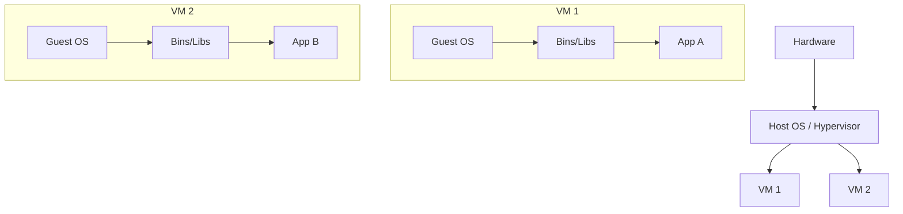
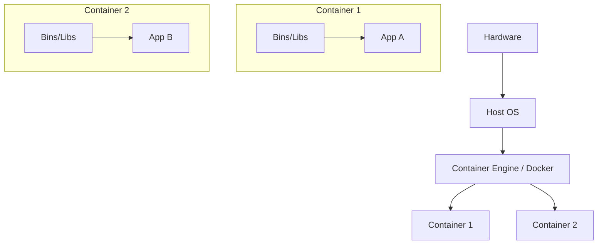
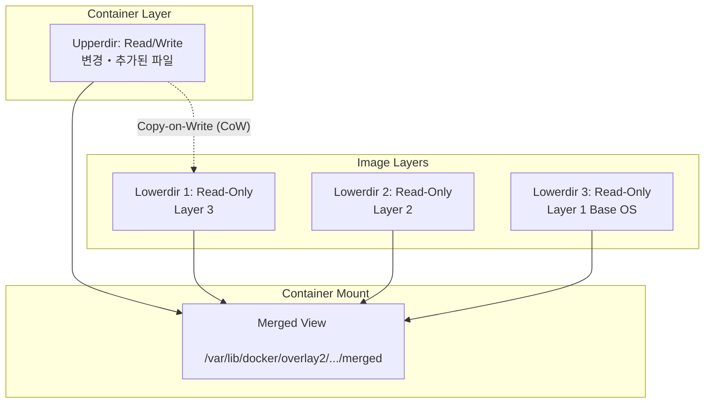
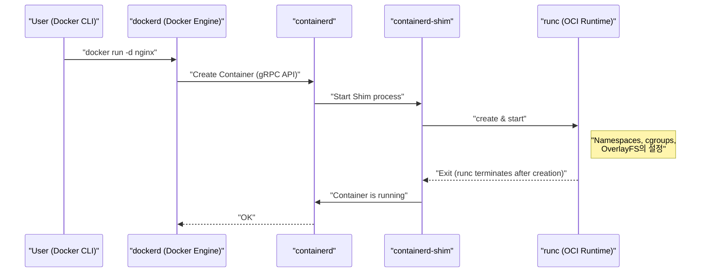
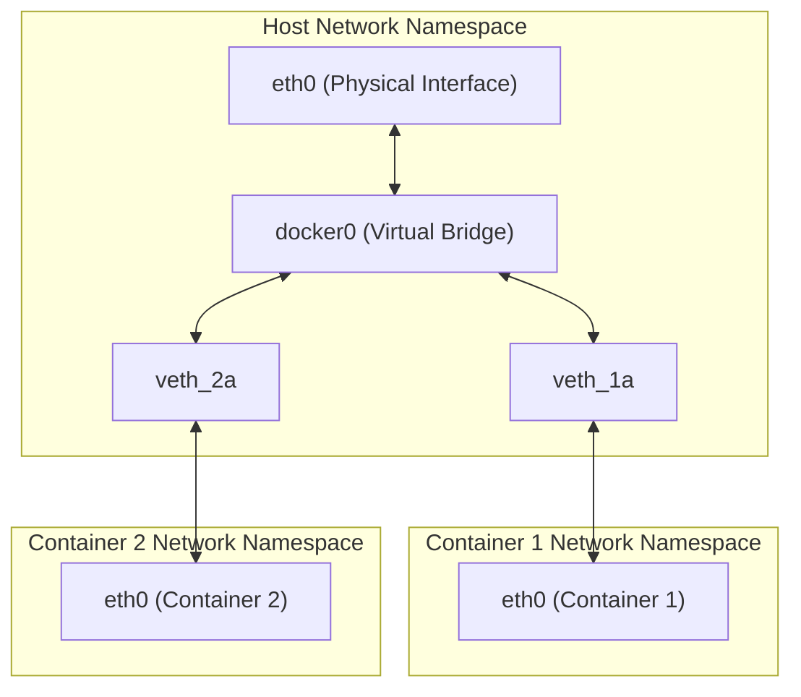

## 1. 들어가며: 컨테이너 기술이란 무엇인가?

많은 개발자에게 Docker는 "환경을 쉽게 구축하고 공유할 수 있는 편리한 도구"로 인식되고 있습니다. 하지만 Docker의 이면에서 어떤 일이 일어나고 있는지, 왜 이렇게까지 가볍고 빠르게 동작하는지 깊이 이해하고 있는 사람은 의외로 적을지도 모릅니다.

본 문서에서는 Docker 명령어의 표면적인 사용법에서 한 걸음 더 나아가, **컨테이너 기술의 본질** 에 다가갑니다. 구체적으로는 컨테이너를 구현하는 Linux 커널의 핵심 기능인 **Namespace** , **cgroups** , 그리고 파일 시스템을 구성하는 **OverlayFS** 등의 메커니즘을 철저하게 해부합니다.

이러한 지식을 갖춤으로써 성능 튜닝이나 보안 강화, 트러블슈팅을 보다 정확하게 수행할 수 있게 됩니다.

## 2. 가상 머신(VM)과 컨테이너의 결정적인 차이

컨테이너를 이해하기 위해 먼저 기존의 가상 머신(Virtual Machine)과의 차이점을 명확히 해두겠습니다.

### 가상 머신의 아키텍처

가상 머신은 물리 서버 위에 하이퍼바이저(VMware ESXi, KVM, Hyper-V 등)를 배치하고, 그 위에서 여러 게스트 OS(Virtual Machine)를 가동합니다.



VM 방식은 하드웨어 수준에서 에뮬레이트하기 때문에 완벽한 격리 환경을 제공합니다. 그러나 각 VM마다 독립적인 커널(Guest OS)을 부팅해야 하므로 부팅 속도가 느리고 메모리나 CPU의 오버헤드가 크다는 단점이 있습니다.

### 컨테이너의 아키텍처

반면, 컨테이너는 **호스트 OS의 커널을 공유** 합니다.



컨테이너는 사실 "격리된 단순한 Linux 프로세스"에 불과합니다. 커널을 부팅하는 프로세스가 필요 없기 때문에 밀리초 단위로 부팅되며, 오버헤드도 최소한으로 억제됩니다.

이처럼 "프로세스를 마치 독립된 OS처럼 격리하는" 마법을 구현하는 것이 다음 장에서 설명할 **Namespace** 와 **cgroups** 입니다.

---

## 3. 컨테이너 격리를 구현하는 "Namespace"

Linux 커널의 **Namespace(이름 공간)** 는 프로세스에 대해 시스템 리소스의 분리된 뷰를 제공하는 기능입니다. 특정 Namespace 내의 프로세스에서는 동일한 Namespace 내의 리소스만 보입니다. 이를 통해 여러 프로세스가 서로 간섭하지 않고 동일한 시스템 위에서 동작할 수 있게 됩니다.

Linux 커널은 주로 다음 6가지 종류의 Namespace를 제공합니다.

### 3.1 PID Namespace(프로세스 ID 격리)

Linux 시스템에서는 부팅 시 PID(Process ID) 1로 `init` 또는 `systemd` 가 실행되며, 이후의 프로세스에는 순차적으로 PID가 할당됩니다.
PID Namespace를 사용하면, 새로운 Namespace 내에서 처음으로 실행된 프로세스에 다시 PID 1이 할당됩니다.

컨테이너 내부에 들어가 `ps aux` 명령어를 실행하면 컨테이너 내에서 실행 중인 프로세스만 보이고 호스트 측 프로세스는 보이지 않습니다. 이것이 PID Namespace 덕분입니다.

### 3.2 Mount Namespace(파일 시스템 격리)

프로세스의 마운트 포인트를 격리합니다. 컨테이너마다 독립적인 루트 디렉터리( `/` )를 가질 수 있는 것은 이 기능 덕분입니다. 호스트의 파일 시스템과는 다른 파일 시스템 트리를 구축하고, 다른 Namespace에 영향을 주지 않으면서 마운트 및 언마운트를 수행할 수 있습니다.

### 3.3 Network Namespace(네트워크 격리)

네트워크 인터페이스, IP 주소, 라우팅 테이블, iptables 규칙 등을 격리합니다. 컨테이너마다 독자적인 IP 주소(예: `172.17.0.2` )를 가지며, 호스트의 네트워크 설정으로부터 독립적으로 통신할 수 있는 것은 Network Namespace 덕분입니다.

### 3.4 UTS Namespace(호스트명 및 도메인명 격리)

호스트명과 NIS 도메인명을 격리합니다. 이를 통해 각 컨테이너가 고유한 호스트명( `hostname` 명령어로 확인할 수 있는 값)을 가질 수 있습니다.

### 3.5 IPC Namespace(프로세스 간 통신 격리)

System V IPC(Inter-Process Communication) 객체와 POSIX 메시지 큐를 격리합니다. 서로 다른 컨테이너의 프로세스가 실수로 공유 메모리에 접근하는 것을 방지합니다.

### 3.6 User Namespace(사용자 및 그룹 격리)

사용자 ID(UID)와 그룹 ID(GID)의 공간을 격리합니다. 이를 통해 컨테이너 내부에서는 **root(UID 0)** 로 동작하는 프로세스가, 호스트 위에서는 **일반 사용자(비특권 사용자)** 로 취급되도록 매핑하는 것이 가능해집니다. 보안 관점에서 매우 중요한 기능입니다.

### 💡 Hands-on: Namespace를 수동으로 생성해보기

Linux의 `unshare` 명령어를 사용하면 Namespace를 수동으로 생성하고 그 안에서 프로세스를 실행할 수 있습니다. Docker를 사용하지 않고 컨테이너의 기초를 체험해 봅시다.

```bash
# 새로운 PID, UTS, Mount Namespace를 생성하고, bash를 실행함
$ sudo unshare --pid --uts --mount --fork --mount-proc /bin/bash

# 호스트명을 변경할 수 있는지 확인 (UTS Namespace의 이점)
root@host# hostname container-test
root@container-test# hostname
container-test

# 프로세스 목록을 확인 (PID Namespace와 Mount Namespace의 이점)
root@container-test# ps aux
USER         PID %CPU %MEM    VSZ   RSS TTY      STAT START   TIME COMMAND
root           1  0.0  0.0   7236  4160 pts/0    S    10:00   0:00 /bin/bash
root          15  0.0  0.0   8892  3280 pts/0    R+   10:01   0:00 ps aux
```

이와 같이 `ps aux` 를 실행해도 호스트의 프로세스는 보이지 않으며, `/bin/bash` 가 PID 1로 동작하고 있음을 알 수 있습니다. 이것이 컨테이너의 기본적인 실체입니다.

---

## 4. 컨테이너의 리소스를 제한하는 "cgroups"

Namespace가 "공간의 격리"를 담당한다면, **cgroups(Control Groups)** 는 "리소스의 제한"을 담당합니다.

만약 어떤 컨테이너가 폭주하여 호스트의 CPU나 메모리를 모두 사용해 버린다면, 다른 컨테이너나 호스트 시스템 자체가 다운되고 맙니다(Noisy Neighbor 문제). 이를 방지하기 위해 프로세스 그룹에 대해 리소스(CPU, 메모리, 디스크 I/O, 네트워크 대역폭 등)의 사용 상한을 설정하는 것이 cgroups의 역할입니다.

### 주요 cgroups 서브시스템

- **cpu** : CPU 스케줄링(사용 시간 비율이나 상한)을 제어합니다.
- **memory** : 메모리 사용량의 상한을 설정하고, 상한에 도달했을 때의 동작(OOM Killer에 의한 프로세스 종료 등)을 제어합니다.
- **blkio** : 블록 디바이스(디스크)에 대한 I/O 대역폭을 제한합니다.
- **pids** : cgroup 내에서 생성할 수 있는 프로세스(스레드) 수를 제한하여, 포크 폭탄(Fork Bomb)과 같은 공격을 방지합니다.

### 💡 Hands-on: cgroups를 수동으로 설정해보기

실제로 메모리 제한을 거는 cgroup을 생성해 봅시다(cgroups v1 예시).

```bash
# 메모리 제한용 그룹을 생성
$ sudo mkdir /sys/fs/cgroup/memory/test_group

# 메모리 상한을 50MB로 설정
$ echo 50000000 | sudo tee /sys/fs/cgroup/memory/test_group/memory.limit_in_bytes

# 현재 프로세스(셸)를 이 그룹에 추가
$ echo $$ | sudo tee /sys/fs/cgroup/memory/test_group/tasks

# 이 상태에서 대량의 메모리를 소비하는 작업을 실행하면 제한에 도달하여 Kill됨
```

Docker를 사용할 경우, `docker run` 명령어에 전달하는 옵션이 이면에서 이러한 cgroups 설정으로 변환됩니다.

```bash
# Docker에서의 메모리 및 CPU 제한 예시
$ docker run -d --name web --memory="256m" --cpus="0.5" nginx
```

---

## 5. 컨테이너의 파일 시스템과 OverlayFS(이미지 계층)

컨테이너의 특징 중 하나로 "이미지의 레이어 구조"가 있습니다. Docker 이미지는 단일한 거대한 파일이 아니라, 여러 계층(레이어)이 겹쳐져 구성되어 있습니다. 이를 구현하는 것이 **Union File System(UnionFS)** , 특히 최근 Linux에서 표준으로 사용되는 **OverlayFS** 입니다.

### OverlayFS의 메커니즘

OverlayFS는 서로 다른 디렉터리(하위 계층과 상위 계층)를 병합하여 하나의 통합된 파일 시스템처럼 보이게 하는 기술입니다.



1. **Lowerdir(하위 디렉터리)** : Docker 이미지의 각 레이어에 해당합니다. 이들은 **Read-Only(읽기 전용)** 로 취급됩니다. 여러 컨테이너가 동일한 이미지를 사용할 경우 이 하위 디렉터리를 공유하므로 디스크 공간을 크게 절약할 수 있습니다.
2. **Upperdir(상위 디렉터리)** : 컨테이너 시작 시 추가되는, 해당 컨테이너 전용의 **Read/Write(읽기/쓰기 가능)** 레이어입니다. 컨테이너 내에서 파일을 생성하거나 변경하면 모두 이 상위 레이어에 기록됩니다.
3. **Merged View** : Lowerdir과 Upperdir을 통합하여 컨테이너에서 보이는 하나의 파일 시스템으로 제공합니다.

### Copy-on-Write (CoW) 전략

컨테이너 내에서 기존 파일(하위 계층에 있는 파일)을 편집하려고 할 때, OverlayFS는 대상 파일을 자동으로 상위 계층(Upperdir)에 복사하고 그 복사본을 수정합니다. 이를 **Copy-on-Write (CoW)** 라고 부릅니다. 하위 계층의 파일 자체는 절대 변경되지 않습니다.

이에 따라 컨테이너를 파기하면 Upperdir도 삭제되어 데이터가 사라집니다. 영속화가 필요한 데이터는 **Docker Volume(바인드 마운트 등)** 을 사용하여 호스트의 디렉터리를 컨테이너 내부에 직접 마운트함으로써 해결합니다.

### Dockerfile과 레이어의 관계

`Dockerfile` 의 각 명령어( `FROM` , `RUN` , `COPY` 등)는 새로운 레이어(Lowerdir)를 1개 생성합니다.

```dockerfile
# Layer 1: 기본 OS
FROM ubuntu:22.04

# Layer 2: 패키지 설치
RUN apt-get update && apt-get install -y python3

# Layer 3: 소스 코드 복사
COPY . /app

# 메타데이터 설정 (레이어는 생성되지 않음)
CMD ["python3", "/app/main.py"]
```

레이어 수를 줄이기 위해 여러 `RUN` 명령어를 `&&` 로 연결하는 기법이 자주 사용되는데, 이는 OverlayFS의 계층이 너무 깊어지는 것을 방지하고 이미지 크기를 작게 유지하기 위한 최적화입니다.

---

## 6. Docker의 아키텍처(Docker Engine, containerd, runc)

초기 Docker는 모든 것이 모놀리식(거대한 하나의 덩어리) 설계였으나, 현재는 기능이 분할되어 표준화(OCI: Open Container Initiative)가 진행되고 있습니다. 현재 컨테이너의 라이프사이클은 아래와 같은 컴포넌트 간의 연동으로 이루어집니다.



1. **Docker CLI** : 사용자가 조작하는 명령줄 도구.
2. **dockerd (Docker Daemon)** : 이미지 빌드, 네트워크 관리, 볼륨 관리 등 고수준의 기능을 제공.
3. **containerd** : 컨테이너 라이프사이클 관리(이미지 pull, 컨테이너 시작/중지)에 특화된 데몬. [Kubernetes](https://kenji.blog/ko/p/kubernetes-k8s-architecture-pod-service-ingress/) 등에서도 사용되는 표준 컴포넌트입니다.
4. **runc** : OCI(Open Container Initiative) 표준을 준수하는 저수준 컨테이너 런타임. 앞서 설명한 Namespace나 cgroups의 설정을 실제로 커널에 지시하고 프로세스를 실행하는 역할을 합니다. 시작이 완료된 후 `runc` 자체는 종료됩니다.
5. **containerd-shim** : 컨테이너 프로세스(PID 1)의 부모 프로세스가 되어, 컨테이너의 표준 입출력을 관리하고 컨테이너 종료 시의 상태를 `containerd` 에 보고합니다. 이를 통해 `dockerd` 나 `containerd` 가 재시작되더라도 컨테이너 자체는 계속 실행될 수 있습니다.

---

## 7. 고도화된 컨테이너 네트워크

마지막으로 Network Namespace와 컨테이너 간 통신 메커니즘에 대해 언급하겠습니다.

Docker의 기본 네트워크 모델은 **Bridge 네트워크** 입니다.



- **veth pair (Virtual Ethernet Pair)** : 두 개의 가상 인터페이스가 쌍을 이룬 것으로, 한쪽에 패킷을 넣으면 다른 쪽으로 나옵니다.
- Docker는 컨테이너를 생성할 때 새로운 Network Namespace를 생성하고, veth pair의 한쪽을 컨테이너 내부(일반적으로 `eth0` 으로 명명됨)에 배치하며, 다른 한쪽을 호스트 측( `vethXXXX` 등)에 배치합니다.
- 호스트 측의 veth는 가상 스위치인 **`docker0` (브리지 디바이스)** 에 연결됩니다.
- 이를 통해 서로 다른 컨테이너 간에 `docker0` 을 경유하여 통신할 수 있으며, 호스트의 라우팅 설정(NAPT / IP Masquerade)에 의해 외부 인터넷과도 통신할 수 있게 됩니다.

---

## 8. 실전: Dockerfile 최적화

지금까지의 지식을 바탕으로 실제 운영에서 성능과 보안을 높이기 위한 `Dockerfile` 작성 방법을 설명합니다.

### 8.1 멀티 스테이지 빌드(Multi-stage build)의 활용

빌드 환경과 실행 환경을 분리함으로써 최종적인 이미지 크기를 극적으로 줄일 수 있습니다. 특히 [Go](https://kenji.blog/ko/p/programming-languages-history-paradigm-evolution/)나 Rust, [Java](https://kenji.blog/ko/p/programming-languages-history-paradigm-evolution/) 등의 컴파일 언어에서 유용합니다.

```dockerfile
# --- Stage 1: Build 환경 ---
FROM golang:1.21 AS builder
WORKDIR /app
COPY go.mod go.sum ./
RUN go mod download
COPY . .
# 정적으로 링크된 바이너리를 빌드
RUN CGO_ENABLED=0 GOOS=linux go build -o main .

# --- Stage 2: 실행 환경 ---
# 베이스 이미지로 가벼운 alpine이나 scratch를 채택
FROM alpine:3.18
WORKDIR /app
# builder 스테이지에서 빌드된 바이너리만 복사
COPY --from=builder /app/main .

# 비특권 사용자를 생성하여 실행 (보안 향상을 위해)
RUN addgroup -S appgroup && adduser -S appuser -G appgroup
USER appuser

EXPOSE 8080
CMD ["./main"]
```

### 8.2 레이어 캐시 효율화

Docker는 빌드 시에 레이어를 위에서부터 순서대로 캐시로 재사용합니다. 자주 변경되는 파일(소스 코드)의 `COPY` 를 뒤로 미룸으로써 캐시 적중률을 높이고 빌드 시간을 단축할 수 있습니다.

### 8.3 최소 베이스 이미지 선택

- **ubuntu/debian** : 범용적이지만 크기가 큽니다.
- **alpine** : 매우 가볍지만(수 MB), 표준 C 라이브러리가 `glibc` 가 아닌 `musl` 이기 때문에 일부 바이너리(Python의 C 확장 모듈 등)에서 호환성 문제가 발생할 수 있습니다.
- **distroless** : Google에서 제공하는, 애플리케이션 실행에 필요한 최소한의 의존성만 가지는 이미지. 셸( `/bin/sh` )조차 포함되어 있지 않으므로 매우 안전합니다(공격자가 컨테이너에 침입해도 명령어를 실행할 수 없음).

---

## 9. 수학적 관점: 리소스 할당 최적화 모델

컨테이너 집적도를 높이는 데 있어, 호스트 머신의 리소스(CPU $C$ , 메모리 $M$ )에 대해 $n$ 개의 컨테이너를 어떻게 배치할지가 과제가 됩니다. 이는 일종의 **빈 패킹 문제(Bin Packing Problem)** 로 정식화할 수 있습니다.

각 컨테이너 $i$ 가 요구하는 CPU를 $c_i$ , 메모리를 $m_i$ 라 하고, 호스트 $j$ 의 용량을 $C_j, M_j$ 라 합니다.
컨테이너 $i$ 가 호스트 $j$ 에 배치될 경우 $x_{ij} = 1$ (그 외에는 $0$ ), 호스트 $j$ 가 사용될 경우 $y_j = 1$ 이라고 하면, 최소한의 호스트 수로 컨테이너를 배치하는 문제는 다음과 같이 나타낼 수 있습니다.

$$
\min \sum_{j=1}^{m} y_j \\\\
\text{조건} \\\\
\sum_{i=1}^{n} c_i x_{ij} \le C_j y_j, \quad \forall j \\\\
\sum_{i=1}^{n} m_i x_{ij} \le M_j y_j, \quad \forall j \\\\
\sum_{j=1}^{m} x_{ij} = 1, \quad \forall i
$$

[Kubernetes](https://kenji.blog/ko/p/kubernetes-k8s-architecture-pod-service-ingress/) 등의 오케스트레이터의 스케줄러는 내부적으로 이러한 제약 충족 문제(스코어링을 통한 휴리스틱한 근사)를 풀면서 적절한 노드에 컨테이너를 할당합니다.

---

## 10. 요약

본 문서에서는 Docker의 이면에서 작동하는 컨테이너 기술의 심연을 탐구했습니다.

1. **Namespace** 를 통한 프로세스, 네트워크, 파일 시스템 등의 "공간 격리".
2. **cgroups** 를 통한 CPU나 메모리 같은 "리소스 제한".
3. **OverlayFS** 를 통한 레이어 구조와 Copy-on-Write를 사용한 효율적인 파일 시스템 관리.
4. OCI 표준에 기반한, `containerd` 와 `runc` 를 사용한 모듈식 아키텍처.
5. 가상 브리지와 veth pair를 사용한 네트워크 구성.

컨테이너는 결코 마법의 상자가 아니라, Linux 커널의 견고한 기능들의 조합을 통해 구현된 **"세련된 프로세스 관리 기법"** 입니다. 이 근본적인 메커니즘을 이해함으로써 Dockerfile 최적화나 트러블슈팅, 나아가 [Kubernetes](https://kenji.blog/ko/p/kubernetes-k8s-architecture-pod-service-ingress/) 등 고도화된 오케스트레이션 도구에 대한 이해가 한층 깊어질 것입니다.

다음에 컨테이너를 구축할 때는 꼭 "지금, 이면에서 Namespace가 생성되고 OverlayFS가 마운트되고 있겠구나"라고 상상하며 명령어를 입력해 보세요. 개발 경험이 더욱 풍부해질 것입니다.
