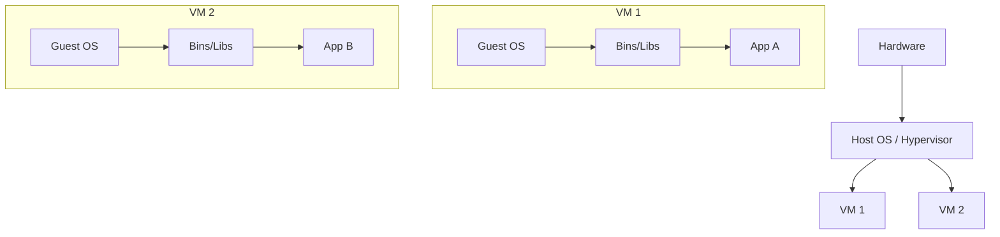
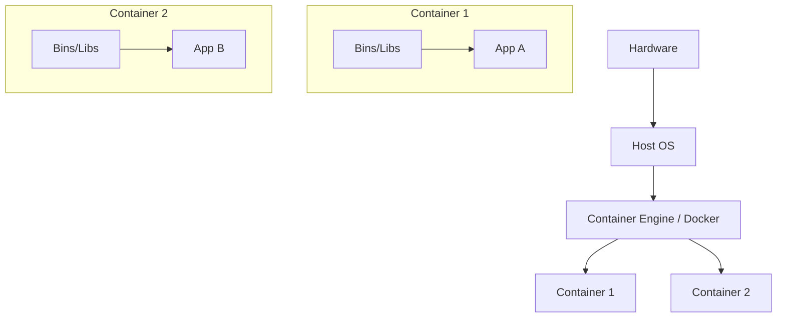
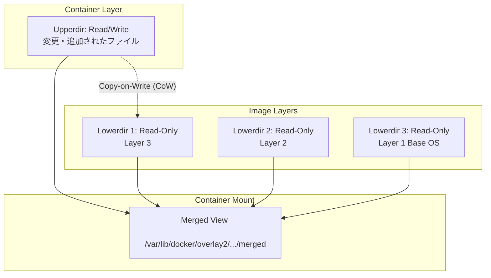
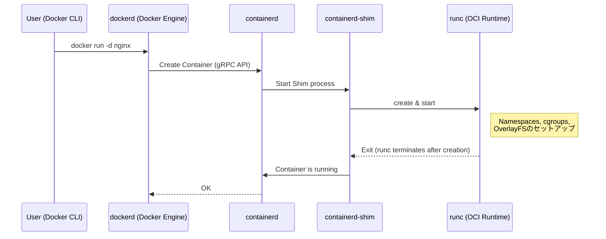

## 1. はじめに：コンテナ技術とは何か？

多くの開発者にとって、Dockerは「環境を簡単に構築・共有できる便利なツール」として認識されています。しかし、Dockerの裏側で何が起きているのか、なぜこれほどまでに軽量で高速に動作するのかを深く理解している人は意外と少ないかもしれません。

本記事では、Dockerコマンドの表層的な使い方から一歩踏み込み、 **コンテナ技術の本質** に迫ります。具体的には、コンテナを実現しているLinuxカーネルのコア機能である **Namespace** 、 **cgroups** 、そしてファイルシステムを構成する **OverlayFS** などの仕組みを徹底的に解剖します。

これらの知識を持つことで、パフォーマンスチューニングやセキュリティの強化、トラブルシューティングをより的確に行うことができるようになります。

## 2. 仮想マシン（VM）とコンテナの決定的な違い

コンテナを理解する上で、まずは従来の仮想マシン（Virtual Machine）との違いを明確にしておきましょう。

### 仮想マシンのアーキテクチャ

仮想マシンは、物理サーバー上にハイパーバイザー（VMware ESXi, KVM, Hyper-Vなど）を配置し、その上で複数のゲストOS（Virtual Machine）を稼働させます。



VMのアプローチは、ハードウェアレベルからエミュレートするため、完全な隔離環境を提供します。しかし、各VMごとに独立したカーネル（Guest OS）を起動する必要があるため、起動が遅く、メモリやCPUのオーバーヘッドが大きいという課題があります。

### コンテナのアーキテクチャ

一方、コンテナは **ホストOSのカーネルを共有** します。



コンテナは実のところ、「隔離されたただのLinuxプロセス」に過ぎません。カーネルを起動するプロセスが不要なため、ミリ秒単位で起動し、オーバーヘッドも最小限に抑えられます。

この「プロセスをあたかも独立したOSのように隔離する」魔法を実現しているのが、次章で解説する **Namespace** と **cgroups** です。

---

## 3. コンテナの隔離を実現する「Namespace」

Linuxカーネルの **Namespace（名前空間）** は、プロセスに対してシステムリソースの分離されたビューを提供する機能です。あるNamespace内のプロセスからは、同じNamespace内のリソースしか見えません。これにより、複数のプロセスが互いに干渉することなく、同じシステム上で動作することが可能になります。

Linuxカーネルは、主に以下の6種類のNamespaceを提供しています。

### 3.1 PID Namespace（プロセスIDの隔離）

Linuxシステムでは、起動時にPID（Process ID）1として `init` または `systemd` が起動し、以降のプロセスには連番でPIDが割り当てられます。
PID Namespaceを使用すると、新しいNamespace内で最初に起動したプロセスに再びPID 1が割り当てられます。

コンテナの内部に入って `ps aux` コマンドを実行すると、コンテナ内で実行されているプロセスしか見えず、ホスト側のプロセスは見えません。これはPID Namespaceによるものです。

### 3.2 Mount Namespace（ファイルシステムの隔離）

プロセスのマウントポイントを隔離します。コンテナごとに独立したルートディレクトリ（ `/` ）を持つことができるのはこの機能のおかげです。ホストのファイルシステムとは別のファイルシステムツリーを構築し、他のNamespaceには影響を与えずにマウント・アンマウントを行えます。

### 3.3 Network Namespace（ネットワークの隔離）

ネットワークインターフェース、IPアドレス、ルーティングテーブル、iptablesルールなどを隔離します。コンテナごとに独自のIPアドレス（例： `172.17.0.2` ）を持ち、ホストのネットワーク設定から独立して通信できるのはNetwork Namespaceのおかげです。

### 3.4 UTS Namespace（ホスト名とドメイン名の隔離）

ホスト名とNISドメイン名を隔離します。これにより、各コンテナが独自のホスト名（ `hostname` コマンドで確認できる値）を持つことができます。

### 3.5 IPC Namespace（プロセス間通信の隔離）

System V IPC（Inter-Process Communication）オブジェクトやPOSIX[メッセージキュー](https://kenji.blog/p/event-driven-architecture-message-queue-kafka-rabbitmq/)を隔離します。異なるコンテナのプロセスが誤って共有メモリにアクセスしてしまうのを防ぎます。

### 3.6 User Namespace（ユーザーとグループの隔離）

ユーザーID（UID）とグループID（GID）の空間を隔離します。これにより、コンテナ内部では **root（UID 0）** として動作しているプロセスが、ホスト上では **一般ユーザー（非特権ユーザー）** として扱われるようにマッピングすることが可能になります。セキュリティの観点から非常に重要な機能です。

### 💡 Hands-on: Namespaceを手動で作成してみる

Linuxの `unshare` コマンドを使うと、Namespaceを手動で作成し、その中でプロセスを実行することができます。Dockerを使わずにコンテナの基礎を体感してみましょう。

```bash
# 新しいPID, UTS, Mount Namespaceを作成し、bashを実行する
$ sudo unshare --pid --uts --mount --fork --mount-proc /bin/bash

# ホスト名が変更できるか確認（UTS Namespaceの恩恵）
root@host# hostname container-test
root@container-test# hostname
container-test

# プロセス一覧を確認（PID NamespaceとMount Namespaceの恩恵）
root@container-test# ps aux
USER         PID %CPU %MEM    VSZ   RSS TTY      STAT START   TIME COMMAND
root           1  0.0  0.0   7236  4160 pts/0    S    10:00   0:00 /bin/bash
root          15  0.0  0.0   8892  3280 pts/0    R+   10:01   0:00 ps aux
```

このように、 `ps aux` を実行してもホストのプロセスは見えず、 `/bin/bash` がPID 1として動作していることがわかります。これがコンテナの基本的な正体です。

---

## 4. コンテナのリソース制限を行う「cgroups」

Namespaceが「空間の隔離」を担当するのに対し、 **cgroups（Control Groups）** は「リソースの制限」を担当します。

もしあるコンテナが暴走してホストのCPUやメモリを使い果たしてしまったら、他のコンテナやホストシステム自体がダウンしてしまいます（Noisy Neighbor問題）。これを防ぐために、プロセスグループに対してリソース（CPU、メモリ、ディスクI/O、ネットワーク帯域など）の利用上限を設定するのがcgroupsの役割です。

### 主要なcgroupsサブシステム

- **cpu** : CPUのスケジューリング（使用時間の割合や上限）を制御します。
- **memory** : メモリの使用量の上限を設定し、上限に達した場合の挙動（OOM Killerによるプロセス終了など）を制御します。
- **blkio** : ブ[ロック](https://kenji.blog/p/rdbms-transaction-acid-isolation-level-lock/)デバイス（ディスク）へのI/O帯域幅を制限します。
- **pids** : cgroup内で作成できるプロセス（スレッド）の数を制限し、フォーク爆弾（Fork Bomb）などの攻撃を防ぎます。

### 💡 Hands-on: cgroupsを手動で設定してみる

実際にメモリ制限をかけるcgroupを作成してみましょう（cgroups v1の例）。

```bash
# メモリ制限用のグループを作成
$ sudo mkdir /sys/fs/cgroup/memory/test_group

# メモリ上限を50MBに設定
$ echo 50000000 | sudo tee /sys/fs/cgroup/memory/test_group/memory.limit_in_bytes

# 現在のプロセス（シェル）をこのグループに追加
$ echo $$ | sudo tee /sys/fs/cgroup/memory/test_group/tasks

# この状態で大量のメモリを消費する処理を実行すると、制限に達してKillされます
```

Dockerを使用する場合、 `docker run` コマンドに渡すオプションが、裏側でこれらのcgroupsの設定に変換されています。

```bash
# DockerでのメモリとCPUの制限例
$ docker run -d --name web --memory="256m" --cpus="0.5" nginx
```

---

## 5. コンテナのファイルシステムとOverlayFS（イメージ層）

コンテナの特徴の一つとして「イメージのレイヤー構造」があります。Dockerイメージは単一の巨大なファイルではなく、複数の層（レイヤー）が重なり合って構成されています。これを実現しているのが **Union File System（UnionFS）** 、特に最近のLinuxで標準的に使われている **OverlayFS** です。

### OverlayFSの仕組み

OverlayFSは、異なるディレクトリ（下層と上層）をマージし、1つの統合されたファイルシステムとして見せる技術です。



1. **Lowerdir（下層ディレクトリ）** : Dockerイメージの各レイヤーにあたります。これらは **Read-Only（読み取り専用）** として扱われます。複数のコンテナが同じイメージを使用する場合、この下層ディレクトリを共有するため、ディスクスペースを大幅に節約できます。
2. **Upperdir（上層ディレクトリ）** : コンテナ起動時に追加される、そのコンテナ専用の **Read/Write（読み書き可能）** なレイヤーです。コンテナ内でファイルを作成したり変更したりすると、すべてこの上層レイヤーに書き込まれます。
3. **Merged View** : LowerdirとUpperdirを統合して、コンテナから見える1つのファイルシステムとして提供します。

### Copy-on-Write (CoW) 戦略

コンテナ内で既存のファイル（下層にあるファイル）を編集しようとした場合、OverlayFSは対象のファイルを自動的に上層（Upperdir）にコピーし、そのコピーに対して変更を加えます。これを **Copy-on-Write (CoW)** と呼びます。下層のファイル自体は決して変更されません。

これにより、コンテナを破棄すればUpperdirも削除され、データは消えます。永続化が必要なデータは、 **Docker Volume（バインドマウントなど）** を使ってホストのディレクトリを直接コンテナ内にマウントすることで解決します。

### Dockerfileとレイヤーの関係

`Dockerfile` の各命令（ `FROM` , `RUN` , `COPY` など）は、新しいレイヤー（Lowerdir）を1つ生成します。

```dockerfile
# Layer 1: ベースOS
FROM ubuntu:22.04

# Layer 2: パッケージのインストール
RUN apt-get update && apt-get install -y python3

# Layer 3: ソースコードのコピー
COPY . /app

# メタデータの設定（レイヤーは生成されない）
CMD ["python3", "/app/main.py"]
```

レイヤー数を減らすために、複数の `RUN` コマンドを `&&` で繋ぐテクニックがよく使われますが、これはOverlayFSの層が深くなりすぎるのを防ぎ、イメージサイズを小さく保つための最適化です。

---

## 6. Dockerのアーキテクチャ（Docker Engine, containerd, runc）

初期のDockerはすべてがモノリシック（巨大な一つの塊）な設計でしたが、現在では機能が分割され、標準化（OCI: Open Container Initiative）が進んでいます。現在のコンテナのライフサイクルは以下のようなコンポーネントの連携で成り立っています。



1. **Docker CLI** : ユーザーが操作するコマンドラインツール。
2. **dockerd (Docker Daemon)** : イメージのビルド、ネットワーク管理、ボリューム管理など、高レベルな機能を提供。
3. **containerd** : コンテナのライフサイクル管理（イメージのpull、コンテナの起動・停止）に特化したデーモン。[Kubernetes](https://kenji.blog/p/kubernetes-k8s-architecture-pod-service-ingress/)などでも利用されている標準的なコンポーネントです。
4. **runc** : OCI（Open Container Initiative）標準に準拠した低レベルなコンテナランタイム。前述した Namespace や cgroups の設定を実際にカーネルに対して行い、プロセスを起動する役割を持ちます。起動完了後、 `runc` 自体は終了します。
5. **containerd-shim** : コンテナプロセス（PID 1）の親プロセスとなり、コンテナの標準入出力を管理し、コンテナ終了時のステータスを `containerd` に報告します。これにより、 `dockerd` や `containerd` が再起動しても、コンテナ自体は動き続けることができます。

---

## 7. 高度なコンテナネットワーク

最後に、Network Namespaceとコンテナ間の通信の仕組みについて触れておきましょう。

Dockerのデフォルトネットワークモデルは **Bridgeネットワーク** です。

```mermaid
graph TD
    subgraph Host Network Namespace
        Eth0[eth0 (Physical Interface)]
        Docker0[docker0 (Virtual Bridge)]
        VethHost1[veth_1a]
        VethHost2[veth_2a]
        
        Eth0 <--> Docker0
        Docker0 <--> VethHost1
        Docker0 <--> VethHost2
    end
    
    subgraph Container 1 Network Namespace
        Eth0C1[eth0 (Container 1)]
    end
    
    subgraph Container 2 Network Namespace
        Eth0C2[eth0 (Container 2)]
    end
    
    VethHost1 <--> Eth0C1
    VethHost2 <--> Eth0C2
```

- **veth pair (Virtual Ethernet Pair)** : 2つの仮想インターフェースがペアになったもので、片方にパケットを入れるともう片方から出てきます。
- Dockerはコンテナを作成する際、新しいNetwork Namespaceを作成し、veth pairの片方をコンテナ内（通常 `eth0` と命名される）に配置し、もう片方をホスト側（ `vethXXXX` など）に配置します。
- ホスト側のvethは、仮想スイッチである **`docker0`（ブリッジデバイス）** に接続されます。
- これにより、異なるコンテナ同士が `docker0` 経由で通信でき、またホストのルーティング設定（NAPT / IPマスカレード）により、外部インターネットとも通信できるようになります。

---

## 8. 実践：Dockerfileの最適化

ここまでの知識を踏まえ、実世界の運用においてパフォーマンスとセキュリティを高めるための `Dockerfile` の書き方を解説します。

### 8.1 マルチステージビルド（Multi-stage build）の活用

ビルド環境と実行環境を分離することで、最終的なイメージサイズを劇的に縮小できます。特に[Go](https://kenji.blog/p/programming-languages-history-paradigm-evolution/)や[Rust](https://kenji.blog/p/programming-languages-history-paradigm-evolution/)、[Java](https://kenji.blog/p/programming-languages-history-paradigm-evolution/)などのコンパイル言語で有効です。

```dockerfile
# --- Stage 1: Build環境 ---
FROM golang:1.21 AS builder
WORKDIR /app
COPY go.mod go.sum ./
RUN go mod download
COPY . .
# 静的リンクされたバイナリをビルド
RUN CGO_ENABLED=0 GOOS=linux go build -o main .

# --- Stage 2: 実行環境 ---
# ベースイメージとして軽量なalpineやscratchを採用
FROM alpine:3.18
WORKDIR /app
# builderステージからビルド済みのバイナリのみをコピー
COPY --from=builder /app/main .

# 非特権ユーザーを作成して実行（セキュリティ向上のため）
RUN addgroup -S appgroup && adduser -S appuser -G appgroup
USER appuser

EXPOSE 8080
CMD ["./main"]
```

### 8.2 レイヤーキャッシュの効率化

Dockerはビルド時にレイヤーを上から順にキャッシュとして再利用します。変更されやすいファイル（ソースコード）の `COPY` を後回しにすることで、キャッシュのヒット率を高め、ビルド時間を短縮できます。

### 8.3 最小のベースイメージの選択

- **ubuntu/debian** : 汎用的だがサイズが大きい。
- **alpine** : 非常に軽量（数MB）だが、標準Cライブラリが `glibc` ではなく `musl` であるため、一部のバイナリ（PythonのC拡張モジュールなど）で互換性の問題が起きる可能性がある。
- **distroless** : Googleが提供している、アプリケーションの実行に必要な最小限の依存関係しか持たないイメージ。シェル（ `/bin/sh` ）すら含まれていないため、極めてセキュア（攻撃者がコンテナに侵入してもコマンドを実行できない）。

---

## 9. 数学的な視点：リソース割り当ての最適化モデル

コンテナの集積度を高める上で、ホストマシンのリソース（CPU $C$ 、メモリ $M$ ）に対して、$n$ 個のコンテナをどのように配置するかが課題となります。これは一種の **ビンパッキング問題（Bin Packing Problem）** として定式化できます。

各コンテナ $i$ が要求するCPUを $c_i$ 、メモリを $m_i$ とし、ホスト $j$ の容量を $C_j, M_j$ とします。
コンテナ $i$ がホスト $j$ に配置される場合に $x_{ij} = 1$ （それ以外は $0$ ）、ホスト $j$ が使用される場合に $y_j = 1$ とすると、最小のホスト数でコンテナを配置する問題は以下のように表せます。

$$
\min \sum_{j=1}^{m} y_j \\\\
\text{subject to} \\\\
\sum_{i=1}^{n} c_i x_{ij} \le C_j y_j, \quad \forall j \\\\
\sum_{i=1}^{n} m_i x_{ij} \le M_j y_j, \quad \forall j \\\\
\sum_{j=1}^{m} x_{ij} = 1, \quad \forall i
$$

[Kubernetes](https://kenji.blog/p/kubernetes-k8s-architecture-pod-service-ingress/)などのオーケストレーターのスケジューラーは、内部的にこのような制約充足問題（スコアリングによるヒューリスティックな近似）を解きながら、適切なノードにコンテナを割り当てています。

---

## 10. まとめ

本記事では、Dockerの裏側で動いているコンテナ技術の深淵を探求しました。

1. **Namespace** によるプロセス、ネットワーク、ファイルシステムなどの「空間の隔離」。
2. **cgroups** によるCPUやメモリといった「リソースの制限」。
3. **OverlayFS** によるレイヤー構造とCopy-on-Writeによる効率的なファイルシステム管理。
4. OCI標準に基づいた、 `containerd` や `runc` によるモジュラーなアーキテクチャ。
5. 仮想ブリッジとveth pairによるネットワーク構成。

コンテナは決して魔法の箱ではなく、Linuxカーネルの堅牢な機能の組み合わせによって実現された **「洗練されたプロセス管理手法」** です。この根本的な仕組みを理解することで、Dockerfileの最適化やトラブルシューティング、さらには[Kubernetes](https://kenji.blog/p/kubernetes-k8s-architecture-pod-service-ingress/)等の高度なオーケストレーションツールの理解が一段と深まるはずです。

次回のコンテナ構築時には、ぜひ「今、裏側でNamespaceが作られ、OverlayFSがマウントされているんだな」と想像しながらコマンドを叩いてみてください。開発体験がより豊かなものになることでしょう。
