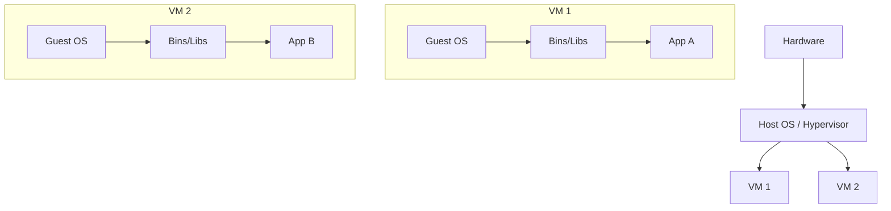
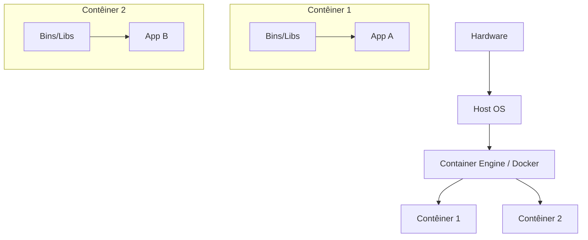
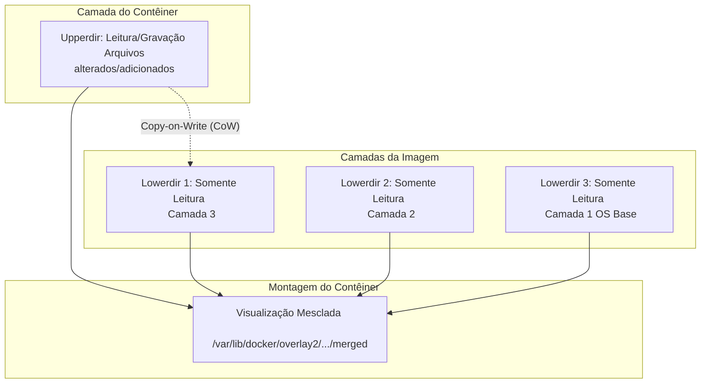
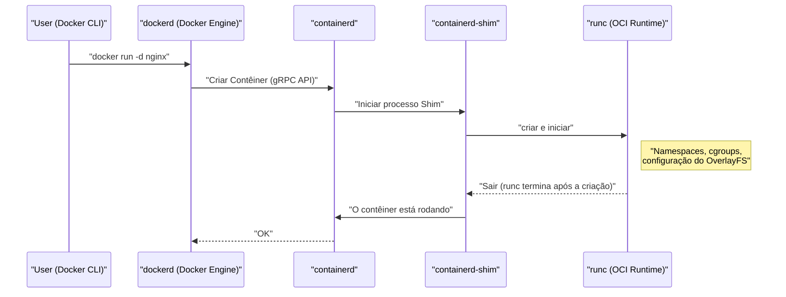
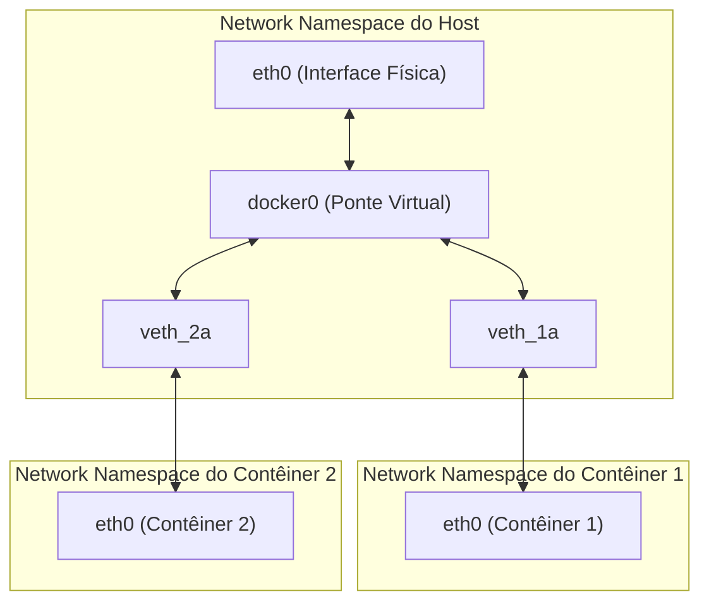

## 1. Introdução: O que é a tecnologia de contêineres?

Para muitos desenvolvedores, o Docker é reconhecido como uma "ferramenta conveniente que permite criar e compartilhar ambientes de forma fácil". No entanto, o que acontece nos bastidores do Docker e por que ele funciona de forma tão leve e rápida é surpreendentemente pouco compreendido por muitas pessoas.

Neste artigo, vamos dar um passo além do uso superficial dos comandos Docker e nos aprofundar na **essência da tecnologia de contêineres**. Especificamente, dissecaremos completamente mecanismos como o **Namespace** e os **cgroups**, que são funções principais do kernel Linux que implementam contêineres, e o **OverlayFS**, que compõe o sistema de arquivos.

Ter esse conhecimento permitirá que você faça ajustes de desempenho, fortaleça a segurança e realize a solução de problemas com maior precisão.

## 2. A diferença crucial entre Máquina Virtual (VM) e Contêiner

Para entender os contêineres, vamos primeiro esclarecer a diferença em relação às Máquinas Virtuais (Virtual Machine) tradicionais.

### Arquitetura de Máquina Virtual

Uma máquina virtual implanta um hypervisor (VMware ESXi, KVM, Hyper-V, etc.) em um servidor físico e executa vários SOs convidados (Virtual Machine) sobre ele.



A abordagem da VM oferece um ambiente completamente isolado, pois emula desde o nível do hardware. No entanto, como é necessário inicializar um kernel independente (Guest OS) para cada VM, a inicialização é lenta e há o desafio de uma grande sobrecarga (overhead) de memória e CPU.

### Arquitetura do Contêiner

Por outro lado, os contêineres **compartilham o kernel do Host OS**.



Os contêineres, na verdade, não passam de "processos Linux isolados". Como não precisam de um processo que inicializa o kernel, eles iniciam em milissegundos, mantendo a sobrecarga mínima.

A mágica de "isolar processos como se fossem um SO independente" é possibilitada pelo **Namespace** e pelos **cgroups**, que serão explicados no próximo capítulo.

---

## 3. "Namespace": possibilitando o isolamento de contêineres

O **Namespace (espaço de nomes)** do kernel Linux é uma função que fornece uma visão isolada dos recursos do sistema para um processo. Um processo dentro de um Namespace pode ver apenas os recursos desse mesmo Namespace. Isso permite que vários processos operem no mesmo sistema sem interferir uns nos outros.

O kernel Linux fornece principalmente 6 tipos de Namespace:

### 3.1 PID Namespace (Isolamento de ID de processo)

Em sistemas Linux, o `init` ou `systemd` é iniciado com o PID (Process ID) 1 durante a inicialização, e os processos subsequentes recebem PIDs sequenciais.
Ao usar o PID Namespace, o PID 1 é atribuído novamente ao primeiro processo iniciado no novo Namespace.

Quando você entra em um contêiner e executa o comando `ps aux`, pode ver apenas os processos rodando no contêiner e não os processos do host. Isso se deve ao PID Namespace.

### 3.2 Mount Namespace (Isolamento do sistema de arquivos)

Isola os pontos de montagem dos processos. É graças a essa função que cada contêiner pode ter um diretório raiz independente (`/`). Ela constrói uma árvore do sistema de arquivos separada do sistema de arquivos do host e pode montar ou desmontar sem afetar outros Namespaces.

### 3.3 Network Namespace (Isolamento de rede)

Isola interfaces de rede, endereços IP, tabelas de roteamento, regras do iptables, etc. É graças ao Network Namespace que cada contêiner possui seu próprio endereço IP (ex: `172.17.0.2`) e pode se comunicar independentemente das configurações de rede do host.

### 3.4 UTS Namespace (Isolamento de nomes de host e domínio)

Isola nomes de host e nomes de domínio NIS. Isso permite que cada contêiner possua um nome de host único (o valor que pode ser verificado com o comando `hostname`).

### 3.5 IPC Namespace (Isolamento de comunicação entre processos)

Isola objetos System V IPC (Inter-Process Communication) e filas de mensagens POSIX. Evita que processos de contêineres diferentes acessem memória compartilhada acidentalmente.

### 3.6 User Namespace (Isolamento de usuários e grupos)

Isola o espaço dos IDs de usuário (UID) e IDs de grupo (GID). Isso permite mapear processos que operam como **root (UID 0)** dentro do contêiner para que sejam tratados como **usuário comum (usuário não privilegiado)** no host. É uma função extremamente importante sob a perspectiva de segurança.

### 💡 Hands-on: Tentando criar um Namespace manualmente

Você pode criar um Namespace manualmente e executar um processo dentro dele usando o comando `unshare` do Linux. Vamos experimentar os conceitos básicos dos contêineres sem usar o Docker.

```bash
# Cria um novo PID, UTS, Mount Namespace e executa o bash
$ sudo unshare --pid --uts --mount --fork --mount-proc /bin/bash

# Verifica se o nome do host pode ser alterado (benefício do UTS Namespace)
root@host# hostname container-test
root@container-test# hostname
container-test

# Verifica a lista de processos (benefício do PID Namespace e Mount Namespace)
root@container-test# ps aux
USER         PID %CPU %MEM    VSZ   RSS TTY      STAT START   TIME COMMAND
root           1  0.0  0.0   7236  4160 pts/0    S    10:00   0:00 /bin/bash
root          15  0.0  0.0   8892  3280 pts/0    R+   10:01   0:00 ps aux
```

Desta forma, mesmo executando `ps aux`, os processos do host não são vistos e o `/bin/bash` está operando como PID 1. Esta é a verdadeira forma básica de um contêiner.

---

## 4. "cgroups": limitando os recursos dos contêineres

Enquanto o Namespace cuida do "isolamento de espaço", os **cgroups (Control Groups)** cuidam da "limitação de recursos".

Se um contêiner sair de controle e esgotar a CPU ou a memória do host, outros contêineres ou o próprio sistema do host serão derrubados (Problema do Vizinho Barulhento - Noisy Neighbor). Para evitar isso, o papel dos cgroups é definir um limite máximo de uso para recursos (CPU, memória, E/S de disco, largura de banda de rede, etc.) por grupos de processos.

### Principais subsistemas dos cgroups

- **cpu** : Controla o agendamento da CPU (proporção ou limite de tempo de uso).
- **memory** : Define um limite para o uso de memória e controla o comportamento quando esse limite é atingido (como encerrar processos pelo OOM Killer).
- **blkio** : Limita a largura de banda de E/S para dispositivos de bloco (discos).
- **pids** : Limita o número de processos (threads) que podem ser criados dentro de um cgroup, prevenindo ataques como a bomba fork (Fork Bomb).

### 💡 Hands-on: Tentando configurar os cgroups manualmente

Vamos criar um cgroup que aplica uma limitação de memória (exemplo do cgroups v1).

```bash
# Cria um grupo para limite de memória
$ sudo mkdir /sys/fs/cgroup/memory/test_group

# Define o limite de memória para 50MB
$ echo 50000000 | sudo tee /sys/fs/cgroup/memory/test_group/memory.limit_in_bytes

# Adiciona o processo atual (shell) a este grupo
$ echo $$ | sudo tee /sys/fs/cgroup/memory/test_group/tasks

# Se você executar um processo que consuma muita memória neste estado, o limite será atingido e ele será encerrado (Killed)
```

Ao usar o Docker, as opções passadas ao comando `docker run` são convertidas nessas configurações de cgroups nos bastidores.

```bash
# Exemplo de limitação de memória e CPU com Docker
$ docker run -d --name web --memory="256m" --cpus="0.5" nginx
```

---

## 5. O sistema de arquivos do contêiner e o OverlayFS (Camadas de imagem)

Uma das características dos contêineres é a "estrutura em camadas de imagens". Uma imagem Docker não é um arquivo enorme e único, mas é composta de várias camadas sobrepostas. O que possibilita isso é o **Union File System (UnionFS)**, especialmente o **OverlayFS** usado como padrão nas distribuições Linux recentes.

### Mecanismo do OverlayFS

O OverlayFS é uma tecnologia que mescla diferentes diretórios (inferiores e superiores) e os apresenta como um sistema de arquivos unificado.



1. **Lowerdir (Diretórios inferiores)** : Corresponde a cada camada da imagem Docker. Eles são tratados como **Read-Only (Somente leitura)**. Quando vários contêineres usam a mesma imagem, eles compartilham este diretório inferior, economizando significativamente espaço em disco.
2. **Upperdir (Diretório superior)** : É a camada **Read/Write (Leitura/Gravação)** exclusiva do contêiner adicionada no momento da sua inicialização. Quaisquer criações ou modificações de arquivos dentro do contêiner são gravadas nesta camada superior.
3. **Merged View** : Integra o Lowerdir e o Upperdir e os fornece como um sistema de arquivos único visto do contêiner.

### Estratégia Copy-on-Write (CoW)

Quando você tenta editar um arquivo existente (um arquivo nas camadas inferiores) dentro de um contêiner, o OverlayFS copia automaticamente esse arquivo para a camada superior (Upperdir) e aplica as alterações na cópia. Isso é chamado de **Copy-on-Write (CoW)**. Os arquivos nas camadas inferiores nunca são alterados em si mesmos.

Como resultado disso, ao destruir um contêiner, o Upperdir também é excluído e os dados desaparecem. Para dados que exigem persistência, isso é resolvido usando o **Docker Volume (como o bind mount)** para montar um diretório do host diretamente dentro do contêiner.

### Relação entre o Dockerfile e as camadas

Cada instrução (`FROM`, `RUN`, `COPY`, etc.) no `Dockerfile` gera uma nova camada (Lowerdir).

```dockerfile
# Camada 1: SO Base
FROM ubuntu:22.04

# Camada 2: Instalação de pacotes
RUN apt-get update && apt-get install -y python3

# Camada 3: Cópia do código fonte
COPY . /app

# Configuração de metadados (nenhuma camada é gerada)
CMD ["python3", "/app/main.py"]
```

A técnica de conectar vários comandos `RUN` com `&&` é comumente usada para reduzir o número de camadas; trata-se de uma otimização para evitar que as camadas do OverlayFS fiquem profundas demais e manter o tamanho da imagem pequeno.

---

## 6. Arquitetura do Docker (Docker Engine, containerd, runc)

O Docker inicial era um projeto totalmente monolítico (um único bloco enorme), mas hoje as funções são divididas e a padronização (OCI: Open Container Initiative) está avançando. O ciclo de vida dos contêineres atualmente é composto pela cooperação dos seguintes componentes.



1. **Docker CLI** : Ferramenta de linha de comando operada pelo usuário.
2. **dockerd (Docker Daemon)** : Fornece recursos de alto nível, como criação de imagens, gerenciamento de rede e gerenciamento de volumes.
3. **containerd** : Daemon especializado no gerenciamento do ciclo de vida dos contêineres (obtenção de imagens, iniciar e parar contêineres). É um componente padrão usado também pelo [Kubernetes](https://kenji.blog/pt/p/kubernetes-k8s-architecture-pod-service-ingress/).
4. **runc** : Um runtime de contêiner de baixo nível compatível com o padrão OCI (Open Container Initiative). Ele tem o papel de realmente aplicar as configurações de Namespace e cgroups ao kernel e iniciar os processos. Após a conclusão da inicialização, o próprio `runc` é encerrado.
5. **containerd-shim** : Torna-se o processo pai do processo do contêiner (PID 1), gerencia a entrada/saída padrão do contêiner e relata o status na finalização do contêiner para o `containerd`. Isso permite que o contêiner em si continue operando, mesmo que o `dockerd` ou o `containerd` sejam reiniciados.

---

## 7. Redes avançadas de contêineres

Finalmente, vamos abordar o Network Namespace e como funciona a comunicação entre contêineres.

O modelo de rede padrão do Docker é a **Rede Bridge**.



- **veth pair (Virtual Ethernet Pair)** : São duas interfaces virtuais emparelhadas; pacotes inseridos em uma saem pela outra.
- Ao criar um contêiner, o Docker cria um novo Network Namespace, coloca uma ponta do veth pair dentro do contêiner (geralmente nomeado `eth0`) e a outra ponta no lado do host (como `vethXXXX`).
- O veth do lado do host está conectado a um switch virtual, o **`docker0` (dispositivo bridge)**.
- Com isso, diferentes contêineres podem se comunicar uns com os outros por meio do `docker0` e, graças à configuração de roteamento do host (NAPT / IP Masquerade), também podem se comunicar com a Internet externa.

---

## 8. Prática: Otimização do Dockerfile

Com base no conhecimento até aqui, explicaremos como escrever um `Dockerfile` para melhorar o desempenho e a segurança em operações no mundo real.

### 8.1 Aproveitamento de Multi-stage build (Compilação em vários estágios)

Separar os ambientes de construção e execução pode reduzir drasticamente o tamanho final da imagem. Isto é especialmente eficaz em linguagens compiladas como [Go](https://kenji.blog/pt/p/programming-languages-history-paradigm-evolution/), [Rust](https://kenji.blog/pt/p/programming-languages-history-paradigm-evolution/) e [Java](https://kenji.blog/pt/p/programming-languages-history-paradigm-evolution/).

```dockerfile
# --- Etapa 1: Ambiente de construção ---
FROM golang:1.21 AS builder
WORKDIR /app
COPY go.mod go.sum ./
RUN go mod download
COPY . .
# Compilar binário vinculado estaticamente
RUN CGO_ENABLED=0 GOOS=linux go build -o main .

# --- Etapa 2: Ambiente de execução ---
# Adotar alpine ou scratch leves como imagem base
FROM alpine:3.18
WORKDIR /app
# Copiar apenas os binários pré-compilados do estágio builder
COPY --from=builder /app/main .

# Criar e executar com um usuário sem privilégios (para melhorar a segurança)
RUN addgroup -S appgroup && adduser -S appuser -G appgroup
USER appuser

EXPOSE 8080
CMD ["./main"]
```

### 8.2 Eficiência no cache de camadas

Ao construir, o Docker reutiliza as camadas na ordem, de cima para baixo, como cache. Ao adiar o `COPY` de arquivos que mudam com frequência (o código-fonte), a taxa de acerto do cache aumenta e o tempo de construção pode ser reduzido.

### 8.3 Selecionando a menor imagem base

- **ubuntu/debian** : Versátil, mas com tamanho grande.
- **alpine** : Muito leve (poucos MB), mas como a biblioteca C padrão é a `musl` em vez da `glibc`, podem ocorrer problemas de compatibilidade com alguns binários (como módulos de extensão C para Python).
- **distroless** : Fornecida pelo Google, esta imagem tem apenas as dependências mínimas necessárias para a execução da aplicação. Por não incluir nem mesmo um shell (`/bin/sh`), é extremamente segura (mesmo que um invasor penetre no contêiner, ele não poderá executar comandos).

---

## 9. Perspectiva Matemática: Modelo de otimização de alocação de recursos

Para aumentar a densidade dos contêineres, o desafio está em como alocar $n$ contêineres em relação aos recursos (CPU $C$, memória $M$) da máquina host. Isso pode ser formulado como um tipo de **Problema de Empacotamento de Caixas (Bin Packing Problem)**.

Vamos considerar a CPU requerida por cada contêiner $i$ como $c_i$ e a memória como $m_i$, com as capacidades do host $j$ dadas por $C_j, M_j$.
Seja $x_{ij} = 1$ quando o contêiner $i$ for colocado no host $j$ (caso contrário, $0$), e $y_j = 1$ se o host $j$ for usado, então o problema de colocar contêineres com o mínimo de hosts possíveis é expresso assim:

$$
\min \sum_{j=1}^{m} y_j \\\\
\text{sujeito a} \\\\
\sum_{i=1}^{n} c_i x_{ij} \le C_j y_j, \quad \forall j \\\\
\sum_{i=1}^{n} m_i x_{ij} \le M_j y_j, \quad \forall j \\\\
\sum_{j=1}^{m} x_{ij} = 1, \quad \forall i
$$

Os agendadores de orquestradores como o [Kubernetes](https://kenji.blog/pt/p/kubernetes-k8s-architecture-pod-service-ingress/) internamente resolvem problemas de satisfação de restrições como este (uma aproximação heurística baseada em pontuação) para alocar contêineres aos nós apropriados.

---

## 10. Conclusão

Neste artigo, exploramos as profundezas da tecnologia de contêineres que atua nos bastidores do Docker.

1. "Isolamento de espaço" para processos, redes, sistemas de arquivos, etc. via **Namespace**.
2. "Limitação de recursos", como CPU e memória, via **cgroups**.
3. Gerenciamento eficiente de sistemas de arquivos através da estrutura de camadas e Copy-on-Write usando o **OverlayFS**.
4. A arquitetura modular fundamentada pelo padrão OCI com `containerd` e `runc`.
5. Estrutura de rede com pontes virtuais e pares veth (veth pair).

Contêineres não são caixas mágicas, mas sim uma **"técnica sofisticada de gerenciamento de processos"** implementada pela combinação das funções robustas do kernel do Linux. Ao entender esse mecanismo fundamental, sua compreensão sobre a otimização de Dockerfiles, solução de problemas, bem como as sofisticadas ferramentas de orquestração como o [Kubernetes](https://kenji.blog/pt/p/kubernetes-k8s-architecture-pod-service-ingress/) será ainda mais profunda.

Na próxima vez que construir um contêiner, digite os comandos enquanto imagina: "Neste exato momento, um Namespace foi criado em segundo plano e um OverlayFS foi montado". Tenho certeza que isso enriquecerá a sua experiência de desenvolvimento.
