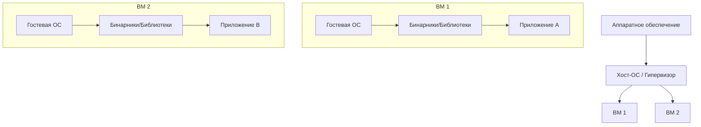
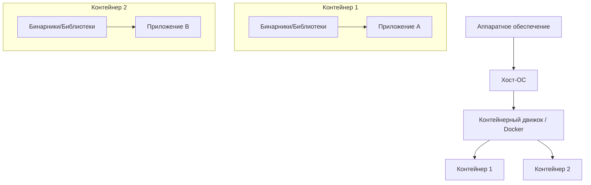
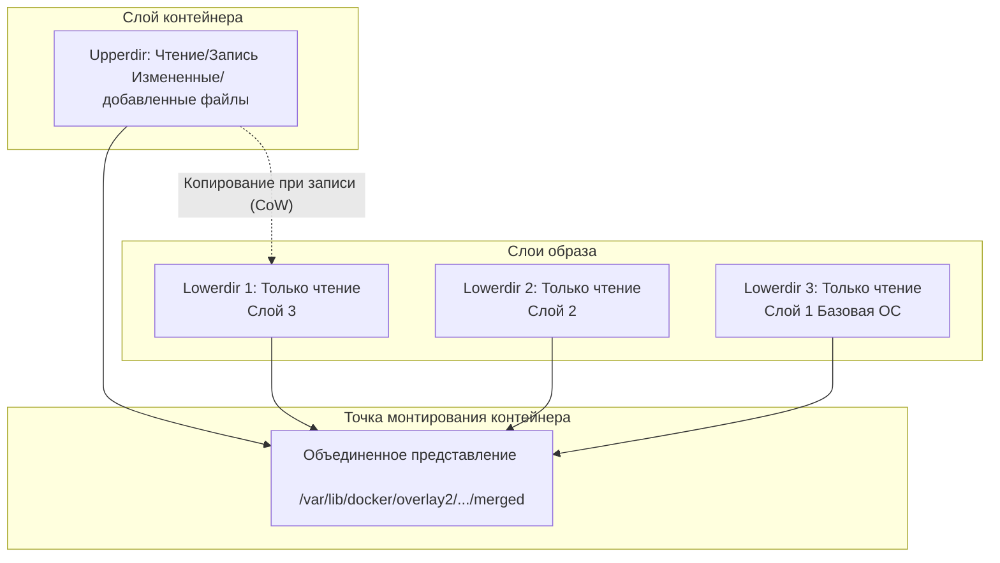
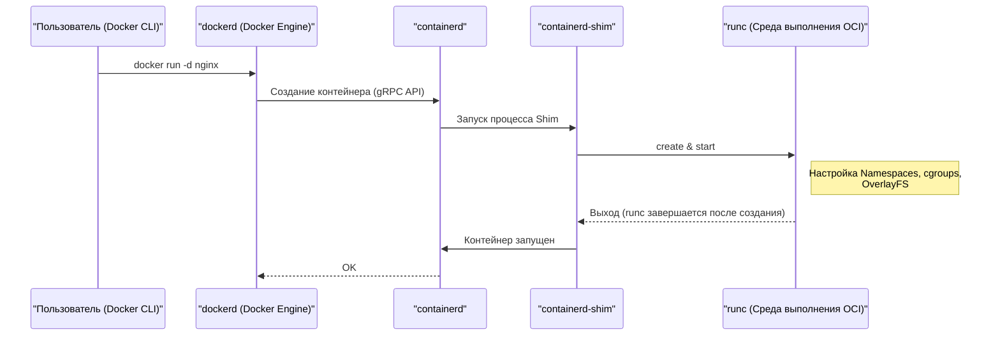
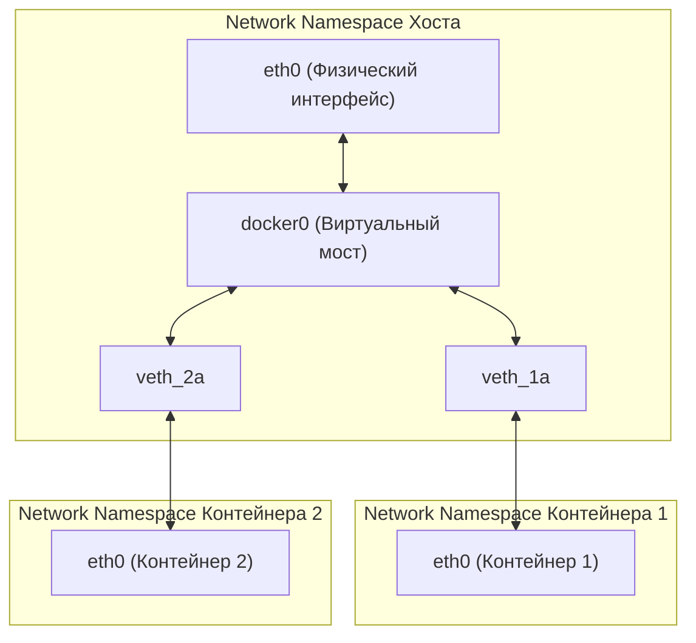

## 1. Введение: Что такое контейнерные технологии?

Для многих разработчиков Docker известен как «удобный инструмент, позволяющий легко создавать окружения и делиться ими». Однако лишь немногие действительно понимают, что происходит внутри Docker и почему он работает так легковесно и быстро.

В этой статье мы выйдем за рамки поверхностного использования команд Docker и приблизимся к **сути контейнерных технологий**. В частности, мы детально разберем основные функции ядра Linux, реализующие контейнеры: **Namespace** , **cgroups** и **OverlayFS** , который формирует файловую систему.

Обладая этими знаниями, вы сможете более эффективно выполнять настройку производительности, усиление безопасности и устранение неполадок.

## 2. Ключевые различия между виртуальными машинами (ВМ) и контейнерами

Чтобы понять контейнеры, давайте сначала проясним их отличия от традиционных виртуальных машин (Virtual Machine).

### Архитектура виртуальной машины

В виртуальной машине гипервизор (например, VMware ESXi, KVM, Hyper-V) размещается на физическом сервере, и поверх него запускаются несколько гостевых ОС (Virtual Machine).



Подход с виртуальными машинами обеспечивает полную изоляцию среды за счет эмуляции на аппаратном уровне. Однако необходимость запуска независимого ядра (Guest OS) для каждой ВМ приводит к медленному запуску и большим накладным расходам памяти и процессора.

### Архитектура контейнера

С другой стороны, контейнеры **разделяют ядро хост-ОС**.



На самом деле контейнер — это всего лишь «изолированный процесс Linux». Поскольку нет необходимости в процессе запуска ядра, он запускается за миллисекунды, а накладные расходы сведены к минимуму.

Магия «изоляции процессов так, будто они являются независимыми ОС» достигается за счет **Namespace** и **cgroups** , о которых пойдет речь в следующей главе.

---

## 3. «Namespace» для изоляции контейнеров

Функция ядра Linux **Namespace (пространство имен)** предоставляет процессам изолированное представление системных ресурсов. Процесс в определенном Namespace видит только ресурсы в пределах этого же Namespace. Это позволяет нескольким процессам работать в одной системе без вмешательства друг в друга.

Ядро Linux предоставляет в основном следующие 6 типов Namespace:

### 3.1 PID Namespace (Изоляция идентификаторов процессов)

В системе Linux `init` или `systemd` запускается как PID (Process ID) 1 при загрузке, а последующим процессам назначаются последовательные значения PID.
При использовании PID Namespace первому процессу, запущенному в новом Namespace, снова присваивается PID 1.

Если вы войдете внутрь контейнера и выполните команду `ps aux`, вы увидите только процессы, запущенные внутри контейнера, но не процессы на стороне хоста. Это связано с PID Namespace.

### 3.2 Mount Namespace (Изоляция файловой системы)

Изолирует точки монтирования процессов. Именно благодаря этой функции каждый контейнер может иметь независимый корневой каталог (`/`). Вы можете создать дерево файловой системы, отдельное от файловой системы хоста, и монтировать/размонтировать без влияния на другие Namespace.

### 3.3 Network Namespace (Изоляция сети)

Изолирует сетевые интерфейсы, IP-адреса, таблицы маршрутизации, правила iptables и т.д. Благодаря Network Namespace каждый контейнер имеет свой собственный IP-адрес (например, `172.17.0.2`) и может взаимодействовать независимо от сетевых настроек хоста.

### 3.4 UTS Namespace (Изоляция имен хостов и доменов)

Изолирует имя хоста и доменное имя NIS. Это позволяет каждому контейнеру иметь собственное имя хоста (значение, которое можно проверить с помощью команды `hostname`).

### 3.5 IPC Namespace (Изоляция межпроцессного взаимодействия)

Изолирует объекты System V IPC (Межпроцессное взаимодействие) и очереди сообщений POSIX. Предотвращает случайный доступ процессов из разных контейнеров к разделяемой памяти.

### 3.6 User Namespace (Изоляция пользователей и групп)

Изолирует пространство идентификаторов пользователей (UID) и идентификаторов групп (GID). Это позволяет сопоставить процесс, работающий от имени **root (UID 0)** внутри контейнера, так, чтобы на хосте он рассматривался как **обычный пользователь (непривилегированный пользователь)**. Это очень важная функция с точки зрения безопасности.

### 💡 Hands-on: Создание Namespace вручную

С помощью команды Linux `unshare` можно вручную создать Namespace и выполнить в нем процесс. Давайте ощутим основы контейнеров без использования Docker.

```bash
# Создание новых PID, UTS, Mount Namespace и выполнение bash
$ sudo unshare --pid --uts --mount --fork --mount-proc /bin/bash

# Проверка изменения имени хоста (преимущество UTS Namespace)
root@host# hostname container-test
root@container-test# hostname
container-test

# Проверка списка процессов (преимущество PID и Mount Namespace)
root@container-test# ps aux
USER         PID %CPU %MEM    VSZ   RSS TTY      STAT START   TIME COMMAND
root           1  0.0  0.0   7236  4160 pts/0    S    10:00   0:00 /bin/bash
root          15  0.0  0.0   8892  3280 pts/0    R+   10:01   0:00 ps aux
```

Как видите, даже при выполнении `ps aux` процессы хоста не видны, и `/bin/bash` работает с PID 1. В этом и заключается истинная природа контейнера.

---

## 4. «cgroups» для ограничения ресурсов контейнера

В то время как Namespace отвечает за «изоляцию пространства», **cgroups (Control Groups)** отвечает за «ограничение ресурсов».

Если контейнер выйдет из-под контроля и исчерпает ресурсы процессора или памяти хоста, другие контейнеры или сама хост-система могут отключиться (проблема шумного соседа). Чтобы предотвратить это, cgroups используется для установки верхних пределов использования ресурсов (ЦП, память, дисковый ввод-вывод, пропускная способность сети и т. д.) для групп процессов.

### Основные подсистемы cgroups

- **cpu** : Управляет планированием ЦП (процент времени использования и верхний предел).
- **memory** : Устанавливает верхний предел использования памяти и управляет поведением при его достижении (например, завершение процесса с помощью OOM Killer).
- **blkio** : Ограничивает пропускную способность ввода-вывода для блочных устройств (дисков).
- **pids** : Ограничивает количество процессов (потоков), которые могут быть созданы в cgroup, предотвращая атаки, такие как форк-бомба (Fork Bomb).

### 💡 Hands-on: Настройка cgroups вручную

Давайте создадим cgroup для ограничения памяти (на примере cgroups v1).

```bash
# Создание группы для ограничения памяти
$ sudo mkdir /sys/fs/cgroup/memory/test_group

# Установка верхнего предела памяти на 50 МБ
$ echo 50000000 | sudo tee /sys/fs/cgroup/memory/test_group/memory.limit_in_bytes

# Добавление текущего процесса (оболочки) в эту группу
$ echo $$ | sudo tee /sys/fs/cgroup/memory/test_group/tasks

# Если запустить процесс, потребляющий много памяти, в этом состоянии, он достигнет предела и будет убит (Killed)
```

При использовании Docker опции, передаваемые команде `docker run`, в фоновом режиме преобразуются в эти настройки cgroups.

```bash
# Пример ограничения памяти и ЦП в Docker
$ docker run -d --name web --memory="256m" --cpus="0.5" nginx
```

---

## 5. Файловая система контейнера и OverlayFS (Слои образа)

Одной из особенностей контейнеров является «многослойная структура образов». Образ Docker — это не один огромный файл, а скорее конфигурация из перекрывающихся слоев. Это реализуется с помощью **Union File System (UnionFS)** , в частности **OverlayFS** , который сегодня стандартно используется в Linux.

### Механизм OverlayFS

OverlayFS — это технология, которая объединяет разные каталоги (нижний и верхний слои) и представляет их как единую интегрированную файловую систему.



1. **Lowerdir (Нижний каталог)** : Соответствует каждому слою образа Docker. Они рассматриваются как **Read-Only (только для чтения)**. Когда несколько контейнеров используют один и тот же образ, они совместно используют этот нижний каталог, что позволяет значительно сэкономить дисковое пространство.
2. **Upperdir (Верхний каталог)** : Слой, предназначенный специально для контейнера, со статусом **Read/Write (чтение/запись)** , добавляемый при запуске контейнера. Любые файлы, созданные или измененные внутри контейнера, записываются в этот верхний слой.
3. **Merged View (Объединенное представление)** : Объединяет Lowerdir и Upperdir для предоставления единой файловой системы, видимой из контейнера.

### Стратегия Copy-on-Write (CoW)

Если вы попытаетесь отредактировать существующий файл (файл в нижнем слое) внутри контейнера, OverlayFS автоматически скопирует целевой файл в верхний слой (Upperdir) и применит изменения к этой копии. Это называется **Copy-on-Write (CoW)**. Сами файлы в нижнем слое никогда не изменяются.

Следовательно, если уничтожить контейнер, Upperdir также будет удален, и данные исчезнут. Если требуются постоянные данные, эта проблема решается путем использования **Docker Volume (например, привязка монтирования)** для монтирования каталога хоста непосредственно в контейнер.

### Отношение между Dockerfile и слоями

Каждая инструкция в `Dockerfile` (например, `FROM`, `RUN`, `COPY`) генерирует один новый слой (Lowerdir).

```dockerfile
# Слой 1: Базовая ОС
FROM ubuntu:22.04

# Слой 2: Установка пакетов
RUN apt-get update && apt-get install -y python3

# Слой 3: Копирование исходного кода
COPY . /app

# Настройка метаданных (слой не генерируется)
CMD ["python3", "/app/main.py"]
```

Чтобы уменьшить количество слоев, часто используется метод объединения нескольких команд `RUN` с помощью `&&`. Это предотвращает чрезмерную глубину слоев OverlayFS и оптимизирует размер образа.

---

## 6. Архитектура Docker (Docker Engine, containerd, runc)

На ранних этапах Docker имел монолитный дизайн (один огромный блок), но теперь функции разделены, и стандартизация (OCI: Open Container Initiative) продвигается вперед. Текущий жизненный цикл контейнера обеспечивается взаимодействием следующих компонентов.



1. **Docker CLI** : Инструмент командной строки для взаимодействия с пользователем.
2. **dockerd (Docker Daemon)** : Предоставляет высокоуровневые функции, такие как сборка образов, управление сетью и управление томами.
3. **containerd** : Демон, специализирующийся на управлении жизненным циклом контейнеров (извлечение образов, запуск и остановка контейнеров). Это стандартный компонент, который также используется в [Kubernetes](https://kenji.blog/ru/p/kubernetes-k8s-architecture-pod-service-ingress/) и других системах.
4. **runc** : Низкоуровневая среда выполнения контейнеров, соответствующая стандарту OCI (Open Container Initiative). Она фактически применяет настройки Namespace и cgroups к ядру, как было описано ранее, и отвечает за запуск процессов. После завершения запуска `runc` сама завершает свою работу.
5. **containerd-shim** : Становится родительским процессом для процесса контейнера (PID 1), управляет стандартным вводом/выводом контейнера и сообщает о статусе контейнера при его завершении компоненту `containerd`. Благодаря этому, даже если `dockerd` или `containerd` перезапустятся, сам контейнер сможет продолжить работу.

---

## 7. Расширенные сети контейнеров

Наконец, давайте рассмотрим Network Namespace и механизм взаимодействия между контейнерами.

Сетевой моделью по умолчанию в Docker является **сеть Bridge (мост)**.



- **veth pair (Виртуальная пара Ethernet)** : Пара виртуальных интерфейсов; если вы отправите пакет в один, он выйдет из другого.
- При создании контейнера Docker создает новый Network Namespace, помещает один конец veth pair внутрь контейнера (обычно с именем `eth0`), а другой конец на стороне хоста (например, `vethXXXX`).
- Интерфейс veth на стороне хоста подключается к **`docker0` (мостовому устройству)** , который является виртуальным коммутатором.
- Это позволяет различным контейнерам обмениваться данными друг с другом через `docker0`, а настройки маршрутизации хоста (NAPT / IP-маскарадинг) позволяют им взаимодействовать с внешним интернетом.

---

## 8. Практика: Оптимизация Dockerfile

Основываясь на полученных знаниях, мы объясним, как писать `Dockerfile` для повышения производительности и безопасности в реальных условиях эксплуатации.

### 8.1 Использование многоэтапной сборки (Multi-stage build)

Разделяя среду сборки и среду выполнения, можно значительно уменьшить размер окончательного образа. Это особенно полезно для компилируемых языков, таких как Go, Rust и Java.

```dockerfile
# --- Этап 1: Среда сборки ---
FROM golang:1.21 AS builder
WORKDIR /app
COPY go.mod go.sum ./
RUN go mod download
COPY . .
# Сборка статически связанного бинарного файла
RUN CGO_ENABLED=0 GOOS=linux go build -o main .

# --- Этап 2: Среда выполнения ---
# Использование легковесных alpine или scratch в качестве базового образа
FROM alpine:3.18
WORKDIR /app
# Копирование только собранного бинарного файла с этапа builder
COPY --from=builder /app/main .

# Создание и использование непривилегированного пользователя (для повышения безопасности)
RUN addgroup -S appgroup && adduser -S appuser -G appgroup
USER appuser

EXPOSE 8080
CMD ["./main"]
```

### 8.2 Повышение эффективности кеширования слоев

При сборке Docker последовательно переиспользует слои в качестве кэша. Откладывая операцию `COPY` для часто изменяемых файлов (исходного кода) на более поздний этап, вы можете увеличить частоту попадания в кэш и сократить время сборки.

### 8.3 Выбор минимального базового образа

- **ubuntu/debian** : Универсальные, но большого размера.
- **alpine** : Очень легкий (несколько МБ), но стандартная библиотека C — `musl` вместо `glibc`, что может вызвать проблемы с совместимостью в некоторых бинарных файлах (например, модулях расширения C для Python).
- **distroless** : Предоставляемые Google образы, содержащие только минимальные зависимости, необходимые для запуска приложения. Поскольку они даже не включают оболочку (`/bin/sh`), они чрезвычайно безопасны (даже если злоумышленник проникнет в контейнер, он не сможет выполнить команды).

---

## 9. Математическая перспектива: Оптимизационная модель распределения ресурсов

Для увеличения плотности контейнеров возникает проблема того, как разместить $n$ контейнеров в соответствии с ресурсами хост-машины (ЦП $C$ , память $M$). Это можно сформулировать как разновидность **проблемы упаковки в контейнеры (Bin Packing Problem)**.

Пусть процессор, требуемый каждым контейнером $i$, равен $c_i$, а память — $m_i$, а емкость хоста $j$ равна $C_j, M_j$.
Если $x_{ij} = 1$, когда контейнер $i$ размещен на хосте $j$ (иначе $0$), и $y_j = 1$, когда хост $j$ используется, то задачу размещения контейнеров с минимальным количеством хостов можно выразить следующим образом:

$$
\min \sum_{j=1}^{m} y_j \\
\text{при условии} \\
\sum_{i=1}^{n} c_i x_{ij} \le C_j y_j, \quad \forall j \\
\sum_{i=1}^{n} m_i x_{ij} \le M_j y_j, \quad \forall j \\
\sum_{j=1}^{m} x_{ij} = 1, \quad \forall i
$$

Планировщики в оркестраторах, таких как [Kubernetes](https://kenji.blog/ru/p/kubernetes-k8s-architecture-pod-service-ingress/), внутренне решают эту задачу удовлетворения ограничений (эвристическое приближение через оценку/скоринг) и распределяют контейнеры на подходящие узлы.

---

## 10. Заключение

В этой статье мы исследовали глубины контейнерных технологий, работающих за кулисами Docker.

1. **Namespace** : Изоляция пространства для процессов, сети, файловой системы и т. д.
2. **cgroups** : Ограничение таких ресурсов, как процессор и память.
3. **OverlayFS** : Эффективное управление файловой системой посредством многоуровневой структуры и Copy-on-Write.
4. Модульная архитектура, основанная на стандарте OCI, с использованием `containerd` и `runc`.
5. Конфигурация сети с использованием виртуальных мостов и пар veth.

Контейнер — это не волшебная коробка, а **«сложный метод управления процессами»** , реализованный посредством комбинации надежных функций ядра Linux. Понимая эти фундаментальные механизмы, вы сможете глубже разобраться в оптимизации Dockerfile, устранении неполадок и передовых инструментах оркестрации, таких как [Kubernetes](https://kenji.blog/ru/p/kubernetes-k8s-architecture-pod-service-ingress/).

В следующий раз, когда вы будете создавать контейнер, выполните команду и представьте: «Прямо сейчас за кулисами создаются Namespace и монтируется OverlayFS». Это, несомненно, обогатит ваш опыт разработки.
