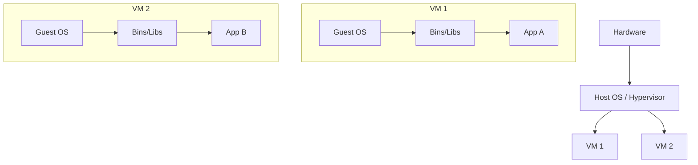
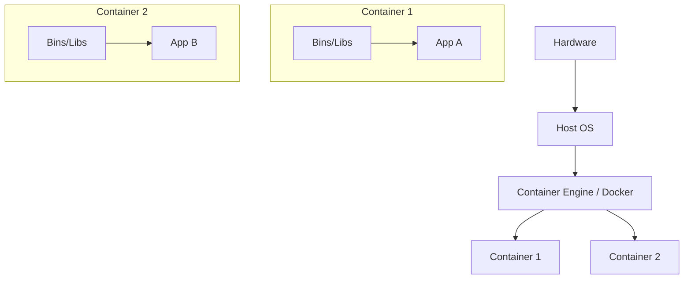
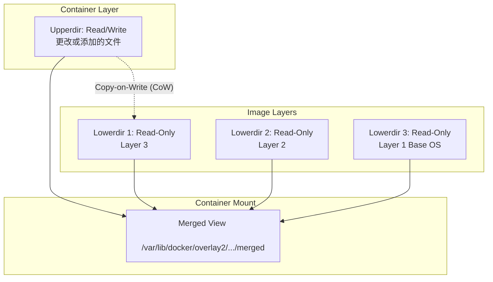
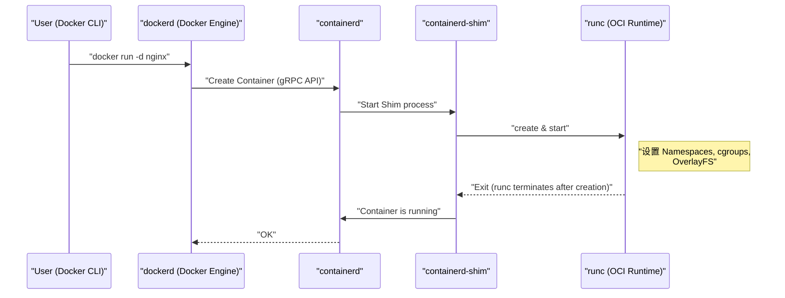
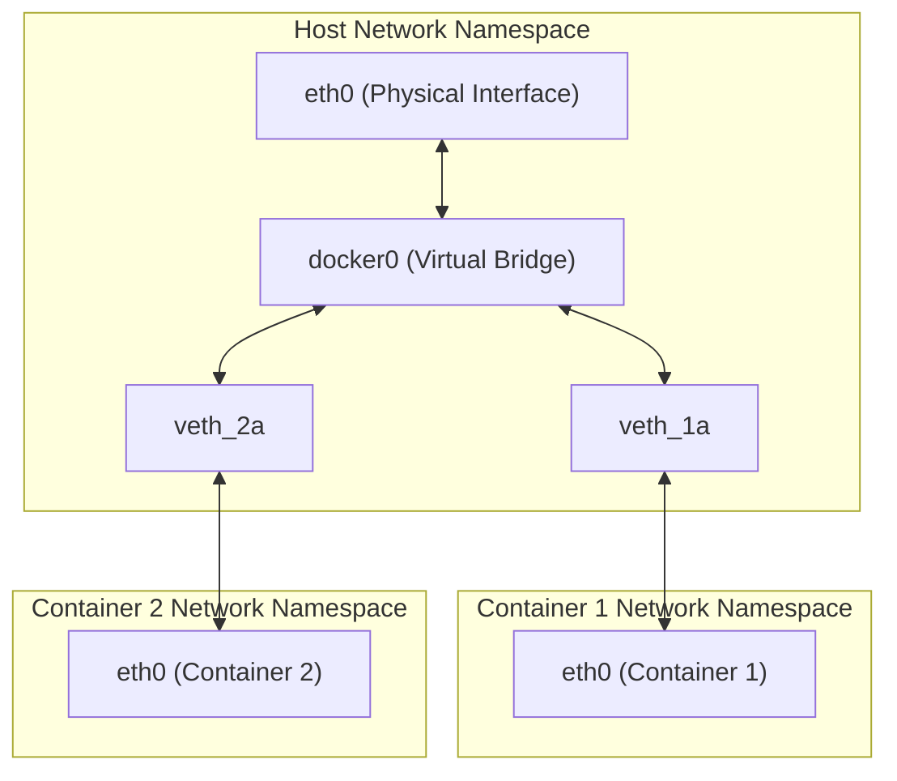

## 1. 引言：什么是容器技术？

对于许多开发者来说，Docker被认为是一个“能够轻松构建和共享环境的便利工具”。但是，出乎意料的是，很少有人深入了解Docker背后到底发生了什么，以及为什么它能够如此轻量且快速地运行。

本文将从Docker命令的表面用法更进一步，直击 **容器技术的本质** 。具体来说，我们将彻底剖析实现容器的Linux内核核心功能，如 **Namespace** 、 **cgroups** ，以及构成文件系统的 **OverlayFS** 等机制。

掌握这些知识，您将能够更准确地进行性能调优、安全强化和故障排除。

## 2. 虚拟机（VM）与容器的决定性差异

在理解容器之前，让我们先明确它与传统虚拟机（Virtual Machine）的差异。

### 虚拟机的架构

虚拟机在物理服务器上部署虚拟机管理程序（如VMware ESXi、KVM、Hyper-V等），并在其之上运行多个客户操作系统（Virtual Machine）。



VM的方法是从硬件级别进行模拟，因此提供了完全隔离的环境。但是，由于每个VM都需要启动一个独立的内核（Guest OS），所以存在启动缓慢、内存和CPU开销大的问题。

### 容器的架构

另一方面，容器 **共享宿主机OS的内核** 。



容器实际上只不过是“一个被隔离的普通Linux进程”。由于不需要启动内核的进程，它可以在毫秒级启动，并将开销降至最低。

实现这种“将进程像独立OS一样隔离”的魔法，正是下一章将解释的 **Namespace** 和 **cgroups** 。

---

## 3. 实现容器隔离的“Namespace”

Linux内核的 **Namespace（命名空间）** 是一项为进程提供系统资源隔离视图的功能。在某个Namespace内的进程只能看到该Namespace内的资源。这使得多个进程能够在同一系统上运行而不会相互干扰。

Linux内核主要提供以下6种Namespace：

### 3.1 PID Namespace（进程ID隔离）

在Linux系统中，启动时 `init` 或 `systemd` 作为PID（Process ID）1启动，后续进程将被分配连续的PID。
使用PID Namespace，会在新Namespace内首次启动的进程上再次分配PID 1。

进入容器内部执行 `ps aux` 命令时，只能看到容器内运行的进程，而看不到宿主机的进程。这就是PID Namespace的作用。

### 3.2 Mount Namespace（文件系统隔离）

隔离进程的挂载点。容器能够拥有独立的根目录（ `/` ）全靠这个功能。它构建了与宿主机文件系统不同的文件系统树，并且可以在不影响其他Namespace的情况下进行挂载和卸载。

### 3.3 Network Namespace（网络隔离）

隔离网络接口、IP地址、路由表、iptables规则等。每个容器都有自己的IP地址（例如： `172.17.0.2` ），并且能够独立于主机的网络配置进行通信，这要归功于Network Namespace。

### 3.4 UTS Namespace（主机名和域名隔离）

隔离主机名和NIS域名。这使得每个容器都可以拥有自己的主机名（可以通过 `hostname` 命令查看的值）。

### 3.5 IPC Namespace（进程间通信隔离）

隔离System V IPC（Inter-Process Communication）对象和POSIX消息队列。防止不同容器的进程意外访问共享内存。

### 3.6 User Namespace（用户和组隔离）

隔离用户ID（UID）和组ID（GID）空间。这使得在容器内部作为 **root（UID 0）** 运行的进程，可以在宿主机上被映射为 **普通用户（非特权用户）** 处理。从安全角度来看，这是一个非常重要的功能。

### 💡 Hands-on：尝试手动创建Namespace

使用Linux的 `unshare` 命令，可以手动创建Namespace并在其中执行进程。让我们在不使用Docker的情况下体验容器的基础。

```bash
# 创建新的PID、UTS、Mount Namespace并执行bash
$ sudo unshare --pid --uts --mount --fork --mount-proc /bin/bash

# 确认是否可以更改主机名（UTS Namespace的好处）
root@host# hostname container-test
root@container-test# hostname
container-test

# 检查进程列表（PID Namespace和Mount Namespace的好处）
root@container-test# ps aux
USER         PID %CPU %MEM    VSZ   RSS TTY      STAT START   TIME COMMAND
root           1  0.0  0.0   7236  4160 pts/0    S    10:00   0:00 /bin/bash
root          15  0.0  0.0   8892  3280 pts/0    R+   10:01   0:00 ps aux
```

像这样，即使执行 `ps aux` 也看不到主机的进程，可以看到 `/bin/bash` 作为PID 1在运行。这就是容器的基本真实面貌。

---

## 4. 限制容器资源的“cgroups”

Namespace负责“空间隔离”，而 **cgroups（Control Groups）** 则负责“资源限制”。

如果某个容器失控并耗尽了宿主机的CPU或内存，其他容器或宿主机系统本身就会宕机（吵闹的邻居问题）。为了防止这种情况，cgroups的作用是为进程组设置资源（CPU、内存、磁盘I/O、网络带宽等）的使用上限。

### 主要的cgroups子系统

- **cpu** ：控制CPU的调度（使用时间比例或上限）。
- **memory** ：设置内存使用量上限，并控制达到上限时的行为（例如OOM Killer终止进程等）。
- **blkio** ：限制对块设备（磁盘）的I/O带宽。
- **pids** ：限制在cgroup中可以创建的进程（线程）数量，防止Fork炸弹（Fork Bomb）等攻击。

### 💡 Hands-on：尝试手动配置cgroups

让我们实际创建一个限制内存的cgroup（以cgroups v1为例）。

```bash
# 创建用于内存限制的组
$ sudo mkdir /sys/fs/cgroup/memory/test_group

# 将内存上限设置为50MB
$ echo 50000000 | sudo tee /sys/fs/cgroup/memory/test_group/memory.limit_in_bytes

# 将当前进程（shell）添加到此组
$ echo $$ | sudo tee /sys/fs/cgroup/memory/test_group/tasks

# 在此状态下执行消耗大量内存的操作，一旦达到限制，它将被Kill掉
```

使用Docker时，传递给 `docker run` 命令的选项会在后台转换为这些cgroups的配置。

```bash
# 在Docker中限制内存和CPU的示例
$ docker run -d --name web --memory="256m" --cpus="0.5" nginx
```

---

## 5. 容器的文件系统与OverlayFS（镜像层）

容器的特点之一是“镜像的层级结构”。Docker镜像不是单个巨大文件，而是由多个层叠的层（Layer）组成。实现这一点的是 **Union File System（UnionFS）** ，特别是最近在Linux中作为标准使用的 **OverlayFS** 。

### OverlayFS的机制

OverlayFS是一种合并不同目录（下层和上层），并将其作为统一文件系统呈现的技术。



1. **Lowerdir（下层目录）** ：对应于Docker镜像的各个层。这些被视为 **Read-Only（只读）** 。当多个容器使用同一镜像时，由于共享这些下层目录，因此可以大幅节省磁盘空间。
2. **Upperdir（上层目录）** ：容器启动时添加的，专属于该容器的 **Read/Write（可读写）** 层。当在容器内创建或修改文件时，所有内容都会被写入这个上层。
3. **Merged View** ：合并Lowerdir和Upperdir，并将其作为一个文件系统提供给容器。

### 写时复制（Copy-on-Write, CoW）策略

当试图在容器中编辑现有文件（下层文件）时，OverlayFS会自动将目标文件复制到上层（Upperdir），并对该副本进行更改。这被称为 **写时复制（Copy-on-Write, CoW）** 。下层的文件本身永远不会被更改。

由此一来，一旦容器被销毁，Upperdir也会被删除，数据随之消失。如果需要持久化数据，则可以使用 **Docker Volume（绑定挂载等）** 将主机的目录直接挂载到容器内来解决。

### Dockerfile与层的关系

`Dockerfile` 的每条指令（如 `FROM` 、 `RUN` 、 `COPY` 等）都会生成一个新的层（Lowerdir）。

```dockerfile
# Layer 1: 基础OS
FROM ubuntu:22.04

# Layer 2: 安装包
RUN apt-get update && apt-get install -y python3

# Layer 3: 复制代码
COPY . /app

# 设置元数据（不生成层）
CMD ["python3", "/app/main.py"]
```

为了减少层的数量，通常会使用 `&&` 将多个 `RUN` 命令连接起来，这是一种用于防止OverlayFS层数过深、保持镜像较小的优化技巧。

---

## 6. Docker架构（Docker Engine, containerd, runc）

早期的Docker设计是单体结构（一个庞大的整体），但现在功能已经被拆分，并且标准化（OCI: Open Container Initiative）正在推进。当前容器的生命周期由以下组件的协同工作构成。



1. **Docker CLI** ：用户操作的命令行工具。
2. **dockerd (Docker Daemon)** ：提供镜像构建、网络管理、卷管理等高级功能。
3. **containerd** ：专门负责容器生命周期管理（拉取镜像、启动/停止容器）的守护进程。也是[Kubernetes](https://kenji.blog/zh-cn/p/kubernetes-k8s-architecture-pod-service-ingress/)等系统中使用的标准组件。
4. **runc** ：符合OCI（Open Container Initiative）标准的低级容器运行时。负责向内核实际下发前面提到的Namespace和cgroups设置，并启动进程。启动完成后， `runc` 自身会退出。
5. **containerd-shim** ：成为容器进程（PID 1）的父进程，管理容器的标准输入输出，并向 `containerd` 报告容器退出状态。因此，即使 `dockerd` 或 `containerd` 重启，容器本身依然能够继续运行。

---

## 7. 高级容器网络

最后，让我们谈谈Network Namespace和容器间通信的机制。

Docker的默认网络模型是 **Bridge（桥接）网络** 。



- **veth pair (Virtual Ethernet Pair)** ：由一对虚拟接口组成，将数据包放入一端，它就会从另一端出来。
- 当Docker创建容器时，它会创建一个新的Network Namespace，将veth pair的一端放置在容器内部（通常命名为 `eth0` ），将另一端放置在宿主机端（如 `vethXXXX` 等）。
- 宿主机端的veth会连接到虚拟交换机 **`docker0`（桥接设备）** 。
- 因此，不同的容器可以经由 `docker0` 相互通信，此外通过主机的路由配置（NAPT / IP伪装），也能够与外部互联网通信。

---

## 8. 实践：Dockerfile优化

基于上述知识，下面将讲解在实际生产环境中为了提升性能和安全性，应该如何编写 `Dockerfile` 。

### 8.1 利用多阶段构建（Multi-stage build）

通过分离构建环境和运行环境，可以大幅缩小最终镜像的尺寸。这在[Go](https://kenji.blog/zh-cn/p/programming-languages-history-paradigm-evolution/)、Rust、[Java](https://kenji.blog/zh-cn/p/programming-languages-history-paradigm-evolution/)等编译型语言中尤为有效。

```dockerfile
# --- Stage 1: 构建环境 ---
FROM golang:1.21 AS builder
WORKDIR /app
COPY go.mod go.sum ./
RUN go mod download
COPY . .
# 构建静态链接的二进制文件
RUN CGO_ENABLED=0 GOOS=linux go build -o main .

# --- Stage 2: 运行环境 ---
# 采用轻量级的alpine或scratch作为基础镜像
FROM alpine:3.18
WORKDIR /app
# 仅从builder阶段复制已编译好的二进制文件
COPY --from=builder /app/main .

# 创建并使用非特权用户运行（为提升安全性）
RUN addgroup -S appgroup && adduser -S appuser -G appgroup
USER appuser

EXPOSE 8080
CMD ["./main"]
```

### 8.2 提高层缓存效率

Docker在构建时会自上而下按顺序复用层缓存。将易变的文件（源代码）的 `COPY` 操作推迟，可以提高缓存命中率，从而缩短构建时间。

### 8.3 选择最小的基础镜像

- **ubuntu/debian** ：通用但体积较大。
- **alpine** ：非常轻量（几MB），但由于标准C库是 `musl` 而非 `glibc` ，可能会在部分二进制文件（如Python的C扩展模块等）中发生兼容性问题。
- **distroless** ：由Google提供，仅包含应用程序运行所需的最低限度的依赖关系。连shell（ `/bin/sh` ）都不包含，因此极其安全（即使攻击者入侵容器，也无法执行命令）。

---

## 9. 数学视角：资源分配的优化模型

在提高容器密度的过程中，如何将 $n$ 个容器分配给宿主机的资源（CPU $C$ 、内存 $M$ ）成为了一个核心课题。这可以被形式化为一种 **装箱问题（Bin Packing Problem）** 。

假设每个容器 $i$ 请求的CPU为 $c_i$ 、内存为 $m_i$ ，宿主机 $j$ 的容量为 $C_j, M_j$ 。
当容器 $i$ 被放置在宿主机 $j$ 时 $x_{ij} = 1$ （否则为 $0$ ），如果使用了宿主机 $j$ 则 $y_j = 1$ ，那么使用最少数量宿主机来部署容器的问题可以表示为：

$$
\min \sum_{j=1}^{m} y_j \\\\
\text{受限于} \\\\
\sum_{i=1}^{n} c_i x_{ij} \le C_j y_j, \quad \forall j \\\\
\sum_{i=1}^{n} m_i x_{ij} \le M_j y_j, \quad \forall j \\\\
\sum_{j=1}^{m} x_{ij} = 1, \quad \forall i
$$

像[Kubernetes](https://kenji.blog/zh-cn/p/kubernetes-k8s-architecture-pod-service-ingress/)这样的编排器调度器，内部会在解决此类约束满足问题（通过打分进行启发式近似）的同时，将容器分配到适当的节点上。

---

## 10. 总结

本文探讨了Docker后台运行的容器技术的深层奥秘。

1. **Namespace** 带来的进程、网络、文件系统等“空间隔离”。
2. **cgroups** 对CPU和内存等“资源限制”。
3. 基于 **OverlayFS** 的层结构及写时复制带来的高效文件系统管理。
4. 基于OCI标准的 `containerd` 和 `runc` 的模块化架构。
5. 虚拟网桥与veth pair构成的网络结构。

容器绝非神奇的黑盒，而是通过结合Linux内核强大功能实现的 **“一种优雅的进程管理方案”** 。通过理解其底层机制，必定能深化对Dockerfile优化、故障排除，甚至是[Kubernetes](https://kenji.blog/zh-cn/p/kubernetes-k8s-architecture-pod-service-ingress/)等高级编排工具的理解。

下次构建容器时，不妨想象一下“此刻，后台正在创建Namespace，挂载OverlayFS吧”，相信您的开发体验将变得更加丰富。
