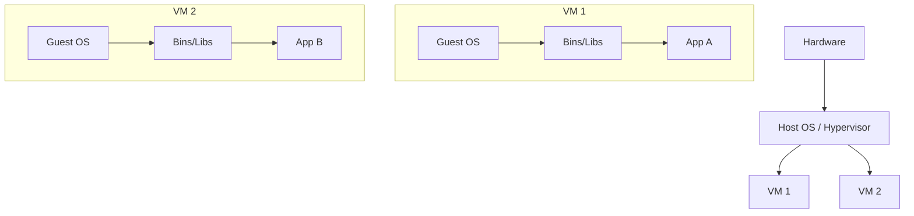
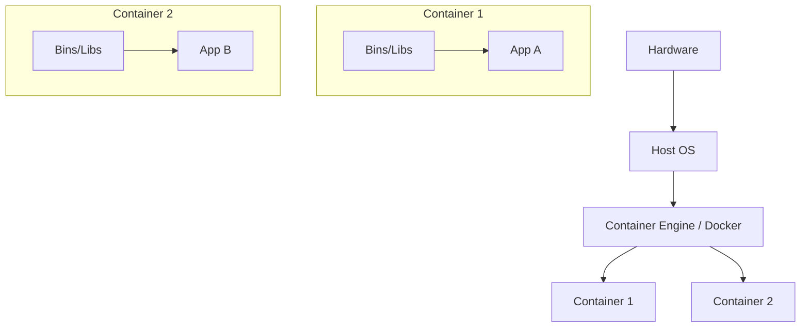
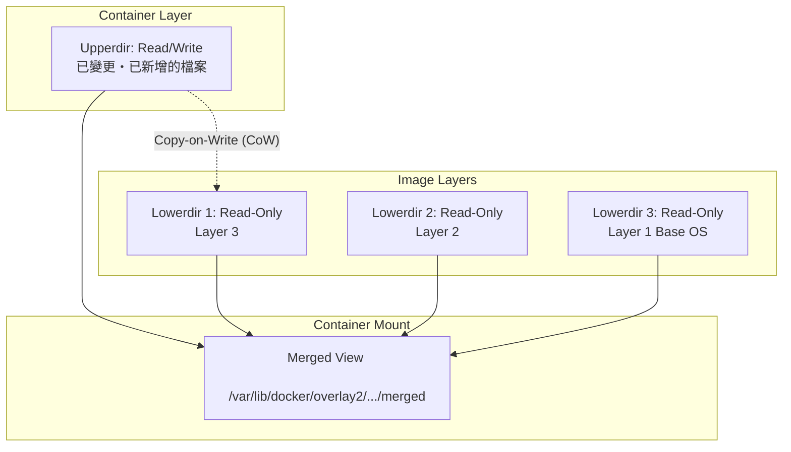
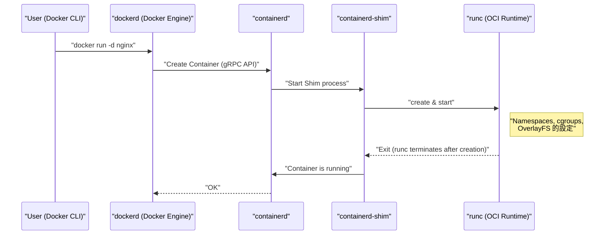
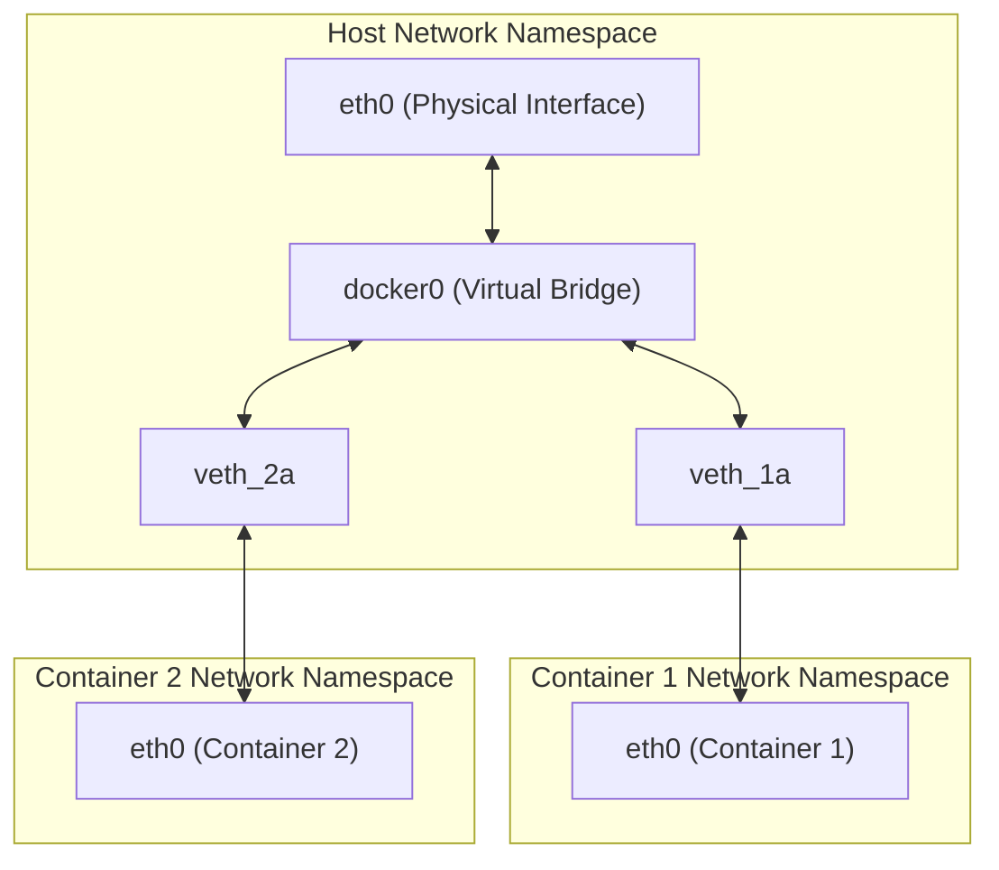

## 1. 前言：什麼是容器技術？

對於許多開發者來說，Docker 被認知為「可以輕鬆建立與分享環境的便利工具」。然而，在 Docker 背後究竟發生了什麼事，以及它為何能如此輕量且高速地運作，真正深入了解的人可能意外地少。

本篇文章將從 Docker 指令的表面用法更進一步，深入探討 **容器技術的本質** 。具體來說，我們將徹底剖析實現容器的 Linux 核心（Kernel）核心功能： **Namespace** 、 **cgroups** ，以及構成檔案系統的 **OverlayFS** 等機制。

具備這些知識後，將能夠更準確地進行效能調校、強化安全性以及故障排除（Troubleshooting）。

## 2. 虛擬機器（VM）與容器的決定性差異

在了解容器之前，首先讓我們明確它與傳統虛擬機器（Virtual Machine）的差異。

### 虛擬機器的架構

虛擬機器是在實體伺服器上配置 Hypervisor（如 VMware ESXi、KVM、Hyper-V 等），並在其上運行多個客體作業系統（Virtual Machine）。



VM 的做法是從硬體層級開始模擬，因此提供了完全隔離的環境。然而，因為每台 VM 都需要啟動獨立的核心（Guest OS），所以存在著啟動緩慢、記憶體與 CPU 額外開銷（Overhead）較大等問題。

### 容器的架構

另一方面，容器則是 **共享主機 OS 的核心** 。



實際上，容器不過是「被隔離的單純 Linux 行程」。由於不需要啟動核心的行程，因此能在毫秒級別內啟動，並將額外開銷降至最低。

實現這種「將行程隔離得宛如獨立 OS」般魔法的，就是我們在下一章將解說的 **Namespace** 與 **cgroups** 。

---

## 3. 實現容器隔離的「Namespace」

Linux 核心的 **Namespace（命名空間）** 是一項為行程提供被隔離的系統資源視圖的功能。從某個 Namespace 內的行程來看，它只能看到同一個 Namespace 內的資源。這使得多個行程能在同一個系統上運作而互不干擾。

Linux 核心主要提供以下 6 種 Namespace：

### 3.1 PID Namespace（行程 ID 的隔離）

在 Linux 系統中，啟動時 `init` 或 `systemd` 會作為 PID（Process ID）1 啟動，後續的行程則會被分配連續的 PID。
使用 PID Namespace 時，在新的 Namespace 內第一個啟動的行程將再次被分配為 PID 1。

當我們進入容器內部並執行 `ps aux` 指令時，只能看到容器內執行的行程，而看不到主機端的行程。這就是歸功於 PID Namespace。

### 3.2 Mount Namespace（檔案系統的隔離）

隔離行程的掛載點（Mount point）。每個容器能夠擁有獨立的根目錄（ `/` ），完全歸功於這項功能。它能建立與主機檔案系統不同的檔案系統樹，並且在進行掛載與卸載時不會影響到其他的 Namespace。

### 3.3 Network Namespace（網路的隔離）

隔離網路介面、IP 位址、路由表、iptables 規則等。每個容器之所以能擁有獨立的 IP 位址（例如： `172.17.0.2` ），並且能獨立於主機網路設定進行通訊，全靠 Network Namespace 的幫助。

### 3.4 UTS Namespace（主機名稱與網域名稱的隔離）

隔離主機名稱（Hostname）與 NIS 網域名稱。這使得每個容器都可以擁有獨立的主機名稱（可透過 `hostname` 指令確認的值）。

### 3.5 IPC Namespace（行程間通訊的隔離）

隔離 System V IPC（Inter-Process Communication）物件與 POSIX 訊息佇列。這能防止不同容器的行程錯誤地存取到共享記憶體。

### 3.6 User Namespace（使用者與群組的隔離）

隔離使用者 ID（UID）與群組 ID（GID）的空間。藉此可以進行映射，使得在容器內部以 **root（UID 0）** 運作的行程，在主機上被視為 **一般使用者（非特權使用者）** 。從安全性的角度來看，這是一項非常重要的功能。

### 💡 Hands-on: 手動建立 Namespace 看看

使用 Linux 的 `unshare` 指令，我們可以手動建立 Namespace 並在其中執行行程。讓我們不使用 Docker 來體驗一下容器的基礎。

```bash
# 建立新的 PID、UTS、Mount Namespace 並執行 bash
$ sudo unshare --pid --uts --mount --fork --mount-proc /bin/bash

# 確認是否能變更主機名稱（UTS Namespace 的恩惠）
root@host# hostname container-test
root@container-test# hostname
container-test

# 確認行程列表（PID Namespace 與 Mount Namespace 的恩惠）
root@container-test# ps aux
USER         PID %CPU %MEM    VSZ   RSS TTY      STAT START   TIME COMMAND
root           1  0.0  0.0   7236  4160 pts/0    S    10:00   0:00 /bin/bash
root          15  0.0  0.0   8892  3280 pts/0    R+   10:01   0:00 ps aux
```

如上所示，即使執行 `ps aux` 也看不到主機的行程，且可以看到 `/bin/bash` 正作為 PID 1 運作。這就是容器最基本的真面目。

---

## 4. 進行容器資源限制的「cgroups」

如果 Namespace 負責的是「空間的隔離」，那麼 **cgroups（Control Groups）** 負責的就是「資源的限制」。

萬一某個容器失控並耗盡了主機的 CPU 或記憶體，將會導致其他容器甚至是主機系統本身當機（Noisy Neighbor 問題）。為了防止這種情況發生，為行程群組設定資源（CPU、記憶體、磁碟 I/O、網路頻寬等）的使用上限，就是 cgroups 的職責。

### 主要的 cgroups 子系統

- **cpu** ：控制 CPU 的排程（使用時間比例或上限）。
- **memory** ：設定記憶體使用量的上限，並控制達到上限時的行為（例如透過 OOM Killer 終止行程）。
- **blkio** ：限制對區塊裝置（磁碟）的 I/O 頻寬。
- **pids** ：限制可以在 cgroup 內建立的行程（執行緒）數量，防止如 Fork 炸彈（Fork Bomb）等攻擊。

### 💡 Hands-on: 手動設定 cgroups 看看

讓我們實際建立一個限制記憶體的 cgroup 看看（以 cgroups v1 為例）。

```bash
# 建立用於記憶體限制的群組
$ sudo mkdir /sys/fs/cgroup/memory/test_group

# 將記憶體上限設定為 50MB
$ echo 50000000 | sudo tee /sys/fs/cgroup/memory/test_group/memory.limit_in_bytes

# 將目前的行程（Shell）加入到這個群組
$ echo $$ | sudo tee /sys/fs/cgroup/memory/test_group/tasks

# 在這個狀態下執行消耗大量記憶體的處理時，達到限制就會被 Kill（砍掉）
```

在使用 Docker 時，傳遞給 `docker run` 指令的選項，會在背後被轉換成這些 cgroups 的設定。

```bash
# Docker 中的記憶體與 CPU 限制範例
$ docker run -d --name web --memory="256m" --cpus="0.5" nginx
```

---

## 5. 容器的檔案系統與 OverlayFS（映像檔層）

容器的特徵之一就是「映像檔的層（Layer）結構」。Docker 映像檔並非單一巨大的檔案，而是由多個層疊加組合而成的。實現這個功能的機制是 **Union File System（UnionFS）** ，特別是近代 Linux 中標準使用的 **OverlayFS** 。

### OverlayFS 的運作機制

OverlayFS 是一種將不同目錄（下層與上層）合併，並將其呈現為單一整合檔案系統的技術。



1. **Lowerdir（下層目錄）** ：相當於 Docker 映像檔的各個層。這些會被當作 **Read-Only（唯讀）** 處理。當多個容器使用相同的映像檔時，可以共享這個下層目錄，從而大幅節省磁碟空間。
2. **Upperdir（上層目錄）** ：在啟動容器時被加入，是該容器專屬的 **Read/Write（可讀寫）** 層。如果在容器內建立或變更檔案，全部都會寫入這個上層層級。
3. **Merged View** ：將 Lowerdir 與 Upperdir 整合，提供一個從容器內部可以看到的單一檔案系統視圖。

### Copy-on-Write (CoW) 策略

當嘗試編輯容器內現有檔案（位於下層的檔案）時，OverlayFS 會自動將目標檔案複製到上層（Upperdir），並對該副本進行變更。這被稱為 **Copy-on-Write (CoW)** 。下層檔案本身絕對不會被變更。

因此，一旦銷毀容器，Upperdir 也會被刪除，資料就會消失。需要持久化的資料，可以透過使用 **Docker Volume（如 Bind Mount 等）** 將主機目錄直接掛載到容器內來解決。

### Dockerfile 與層的關係

`Dockerfile` 的每一個指令（ `FROM` 、 `RUN` 、 `COPY` 等），都會產生一個新的層（Lowerdir）。

```dockerfile
# Layer 1: 基礎 OS
FROM ubuntu:22.04

# Layer 2: 安裝套件
RUN apt-get update && apt-get install -y python3

# Layer 3: 複製原始碼
COPY . /app

# 設定 Metadata（不會產生層）
CMD ["python3", "/app/main.py"]
```

為了減少層的數量，經常會使用 `&&` 將多個 `RUN` 指令連接起來的技巧。這是為了防止 OverlayFS 的層變得太深，並保持映像檔大小精簡的最佳化做法。

---

## 6. Docker 的架構（Docker Engine, containerd, runc）

早期的 Docker 一切都是單體式（Monolithic）設計，但現在功能已被分割，並正朝著標準化（OCI: Open Container Initiative）邁進。現在的容器生命週期是由以下元件的協作所構成。



1. **Docker CLI** ：使用者操作的命令列工具。
2. **dockerd (Docker Daemon)** ：提供映像檔建置、網路管理、Volume 管理等高階功能。
3. **containerd** ：專門負責容器生命週期管理（映像檔的 pull、容器的啟動與停止）的守護行程。這也是 [Kubernetes](https://kenji.blog/zh-tw/p/kubernetes-k8s-architecture-pod-service-ingress/) 等環境中使用的標準元件。
4. **runc** ：遵循 OCI（Open Container Initiative）標準的低階容器執行時間（Runtime）。負責向核心實際執行前面提到的 Namespace 與 cgroups 設定，並啟動行程。啟動完成後， `runc` 本身就會結束。
5. **containerd-shim** ：作為容器行程（PID 1）的父行程，管理容器的標準輸入輸出，並在容器結束時向 `containerd` 回報狀態。這使得即使 `dockerd` 或 `containerd` 重新啟動，容器本身也能繼續運作。

---

## 7. 進階容器網路

最後，我們來談談 Network Namespace 與容器之間通訊的機制。

Docker 的預設網路模型是 **Bridge 網路** 。



- **veth pair (Virtual Ethernet Pair)** ：由兩個成對虛擬介面組成，如果將封包放入其中一邊，就會從另一邊出來。
- Docker 在建立容器時，會建立新的 Network Namespace，將 veth pair 的一端放入容器內（通常命名為 `eth0` ），另一端則放置在主機側（例如 `vethXXXX` 等）。
- 主機側的 veth 會連接到作為虛擬交換器的 **`docker0`（橋接裝置）** 上。
- 這樣一來，不同的容器之間就能透過 `docker0` 通訊，同時藉由主機的路由設定（NAPT / IP 偽裝），也能夠與外部網際網路進行通訊。

---

## 8. 實踐：最佳化 Dockerfile

基於以上的知識，我們將解說在現實世界的維運中，為提升效能與安全性該如何撰寫 `Dockerfile` 。

### 8.1 活用多階段建置（Multi-stage build）

透過分離建置（Build）環境與執行環境，可以大幅縮減最終的映像檔大小。這對於 [Go](https://kenji.blog/zh-tw/p/programming-languages-history-paradigm-evolution/)、Rust、[Java](https://kenji.blog/zh-tw/p/programming-languages-history-paradigm-evolution/) 等編譯式語言特別有效。

```dockerfile
# --- Stage 1: Build 環境 ---
FROM golang:1.21 AS builder
WORKDIR /app
COPY go.mod go.sum ./
RUN go mod download
COPY . .
# 建置靜態連結的執行檔
RUN CGO_ENABLED=0 GOOS=linux go build -o main .

# --- Stage 2: 執行環境 ---
# 採用輕量的 alpine 或 scratch 作為基礎映像檔
FROM alpine:3.18
WORKDIR /app
# 僅從 builder 階段複製已建置的執行檔
COPY --from=builder /app/main .

# 建立非特權使用者並執行（為了提升安全性）
RUN addgroup -S appgroup && adduser -S appuser -G appgroup
USER appuser

EXPOSE 8080
CMD ["./main"]
```

### 8.2 提升層快取（Layer Cache）的效率

Docker 在建置時會由上而下依序重複利用層作為快取。將容易變更的檔案（如原始碼）的 `COPY` 延後執行，可以提高快取的命中率，從而縮短建置時間。

### 8.3 選擇最小的基礎映像檔

- **ubuntu/debian** ：通用但檔案大小較大。
- **alpine** ：非常輕量（僅數 MB），但由於標準 C 函式庫是 `musl` 而非 `glibc` ，在某些執行檔（如 Python 的 C 擴充模組等）中可能會發生相容性問題。
- **distroless** ：由 Google 提供，僅包含應用程式執行所需的最低限度依賴關係的映像檔。因為連 Shell（ `/bin/sh` ）都不包含，所以極度安全（即使攻擊者侵入容器也無法執行指令）。

---

## 9. 數學視角：資源分配的最佳化模型

為了提高容器的集中度，如何在主機資源（CPU $C$ 、記憶體 $M$ ）上配置 $n$ 個容器成為了一項挑戰。這可以被定式化為一種 **裝箱問題（Bin Packing Problem）** 。

假設各容器 $i$ 所需的 CPU 為 $c_i$ 、記憶體為 $m_i$ ，而主機 $j$ 的容量為 $C_j, M_j$ 。
若容器 $i$ 被配置於主機 $j$ 時 $x_{ij} = 1$ （否則為 $0$ ），主機 $j$ 被使用時 $y_j = 1$ ，則以最少的主機數量來配置容器的問題可表示為以下形式：

$$
\min \sum_{j=1}^{m} y_j \\\\
\text{受限於} \\\\
\sum_{i=1}^{n} c_i x_{ij} \le C_j y_j, \quad \forall j \\\\
\sum_{i=1}^{n} m_i x_{ij} \le M_j y_j, \quad \forall j \\\\
\sum_{j=1}^{m} x_{ij} = 1, \quad \forall i
$$

[Kubernetes](https://kenji.blog/zh-tw/p/kubernetes-k8s-architecture-pod-service-ingress/) 等調度器（Orchestrator）的排程器，會在內部解開這樣的約束滿足問題（透過計分法進行的啟發式近似），同時將容器分配給適合的節點。

---

## 10. 總結

本篇文章探索了在 Docker 背後運作的容器技術深淵。

1. 透過 **Namespace** 進行行程、網路、檔案系統等「空間的隔離」。
2. 透過 **cgroups** 進行 CPU 與記憶體等「資源的限制」。
3. 透過 **OverlayFS** 的層結構與 Copy-on-Write 進行高效的檔案系統管理。
4. 基於 OCI 標準，透過 `containerd` 與 `runc` 所實現的模組化架構。
5. 透過虛擬橋接器與 veth pair 構成的網路設定。

容器絕對不是魔法箱，而是藉由結合 Linux 核心強大功能所實現的 **「洗鍊行程管理手法」** 。只要理解這個根本的運作機制，就能更進一步加深對於 Dockerfile 最佳化、故障排除，甚至是對 [Kubernetes](https://kenji.blog/zh-tw/p/kubernetes-k8s-architecture-pod-service-ingress/) 等高階編排（Orchestration）工具的理解。

下次建置容器時，請務必一邊想像著「現在背後正在建立 Namespace，並掛載了 OverlayFS 呢」，一邊敲打指令看看吧。相信這會讓您的開發體驗變得更加豐富。
