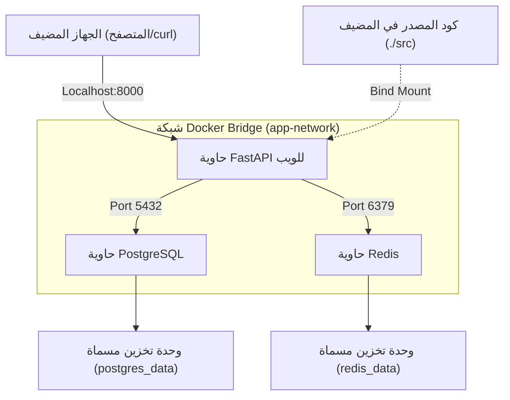
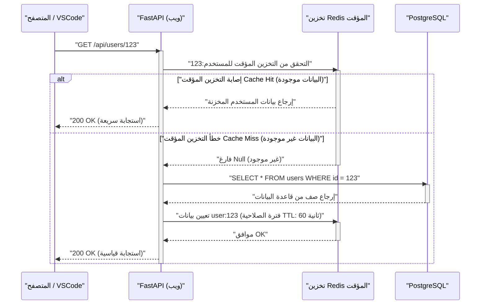

## 1. مقدمة: التخلص من مشكلة "إنها تعمل على جهازي"

في مجال تطوير البرمجيات، لطالما كانت مشكلة "إنها تعمل على جهازي (It works on my machine)" الناتجة عن اختلاف البيئات بين المطورين سبباً في إهدار الكثير من الوقت في العديد من المشاريع. فالاختلافات في أنظمة التشغيل، وإصدارات اللغات المثبتة، واعتماديات المكتبات، وتعارض الأدوات المثبتة عالمياً، تجعل البيئة المحلية دائماً عرضة لـ "عدم يقين الحالة".

الحل الجذري لهذه التحديات يكمن في تقنية الحاويات مثل **Docker**، ونموذج **البنية التحتية ككود (IaC)**. من خلال تحويل بيئة التطوير المحلية إلى حاويات، يمكن تحقيق العزل على مستوى نظام التشغيل، مما يسمح بإدارة إصدارات البيئة نفسها جنباً إلى جنب مع قاعدة الكود.

في هذا المقال، سنشرح بالتفصيل وبشكل شامل الخطوات اللازمة لبناء **"بيئة تطوير محلية قابلة لإعادة الإنتاج بحيث تكون متطابقة تماماً بغض النظر عمن يقوم بتشغيلها، أو متى، أو على أي جهاز"** باستخدام Docker، و Docker Compose، و VSCode DevContainers. كما سنتناول الآليات التقنية العميقة الكامنة وراءها، مع دمج وجهات نظر رياضية.

---

## 2. التوافق بين البنية التحتية ككود (IaC) وتقنية الحاويات

### مبادئ IaC وتطبيقها على البيئة المحلية

البنية التحتية ككود (IaC) هي نهج لإدارة وتجهيز إعدادات البنية التحتية من خلال ملفات تعريف قابلة للقراءة آلياً، بدلاً من العمليات اليدوية. تشمل المبادئ الأساسية لـ IaC العناصر التالية:

1. **النهج التعريفي (Declarative Approach)**: تحديد "ما يجب أن تكون عليه الحالة النهائية" بدلاً من "كيفية تغيير الحالة".
2. **الاستقواء (Idempotency)**: ضمان الحصول على نفس النتيجة (الحالة) دائماً بغض النظر عن عدد مرات تشغيل السكربت.
3. **التحكم في الإصدارات (Version Control)**: حفظ حالة البنية التحتية ككود في أنظمة التحكم في الإصدارات (VCS) مثل Git، مما يتيح تتبع سجل التغييرات والمراجعة من قبل النظراء.

تطبيق IaC في بيئة التطوير المحلية يعني كتابة "الحالة المثالية" لبيئة التطوير ككود باستخدام ملفات مثل `Dockerfile`، و `docker-compose.yml`، و `devcontainer.json`. وهذا يحقق تجربة تأهيل (Onboarding) سلسة للأعضاء الجدد في الفريق، حيث يمكنهم بدء التطوير فوراً بمجرد استنساخ المستودع وتشغيل أمر واحد.

### ميزات النواة (Kernel) التي تدعم تقنية الحاويات

تختلف تقنية الحاويات عن المحاكاة الافتراضية القائمة على الهايبرفايزر (مثل الأجهزة الافتراضية VM)، حيث إنها تقنية محاكاة افتراضية خفيفة الوزن تقوم بعزل العمليات (Isolation) مع مشاركة نواة نظام التشغيل المضيف. ولتحقيق ذلك، يتم استخدام الميزات التالية من نواة Linux بشكل أساسي:

- **مساحات الأسماء (Namespaces)**: توفر عرضاً مستقلاً لموارد النظام (مثل PID، والشبكة، ونقاط التركيب (Mount points)، والمستخدمين) لكل عملية.
- **مجموعات التحكم (Cgroups - Control Groups)**: تقوم بتقييد وتخصيص الموارد المادية (مثل المعالج CPU، والذاكرة، وإدخال/إخراج القرص I/O) التي يمكن للعملية استخدامها.
- **نظام ملفات الاتحاد (UnionFS - Union File System)**: تقنية تقوم بدمج عدة أشجار أدلة (طبقات) بشكل شفاف لتبدو كنظام ملفات واحد. تعتمد طبقات صور Docker على هذه التقنية.

دعونا ننظر في النموذج الرياضي لتقييد الموارد. بفرض أن السعة الإجمالية لذاكرة الجهاز المضيف هي $M_{\text{total}}$، وحد الذاكرة لكل حاوية من الحاويات الـ $n$ التي تعمل على المضيف هو $m_i$. فإن الشرط الضروري لعمل النظام باستقرار، مع أخذ الذاكرة الأساسية $M_{\text{os}}$ التي يستهلكها نظام التشغيل المضيف والعمليات الأخرى في الاعتبار، يمكن التعبير عنه بالمتراجحة التالية:

$$ \sum_{i=1}^{n} m_i \le M_{\text{total}} - M_{\text{os}} $$

من خلال الاستخدام الصارم لـ Cgroups لتعريف $m_i$ لكل حاوية، يمكننا منع انهيار الحاويات الأخرى أو النظام المضيف بأكمله بواسطة OOM (Out Of Memory) Killer عندما تتسبب حاوية معينة في تسرب للذاكرة.

---

## 3. التصميم الفعال لـ Dockerfile: إتقان البناء متعدد الطبقات (Multi-stage Build)

الخطوة الأولى نحو بيئة قابلة لإعادة الإنتاج هي تصميم `Dockerfile` الذي يحدد بيئة تشغيل التطبيق. هنا، باستخدام Python (FastAPI) كمثال، سنشرح أفضل الممارسات لكتابة Dockerfile آمن وخفيف الوزن بالاستفادة من **البناء متعدد الطبقات (Multi-stage Build)**.

البناء متعدد الطبقات هو تقنية تستخدم تعليمات `FROM` متعددة داخل `Dockerfile` واحد لفصل بيئة البناء (التي تحتوي على بيئة ثقيلة مثل المترجمات وأدوات التطوير) عن بيئة التشغيل (بيئة خفيفة الوزن تحتوي فقط على المخرجات الضرورية).

### مثال عملي لـ Dockerfile لتطبيق Python FastAPI

الكود أدناه هو مثال متقدم لـ `Dockerfile` يجمع بين إدارة الاعتماديات باستخدام Poetry والبناء متعدد الطبقات.

```dockerfile
# ---------------------------------------------------------
# Stage 1: Builder (بيئة البناء)
# ---------------------------------------------------------
FROM python:3.11-slim AS builder

# إعداد متغيرات البيئة الضرورية
ENV PYTHONUNBUFFERED=1 \
    PYTHONDONTWRITEBYTECODE=1 \
    POETRY_VERSION=1.6.1 \
    POETRY_HOME="/opt/poetry" \
    POETRY_VIRTUALENVS_IN_PROJECT=true \
    POETRY_NO_INTERACTION=1

# تثبيت الحزم المعتمدة
RUN apt-get update && apt-get install -y --no-install-recommends \
    curl build-essential && \
    curl -sSL https://install.python-poetry.org | python3 - && \
    apt-get clean && rm -rf /var/lib/apt/lists/*

ENV PATH="$POETRY_HOME/bin:$PATH"

WORKDIR /app

# نسخ ملفات الاعتماديات وتثبيتها
COPY pyproject.toml poetry.lock ./
RUN poetry install --no-root --only main

# ---------------------------------------------------------
# Stage 2: Runtime (بيئة التشغيل)
# ---------------------------------------------------------
FROM python:3.11-slim AS runtime

ENV PYTHONUNBUFFERED=1 \
    PYTHONDONTWRITEBYTECODE=1 \
    PATH="/app/.venv/bin:$PATH"

# إنشاء مستخدم غير متميز بحد أدنى من الصلاحيات
RUN groupadd -r appuser && useradd -r -g appuser appuser

WORKDIR /app

# نسخ البيئة الافتراضية (الاعتماديات) فقط من بيئة البناء
COPY --from=builder --chown=appuser:appuser /app/.venv /app/.venv

# نسخ كود التطبيق
COPY --chown=appuser:appuser ./src /app/src

# التبديل إلى المستخدم غير المتميز
USER appuser

# الأمر الافتراضي عند تشغيل الحاوية
ENTRYPOINT ["uvicorn", "src.main:app", "--host", "0.0.0.0", "--port", "8000"]
```

### التقييم الرياضي لحجم الصورة بسبب البناء متعدد الطبقات

لنفترض أن حجم الصورة عند بنائها في مرحلة واحدة هو $S_{\text{single}}$، وحجم الصورة عند تطبيق البناء متعدد الطبقات هو $S_{\text{multi}}$. يتم حساب معدل تقليل الحجم $R$ على النحو التالي:

$$ R = \left( 1 - \frac{S_{\text{multi}}}{S_{\text{single}}} \right) \times 100 \ (\%) $$

على سبيل المثال، لنفترض أن $S_{\text{single}}$ يحتوي على الصورة الأساسية لنظام التشغيل (حوالي 110 ميجابايت)، وحزم التطوير (مثل gcc حوالي 150 ميجابايت)، وبرنامج Poetry (حوالي 40 ميجابايت)، والمكتبات المعتمدة للمشروع (حوالي 80 ميجابايت)، والكود المصدري (حوالي 5 ميجابايت)، ليصبح المجموع 385 ميجابايت.
في المقابل، في $S_{\text{multi}}$، يتم نسخ المكتبات المعتمدة (80 ميجابايت) والكود المصدري (5 ميجابايت) فقط إلى الصورة الأساسية (110 ميجابايت)، ليصبح المجموع 195 ميجابايت.

$$ R = \left( 1 - \frac{195}{385} \right) \times 100 \approx 49.35\% $$

بهذه الطريقة، من خلال اعتماد البناء متعدد الطبقات، يمكن تقليل حجم الصورة إلى النصف تقريباً. هذا الانخفاض في الحجم يؤدي مباشرة إلى تسريع وقت السحب (Pull) من السجل (Registry)، وتوفير مساحة القرص، وتحسين الأمان من خلال تقليص مساحة الهجوم (Attack Surface).

---

## 4. تنسيق حاويات متعددة باستخدام Docker Compose

في تطوير تطبيقات الويب الحديثة، من الشائع استخدام بنية الخدمات المصغرة (Microservices Architecture) حيث تتعاون مكونات متعددة مثل خوادم الويب، وقواعد البيانات، وخوادم التخزين المؤقت (Cache). نستخدم `docker-compose.yml` لإدارة هذه المكونات بشكل مركزي في البيئة المحلية.

في هذا المثال، سنقوم ببناء نظام محلي يتكون من 3 طبقات: "الويب (FastAPI)"، و "قاعدة البيانات (PostgreSQL)"، و "التخزين المؤقت (Redis)".

### مخطط البنية (Mermaid)

يوضح المخطط التالي العلاقة بين الحاويات، والشبكة، ووحدات التخزين (Volumes) على الجهاز المحلي.



### تنفيذ وشرح تفصيلي لـ docker-compose.yml

فيما يلي مثال على `docker-compose.yml` متين وقابل للاستخدام في بيئات التطوير العملية.

```yaml
version: '3.8'

services:
  web:
    build:
      context: .
      target: runtime
    container_name: dev_web
    ports:
      - "8000:8000"
    volumes:
      - ./src:/app/src:ro  # تركيب كود المضيف بصلاحية القراءة فقط (لإعادة التحميل السريع)
    environment:
      - DATABASE_URL=postgresql://postgres:${POSTGRES_PASSWORD}@db:5432/${POSTGRES_DB}
      - REDIS_URL=redis://redis:6379/0
    env_file:
      - .env
    depends_on:
      db:
        condition: service_healthy
      redis:
        condition: service_started
    networks:
      - app-network
    command: ["uvicorn", "src.main:app", "--host", "0.0.0.0", "--port", "8000", "--reload"]

  db:
    image: postgres:15-alpine
    container_name: dev_db
    ports:
      - "5432:5432"
    environment:
      POSTGRES_USER: postgres
      POSTGRES_PASSWORD: ${POSTGRES_PASSWORD}
      POSTGRES_DB: ${POSTGRES_DB}
    volumes:
      - postgres_data:/var/lib/postgresql/data
    networks:
      - app-network
    healthcheck:
      test: ["CMD-SHELL", "pg_isready -U postgres -d ${POSTGRES_DB}"]
      interval: 5s
      timeout: 5s
      retries: 5

  redis:
    image: redis:7-alpine
    container_name: dev_redis
    ports:
      - "6379:6379"
    volumes:
      - redis_data:/data
    networks:
      - app-network
    command: ["redis-server", "--appendonly", "yes"]

volumes:
  postgres_data:
  redis_data:

networks:
  app-network:
    driver: bridge
```

### وحدات التخزين (Volumes) والاحتفاظ بالبيانات

تعتبر الحاويات من حيث المبدأ "عديمة الحالة (Stateless)" و "قصيرة العمر (Ephemeral)". عند تدمير الحاوية، تضيع البيانات الموجودة بداخلها. للحفاظ على بيانات قاعدة البيانات أو التخزين المؤقت، يجب تركيب (Mount) مساحة من نظام ملفات الجهاز المضيف داخل الحاوية.

- **تركيب الربط (Bind Mount)**: يندرج تحت ذلك `./src:/app/src:ro` في خدمة `web` المذكورة أعلاه. يقوم بتعيين دليل معين على المضيف مباشرة داخل الحاوية. يُستخدم لعكس تعديلات الكود المحلية على الفور في الحاوية (إعادة التحميل السريع). من منظور الأمان، يُعتبر إضافة خيار `:ro` (Read-Only) ممارسة مثلى لمنع الحاوية من تعديل كود المصدر الموجود على المضيف.
- **وحدة التخزين المسماة (Named Volume)**: يندرج تحت ذلك `postgres_data` و `redis_data`. هي مساحات تديرها Docker داخلياً (مثل `/var/lib/docker/volumes/`)، وتتميز بأداء إدخال/إخراج أفضل من تركيب الربط، وتستوعب اختلافات نظام الملفات بين أنظمة التشغيل المختلفة. يجب استخدامها دائماً لحفظ بيانات قواعد البيانات.

### الشبكات (Networking) واكتشاف الخدمات

بشكل افتراضي، يقوم Docker Compose بإنشاء شبكة Bridge خاصة لكل مشروع. هذه هي `app-network` المذكورة أعلاه.
يمكن للحاويات التي تنتمي إلى نفس الشبكة تحليل الأسماء (DNS Resolution) لبعضها البعض باستخدام "اسم الخدمة (مثل: `db`, `redis`)" كاسم مضيف بدلاً من عنوان IP.
على سبيل المثال، من حاوية الويب، يمكن الوصول إلى قاعدة البيانات باستخدام عنوان URL `postgresql://postgres:password@db:5432/mydb`. يتيح ذلك التبديل السلس لوجهة الاتصال بين البيئة المحلية وبيئة الإنتاج باستخدام متغيرات البيئة دون تعديل كود البنية التحتية.

### فحص الصحة (Healthcheck) والتحكم في ترتيب بدء التشغيل

يتحكم توجيه `depends_on` في ترتيب بدء تشغيل الحاويات، ولكن بمجرد تحديد `depends_on` فقط، ستبدأ حاوية الويب بمجرد "بدء تشغيل" حاوية قاعدة البيانات. في الواقع، قد تستغرق عملية تهيئة قاعدة البيانات (بدء عملية PostgreSQL وتجهيز الجداول) بضع ثوانٍ، مما قد يؤدي إلى حدوث خطأ عند محاولة حاوية الويب الاتصال بها.
لتجنب ذلك، يمكن تعريف `healthcheck` واستخدام `condition: service_healthy`، مما يسمح بالتأكد من "استعداد قاعدة البيانات لاستقبال طلبات الاتصال" قبل بدء تشغيل حاوية الويب.

---

## 5. إدارة متغيرات البيئة والأمان (.env)

يعتبر تشفير المعلومات الحساسة مثل كلمات مرور قاعدة البيانات ومفاتيح API برمجياً (Hardcoding) داخل `docker-compose.yml` ممارسة سيئة يجب تجنبها تماماً. بدلاً من ذلك، نستخدم ملف متغيرات البيئة `.env` لحقن هذه القيم.

قم بإنشاء ملف `.env` في جذر المشروع.

```ini
# ملف .env (يجب إضافته إلى .gitignore لاستبعاده من إدارة Git)
POSTGRES_PASSWORD=supersecretpassword
POSTGRES_DB=devdb
API_SECRET_KEY=dev_secret_key_12345
```

بشكل افتراضي، يقرأ Docker Compose ملف `.env` الموجود في دليل التنفيذ، ويستبدل العناصر النائبة بالشكل `${VAR_NAME}` في ملف YAML. تتيح هذه الطريقة إدارة إعدادات مختلفة للبيئات المتعددة مثل البيئة المحلية، وبيئة الاختبار (Staging)، وبيئة الإنتاج (Production) بشكل آمن دون تغيير كود البنية التحتية.

---

## 6. تجربة التطوير القصوى باستخدام VSCode DevContainers

حتى الآن، قمنا ببناء بيئة خلفية (Backend) متينة باستخدام Docker. ولكن يمكننا اتخاذ خطوة أبعد من ذلك. من خلال استخدام ميزة **VSCode DevContainers (Remote - Containers)**، يصبح من الممكن تشغيل الواجهة الخلفية للمحرر (VSCode) نفسه داخل الحاوية.

بهذا، لم يعد من الضروري تثبيت Python أو Node.js على الجهاز المحلي، ويمكن تحديد كل شيء بدءاً من أدوات الفحص (Linter مثل flake8/eslint) وأدوات التنسيق (Formatter مثل black/prettier) وصولاً إلى إضافات بيئة التطوير المتكاملة (IDE) داخل قاعدة الكود لمشاركتها مع جميع أعضاء الفريق.

### إعداد devcontainer.json

قم بإنشاء دليل `.devcontainer` في جذر المشروع، وضع بداخله ملف التكوين.

`.devcontainer/devcontainer.json`:
```json
{
  "name": "Python FastAPI Dev Environment",
  "dockerComposeFile": ["../docker-compose.yml"],
  "service": "web",
  "workspaceFolder": "/app",
  "customizations": {
    "vscode": {
      "settings": {
        "python.defaultInterpreterPath": "/app/.venv/bin/python",
        "python.formatting.provider": "black",
        "editor.formatOnSave": true
      },
      "extensions": [
        "ms-python.python",
        "ms-python.vscode-pylance",
        "ms-python.black-formatter",
        "tamasfe.even-better-toml"
      ]
    }
  },
  "forwardPorts": [8000, 5432, 6379],
  "remoteUser": "appuser",
  "postCreateCommand": "poetry install"
}
```

بمجرد تضمين هذا الملف في المستودع، عند فتح المشروع في VSCode، ستظهر رسالة "Reopen in Container". وبنقرة واحدة، سيتم تشغيل جميع الحاويات اللازمة، وتثبيت الإضافات، لتكون جاهزاً لبدء البرمجة على الفور. إنها تجربة سحرية حقاً.

---

## 7. تسلسل معالجة الطلبات ونمذجة الأداء

سنراجع دورة حياة معالجة الطلب لتطبيق الويب في بيئة التطوير المحلية المبنية من خلال مخطط التسلسل (Sequence Diagram)، وسنحلل النموذج الرياضي لأدائها.

### مخطط التسلسل (تدفق الطلب)



### النموذج الرياضي لتأخير المعالجة (Latency)

سنقوم بنمذجة متوسط وقت معالجة الطلب $T_{\text{total}}$ رياضياً في النظام المذكور أعلاه.
نعرّف تأخير (Latency) كل عملية على النحو التالي:
- $T_{\text{net}}$: تأخير الشبكة بين العميل وحاوية الويب
- $T_{\text{app}}$: وقت المعالجة الخالص من جانب التطبيق (مثل التسلسل Serialization)
- $T_{\text{cache}}$: الوقت المستغرق في القراءة/الكتابة من وإلى Redis
- $T_{\text{db}}$: الوقت المستغرق لتنفيذ الاستعلام على PostgreSQL
- $p_{\text{miss}}$: معدل فشل التخزين المؤقت (Cache Miss Rate) ($0 \le p_{\text{miss}} \le 1$)

عندئذٍ، يتم تمثيل متوسط وقت الاستجابة من خلال معادلة القيمة المتوقعة التالية:

$$ T_{\text{total}} = T_{\text{net}} + T_{\text{app}} + T_{\text{cache}} + p_{\text{miss}} \times (T_{\text{db}} + T_{\text{cache\_write}}) $$

في بيئة التطوير المحلية (داخل Docker)، يكون $T_{\text{net}}$ قريباً جداً من 0، ولكن ما يستحق الانتباه هو **أداء الإدخال/الإخراج (I/O) أثناء تركيب الربط (Bind Mount)**. خاصة عند استخدام Docker Desktop على أنظمة Windows أو macOS، يميل $T_{\text{app}}$ (وقت قراءة الكود وما إلى ذلك) إلى التضخم بسبب العبء الإضافي لمشاركة الملفات بين نظام التشغيل المضيف والجهاز الافتراضي (الحاوية). للتغلب على عنق الزجاجة هذا، يوصى بشدة باستخدام DevContainers المذكورة أعلاه لوضع كود المصدر بالكامل داخل وحدة تخزين مسماة (Named Volume)، أو استخدام بنية يعمل فيها محرك Docker أصلياً على بيئة WSL2 (Windows Subsystem for Linux 2).

---

## 8. تحسين أداء بناء Docker: استراتيجية التخزين المؤقت للطبقات (Layer Cache)

يتغير وقت البناء بشكل كبير اعتماداً على ما إذا كنت تفهم آلية "التخزين المؤقت للطبقات" عند كتابة Dockerfile.
تقوم Docker بإنشاء فرق لنظام الملفات (طبقة) لكل تعليمة في Dockerfile (مثل `FROM`، و `RUN`، و `COPY`)، وتحتفظ بها كنسخة مخبأة. عند إعادة البناء، يتم إعادة استخدام النسخ المخبأة للطبقات التي لم تتغير.

المبدأ الأساسي هو **"كتابة التعليمات بالترتيب من الأقل تغييراً إلى الأكثر تغييراً"**.

دعونا ننمذج تأثير تغيير كود المصدر على وقت البناء. ليكن إجمالي وقت البناء هو $T_{\text{build}}$، ووقت تنفيذ كل خطوة هو $T_{\text{layer}_i}$، ووجود أو عدم وجود إصابة للنسخة المخبأة (Cache Hit) هو قيمة منطقية $c_i \in \{0, 1\}$ (حيث 1 تعني إصابة النسخة المخبأة).

$$ T_{\text{build}} = T_{\text{init}} + \sum_{i=1}^{n} (1 - c_i) \times T_{\text{layer}_i} $$

بمجرد حدوث خطأ في النسخة المخبأة (Cache Miss) ($c_k = 0$) في الطبقة $k$، يتم إبطال التخزين المؤقت ($c_j = 0$) في جميع الطبقات اللاحقة $j > k$.

```dockerfile
# مثال سيء (نسخ كود المصدر أولاً)
COPY ./src /app/src
COPY pyproject.toml poetry.lock ./
RUN poetry install
```
في الحالة أعلاه، يؤدي تعديل سطر واحد فقط من الكود إلى فشل النسخة المخبأة لأمر `COPY` الأول، مما يتسبب في تنفيذ `RUN poetry install` الذي يستغرق وقتاً طويلاً في كل مرة.

```dockerfile
# مثال جيد (حل الاعتماديات أولاً)
COPY pyproject.toml poetry.lock ./
RUN poetry install
COPY ./src /app/src
```
بكتابتها بهذه الطريقة، حتى لو قمت بتغيير كود المصدر، يظل التخزين المؤقت لطبقة `poetry install` فعالاً ($c_i = 1$)، مما يقلل وقت البناء بشكل كبير من عدة دقائق إلى بضع ثوانٍ.

---

## 9. استكشاف الأخطاء وإصلاحها ونصائح (Tips)

فيما يلي بعض المشاكل الشائعة والحلول عند تشغيل البيئة المحلية.

1. **خطأ تعارض المنافذ**
   إذا ظهر خطأ مثل `Bind for 0.0.0.0:8000 failed: port is already allocated`، فهذا يعني أن عملية أخرى على الجهاز المحلي تستخدم هذا المنفذ. يمكن تجنب ذلك بتغيير رقم المنفذ على الجانب المضيف إلى شيء مثل `ports: - "8080:8000"`.

2. **نفاد مساحة القرص**
   مع استخدام Docker لفترات طويلة، تتراكم الصور ووحدات التخزين غير المستخدمة (Dangling Images / Volumes)، مما قد يستهلك عشرات الجيجابايت من مساحة القرص. يُنصح بتنظيف النظام دورياً باستخدام الأمر التالي.
   ```bash
   docker system prune -a --volumes
   ```

3. **مشكلة صلاحيات الملفات**
   عند استخدام تركيب الربط (Bind Mount) في بيئة Linux، قد يصبح المالك (Owner) للملفات المنشأة داخل الحاوية هو `root`، مما يمنع تحريرها من الجانب المضيف. يمكن حل هذه المشكلة عن طريق إنشاء مستخدم غير متميز داخل Dockerfile ومطابقة المعرف الخاص به (UID/GID) (مثل 1000:1000) مع الخاص بنظام التشغيل المضيف.

---

## 10. الخاتمة: كيف يساهم التكرار وقابلية إعادة الإنتاج في تحسين سرعة التطوير

من خلال الجمع بين Docker، و Docker Compose، و VSCode DevContainers، يمكننا تحقيق بيئة تطوير محلية قوية "تكون متطابقة تماماً بغض النظر عمن يقوم بإعدادها".

إن جلب نموذج IaC إلى البيئة المحلية لا يقتصر فقط على تقليل وقت الإعداد الأولي؛ بل يزيل القلق بشأن تغييرات إعدادات البنية التحتية، ويسهل تجربة تقنيات جديدة، ويتيح الانتقال السلس إلى خطوط أنابيب التكامل المستمر والتسليم المستمر (CI/CD)، مما يؤدي إلى تحسين سرعة وجودة دورة التطوير بأكملها بشكل كبير.

ندعوك لتطبيق أفضل الممارسات التي شرحناها في هذا المقال، مثل تحسين حجم الصورة باستخدام البناء متعدد الطبقات، والتحكم في الاعتماديات من خلال فحوصات الصحة، وكتابة Dockerfile مع مراعاة التخزين المؤقت للطبقات، لتوفير أفضل تجربة تطوير (DX: Developer Experience) في مشاريعك الخاصة.
