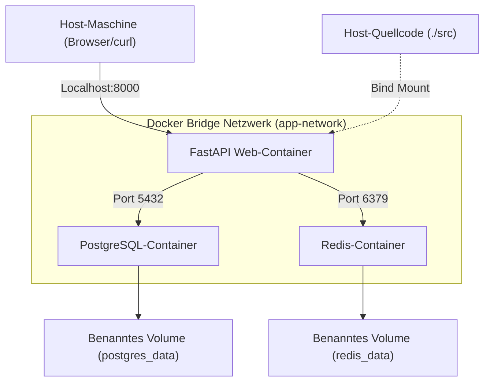
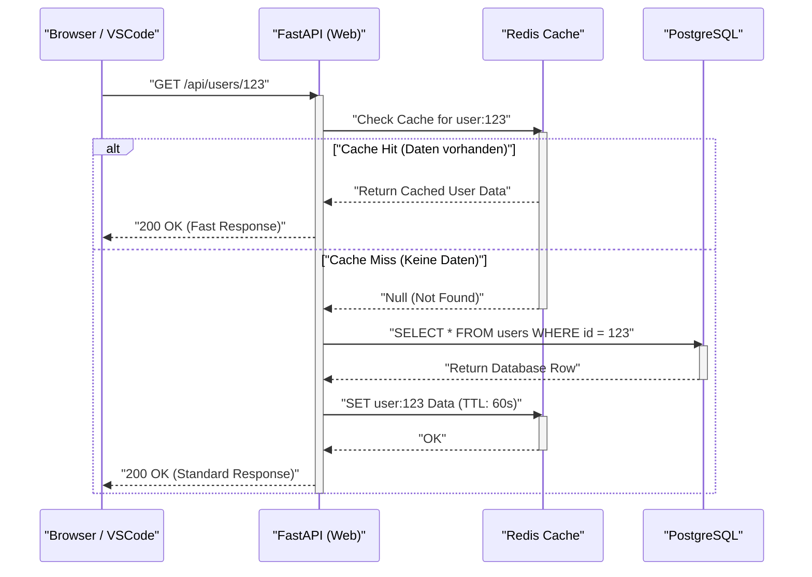

## 1. Einführung: Weg von "Auf meiner Maschine funktioniert es"

In der Softwareentwicklung ist das Problem "Auf meiner Maschine funktioniert es" (It works on my machine), das auf unterschiedliche Umgebungen zwischen Entwicklern zurückzuführen ist, seit langem ein Faktor, der in vielen Projekten Zeit verschwendet. Aufgrund von Unterschieden im Betriebssystem, Versionen installierter Sprachen, Bibliotheksabhängigkeiten und Konflikten zwischen global installierten Tools ist die lokale Umgebung ständig einer "Zustandsunsicherheit" ausgesetzt.

Was diese Probleme von Grund auf löst, sind Container-Technologien wie **Docker** und das Paradigma von **Infrastructure as Code (IaC)**. Durch die Containerisierung der lokalen Entwicklungsumgebung wird eine Isolierung auf Betriebssystemebene erreicht, was es ermöglicht, die Umgebung selbst zusammen mit der Codebasis zu versionieren.

In diesem Artikel erklären wir ausführlich die Schritte zum Aufbau einer **"reproduzierbaren lokalen Entwicklungsumgebung, die immer in exakt demselben Zustand startet, unabhängig davon, wer sie wann und auf welcher Maschine startet"**, unter Verwendung von Docker, Docker Compose und VSCode DevContainers. Wir beleuchten auch die tiefgreifenden technischen Mechanismen dahinter, einschließlich einer mathematischen Perspektive.

---

## 2. Die Affinität zwischen Infrastructure as Code (IaC) und Container-Technologie

### Prinzipien von IaC und deren Anwendung auf lokale Umgebungen

Infrastructure as Code (IaC) ist ein Ansatz zur Verwaltung der Konfiguration und Bereitstellung von Infrastruktur durch maschinenlesbare Definitionsdateien anstelle von manuellen Prozessen. Zu den Kernprinzipien von IaC gehören folgende Elemente:

1. **Deklarativer Ansatz (Declarative Approach)**: Definiert "wie der Endzustand sein soll", anstatt "wie der Zustand geändert werden soll".
2. **Idempotenz (Idempotency)**: Egal wie oft das Skript ausgeführt wird, es wird immer dasselbe Ergebnis (Zustand) garantiert.
3. **Versionskontrolle (Version Control)**: Der Zustand der Infrastruktur wird als Code in einem VCS wie Git gespeichert, was die Verfolgung des Änderungsverlaufs und Peer-Reviews ermöglicht.

Die Umsetzung von IaC in einer lokalen Entwicklungsumgebung bedeutet, den "idealen Zustand" der Entwicklungsumgebung mit `Dockerfile`, `docker-compose.yml` und `devcontainer.json` in Code zu fassen. Dadurch wird ein Onboarding-Erlebnis geschaffen, bei dem neue Teammitglieder einfach das Repository klonen und einen einzigen Befehl ausführen können, um sofort mit der Entwicklung zu beginnen.

### Kernel-Funktionen, die die Container-Technologie unterstützen

Im Gegensatz zur Hypervisor-basierten Virtualisierung wie bei virtuellen Maschinen (VMs) ist die Container-Technologie eine leichtgewichtige Virtualisierungstechnik, die Prozesse isoliert, während sie den Kernel des Host-Betriebssystems teilt. Um dies zu erreichen, werden hauptsächlich die folgenden Funktionen des Linux-Kernels verwendet:

- **Namespaces**: Bieten eine isolierte Sicht auf Systemressourcen (PID, Netzwerk, Mount-Punkte, Benutzer usw.) für jeden Prozess.
- **Cgroups (Control Groups)**: Begrenzen und weisen physische Ressourcen (CPU, Speicher, Festplatten-I/O usw.) zu, die von Prozessen verwendet werden können.
- **UnionFS (Union File System)**: Eine Technologie, die mehrere Verzeichnisbäume (Ebenen) transparent überlagert, sodass sie als ein einziges Dateisystem erscheinen. Die Image-Ebenen von Docker basieren auf dieser Technologie.

Betrachten wir ein mathematisches Modell der Ressourcenbegrenzung. Sei $M_{\text{total}}$ die Gesamtspeicherkapazität der Host-Maschine und $m_i$ die Speicherbegrenzung von $n$ Containern, die auf dem Host laufen. Unter Berücksichtigung des Basisspeichers $M_{\text{os}}$, der vom Host-Betriebssystem und anderen Prozessen verbraucht wird, kann die notwendige Bedingung für den stabilen Betrieb des Systems durch folgende Ungleichung ausgedrückt werden:

$$ \sum_{i=1}^{n} m_i \le M_{\text{total}} - M_{\text{os}} $$

Indem $m_i$ für jeden Container mithilfe von Cgroups strikt definiert wird, kann verhindert werden, dass der OOM (Out Of Memory) Killer andere Container oder das gesamte Host-System zum Absturz bringt, selbst wenn ein bestimmter Container ein Speicherleck verursacht.

---

## 3. Effizientes Dockerfile-Design: Multi-Stage-Builds meistern

Der erste Schritt zu einer reproduzierbaren Umgebung ist das Design des `Dockerfile`, das die Ausführungsumgebung der Anwendung definiert. Hier erklären wir am Beispiel von Python (FastAPI) die Best Practices für ein sicheres und leichtgewichtiges Dockerfile unter Verwendung von **Multi-Stage-Builds**.

Ein Multi-Stage-Build ist eine Technik, die mehrere `FROM`-Anweisungen in einem einzigen `Dockerfile` verwendet, um die Build-Umgebung (eine schwere Umgebung, die Compiler und Entwicklungstools enthält) von der Laufzeitumgebung (einer leichtgewichtigen Umgebung, die nur die notwendigen Artefakte enthält) zu trennen.

### Praktisches Dockerfile für Python FastAPI

Der folgende Code ist ein Beispiel für ein fortgeschrittenes `Dockerfile`, das Abhängigkeitsmanagement mit Poetry und Multi-Stage-Builds kombiniert.

```dockerfile
# ---------------------------------------------------------
# Stage 1: Builder (Build-Umgebung)
# ---------------------------------------------------------
FROM python:3.11-slim AS builder

# Festlegen erforderlicher Umgebungsvariablen
ENV PYTHONUNBUFFERED=1 \
    PYTHONDONTWRITEBYTECODE=1 \
    POETRY_VERSION=1.6.1 \
    POETRY_HOME="/opt/poetry" \
    POETRY_VIRTUALENVS_IN_PROJECT=true \
    POETRY_NO_INTERACTION=1

# Installation von Abhängigkeiten
RUN apt-get update && apt-get install -y --no-install-recommends \
    curl build-essential && \
    curl -sSL https://install.python-poetry.org | python3 - && \
    apt-get clean && rm -rf /var/lib/apt/lists/*

ENV PATH="$POETRY_HOME/bin:$PATH"

WORKDIR /app

# Kopieren und Installieren der Abhängigkeitsdateien
COPY pyproject.toml poetry.lock ./
RUN poetry install --no-root --only main

# ---------------------------------------------------------
# Stage 2: Runtime (Laufzeitumgebung)
# ---------------------------------------------------------
FROM python:3.11-slim AS runtime

ENV PYTHONUNBUFFERED=1 \
    PYTHONDONTWRITEBYTECODE=1 \
    PATH="/app/.venv/bin:$PATH"

# Erstellen eines minimalen, nicht privilegierten Benutzers
RUN groupadd -r appuser && useradd -r -g appuser appuser

WORKDIR /app

# Kopieren nur der virtuellen Umgebung (Abhängigkeiten) vom Builder
COPY --from=builder --chown=appuser:appuser /app/.venv /app/.venv

# Kopieren des Anwendungscodes
COPY --chown=appuser:appuser ./src /app/src

# Wechseln zum nicht privilegierten Benutzer
USER appuser

# Standardbefehl beim Starten des Containers
ENTRYPOINT ["uvicorn", "src.main:app", "--host", "0.0.0.0", "--port", "8000"]
```

### Mathematische Bewertung der Image-Größe durch Multi-Stage-Builds

Sei $S_{\text{single}}$ die Image-Größe bei einem Single-Stage-Build und $S_{\text{multi}}$ die Image-Größe bei Anwendung eines Multi-Stage-Builds. Die Reduktionsrate der Größe $R$ wird wie folgt berechnet:

$$ R = \left( 1 - \frac{S_{\text{multi}}}{S_{\text{single}}} \right) \times 100 \ (\%) $$

Angenommen, $S_{\text{single}}$ enthält das Basis-Image des Betriebssystems (ca. 110 MB), Entwicklungspakete (z. B. gcc, ca. 150 MB), Poetry selbst (ca. 40 MB), die Abhängigkeitsbibliotheken des Projekts (ca. 80 MB) und den Quellcode (ca. 5 MB), was insgesamt 385 MB ergibt.
Andererseits werden in $S_{\text{multi}}$ nur die Abhängigkeitsbibliotheken (80 MB) und der Quellcode (5 MB) in das Basis-Image (110 MB) kopiert, was insgesamt 195 MB ergibt.

$$ R = \left( 1 - \frac{195}{385} \right) \times 100 \approx 49.35\% $$

Wie gezeigt, kann durch die Einführung von Multi-Stage-Builds die Image-Größe um etwa die Hälfte reduziert werden. Die Reduzierung der Image-Größe führt direkt zu kürzeren Pull-Zeiten aus der Registry, Einsparungen beim Festplattenspeicher und einer Erhöhung der Sicherheit durch Verkleinerung der Angriffsfläche (Attack Surface).

---

## 4. Orchestrierung mehrerer Container mit Docker Compose

In der modernen Entwicklung von Webanwendungen ist eine Microservices-Architektur üblich, in der mehrere Komponenten wie Webserver, Datenbanken und Cache-Server zusammenarbeiten. Um diese in einer lokalen Umgebung zentral zu verwalten, wird `docker-compose.yml` verwendet.

In diesem Fall werden wir ein 3-Schicht-System bestehend aus "Web (FastAPI)", "Database (PostgreSQL)" und "Cache (Redis)" lokal aufbauen.

### Architekturdiagramm (Mermaid)

Das folgende Diagramm ist ein Blockdiagramm, das die Beziehungen zwischen den einzelnen Containern, dem Netzwerk und den Volumes auf dem lokalen Rechner darstellt.



### Implementierung und detaillierte Erklärung der docker-compose.yml

Im Folgenden zeigen wir ein Beispiel für eine robuste `docker-compose.yml`, die für den Aufbau einer praktischen Umgebung geeignet ist.

```yaml
version: '3.8'

services:
  web:
    build:
      context: .
      target: runtime
    container_name: dev_web
    ports:
      - "8000:8000"
    volumes:
      - ./src:/app/src:ro  # Host-Code im schreibgeschützten Modus einhängen (für Hot Reloading)
    environment:
      - DATABASE_URL=postgresql://postgres:${POSTGRES_PASSWORD}@db:5432/${POSTGRES_DB}
      - REDIS_URL=redis://redis:6379/0
    env_file:
      - .env
    depends_on:
      db:
        condition: service_healthy
      redis:
        condition: service_started
    networks:
      - app-network
    command: ["uvicorn", "src.main:app", "--host", "0.0.0.0", "--port", "8000", "--reload"]

  db:
    image: postgres:15-alpine
    container_name: dev_db
    ports:
      - "5432:5432"
    environment:
      POSTGRES_USER: postgres
      POSTGRES_PASSWORD: ${POSTGRES_PASSWORD}
      POSTGRES_DB: ${POSTGRES_DB}
    volumes:
      - postgres_data:/var/lib/postgresql/data
    networks:
      - app-network
    healthcheck:
      test: ["CMD-SHELL", "pg_isready -U postgres -d ${POSTGRES_DB}"]
      interval: 5s
      timeout: 5s
      retries: 5

  redis:
    image: redis:7-alpine
    container_name: dev_redis
    ports:
      - "6379:6379"
    volumes:
      - redis_data:/data
    networks:
      - app-network
    command: ["redis-server", "--appendonly", "yes"]

volumes:
  postgres_data:
  redis_data:

networks:
  app-network:
    driver: bridge
```

### Volumes und Datenpersistenz

Container sind grundsätzlich "zustandslos (stateless)" und "kurzlebig (ephemeral)". Wenn ein Container zerstört wird, gehen auch die internen Daten verloren. Um Datenbankdaten oder Caches beizubehalten, muss ein Bereich des Dateisystems der Host-Maschine im Container gemountet werden.

- **Bind Mount**: Das `./src:/app/src:ro` im obigen `web`-Service ist ein Beispiel dafür. Ein bestimmtes Verzeichnis auf dem Host wird direkt in den Container gemappt. Dies wird verwendet, um lokale Code-Änderungen sofort im Container widerzuspiegeln (Hot Reloading). Aus Sicherheitsgründen ist es eine Best Practice, die Option `:ro` (Read-Only) hinzuzufügen, um zu verhindern, dass der Host-Quellcode vom Container aus geändert wird.
- **Benanntes Volume (Named Volume)**: Hierunter fallen `postgres_data` und `redis_data`. Es handelt sich um Bereiche, die Docker intern verwaltet (z.B. `/var/lib/docker/volumes/`). Sie bieten eine bessere I/O-Leistung als Bind Mounts und verbergen die Unterschiede zwischen den Dateisystemen verschiedener Betriebssysteme. Für die Persistenz von Datenbanken sollte immer diese Methode verwendet werden.

### Netzwerk (Networking) und Service Discovery

Docker Compose erstellt standardmäßig für jedes Projekt ein eigenes Bridge-Netzwerk, wie das obige `app-network`.
Container, die zum selben Netzwerk gehören, können einander über den "Service-Namen (z. B. `db`, `redis`)" als Hostnamen auflösen (DNS-Auflösung) anstatt über IP-Adressen.
Zum Beispiel kann der Web-Container über die URL `postgresql://postgres:password@db:5432/mydb` auf die Datenbank zugreifen. Dies ermöglicht es, das Verbindungsziel transparent über Umgebungsvariablen umzuschalten, sowohl in lokalen Umgebungen als auch in Produktionsumgebungen.

### Health Checks und Steuerung der Startreihenfolge

Die Direktive `depends_on` steuert die Startreihenfolge von Containern, aber wenn Sie nur `depends_on` angeben, wird der Web-Container gestartet, sobald "der DB-Container gestartet ist". In der Realität dauert es jedoch einige Sekunden, bis der Initialisierungsprozess der Datenbank (Start des PostgreSQL-Prozesses und Vorbereitung der Tabellen) abgeschlossen ist, was dazu führen kann, dass die DB-Verbindung vom Web-Container aus fehlschlägt.
Um dies zu verhindern, kann man einen `healthcheck` definieren und `condition: service_healthy` festlegen. Dadurch wird sichergestellt, dass der Web-Container erst gestartet wird, nachdem verifiziert wurde, dass "die Datenbank bereit ist, Verbindungsanfragen anzunehmen".

---

## 5. Verwaltung von Umgebungsvariablen und Sicherheit (.env)

Das Festcodieren sensibler Informationen wie Datenbankpasswörter oder API-Schlüssel in der `docker-compose.yml` ist ein Anti-Pattern, das unbedingt vermieden werden sollte. Stattdessen verwenden wir eine Umgebungsvariablendatei `.env`, um diese Werte zu injizieren.

Erstellen Sie eine `.env`-Datei im Projektstammverzeichnis.

```ini
# .env Datei (Zur .gitignore hinzufügen, um sie von der Git-Verwaltung auszuschließen)
POSTGRES_PASSWORD=supersecretpassword
POSTGRES_DB=devdb
API_SECRET_KEY=dev_secret_key_12345
```

Docker Compose liest standardmäßig die `.env`-Datei im Ausführungsverzeichnis und erweitert die Platzhalter `${VAR_NAME}` in der YAML-Datei. Diese Methode ermöglicht es, unterschiedliche Konfigurationswerte für Umgebungen wie lokal, Staging und Produktion sicher zu verwalten, ohne den Infrastrukturcode zu ändern.

---

## 6. Das ultimative Entwicklungserlebnis mit VSCode DevContainers

Bis hierhin haben wir eine robuste Backend-Umgebung mit Docker aufgebaut. Wir können jedoch noch einen Schritt weiter gehen. Durch die Nutzung der Funktion **VSCode DevContainers (Remote - Containers)** ist es möglich, das Backend des Editors (VSCode) selbst innerhalb des Containers auszuführen.

Dadurch müssen weder Python noch Node.js auf der lokalen Maschine installiert werden. Alles, von Lintern (flake8/eslint) und Formattern (black/prettier) bis hin zu IDE-Erweiterungen, kann innerhalb der Codebasis definiert und mit dem gesamten Team geteilt werden.

### Konfiguration von devcontainer.json

Erstellen Sie im Projektstammverzeichnis ein `.devcontainer`-Verzeichnis und platzieren Sie die Konfigurationsdatei darin.

`.devcontainer/devcontainer.json`:
```json
{
  "name": "Python FastAPI Dev Environment",
  "dockerComposeFile": ["../docker-compose.yml"],
  "service": "web",
  "workspaceFolder": "/app",
  "customizations": {
    "vscode": {
      "settings": {
        "python.defaultInterpreterPath": "/app/.venv/bin/python",
        "python.formatting.provider": "black",
        "editor.formatOnSave": true
      },
      "extensions": [
        "ms-python.python",
        "ms-python.vscode-pylance",
        "ms-python.black-formatter",
        "tamasfe.even-better-toml"
      ]
    }
  },
  "forwardPorts": [8000, 5432, 6379],
  "remoteUser": "appuser",
  "postCreateCommand": "poetry install"
}
```

Indem Sie diese Datei in das Repository aufnehmen, wird sofort nach dem Öffnen des Projekts in VSCode die Aufforderung "Reopen in Container" angezeigt. Mit nur einem Klick werden alle notwendigen Container gestartet, Erweiterungen installiert und Sie sind sofort bereit, mit dem Coden zu beginnen. Es ist wahrlich ein magisches Erlebnis.

---

## 7. Sequenz der Anforderungsverarbeitung und Leistungsmodellierung

Wir betrachten den Lebenszyklus der Anforderungsverarbeitung der Webanwendung in der aufgebauten lokalen Entwicklungsumgebung anhand eines Sequenzdiagramms und diskutieren ein mathematisches Modell für deren Leistung.

### Sequenzdiagramm (Anforderungsfluss)



### Mathematisches Modell der Verarbeitungsverzögerung (Latenz)

Wir modellieren mathematisch die durchschnittliche Anforderungsverarbeitungszeit $T_{\text{total}}$ im obigen System.
Wir definieren die Latenz jeder Verarbeitung wie folgt:
- $T_{\text{net}}$: Netzwerklatenz zwischen Client und Web-Container
- $T_{\text{app}}$: Reine Verarbeitungszeit auf Anwendungsseite (Serialisierung usw.)
- $T_{\text{cache}}$: Lese-/Schreibzeit von/nach Redis
- $T_{\text{db}}$: Ausführungszeit für Abfragen an PostgreSQL
- $p_{\text{miss}}$: Cache-Miss-Rate ($0 \le p_{\text{miss}} \le 1$)

Dann wird die durchschnittliche Antwortzeit durch die folgende Erwartungswertformel dargestellt:

$$ T_{\text{total}} = T_{\text{net}} + T_{\text{app}} + T_{\text{cache}} + p_{\text{miss}} \times (T_{\text{db}} + T_{\text{cache\_write}}) $$

In einer lokalen Entwicklungsumgebung (innerhalb von Docker) liegt $T_{\text{net}}$ nahe bei 0. Beachtenswert ist jedoch die **I/O-Leistung bei Bind Mounts**. Insbesondere bei der Verwendung von Docker Desktop auf Windows/macOS tendiert $T_{\text{app}}$ (wie z. B. die Zeit zum Laden von Code) dazu, aufgrund des Overhead bei der Dateifreigabe zwischen dem Host-Betriebssystem und der VM (Container) anzusteigen. Um diesen Engpass zu beheben, wird dringend eine Architektur empfohlen, bei der entweder die gesamten Quellcodes in einem benannten Volume mit den zuvor erwähnten DevContainers abgelegt werden oder die Docker-Engine nativ in einer WSL2-Umgebung (Windows Subsystem for Linux 2) ausgeführt wird.

---

## 8. Leistungsoptimierung für Docker-Builds: Layer-Cache-Strategie

Beim Schreiben eines Dockerfile ändert sich die Build-Zeit drastisch, je nachdem, ob Sie den Mechanismus des "Layer Caches" verstehen oder nicht.
Docker erstellt Dateisystemdifferenzen (Ebenen) für jede Anweisung im Dockerfile (wie `FROM`, `RUN`, `COPY`) und hält sie als Cache bereit. Bei einem erneuten Build wird der Cache der unveränderten Ebenen wiederverwendet.

Ein wichtiges Prinzip lautet: **"Schreiben Sie in der Reihenfolge von der geringsten zur höchsten Änderungshäufigkeit."**

Betrachten wir die Modellierung der Auswirkungen von Quellcodeänderungen auf die Build-Zeit. Sei $T_{\text{build}}$ die Gesamt-Build-Zeit, $T_{\text{layer}_i}$ die Ausführungszeit jedes Schritts und das Vorhandensein eines Cache-Treffers der boolesche Wert $c_i \in \{0, 1\}$ (1 bei Cache-Treffer).

$$ T_{\text{build}} = T_{\text{init}} + \sum_{i=1}^{n} (1 - c_i) \times T_{\text{layer}_i} $$

Sobald ein Cache-Miss ($c_k = 0$) in Ebene $k$ auftritt, wird der Cache für alle nachfolgenden Ebenen $j > k$ ungültig ($c_j = 0$).

```dockerfile
# Schlechtes Beispiel (Quellcode wird zuerst kopiert)
COPY ./src /app/src
COPY pyproject.toml poetry.lock ./
RUN poetry install
```

In obigem Fall führt das Ändern nur einer Codezeile zu einem Cache-Miss beim ersten `COPY`, und das zeitaufwändige `RUN poetry install` wird jedes Mal ausgeführt.

```dockerfile
# Gutes Beispiel (Abhängigkeiten werden zuerst aufgelöst)
COPY pyproject.toml poetry.lock ./
RUN poetry install
COPY ./src /app/src
```

Durch diese Schreibweise bleibt der Layer-Cache von `poetry install` ($c_i = 1$) auch bei Änderung des Quellcodes wirksam, wodurch die Build-Zeit drastisch von einigen Minuten auf wenige Sekunden reduziert wird.

---

## 9. Fehlerbehebung (Troubleshooting) und Tipps

Hier sind einige häufige Probleme und Lösungen beim Betrieb einer lokalen Umgebung:

1. **Fehler durch Portkonflikt**
   Wenn ein Fehler wie `Bind for 0.0.0.0:8000 failed: port is already allocated` auftritt, verwendet ein anderer Prozess auf dem lokalen Rechner diesen Port. Sie können dies vermeiden, indem Sie die hostseitige Portnummer ändern, z. B. auf `ports: - "8080:8000"`.

2. **Erschöpfung des Festplattenspeichers**
   Wenn Sie Docker über einen längeren Zeitraum verwenden, können sich ungenutzte Images und Volumes (Dangling Images / Volumes) ansammeln und zig Gigabyte Festplattenspeicherplatz belegen. Es wird empfohlen, das System regelmäßig mit dem folgenden Befehl zu bereinigen:
   ```bash
   docker system prune -a --volumes
   ```

3. **Probleme mit Dateiberechtigungen**
   Wenn Sie Bind Mounts in einer Linux-Umgebung verwenden, kann der Eigentümer der innerhalb des Containers erstellten Dateien zu `root` werden, was die Bearbeitung auf der Host-Seite unmöglich macht. Dieses Problem kann gelöst werden, indem ein nicht privilegierter Benutzer im Dockerfile erstellt wird, dessen UID/GID mit der Ihres eigenen Host-Betriebssystems (z. B. 1000:1000) übereinstimmt.

---

## 10. Fazit: Steigerung der Entwicklungsgeschwindigkeit durch Reproduzierbarkeit

Durch die Kombination von Docker, Docker Compose und VSCode DevContainers wird eine robuste lokale Entwicklungsumgebung realisiert, bei der "unabhängig davon, wer die Umgebung startet, immer exakt derselbe Zustand erreicht wird".

Das Einbringen des IaC-Paradigmas in die lokale Umgebung verkürzt nicht nur die anfängliche Einrichtungszeit. Es steigert die Geschwindigkeit und Qualität des gesamten Entwicklungszyklus dramatisch, indem es die Angst vor Änderungen an der Infrastrukturkonfiguration nimmt, das Experimentieren mit neuen Technologie-Stacks erleichtert und einen reibungslosen Übergang zu CI/CD-Pipelines ermöglicht.

Bitte nutzen Sie die in diesem Artikel erläuterten Best Practices, wie z. B. die Optimierung der Image-Größe durch Multi-Stage-Builds, die Steuerung von Abhängigkeiten mithilfe von Health Checks und das Schreiben eines Dockerfiles unter Berücksichtigung des Layer-Caches, und führen Sie unbedingt das beste Entwicklungserlebnis (DX: Developer Experience) in Ihren eigenen Projekten ein.
