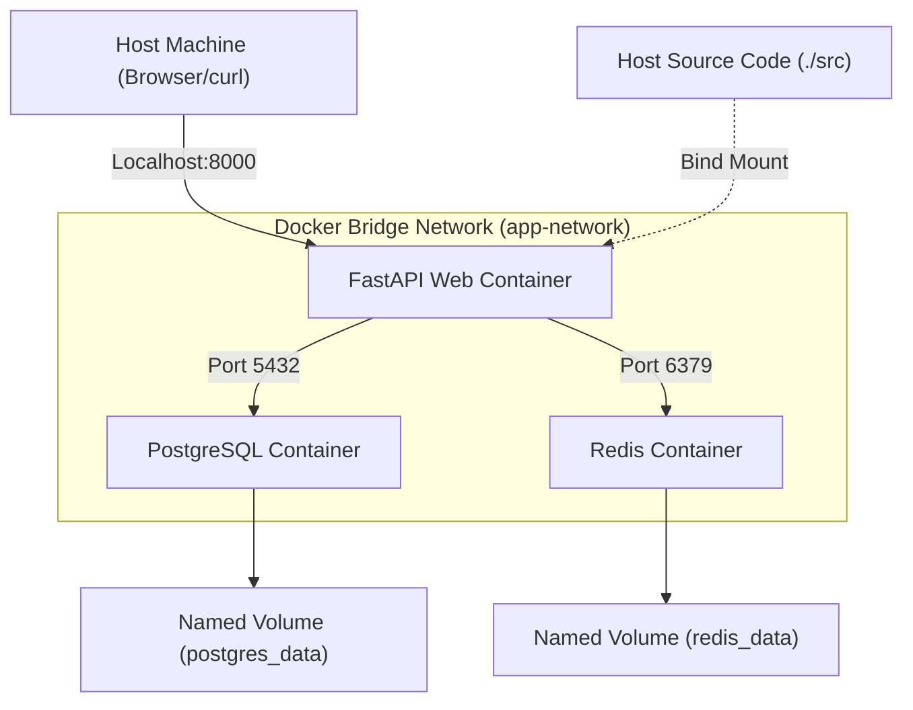
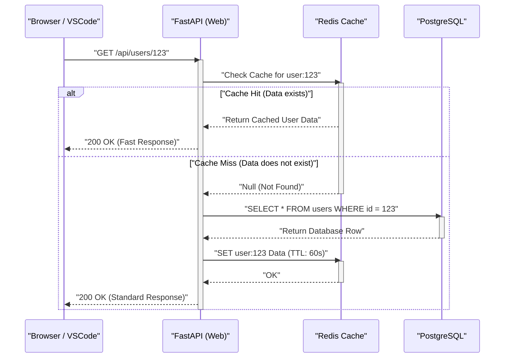

## 1. Introduction: Breaking Free from "It Works on My Machine"

In the field of software development, the "It works on my machine" problem, caused by differences in developers' environments, has long been a factor in wasting time on many projects. Local environments are constantly exposed to "state uncertainty," such as OS differences, installed language versions, library dependencies, and conflicts between globally installed tools.

What fundamentally solves these issues is container technology like **Docker** and the **Infrastructure as Code (IaC)** paradigm. By containerizing the local development environment, OS-level isolation is achieved, and the environment itself can be version-controlled alongside the codebase.

In this article, we will thoroughly explain the steps to build a **"reproducible local development environment that results in the exact same state, no matter who, when, or on what machine it is launched,"** by leveraging Docker, Docker Compose, and VSCode DevContainers. We will also explore the deep technical mechanisms behind it from a mathematical perspective.

---

## 2. The Synergy Between Infrastructure as Code (IaC) and Container Technology

### IaC Principles and Application to Local Environments

Infrastructure as Code (IaC) is an approach to managing infrastructure configuration and provisioning through machine-readable definition files rather than manual processes. The core principles of IaC include the following elements:

1. **Declarative Approach**: Defines "what the final state should be" rather than "how to change the state."
2. **Idempotency**: Guarantees the exact same result (state) no matter how many times the script is executed.
3. **Version Control**: The infrastructure state is stored as code in a VCS like Git, enabling change history tracking and peer reviews.

Practicing IaC in a local development environment means codifying the "ideal state" of the development environment using `Dockerfile`, `docker-compose.yml`, and `devcontainer.json`. This provides an onboarding experience where new team members can clone the repository and start developing immediately by running a single command.

### Kernel Features Supporting Container Technology

Unlike hypervisor-based virtualization like virtual machines (VMs), container technology is a lightweight virtualization technique that isolates processes while sharing the host OS kernel. To achieve this, it primarily relies on the following Linux kernel features:

- **Namespaces**: Provides independent views of system resources (PID, network, mount points, users, etc.) for each process.
- **Cgroups (Control Groups)**: Limits and allocates the physical resources (CPU, memory, disk I/O, etc.) that processes can use.
- **UnionFS (Union File System)**: A technology that transparently overlays multiple directory trees (layers) to present them as a single file system. Docker's image layers rely on this technology.

Let's consider a mathematical model of resource limitation. Let the total memory capacity of the host machine be $M_{\text{total}}$, and the memory limit of $n$ containers running on the host be $m_i$. Taking into account the base memory $M_{\text{os}}$ consumed by the host OS and other processes, the necessary condition for the system to operate stably can be expressed by the following inequality:

$$ \sum_{i=1}^{n} m_i \le M_{\text{total}} - M_{\text{os}} $$

By strictly defining $m_i$ for each container using Cgroups, even if a specific container causes a memory leak, the OOM (Out Of Memory) Killer can prevent other containers or the entire host system from going down.

---

## 3. Efficient Dockerfile Design: Mastering Multi-Stage Builds

The first step to a reproducible environment is designing the `Dockerfile` that defines the application's runtime environment. Here, using Python (FastAPI) as an example, we will explain the best practices for a secure and lightweight Dockerfile leveraging **multi-stage builds**.

A multi-stage build is a technique that uses multiple `FROM` instructions within a single `Dockerfile` to separate the build environment (a heavy environment containing compilers and development tools) from the runtime environment (a lightweight environment holding only the necessary artifacts).

### Practical Python FastAPI Dockerfile

The following code is an example of an advanced `Dockerfile` that combines dependency management using Poetry and multi-stage builds.

```dockerfile
# ---------------------------------------------------------
# Stage 1: Builder (Build Environment)
# ---------------------------------------------------------
FROM python:3.11-slim AS builder

# Set necessary environment variables
ENV PYTHONUNBUFFERED=1 \
    PYTHONDONTWRITEBYTECODE=1 \
    POETRY_VERSION=1.6.1 \
    POETRY_HOME="/opt/poetry" \
    POETRY_VIRTUALENVS_IN_PROJECT=true \
    POETRY_NO_INTERACTION=1

# Install dependencies
RUN apt-get update && apt-get install -y --no-install-recommends \
    curl build-essential && \
    curl -sSL https://install.python-poetry.org | python3 - && \
    apt-get clean && rm -rf /var/lib/apt/lists/*

ENV PATH="$POETRY_HOME/bin:$PATH"

WORKDIR /app

# Copy dependency files and install
COPY pyproject.toml poetry.lock ./
RUN poetry install --no-root --only main

# ---------------------------------------------------------
# Stage 2: Runtime (Execution Environment)
# ---------------------------------------------------------
FROM python:3.11-slim AS runtime

ENV PYTHONUNBUFFERED=1 \
    PYTHONDONTWRITEBYTECODE=1 \
    PATH="/app/.venv/bin:$PATH"

# Create a minimal non-root user
RUN groupadd -r appuser && useradd -r -g appuser appuser

WORKDIR /app

# Copy only the virtual environment (dependencies) from the builder
COPY --from=builder --chown=appuser:appuser /app/.venv /app/.venv

# Copy application code
COPY --chown=appuser:appuser ./src /app/src

# Switch to the non-root user
USER appuser

# Default command upon container startup
ENTRYPOINT ["uvicorn", "src.main:app", "--host", "0.0.0.0", "--port", "8000"]
```

### Mathematical Evaluation of Image Size via Multi-Stage Builds

Let the image size when built with a single stage be $S_{\text{single}}$, and the image size when a multi-stage build is applied be $S_{\text{multi}}$. The size reduction rate $R$ is calculated as follows:

$$ R = \left( 1 - \frac{S_{\text{multi}}}{S_{\text{single}}} \right) \times 100 \ (\%) $$

For example, suppose $S_{\text{single}}$ includes the OS base image (approx. 110MB), development packages (like gcc, approx. 150MB), Poetry itself (approx. 40MB), project dependency libraries (approx. 80MB), and source code (approx. 5MB), totaling 385MB.
On the other hand, in $S_{\text{multi}}$, only the dependency libraries (80MB) and source code (5MB) are copied into the base image (110MB), resulting in a total of 195MB.

$$ R = \left( 1 - \frac{195}{385} \right) \times 100 \approx 49.35\% $$

In this way, introducing multi-stage builds can reduce the image size by about half. Reducing the image size directly leads to improved security by shortening pull times from the registry, saving disk space, and shrinking the attack surface.

---

## 4. Orchestrating Multiple Containers with Docker Compose

In modern web application development, a microservices architecture where multiple components like web servers, databases, and cache servers collaborate is common. We use `docker-compose.yml` to centrally manage these in a local environment.

Here, we will build a 3-tier system locally consisting of "Web (FastAPI)," "Database (PostgreSQL)," and "Cache (Redis)."

### Architecture Diagram (Mermaid)

The following diagram is a block diagram illustrating the relationships among each container, network, and volume on the local machine.



### Implementation and Detailed Explanation of docker-compose.yml

Below is an example of a robust `docker-compose.yml` that can withstand practical environment construction.

```yaml
version: '3.8'

services:
  web:
    build:
      context: .
      target: runtime
    container_name: dev_web
    ports:
      - "8000:8000"
    volumes:
      - ./src:/app/src:ro  # Mount the host code as read-only (for hot reloading)
    environment:
      - DATABASE_URL=postgresql://postgres:${POSTGRES_PASSWORD}@db:5432/${POSTGRES_DB}
      - REDIS_URL=redis://redis:6379/0
    env_file:
      - .env
    depends_on:
      db:
        condition: service_healthy
      redis:
        condition: service_started
    networks:
      - app-network
    command: ["uvicorn", "src.main:app", "--host", "0.0.0.0", "--port", "8000", "--reload"]

  db:
    image: postgres:15-alpine
    container_name: dev_db
    ports:
      - "5432:5432"
    environment:
      POSTGRES_USER: postgres
      POSTGRES_PASSWORD: ${POSTGRES_PASSWORD}
      POSTGRES_DB: ${POSTGRES_DB}
    volumes:
      - postgres_data:/var/lib/postgresql/data
    networks:
      - app-network
    healthcheck:
      test: ["CMD-SHELL", "pg_isready -U postgres -d ${POSTGRES_DB}"]
      interval: 5s
      timeout: 5s
      retries: 5

  redis:
    image: redis:7-alpine
    container_name: dev_redis
    ports:
      - "6379:6379"
    volumes:
      - redis_data:/data
    networks:
      - app-network
    command: ["redis-server", "--appendonly", "yes"]

volumes:
  postgres_data:
  redis_data:

networks:
  app-network:
    driver: bridge
```

### Volumes and Data Persistence

Containers are generally "stateless" and "ephemeral" entities. When a container is destroyed, the data inside it is also lost. To retain database data and caches, it is necessary to mount an area of the host machine's file system into the container.

- **Bind Mount**: This corresponds to `./src:/app/src:ro` in the `web` service above. It directly maps a specific directory on the host into the container. This is used to immediately reflect local code edits in the container (hot reloading). For security reasons, it is a best practice to add the `:ro` (Read-Only) option to prevent the container from altering the host's source code.
- **Named Volume**: This corresponds to `postgres_data` and `redis_data`. This is an area internally managed by Docker (like `/var/lib/docker/volumes/`), which offers better I/O performance than bind mounts and abstracts the differences in file systems across OSes. Be sure to use this for database persistence.

### Networking and Service Discovery

Docker Compose creates a unique bridge network for each project by default. This is the `app-network` mentioned above.
Containers belonging to the same network can resolve names (DNS resolution) using the "service name" (e.g., `db`, `redis`) as the hostname instead of an IP address.
For example, the Web container can access the database using the URL `postgresql://postgres:password@db:5432/mydb`. This allows connections to be switched transparently via environment variables, regardless of whether it's a local or production environment.

### Health Checks and Controlling Startup Order

The `depends_on` directive controls the startup order of containers, but simply specifying `depends_on` will start the Web container as soon as the "DB container has started." In reality, the DB initialization process (starting the PostgreSQL process and preparing tables) takes several seconds, so connections from the Web container might fail.
To prevent this, you can define a `healthcheck` and specify `condition: service_healthy`, which ensures the Web container starts only after confirming that "the DB is ready to accept connection requests."

---

## 5. Environment Variable Management and Security (.env)

Hardcoding sensitive information, such as database passwords and API keys, into `docker-compose.yml` is an anti-pattern that must be strictly avoided. Instead, inject these values using an environment variable file `.env`.

Create a `.env` file in the project root.

```ini
# .env file (add it to .gitignore to keep it out of Git tracking)
POSTGRES_PASSWORD=supersecretpassword
POSTGRES_DB=devdb
API_SECRET_KEY=dev_secret_key_12345
```

By default, Docker Compose reads the `.env` file in the execution directory and expands placeholders like `${VAR_NAME}` in the YAML file. This method makes it possible to safely manage different configuration values for various environments like local, staging, and production without altering the infrastructure code.

---

## 6. The Ultimate Development Experience with VSCode DevContainers

So far, we have built a robust backend environment using Docker. However, we can take it a step further. By using the **VSCode DevContainers (Remote - Containers)** feature, you can run the backend of the editor (VSCode) itself inside the container.

This eliminates the need to install Python or Node.js on your local machine, allowing everything from linters (flake8/eslint) and formatters (black/prettier) to IDE extensions to be defined within the codebase and shared with the entire team.

### Configuring devcontainer.json

Create a `.devcontainer` directory in the project root and place the configuration file inside it.

`.devcontainer/devcontainer.json`:
```json
{
  "name": "Python FastAPI Dev Environment",
  "dockerComposeFile": ["../docker-compose.yml"],
  "service": "web",
  "workspaceFolder": "/app",
  "customizations": {
    "vscode": {
      "settings": {
        "python.defaultInterpreterPath": "/app/.venv/bin/python",
        "python.formatting.provider": "black",
        "editor.formatOnSave": true
      },
      "extensions": [
        "ms-python.python",
        "ms-python.vscode-pylance",
        "ms-python.black-formatter",
        "tamasfe.even-better-toml"
      ]
    }
  },
  "forwardPorts": [8000, 5432, 6379],
  "remoteUser": "appuser",
  "postCreateCommand": "poetry install"
}
```

By including this file in the repository, a "Reopen in Container" prompt will appear the moment you open the project in VSCode. A single click will spin up all the necessary containers, install the extensions, and make it instantly ready for coding. It's truly a magical experience.

---

## 7. Request Processing Sequence and Performance Modeling

We will review the request processing lifecycle of the web application in our newly built local development environment using a sequence diagram and examine the mathematical model of its performance.

### Sequence Diagram (Request Flow)



### Mathematical Model of Processing Latency

We mathematically model the average request processing time $T_{\text{total}}$ in the above system.
We define the latency of each process as follows:
- $T_{\text{net}}$: Network latency between the client and the Web container
- $T_{\text{app}}$: Pure processing time on the application side (serialization, etc.)
- $T_{\text{cache}}$: Time required to read/write from/to Redis
- $T_{\text{db}}$: Time required to execute queries on PostgreSQL
- $p_{\text{miss}}$: Cache miss rate ($0 \le p_{\text{miss}} \le 1$)

At this time, the average response time is represented by the following expected value formula:

$$ T_{\text{total}} = T_{\text{net}} + T_{\text{app}} + T_{\text{cache}} + p_{\text{miss}} \times (T_{\text{db}} + T_{\text{cache\_write}}) $$

In a local development environment (inside Docker), $T_{\text{net}}$ is close to 0, but what's noteworthy is the **I/O performance during bind mounts**. Especially when using Docker Desktop on Windows/macOS, the file sharing overhead between the host OS and the VM (container) tends to bloat $T_{\text{app}}$ (such as code load time). To eliminate this bottleneck, it is highly recommended to use the aforementioned DevContainers to place the entire source code inside a named volume, or to adopt an architecture that runs the Docker engine natively on a WSL2 (Windows Subsystem for Linux 2) environment.

---

## 8. Performance Optimization of Docker Builds: Layer Caching Strategy

When writing a Dockerfile, your understanding of the "layer cache" mechanism will drastically change build times.
Docker creates file system differences (layers) for each instruction in a Dockerfile (like `FROM`, `RUN`, `COPY`) and holds them as caches. On rebuild, cached layers that haven't changed are reused.

The critical principle is to **"write instructions in order from the least frequently changed to the most frequently changed."**

Let's model the impact of source code changes on build time. Let the total build time be $T_{\text{build}}$, the execution time of each step be $T_{\text{layer}_i}$, and the presence or absence of a cache hit be a boolean value $c_i \in \{0, 1\}$ (1 for a cache hit).

$$ T_{\text{build}} = T_{\text{init}} + \sum_{i=1}^{n} (1 - c_i) \times T_{\text{layer}_i} $$

Once a cache miss ($c_k = 0$) occurs at layer $k$, caches for all subsequent layers $j > k$ are invalidated ($c_j = 0$).

```dockerfile
# Bad example (Source code is copied first)
COPY ./src /app/src
COPY pyproject.toml poetry.lock ./
RUN poetry install
```
In the above case, changing even one line of code causes the first `COPY` to miss the cache, resulting in the time-consuming `RUN poetry install` being executed every time.

```dockerfile
# Good example (Resolve dependencies first)
COPY pyproject.toml poetry.lock ./
RUN poetry install
COPY ./src /app/src
```
If written this way, even if the source code changes, the layer cache for `poetry install` ($c_i = 1$) remains effective, drastically reducing build time from several minutes to just a few seconds.

---

## 9. Troubleshooting and Tips

Here are common problems encountered during local environment operations and their solutions.

1. **Port Conflict Error**
   If you get an error like `Bind for 0.0.0.0:8000 failed: port is already allocated`, another process on your local machine is using that port. You can avoid this by changing the port number on the host side, like `ports: - "8080:8000"`.

2. **Disk Space Exhaustion**
   If you use Docker for a long period, unused images and volumes (Dangling Images / Volumes) can accumulate and consume tens of gigabytes of disk space. It is recommended to periodically clean up the system with the following command:
   ```bash
   docker system prune -a --volumes
   ```

3. **File Permission Issues**
   When using bind mounts in a Linux environment, files created inside the container may be owned by `root`, preventing you from editing them on the host side. You can resolve this issue by creating a non-root user in your Dockerfile and matching their UID/GID to your own on the host OS (e.g., 1000:1000).

---

## 10. Conclusion: Accelerated Development Speeds Brought by Reproducibility

By combining Docker, Docker Compose, and VSCode DevContainers, a robust local development environment is achieved, resulting in "the exact same state no matter who launches the environment."

Bringing the IaC paradigm into your local environment goes beyond merely reducing initial setup times. It eliminates anxiety regarding infrastructure configuration changes, facilitates experimenting with new tech stacks, enables smooth transitions to CI/CD pipelines, and dramatically improves the speed and quality of the entire development cycle.

By leveraging the best practices explained in this article—optimizing image sizes with multi-stage builds, controlling dependencies with health checks, and writing Dockerfiles with layer caching in mind—we highly encourage you to introduce the best Developer Experience (DX) to your own projects.
