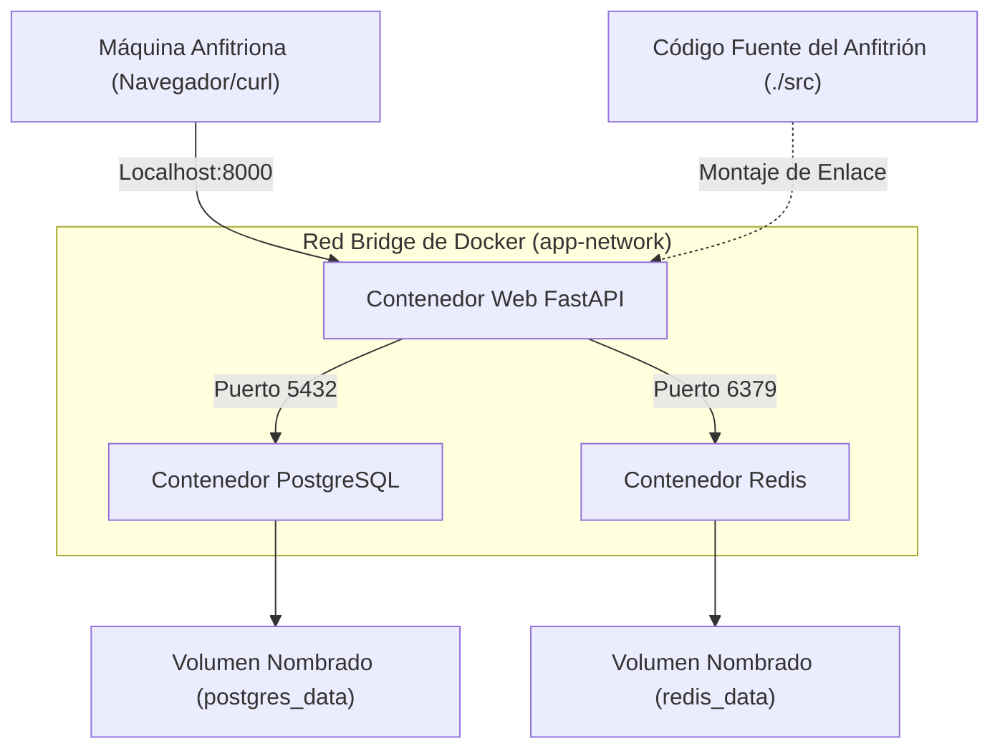
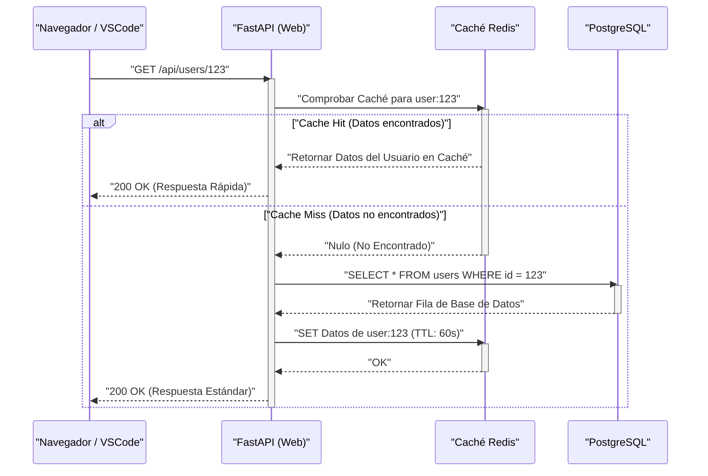

## 1. Introducción: Escapando de "en mi máquina funciona"

En el ámbito del desarrollo de software, el problema de "en mi máquina funciona" (It works on my machine), causado por las diferencias en los entornos entre desarrolladores, ha sido durante mucho tiempo un factor de pérdida de tiempo en muchos proyectos. Las diferencias en el sistema operativo, las versiones de los lenguajes instalados, las dependencias de bibliotecas y los conflictos entre herramientas instaladas globalmente exponen constantemente a los entornos locales a la "incertidumbre de estado".

Lo que resuelve estos problemas de raíz son las tecnologías de contenedores, como **Docker**, y el paradigma de **Infrastructure as Code (IaC)**. Al contenerizar el entorno de desarrollo local, se logra el aislamiento a nivel del sistema operativo, haciendo posible controlar las versiones del propio entorno junto con el código base.

En este artículo, explicaremos exhaustivamente los pasos para construir un **"entorno de desarrollo local reproducible, que tendrá exactamente el mismo estado sin importar quién, cuándo o en qué máquina lo inicie"**, aprovechando Docker, Docker Compose y VSCode DevContainers, así como los profundos mecanismos técnicos detrás de ello, incorporando también una perspectiva matemática.

---

## 2. La afinidad entre Infrastructure as Code (IaC) y la tecnología de contenedores

### Principios de IaC y su aplicación a entornos locales

Infrastructure as Code (IaC) es un enfoque que gestiona la configuración y el aprovisionamiento de la infraestructura a través de archivos de definición legibles por máquina, en lugar de procesos manuales. Los principios fundamentales de IaC incluyen los siguientes elementos:

1. **Enfoque declarativo (Declarative Approach)**: Define "cuál debería ser el estado final" en lugar de "cómo cambiar el estado".
2. **Idempotencia (Idempotency)**: No importa cuántas veces se ejecute el script, siempre se garantiza el mismo resultado (estado).
3. **Control de versiones (Version Control)**: El estado de la infraestructura se guarda como código en un VCS (como Git), lo que permite rastrear el historial de cambios y realizar revisiones por pares.

Practicar IaC en un entorno de desarrollo local significa codificar el "estado ideal" del entorno de desarrollo utilizando `Dockerfile`, `docker-compose.yml` y `devcontainer.json`. Esto permite que los nuevos miembros del equipo logren una experiencia de incorporación donde pueden comenzar a desarrollar inmediatamente con solo clonar el repositorio y ejecutar un comando.

### Funciones del kernel que sustentan la tecnología de contenedores

La tecnología de contenedores, a diferencia de la virtualización basada en hipervisor como las máquinas virtuales (VM), es una tecnología de virtualización ligera que aísla procesos compartiendo el kernel del sistema operativo anfitrión. Para lograr esto, se utilizan principalmente las siguientes funciones del kernel de Linux:

- **Namespaces**: Proporcionan una vista independiente de los recursos del sistema (PID, red, puntos de montaje, usuarios, etc.) para cada proceso.
- **Cgroups (Control Groups)**: Limitan y asignan los recursos físicos (CPU, memoria, E/S de disco, etc.) que pueden usar los procesos.
- **UnionFS (Union File System)**: Una tecnología que superpone de forma transparente múltiples árboles de directorios (capas) para presentarlos como un único sistema de archivos. Las capas de imagen de Docker dependen de esta tecnología.

Consideremos un modelo matemático para la limitación de recursos. Supongamos que la capacidad total de memoria de la máquina anfitriona es $M_{\text{total}}$ y el límite de memoria para los $n$ contenedores que se ejecutan en el host es $m_i$. La condición necesaria para que el sistema funcione de manera estable, considerando la memoria base $M_{\text{os}}$ consumida por el sistema operativo anfitrión y otros procesos, se puede expresar mediante la siguiente desigualdad:

$$ \sum_{i=1}^{n} m_i \le M_{\text{total}} - M_{\text{os}} $$

Al definir estrictamente $m_i$ para cada contenedor utilizando Cgroups, se puede evitar que otros contenedores o todo el sistema anfitrión se caigan debido al OOM (Out Of Memory) Killer en caso de que un contenedor en particular sufra una fuga de memoria.

---

## 3. Diseño eficiente del Dockerfile: Dominando las construcciones en múltiples etapas

El primer paso hacia un entorno reproducible es diseñar un `Dockerfile` que defina el entorno de ejecución de la aplicación. Aquí, usando Python (FastAPI) como ejemplo, explicaremos las mejores prácticas para un Dockerfile seguro y ligero aprovechando las **construcciones en múltiples etapas (multi-stage builds)**.

La construcción en múltiples etapas es una técnica que utiliza múltiples instrucciones `FROM` en un solo `Dockerfile` para separar el entorno de construcción (un entorno pesado que contiene compiladores y herramientas de desarrollo) del entorno de ejecución (un entorno ligero con solo los artefactos necesarios).

### Dockerfile práctico para Python FastAPI

El siguiente código es un ejemplo de un `Dockerfile` avanzado que combina la gestión de dependencias con Poetry y la construcción en múltiples etapas.

```dockerfile
# ---------------------------------------------------------
# Stage 1: Builder (Entorno de construcción)
# ---------------------------------------------------------
FROM python:3.11-slim AS builder

# Configuración de variables de entorno necesarias
ENV PYTHONUNBUFFERED=1 \
    PYTHONDONTWRITEBYTECODE=1 \
    POETRY_VERSION=1.6.1 \
    POETRY_HOME="/opt/poetry" \
    POETRY_VIRTUALENVS_IN_PROJECT=true \
    POETRY_NO_INTERACTION=1

# Instalación de paquetes de dependencias
RUN apt-get update && apt-get install -y --no-install-recommends \
    curl build-essential && \
    curl -sSL https://install.python-poetry.org | python3 - && \
    apt-get clean && rm -rf /var/lib/apt/lists/*

ENV PATH="$POETRY_HOME/bin:$PATH"

WORKDIR /app

# Copia e instalación de archivos de dependencias
COPY pyproject.toml poetry.lock ./
RUN poetry install --no-root --only main

# ---------------------------------------------------------
# Stage 2: Runtime (Entorno de ejecución)
# ---------------------------------------------------------
FROM python:3.11-slim AS runtime

ENV PYTHONUNBUFFERED=1 \
    PYTHONDONTWRITEBYTECODE=1 \
    PATH="/app/.venv/bin:$PATH"

# Creación de un usuario sin privilegios mínimos
RUN groupadd -r appuser && useradd -r -g appuser appuser

WORKDIR /app

# Copiar solo el entorno virtual (dependencias) desde el builder
COPY --from=builder --chown=appuser:appuser /app/.venv /app/.venv

# Copia del código de la aplicación
COPY --chown=appuser:appuser ./src /app/src

# Cambio al usuario sin privilegios
USER appuser

# Comando por defecto al iniciar el contenedor
ENTRYPOINT ["uvicorn", "src.main:app", "--host", "0.0.0.0", "--port", "8000"]
```

### Evaluación matemática del tamaño de la imagen mediante la construcción en múltiples etapas

Supongamos que el tamaño de la imagen construida en una sola etapa es $S_{\text{single}}$ y el tamaño de la imagen al aplicar la construcción en múltiples etapas es $S_{\text{multi}}$. La tasa de reducción de tamaño $R$ se calcula de la siguiente manera:

$$ R = \left( 1 - \frac{S_{\text{multi}}}{S_{\text{single}}} \right) \times 100 \ (\%) $$

Por ejemplo, supongamos que $S_{\text{single}}$ incluye la imagen base del SO (aprox. 110MB), paquetes de desarrollo (como gcc, aprox. 150MB), el propio Poetry (aprox. 40MB), las bibliotecas de dependencias del proyecto (aprox. 80MB) y el código fuente (aprox. 5MB), totalizando 385MB.
Por otro lado, en $S_{\text{multi}}$, solo se copian a la imagen base (110MB) las bibliotecas de dependencias (80MB) y el código fuente (5MB), sumando un total de 195MB.

$$ R = \left( 1 - \frac{195}{385} \right) \times 100 \approx 49.35\% $$

De esta manera, al introducir construcciones en múltiples etapas, el tamaño de la imagen se puede reducir a la mitad aproximadamente. La reducción en el tamaño de la imagen se traduce directamente en tiempos más cortos de extracción (Pull) desde el registro, ahorro de espacio en disco y una mejora en la seguridad mediante la reducción de la superficie de ataque (Attack Surface).

---

## 4. Orquestación de múltiples contenedores con Docker Compose

En el desarrollo de aplicaciones web modernas, es común utilizar una arquitectura de microservicios donde múltiples componentes colaboran, como servidores web, bases de datos y servidores de caché. Usamos `docker-compose.yml` para gestionar esto de forma centralizada en un entorno local.

Esta vez, construiremos localmente un sistema de tres capas compuesto por "Web (FastAPI)", "Base de datos (PostgreSQL)" y "Caché (Redis)".

### Diagrama de arquitectura (Mermaid)

El siguiente diagrama de bloques ilustra la relación entre cada contenedor, red y volumen en la máquina local.



### Implementación y explicación detallada de docker-compose.yml

A continuación se muestra un ejemplo de un `docker-compose.yml` robusto, capaz de soportar la construcción de un entorno práctico.

```yaml
version: '3.8'

services:
  web:
    build:
      context: .
      target: runtime
    container_name: dev_web
    ports:
      - "8000:8000"
    volumes:
      - ./src:/app/src:ro  # Montaje de solo lectura del código del host (para recarga en caliente)
    environment:
      - DATABASE_URL=postgresql://postgres:${POSTGRES_PASSWORD}@db:5432/${POSTGRES_DB}
      - REDIS_URL=redis://redis:6379/0
    env_file:
      - .env
    depends_on:
      db:
        condition: service_healthy
      redis:
        condition: service_started
    networks:
      - app-network
    command: ["uvicorn", "src.main:app", "--host", "0.0.0.0", "--port", "8000", "--reload"]

  db:
    image: postgres:15-alpine
    container_name: dev_db
    ports:
      - "5432:5432"
    environment:
      POSTGRES_USER: postgres
      POSTGRES_PASSWORD: ${POSTGRES_PASSWORD}
      POSTGRES_DB: ${POSTGRES_DB}
    volumes:
      - postgres_data:/var/lib/postgresql/data
    networks:
      - app-network
    healthcheck:
      test: ["CMD-SHELL", "pg_isready -U postgres -d ${POSTGRES_DB}"]
      interval: 5s
      timeout: 5s
      retries: 5

  redis:
    image: redis:7-alpine
    container_name: dev_redis
    ports:
      - "6379:6379"
    volumes:
      - redis_data:/data
    networks:
      - app-network
    command: ["redis-server", "--appendonly", "yes"]

volumes:
  postgres_data:
  redis_data:

networks:
  app-network:
    driver: bridge
```

### Volúmenes (Volumes) y persistencia de datos

Los contenedores, por principio, son entidades "sin estado (stateless)" y "efímeras (ephemeral)". Si se destruye un contenedor, sus datos internos también desaparecen. Para retener los datos de bases de datos y cachés, es necesario montar un área del sistema de archivos de la máquina anfitriona dentro del contenedor.

- **Montaje de enlace (Bind Mount)**: En el servicio `web` mencionado anteriormente, `./src:/app/src:ro` corresponde a esto. Asigna un directorio específico del host directamente dentro del contenedor. Se utiliza para reflejar instantáneamente los cambios en el código local dentro del contenedor (recarga en caliente - hot reload). Desde una perspectiva de seguridad, la mejor práctica es agregar la opción `:ro` (Read-Only) para evitar que se pueda modificar el código fuente del host desde el lado del contenedor.
- **Volumen nombrado (Named Volume)**: Corresponde a `postgres_data` y `redis_data`. Es un área gestionada internamente por Docker (como `/var/lib/docker/volumes/`), la cual ofrece un rendimiento de E/S superior a los montajes de enlace y absorbe las diferencias de sistemas de archivos entre sistemas operativos. Siempre debe utilizarse este método para la persistencia de bases de datos.

### Redes (Networking) y descubrimiento de servicios

Docker Compose crea de forma predeterminada una red bridge única por proyecto. Esto es la `app-network` mencionada anteriormente.
Los contenedores que pertenecen a la misma red pueden resolverse por nombre (resolución DNS) utilizando su "nombre de servicio" (por ejemplo: `db`, `redis`) como nombre de host, en lugar de direcciones IP.
Por ejemplo, desde el contenedor web se puede acceder a la base de datos con la URL `postgresql://postgres:password@db:5432/mydb`. Esto permite cambiar los destinos de conexión de manera transparente a través de variables de entorno, ya sea en el entorno local o en producción.

### Health checks (Comprobación de estado) y control del orden de inicio

La directiva `depends_on` controla el orden de inicio de los contenedores, pero si solo se especifica `depends_on`, el contenedor web se iniciará tan pronto como el contenedor de la base de datos "haya arrancado". En realidad, como el proceso de inicialización de la base de datos (iniciar el proceso de PostgreSQL, preparar tablas) toma unos segundos, la conexión a la base de datos desde el contenedor web puede generar un error.
Para evitar esto, se puede definir un `healthcheck` y especificar `condition: service_healthy`, lo cual permite confirmar que "la base de datos está lista para aceptar peticiones de conexión" antes de iniciar el contenedor web.

---

## 5. Gestión de variables de entorno y seguridad (.env)

Codificar (hardcodear) información confidencial como contraseñas de bases de datos o claves API en `docker-compose.yml` es un antipatrón que debe evitarse estrictamente. En su lugar, utilice un archivo de variables de entorno `.env` para inyectar estos valores.

Cree un archivo `.env` en la raíz del proyecto.

```ini
# Archivo .env (Asegúrese de agregarlo a .gitignore para mantenerlo fuera del control de versiones de Git)
POSTGRES_PASSWORD=supersecretpassword
POSTGRES_DB=devdb
API_SECRET_KEY=dev_secret_key_12345
```

De forma predeterminada, Docker Compose lee el archivo `.env` en el directorio de ejecución y expande los marcadores de posición `${VAR_NAME}` en los archivos YAML. Este enfoque permite gestionar de forma segura diferentes configuraciones para cada entorno (local, staging, producción) sin modificar el código de infraestructura.

---

## 6. La experiencia de desarrollo definitiva con VSCode DevContainers

Hasta este punto, se ha construido un entorno backend robusto usando Docker. Sin embargo, podemos ir un paso más allá. Al utilizar la función **VSCode DevContainers (Remote - Containers)**, es posible ejecutar el backend del propio editor (VSCode) dentro de un contenedor.

Como resultado, ni siquiera es necesario instalar Python o Node.js en su máquina local, y todo —desde linters (flake8/eslint) y formateadores (black/prettier) hasta extensiones del IDE— se puede definir dentro del código base y compartir con todo el equipo.

### Configuración de devcontainer.json

Cree un directorio `.devcontainer` en la raíz del proyecto y coloque el archivo de configuración dentro de él.

`.devcontainer/devcontainer.json`:
```json
{
  "name": "Python FastAPI Dev Environment",
  "dockerComposeFile": ["../docker-compose.yml"],
  "service": "web",
  "workspaceFolder": "/app",
  "customizations": {
    "vscode": {
      "settings": {
        "python.defaultInterpreterPath": "/app/.venv/bin/python",
        "python.formatting.provider": "black",
        "editor.formatOnSave": true
      },
      "extensions": [
        "ms-python.python",
        "ms-python.vscode-pylance",
        "ms-python.black-formatter",
        "tamasfe.even-better-toml"
      ]
    }
  },
  "forwardPorts": [8000, 5432, 6379],
  "remoteUser": "appuser",
  "postCreateCommand": "poetry install"
}
```

Al incluir este archivo en el repositorio, en el momento en que abra el proyecto en VSCode, aparecerá el aviso "Reopen in Container". Con un solo clic, se iniciarán todos los contenedores necesarios, se instalarán las extensiones y estará listo para comenzar a programar de inmediato. Es verdaderamente una experiencia mágica.

---

## 7. Secuencia del procesamiento de peticiones y modelado de rendimiento

Revisaremos el ciclo de vida del procesamiento de peticiones (requests) de la aplicación web en el entorno de desarrollo local construido usando un diagrama de secuencia, y examinaremos un modelo matemático de su rendimiento.

### Diagrama de secuencia (Flujo de peticiones)



### Modelo matemático de la latencia (retraso en procesamiento)

Modelaremos matemáticamente el tiempo promedio de procesamiento de peticiones $T_{\text{total}}$ en el sistema anterior.
Definimos la latencia de cada proceso de la siguiente manera:
- $T_{\text{net}}$: Latencia de red entre el cliente y el contenedor web
- $T_{\text{app}}$: Tiempo de procesamiento puro del lado de la aplicación (serialización, etc.)
- $T_{\text{cache}}$: Tiempo requerido para leer y escribir en Redis
- $T_{\text{db}}$: Tiempo requerido para ejecutar consultas en PostgreSQL
- $p_{\text{miss}}$: Tasa de fallos en caché (cache miss rate) ($0 \le p_{\text{miss}} \le 1$)

Entonces, el tiempo promedio de respuesta se expresa mediante la siguiente fórmula de valor esperado:

$$ T_{\text{total}} = T_{\text{net}} + T_{\text{app}} + T_{\text{cache}} + p_{\text{miss}} \times (T_{\text{db}} + T_{\text{cache\_write}}) $$

En un entorno de desarrollo local (dentro de Docker), $T_{\text{net}}$ está cerca de 0. Sin embargo, lo que se debe notar es el **rendimiento de E/S al usar montajes de enlace (bind mounts)**. Especialmente al usar Docker Desktop en Windows/macOS, $T_{\text{app}}$ (tiempo de lectura de código, etc.) tiende a inflarse debido a la sobrecarga de compartir archivos entre el sistema operativo anfitrión y la máquina virtual (contenedor). Para resolver este cuello de botella, se recomienda encarecidamente una arquitectura que coloque todo el código fuente en un volumen nombrado utilizando DevContainers, o ejecutar el motor de Docker nativamente en un entorno WSL2 (Windows Subsystem for Linux 2).

---

## 8. Optimización del rendimiento de la construcción en Docker: Estrategia de caché por capas

Al escribir un Dockerfile, si se comprende o no el mecanismo de "caché de capas (layer caching)", el tiempo de construcción cambia drásticamente.
Docker crea una diferencia en el sistema de archivos (capa) para cada instrucción del Dockerfile (como `FROM`, `RUN`, `COPY`) y la guarda como caché. Al volver a construir, se reutiliza la caché de las capas que no han cambiado.

El principio importante es **"escribir en orden, comenzando por las cosas que cambian con menor frecuencia"**.

Consideremos el modelado del impacto que los cambios en el código fuente tienen en el tiempo de construcción. Supongamos que el tiempo total de construcción es $T_{\text{build}}$, el tiempo de ejecución de cada paso es $T_{\text{layer}_i}$ y la existencia de un acierto de caché es un valor booleano $c_i \in \{0, 1\}$ (1 para aciertos de caché).

$$ T_{\text{build}} = T_{\text{init}} + \sum_{i=1}^{n} (1 - c_i) \times T_{\text{layer}_i} $$

Una vez que ocurre un fallo de caché en la capa $k$ ($c_k = 0$), la caché se invalida ($c_j = 0$) para todas las capas subsecuentes $j > k$.

```dockerfile
# Mal ejemplo (Copiando el código fuente primero)
COPY ./src /app/src
COPY pyproject.toml poetry.lock ./
RUN poetry install
```
En el caso anterior, con solo modificar una línea de código, se producirá un fallo de caché en el primer `COPY`, y el comando `RUN poetry install`, que consume mucho tiempo, se ejecutará cada vez.

```dockerfile
# Buen ejemplo (Resolviendo las dependencias primero)
COPY pyproject.toml poetry.lock ./
RUN poetry install
COPY ./src /app/src
```
Si lo escribe de esta manera, incluso si cambia el código fuente, la caché de la capa de `poetry install` ($c_i = 1$) se mantendrá, lo que reduce drásticamente el tiempo de construcción de minutos a segundos.

---

## 9. Solución de problemas y consejos

Aquí listamos problemas comunes y soluciones encontrados al operar entornos locales.

1. **Error de conflicto de puertos**
   Si ocurre un error como `Bind for 0.0.0.0:8000 failed: port is already allocated`, otro proceso en su máquina local ya está usando ese puerto. Puede evitarlo cambiando el número de puerto en el lado del host, como `ports: - "8080:8000"`.

2. **Agotamiento del espacio en disco**
   Si usa Docker por un largo período, las imágenes y volúmenes no utilizados (Dangling Images / Volumes) pueden acumularse y consumir decenas de GB de espacio en disco. Se recomienda limpiar el sistema regularmente con el siguiente comando.
   ```bash
   docker system prune -a --volumes
   ```

3. **Problemas de permisos de archivos**
   Al usar montajes de enlace (bind mounts) en un entorno Linux, los archivos creados dentro del contenedor pueden ser propiedad de `root`, impidiendo que se editen en el lado del anfitrión. Puede resolver este problema creando un usuario sin privilegios en el Dockerfile y haciendo coincidir su UID/GID con el suyo en el sistema operativo anfitrión (por ejemplo: 1000:1000).

---

## 10. Conclusión: La mejora en la velocidad de desarrollo que trae la reproducibilidad

Al combinar Docker, Docker Compose y VSCode DevContainers, se logra un entorno de desarrollo local robusto donde "el estado será exactamente el mismo sin importar quién inicie el entorno".

Llevar el paradigma de IaC a entornos locales no solo reduce el tiempo de configuración inicial. También elimina la ansiedad en torno a los cambios de configuración de infraestructura, facilita la experimentación con nuevas pilas tecnológicas y permite una transición fluida a las canalizaciones CI/CD, mejorando drásticamente la velocidad y la calidad de todo el ciclo de desarrollo.

Aprovechando las mejores prácticas explicadas en este artículo —como la optimización del tamaño de imagen con construcciones en múltiples etapas, el control de dependencias usando health checks y la redacción de un Dockerfile consciente de la caché de capas— lo animamos encarecidamente a introducir la mejor experiencia de desarrollo (DX: Developer Experience) en sus propios proyectos.
