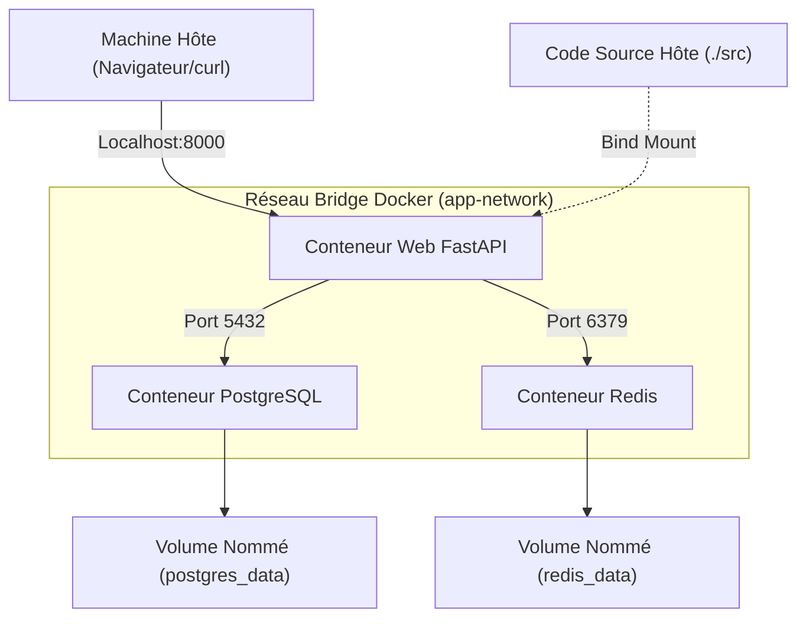
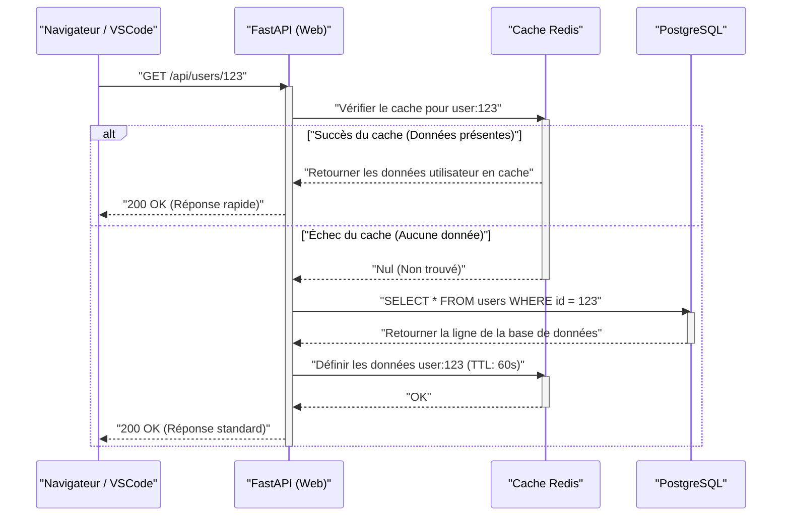

## 1. Introduction : Sortir du « Ça marche sur ma machine »

Dans le développement logiciel, le problème du « Ça marche sur ma machine » (It works on my machine), dû aux différences d'environnements entre les développeurs, est depuis longtemps un facteur de perte de temps dans de nombreux projets. En raison des différences de systèmes d'exploitation, de versions de langages installées, des dépendances de bibliothèques, ou des conflits d'outils installés globalement, l'environnement local est toujours exposé à une « incertitude d'état ».

Ce qui résout fondamentalement ces défis, c'est la technologie des conteneurs, notamment **Docker**, et le paradigme d'**Infrastructure as Code (IaC)**. Conteneuriser l'environnement de développement local permet une isolation au niveau du système d'exploitation et de versionner l'environnement lui-même avec la base de code.

Cet article explique en détail, avec des perspectives mathématiques, la méthode pour construire **« un environnement de développement local reproductible qui reste exactement le même peu importe qui, quand, et sur quelle machine il est lancé »**, en tirant parti de Docker, Docker Compose, et VSCode DevContainers.

---

## 2. Affinité entre l'Infrastructure as Code (IaC) et la technologie des conteneurs

### Principes de l'IaC et son application à l'environnement local

L'Infrastructure as Code (IaC) est une approche qui gère la configuration et le provisionnement de l'infrastructure via des fichiers de définition lisibles par machine, plutôt que par un processus manuel. Les principes fondamentaux de l'IaC incluent :

1. **Approche déclarative (Declarative Approach)** : On définit « quel devrait être l'état final » plutôt que « comment changer l'état ».
2. **Idempotence (Idempotency)** : Quel que soit le nombre d'exécutions du script, le même résultat (état) est toujours garanti.
3. **Contrôle de version (Version Control)** : L'état de l'infrastructure est stocké sous forme de code dans des systèmes comme Git, ce qui permet le suivi de l'historique et la revue par les pairs.

Pratiquer l'IaC dans un environnement de développement local signifie coder « l'état idéal » de l'environnement de développement à l'aide de `Dockerfile`, `docker-compose.yml`, et `devcontainer.json`. Cela permet aux nouveaux membres de l'équipe de commencer immédiatement le développement en clonant simplement le dépôt et en exécutant une seule commande, offrant ainsi une excellente expérience d'intégration (onboarding).

### Fonctionnalités du noyau derrière la technologie des conteneurs

Contrairement à la virtualisation par hyperviseur comme les machines virtuelles (VM), la technologie des conteneurs est une technologie de virtualisation légère qui isole les processus tout en partageant le noyau du système d'exploitation hôte. Pour y parvenir, les fonctionnalités suivantes du noyau Linux sont principalement utilisées :

- **Namespaces** : Fournissent une vue isolée des ressources système (PID, réseau, points de montage, utilisateurs, etc.) pour chaque processus.
- **Cgroups (Control Groups)** : Limitent et allouent les ressources physiques (CPU, mémoire, E/S disque, etc.) qu'un processus peut utiliser.
- **UnionFS (Union File System)** : Technologie permettant de superposer de manière transparente plusieurs arborescences de répertoires (couches) et de les présenter comme un système de fichiers unique. Les couches d'images Docker reposent sur cette technologie.

Considérons un modèle mathématique de limitation de ressources. Soit $M_{\text{total}}$ la capacité de mémoire totale de la machine hôte et $m_i$ la limite de mémoire pour $n$ conteneurs s'exécutant sur l'hôte. En tenant compte de la mémoire de base $M_{\text{os}}$ consommée par l'OS hôte et d'autres processus, la condition nécessaire au fonctionnement stable du système peut être exprimée par l'inégalité suivante :

$$ \sum_{i=1}^{n} m_i \le M_{\text{total}} - M_{\text{os}} $$

En définissant strictement $m_i$ pour chaque conteneur à l'aide de Cgroups, même si un conteneur spécifique présente une fuite de mémoire, l'OOM (Out Of Memory) Killer empêchera les autres conteneurs et l'ensemble du système hôte de tomber en panne.

---

## 3. Conception efficace de Dockerfile : Maîtriser les builds multi-étapes

La première étape vers un environnement reproductible est la conception du `Dockerfile`, qui définit l'environnement d'exécution de l'application. Ici, en utilisant Python (FastAPI) comme exemple, nous expliquons les meilleures pratiques pour des Dockerfiles sécurisés et légers utilisant des **builds multi-étapes** (multi-stage builds).

Le build multi-étapes est une technique qui utilise plusieurs instructions `FROM` dans un seul `Dockerfile` pour séparer l'environnement de construction (un environnement lourd avec compilateurs et outils de développement) de l'environnement d'exécution (un environnement léger avec seulement les artefacts nécessaires).

### Dockerfile pratique pour Python FastAPI

Le code suivant est un exemple de `Dockerfile` avancé combinant la gestion des dépendances avec Poetry et les builds multi-étapes.

```dockerfile
# ---------------------------------------------------------
# Stage 1: Builder (Environnement de construction)
# ---------------------------------------------------------
FROM python:3.11-slim AS builder

# Configuration des variables d'environnement nécessaires
ENV PYTHONUNBUFFERED=1 \
    PYTHONDONTWRITEBYTECODE=1 \
    POETRY_VERSION=1.6.1 \
    POETRY_HOME="/opt/poetry" \
    POETRY_VIRTUALENVS_IN_PROJECT=true \
    POETRY_NO_INTERACTION=1

# Installation des paquets de dépendances
RUN apt-get update && apt-get install -y --no-install-recommends \
    curl build-essential && \
    curl -sSL https://install.python-poetry.org | python3 - && \
    apt-get clean && rm -rf /var/lib/apt/lists/*

ENV PATH="$POETRY_HOME/bin:$PATH"

WORKDIR /app

# Copie des fichiers de dépendances et installation
COPY pyproject.toml poetry.lock ./
RUN poetry install --no-root --only main

# ---------------------------------------------------------
# Stage 2: Runtime (Environnement d'exécution)
# ---------------------------------------------------------
FROM python:3.11-slim AS runtime

ENV PYTHONUNBUFFERED=1 \
    PYTHONDONTWRITEBYTECODE=1 \
    PATH="/app/.venv/bin:$PATH"

# Création d'un utilisateur non privilégié minimal
RUN groupadd -r appuser && useradd -r -g appuser appuser

WORKDIR /app

# Copier uniquement l'environnement virtuel (dépendances) depuis le constructeur
COPY --from=builder --chown=appuser:appuser /app/.venv /app/.venv

# Copie du code de l'application
COPY --chown=appuser:appuser ./src /app/src

# Passer à l'utilisateur non privilégié
USER appuser

# Commande par défaut au lancement du conteneur
ENTRYPOINT ["uvicorn", "src.main:app", "--host", "0.0.0.0", "--port", "8000"]
```

### Évaluation mathématique de la taille de l'image grâce au build multi-étapes

Soit $S_{\text{single}}$ la taille de l'image avec un build à une étape, et $S_{\text{multi}}$ la taille avec un build multi-étapes. Le taux de réduction de taille $R$ est calculé comme suit :

$$ R = \left( 1 - \frac{S_{\text{multi}}}{S_{\text{single}}} \right) \times 100 \ (\%) $$

Par exemple, supposons que $S_{\text{single}}$ comprenne l'image de base de l'OS (environ 110 Mo), les paquets de développement (gcc etc., environ 150 Mo), Poetry lui-même (environ 40 Mo), les bibliothèques de dépendances du projet (environ 80 Mo) et le code source (environ 5 Mo), pour un total de 385 Mo.
D'autre part, $S_{\text{multi}}$ ne copie que les bibliothèques (80 Mo) et le code source (5 Mo) dans l'image de base (110 Mo), ce qui donne un total de 195 Mo.

$$ R = \left( 1 - \frac{195}{385} \right) \times 100 \approx 49.35\% $$

Ainsi, en introduisant le build multi-étapes, la taille de l'image peut être réduite d'environ la moitié. La réduction de la taille de l'image est directement liée à des temps de téléchargement (pull) plus courts depuis le registre, des économies d'espace disque, et une sécurité améliorée grâce à la réduction de la surface d'attaque (Attack Surface).

---

## 4. Orchestration de plusieurs conteneurs avec Docker Compose

Dans le développement d'applications Web modernes, il est courant d'avoir une architecture de microservices où plusieurs composants tels qu'un serveur Web, une base de données, et un serveur de cache interagissent. Pour gérer cela de manière centralisée dans un environnement local, nous utilisons `docker-compose.yml`.

Cette fois, nous allons construire localement un système à 3 couches : « Web (FastAPI) », « Database (PostgreSQL) », et « Cache (Redis) ».

### Diagramme d'architecture (Mermaid)

Le diagramme suivant illustre la relation entre les conteneurs, le réseau, et les volumes sur la machine locale.



### Implémentation de docker-compose.yml et explications détaillées

Voici un exemple de `docker-compose.yml` robuste adapté à un environnement pratique.

```yaml
version: '3.8'

services:
  web:
    build:
      context: .
      target: runtime
    container_name: dev_web
    ports:
      - "8000:8000"
    volumes:
      - ./src:/app/src:ro  # Monter le code de l'hôte en lecture seule (pour le rechargement à chaud)
    environment:
      - DATABASE_URL=postgresql://postgres:${POSTGRES_PASSWORD}@db:5432/${POSTGRES_DB}
      - REDIS_URL=redis://redis:6379/0
    env_file:
      - .env
    depends_on:
      db:
        condition: service_healthy
      redis:
        condition: service_started
    networks:
      - app-network
    command: ["uvicorn", "src.main:app", "--host", "0.0.0.0", "--port", "8000", "--reload"]

  db:
    image: postgres:15-alpine
    container_name: dev_db
    ports:
      - "5432:5432"
    environment:
      POSTGRES_USER: postgres
      POSTGRES_PASSWORD: ${POSTGRES_PASSWORD}
      POSTGRES_DB: ${POSTGRES_DB}
    volumes:
      - postgres_data:/var/lib/postgresql/data
    networks:
      - app-network
    healthcheck:
      test: ["CMD-SHELL", "pg_isready -U postgres -d ${POSTGRES_DB}"]
      interval: 5s
      timeout: 5s
      retries: 5

  redis:
    image: redis:7-alpine
    container_name: dev_redis
    ports:
      - "6379:6379"
    volumes:
      - redis_data:/data
    networks:
      - app-network
    command: ["redis-server", "--appendonly", "yes"]

volumes:
  postgres_data:
  redis_data:

networks:
  app-network:
    driver: bridge
```

### Volumes et persistance des données

En principe, les conteneurs sont « stateless » (sans état) et « éphémères » (à courte durée de vie). Lorsqu'un conteneur est détruit, ses données internes sont également perdues. Pour conserver les données de base de données ou le cache, un espace système de fichiers de la machine hôte doit être monté dans le conteneur.

- **Bind Mount (Montage lié)** : Dans le service `web` ci-dessus, `./src:/app/src:ro` y correspond. Il mappe directement un répertoire spécifique de l'hôte à l'intérieur du conteneur. Il est utilisé pour refléter immédiatement les modifications de code locales dans le conteneur (rechargement à chaud). Pour des raisons de sécurité, la meilleure pratique est d'ajouter l'option `:ro` (Read-Only) afin que le conteneur ne puisse pas modifier le code source de l'hôte.
- **Named Volume (Volume nommé)** : C'est le cas de `postgres_data` ou `redis_data`. C'est une zone gérée en interne par Docker (comme `/var/lib/docker/volumes/`), qui a de meilleures performances d'E/S qu'un bind mount et qui absorbe les différences de systèmes de fichiers entre les OS. Il faut toujours l'utiliser pour la persistance de base de données.

### Réseau (Networking) et découverte de services

Docker Compose crée par défaut un réseau pont (bridge) distinct pour chaque projet. Il s'agit du `app-network` ci-dessus.
Les conteneurs appartenant au même réseau peuvent se résoudre (résolution DNS) via leur « nom de service » (par exemple : `db`, `redis`) plutôt que par leur adresse IP.
Par exemple, le conteneur Web peut accéder à la base de données via l'URL `postgresql://postgres:password@db:5432/mydb`. Cela permet de changer de manière transparente de cible de connexion via des variables d'environnement entre les environnements locaux, de pré-production, et de production sans modifier le code de l'infrastructure.

### Bilan de santé (Healthcheck) et ordre de démarrage

La directive `depends_on` contrôle l'ordre de démarrage des conteneurs, mais si l'on spécifie simplement `depends_on`, le conteneur Web démarrera dès que le conteneur DB sera « lancé ». En réalité, le processus d'initialisation de la DB (démarrage du processus PostgreSQL, préparation des tables) prend quelques secondes, et une connexion depuis le conteneur Web pendant ce temps résultera en une erreur.
Pour éviter cela, nous définissons un `healthcheck` et spécifions `condition: service_healthy`, ce qui permet de s'assurer que la « DB est prête à accepter les requêtes de connexion » avant de démarrer le conteneur Web.

---

## 5. Gestion des variables d'environnement et sécurité (.env)

C'est un anti-pattern à éviter absolument que de coder en dur des informations sensibles telles que les mots de passe de bases de données ou les clés d'API dans `docker-compose.yml`. À la place, utilisez un fichier de variables d'environnement `.env` pour injecter ces valeurs.

Créez un fichier `.env` à la racine du projet.

```ini
# Fichier .env (Assurez-vous de l'ajouter à .gitignore pour l'exclure de Git)
POSTGRES_PASSWORD=supersecretpassword
POSTGRES_DB=devdb
API_SECRET_KEY=dev_secret_key_12345
```

Docker Compose charge par défaut le fichier `.env` dans le répertoire d'exécution et développe les espaces réservés `${VAR_NAME}` dans les fichiers YAML. Cette méthode permet de gérer en toute sécurité différentes valeurs de configuration pour des environnements tels que le local, la pré-production, et la production, sans modifier le code de l'infrastructure.

---

## 6. L'expérience de développement ultime avec VSCode DevContainers

À ce stade, nous avons construit un environnement backend robuste à l'aide de Docker. Cependant, nous pouvons aller encore plus loin. En utilisant la fonctionnalité **VSCode DevContainers (Remote - Containers)**, il est possible d'exécuter le backend de l'éditeur (VSCode) lui-même à l'intérieur du conteneur.

Cela élimine le besoin d'installer Python ou Node.js sur la machine locale. Les linters (flake8/eslint), les formateurs (black/prettier) et même les extensions de l'IDE, tout peut être défini dans la base de code et partagé avec tous les membres de l'équipe.

### Configuration de devcontainer.json

Créez un répertoire `.devcontainer` à la racine du projet, et placez-y le fichier de configuration.

`.devcontainer/devcontainer.json` :
```json
{
  "name": "Python FastAPI Dev Environment",
  "dockerComposeFile": ["../docker-compose.yml"],
  "service": "web",
  "workspaceFolder": "/app",
  "customizations": {
    "vscode": {
      "settings": {
        "python.defaultInterpreterPath": "/app/.venv/bin/python",
        "python.formatting.provider": "black",
        "editor.formatOnSave": true
      },
      "extensions": [
        "ms-python.python",
        "ms-python.vscode-pylance",
        "ms-python.black-formatter",
        "tamasfe.even-better-toml"
      ]
    }
  },
  "forwardPorts": [8000, 5432, 6379],
  "remoteUser": "appuser",
  "postCreateCommand": "poetry install"
}
```

En incluant ce fichier dans le dépôt, dès l'ouverture du projet dans VSCode, une invite « Reopen in Container » (Rouvrir dans le conteneur) apparaît. D'un simple clic, tous les conteneurs nécessaires démarrent, les extensions sont installées, et vous êtes immédiatement prêt à coder. C'est une expérience véritablement magique.

---

## 7. Séquence de traitement des requêtes et modélisation des performances

Examinons le cycle de vie du traitement d'une requête d'application Web dans l'environnement de développement local à l'aide d'un diagramme de séquence, puis analysons le modèle mathématique de ses performances.

### Diagramme de séquence (Flux de requête)



### Modèle mathématique de la latence de traitement

Nous modélisons mathématiquement le temps de traitement moyen des requêtes $T_{\text{total}}$ dans le système ci-dessus.
La latence de chaque processus est définie comme suit :
- $T_{\text{net}}$ : Latence réseau entre le client et le conteneur Web
- $T_{\text{app}}$ : Temps de traitement pur côté application (sérialisation, etc.)
- $T_{\text{cache}}$ : Temps requis pour la lecture/écriture depuis Redis
- $T_{\text{db}}$ : Temps requis pour l'exécution des requêtes vers PostgreSQL
- $p_{\text{miss}}$ : Taux d'échec du cache ($0 \le p_{\text{miss}} \le 1$)

Le temps de réponse moyen est exprimé par l'équation d'espérance mathématique suivante :

$$ T_{\text{total}} = T_{\text{net}} + T_{\text{app}} + T_{\text{cache}} + p_{\text{miss}} \times (T_{\text{db}} + T_{\text{cache\_write}}) $$

Dans l'environnement de développement local (dans Docker), $T_{\text{net}}$ est proche de 0, mais ce qui requiert notre attention, ce sont **les performances d'E/S du bind mount**. En particulier, lors de l'utilisation de Docker Desktop sous Windows/macOS, la surcharge de partage de fichiers entre l'OS hôte et la VM (conteneur) a tendance à gonfler $T_{\text{app}}$ (comme les temps de lecture du code). Pour résoudre ce goulot d'étranglement, il est fortement recommandé d'utiliser DevContainers pour placer l'intégralité du code source dans un volume nommé, ou d'adopter une architecture exécutant le moteur Docker de manière native dans l'environnement WSL2 (Windows Subsystem for Linux 2).

---

## 8. Optimisation des performances de build Docker : Stratégie de mise en cache des couches

Lorsque vous rédigez un Dockerfile, comprendre le mécanisme de « cache de couche » (layer cache) peut considérablement modifier le temps de build.
Docker crée un delta du système de fichiers (une couche) pour chaque instruction du Dockerfile (`FROM`, `RUN`, `COPY`, etc.) et la conserve comme cache. Lors d'une nouvelle construction, le cache des couches inchangées est réutilisé.

Le principe clé est de **« décrire dans l'ordre de la fréquence de modification la plus faible »**.

Considérons la modélisation de l'impact des modifications du code source sur le temps de build. Soit $T_{\text{build}}$ le temps de build total, $T_{\text{layer}_i}$ le temps d'exécution de chaque étape, et $c_i \in \{0, 1\}$ la valeur booléenne indiquant si le cache a été utilisé (1 en cas de succès du cache).

$$ T_{\text{build}} = T_{\text{init}} + \sum_{i=1}^{n} (1 - c_i) \times T_{\text{layer}_i} $$

Une fois qu'un échec de cache survient à la couche $k$ ($c_k = 0$), le cache est invalidé pour toutes les couches suivantes $j > k$ ($c_j = 0$).

```dockerfile
# Mauvais exemple (Copie du code source en premier)
COPY ./src /app/src
COPY pyproject.toml poetry.lock ./
RUN poetry install
```
Dans ce cas, modifier une seule ligne de code invalidera le cache dès le premier `COPY`, ce qui entraînera l'exécution longue de `RUN poetry install` à chaque fois.

```dockerfile
# Bon exemple (Résolution des dépendances en premier)
COPY pyproject.toml poetry.lock ./
RUN poetry install
COPY ./src /app/src
```
En écrivant ainsi, même si le code source change, le cache de la couche `poetry install` ($c_i = 1$) est effectif, réduisant considérablement le temps de build, passant de plusieurs minutes à quelques secondes.

---

## 9. Dépannage et conseils

Voici des problèmes fréquents rencontrés lors de l'utilisation d'un environnement local et leurs solutions.

1. **Erreur de conflit de port**
   Si vous obtenez une erreur telle que `Bind for 0.0.0.0:8000 failed: port is already allocated`, c'est qu'un autre processus sur la machine locale utilise ce port. Vous pouvez éviter cela en changeant le numéro de port côté hôte, comme `ports: - "8080:8000"`.

2. **Épuisement de l'espace disque**
   L'utilisation de Docker sur une longue période peut accumuler des images et volumes inutilisés (Dangling Images / Volumes), occupant parfois des dizaines de Go d'espace disque. Il est recommandé de nettoyer périodiquement le système avec la commande suivante :
   ```bash
   docker system prune -a --volumes
   ```

3. **Problème de permissions de fichiers**
   Lors de l'utilisation de bind mounts sous Linux, le propriétaire des fichiers créés dans le conteneur peut devenir `root`, les rendant non modifiables côté hôte. Vous pouvez résoudre cela en créant un utilisateur non privilégié dans le Dockerfile dont l'UID/GID (par ex. 1000:1000) correspond à celui de votre système d'exploitation hôte.

---

## 10. Conclusion : L'amélioration de la vitesse de développement grâce à la reproductibilité

La combinaison de Docker, Docker Compose et VSCode DevContainers permet de créer un environnement de développement local robuste, de sorte que « peu importe qui lance l'environnement, l'état sera exactement le même ».

Apporter le paradigme de l'IaC à l'environnement local ne se limite pas à raccourcir le temps de configuration initial. Il élimine les craintes liées aux modifications de la configuration de l'infrastructure, facilite l'expérimentation de nouvelles piles technologiques et permet une transition en douceur vers les pipelines CI/CD, améliorant considérablement la vitesse et la qualité globales du cycle de développement.

N'hésitez pas à introduire les meilleures pratiques abordées dans cet article, telles que l'optimisation de la taille de l'image via le build multi-étapes, le contrôle des dépendances avec les bilans de santé, et l'écriture de Dockerfile tenant compte du cache des couches, afin d'offrir la meilleure expérience de développement (DX: Developer Experience) à vos propres projets.
