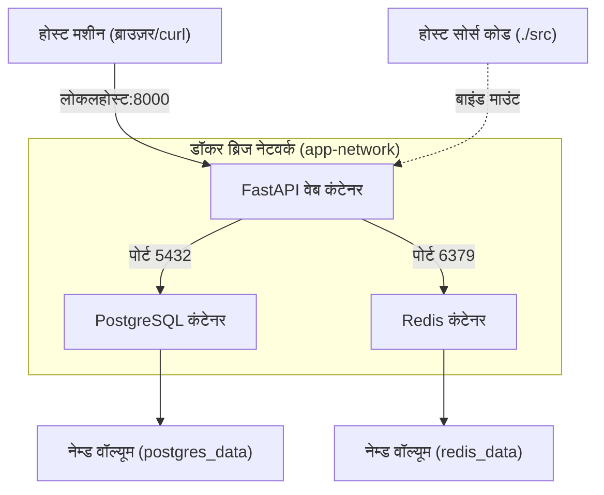
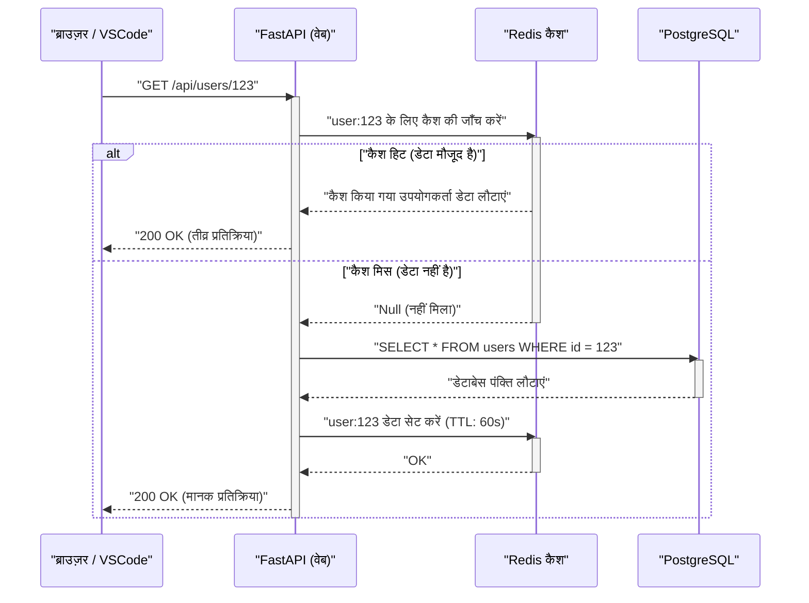

## 1. प्रस्तावना: "यह मेरे सिस्टम पर काम करता है" से छुटकारा पाना

सॉफ्टवेयर विकास में, डेवलपर्स के बीच वातावरण भिन्न होने के कारण उत्पन्न होने वाली "यह मेरे सिस्टम पर काम करता है (It works on my machine)" जैसी समस्या, लंबे समय से कई परियोजनाओं में समय बर्बाद करने वाला एक प्रमुख कारक रही है। ऑपरेटिंग सिस्टम में अंतर, इंस्टॉल किए गए प्रोग्रामिंग भाषाओं के संस्करण, लाइब्रेरी की निर्भरताएं, और विश्व स्तर पर (globally) इंस्टॉल किए गए उपकरणों के बीच टकराव आदि के कारण, स्थानीय वातावरण हमेशा "स्थिति की अनिश्चितता" के संपर्क में रहता है।

इन चुनौतियों को जड़ से हल करने का काम **Docker** जैसी कंटेनर तकनीकें और **Infrastructure as Code (IaC)** प्रतिमान (paradigm) करते हैं। स्थानीय विकास वातावरण को कंटेनरीकृत करके, OS स्तर पर अलगाव (isolation) प्राप्त किया जा सकता है और कोडबेस के साथ-साथ वातावरण को भी संस्करण-नियंत्रित (version-controlled) किया जा सकता है।

इस लेख में, हम Docker, Docker Compose, और VSCode DevContainers का उपयोग करके एक **"पुनरुत्पादित (reproducible) स्थानीय विकास वातावरण, जो हमेशा एक समान स्थिति में शुरू होता है, चाहे कोई भी, कभी भी, किसी भी मशीन पर इसे शुरू करे"** बनाने की प्रक्रिया और इसके पीछे के गहरे तकनीकी तंत्र (mechanism) के बारे में, गणितीय दृष्टिकोण के साथ, विस्तार से बताएंगे।

---

## 2. Infrastructure as Code (IaC) और कंटेनर तकनीक की अनुकूलता

### IaC के सिद्धांत और स्थानीय वातावरण में उनका अनुप्रयोग

Infrastructure as Code (IaC) बुनियादी ढांचे (infrastructure) के कॉन्फ़िगरेशन और प्रावधान (provisioning) को मैन्युअल प्रक्रियाओं के बजाय मशीन-पठनीय (machine-readable) परिभाषा फ़ाइलों के माध्यम से प्रबंधित करने का एक दृष्टिकोण है। IaC के मुख्य सिद्धांतों में निम्नलिखित तत्व शामिल हैं:

1. **घोषणात्मक दृष्टिकोण (Declarative Approach)**: "स्थिति को कैसे बदलें" के बजाय "अंतिम स्थिति कैसी होनी चाहिए", इसे परिभाषित करता है।
2. **समरूपता (Idempotency)**: स्क्रिप्ट को कितनी बार भी निष्पादित किया जाए, हमेशा एक ही परिणाम (स्थिति) की गारंटी होती है।
3. **संस्करण नियंत्रण (Version Control)**: बुनियादी ढांचे की स्थिति को कोड के रूप में Git जैसे VCS में सहेजा जाता है, जिससे परिवर्तन इतिहास को ट्रैक करना और पीयर रिव्यू संभव हो पाता है।

स्थानीय विकास वातावरण में IaC को लागू करने का अर्थ है `Dockerfile`, `docker-compose.yml`, और `devcontainer.json` का उपयोग करके विकास वातावरण की "आदर्श स्थिति" को कोड के रूप में परिभाषित करना। इससे टीम में शामिल होने वाले नए सदस्य भी केवल रिपॉजिटरी को क्लोन करके और एक कमांड चलाकर तुरंत अपना काम शुरू कर सकते हैं, जिससे ऑनबोर्डिंग अनुभव (onboarding experience) बहुत सहज हो जाता है।

### कंटेनर तकनीक को समर्थन देने वाले कर्नेल फ़ंक्शंस

कंटेनर तकनीक वर्चुअल मशीन (VM) जैसे हाइपरवाइज़र-आधारित वर्चुअलाइजेशन से अलग है। यह एक हल्की (lightweight) वर्चुअलाइजेशन तकनीक है जो होस्ट OS के कर्नेल को साझा करते हुए प्रक्रियाओं (processes) को अलग (isolate) करती है। इसे प्राप्त करने के लिए, मुख्य रूप से Linux कर्नेल के निम्नलिखित फ़ंक्शंस का उपयोग किया जाता है:

- **Namespaces (नेमस्पेस)**: प्रत्येक प्रक्रिया के लिए सिस्टम संसाधनों (PID, नेटवर्क, माउंट पॉइंट, उपयोगकर्ता आदि) का एक स्वतंत्र दृश्य (view) प्रदान करता है।
- **Cgroups (Control Groups)**: एक प्रक्रिया द्वारा उपयोग किए जा सकने वाले भौतिक संसाधनों (CPU, मेमोरी, डिस्क I/O आदि) को सीमित और आवंटित (allocate) करता है।
- **UnionFS (Union File System)**: यह एक ऐसी तकनीक है जो कई डायरेक्टरी ट्री (लेयर) को पारदर्शी रूप से ओवरले करती है और उन्हें एक एकल फ़ाइल सिस्टम के रूप में प्रस्तुत करती है। Docker की इमेज लेयर्स इसी तकनीक पर निर्भर करती हैं।

आइए संसाधन सीमा के गणितीय मॉडल पर विचार करें। मान लीजिए कि होस्ट मशीन की कुल मेमोरी क्षमता $M_{\text{total}}$ है, और होस्ट पर चलने वाले $n$ कंटेनरों की मेमोरी सीमा $m_i$ है। होस्ट OS और अन्य प्रक्रियाओं द्वारा खपत की जाने वाली बेस मेमोरी $M_{\text{os}}$ को ध्यान में रखते हुए, सिस्टम के स्थिर रूप से चलने की आवश्यक शर्त को निम्नलिखित असमानता (inequality) के रूप में व्यक्त किया जा सकता है:

$$ \sum_{i=1}^{n} m_i \le M_{\text{total}} - M_{\text{os}} $$

Cgroups का उपयोग करके प्रत्येक कंटेनर के लिए $m_i$ को कड़ाई से परिभाषित करने से, किसी विशिष्ट कंटेनर में मेमोरी लीक होने पर भी, OOM (Out Of Memory) Killer को अन्य कंटेनरों या पूरे होस्ट सिस्टम को क्रैश करने से रोका जा सकता है।

---

## 3. कुशल Dockerfile डिज़ाइन: मल्टी-स्टेज बिल्ड (Multi-stage Build) में महारत हासिल करना

पुनरुत्पादित वातावरण की दिशा में पहला कदम एप्लिकेशन के निष्पादन वातावरण (execution environment) को परिभाषित करने वाले `Dockerfile` को डिज़ाइन करना है। यहाँ, हम Python (FastAPI) को एक उदाहरण के रूप में उपयोग करके, **मल्टी-स्टेज बिल्ड** का लाभ उठाने वाले एक सुरक्षित और हल्के Dockerfile के सर्वोत्तम अभ्यासों (best practices) की व्याख्या करेंगे।

मल्टी-स्टेज बिल्ड एक ऐसी तकनीक है जो एक ही `Dockerfile` में कई `FROM` निर्देशों (instructions) का उपयोग करती है। यह बिल्ड वातावरण (एक भारी वातावरण जिसमें कंपाइलर और विकास उपकरण शामिल होते हैं) और निष्पादन वातावरण (एक हल्का वातावरण जिसमें केवल आवश्यक परिणामी फ़ाइलें होती हैं) को अलग करती है।

### व्यावहारिक Python FastAPI Dockerfile

निम्नलिखित कोड Poetry का उपयोग करके निर्भरता प्रबंधन (dependency management) और मल्टी-स्टेज बिल्ड को संयोजित करने वाले एक उन्नत `Dockerfile` का उदाहरण है।

```dockerfile
# ---------------------------------------------------------
# Stage 1: Builder (बिल्ड वातावरण)
# ---------------------------------------------------------
FROM python:3.11-slim AS builder

# आवश्यक पर्यावरण चर (environment variables) सेट करना
ENV PYTHONUNBUFFERED=1 \
    PYTHONDONTWRITEBYTECODE=1 \
    POETRY_VERSION=1.6.1 \
    POETRY_HOME="/opt/poetry" \
    POETRY_VIRTUALENVS_IN_PROJECT=true \
    POETRY_NO_INTERACTION=1

# निर्भरता पैकेज इंस्टॉल करना
RUN apt-get update && apt-get install -y --no-install-recommends \
    curl build-essential && \
    curl -sSL https://install.python-poetry.org | python3 - && \
    apt-get clean && rm -rf /var/lib/apt/lists/*

ENV PATH="$POETRY_HOME/bin:$PATH"

WORKDIR /app

# निर्भरता फ़ाइलों को कॉपी और इंस्टॉल करना
COPY pyproject.toml poetry.lock ./
RUN poetry install --no-root --only main

# ---------------------------------------------------------
# Stage 2: Runtime (निष्पादन वातावरण)
# ---------------------------------------------------------
FROM python:3.11-slim AS runtime

ENV PYTHONUNBUFFERED=1 \
    PYTHONDONTWRITEBYTECODE=1 \
    PATH="/app/.venv/bin:$PATH"

# एक न्यूनतम गैर-विशेषाधिकार प्राप्त (non-privileged) उपयोगकर्ता बनाना
RUN groupadd -r appuser && useradd -r -g appuser appuser

WORKDIR /app

# बिल्डर से केवल वर्चुअल वातावरण (निर्भरताएँ) कॉपी करना
COPY --from=builder --chown=appuser:appuser /app/.venv /app/.venv

# एप्लिकेशन कोड कॉपी करना
COPY --chown=appuser:appuser ./src /app/src

# गैर-विशेषाधिकार प्राप्त उपयोगकर्ता पर स्विच करना
USER appuser

# कंटेनर के शुरू होने पर डिफ़ॉल्ट कमांड
ENTRYPOINT ["uvicorn", "src.main:app", "--host", "0.0.0.0", "--port", "8000"]
```

### मल्टी-स्टेज बिल्ड के माध्यम से इमेज के आकार का गणितीय मूल्यांकन

मान लीजिए कि सिंगल-स्टेज बिल्ड का उपयोग करने पर इमेज का आकार $S_{\text{single}}$ है, और मल्टी-स्टेज बिल्ड लागू करने पर इमेज का आकार $S_{\text{multi}}$ है। आकार में कमी की दर $R$ की गणना इस प्रकार की जा सकती है:

$$ R = \left( 1 - \frac{S_{\text{multi}}}{S_{\text{single}}} \right) \times 100 \ (\%) $$

उदाहरण के लिए, मान लें कि $S_{\text{single}}$ में OS की बेस इमेज (लगभग 110MB), विकास पैकेज (gcc आदि लगभग 150MB), Poetry (लगभग 40MB), प्रोजेक्ट की निर्भरता लाइब्रेरी (लगभग 80MB), और सोर्स कोड (लगभग 5MB) शामिल हैं, जो कुल 385MB हो जाता है।
दूसरी ओर, $S_{\text{multi}}$ में, बेस इमेज (110MB) में केवल निर्भरता लाइब्रेरी (80MB) और सोर्स कोड (5MB) कॉपी किए जाते हैं, जिससे कुल आकार 195MB हो जाता है।

$$ R = \left( 1 - \frac{195}{385} \right) \times 100 \approx 49.35\% $$

इस प्रकार, मल्टी-स्टेज बिल्ड लागू करके, इमेज के आकार को लगभग आधा किया जा सकता है। इमेज के आकार को कम करने का सीधा परिणाम रजिस्ट्री से पुल (Pull) करने के समय में कमी, डिस्क स्थान की बचत और हमले के सतह क्षेत्र (Attack Surface) को कम करके सुरक्षा में सुधार के रूप में मिलता है।

---

## 4. Docker Compose के माध्यम से कई कंटेनरों का ऑर्केस्ट्रेशन

आधुनिक वेब एप्लिकेशन विकास में, एक माइक्रोसर्विस आर्किटेक्चर आम है जहां कई घटक (components) जैसे वेब सर्वर, डेटाबेस, और कैश सर्वर एक साथ काम करते हैं। स्थानीय वातावरण में इन सभी को एक ही स्थान से प्रबंधित करने के लिए `docker-compose.yml` का उपयोग किया जाता है।

इस बार, हम स्थानीय स्तर पर एक 3-स्तरीय सिस्टम बनाएंगे: "Web (FastAPI)", "Database (PostgreSQL)", और "Cache (Redis)"।

### आर्किटेक्चर आरेख (Mermaid)

नीचे दिया गया आरेख स्थानीय मशीन पर प्रत्येक कंटेनर, नेटवर्क और वॉल्यूम के बीच के संबंध को दर्शाता है।



### docker-compose.yml का कार्यान्वयन और विस्तृत विवरण

नीचे एक मजबूत `docker-compose.yml` का उदाहरण दिया गया है जो एक व्यावहारिक वातावरण के निर्माण को सहन कर सकता है।

```yaml
version: '3.8'

services:
  web:
    build:
      context: .
      target: runtime
    container_name: dev_web
    ports:
      - "8000:8000"
    volumes:
      - ./src:/app/src:ro  # होस्ट कोड को रीड-ओनली रूप में माउंट करें (हॉट रिलोड के लिए)
    environment:
      - DATABASE_URL=postgresql://postgres:${POSTGRES_PASSWORD}@db:5432/${POSTGRES_DB}
      - REDIS_URL=redis://redis:6379/0
    env_file:
      - .env
    depends_on:
      db:
        condition: service_healthy
      redis:
        condition: service_started
    networks:
      - app-network
    command: ["uvicorn", "src.main:app", "--host", "0.0.0.0", "--port", "8000", "--reload"]

  db:
    image: postgres:15-alpine
    container_name: dev_db
    ports:
      - "5432:5432"
    environment:
      POSTGRES_USER: postgres
      POSTGRES_PASSWORD: ${POSTGRES_PASSWORD}
      POSTGRES_DB: ${POSTGRES_DB}
    volumes:
      - postgres_data:/var/lib/postgresql/data
    networks:
      - app-network
    healthcheck:
      test: ["CMD-SHELL", "pg_isready -U postgres -d ${POSTGRES_DB}"]
      interval: 5s
      timeout: 5s
      retries: 5

  redis:
    image: redis:7-alpine
    container_name: dev_redis
    ports:
      - "6379:6379"
    volumes:
      - redis_data:/data
    networks:
      - app-network
    command: ["redis-server", "--appendonly", "yes"]

volumes:
  postgres_data:
  redis_data:

networks:
  app-network:
    driver: bridge
```

### वॉल्यूम (Volumes) और डेटा को सुरक्षित रखना (Persistence)

कंटेनर सिद्धांत रूप में "स्टेटलेस (stateless)" और "एफेमेरल (ephemeral - अल्पकालिक)" होते हैं। जब एक कंटेनर नष्ट हो जाता है, तो उसके अंदर का डेटा भी खो जाता है। डेटाबेस डेटा और कैश को बनाए रखने के लिए, आपको होस्ट मशीन के फाइल सिस्टम स्पेस को कंटेनर में माउंट करना होगा।

- **बाइंड माउंट (Bind Mount)**: यह उपर्युक्त `web` सेवा में `./src:/app/src:ro` से मेल खाता है। यह होस्ट पर एक विशिष्ट डायरेक्टरी को सीधे कंटेनर में मैप करता है। इसका उपयोग स्थानीय रूप से किए गए कोड संपादन (हॉट रिलोड) को तुरंत कंटेनर में प्रतिबिंबित करने के लिए किया जाता है। सुरक्षा के दृष्टिकोण से, सर्वोत्तम अभ्यास `:ro` (रीड-ओनली) विकल्प को लागू करना है ताकि कंटेनर होस्ट के सोर्स कोड को संशोधित न कर सके।
- **नेम्ड वॉल्यूम (Named Volume)**: यह `postgres_data` और `redis_data` से मेल खाता है। यह Docker द्वारा आंतरिक रूप से प्रबंधित एक क्षेत्र है (जैसे `/var/lib/docker/volumes/`)। यह बाइंड माउंट की तुलना में बेहतर I/O प्रदर्शन प्रदान करता है और OS के बीच फ़ाइल सिस्टम के अंतर को छुपाता है। डेटाबेस को सुरक्षित रखने (persistence) के लिए हमेशा इसका उपयोग करें।

### नेटवर्किंग (Networking) और सर्विस डिस्कवरी

Docker Compose डिफ़ॉल्ट रूप से प्रत्येक प्रोजेक्ट के लिए एक अलग ब्रिज नेटवर्क बनाता है। उपर्युक्त `app-network` इसका एक उदाहरण है।
एक ही नेटवर्क से संबंधित कंटेनर एक दूसरे को IP पते के बजाय उनके "सेवा नाम (उदा. `db`, `redis`)" का उपयोग करके होस्टनाम के रूप में हल कर सकते हैं (DNS रिज़ॉल्यूशन)।
उदाहरण के लिए, वेब कंटेनर से, आप `postgresql://postgres:password@db:5432/mydb` URL का उपयोग करके डेटाबेस तक पहुंच सकते हैं। यह आपको इन्फ्रास्ट्रक्चर कोड को बदले बिना पर्यावरण चर (environment variables) के माध्यम से स्थानीय और उत्पादन वातावरण (production environment) के बीच कनेक्शन गंतव्य को पारदर्शी रूप से बदलने की अनुमति देता है।

### हेल्थचेक (Healthcheck) और स्टार्टअप अनुक्रम को नियंत्रित करना

`depends_on` निर्देश कंटेनरों के स्टार्टअप अनुक्रम को नियंत्रित करता है, लेकिन केवल `depends_on` निर्दिष्ट करने से वेब कंटेनर तब शुरू हो जाएगा जब "DB कंटेनर शुरू हो गया है"। वास्तव में, DB आरंभीकरण प्रक्रिया (PostgreSQL प्रक्रिया शुरू होना और तालिकाओं की तैयारी) को पूरा होने में कुछ सेकंड लगते हैं, इसलिए वेब कंटेनर से DB कनेक्शन में त्रुटि हो सकती है।
इसे रोकने के लिए, `healthcheck` को परिभाषित करके और `condition: service_healthy` निर्दिष्ट करके, आप वेब कंटेनर को तभी शुरू कर सकते हैं जब यह पुष्टि हो जाए कि "DB कनेक्शन अनुरोध स्वीकार करने के लिए तैयार है"।

---

## 5. पर्यावरण चर प्रबंधन और सुरक्षा (.env)

डेटाबेस पासवर्ड और API कुंजियों जैसी संवेदनशील जानकारी को `docker-compose.yml` में हार्ड-कोड करना एक एंटी-पैटर्न है जिससे सख्ती से बचा जाना चाहिए। इसके बजाय, इन मानों को इंजेक्ट करने के लिए पर्यावरण चर (environment variable) फ़ाइल `.env` का उपयोग करें।

प्रोजेक्ट के रूट में एक `.env` फ़ाइल बनाएँ।

```ini
# .env फ़ाइल (Git द्वारा प्रबंधित होने से बचने के लिए इसे .gitignore में जोड़ें)
POSTGRES_PASSWORD=supersecretpassword
POSTGRES_DB=devdb
API_SECRET_KEY=dev_secret_key_12345
```

Docker Compose डिफ़ॉल्ट रूप से निष्पादन डायरेक्टरी में `.env` फ़ाइल को पढ़ता है और YAML फ़ाइल में `${VAR_NAME}` प्लेसहोल्डर का विस्तार करता है। यह दृष्टिकोण आपको इन्फ्रास्ट्रक्चर कोड को बदले बिना स्थानीय, स्टेजिंग और उत्पादन (production) जैसे विभिन्न वातावरणों के लिए कॉन्फ़िगरेशन मानों को सुरक्षित रूप से प्रबंधित करने की अनुमति देता है।

---

## 6. VSCode DevContainers के साथ बेहतरीन विकास अनुभव

अब तक, हमने Docker का उपयोग करके एक मजबूत बैकएंड वातावरण स्थापित कर लिया है। हालाँकि, हम एक कदम और आगे जा सकते हैं। **VSCode DevContainers (Remote - Containers)** सुविधा का उपयोग करके, आप कंटेनर के अंदर एडिटर (VSCode) के बैकएंड को चला सकते हैं।

यह आपकी स्थानीय मशीन पर Python या Node.js इंस्टॉल करने की आवश्यकता को पूरी तरह से समाप्त कर देता है। लिनटर्स (flake8/eslint) और फॉर्मेटर्स (black/prettier) से लेकर IDE एक्सटेंशन तक सब कुछ कोडबेस के भीतर परिभाषित किया जा सकता है और पूरी टीम द्वारा साझा किया जा सकता है।

### devcontainer.json कॉन्फ़िगरेशन

प्रोजेक्ट के रूट में एक `.devcontainer` डायरेक्टरी बनाएँ और कॉन्फ़िगरेशन फ़ाइल को उसके अंदर रखें।

`.devcontainer/devcontainer.json`:
```json
{
  "name": "Python FastAPI Dev Environment",
  "dockerComposeFile": ["../docker-compose.yml"],
  "service": "web",
  "workspaceFolder": "/app",
  "customizations": {
    "vscode": {
      "settings": {
        "python.defaultInterpreterPath": "/app/.venv/bin/python",
        "python.formatting.provider": "black",
        "editor.formatOnSave": true
      },
      "extensions": [
        "ms-python.python",
        "ms-python.vscode-pylance",
        "ms-python.black-formatter",
        "tamasfe.even-better-toml"
      ]
    }
  },
  "forwardPorts": [8000, 5432, 6379],
  "remoteUser": "appuser",
  "postCreateCommand": "poetry install"
}
```

इस फ़ाइल को रिपॉजिटरी में शामिल करके, जैसे ही आप VSCode में प्रोजेक्ट खोलते हैं, "कंटेनर में फिर से खोलें (Reopen in Container)" का एक प्रॉम्प्ट दिखाई देगा। बस उस पर क्लिक करने से सभी आवश्यक कंटेनर शुरू हो जाएंगे, एक्सटेंशन इंस्टॉल हो जाएंगे, और आप तुरंत कोडिंग शुरू करने के लिए तैयार होंगे। यह सचमुच एक जादुई अनुभव है।

---

## 7. अनुरोध प्रसंस्करण (Request Processing) अनुक्रम और प्रदर्शन मॉडलिंग

हम बनाए गए स्थानीय विकास वातावरण में वेब एप्लिकेशन के अनुरोध प्रसंस्करण के जीवनचक्र की पुष्टि करने के लिए एक अनुक्रम आरेख (sequence diagram) का उपयोग करेंगे, और इसके प्रदर्शन के गणितीय मॉडल पर विचार करेंगे।

### अनुक्रम आरेख (Sequence Diagram - Request Flow)



### प्रोसेसिंग देरी (Latency) का गणितीय मॉडल

उपरोक्त सिस्टम में औसत अनुरोध प्रसंस्करण समय $T_{\text{total}}$ को गणितीय रूप से मॉडल करें।
प्रत्येक प्रक्रिया की विलंबता (latency) को निम्नानुसार परिभाषित किया गया है:
- $T_{\text{net}}$: क्लाइंट और वेब कंटेनर के बीच नेटवर्क विलंबता
- $T_{\text{app}}$: एप्लिकेशन-पक्ष पर शुद्ध प्रसंस्करण समय (क्रमबद्धता आदि)
- $T_{\text{cache}}$: Redis से पढ़ने/लिखने में लगने वाला समय
- $T_{\text{db}}$: PostgreSQL पर क्वेरी निष्पादित करने में लगने वाला समय
- $p_{\text{miss}}$: कैश मिस रेट ($0 \le p_{\text{miss}} \le 1$)

इस समय, औसत प्रतिक्रिया समय निम्नलिखित अपेक्षित मूल्य गणना सूत्र द्वारा व्यक्त किया गया है:

$$ T_{\text{total}} = T_{\text{net}} + T_{\text{app}} + T_{\text{cache}} + p_{\text{miss}} \times (T_{\text{db}} + T_{\text{cache\_write}}) $$

स्थानीय विकास वातावरण (Docker के अंदर) में, $T_{\text{net}}$ लगभग 0 के करीब होगा, लेकिन ध्यान देने योग्य बात **बाइंड माउंट करते समय I/O प्रदर्शन** है। खासकर जब Windows/macOS पर Docker Desktop का उपयोग किया जाता है, तो होस्ट OS और VM (कंटेनर) के बीच फ़ाइल साझाकरण ओवरहेड के कारण $T_{\text{app}}$ (कोड लोड करने का समय आदि) बढ़ने की प्रवृत्ति होती है। इस अड़चन (bottleneck) को हल करने के लिए, उपर्युक्त DevContainers का उपयोग करके पूरे सोर्स कोड को नेम्ड वॉल्यूम में रखने या WSL2 (Windows Subsystem for Linux 2) वातावरण में मूल रूप से Docker इंजन को चलाने वाले आर्किटेक्चर की दृढ़ता से अनुशंसा की जाती है।

---

## 8. Docker बिल्ड प्रदर्शन अनुकूलन (Optimization): लेयर कैश रणनीति

Dockerfile लिखते समय, यह समझना कि "लेयर कैश" कैसे काम करता है, बिल्ड समय को काफी हद तक बदल सकता है।
Docker Dockerfile में प्रत्येक निर्देश (`FROM`, `RUN`, `COPY`, आदि) के लिए फ़ाइल सिस्टम अंतर (लेयर्स) बनाता है और उन्हें कैश के रूप में रखता है। पुनर्निर्माण के दौरान, जिन लेयर्स में कोई बदलाव नहीं हुआ है, उनके कैश का पुनः उपयोग किया जाता है।

महत्वपूर्ण सिद्धांत यह है कि **"उन चीज़ों को पहले लिखें जो कम बदलती हैं"**।

आइए उस प्रभाव का मॉडल तैयार करें जो सोर्स कोड में परिवर्तन बिल्ड समय पर डालता है। मान लीजिए कि कुल बिल्ड समय $T_{\text{build}}$ है, प्रत्येक चरण का निष्पादन समय $T_{\text{layer}_i}$ है, और क्या कैश हिट हुआ है या नहीं, यह एक बूलियन मान $c_i \in \{0, 1\}$ (कैश हिट होने पर 1) है।

$$ T_{\text{build}} = T_{\text{init}} + \sum_{i=1}^{n} (1 - c_i) \times T_{\text{layer}_i} $$

एक बार लेयर $k$ ($c_k = 0$) में कैश मिस होने पर, बाद की सभी लेयर्स $j > k$ ($c_j = 0$) के लिए कैश अमान्य (invalidated) हो जाता है।

```dockerfile
# खराब उदाहरण (सोर्स कोड पहले कॉपी किया गया है)
COPY ./src /app/src
COPY pyproject.toml poetry.lock ./
RUN poetry install
```
उपरोक्त मामले में, कोड की एक पंक्ति को संशोधित करने से पहला `COPY` एक कैश मिस बन जाएगा, और समय लेने वाला `RUN poetry install` हर बार निष्पादित किया जाएगा।

```dockerfile
# अच्छा उदाहरण (पहले निर्भरताओं को हल करें)
COPY pyproject.toml poetry.lock ./
RUN poetry install
COPY ./src /app/src
```
इस तरह से लिखने से, भले ही आप सोर्स कोड बदल दें, `poetry install` का लेयर कैश ($c_i = 1$) काम करेगा, इसलिए बिल्ड समय मिनटों से घटकर सेकंडों में आ जाएगा।

---

## 9. समस्या निवारण (Troubleshooting) और टिप्स

स्थानीय वातावरण को चलाते समय अक्सर आने वाली समस्याएँ और उनके समाधान यहाँ दिए गए हैं:

1. **पोर्ट टकराव त्रुटि (Port Conflict Error)**
   यदि आपको `Bind for 0.0.0.0:8000 failed: port is already allocated` जैसी त्रुटि मिलती है, तो आपकी स्थानीय मशीन पर कोई अन्य प्रक्रिया उस पोर्ट का उपयोग कर रही है। आप होस्ट-साइड पोर्ट नंबर को `ports: - "8080:8000"` की तरह बदलकर इससे बच सकते हैं।

2. **डिस्क स्पेस का खत्म होना**
   यदि आप लंबे समय तक Docker का उपयोग करते हैं, तो अप्रयुक्त इमेज और वॉल्यूम (Dangling Images / Volumes) जमा हो सकते हैं, जिससे दसियों GB डिस्क स्थान भर सकता है। सिस्टम को नियमित रूप से साफ़ करने के लिए निम्न कमांड की अनुशंसा की जाती है:
   ```bash
   docker system prune -a --volumes
   ```

3. **फ़ाइल अनुमति (Permissions) की समस्या**
   लिनक्स वातावरण में बाइंड माउंट का उपयोग करते समय, कंटेनर के अंदर बनाई गई फ़ाइलों का स्वामी (owner) `root` बन सकता है, जिससे आप उन्हें होस्ट साइड पर संपादित नहीं कर पाते। आप Dockerfile के भीतर एक गैर-विशेषाधिकार प्राप्त उपयोगकर्ता बनाकर और उसे होस्ट OS (उदा. 1000:1000) पर अपने स्वयं के UID/GID से मिलाकर इस समस्या को हल कर सकते हैं।

---

## 10. निष्कर्ष: पुनरुत्पादित वातावरण (Reproducibility) से विकास गति में सुधार

Docker, Docker Compose, और VSCode DevContainers को मिलाकर, एक मजबूत स्थानीय विकास वातावरण प्राप्त किया जाता है जहाँ "चाहे कोई भी वातावरण स्थापित करे, यह पूरी तरह से समान होगा।"

स्थानीय वातावरण में IaC प्रतिमान लाने से न केवल प्रारंभिक सेटअप समय कम होता है। यह इन्फ्रास्ट्रक्चर कॉन्फ़िगरेशन में बदलाव की चिंता को दूर करता है, नए प्रौद्योगिकी स्टैक (technology stacks) के प्रयोग को आसान बनाता है, CI/CD पाइपलाइनों में सुचारू संक्रमण (transition) को सक्षम बनाता है, और संपूर्ण विकास चक्र की गति और गुणवत्ता में नाटकीय रूप से सुधार करता है।

कृपया इस लेख में चर्चा की गई सर्वोत्तम प्रथाओं, जैसे मल्टी-स्टेज बिल्ड के माध्यम से इमेज आकार का अनुकूलन, हेल्थचेक का उपयोग करके निर्भरता नियंत्रण, और लेयर कैश के बारे में जागरूक Dockerfile लेखन का उपयोग करें, और अपनी परियोजनाओं में सर्वोत्तम विकास अनुभव (DX: Developer Experience) लाएँ।
