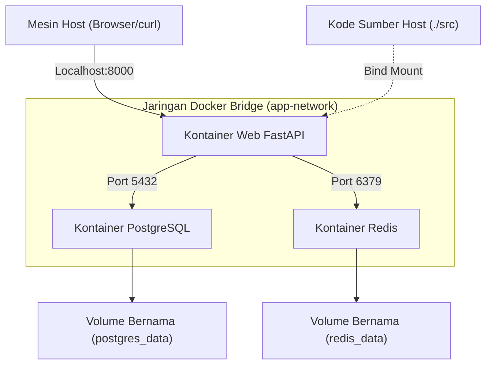
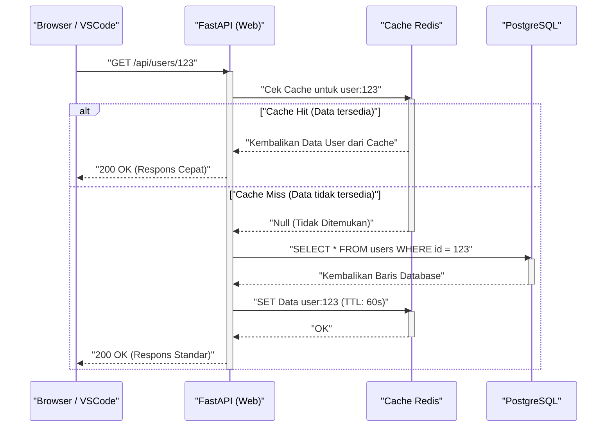

## 1. Pendahuluan: Keluar dari Siklus "Di Lingkungan Saya Berjalan Normal"

Dalam dunia pengembangan perangkat lunak, masalah "Di lingkungan saya berjalan normal (It works on my machine)" yang disebabkan oleh perbedaan lingkungan antar pengembang, telah lama menjadi faktor yang membuang-buang waktu dalam banyak proyek. Perbedaan OS, versi bahasa yang diinstal, dependensi pustaka, konflik dengan alat yang diinstal secara global, dll. membuat lingkungan lokal selalu dihadapkan pada "ketidakpastian status".

Hal yang dapat menyelesaikan masalah ini dari akarnya adalah teknologi kontainer seperti **Docker**, dan paradigma **Infrastructure as Code (IaC)**. Dengan mengontainerisasi lingkungan pengembangan lokal, kita dapat mewujudkan isolasi di tingkat OS, serta memungkinkan sistem kontrol versi pada lingkungan itu sendiri bersama dengan basis kode.

Dalam artikel ini, kita akan membahas secara mendalam, lengkap dengan perspektif matematis dan mekanisme teknis yang mendasarinya, mengenai langkah-langkah membangun **"lingkungan pengembangan lokal yang dapat direproduksi, sehingga siapa pun, kapan pun, dan di mesin mana pun ketika dihidupkan, akan menghasilkan kondisi yang persis sama"**, dengan memanfaatkan Docker, Docker Compose, dan VSCode DevContainers.

---

## 2. Kedekatan antara Infrastructure as Code (IaC) dan Teknologi Kontainer

### Prinsip IaC dan Penerapannya di Lingkungan Lokal

Infrastructure as Code (IaC) adalah pendekatan di mana pengelolaan dan penyediaan konfigurasi infrastruktur dilakukan melalui file definisi yang dapat dibaca mesin, bukan melalui proses manual. Prinsip inti IaC mencakup elemen-elemen berikut:

1. **Pendekatan Deklaratif (Declarative Approach)**: Mendefinisikan "seperti apa status akhir seharusnya" daripada "bagaimana cara mengubah status tersebut".
2. **Idempotensi (Idempotency)**: Tidak peduli seberapa sering skrip dieksekusi, hasil yang sama (status) selalu terjamin.
3. **Kontrol Versi (Version Control)**: Status infrastruktur disimpan sebagai kode dalam VCS seperti Git, yang memungkinkan pelacakan riwayat perubahan dan tinjauan rekan (peer review).

Mempraktikkan IaC dalam lingkungan pengembangan lokal berarti mengodekan "bentuk ideal" dari lingkungan pengembangan menggunakan `Dockerfile`, `docker-compose.yml`, dan `devcontainer.json`. Dengan ini, anggota baru yang bergabung dalam tim dapat merasakan pengalaman pengenalan (onboarding) di mana mereka hanya perlu meng-clone repositori dan menjalankan satu perintah untuk dapat langsung memulai pengembangan.

### Fitur Kernel yang Mendukung Teknologi Kontainer

Berbeda dengan virtualisasi tipe hypervisor seperti Mesin Virtual (VM), teknologi kontainer adalah teknologi virtualisasi ringan yang mengisolasi proses sambil berbagi kernel OS host. Untuk mewujudkan hal ini, fungsi-fungsi kernel Linux berikut ini banyak digunakan:

- **Namespaces**: Menyediakan tampilan yang independen dari sumber daya sistem (PID, jaringan, titik pemasangan (mount points), pengguna, dll.) untuk setiap proses.
- **Cgroups (Control Groups)**: Melakukan pembatasan dan alokasi sumber daya fisik yang dapat digunakan oleh proses (CPU, memori, I/O disk, dll.).
- **UnionFS (Union File System)**: Teknologi yang memungkinkan tumpang tindih secara transparan dari beberapa struktur direktori (lapisan/layer) agar tampak sebagai satu sistem file tunggal. Lapisan citra (image layer) Docker bergantung pada teknologi ini.

Mari pertimbangkan model matematika dari pembatasan sumber daya. Misalkan total kapasitas memori mesin host adalah $M_{\text{total}}$, dan batas memori untuk $n$ buah kontainer yang berjalan di host adalah $m_i$. Kondisi yang diperlukan agar sistem dapat berjalan stabil, dengan memperhitungkan basis memori $M_{\text{os}}$ yang dikonsumsi oleh OS host dan proses lainnya, dapat direpresentasikan oleh pertidaksamaan berikut:

$$ \sum_{i=1}^{n} m_i \le M_{\text{total}} - M_{\text{os}} $$

Dengan menggunakan Cgroups untuk mendefinisikan $m_i$ secara ketat bagi setiap kontainer, saat terjadi kebocoran memori pada kontainer tertentu, kita dapat mencegah kontainer lain atau keseluruhan sistem host ikut mati akibat OOM (Out Of Memory) Killer.

---

## 3. Desain Dockerfile yang Efisien: Menguasai Build Multi-tahap (Multi-stage Build)

Langkah pertama menuju lingkungan yang dapat direproduksi adalah mendesain `Dockerfile` yang mendefinisikan lingkungan eksekusi aplikasi. Di sini, dengan mengambil Python (FastAPI) sebagai contoh, kita akan membahas praktik terbaik untuk Dockerfile yang aman dan ringan dengan memanfaatkan **build multi-tahap**.

Build multi-tahap adalah teknik yang memisahkan lingkungan build (lingkungan berat yang mencakup kompiler dan alat pengembangan) dari lingkungan eksekusi (lingkungan ringan yang hanya berisi hasil akhir yang diperlukan) dengan menggunakan beberapa perintah `FROM` di dalam sebuah `Dockerfile` tunggal.

### Dockerfile Praktis untuk Python FastAPI

Kode berikut ini merupakan contoh `Dockerfile` tingkat lanjut yang menggabungkan pengelolaan dependensi menggunakan Poetry dengan build multi-tahap.

```dockerfile
# ---------------------------------------------------------
# Stage 1: Builder (Lingkungan Build)
# ---------------------------------------------------------
FROM python:3.11-slim AS builder

# Pengaturan variabel lingkungan yang diperlukan
ENV PYTHONUNBUFFERED=1 \
    PYTHONDONTWRITEBYTECODE=1 \
    POETRY_VERSION=1.6.1 \
    POETRY_HOME="/opt/poetry" \
    POETRY_VIRTUALENVS_IN_PROJECT=true \
    POETRY_NO_INTERACTION=1

# Menginstal dependensi paket
RUN apt-get update && apt-get install -y --no-install-recommends \
    curl build-essential && \
    curl -sSL https://install.python-poetry.org | python3 - && \
    apt-get clean && rm -rf /var/lib/apt/lists/*

ENV PATH="$POETRY_HOME/bin:$PATH"

WORKDIR /app

# Menyalin dan menginstal file dependensi
COPY pyproject.toml poetry.lock ./
RUN poetry install --no-root --only main

# ---------------------------------------------------------
# Stage 2: Runtime (Lingkungan Eksekusi)
# ---------------------------------------------------------
FROM python:3.11-slim AS runtime

ENV PYTHONUNBUFFERED=1 \
    PYTHONDONTWRITEBYTECODE=1 \
    PATH="/app/.venv/bin:$PATH"

# Membuat pengguna dengan hak akses non-privelege minimum
RUN groupadd -r appuser && useradd -r -g appuser appuser

WORKDIR /app

# Hanya menyalin lingkungan virtual (dependensi) dari builder
COPY --from=builder --chown=appuser:appuser /app/.venv /app/.venv

# Menyalin kode aplikasi
COPY --chown=appuser:appuser ./src /app/src

# Beralih ke pengguna non-privilege
USER appuser

# Perintah default saat kontainer dijalankan
ENTRYPOINT ["uvicorn", "src.main:app", "--host", "0.0.0.0", "--port", "8000"]
```

### Evaluasi Matematis Ukuran Citra karena Build Multi-tahap

Misalkan ukuran citra ketika di-build pada satu tahap adalah $S_{\text{single}}$, dan ukuran citra saat build multi-tahap diterapkan adalah $S_{\text{multi}}$. Tingkat pengurangan ukuran $R$ dapat dihitung sebagai berikut:

$$ R = \left( 1 - \frac{S_{\text{multi}}}{S_{\text{single}}} \right) \times 100 \ (\%) $$

Sebagai contoh, jika $S_{\text{single}}$ mencakup citra dasar OS (sekitar 110MB), paket pengembangan (gcc, dll. sekitar 150MB), Poetry itu sendiri (sekitar 40MB), pustaka dependensi proyek (sekitar 80MB), dan kode sumber (sekitar 5MB), sehingga total menjadi 385MB.
Di sisi lain, pada $S_{\text{multi}}$, hanya pustaka dependensi (80MB) dan kode sumber (5MB) yang disalin ke citra dasar (110MB), sehingga totalnya menjadi 195MB.

$$ R = \left( 1 - \frac{195}{385} \right) \times 100 \approx 49.35\% $$

Dengan menerapkan build multi-tahap seperti ini, kita dapat mengurangi ukuran citra sekitar setengahnya. Pengurangan ukuran citra akan berdampak langsung pada pemendekan waktu pull dari registry, penghematan kapasitas disk, serta peningkatan keamanan dengan mengurangi area serangan (Attack Surface).

---

## 4. Orkestrasi Berbagai Kontainer Menggunakan Docker Compose

Dalam pengembangan aplikasi web modern, arsitektur layanan mikro yang menggabungkan banyak komponen seperti server Web, basis data, dan server cache adalah hal yang umum. Untuk mengelola semua ini secara terpusat di lingkungan lokal, kita menggunakan `docker-compose.yml`.

Kali ini, kita akan membangun sistem dengan struktur tiga lapisan di lingkungan lokal: "Web (FastAPI)", "Basis Data (PostgreSQL)", dan "Cache (Redis)".

### Diagram Arsitektur (Mermaid)

Diagram blok di bawah ini mengilustrasikan hubungan antara masing-masing kontainer, jaringan, dan volume pada mesin lokal.



### Implementasi dan Penjelasan Mendalam tentang docker-compose.yml

Berikut disajikan contoh `docker-compose.yml` yang kokoh, yang dapat diandalkan untuk membangun lingkungan yang nyata.

```yaml
version: '3.8'

services:
  web:
    build:
      context: .
      target: runtime
    container_name: dev_web
    ports:
      - "8000:8000"
    volumes:
      - ./src:/app/src:ro  # Melakukan mount kode host sebagai read-only (untuk hot reload)
    environment:
      - DATABASE_URL=postgresql://postgres:${POSTGRES_PASSWORD}@db:5432/${POSTGRES_DB}
      - REDIS_URL=redis://redis:6379/0
    env_file:
      - .env
    depends_on:
      db:
        condition: service_healthy
      redis:
        condition: service_started
    networks:
      - app-network
    command: ["uvicorn", "src.main:app", "--host", "0.0.0.0", "--port", "8000", "--reload"]

  db:
    image: postgres:15-alpine
    container_name: dev_db
    ports:
      - "5432:5432"
    environment:
      POSTGRES_USER: postgres
      POSTGRES_PASSWORD: ${POSTGRES_PASSWORD}
      POSTGRES_DB: ${POSTGRES_DB}
    volumes:
      - postgres_data:/var/lib/postgresql/data
    networks:
      - app-network
    healthcheck:
      test: ["CMD-SHELL", "pg_isready -U postgres -d ${POSTGRES_DB}"]
      interval: 5s
      timeout: 5s
      retries: 5

  redis:
    image: redis:7-alpine
    container_name: dev_redis
    ports:
      - "6379:6379"
    volumes:
      - redis_data:/data
    networks:
      - app-network
    command: ["redis-server", "--appendonly", "yes"]

volumes:
  postgres_data:
  redis_data:

networks:
  app-network:
    driver: bridge
```

### Volume (Volumes) dan Persistensi Data

Secara prinsip, kontainer bersifat "stateless (tanpa status)" dan "ephemeral (berumur pendek)". Saat kontainer dihancurkan, data di dalamnya juga akan hilang. Untuk menyimpan data basis data atau cache, kita perlu melakukan mount ke area sistem file mesin host pada kontainer.

- **Bind Mount**: Pada layanan `web` di atas, pengaturan `./src:/app/src:ro` merupakan Bind Mount. Direktori spesifik di host dipetakan secara langsung ke dalam kontainer. Ini digunakan untuk langsung mencerminkan pengeditan kode lokal ke dalam kontainer (hot reload). Praktik terbaik dari perspektif keamanan adalah dengan memberikan opsi `:ro` (Read-Only) sehingga kontainer tidak dapat mengubah kode sumber pada host.
- **Volume Bernama (Named Volume)**: Contohnya adalah `postgres_data` dan `redis_data`. Ini adalah area yang dikelola secara internal oleh Docker (seperti `/var/lib/docker/volumes/`), memiliki performa I/O yang lebih baik daripada bind mount, dan dapat menyerap perbedaan sistem file di berbagai OS. Untuk memastikan keberlangsungan basis data, pastikan untuk menggunakan opsi ini.

### Jaringan (Networking) dan Penemuan Layanan (Service Discovery)

Docker Compose secara default akan membuat jaringan bridge sendiri untuk tiap proyek. Inilah jaringan `app-network` pada contoh di atas.
Kontainer-kontainer yang berada di jaringan yang sama dapat saling meresolusi nama (resolusi DNS) bukan dengan alamat IP, melainkan dengan nama layanannya (contoh: `db`, `redis`) sebagai nama host.
Misalnya, dari kontainer Web, kita bisa mengakses basis data menggunakan URL `postgresql://postgres:password@db:5432/mydb`. Hal ini memungkinkan pergantian tujuan koneksi secara transparan dengan menggunakan variabel lingkungan, baik di lingkungan lokal maupun lingkungan produksi, tanpa perlu mengubah kode infrastruktur.

### Pemeriksaan Kesehatan (Healthcheck) dan Kontrol Urutan Booting

Arahan `depends_on` memang mengontrol urutan pengaktifan kontainer, namun jika kita hanya menentukan `depends_on`, kontainer Web mungkin akan aktif saat "kontainer DB diaktifkan". Padahal, proses inisialisasi basis data (seperti peluncuran proses PostgreSQL atau persiapan tabel) membutuhkan waktu beberapa detik, dan dapat menyebabkan koneksi dari kontainer Web menuju DB mengalami kegagalan/error.
Untuk mencegah hal tersebut, kita mendefinisikan `healthcheck`, dan dengan menyetel `condition: service_healthy`, kita bisa menunda aktifnya kontainer Web sampai "DB terkonfirmasi berada dalam status siap menerima permintaan koneksi".

---

## 5. Manajemen Variabel Lingkungan dan Keamanan (.env)

Memasukkan informasi rahasia ke dalam `docker-compose.yml` secara langsung, seperti kata sandi basis data maupun kunci API, adalah pola anti yang mutlak harus dihindari. Sebaliknya, gunakan file variabel lingkungan `.env` untuk menyuntikkan nilai-nilai tersebut.

Buat file `.env` di akar proyek (project root).

```ini
# file .env (Pastikan untuk menambahkannya ke .gitignore agar tidak dikelola oleh Git)
POSTGRES_PASSWORD=supersecretpassword
POSTGRES_DB=devdb
API_SECRET_KEY=dev_secret_key_12345
```

Docker Compose secara default akan membaca file `.env` yang berada di direktori eksekusi dan mengekspansi *placeholder* `${VAR_NAME}` di dalam file YAML. Pendekatan ini memungkinkan pengelolaan yang aman dari nilai-nilai konfigurasi yang berbeda untuk berbagai lingkungan, seperti lokal, staging, dan lingkungan produksi, tanpa perlu memodifikasi kode infrastruktur.

---

## 6. Pengalaman Pengembangan Terbaik melalui VSCode DevContainers

Sampai di sini, kita telah sukses membangun ekosistem backend yang kokoh memakai Docker. Meski begitu, masih ada langkah ekstra yang bisa dilakukan. Dengan memanfaatkan fitur **VSCode DevContainers (Remote - Containers)**, kita dapat menjalankan bagian backend dari editor (VSCode) secara langsung dari dalam kontainer.

Melalui hal ini, kita bahkan tidak perlu menginstal Python maupun Node.js ke mesin lokal. Seluruh komponen, mulai dari Linter (flake8/eslint), formatters (black/prettier), hingga ekstensi IDE, bisa didefinisikan ke dalam basis kode (codebase) dan dibagikan ke seluruh tim.

### Konfigurasi devcontainer.json

Buatlah direktori bernama `.devcontainer` di akar proyek, lalu letakkan file konfigurasi di dalamnya.

`.devcontainer/devcontainer.json`:
```json
{
  "name": "Lingkungan Dev Python FastAPI",
  "dockerComposeFile": ["../docker-compose.yml"],
  "service": "web",
  "workspaceFolder": "/app",
  "customizations": {
    "vscode": {
      "settings": {
        "python.defaultInterpreterPath": "/app/.venv/bin/python",
        "python.formatting.provider": "black",
        "editor.formatOnSave": true
      },
      "extensions": [
        "ms-python.python",
        "ms-python.vscode-pylance",
        "ms-python.black-formatter",
        "tamasfe.even-better-toml"
      ]
    }
  },
  "forwardPorts": [8000, 5432, 6379],
  "remoteUser": "appuser",
  "postCreateCommand": "poetry install"
}
```

Dengan menyertakan file tersebut di repositori, begitu VSCode dipakai untuk membuka proyek, akan muncul dialog "Reopen in Container". Cukup satu klik, seluruh kontainer yang diperlukan bakal aktif, ekstensi akan dipasang, dan kita siap memulai kegiatan koding secara instan. Ini benar-benar mirip sebuah sihir.

---

## 7. Pemodelan Performa dan Urutan Proses Permintaan (Request)

Kita akan menggunakan diagram urutan untuk meninjau siklus hidup pemrosesan permintaan (request) pada aplikasi Web dalam lingkungan pengembangan lokal yang telah dibuat, lalu kita telaah model matematik dari performanya.

### Diagram Urutan (Alur Permintaan / Request Flow)



### Model Matematis untuk Penundaan Proses (Latensi)

Mari rumuskan model matematis dari waktu pemrosesan permintaan rerata $T_{\text{total}}$ dalam ekosistem ini.
Waktu latensi untuk setiap bagian didefinisikan sebagai berikut:
- $T_{\text{net}}$: Latensi jaringan di antara klien dengan kontainer Web
- $T_{\text{app}}$: Waktu proses esensial (pure) di bagian aplikasi (serialisasi dll.)
- $T_{\text{cache}}$: Waktu baca-tulis dari dan ke Redis
- $T_{\text{db}}$: Waktu pengeksekusian kueri menuju PostgreSQL
- $p_{\text{miss}}$: Persentase kegagalan cache (Cache miss rate) ($0 \le p_{\text{miss}} \le 1$)

Dengan begitu, nilai harapan untuk waktu respon rerata bisa dirumuskan menjadi:

$$ T_{\text{total}} = T_{\text{net}} + T_{\text{app}} + T_{\text{cache}} + p_{\text{miss}} \times (T_{\text{db}} + T_{\text{cache\_write}}) $$

Untuk lingkungan pengembangan lokal (di dalam Docker), $T_{\text{net}}$ nilainya akan nyaris 0. Namun, ada aspek yang butuh perhatian serius: **performa I/O saat melakukan Bind Mount**. Pada Docker Desktop versi Windows atau macOS, waktu tunda (overhead) akibat aktivitas berbagi file antara host OS dan mesin virtual (kontainer) berisiko membengkakkan $T_{\text{app}}$ (waktu bacaan kode dll.). Sebagai solusi atas masalah ini, kami sangat merekomendasikan pemakaian DevContainers seperti dibahas di atas agar seluruh kode sumber ditampung pada named volume, atau memosisikan Docker Engine supaya berjalan secara asli pada sistem WSL2 (Windows Subsystem for Linux 2).

---

## 8. Mengoptimalkan Kinerja Build Docker: Strategi Lapisan Cache (Layer Cache)

Saat menulis Dockerfile, durasi penyusunan (build time) bisa berubah secara drastis apabila kita memahami cara kerja sistem "layer cache".
Untuk tiap baris instruksi yang ada di Dockerfile (contoh: `FROM`, `RUN`, `COPY`), Docker akan membuat sistem file pembanding (lapisan/layer), kemudian mempertahankannya sebagai cache. Ketika dilakukan penyusunan ulang, ia akan memakai kembali layer dari cache yang tiada perubahan.

Prinsip pentingnya: **"Tuliskan berurutan mulai dari yang paling jarang mengalami perubahan"**.

Mari modelkan dampak perubahan kode sumber terhadap waktu build. Waktu build keseluruhan adalah $T_{\text{build}}$, lama eksekusi tiap tahapan $T_{\text{layer}_i}$, dan probabilitas tersedianya cache sebagai variabel boolean $c_i \in \{0, 1\}$ (bernilai 1 jika cache ditemukan).

$$ T_{\text{build}} = T_{\text{init}} + \sum_{i=1}^{n} (1 - c_i) \times T_{\text{layer}_i} $$

Sekali saja terjadi gagal memanggil cache di lapisan tertentu $k$ ($c_k = 0$), cache di setiap lapisan berikutnya ($j > k$) akan otomatis tak beroperasi ($c_j = 0$).

```dockerfile
# Praktik Buruk (Mendahulukan penyalinan source code)
COPY ./src /app/src
COPY pyproject.toml poetry.lock ./
RUN poetry install
```
Dengan posisi seperti ini, mengubah satu kalimat di kode sumber akan membuat `COPY` awal gagal mengakses cache, sehingga `RUN poetry install` yang memakan waktu akan terus-terusan dieksekusi.

```dockerfile
# Praktik Terbaik (Menyelesaikan pengaturan dependensi terlebih dulu)
COPY pyproject.toml poetry.lock ./
RUN poetry install
COPY ./src /app/src
```
Apabila disusun begini, kendati kode sumbernya diubah, cache layer untuk proses instalasi dependensi (`poetry install`) akan teraplikasikan ($c_i = 1$). Pada akhirnya, proses penyusunan (build) bisa dipersingkat sedemikian jauh; dari hitungan menit berubah jadi sekadar beberapa detik saja.

---

## 9. Penyelesaian Masalah dan Tips

Berikut daftar masalah dan solusi yang lazim ditemukan sewaktu menjalankan ekosistem lokal.

1. **Error bentrok port (Port conflict error)**
   Jika terjadi pesan error layaknya `Bind for 0.0.0.0:8000 failed: port is already allocated`, kemungkinan besar port tersebut sedang dipakai di mesin lokal. Solusi ringkasnya adalah mengganti angka pada port host, dengan menjadikannya `ports: - "8080:8000"`.

2. **Kapasitas disk habis**
   Pemakaian Docker dalam kurun waktu lama tanpa dirawat bisa membuat berbagai volume dan citra yang tidak penting lagi (Dangling Images/Volumes) kian menumpuk. Disk bahkan bisa termakan sampai belasan GB. Cobalah sering-sering mengeksekusi ini guna menata ulang sistem:
   ```bash
   docker system prune -a --volumes
   ```

3. **Problem hak akses file (Permission issues)**
   Apabila kamu menerapkan Bind Mount pada Linux, user pemilik file yang digenerate di dalam kontainer akan ditetapkan sebagai `root`, yang membuat sang file kadang tak dapat dimodifikasi di pihak host. Langkah penanganannya, yaitu bikinlah profil pengguna non-privilege di `Dockerfile`, lantas serasikan UID/GID dengan profil kamu sendiri yang ada di OS (contoh: 1000:1000).

---

## 10. Penutup: Peran Penjaminan Keberulangan demi Efisiensi Perkembangan Proyek

Pemaduan Docker, Docker Compose, serta VSCode DevContainers berhasil menciptakan ruang kerja lokal tangguh dan kebal masalah, sebuah metode sempurna yang membuat **"siapa pun yang merilis lingkungan, kondisinya akan tetap sama dengan sebelumnya"**.

Hadirnya pendekatan IaC (Infrastructure as Code) di ekosistem pengembangan tidak melulu demi mempersingkat langkah-langkah pengaturan pada tahap pertama. Konsep ini justru berfungsi sebagai tameng yang menghapus kecemasan terhadap resiko yang menyertai tiap perubahan setup, membuat eksplorasi teknologi baru bertambah gampang, memfasilitasi peralihan secara mulus ke proses CI/CD, dan secara menakjubkan mendongkrak laju sekaligus standar siklus proyek.

Praktikkan segala panduan mengenai penyederhanaan kapasitas citra dengan build multi-tahap, pengelolaan status via healthcheck, ataupun pemanfaatan cache di Dockerfile yang semuanya sudah terjabarkan di dalam esai ini. Cobalah secepatnya untuk menciptakan pengalaman pengembangan (DX: Developer Experience) bermutu tinggi bagi karya-karyamu.
