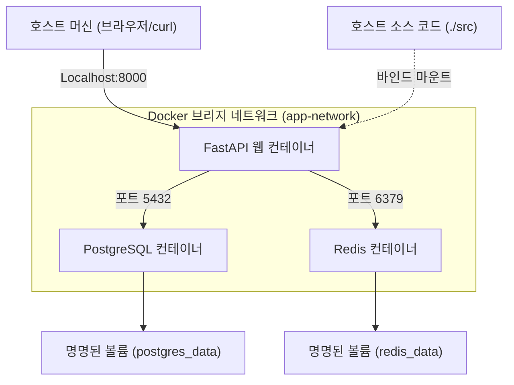
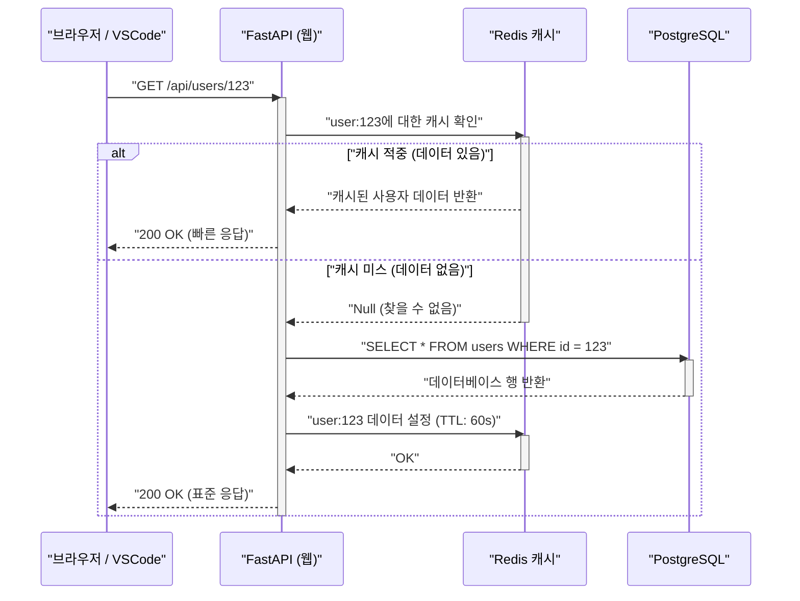

## 1. 머리말: "내 환경에서는 되는데"에서 벗어나기

소프트웨어 개발 현장에서 개발자 간의 환경 차이로 인해 발생하는 "내 환경에서는 되는데(It works on my machine)"라는 문제는 오랫동안 많은 프로젝트에서 시간을 낭비하게 만드는 요인이었습니다. OS의 차이, 설치된 언어의 버전, 라이브러리의 의존성, 전역으로 설치된 도구의 충돌 등 로컬 환경은 항상 '상태의 불확실성'에 노출되어 있습니다.

이러한 과제를 근본적으로 해결하는 것이 **Docker**를 비롯한 컨테이너 기술과 **Infrastructure as Code (IaC)** 패러다임입니다. 로컬 개발 환경을 컨테이너화함으로써 OS 수준에서의 격리를 실현하고, 코드베이스와 함께 환경 자체를 버전 관리하는 것이 가능해집니다.

본 문서에서는 Docker, Docker Compose, 그리고 VSCode DevContainers를 활용하여 **"누가, 언제, 어떤 머신에서 실행하더라도 한 치의 오차 없이 동일한 상태가 되는 재현 가능한 로컬 개발 환경"**을 구축하기 위한 단계와 그 이면에 있는 깊은 기술적 메커니즘에 대해 수리적 관점도 곁들여 철저하게 해설합니다.

---

## 2. Infrastructure as Code (IaC) 와 컨테이너 기술의 친화성

### IaC의 원칙과 로컬 환경에의 적용

Infrastructure as Code (IaC) 란 인프라스트럭처의 설정이나 프로비저닝을 수동 프로세스가 아닌 기계가 읽을 수 있는 정의 파일을 통해 관리하는 접근 방식입니다. IaC의 핵심이 되는 원칙에는 다음 요소들이 포함됩니다.

1. **선언적 접근 (Declarative Approach)**: '어떻게 상태를 변경할 것인가'가 아니라 '최종적으로 어떤 상태여야 하는가'를 정의합니다.
2. **멱등성 (Idempotency)**: 스크립트를 몇 번 실행하더라도 항상 동일한 결과(상태)가 보장됩니다.
3. **버전 관리 (Version Control)**: 인프라의 상태가 코드로서 Git 등의 VCS에 저장되어, 변경 이력 추적이나 피어 리뷰가 가능해집니다.

로컬 개발 환경에서 IaC를 실천한다는 것은 `Dockerfile`이나 `docker-compose.yml`, `devcontainer.json`을 사용하여 개발 환경의 '이상적인 모습'을 코드화하는 것을 의미합니다. 이를 통해 새로 팀에 합류한 멤버도 리포지토리를 클론하고 명령어 하나를 실행하는 것만으로 즉시 개발을 시작할 수 있는 온보딩 경험을 실현할 수 있습니다.

### 컨테이너 기술을 지탱하는 커널 기능

컨테이너 기술은 가상 머신(VM)과 같은 하이퍼바이저형 가상화와는 달리, 호스트 OS의 커널을 공유하면서 프로세스를 격리(아이솔레이션)하는 경량 가상화 기술입니다. 이를 실현하기 위해 주로 Linux 커널의 다음과 같은 기능이 이용됩니다.

- **Namespaces**: 프로세스마다 시스템 리소스(PID, 네트워크, 마운트 포인트, 사용자 등)의 독립적인 뷰를 제공합니다.
- **Cgroups (Control Groups)**: 프로세스가 사용할 수 있는 물리 리소스(CPU, 메모리, 디스크 I/O 등)의 제한과 할당을 수행합니다.
- **UnionFS (Union File System)**: 여러 디렉토리 트리(레이어)를 투명하게 겹쳐서 하나의 파일 시스템으로 보이게 하는 기술입니다. Docker의 이미지 레이어는 이 기술에 의존하고 있습니다.

리소스 제한의 수리 모델을 생각해 봅시다. 호스트 머신의 총 메모리 용량을 $M_{\text{total}}$로 하고, 호스트 상에서 동작하는 $n$개의 컨테이너 메모리 제한을 $m_i$라고 합니다. 시스템이 안정적으로 가동되기 위한 필요 조건은, 호스트 OS나 기타 프로세스가 소비하는 기본 메모리 $M_{\text{os}}$를 고려할 때 다음과 같은 부등식으로 나타낼 수 있습니다.

$$ \sum_{i=1}^{n} m_i \le M_{\text{total}} - M_{\text{os}} $$

Cgroups를 이용하여 컨테이너별로 $m_i$를 엄격하게 정의함으로써 특정 컨테이너가 메모리 누수를 일으켰을 때에도 OOM (Out Of Memory) Killer에 의해 다른 컨테이너나 호스트 시스템 전체가 다운되는 것을 방지할 수 있습니다.

---

## 3. 효율적인 Dockerfile 설계: 멀티 스테이지 빌드 마스터하기

재현 가능한 환경의 첫걸음은 애플리케이션의 실행 환경을 정의하는 `Dockerfile`의 설계입니다. 여기서는 Python (FastAPI) 을 예로 들어 **멀티 스테이지 빌드**를 활용한 안전하고 가벼운 Dockerfile의 모범 사례를 해설합니다.

멀티 스테이지 빌드는 하나의 `Dockerfile` 안에서 여러 개의 `FROM` 명령을 사용하여 빌드 환경(컴파일러나 개발 도구가 포함된 무거운 환경)과 실행 환경(필요한 결과물만 가지는 가벼운 환경)을 분리하는 기법입니다.

### 실전적인 Python FastAPI용 Dockerfile

아래 코드는 Poetry를 사용한 의존성 관리와 멀티 스테이지 빌드를 결합한 고도화된 `Dockerfile` 예제입니다.

```dockerfile
# ---------------------------------------------------------
# Stage 1: Builder (빌드 환경)
# ---------------------------------------------------------
FROM python:3.11-slim AS builder

# 필요한 환경변수 설정
ENV PYTHONUNBUFFERED=1 \
    PYTHONDONTWRITEBYTECODE=1 \
    POETRY_VERSION=1.6.1 \
    POETRY_HOME="/opt/poetry" \
    POETRY_VIRTUALENVS_IN_PROJECT=true \
    POETRY_NO_INTERACTION=1

# 의존 패키지 설치
RUN apt-get update && apt-get install -y --no-install-recommends \
    curl build-essential && \
    curl -sSL https://install.python-poetry.org | python3 - && \
    apt-get clean && rm -rf /var/lib/apt/lists/*

ENV PATH="$POETRY_HOME/bin:$PATH"

WORKDIR /app

# 의존성 파일 복사 및 설치
COPY pyproject.toml poetry.lock ./
RUN poetry install --no-root --only main

# ---------------------------------------------------------
# Stage 2: Runtime (실행 환경)
# ---------------------------------------------------------
FROM python:3.11-slim AS runtime

ENV PYTHONUNBUFFERED=1 \
    PYTHONDONTWRITEBYTECODE=1 \
    PATH="/app/.venv/bin:$PATH"

# 최소한의 비특권 사용자 생성
RUN groupadd -r appuser && useradd -r -g appuser appuser

WORKDIR /app

# 빌더로부터 가상 환경(의존성)만 복사
COPY --from=builder --chown=appuser:appuser /app/.venv /app/.venv

# 애플리케이션 코드 복사
COPY --chown=appuser:appuser ./src /app/src

# 비특권 사용자로 전환
USER appuser

# 컨테이너 시작 시 기본 명령어
ENTRYPOINT ["uvicorn", "src.main:app", "--host", "0.0.0.0", "--port", "8000"]
```

### 멀티 스테이지 빌드에 의한 이미지 크기의 수학적 평가

단일 스테이지에서 빌드했을 때의 이미지 크기를 $S_{\text{single}}$, 멀티 스테이지 빌드를 적용했을 때의 이미지 크기를 $S_{\text{multi}}$라고 합니다. 크기 감소율 $R$은 다음과 같이 계산됩니다.

$$ R = \left( 1 - \frac{S_{\text{multi}}}{S_{\text{single}}} \right) \times 100 \ (\%) $$

예를 들어 $S_{\text{single}}$에는 OS의 기본 이미지(약 110MB), 개발용 패키지(gcc 등 약 150MB), Poetry 본체(약 40MB), 프로젝트 의존 라이브러리(약 80MB), 소스 코드(약 5MB)가 포함되어 총 385MB가 되었다고 가정합시다.
반면 $S_{\text{multi}}$에서는 기본 이미지(110MB)에 의존 라이브러리(80MB)와 소스 코드(5MB)만 복사되므로 총 195MB가 됩니다.

$$ R = \left( 1 - \frac{195}{385} \right) \times 100 \approx 49.35\% $$

이처럼 멀티 스테이지 빌드를 도입함으로써 이미지 크기를 절반 정도로 줄일 수 있습니다. 이미지 크기 감소는 레지스트리로부터의 Pull 시간 단축, 디스크 용량 절약, 그리고 공격 표면(Attack Surface) 축소를 통한 보안 향상으로 직결됩니다.

---

## 4. Docker Compose를 통한 여러 컨테이너 오케스트레이션

최신 웹 애플리케이션 개발에서는 웹 서버, 데이터베이스, 캐시 서버 등 여러 구성 요소가 연동하는 마이크로서비스 아키텍처가 일반적입니다. 로컬 환경에서 이들을 일원화하여 관리하기 위해 `docker-compose.yml`을 사용합니다.

이번에는 "Web (FastAPI)", "Database (PostgreSQL)", "Cache (Redis)"의 3계층 구조 시스템을 로컬에 구축합니다.

### 아키텍처 다이어그램 (Mermaid)

다음 다이어그램은 로컬 머신에서의 각 컨테이너, 네트워크, 그리고 볼륨의 관계성을 나타낸 블록 다이어그램입니다.



### docker-compose.yml 의 구현 및 상세 해설

다음은 실전적인 환경 구축에 견딜 수 있는 견고한 `docker-compose.yml` 예제입니다.

```yaml
version: '3.8'

services:
  web:
    build:
      context: .
      target: runtime
    container_name: dev_web
    ports:
      - "8000:8000"
    volumes:
      - ./src:/app/src:ro  # 호스트의 코드를 읽기 전용으로 마운트(핫 리로드 용도)
    environment:
      - DATABASE_URL=postgresql://postgres:${POSTGRES_PASSWORD}@db:5432/${POSTGRES_DB}
      - REDIS_URL=redis://redis:6379/0
    env_file:
      - .env
    depends_on:
      db:
        condition: service_healthy
      redis:
        condition: service_started
    networks:
      - app-network
    command: ["uvicorn", "src.main:app", "--host", "0.0.0.0", "--port", "8000", "--reload"]

  db:
    image: postgres:15-alpine
    container_name: dev_db
    ports:
      - "5432:5432"
    environment:
      POSTGRES_USER: postgres
      POSTGRES_PASSWORD: ${POSTGRES_PASSWORD}
      POSTGRES_DB: ${POSTGRES_DB}
    volumes:
      - postgres_data:/var/lib/postgresql/data
    networks:
      - app-network
    healthcheck:
      test: ["CMD-SHELL", "pg_isready -U postgres -d ${POSTGRES_DB}"]
      interval: 5s
      timeout: 5s
      retries: 5

  redis:
    image: redis:7-alpine
    container_name: dev_redis
    ports:
      - "6379:6379"
    volumes:
      - redis_data:/data
    networks:
      - app-network
    command: ["redis-server", "--appendonly", "yes"]

volumes:
  postgres_data:
  redis_data:

networks:
  app-network:
    driver: bridge
```

### 볼륨 (Volumes) 과 데이터 영속화

컨테이너는 원칙적으로 '상태를 가지지 않는(스테이트리스)' 동시에 '단명(에페머럴)'하는 존재입니다. 컨테이너를 파기하면 내부 데이터도 함께 사라집니다. 데이터베이스의 데이터나 캐시를 유지하기 위해서는 호스트 머신의 파일 시스템 영역을 컨테이너에 마운트해야 합니다.

- **바인드 마운트 (Bind Mount)**: 위의 `web` 서비스에서의 `./src:/app/src:ro`가 이에 해당합니다. 호스트의 특정 디렉토리를 컨테이너 내부에 직접 매핑합니다. 로컬에서의 코드 편집을 즉각 컨테이너(핫 리로드)에 반영하기 위해 사용합니다. 보안 관점에서 `:ro` (Read-Only) 옵션을 부여하여 컨테이너 측에서 호스트의 소스 코드를 변경할 수 없게 하는 것이 모범 사례입니다.
- **명명된 볼륨 (Named Volume)**: `postgres_data`나 `redis_data`가 해당합니다. Docker가 내부적으로(`/var/lib/docker/volumes/` 등) 관리하는 영역으로 바인드 마운트보다 I/O 성능이 뛰어나며 OS 간의 파일 시스템 차이를 흡수해 줍니다. 데이터베이스의 영속화에는 반드시 이것을 사용합니다.

### 네트워크 (Networking) 와 서비스 디스커버리

Docker Compose는 기본적으로 프로젝트마다 고유한 브리지 네트워크를 생성합니다. 위의 `app-network`가 그것입니다.
동일한 네트워크에 속하는 컨테이너끼리는 IP 주소가 아니라 '서비스 이름(예: `db`, `redis`)'을 호스트명으로 사용하여 이름 확인(DNS 확인)을 할 수 있습니다.
예를 들어 Web 컨테이너에서는 `postgresql://postgres:password@db:5432/mydb`라는 URL로 데이터베이스에 접근할 수 있습니다. 이를 통해 로컬 환경이든 프로덕션 환경이든 환경 변수를 통해 접속처를 투명하게 전환할 수 있게 됩니다.

### 상태 확인(헬스 체크)과 실행 순서 제어

`depends_on` 지시어는 컨테이너의 시작 순서를 제어하지만, 단순히 `depends_on`만 지정하면 'DB 컨테이너가 시작된' 단계에서 Web 컨테이너가 시작되어 버립니다. 실제로는 DB의 초기화 프로세스(PostgreSQL의 프로세스 시작이나 테이블 준비)가 완료되기까지 몇 초가 걸리기 때문에 Web 컨테이너에서 DB로의 접속이 오류가 나는 경우가 있습니다.
이를 방지하기 위해 `healthcheck`를 정의하고 `condition: service_healthy`를 지정하여 'DB가 연결 요청을 받아들일 수 있는 상태가 되었음'을 확인한 후에 Web 컨테이너를 시작하게 할 수 있습니다.

---

## 5. 환경 변수 관리와 보안 (.env)

데이터베이스의 비밀번호나 API 키 등 민감한 정보를 `docker-compose.yml`에 하드코딩하는 것은 반드시 피해야 할 안티패턴입니다. 대신 환경 변수 파일 `.env`를 사용하여 이 값들을 주입합니다.

프로젝트 루트에 `.env` 파일을 생성합니다.

```ini
# .env 파일 (Git 관리 대상에서 제외하기 위해 .gitignore에 추가할 것)
POSTGRES_PASSWORD=supersecretpassword
POSTGRES_DB=devdb
API_SECRET_KEY=dev_secret_key_12345
```

Docker Compose는 기본적으로 실행 디렉토리에 있는 `.env` 파일을 읽어 YAML 파일 안의 `${VAR_NAME}`이라는 자리표시자를 전개합니다. 이 방식을 통해 로컬, 스테이징, 프로덕션 등 각 환경마다 다른 설정 값을 인프라 코드의 변경 없이 안전하게 관리할 수 있게 됩니다.

---

## 6. VSCode DevContainers에 의한 궁극의 개발 경험

여기까지 Docker를 사용한 견고한 백엔드 환경을 구축했습니다. 하지만 여기서 한 걸음 더 나아갈 수 있습니다. **VSCode DevContainers (Remote - Containers)** 기능을 사용하면 에디터(VSCode) 자체의 백엔드를 컨테이너 내부에서 실행하는 것이 가능해집니다.

이를 통해 로컬 머신에는 Python이나 Node.js조차 설치할 필요가 없어지며, Linter(flake8/eslint)나 포매터(black/prettier), IDE의 확장 기능에 이르기까지 모든 것을 코드베이스 내에 정의하여 팀 전원과 공유할 수 있습니다.

### devcontainer.json 설정

프로젝트 루트에 `.devcontainer` 디렉토리를 생성하고 그 안에 구성 파일을 배치합니다.

`.devcontainer/devcontainer.json`:
```json
{
  "name": "Python FastAPI Dev Environment",
  "dockerComposeFile": ["../docker-compose.yml"],
  "service": "web",
  "workspaceFolder": "/app",
  "customizations": {
    "vscode": {
      "settings": {
        "python.defaultInterpreterPath": "/app/.venv/bin/python",
        "python.formatting.provider": "black",
        "editor.formatOnSave": true
      },
      "extensions": [
        "ms-python.python",
        "ms-python.vscode-pylance",
        "ms-python.black-formatter",
        "tamasfe.even-better-toml"
      ]
    }
  },
  "forwardPorts": [8000, 5432, 6379],
  "remoteUser": "appuser",
  "postCreateCommand": "poetry install"
}
```

이 파일을 리포지토리에 포함시켜 두면 VSCode에서 프로젝트를 여는 순간 "Reopen in Container"라는 프롬프트가 표시되고, 클릭하는 것만으로 필요한 모든 컨테이너가 켜지고 확장 기능이 설치되어 즉시 코딩을 시작할 수 있는 상태가 됩니다. 그야말로 마법 같은 경험입니다.

---

## 7. 요청 처리 시퀀스와 성능 모델링

구축한 로컬 개발 환경에서의 웹 애플리케이션 요청 처리 라이프사이클을 시퀀스 다이어그램으로 확인하고, 그 성능의 수리 모델을 고찰합니다.

### 시퀀스 다이어그램 (요청 흐름)



### 처리 지연(레이턴시) 수리 모델

위 시스템에서의 평균 요청 처리 시간 $T_{\text{total}}$을 수리적으로 모델화합니다.
각 처리의 레이턴시를 다음과 같이 정의합니다.
- $T_{\text{net}}$: 클라이언트와 웹 컨테이너 간의 네트워크 레이턴시
- $T_{\text{app}}$: 애플리케이션 측의 순수한 처리 시간 (직렬화 등)
- $T_{\text{cache}}$: Redis로부터의 읽기/쓰기에 걸리는 시간
- $T_{\text{db}}$: PostgreSQL로의 쿼리 실행에 걸리는 시간
- $p_{\text{miss}}$: 캐시 미스 비율 ($0 \le p_{\text{miss}} \le 1$)

이 때, 평균적인 응답 시간은 다음의 기댓값 계산식으로 표현됩니다.

$$ T_{\text{total}} = T_{\text{net}} + T_{\text{app}} + T_{\text{cache}} + p_{\text{miss}} \times (T_{\text{db}} + T_{\text{cache\_write}}) $$

로컬 개발 환경(Docker 내부)에서는 $T_{\text{net}}$은 거의 0에 가까워지지만, 주목해야 할 것은 **바인드 마운트 시의 I/O 성능**입니다. 특히 Windows/macOS 상에서 Docker Desktop을 사용하는 경우, 호스트 OS와 VM(컨테이너) 간의 파일 공유 오버헤드로 인해 $T_{\text{app}}$(코드 읽어들이는 시간 등)이 비대해지는 경향이 있습니다. 이 병목 현상을 해소하기 위해 앞서 언급한 DevContainers를 이용하여 소스 코드 전체를 명명된 볼륨 내에 배치하거나, WSL2 (Windows Subsystem for Linux 2) 환경 네이티브에서 Docker 엔진을 동작시키는 아키텍처가 강력히 권장됩니다.

---

## 8. Docker 빌드 성능 최적화: 레이어 캐시 전략

Dockerfile을 작성할 때 '레이어 캐시'의 원리를 이해하고 있는지 여부에 따라 빌드 시간은 극적으로 달라집니다.
Docker는 Dockerfile의 각 명령(`FROM`, `RUN`, `COPY` 등)마다 파일 시스템의 차분(레이어)을 생성하고 캐시로 유지합니다. 재빌드 시에는 변경이 없는 레이어의 캐시가 재사용됩니다.

중요한 원칙은 **"변경 빈도가 낮은 것부터 순서대로 작성한다"**는 것입니다.

소스 코드 변경이 빌드 시간에 미치는 영향의 모델화를 생각해 봅시다. 총 빌드 시간을 $T_{\text{build}}$, 각 단계의 실행 시간을 $T_{\text{layer}_i}$, 캐시 적중 여부를 불리언 값 $c_i \in \{0, 1\}$ (캐시 적중 시 1)이라고 합니다.

$$ T_{\text{build}} = T_{\text{init}} + \sum_{i=1}^{n} (1 - c_i) \times T_{\text{layer}_i} $$

한 번 레이어 $k$에서 캐시 미스($c_k = 0$)가 발생하면 그 이후의 모든 레이어 $j > k$에서 캐시가 무효화($c_j = 0$)됩니다.

```dockerfile
# 나쁜 예 (소스 코드를 먼저 복사하고 있음)
COPY ./src /app/src
COPY pyproject.toml poetry.lock ./
RUN poetry install
```
위의 경우 코드를 한 줄만 수정해도 첫 번째 `COPY`가 캐시 미스가 되어 시간이 오래 걸리는 `RUN poetry install`이 매번 실행되고 맙니다.

```dockerfile
# 좋은 예 (의존성 해결을 먼저 수행)
COPY pyproject.toml poetry.lock ./
RUN poetry install
COPY ./src /app/src
```
이렇게 작성하면 소스 코드를 변경해도 `poetry install`의 레이어 캐시($c_i = 1$)가 작동하므로 빌드 시간은 수 분에서 수 초로 극적으로 단축됩니다.

---

## 9. 트러블슈팅과 팁

로컬 환경 운용 시 자주 마주치는 문제와 해결책을 꼽아보았습니다.

1. **포트 충돌 오류**
   `Bind for 0.0.0.0:8000 failed: port is already allocated`와 같은 오류가 난 경우, 로컬 머신의 다른 프로세스가 그 포트를 사용하고 있는 것입니다. 호스트 측의 포트 번호를 `ports: - "8080:8000"`과 같이 변경하여 피할 수 있습니다.

2. **디스크 용량 고갈**
   장기간 Docker를 사용하다 보면 사용하지 않는 이미지나 볼륨(Dangling Images / Volumes)이 축적되어 수십 GB의 디스크 영역을 압박하는 경우가 있습니다. 정기적으로 다음 명령어를 통해 시스템을 정리하는 것을 권장합니다.
   ```bash
   docker system prune -a --volumes
   ```

3. **파일 권한 문제**
   Linux 환경에서 바인드 마운트를 사용할 경우, 컨테이너 내부에서 생성된 파일의 소유자가 `root`가 되어 호스트 측에서 편집할 수 없게 되는 경우가 있습니다. Dockerfile 내에서 비특권 사용자를 생성하고, 호스트 OS 자신의 UID/GID (예: 1000:1000)와 일치시킴으로써 이 문제를 해결할 수 있습니다.

---

## 10. 맺음말: 재현 가능성이 가져다주는 개발 속도 향상

Docker, Docker Compose, 그리고 VSCode DevContainers를 결합함으로써 "누가 환경을 띄워도 완전히 같은 상태가 되는" 견고한 로컬 개발 환경이 실현됩니다.

IaC의 패러다임을 로컬 환경에 도입하는 것은 단순히 초기 설정 시간을 단축하는 것에 그치지 않습니다. 인프라 설정 변경에 대한 불안을 해소하고 새로운 기술 스택의 실험을 용이하게 하며 CI/CD 파이프라인으로의 원활한 전환을 가능하게 하는 등, 개발 사이클 전체의 속도와 품질을 비약적으로 향상시킵니다.

본 문서에서 해설한 멀티 스테이지 빌드에 의한 이미지 크기 최적화나, 상태 확인을 사용한 의존성 제어, 레이어 캐시를 의식한 Dockerfile 작성 등의 모범 사례를 활용하여, 꼭 여러분의 프로젝트에도 최고의 개발 경험(DX: Developer Experience)을 도입해 보시기 바랍니다.
