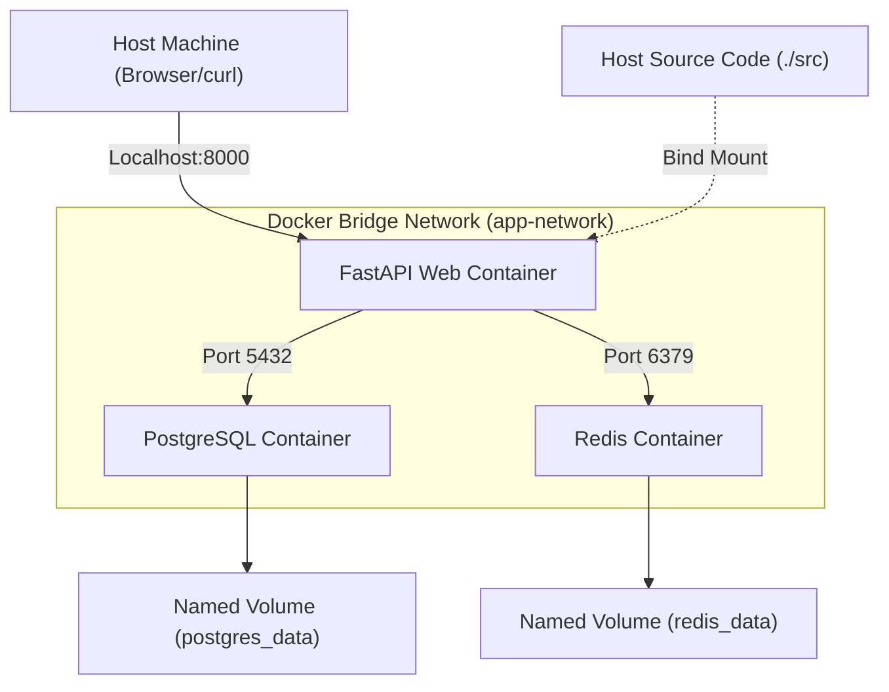
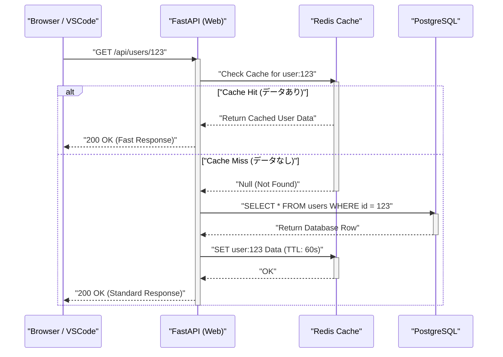

## 1. はじめに：「私の環境では動くのに」からの脱却

ソフトウェア開発の現場において、開発者間で環境が異なることに起因する「私の環境では動くのに（It works on my machine）」という問題は、長きにわたり多くのプロジェクトで時間を浪費させる要因となってきました。OSの違い、インストールされている言語のバージョン、ライブラリの依存関係、グローバルにインストールされたツールの競合など、ローカル環境は常に「状態の不確実性」に晒されています。

こうした課題を根本から解決するのが **Docker** をはじめとするコンテナ技術と、**Infrastructure as Code (IaC)** のパラダイムです。ローカル開発環境をコンテナ化することで、OSレベルでの分離を実現し、コードベースと共に環境そのものをバージョン管理することが可能になります。

本記事では、Docker、Docker Compose、そしてVSCode DevContainersを駆使し、**「誰が、いつ、どのマシンで立ち上げても、寸分違わず同じ状態になる再現可能なローカル開発環境」**を構築するための手順と、その背後にある深い技術的メカニズムについて、数理的な視点も交えながら徹底的に解説します。

---

## 2. Infrastructure as Code (IaC) とコンテナ技術の親和性

### IaCの原則とローカル環境への適用

Infrastructure as Code (IaC) とは、インフラストラクチャの設定やプロビジョニングを、手動のプロセスではなく、機械可読な定義ファイルを通じて管理するアプローチです。IaCのコアとなる原則には以下の要素が含まれます。

1. **宣言的アプローチ (Declarative Approach)**: 「どのように状態を変更するか」ではなく「最終的にどのような状態であるべきか」を定義します。
2. **冪等性 (Idempotency)**: 何度スクリプトを実行しても、常に同じ結果（状態）が保証されます。
3. **バージョン管理 (Version Control)**: インフラの状態がコードとしてGitなどのVCSに保存され、変更履歴の追跡やピアレビューが可能になります。

ローカル開発環境においてIaCを実践するということは、`Dockerfile` や `docker-compose.yml`、`devcontainer.json` を使って開発環境の「あるべき姿」をコード化することを意味します。これにより、新しくチームに加わったメンバーも、リポジトリをクローンしてコマンドを1つ叩くだけで、即座に開発をスタートできるオンボーディング体験を実現できます。

### コンテナ技術を支えるカーネル機能

コンテナ技術は、仮想マシン（VM）のようなハイパーバイザ型の仮想化とは異なり、ホストOSのカーネルを共有しながらプロセスを隔離（アイソレーション）する軽量な仮想化技術です。これを実現するために、主にLinuxカーネルの以下の機能が利用されています。

- **Namespaces**: プロセスごとにシステムリソース（PID、ネットワーク、マウントポイント、ユーザーなど）の独立したビューを提供します。
- **Cgroups (Control Groups)**: プロセスが使用できる物理リソース（CPU、メモリ、ディスクI/Oなど）の制限と割り当てを行います。
- **UnionFS (Union File System)**: 複数のディレクトリツリー（レイヤー）を透過的に重ね合わせて、1つのファイルシステムとして見せる技術です。Dockerのイメージレイヤーはこの技術に依存しています。

リソース制限の数理モデルを考えてみましょう。ホストマシンの総メモリ容量を $M_{\text{total}}$ とし、ホスト上で動作する $n$ 個のコンテナのメモリ制限を $m_i$ とします。システムが安定して稼働するための必要条件は、ホストOSやその他のプロセスが消費するベースメモリ $M_{\text{os}}$ を考慮すると、次のような不等式で表すことができます。

$$ \sum_{i=1}^{n} m_i \le M_{\text{total}} - M_{\text{os}} $$

Cgroupsを利用してコンテナごとに $m_i$ を厳格に定義することで、特定のコンテナがメモリリークを起こした際にも、OOM (Out Of Memory) Killer によって他のコンテナやホストシステム全体がダウンするのを防ぐことができます。

---

## 3. 効率的な Dockerfile の設計：マルチステージビルドを極める

再現可能な環境の第一歩は、アプリケーションの実行環境を定義する `Dockerfile` の設計です。ここでは、Python（FastAPI）を例に、**マルチステージビルド** を活用したセキュアで軽量な Dockerfile のベストプラクティスを解説します。

マルチステージビルドは、1つの `Dockerfile` の中で複数の `FROM` 命令を使用し、ビルド環境（コンパイラや開発ツールが含まれる重い環境）と、実行環境（必要な成果物だけを持つ軽量な環境）を分離する手法です。

### 実践的な Python FastAPI 用 Dockerfile

以下のコードは、Poetryを使った依存関係管理と、マルチステージビルドを組み合わせた高度な `Dockerfile` の例です。

```dockerfile
# ---------------------------------------------------------
# Stage 1: Builder (ビルド環境)
# ---------------------------------------------------------
FROM python:3.11-slim AS builder

# 必要な環境変数の設定
ENV PYTHONUNBUFFERED=1 \
    PYTHONDONTWRITEBYTECODE=1 \
    POETRY_VERSION=1.6.1 \
    POETRY_HOME="/opt/poetry" \
    POETRY_VIRTUALENVS_IN_PROJECT=true \
    POETRY_NO_INTERACTION=1

# 依存パッケージのインストール
RUN apt-get update && apt-get install -y --no-install-recommends \
    curl build-essential && \
    curl -sSL https://install.python-poetry.org | python3 - && \
    apt-get clean && rm -rf /var/lib/apt/lists/*

ENV PATH="$POETRY_HOME/bin:$PATH"

WORKDIR /app

# 依存関係ファイルのコピーとインストール
COPY pyproject.toml poetry.lock ./
RUN poetry install --no-root --only main

# ---------------------------------------------------------
# Stage 2: Runtime (実行環境)
# ---------------------------------------------------------
FROM python:3.11-slim AS runtime

ENV PYTHONUNBUFFERED=1 \
    PYTHONDONTWRITEBYTECODE=1 \
    PATH="/app/.venv/bin:$PATH"

# 最小限の非特権ユーザーを作成
RUN groupadd -r appuser && useradd -r -g appuser appuser

WORKDIR /app

# ビルダーから仮想環境（依存関係）のみをコピー
COPY --from=builder --chown=appuser:appuser /app/.venv /app/.venv

# アプリケーションコードのコピー
COPY --chown=appuser:appuser ./src /app/src

# 非特権ユーザーへの切り替え
USER appuser

# コンテナ起動時のデフォルトコマンド
ENTRYPOINT ["uvicorn", "src.main:app", "--host", "0.0.0.0", "--port", "8000"]
```

### マルチステージビルドによるイメージサイズの数学的評価

単一ステージでビルドした場合のイメージサイズを $S_{\text{single}}$、マルチステージビルドを適用した場合のイメージサイズを $S_{\text{multi}}$ とします。サイズ削減率 $R$ は次のように計算されます。

$$ R = \left( 1 - \frac{S_{\text{multi}}}{S_{\text{single}}} \right) \times 100 \ (\%) $$

例えば、$S_{\text{single}}$ にはOSのベースイメージ（約110MB）、開発用パッケージ（gccなど約150MB）、Poetry本体（約40MB）、プロジェクトの依存ライブラリ（約80MB）、ソースコード（約5MB）が含まれ、合計で385MBになったとします。
一方、$S_{\text{multi}}$ では、ベースイメージ（110MB）に依存ライブラリ（80MB）とソースコード（5MB）のみがコピーされるため、合計195MBとなります。

$$ R = \left( 1 - \frac{195}{385} \right) \times 100 \approx 49.35\% $$

このように、マルチステージビルドを導入することで、イメージサイズを約半分に削減できます。イメージサイズの削減は、レジストリからのPull時間の短縮、ディスク容量の節約、そして攻撃対象領域（Attack Surface）の縮小によるセキュリティ向上に直結します。

---

## 4. Docker Composeによる複数コンテナのオーケストレーション

最新のWebアプリケーション開発では、Webサーバー、データベース、キャッシュサーバーなど、複数のコンポーネントが連携するマイクロサービスアーキテクチャが一般的です。ローカル環境でこれらを一元管理するために `docker-compose.yml` を使用します。

今回は、「Web (FastAPI)」「Database (PostgreSQL)」「Cache (Redis)」の3層構造のシステムをローカルに構築します。

### アーキテクチャ図（Mermaid）

以下の図は、ローカルマシンにおける各コンテナ、ネットワーク、そしてボリュームの関係性を表したブロックダイアグラムです。



### docker-compose.yml の実装と詳細解説

以下に、実践的な環境構築に耐えうる堅牢な `docker-compose.yml` の例を示します。

```yaml
version: '3.8'

services:
  web:
    build:
      context: .
      target: runtime
    container_name: dev_web
    ports:
      - "8000:8000"
    volumes:
      - ./src:/app/src:ro  # ホストのコードを読み取り専用でマウント（ホットリロード用）
    environment:
      - DATABASE_URL=postgresql://postgres:${POSTGRES_PASSWORD}@db:5432/${POSTGRES_DB}
      - REDIS_URL=redis://redis:6379/0
    env_file:
      - .env
    depends_on:
      db:
        condition: service_healthy
      redis:
        condition: service_started
    networks:
      - app-network
    command: ["uvicorn", "src.main:app", "--host", "0.0.0.0", "--port", "8000", "--reload"]

  db:
    image: postgres:15-alpine
    container_name: dev_db
    ports:
      - "5432:5432"
    environment:
      POSTGRES_USER: postgres
      POSTGRES_PASSWORD: ${POSTGRES_PASSWORD}
      POSTGRES_DB: ${POSTGRES_DB}
    volumes:
      - postgres_data:/var/lib/postgresql/data
    networks:
      - app-network
    healthcheck:
      test: ["CMD-SHELL", "pg_isready -U postgres -d ${POSTGRES_DB}"]
      interval: 5s
      timeout: 5s
      retries: 5

  redis:
    image: redis:7-alpine
    container_name: dev_redis
    ports:
      - "6379:6379"
    volumes:
      - redis_data:/data
    networks:
      - app-network
    command: ["redis-server", "--appendonly", "yes"]

volumes:
  postgres_data:
  redis_data:

networks:
  app-network:
    driver: bridge
```

### ボリューム (Volumes) とデータの永続化

コンテナは原則として「ステートレス（状態を持たない）」かつ「エフェメラル（短命）」な存在です。コンテナを破棄すると、内部のデータも消失します。データベースのデータやキャッシュを保持するためには、ホストマシンのファイルシステム領域をコンテナにマウントする必要があります。

- **Bind Mount (バインドマウント)**: 上記の `web` サービスにおける `./src:/app/src:ro` がこれに該当します。ホストの特定ディレクトリをコンテナ内に直接マッピングします。ローカルでのコード編集を即座にコンテナ（ホットリロード）に反映させるために使用します。セキュリティ上の観点から `:ro` (Read-Only) オプションを付与し、コンテナ側からホストのソースコードを改変できないようにすることがベストプラクティスです。
- **Named Volume (名前付きボリューム)**: `postgres_data` や `redis_data` が該当します。Dockerが内部的（`/var/lib/docker/volumes/` など）に管理する領域で、バインドマウントよりもI/Oパフォーマンスに優れ、OS間のファイルシステムの差異を吸収してくれます。データベースの永続化には必ずこちらを使用します。

### ネットワーク (Networking) とサービスディスカバリ

Docker Composeはデフォルトでプロジェクトごとに独自のブリッジネットワークを作成します。上記の `app-network` です。
同じネットワークに属するコンテナ同士は、IPアドレスではなく「サービス名（例：`db`, `redis`）」をホスト名として名前解決（DNS解決）できます。
例えば、Webコンテナからは `postgresql://postgres:password@db:5432/mydb` というURLでデータベースにアクセス可能です。これにより、ローカル環境でも本番環境でも、環境変数を通じて接続先を透過的に切り替えることができるようになります。

### ヘルスチェックと起動順序の制御

`depends_on` ディレクティブはコンテナの起動順序を制御しますが、単に `depends_on` を指定しただけでは「DBコンテナが起動した」段階でWebコンテナが起動してしまいます。実際にはDBの初期化プロセス（PostgreSQLのプロセス起動やテーブルの準備）が完了するまで数秒かかるため、WebコンテナからのDB接続がエラーになることがあります。
これを防ぐため、`healthcheck` を定義し、`condition: service_healthy` を指定することで、「DBが接続リクエストを受け付けられる状態になったこと」を確認してからWebコンテナを起動させることが可能です。

---

## 5. 環境変数の管理とセキュリティ (.env)

データベースのパスワードやAPIキーなどの機密情報を `docker-compose.yml` にハードコーディングすることは、絶対に避けるべきアンチパターンです。代わりに、環境変数ファイル `.env` を使用してこれらの値を注入します。

プロジェクトルートに `.env` ファイルを作成します。

```ini
# .env ファイル (Gitの管理対象外にするため .gitignore に追加すること)
POSTGRES_PASSWORD=supersecretpassword
POSTGRES_DB=devdb
API_SECRET_KEY=dev_secret_key_12345
```

Docker Compose はデフォルトで実行ディレクトリにある `.env` ファイルを読み込み、YAMLファイル内の `${VAR_NAME}` というプレースホルダーを展開します。この手法により、ローカル、ステージング、本番といった環境ごとに異なる設定値を、インフラコードを変更することなく安全に管理することが可能になります。

---

## 6. VSCode DevContainers による究極の開発体験

ここまでで、Dockerを使った堅牢なバックエンド環境が構築できました。しかし、もう一歩踏み込むことができます。**VSCode DevContainers (Remote - Containers)** 機能を使用すると、エディタ（VSCode）自体のバックエンドをコンテナ内部で実行することが可能になります。

これにより、ローカルマシンにはPythonやNode.jsすらインストールする必要がなくなり、Linter（flake8/eslint）やフォーマッター（black/prettier）、IDEの拡張機能に至るまで、すべてをコードベース内に定義してチーム全員で共有できます。

### devcontainer.json の設定

プロジェクトルートに `.devcontainer` ディレクトリを作成し、その中に構成ファイルを配置します。

`.devcontainer/devcontainer.json`:
```json
{
  "name": "Python FastAPI Dev Environment",
  "dockerComposeFile": ["../docker-compose.yml"],
  "service": "web",
  "workspaceFolder": "/app",
  "customizations": {
    "vscode": {
      "settings": {
        "python.defaultInterpreterPath": "/app/.venv/bin/python",
        "python.formatting.provider": "black",
        "editor.formatOnSave": true
      },
      "extensions": [
        "ms-python.python",
        "ms-python.vscode-pylance",
        "ms-python.black-formatter",
        "tamasfe.even-better-toml"
      ]
    }
  },
  "forwardPorts": [8000, 5432, 6379],
  "remoteUser": "appuser",
  "postCreateCommand": "poetry install"
}
```

このファイルをリポジトリに含めておくことで、VSCodeでプロジェクトを開いた瞬間に「Reopen in Container」というプロンプトが表示され、クリックするだけで必要なすべてのコンテナが立ち上がり、拡張機能がインストールされ、即座にコーディングを開始できる状態になります。まさに魔法のような体験です。

---

## 7. リクエスト処理のシーケンスとパフォーマンスモデリング

構築したローカル開発環境における、Webアプリケーションのリクエスト処理のライフサイクルをシーケンス図で確認し、そのパフォーマンスの数理モデルを考察します。

### シーケンス図（リクエストフロー）



### 処理遅延（レイテンシ）の数理モデル

上記システムにおける平均リクエスト処理時間 $T_{\text{total}}$ を数理的にモデル化します。
各処理のレイテンシを以下のように定義します。
- $T_{\text{net}}$: クライアントとWebコンテナ間のネットワークレイテンシ
- $T_{\text{app}}$: アプリケーション側の純粋な処理時間（シリアライズ等）
- $T_{\text{cache}}$: Redisからの読み書きにかかる時間
- $T_{\text{db}}$: PostgreSQLへのクエリ実行にかかる時間
- $p_{\text{miss}}$: キャッシュミス率（$0 \le p_{\text{miss}} \le 1$）

このとき、平均的なレスポンスタイムは以下の期待値計算式で表されます。

$$ T_{\text{total}} = T_{\text{net}} + T_{\text{app}} + T_{\text{cache}} + p_{\text{miss}} \times (T_{\text{db}} + T_{\text{cache\_write}}) $$

ローカル開発環境（Docker内）では、$T_{\text{net}}$ はほぼ 0 に近くなりますが、注目すべきは**バインドマウント時のI/Oパフォーマンス**です。特にWindows/macOS上でDocker Desktopを使用している場合、ホストOSとVM（コンテナ）間のファイル共有オーバーヘッドにより、$T_{\text{app}}$（コードの読み込み時間等）が肥大化する傾向があります。このボトルネックを解消するために、前述の DevContainers を利用してソースコード全体を名前付きボリューム内に配置するか、WSL2（Windows Subsystem for Linux 2）環境ネイティブでDockerエンジンを動作させるアーキテクチャが強く推奨されます。

---

## 8. Dockerビルドのパフォーマンス最適化：レイヤーキャッシュ戦略

Dockerfileを記述する際、「レイヤーキャッシュ」の仕組みを理解しているかどうかで、ビルド時間は劇的に変化します。
Dockerは、Dockerfileの各命令（`FROM`, `RUN`, `COPY` など）ごとにファイルシステムの差分（レイヤー）を作成し、キャッシュとして保持します。再ビルド時には、変更がないレイヤーのキャッシュが再利用されます。

重要な原則は、**「変更頻度の低いものから順番に記述する」**ことです。

ソースコードの変更がビルド時間に与える影響のモデル化を考えます。総ビルド時間を $T_{\text{build}}$、各ステップの実行時間を $T_{\text{layer}_i}$、キャッシュヒットの有無をブール値 $c_i \in \{0, 1\}$ （キャッシュヒット時に 1）とします。

$$ T_{\text{build}} = T_{\text{init}} + \sum_{i=1}^{n} (1 - c_i) \times T_{\text{layer}_i} $$

一度レイヤー $k$ でキャッシュミス（$c_k = 0$）が発生すると、それ以降のすべてのレイヤー $j > k$ においてキャッシュが無効化（$c_j = 0$）されます。

```dockerfile
# 悪い例 (ソースコードを先にコピーしている)
COPY ./src /app/src
COPY pyproject.toml poetry.lock ./
RUN poetry install
```
上記の場合、コードを一行修正しただけで最初の `COPY` がキャッシュミスとなり、時間のかかる `RUN poetry install` が毎回実行されてしまいます。

```dockerfile
# 良い例 (依存関係の解決を先に行う)
COPY pyproject.toml poetry.lock ./
RUN poetry install
COPY ./src /app/src
```
このように記述すれば、ソースコードを変更しても `poetry install` のレイヤーキャッシュ ($c_i = 1$) が効くため、ビルド時間は数分から数秒へと劇的に短縮されます。

---

## 9. トラブルシューティングとTips

ローカル環境運用時によく遭遇する問題と解決策を挙げます。

1. **ポート競合エラー**
   `Bind for 0.0.0.0:8000 failed: port is already allocated` のようなエラーが出た場合、ローカルマシン上で別のプロセスがそのポートを使用しています。ホスト側のポート番号を `ports: - "8080:8000"` のように変更することで回避できます。

2. **ディスク容量の枯渇**
   長期間Dockerを使用していると、使われていないイメージやボリューム（Dangling Images / Volumes）が蓄積され、数十GBのディスク領域を圧迫することがあります。定期的に以下のコマンドでシステムをクリーンアップすることが推奨されます。
   ```bash
   docker system prune -a --volumes
   ```

3. **ファイルのパーミッション問題**
   Linux環境でバインドマウントを使用する場合、コンテナ内で作成されたファイルの所有者が `root` になり、ホスト側で編集できなくなることがあります。Dockerfile内で非特権ユーザーを作成し、ホストOSの自身のUID/GID（例：1000:1000）と一致させることでこの問題を解決できます。

---

## 10. おわりに：再現可能性がもたらす開発速度の向上

Docker、Docker Compose、そしてVSCode DevContainersを組み合わせることで、「誰が環境を立ち上げても完全に同じ状態になる」堅牢なローカル開発環境が実現します。

IaCのパラダイムをローカル環境に持ち込むことは、単に最初のセットアップ時間を短縮するだけではありません。インフラストラクチャの設定変更に対する不安を取り除き、新しい技術スタックの実験を容易にし、CI/CDパイプラインへのスムーズな移行を可能にするなど、開発サイクル全体の速度と品質を飛躍的に向上させます。

本記事で解説したマルチステージビルドによるイメージサイズの最適化や、ヘルスチェックを用いた依存関係の制御、レイヤーキャッシュを意識したDockerfileの記述などのベストプラクティスを活用し、ぜひご自身のプロジェクトにも最高の開発体験（DX: Developer Experience）を導入してみてください。
