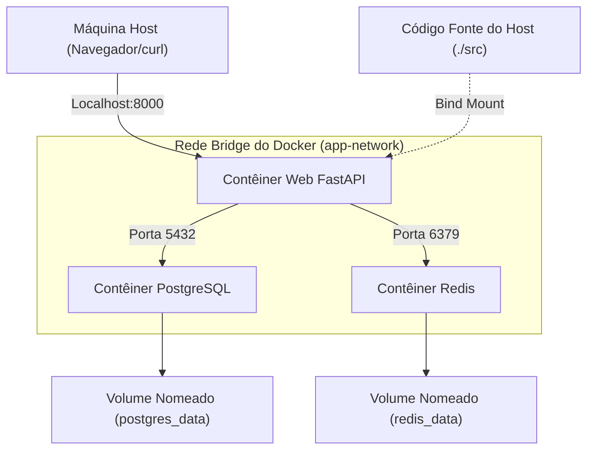
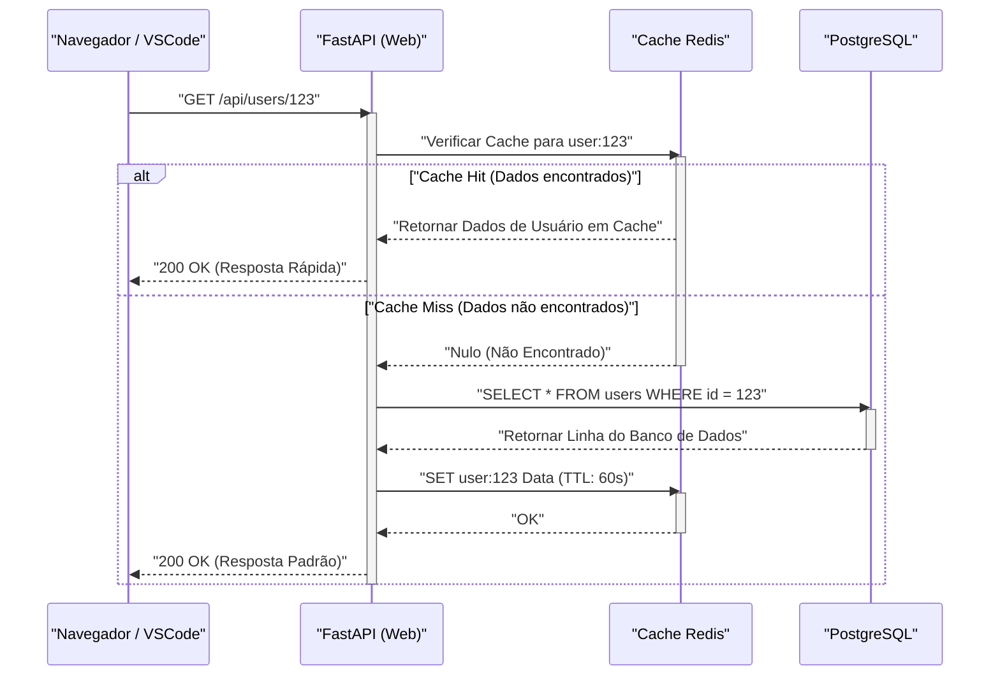

## 1. Introdução: Rompendo com o "Na minha máquina funciona"

No ambiente de desenvolvimento de software, o problema de "Na minha máquina funciona" (It works on my machine), causado por diferenças de ambiente entre os desenvolvedores, tem sido um fator de desperdício de tempo em muitos projetos por um longo período. Diferenças de sistema operacional, versões de linguagens instaladas, dependências de bibliotecas e conflitos de ferramentas instaladas globalmente fazem com que o ambiente local esteja sempre exposto à "incerteza de estado".

O que resolve fundamentalmente esses desafios são as tecnologias de contêineres, como o **Docker**, e o paradigma de **Infrastructure as Code (IaC)**. Ao conteinerizar o ambiente de desenvolvimento local, é possível alcançar isolamento em nível de SO e gerenciar a versão do ambiente em si junto com a base de código.

Neste artigo, utilizando Docker, Docker Compose e VSCode DevContainers, explicaremos de forma minuciosa os passos para construir um **"ambiente de desenvolvimento local reprodutível em que o estado será exatamente o mesmo, não importando quem, quando ou em qual máquina ele for iniciado"**, juntamente com os profundos mecanismos técnicos por trás disso, incluindo perspectivas matemáticas.

---

## 2. A Afinidade entre Infrastructure as Code (IaC) e a Tecnologia de Contêineres

### Princípios do IaC e sua Aplicação ao Ambiente Local

Infrastructure as Code (IaC) é a abordagem de gerenciar a configuração e o provisionamento da infraestrutura através de arquivos de definição legíveis por máquina, em vez de processos manuais. Os princípios centrais do IaC incluem os seguintes elementos:

1. **Abordagem Declarativa (Declarative Approach)**: Define "como o estado final deve ser" em vez de "como alterar o estado".
2. **Idempotência (Idempotency)**: Não importa quantas vezes o script seja executado, o mesmo resultado (estado) é sempre garantido.
3. **Controle de Versão (Version Control)**: O estado da infraestrutura é salvo como código em um VCS, como o Git, permitindo o rastreamento do histórico de alterações e a revisão por pares.

Praticar IaC no ambiente de desenvolvimento local significa codificar o "estado ideal" do ambiente de desenvolvimento usando `Dockerfile`, `docker-compose.yml` e `devcontainer.json`. Isso proporciona uma experiência de integração (onboarding) na qual os novos membros da equipe podem clonar o repositório e executar apenas um comando para começar a desenvolver imediatamente.

### Recursos do Kernel que Suportam a Tecnologia de Contêineres

A tecnologia de contêineres, diferente da virtualização baseada em hypervisor como as máquinas virtuais (VMs), é uma tecnologia de virtualização leve que isola os processos enquanto compartilha o kernel do SO hospedeiro. Para realizar isso, os seguintes recursos do kernel do Linux são usados principalmente:

- **Namespaces**: Fornece visualizações independentes dos recursos do sistema (PID, rede, pontos de montagem, usuários, etc.) para cada processo.
- **Cgroups (Control Groups)**: Limita e aloca os recursos físicos (CPU, memória, E/S de disco, etc.) que um processo pode usar.
- **UnionFS (Union File System)**: Uma tecnologia que sobrepõe transparentemente várias árvores de diretórios (camadas) e as apresenta como um único sistema de arquivos. As camadas de imagem do Docker dependem dessa tecnologia.

Vamos considerar um modelo matemático para a restrição de recursos. Seja $M_{\text{total}}$ a capacidade total de memória da máquina host e $m_i$ o limite de memória para $n$ contêineres rodando no host. A condição necessária para que o sistema opere de forma estável, considerando a memória base $M_{\text{os}}$ consumida pelo SO host e outros processos, pode ser expressa pela seguinte inequação:

$$ \sum_{i=1}^{n} m_i \le M_{\text{total}} - M_{\text{os}} $$

Ao definir estritamente $m_i$ para cada contêiner usando Cgroups, mesmo que um contêiner específico cause um vazamento de memória, podemos evitar que o OOM (Out Of Memory) Killer derrube outros contêineres ou o sistema host inteiro.

---

## 3. Design Eficiente do Dockerfile: Dominando os Multi-stage Builds

O primeiro passo para um ambiente reprodutivo é o design do `Dockerfile` que define o ambiente de execução da aplicação. Aqui, usando Python (FastAPI) como exemplo, explicaremos as melhores práticas para um Dockerfile seguro e leve utilizando **multi-stage builds** (builds de múltiplos estágios).

O multi-stage build é uma técnica que usa várias instruções `FROM` em um único `Dockerfile` para separar o ambiente de build (um ambiente pesado contendo compiladores e ferramentas de desenvolvimento) do ambiente de execução (um ambiente leve contendo apenas os artefatos necessários).

### Exemplo Prático de Dockerfile para Python FastAPI

O código a seguir é um exemplo de um `Dockerfile` avançado que combina o gerenciamento de dependências com o Poetry e multi-stage builds.

```dockerfile
# ---------------------------------------------------------
# Stage 1: Builder (Ambiente de build)
# ---------------------------------------------------------
FROM python:3.11-slim AS builder

# Configuração de variáveis de ambiente necessárias
ENV PYTHONUNBUFFERED=1 \
    PYTHONDONTWRITEBYTECODE=1 \
    POETRY_VERSION=1.6.1 \
    POETRY_HOME="/opt/poetry" \
    POETRY_VIRTUALENVS_IN_PROJECT=true \
    POETRY_NO_INTERACTION=1

# Instalação de pacotes dependentes
RUN apt-get update && apt-get install -y --no-install-recommends \
    curl build-essential && \
    curl -sSL https://install.python-poetry.org | python3 - && \
    apt-get clean && rm -rf /var/lib/apt/lists/*

ENV PATH="$POETRY_HOME/bin:$PATH"

WORKDIR /app

# Cópia dos arquivos de dependência e instalação
COPY pyproject.toml poetry.lock ./
RUN poetry install --no-root --only main

# ---------------------------------------------------------
# Stage 2: Runtime (Ambiente de execução)
# ---------------------------------------------------------
FROM python:3.11-slim AS runtime

ENV PYTHONUNBUFFERED=1 \
    PYTHONDONTWRITEBYTECODE=1 \
    PATH="/app/.venv/bin:$PATH"

# Criação de um usuário sem privilégios mínimos
RUN groupadd -r appuser && useradd -r -g appuser appuser

WORKDIR /app

# Copia apenas o ambiente virtual (dependências) do builder
COPY --from=builder --chown=appuser:appuser /app/.venv /app/.venv

# Cópia do código da aplicação
COPY --chown=appuser:appuser ./src /app/src

# Mudança para o usuário sem privilégios
USER appuser

# Comando padrão ao iniciar o contêiner
ENTRYPOINT ["uvicorn", "src.main:app", "--host", "0.0.0.0", "--port", "8000"]
```

### Avaliação Matemática do Tamanho da Imagem por Multi-stage Build

Seja $S_{\text{single}}$ o tamanho da imagem quando construída em um único estágio, e $S_{\text{multi}}$ o tamanho da imagem quando o multi-stage build é aplicado. A taxa de redução de tamanho $R$ é calculada da seguinte forma:

$$ R = \left( 1 - \frac{S_{\text{multi}}}{S_{\text{single}}} \right) \times 100 \ (\%) $$

Por exemplo, suponha que $S_{\text{single}}$ inclua a imagem base do SO (cerca de 110 MB), pacotes de desenvolvimento (como gcc, cerca de 150 MB), o próprio Poetry (cerca de 40 MB), as bibliotecas dependentes do projeto (cerca de 80 MB) e o código fonte (cerca de 5 MB), totalizando 385 MB.
Por outro lado, em $S_{\text{multi}}$, apenas as bibliotecas dependentes (80 MB) e o código fonte (5 MB) são copiados para a imagem base (110 MB), resultando em um total de 195 MB.

$$ R = \left( 1 - \frac{195}{385} \right) \times 100 \approx 49.35\% $$

Dessa forma, introduzir o multi-stage build pode reduzir o tamanho da imagem pela metade. A redução do tamanho da imagem traduz-se diretamente em tempos de pull mais curtos do registro, economia de espaço em disco e melhor segurança devido à redução da superfície de ataque (Attack Surface).

---

## 4. Orquestração de Múltiplos Contêineres com Docker Compose

No desenvolvimento moderno de aplicações web, arquiteturas de microsserviços em que vários componentes colaboram, como servidores web, bancos de dados e servidores de cache, são comuns. Para gerenciá-los centralmente no ambiente local, usamos o `docker-compose.yml`.

Desta vez, construiremos localmente um sistema de 3 camadas com "Web (FastAPI)", "Database (PostgreSQL)" e "Cache (Redis)".

### Diagrama de Arquitetura (Mermaid)

O diagrama abaixo é um diagrama de blocos que representa o relacionamento entre cada contêiner, a rede e os volumes na máquina local.



### Implementação e Explicação Detalhada do docker-compose.yml

Abaixo, é mostrado um exemplo de um `docker-compose.yml` robusto que pode suportar a construção de um ambiente prático.

```yaml
version: '3.8'

services:
  web:
    build:
      context: .
      target: runtime
    container_name: dev_web
    ports:
      - "8000:8000"
    volumes:
      - ./src:/app/src:ro  # Monta o código do host como somente leitura (para hot reload)
    environment:
      - DATABASE_URL=postgresql://postgres:${POSTGRES_PASSWORD}@db:5432/${POSTGRES_DB}
      - REDIS_URL=redis://redis:6379/0
    env_file:
      - .env
    depends_on:
      db:
        condition: service_healthy
      redis:
        condition: service_started
    networks:
      - app-network
    command: ["uvicorn", "src.main:app", "--host", "0.0.0.0", "--port", "8000", "--reload"]

  db:
    image: postgres:15-alpine
    container_name: dev_db
    ports:
      - "5432:5432"
    environment:
      POSTGRES_USER: postgres
      POSTGRES_PASSWORD: ${POSTGRES_PASSWORD}
      POSTGRES_DB: ${POSTGRES_DB}
    volumes:
      - postgres_data:/var/lib/postgresql/data
    networks:
      - app-network
    healthcheck:
      test: ["CMD-SHELL", "pg_isready -U postgres -d ${POSTGRES_DB}"]
      interval: 5s
      timeout: 5s
      retries: 5

  redis:
    image: redis:7-alpine
    container_name: dev_redis
    ports:
      - "6379:6379"
    volumes:
      - redis_data:/data
    networks:
      - app-network
    command: ["redis-server", "--appendonly", "yes"]

volumes:
  postgres_data:
  redis_data:

networks:
  app-network:
    driver: bridge
```

### Volumes (Volumes) e Persistência de Dados

Por princípio, os contêineres são "sem estado" (stateless) e "efêmeros" (ephemeral). Quando um contêiner é destruído, os dados internos também são perdidos. Para reter dados do banco de dados ou caches, é necessário montar uma área do sistema de arquivos da máquina host no contêiner.

- **Bind Mount (Montagem de Ligação)**: O `./src:/app/src:ro` no serviço `web` acima se enquadra nisso. Ele mapeia um diretório específico do host diretamente para dentro do contêiner. Usado para refletir as edições de código local imediatamente no contêiner (hot reload). Do ponto de vista de segurança, a melhor prática é adicionar a opção `:ro` (Read-Only) para evitar que o código fonte do host seja modificado a partir do contêiner.
- **Named Volume (Volume Nomeado)**: `postgres_data` e `redis_data` se enquadram nisso. É uma área gerenciada internamente pelo Docker (por exemplo, `/var/lib/docker/volumes/`), com desempenho de E/S superior aos bind mounts e absorve as diferenças de sistema de arquivos entre os SOs. Sempre use este método para a persistência de bancos de dados.

### Rede (Networking) e Descoberta de Serviços

O Docker Compose cria, por padrão, uma rede de ponte (bridge network) exclusiva para cada projeto. É a `app-network` mencionada acima.
Contêineres pertencentes à mesma rede podem resolver nomes (resolução DNS) usando o "nome do serviço" (ex: `db`, `redis`) como hostname, em vez do endereço IP.
Por exemplo, do contêiner Web, é possível acessar o banco de dados pela URL `postgresql://postgres:password@db:5432/mydb`. Isso torna possível alternar os destinos de conexão de forma transparente por meio de variáveis de ambiente, tanto no ambiente local quanto em produção.

### Verificação de Integridade (Healthcheck) e Controle da Ordem de Inicialização

A diretiva `depends_on` controla a ordem de inicialização dos contêineres, mas apenas especificar `depends_on` fará com que o contêiner Web seja iniciado assim que o "contêiner do DB for iniciado". Na realidade, o processo de inicialização do DB (início do processo do PostgreSQL e preparação das tabelas) leva vários segundos, o que pode causar erros de conexão do DB a partir do contêiner Web.
Para evitar isso, é possível definir um `healthcheck` e especificar `condition: service_healthy` para iniciar o contêiner Web apenas após confirmar que "o DB está em um estado em que pode aceitar requisições de conexão".

---

## 5. Gerenciamento de Variáveis de Ambiente e Segurança (.env)

O hardcoding de informações sensíveis, como senhas de banco de dados e chaves de API, no `docker-compose.yml` é um antipadrão que deve ser evitado a todo custo. Em vez disso, usamos um arquivo de variáveis de ambiente `.env` para injetar esses valores.

Crie um arquivo `.env` na raiz do projeto.

```ini
# Arquivo .env (Lembre-se de adicioná-lo ao .gitignore para não ser gerenciado pelo Git)
POSTGRES_PASSWORD=supersecretpassword
POSTGRES_DB=devdb
API_SECRET_KEY=dev_secret_key_12345
```

O Docker Compose lê, por padrão, o arquivo `.env` localizado no diretório de execução e expande os espaços reservados `${VAR_NAME}` dentro do arquivo YAML. Com este método, é possível gerenciar com segurança valores de configuração diferentes para cada ambiente (como local, staging e produção) sem alterar o código da infraestrutura.

---

## 6. A Melhor Experiência de Desenvolvimento com VSCode DevContainers

Até aqui, construímos um ambiente de backend robusto usando Docker. No entanto, podemos ir um passo além. Utilizando o recurso **VSCode DevContainers (Remote - Containers)**, torna-se possível executar o próprio backend do editor (VSCode) dentro do contêiner.

Isso elimina a necessidade de instalar sequer o Python ou Node.js na máquina local e permite que tudo, desde linters (flake8/eslint) e formatadores (black/prettier) até extensões da IDE, seja definido dentro da base de código e compartilhado com toda a equipe.

### Configuração do devcontainer.json

Crie um diretório `.devcontainer` na raiz do projeto e coloque o arquivo de configuração dentro dele.

`.devcontainer/devcontainer.json`:
```json
{
  "name": "Python FastAPI Dev Environment",
  "dockerComposeFile": ["../docker-compose.yml"],
  "service": "web",
  "workspaceFolder": "/app",
  "customizations": {
    "vscode": {
      "settings": {
        "python.defaultInterpreterPath": "/app/.venv/bin/python",
        "python.formatting.provider": "black",
        "editor.formatOnSave": true
      },
      "extensions": [
        "ms-python.python",
        "ms-python.vscode-pylance",
        "ms-python.black-formatter",
        "tamasfe.even-better-toml"
      ]
    }
  },
  "forwardPorts": [8000, 5432, 6379],
  "remoteUser": "appuser",
  "postCreateCommand": "poetry install"
}
```

Ao incluir este arquivo no repositório, no momento em que você abre o projeto no VSCode, um prompt "Reopen in Container" será exibido. Com apenas um clique, todos os contêineres necessários são iniciados, as extensões são instaladas e você estará imediatamente pronto para começar a codificar. É uma experiência verdadeiramente mágica.

---

## 7. Sequência de Processamento de Requisições e Modelagem de Desempenho

Vamos verificar o ciclo de vida do processamento de requisições da aplicação web no ambiente de desenvolvimento local construído com um diagrama de sequência e considerar o modelo matemático de seu desempenho.

### Diagrama de Sequência (Fluxo de Requisições)



### Modelo Matemático de Atraso de Processamento (Latência)

Modelaremos matematicamente o tempo médio de processamento de requisições $T_{\text{total}}$ no sistema acima.
A latência de cada processamento é definida a seguir:
- $T_{\text{net}}$: Latência de rede entre o cliente e o contêiner Web
- $T_{\text{app}}$: Tempo de processamento puro no lado da aplicação (como serialização)
- $T_{\text{cache}}$: Tempo gasto lendo e escrevendo no Redis
- $T_{\text{db}}$: Tempo gasto na execução de consultas ao PostgreSQL
- $p_{\text{miss}}$: Taxa de cache miss ($0 \le p_{\text{miss}} \le 1$)

O tempo médio de resposta é expresso pela seguinte fórmula de valor esperado:

$$ T_{\text{total}} = T_{\text{net}} + T_{\text{app}} + T_{\text{cache}} + p_{\text{miss}} \times (T_{\text{db}} + T_{\text{cache\_write}}) $$

No ambiente de desenvolvimento local (dentro do Docker), $T_{\text{net}}$ fica quase próximo a 0, mas o que deve ser notado é a **performance de E/S durante o bind mount**. Especialmente ao usar o Docker Desktop no Windows/macOS, devido ao overhead de compartilhamento de arquivos entre o SO host e a VM (contêiner), $T_{\text{app}}$ (tempo de carregamento do código, etc.) tende a se tornar inflado. Para eliminar esse gargalo de desempenho, é altamente recomendada uma arquitetura que utilize DevContainers, conforme mencionado anteriormente, colocando todo o código fonte dentro de um volume nomeado ou executando a engine do Docker nativamente em um ambiente WSL2 (Windows Subsystem for Linux 2).

---

## 8. Otimização do Desempenho do Build do Docker: Estratégia de Cache de Camadas

Ao escrever um Dockerfile, entender o mecanismo de "cache de camadas" muda drasticamente o tempo de build.
O Docker cria um diferencial de sistema de arquivos (camada) para cada instrução no Dockerfile (`FROM`, `RUN`, `COPY`, etc.) e a retém como cache. Nas reconstruções, o cache das camadas inalteradas é reutilizado.

O princípio importante é **"escrever as instruções em ordem crescente da frequência de alterações"**.

Vamos considerar a modelagem do impacto das alterações do código fonte no tempo de build. Seja o tempo total de build $T_{\text{build}}$, o tempo de execução de cada etapa $T_{\text{layer}_i}$ e a presença ou ausência do cache hit o valor booleano $c_i \in \{0, 1\}$ (1 quando houver cache hit).

$$ T_{\text{build}} = T_{\text{init}} + \sum_{i=1}^{n} (1 - c_i) \times T_{\text{layer}_i} $$

Uma vez que ocorre um cache miss ($c_k = 0$) na camada $k$, o cache é invalidado ($c_j = 0$) para todas as camadas subsequentes $j > k$.

```dockerfile
# Exemplo ruim (Copiando o código fonte primeiro)
COPY ./src /app/src
COPY pyproject.toml poetry.lock ./
RUN poetry install
```
Neste caso, mudar apenas uma linha de código causará um cache miss na primeira instrução `COPY`, resultando na demorada instrução `RUN poetry install` sendo executada a cada vez.

```dockerfile
# Bom exemplo (Resolvendo as dependências primeiro)
COPY pyproject.toml poetry.lock ./
RUN poetry install
COPY ./src /app/src
```
Se for escrito dessa forma, mesmo que o código fonte seja alterado, o cache da camada para o `poetry install` ($c_i = 1$) será efetivo, e o tempo de build será reduzido drasticamente de minutos para segundos.

---

## 9. Solução de Problemas e Dicas (Troubleshooting)

Aqui estão problemas comuns e soluções ao operar em um ambiente local.

1. **Erro de Conflito de Portas**
   Se ocorrer um erro como `Bind for 0.0.0.0:8000 failed: port is already allocated`, outro processo na máquina local está usando essa porta. Você pode evitar isso alterando o número da porta do lado do host para algo como `ports: - "8080:8000"`.

2. **Esgotamento do Espaço em Disco**
   Ao usar o Docker por um longo tempo, imagens ou volumes não utilizados (Dangling Images / Volumes) podem se acumular, consumindo dezenas de GB do espaço em disco. Recomenda-se limpar regularmente o sistema com o seguinte comando:
   ```bash
   docker system prune -a --volumes
   ```

3. **Problema de Permissões de Arquivos**
   Ao usar bind mounts no ambiente Linux, o proprietário dos arquivos criados no contêiner será `root`, e não será possível editá-los no lado do host. Você pode resolver isso criando um usuário sem privilégios no Dockerfile que coincida com o seu próprio UID/GID do SO host (ex: 1000:1000).

---

## 10. Conclusão: A Melhoria na Velocidade de Desenvolvimento Trazida pela Reprodutibilidade

Ao combinar o Docker, Docker Compose e VSCode DevContainers, um ambiente de desenvolvimento local robusto é alcançado, onde "não importa quem inicie o ambiente, o estado será perfeitamente o mesmo".

Trazer o paradigma IaC para o ambiente local não reduz apenas o tempo de configuração inicial. Ele melhora drasticamente a velocidade e a qualidade de todo o ciclo de desenvolvimento, removendo a ansiedade em relação às mudanças de configuração da infraestrutura, facilitando a experimentação de novas pilhas de tecnologias e possibilitando uma transição suave para as pipelines de CI/CD.

Utilize as melhores práticas explicadas neste artigo, como a otimização do tamanho da imagem por meio de multi-stage builds, controle de dependências usando healthchecks e a escrita do Dockerfile focada no cache de camadas, e, com certeza, implemente a melhor experiência de desenvolvimento (DX: Developer Experience) em seu próprio projeto.
