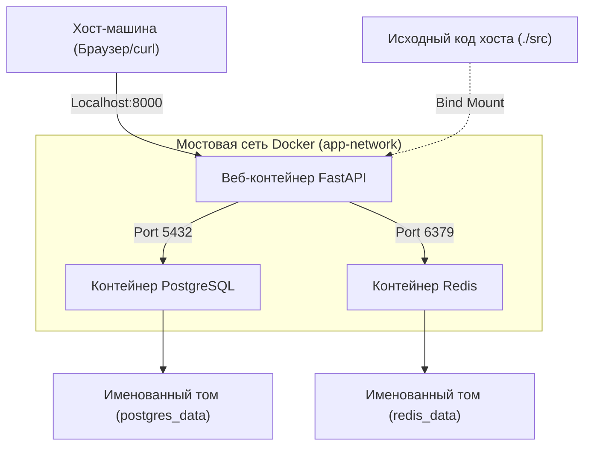
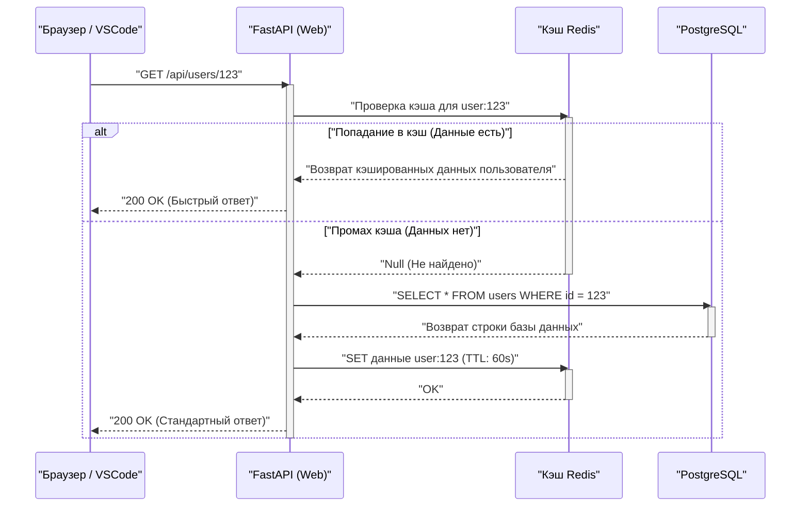

## 1. Введение: Избавление от проблемы «на моей машине это работает»

В сфере разработки программного обеспечения проблема «на моей машине это работает (It works on my machine)», вызванная различиями в средах разработчиков, долгое время была причиной потери времени во многих проектах. Из-за различий в ОС, установленных версиях языков, зависимостях библиотек и конфликтах глобально установленных инструментов локальная среда постоянно подвергается «неопределенности состояния».

Эту проблему в корне решают контейнерные технологии, такие как **Docker**, и парадигма **Infrastructure as Code (IaC)**. Контейнеризация локальной среды разработки обеспечивает изоляцию на уровне ОС и позволяет контролировать версии самой среды вместе с кодовой базой.

В этой статье мы подробно, в том числе с математической точки зрения, рассмотрим глубокие технические механизмы и шаги для создания **«воспроизводимой локальной среды разработки, которая будет абсолютно одинаковой независимо от того, кто, когда и на какой машине ее запускает»**, используя Docker, Docker Compose и VSCode DevContainers.

---

## 2. Совместимость Infrastructure as Code (IaC) и контейнерных технологий

### Принципы IaC и их применение к локальной среде

Infrastructure as Code (IaC) — это подход, при котором настройка и выделение ресурсов инфраструктуры управляются не через ручные процессы, а через машиночитаемые конфигурационные файлы. Ключевые принципы IaC включают следующие элементы:

1. **Декларативный подход (Declarative Approach)**: Определяется не «как изменить состояние», а «каким должно быть конечное состояние».
2. **Идемпотентность (Idempotency)**: Независимо от того, сколько раз выполняется скрипт, всегда гарантируется один и тот же результат (состояние).
3. **Контроль версий (Version Control)**: Состояние инфраструктуры сохраняется в виде кода в VCS, таких как Git, что позволяет отслеживать историю изменений и проводить код-ревью (peer review).

Применение IaC в локальной среде разработки означает кодирование «идеального состояния» среды разработки с использованием `Dockerfile`, `docker-compose.yml` и `devcontainer.json`. Это позволяет новым участникам команды моментально приступить к разработке, просто клонировав репозиторий и выполнив одну команду, обеспечивая идеальный опыт онбординга.

### Функции ядра, лежащие в основе контейнерных технологий

Технология контейнеров — это легковесная технология виртуализации, которая изолирует процессы, разделяя ядро хост-ОС, в отличие от виртуализации на основе гипервизора, такой как виртуальные машины (VM). Для достижения этого в основном используются следующие функции ядра Linux:

- **Namespaces**: Обеспечивают независимое представление системных ресурсов (PID, сеть, точки монтирования, пользователи и т. д.) для каждого процесса.
- **Cgroups (Control Groups)**: Ограничивают и распределяют физические ресурсы (процессор, память, дисковый ввод-вывод и т. д.), доступные процессам.
- **UnionFS (Union File System)**: Технология, которая прозрачно накладывает несколько деревьев каталогов (слоев) друг на друга, представляя их как единую файловую систему. Слои образов Docker опираются на эту технологию.

Давайте рассмотрим математическую модель ограничения ресурсов. Пусть $M_{\text{total}}$ — общий объем памяти хост-машины, а $m_i$ — ограничение памяти для $n$ контейнеров, работающих на хосте. Необходимое условие для стабильной работы системы, с учетом базовой памяти $M_{\text{os}}$, потребляемой хост-ОС и другими процессами, можно выразить следующим неравенством:

$$ \sum_{i=1}^{n} m_i \le M_{\text{total}} - M_{\text{os}} $$

Строго определяя $m_i$ для каждого контейнера с помощью Cgroups, даже если в конкретном контейнере происходит утечка памяти, механизм OOM (Out Of Memory) Killer предотвратит сбой других контейнеров или всей хост-системы.

---

## 3. Эффективное проектирование Dockerfile: Освоение многоэтапных сборок

Первым шагом к воспроизводимой среде является проектирование `Dockerfile`, определяющего среду выполнения приложения. Здесь на примере Python (FastAPI) мы рассмотрим лучшие практики создания безопасного и легковесного Dockerfile с использованием **многоэтапных сборок (multi-stage builds)**.

Многоэтапная сборка — это метод, при котором в одном `Dockerfile` используется несколько инструкций `FROM`, разделяя среду сборки (тяжелую среду, содержащую компиляторы и инструменты разработки) и среду выполнения (легковесную среду, содержащую только необходимые артефакты).

### Практический Dockerfile для Python FastAPI

Ниже приведен пример продвинутого `Dockerfile`, объединяющего управление зависимостями с помощью Poetry и многоэтапную сборку.

```dockerfile
# ---------------------------------------------------------
# Stage 1: Builder (Среда сборки)
# ---------------------------------------------------------
FROM python:3.11-slim AS builder

# Настройка необходимых переменных окружения
ENV PYTHONUNBUFFERED=1 \
    PYTHONDONTWRITEBYTECODE=1 \
    POETRY_VERSION=1.6.1 \
    POETRY_HOME="/opt/poetry" \
    POETRY_VIRTUALENVS_IN_PROJECT=true \
    POETRY_NO_INTERACTION=1

# Установка зависимостей
RUN apt-get update && apt-get install -y --no-install-recommends \
    curl build-essential && \
    curl -sSL https://install.python-poetry.org | python3 - && \
    apt-get clean && rm -rf /var/lib/apt/lists/*

ENV PATH="$POETRY_HOME/bin:$PATH"

WORKDIR /app

# Копирование файлов зависимостей и установка
COPY pyproject.toml poetry.lock ./
RUN poetry install --no-root --only main

# ---------------------------------------------------------
# Stage 2: Runtime (Среда выполнения)
# ---------------------------------------------------------
FROM python:3.11-slim AS runtime

ENV PYTHONUNBUFFERED=1 \
    PYTHONDONTWRITEBYTECODE=1 \
    PATH="/app/.venv/bin:$PATH"

# Создание минимального непривилегированного пользователя
RUN groupadd -r appuser && useradd -r -g appuser appuser

WORKDIR /app

# Копирование только виртуальной среды (зависимостей) из сборщика
COPY --from=builder --chown=appuser:appuser /app/.venv /app/.venv

# Копирование кода приложения
COPY --chown=appuser:appuser ./src /app/src

# Переключение на непривилегированного пользователя
USER appuser

# Команда по умолчанию при запуске контейнера
ENTRYPOINT ["uvicorn", "src.main:app", "--host", "0.0.0.0", "--port", "8000"]
```

### Математическая оценка размера образа благодаря многоэтапной сборке

Пусть размер образа при одноэтапной сборке равен $S_{\text{single}}$, а при многоэтапной — $S_{\text{multi}}$. Коэффициент уменьшения размера $R$ вычисляется следующим образом:

$$ R = \left( 1 - \frac{S_{\text{multi}}}{S_{\text{single}}} \right) \times 100 \ (\%) $$

Например, предположим, что $S_{\text{single}}$ включает базовый образ ОС (около 110 МБ), пакеты для разработки (например, gcc, около 150 МБ), сам Poetry (около 40 МБ), библиотеки зависимостей проекта (около 80 МБ) и исходный код (около 5 МБ), что в сумме составляет 385 МБ.
С другой стороны, в $S_{\text{multi}}$ в базовый образ (110 МБ) копируются только библиотеки зависимостей (80 МБ) и исходный код (5 МБ), что дает в сумме 195 МБ.

$$ R = \left( 1 - \frac{195}{385} \right) \times 100 \approx 49.35\% $$

Таким образом, внедрение многоэтапной сборки позволяет сократить размер образа примерно вдвое. Уменьшение размера образа напрямую связано с сокращением времени загрузки (Pull) из реестра, экономией дискового пространства и повышением безопасности за счет уменьшения поверхности атаки (Attack Surface).

---

## 4. Оркестрация нескольких контейнеров с помощью Docker Compose

В современной веб-разработке обычно используется микросервисная архитектура, где взаимодействуют несколько компонентов, таких как веб-серверы, базы данных и кэш-серверы. Для централизованного управления ими в локальной среде используется `docker-compose.yml`.

В этот раз мы создадим трехуровневую систему, состоящую из «Web (FastAPI)», «Database (PostgreSQL)» и «Cache (Redis)» в локальной среде.

### Схема архитектуры (Mermaid)

На следующей схеме представлена блочная диаграмма, показывающая взаимосвязь каждого контейнера, сети и томов на локальной машине.



### Реализация и подробное объяснение docker-compose.yml

Ниже приведен пример надежного `docker-compose.yml`, подходящего для практического создания среды.

```yaml
version: '3.8'

services:
  web:
    build:
      context: .
      target: runtime
    container_name: dev_web
    ports:
      - "8000:8000"
    volumes:
      - ./src:/app/src:ro  # Монтирование кода хоста только для чтения (для горячей перезагрузки)
    environment:
      - DATABASE_URL=postgresql://postgres:${POSTGRES_PASSWORD}@db:5432/${POSTGRES_DB}
      - REDIS_URL=redis://redis:6379/0
    env_file:
      - .env
    depends_on:
      db:
        condition: service_healthy
      redis:
        condition: service_started
    networks:
      - app-network
    command: ["uvicorn", "src.main:app", "--host", "0.0.0.0", "--port", "8000", "--reload"]

  db:
    image: postgres:15-alpine
    container_name: dev_db
    ports:
      - "5432:5432"
    environment:
      POSTGRES_USER: postgres
      POSTGRES_PASSWORD: ${POSTGRES_PASSWORD}
      POSTGRES_DB: ${POSTGRES_DB}
    volumes:
      - postgres_data:/var/lib/postgresql/data
    networks:
      - app-network
    healthcheck:
      test: ["CMD-SHELL", "pg_isready -U postgres -d ${POSTGRES_DB}"]
      interval: 5s
      timeout: 5s
      retries: 5

  redis:
    image: redis:7-alpine
    container_name: dev_redis
    ports:
      - "6379:6379"
    volumes:
      - redis_data:/data
    networks:
      - app-network
    command: ["redis-server", "--appendonly", "yes"]

volumes:
  postgres_data:
  redis_data:

networks:
  app-network:
    driver: bridge
```

### Тома (Volumes) и сохранение данных

Контейнеры, как правило, «не имеют состояния (stateless)» и «эфемерны (ephemeral)». При уничтожении контейнера данные внутри него также теряются. Чтобы сохранить данные базы данных или кэш, необходимо смонтировать область файловой системы хост-машины в контейнер.

- **Bind Mount (Привязка монтирования)**: Этому соответствует `./src:/app/src:ro` в службе `web` выше. Он напрямую отображает определенный каталог на хосте в контейнер. Используется для немедленного отражения локального редактирования кода в контейнере (горячая перезагрузка). С точки зрения безопасности рекомендуется добавить опцию `:ro` (Read-Only), чтобы код на хосте нельзя было изменить со стороны контейнера.
- **Named Volume (Именованный том)**: К ним относятся `postgres_data` и `redis_data`. Это области, внутренне управляемые Docker (например, `/var/lib/docker/volumes/`), которые превосходят Bind Mount по производительности ввода-вывода и сглаживают различия файловых систем между ОС. Их всегда следует использовать для сохранения баз данных.

### Сеть (Networking) и обнаружение сервисов

По умолчанию Docker Compose создает собственную мостовую сеть для каждого проекта. В данном случае это `app-network`.
Контейнеры, принадлежащие одной сети, могут разрешать имена (DNS-разрешение) друг друга, используя «имя службы (например: `db`, `redis`)» в качестве имени хоста вместо IP-адреса.
Например, из веб-контейнера можно получить доступ к базе данных по URL `postgresql://postgres:password@db:5432/mydb`. Это позволяет прозрачно переключать места подключения через переменные окружения как в локальной, так и в рабочей (production) среде.

### Проверка работоспособности (Healthcheck) и контроль порядка запуска

Директива `depends_on` управляет порядком запуска контейнеров, но простое указание `depends_on` запустит веб-контейнер на этапе, когда «запущен контейнер БД». На самом деле, процесс инициализации БД (запуск процесса PostgreSQL и подготовка таблиц) занимает несколько секунд, поэтому подключение к БД из веб-контейнера может привести к ошибке.
Чтобы предотвратить это, можно определить `healthcheck` и указать `condition: service_healthy`, что позволит запускать веб-контейнер только после того, как будет подтверждено, что «БД готова принимать запросы на подключение».

---

## 5. Управление переменными окружения и безопасность (.env)

Жесткое кодирование (hardcoding) конфиденциальной информации, такой как пароли баз данных или ключи API, в `docker-compose.yml` является антипаттерном, которого следует абсолютно избегать. Вместо этого для внедрения этих значений используется файл переменных окружения `.env`.

Создайте файл `.env` в корне проекта.

```ini
# Файл .env (обязательно добавьте в .gitignore, чтобы исключить из-под контроля Git)
POSTGRES_PASSWORD=supersecretpassword
POSTGRES_DB=devdb
API_SECRET_KEY=dev_secret_key_12345
```

По умолчанию Docker Compose считывает файл `.env` в рабочем каталоге и разворачивает заполнители вида `${VAR_NAME}` в YAML-файле. Этот метод позволяет безопасно управлять различными настройками для разных сред, таких как локальная, staging и production, без изменения кода инфраструктуры.

---

## 6. VSCode DevContainers: Идеальный опыт разработки

На данный момент мы создали надежную бэкенд-среду с использованием Docker. Однако можно пойти еще дальше. Используя функцию **VSCode DevContainers (Remote - Containers)**, можно запускать бэкенд самого редактора (VSCode) внутри контейнера.

Благодаря этому отпадает необходимость устанавливать даже Python или Node.js на локальную машину. Линтеры (flake8/eslint), форматтеры (black/prettier) и даже расширения IDE — всё это можно определить в кодовой базе и использовать совместно со всей командой.

### Настройка devcontainer.json

Создайте каталог `.devcontainer` в корне проекта и поместите в него файл конфигурации.

`.devcontainer/devcontainer.json`:
```json
{
  "name": "Python FastAPI Dev Environment",
  "dockerComposeFile": ["../docker-compose.yml"],
  "service": "web",
  "workspaceFolder": "/app",
  "customizations": {
    "vscode": {
      "settings": {
        "python.defaultInterpreterPath": "/app/.venv/bin/python",
        "python.formatting.provider": "black",
        "editor.formatOnSave": true
      },
      "extensions": [
        "ms-python.python",
        "ms-python.vscode-pylance",
        "ms-python.black-formatter",
        "tamasfe.even-better-toml"
      ]
    }
  },
  "forwardPorts": [8000, 5432, 6379],
  "remoteUser": "appuser",
  "postCreateCommand": "poetry install"
}
```

Включив этот файл в репозиторий, при открытии проекта в VSCode сразу же появится запрос «Reopen in Container» (Открыть в контейнере). По одному щелчку мыши запустятся все необходимые контейнеры, установятся расширения, и вы будете готовы немедленно начать писать код. Это поистине волшебный опыт.

---

## 7. Последовательность обработки запросов и моделирование производительности

Давайте рассмотрим жизненный цикл обработки запросов веб-приложения в созданной локальной среде разработки с помощью диаграммы последовательности и обсудим математическую модель ее производительности.

### Диаграмма последовательности (Поток запроса)



### Математическая модель задержки обработки (Latency)

Математически смоделируем среднее время обработки запроса $T_{\text{total}}$ в вышеописанной системе.
Задержки для каждой операции определены следующим образом:
- $T_{\text{net}}$: Сетевая задержка между клиентом и веб-контейнером
- $T_{\text{app}}$: Чистое время обработки на стороне приложения (сериализация и т. д.)
- $T_{\text{cache}}$: Время, затрачиваемое на чтение и запись из Redis
- $T_{\text{db}}$: Время, затрачиваемое на выполнение запроса к PostgreSQL
- $p_{\text{miss}}$: Вероятность промаха кэша ($0 \le p_{\text{miss}} \le 1$)

Тогда среднее время отклика выражается следующей формулой ожидаемого значения:

$$ T_{\text{total}} = T_{\text{net}} + T_{\text{app}} + T_{\text{cache}} + p_{\text{miss}} \times (T_{\text{db}} + T_{\text{cache\_write}}) $$

В локальной среде разработки (внутри Docker) $T_{\text{net}}$ близко к 0, но стоит обратить внимание на **производительность ввода-вывода (I/O) при Bind Mount**. В частности, при использовании Docker Desktop на Windows/macOS из-за накладных расходов на совместное использование файлов между хост-ОС и виртуальной машиной (контейнером) $T_{\text{app}}$ (например, время загрузки кода) имеет тенденцию увеличиваться. Чтобы устранить это узкое место, настоятельно рекомендуется архитектура, в которой используется описанный ранее DevContainers для размещения всего исходного кода внутри именованного тома, или работа движка Docker нативно в среде WSL2 (Windows Subsystem for Linux 2).

---

## 8. Оптимизация производительности сборки Docker: Стратегия кэширования слоев

Понимание механизма «кэширования слоев» при написании Dockerfile кардинально меняет время сборки.
Docker создает разницу в файловой системе (слой) для каждой инструкции Dockerfile (например, `FROM`, `RUN`, `COPY`) и сохраняет ее в виде кэша. При повторной сборке повторно используется кэш для слоев, которые не изменились.

Важный принцип заключается в том, чтобы **«описывать, начиная с того, что меняется реже всего»**.

Давайте смоделируем влияние изменений исходного кода на время сборки. Пусть общее время сборки равно $T_{\text{build}}$, время выполнения каждого шага — $T_{\text{layer}_i}$, а наличие попадания в кэш — логическое значение $c_i \in \{0, 1\}$ (1 при попадании в кэш).

$$ T_{\text{build}} = T_{\text{init}} + \sum_{i=1}^{n} (1 - c_i) \times T_{\text{layer}_i} $$

Как только происходит промах кэша на слое $k$ ($c_k = 0$), кэш инвалидируется ($c_j = 0$) для всех последующих слоев $j > k$.

```dockerfile
# Плохой пример (исходный код копируется первым)
COPY ./src /app/src
COPY pyproject.toml poetry.lock ./
RUN poetry install
```
В приведенном выше случае даже изменение одной строки кода приведет к промаху кэша на первой инструкции `COPY`, и каждый раз будет выполняться ресурсоемкая команда `RUN poetry install`.

```dockerfile
# Хороший пример (сначала решаются зависимости)
COPY pyproject.toml poetry.lock ./
RUN poetry install
COPY ./src /app/src
```
При такой записи, даже при изменении исходного кода, сработает кэш слоя `poetry install` ($c_i = 1$), поэтому время сборки резко сократится с нескольких минут до нескольких секунд.

---

## 9. Устранение неполадок (Troubleshooting) и советы (Tips)

Ниже приведены часто встречающиеся проблемы при работе с локальной средой и способы их решения.

1. **Ошибка конфликта портов**
   Если вы получаете ошибку вроде `Bind for 0.0.0.0:8000 failed: port is already allocated`, это означает, что другой процесс на локальной машине использует этот порт. Этого можно избежать, изменив номер порта на стороне хоста, например `ports: - "8080:8000"`.

2. **Нехватка дискового пространства**
   При длительном использовании Docker накапливаются неиспользуемые образы и тома (Dangling Images / Volumes), что может занять десятки гигабайт дискового пространства. Рекомендуется регулярно очищать систему с помощью следующей команды:
   ```bash
   docker system prune -a --volumes
   ```

3. **Проблемы с правами доступа к файлам**
   При использовании Bind Mount в среде Linux файлы, созданные внутри контейнера, могут принадлежать пользователю `root`, что сделает невозможным их редактирование на стороне хоста. Эту проблему можно решить, создав непривилегированного пользователя в Dockerfile и сопоставив его с вашим собственным UID/GID хост-ОС (например, 1000:1000).

---

## 10. Заключение: Как воспроизводимость ускоряет разработку

Сочетание Docker, Docker Compose и VSCode DevContainers позволяет создать надежную локальную среду разработки, в которой «состояние будет абсолютно одинаковым независимо от того, кто ее запускает».

Внедрение парадигмы IaC в локальную среду не просто сокращает время первоначальной настройки. Это значительно повышает скорость и качество всего цикла разработки, устраняя опасения по поводу изменений конфигурации инфраструктуры, облегчая эксперименты с новыми технологическими стеками и обеспечивая плавный переход к конвейерам (pipelines) CI/CD.

Используя передовые методы (best practices), описанные в этой статье, такие как оптимизация размера образа с помощью многоэтапных сборок, управление зависимостями с помощью проверок работоспособности (healthcheck) и написание Dockerfile с учетом кэширования слоев, обязательно внедрите лучший опыт разработки (DX: Developer Experience) и в свои проекты.
