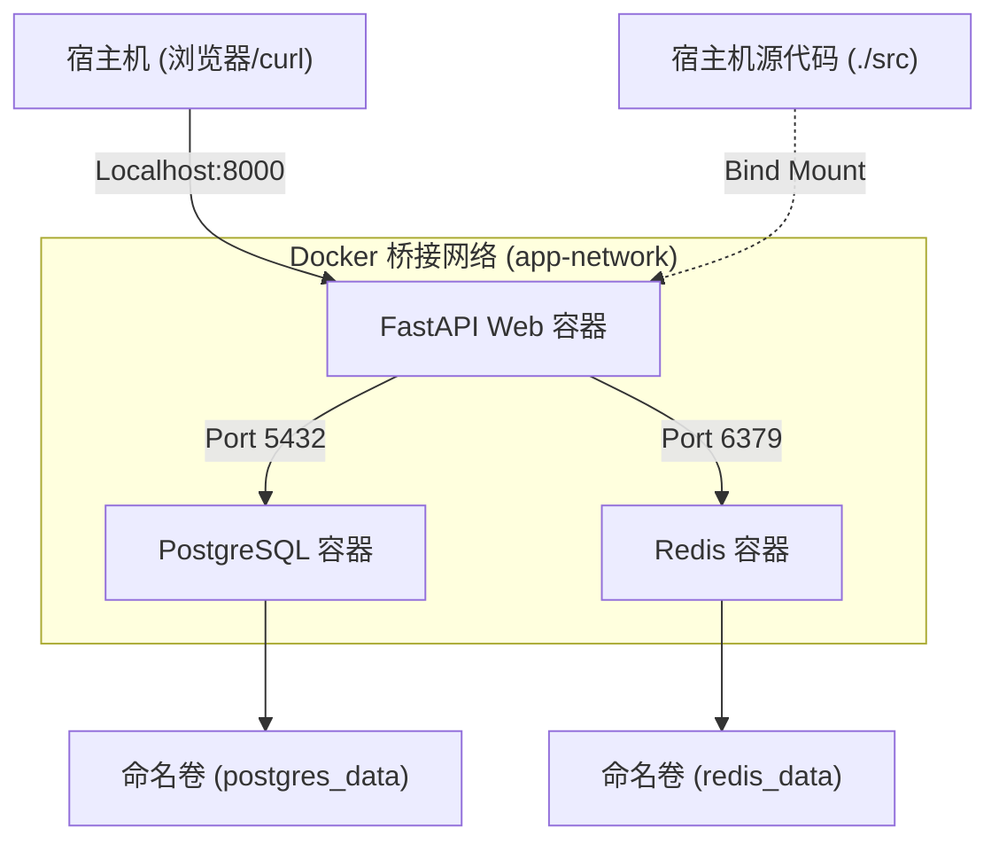
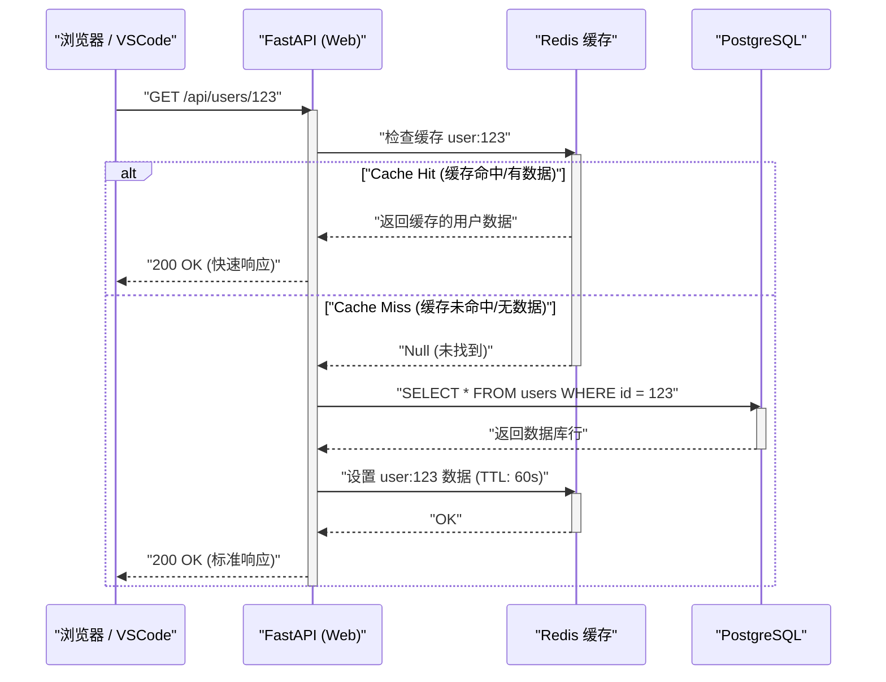

## 1. 引言：摆脱“在我的机器上能运行”的困境

在软件开发现场，由于开发者之间的环境差异而导致的“在我的机器上能运行（It works on my machine）”问题，长期以来一直是许多项目浪费时间的因素。操作系统的差异、安装的语言版本、库的依赖关系、全局安装的工具冲突等，本地环境始终面临着“状态的不确定性”。

从根本上解决这些挑战的是以 **Docker** 为首的容器技术，以及 **基础设施即代码 (IaC)** 的范式。通过将本地开发环境容器化，实现了操作系统级别的隔离，并可以将环境本身与代码库一起进行版本控制。

本文将深入讲解如何充分利用 Docker、Docker Compose 和 VSCode DevContainers，构建一个**“无论谁在何时、哪台机器上启动，状态都分毫不差的可重现的本地开发环境”**的步骤，并从数学角度深入探讨其背后的深层技术机制。

---

## 2. 基础设施即代码 (IaC) 与容器技术的契合度

### IaC 的原则及其在本地环境中的应用

基础设施即代码 (IaC) 是一种通过机器可读的定义文件，而非手动流程来管理和配置基础架构的方法。IaC 的核心原则包含以下要素：

1. **声明式方法 (Declarative Approach)**：定义“最终应该是什么状态”，而不是“如何改变状态”。
2. **幂等性 (Idempotency)**：无论执行多少次脚本，始终保证相同的结果（状态）。
3. **版本控制 (Version Control)**：基础设施的状态作为代码保存在 Git 等 VCS 中，从而可以追踪更改历史并进行同行评审。

在本地开发环境中实践 IaC，意味着使用 `Dockerfile`、`docker-compose.yml` 和 `devcontainer.json` 将开发环境的“理想状态”代码化。这样，新加入团队的成员也可以通过克隆存储库并运行一条命令，立即开始开发，实现丝滑的入职体验。

### 支撑容器技术的内核功能

容器技术与虚拟机（VM）等基于管理程序的虚拟化不同，它是一种轻量级的虚拟化技术，在共享宿主机操作系统内核的同时，隔离进程（Isolation）。为了实现这一点，主要使用了 Linux 内核的以下功能：

- **Namespaces（命名空间）**：为每个进程提供独立的系统资源视图（PID、网络、挂载点、用户等）。
- **Cgroups (Control Groups, 控制组)**：限制和分配进程可以使用的物理资源（CPU、内存、磁盘 I/O 等）。
- **UnionFS (联合文件系统)**：一种透明地叠加多个目录树（层）并将它们显示为一个文件系统的技术。Docker 的镜像层依赖于这项技术。

让我们考虑一下资源限制的数学模型。假设宿主机的总内存容量为 $M_{\text{total}}$，在宿主机上运行的 $n$ 个容器的内存限制为 $m_i$。考虑到操作系统和其他进程消耗的基础内存 $M_{\text{os}}$，系统稳定运行的必要条件可以用以下不等式表示：

$$ \sum_{i=1}^{n} m_i \le M_{\text{total}} - M_{\text{os}} $$

通过使用 Cgroups 严格定义每个容器的 $m_i$，即使特定容器发生内存泄漏，也能防止 OOM (Out Of Memory) Killer 导致其他容器或整个宿主系统崩溃。

---

## 3. 高效的 Dockerfile 设计：掌握多阶段构建

实现可重现环境的第一步是设计定义应用程序运行环境的 `Dockerfile`。在这里，我们将以 Python (FastAPI) 为例，讲解利用**多阶段构建**的，安全且轻量级的 Dockerfile 最佳实践。

多阶段构建是一种在一个 `Dockerfile` 中使用多个 `FROM` 指令的方法，将构建环境（包含编译器和开发工具的繁重环境）与执行环境（仅包含所需工件的轻量级环境）分离。

### 实用的 Python FastAPI Dockerfile

以下代码是结合 Poetry 依赖项管理和多阶段构建的高级 `Dockerfile` 示例。

```dockerfile
# ---------------------------------------------------------
# Stage 1: Builder (构建环境)
# ---------------------------------------------------------
FROM python:3.11-slim AS builder

# 设置所需的环境变量
ENV PYTHONUNBUFFERED=1 \
    PYTHONDONTWRITEBYTECODE=1 \
    POETRY_VERSION=1.6.1 \
    POETRY_HOME="/opt/poetry" \
    POETRY_VIRTUALENVS_IN_PROJECT=true \
    POETRY_NO_INTERACTION=1

# 安装依赖包
RUN apt-get update && apt-get install -y --no-install-recommends \
    curl build-essential && \
    curl -sSL https://install.python-poetry.org | python3 - && \
    apt-get clean && rm -rf /var/lib/apt/lists/*

ENV PATH="$POETRY_HOME/bin:$PATH"

WORKDIR /app

# 复制并安装依赖关系文件
COPY pyproject.toml poetry.lock ./
RUN poetry install --no-root --only main

# ---------------------------------------------------------
# Stage 2: Runtime (运行环境)
# ---------------------------------------------------------
FROM python:3.11-slim AS runtime

ENV PYTHONUNBUFFERED=1 \
    PYTHONDONTWRITEBYTECODE=1 \
    PATH="/app/.venv/bin:$PATH"

# 创建一个最小的非特权用户
RUN groupadd -r appuser && useradd -r -g appuser appuser

WORKDIR /app

# 仅从 builder 复制虚拟环境（依赖项）
COPY --from=builder --chown=appuser:appuser /app/.venv /app/.venv

# 复制应用程序代码
COPY --chown=appuser:appuser ./src /app/src

# 切换到非特权用户
USER appuser

# 容器启动时的默认命令
ENTRYPOINT ["uvicorn", "src.main:app", "--host", "0.0.0.0", "--port", "8000"]
```

### 多阶段构建对镜像大小的数学评估

假设单阶段构建时的镜像大小为 $S_{\text{single}}$，应用多阶段构建后的镜像大小为 $S_{\text{multi}}$。大小缩减率 $R$ 的计算公式如下：

$$ R = \left( 1 - \frac{S_{\text{multi}}}{S_{\text{single}}} \right) \times 100 \ (\%) $$

例如，假设 $S_{\text{single}}$ 包含操作系统的基础镜像（约 110MB）、开发包（如 gcc 约 150MB）、Poetry 本身（约 40MB）、项目的依赖库（约 80MB）和源代码（约 5MB），总计 385MB。
另一方面，在 $S_{\text{multi}}$ 中，仅将依赖库（80MB）和源代码（5MB）复制到基础镜像（110MB）中，因此总计为 195MB。

$$ R = \left( 1 - \frac{195}{385} \right) \times 100 \approx 49.35\% $$

通过引入多阶段构建，镜像大小可减少约一半。镜像大小的减小直接关系到从注册表提取（Pull）时间的缩短、磁盘空间的节省，以及通过减少攻击面（Attack Surface）来提高安全性。

---

## 4. 使用 Docker Compose 编排多个容器

在现代 Web 应用程序开发中，由 Web 服务器、数据库和缓存服务器等多个组件协同工作的微服务架构非常普遍。为了在本地环境中集中管理这些组件，我们使用 `docker-compose.yml`。

这次，我们将在本地构建一个“Web (FastAPI)”、“数据库 (PostgreSQL)”和“缓存 (Redis)”的三层架构系统。

### 架构图 (Mermaid)

下图是表示本地机器中各容器、网络和卷之间关系的块图。



### docker-compose.yml 的实现与详细讲解

以下是足以承受实际环境构建的强大 `docker-compose.yml` 示例。

```yaml
version: '3.8'

services:
  web:
    build:
      context: .
      target: runtime
    container_name: dev_web
    ports:
      - "8000:8000"
    volumes:
      - ./src:/app/src:ro  # 以只读方式挂载宿主机代码（用于热重载）
    environment:
      - DATABASE_URL=postgresql://postgres:${POSTGRES_PASSWORD}@db:5432/${POSTGRES_DB}
      - REDIS_URL=redis://redis:6379/0
    env_file:
      - .env
    depends_on:
      db:
        condition: service_healthy
      redis:
        condition: service_started
    networks:
      - app-network
    command: ["uvicorn", "src.main:app", "--host", "0.0.0.0", "--port", "8000", "--reload"]

  db:
    image: postgres:15-alpine
    container_name: dev_db
    ports:
      - "5432:5432"
    environment:
      POSTGRES_USER: postgres
      POSTGRES_PASSWORD: ${POSTGRES_PASSWORD}
      POSTGRES_DB: ${POSTGRES_DB}
    volumes:
      - postgres_data:/var/lib/postgresql/data
    networks:
      - app-network
    healthcheck:
      test: ["CMD-SHELL", "pg_isready -U postgres -d ${POSTGRES_DB}"]
      interval: 5s
      timeout: 5s
      retries: 5

  redis:
    image: redis:7-alpine
    container_name: dev_redis
    ports:
      - "6379:6379"
    volumes:
      - redis_data:/data
    networks:
      - app-network
    command: ["redis-server", "--appendonly", "yes"]

volumes:
  postgres_data:
  redis_data:

networks:
  app-network:
    driver: bridge
```

### 卷 (Volumes) 与数据持久化

容器原则上是“无状态的（Stateless）”且“短暂的（Ephemeral）”。一旦销毁容器，其内部的数据也会随之消失。为了保留数据库的数据或缓存，需要将宿主机的文件系统区域挂载到容器中。

- **Bind Mount (绑定挂载)**：对应上述 `web` 服务中的 `./src:/app/src:ro`。将宿主机的特定目录直接映射到容器内。用于将本地的代码编辑立即反映到容器中（热重载）。从安全角度出发，最佳实践是添加 `:ro` (Read-Only) 选项，以防止容器端修改宿主机的源代码。
- **Named Volume (命名卷)**：对应 `postgres_data` 和 `redis_data`。是由 Docker 内部（如 `/var/lib/docker/volumes/`）管理的区域，比绑定挂载具有更好的 I/O 性能，并且能吸收不同操作系统间文件系统的差异。数据库的持久化务必使用此方式。

### 网络 (Networking) 与服务发现

Docker Compose 默认会为每个项目创建一个专有的桥接网络，即上述的 `app-network`。
属于同一网络的容器之间，可以使用“服务名（如 `db`, `redis`）”作为主机名进行名称解析（DNS 解析），而不是使用 IP 地址。
例如，可以从 Web 容器通过 `postgresql://postgres:password@db:5432/mydb` 这样的 URL 访问数据库。由此，无论是在本地环境还是生产环境，都能通过环境变量透明地切换连接目标。

### 运行状况检查与启动顺序控制

`depends_on` 指令用于控制容器的启动顺序，但仅指定 `depends_on` 会在“DB 容器启动”的阶段就启动 Web 容器。实际上，DB 的初始化过程（PostgreSQL 进程启动和表准备）需要几秒钟的时间，因此 Web 容器发起的 DB 连接可能会报错。
为了防止这种情况发生，可以定义 `healthcheck` 并指定 `condition: service_healthy`，这样就能确认“DB 已处于可以接受连接请求的状态”后，再启动 Web 容器。

---

## 5. 环境变量管理与安全性 (.env)

绝对应该避免将数据库密码或 API 密钥等敏感信息硬编码到 `docker-compose.yml` 中，这是一种反模式。相反，我们应该使用环境变量文件 `.env` 注入这些值。

在项目根目录下创建一个 `.env` 文件。

```ini
# .env 文件 (请将其添加到 .gitignore 中以排除在 Git 管理之外)
POSTGRES_PASSWORD=supersecretpassword
POSTGRES_DB=devdb
API_SECRET_KEY=dev_secret_key_12345
```

Docker Compose 默认会读取执行目录下的 `.env` 文件，并展开 YAML 文件中的 `${VAR_NAME}` 占位符。通过这种方法，无需修改基础架构代码，即可安全地管理本地、临时和生产等不同环境的配置值。

---

## 6. VSCode DevContainers 带来的极致开发体验

到目前为止，我们已经使用 Docker 构建了一个强大的后端环境。然而，我们还可以更进一步。通过使用 **VSCode DevContainers (Remote - Containers)** 功能，可以将编辑器（VSCode）本身的后端运行在容器内部。

这样一来，本地机器上甚至不需要安装 Python 或 Node.js，从 Linter（flake8/eslint）、格式化工具（black/prettier）到 IDE 扩展，所有的内容都可以在代码库中定义并由整个团队共享。

### devcontainer.json 配置

在项目根目录下创建一个 `.devcontainer` 目录，并在其中放置配置文件。

`.devcontainer/devcontainer.json`:
```json
{
  "name": "Python FastAPI Dev Environment",
  "dockerComposeFile": ["../docker-compose.yml"],
  "service": "web",
  "workspaceFolder": "/app",
  "customizations": {
    "vscode": {
      "settings": {
        "python.defaultInterpreterPath": "/app/.venv/bin/python",
        "python.formatting.provider": "black",
        "editor.formatOnSave": true
      },
      "extensions": [
        "ms-python.python",
        "ms-python.vscode-pylance",
        "ms-python.black-formatter",
        "tamasfe.even-better-toml"
      ]
    }
  },
  "forwardPorts": [8000, 5432, 6379],
  "remoteUser": "appuser",
  "postCreateCommand": "poetry install"
}
```

将该文件包含在存储库中，当在 VSCode 中打开该项目时，系统会提示“在容器中重新打开（Reopen in Container）”，只需点击一下，就会启动所有必需的容器，安装扩展程序，并立即准备好进行编码。这真是一种如同魔法般的体验。

---

## 7. 请求处理序列与性能建模

我们通过序列图来确认在构建的本地开发环境中的 Web 应用程序请求处理的生命周期，并探讨其性能的数学模型。

### 序列图（请求流程）



### 处理延迟 (Latency) 的数学模型

在上述系统中，我们对平均请求处理时间 $T_{\text{total}}$ 进行数学建模。
将各处理步骤的延迟定义如下：
- $T_{\text{net}}$: 客户端与 Web 容器之间的网络延迟
- $T_{\text{app}}$: 应用程序端纯粹的处理时间（如序列化等）
- $T_{\text{cache}}$: 在 Redis 中读取和写入所花费的时间
- $T_{\text{db}}$: 执行 PostgreSQL 查询所花费的时间
- $p_{\text{miss}}$: 缓存未命中率（$0 \le p_{\text{miss}} \le 1$）

此时，平均响应时间可以通过以下期望值计算公式表示：

$$ T_{\text{total}} = T_{\text{net}} + T_{\text{app}} + T_{\text{cache}} + p_{\text{miss}} \times (T_{\text{db}} + T_{\text{cache\_write}}) $$

在本地开发环境（Docker 内部）中，$T_{\text{net}}$ 几乎接近于 0。但是，值得注意的是**绑定挂载时的 I/O 性能**。特别是在 Windows/macOS 上使用 Docker Desktop 时，由于宿主机操作系统和 VM（容器）之间的文件共享开销，$T_{\text{app}}$（代码加载时间等）容易变得过高。为了消除这个性能瓶颈，强烈建议利用前面提到的 DevContainers 将整个源代码放在命名卷内，或者采用在 WSL2（Windows Subsystem for Linux 2）原生环境中运行 Docker 引擎的架构。

---

## 8. Docker 构建的性能优化：层缓存策略

在编写 Dockerfile 时，是否理解“层缓存（Layer Cache）”机制将大幅改变构建时间。
Docker 会在遇到 Dockerfile 的每个指令（如 `FROM`, `RUN`, `COPY` 等）时创建文件系统差异（层），并将其作为缓存保留下来。在重新构建时，会重用未发生变更的层的缓存。

一个重要的原则是：**“按更改频率从低到高的顺序编写”**。

考虑对代码更改影响构建时间的建模。设总构建时间为 $T_{\text{build}}$，每一步的执行时间为 $T_{\text{layer}_i}$，是否命中缓存为布尔值 $c_i \in \{0, 1\}$（命中缓存时为 1）。

$$ T_{\text{build}} = T_{\text{init}} + \sum_{i=1}^{n} (1 - c_i) \times T_{\text{layer}_i} $$

一旦在第 $k$ 层发生缓存未命中（$c_k = 0$），则其后所有层 $j > k$ 的缓存都将失效（$c_j = 0$）。

```dockerfile
# 反面教材 (先复制了源代码)
COPY ./src /app/src
COPY pyproject.toml poetry.lock ./
RUN poetry install
```
在上面的例子中，仅仅修改了一行代码，最初的 `COPY` 就会导致缓存未命中，进而使得极其耗时的 `RUN poetry install` 每次都会被执行。

```dockerfile
# 好的示例 (先解析并安装依赖项)
COPY pyproject.toml poetry.lock ./
RUN poetry install
COPY ./src /app/src
```
这样编写的话，即使更改了源代码，`poetry install` 这一层的缓存 ($c_i = 1$) 依然有效，构建时间就能从几分钟大幅缩短到几秒钟。

---

## 9. 故障排除与技巧

以下列出在运行本地环境时常遇到的问题及解决方案。

1. **端口冲突错误**
   如果出现类似 `Bind for 0.0.0.0:8000 failed: port is already allocated` 的错误，说明本地机器上有其他进程正在使用该端口。可以修改宿主机一侧的端口号，如 `ports: - "8080:8000"`，即可解决。

2. **磁盘空间耗尽**
   长期使用 Docker 时，可能会累积未使用的镜像或卷（Dangling Images / Volumes），从而占用几十 GB 的磁盘空间。建议定期运行以下命令清理系统：
   ```bash
   docker system prune -a --volumes
   ```

3. **文件权限问题**
   在 Linux 环境下使用绑定挂载时，如果在容器内创建的文件，所有者可能会变成 `root`，导致在宿主机端无法编辑。可以通过在 Dockerfile 中创建一个非特权用户，并使其 UID/GID 与宿主机操作系统上自己的 UID/GID（例如：1000:1000）一致来解决该问题。

---

## 10. 结语：可重现性带来的开发速度提升

通过结合 Docker、Docker Compose 和 VSCode DevContainers，您可以打造出一个“无论谁启动环境，状态都能完全一致”的稳固的本地开发环境。

将 IaC 的范式引入本地环境，不仅仅是缩短了初始设置时间。它消除了在更改基础架构配置时的不安，简化了新技术栈的实验，并顺利过渡到 CI/CD 管道，这极大地提升了整个开发周期的速度和质量。

请务必运用本文讲解的最佳实践——如通过多阶段构建优化镜像大小、使用运行状况检查控制依赖关系、以及编写意识到层缓存的 Dockerfile，为您的项目带来极致的开发体验（DX: Developer Experience）。
