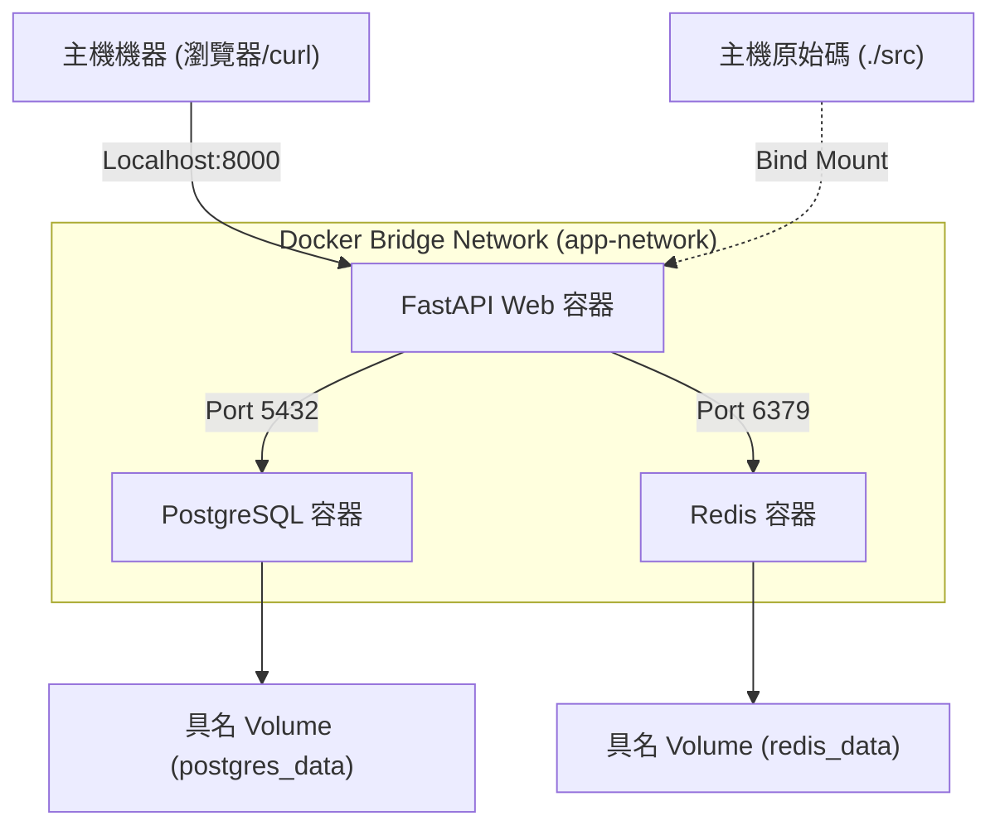
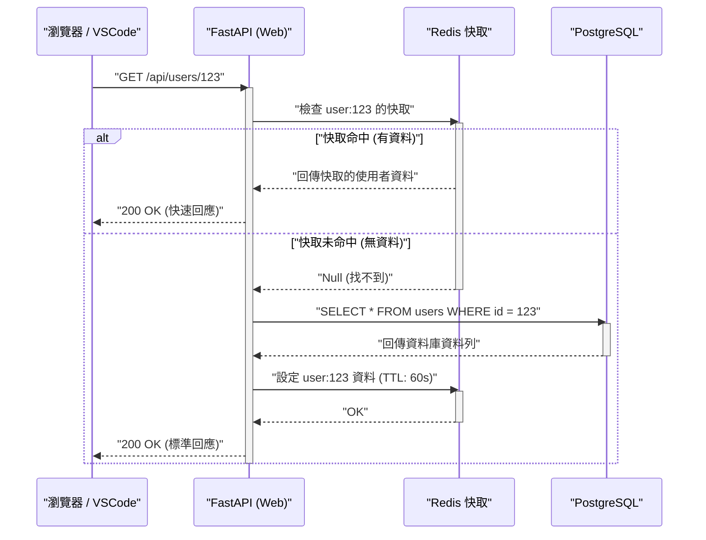

## 1. 前言：擺脫「在我的環境裡明明就能跑」

在軟體開發的現場，因為開發者之間環境不同而導致的「在我的環境裡明明就能跑（It works on my machine）」這個問題，長久以來一直是讓許多專案浪費時間的要因。作業系統的差異、已安裝語言的版本、函式庫的相依性、全域安裝工具的衝突等，本地環境總是暴露在「狀態不確定性」之中。

能從根本解決這些課題的，就是以 **Docker** 為首的容器技術，以及 **Infrastructure as Code (IaC)** 的典範。透過將本地開發環境容器化，可實現在作業系統層級的隔離，並使環境本身能與程式碼庫一起進行版本控制。

本文將運用 Docker、Docker Compose 以及 VSCode DevContainers，為您徹底解說建構**「無論是誰、在何時、用哪台機器啟動，都能獲得分毫不差的相同狀態之可重現本地開發環境」**的步驟，以及其背後深層的技術機制，並會適時穿插數理角度的探討。

---

## 2. Infrastructure as Code (IaC) 與容器技術的契合度

### IaC 的原則與在本地環境的應用

Infrastructure as Code (IaC) 是一種透過機器可讀的定義檔，而非手動流程來管理基礎設施設定與配置（Provisioning）的方法。IaC 的核心原則包含以下要素：

1. **宣告式方法 (Declarative Approach)**：定義「最終應該是什麼狀態」，而非「如何改變狀態」。
2. **冪等性 (Idempotency)**：無論執行多少次腳本，都能保證始終得到相同的結果（狀態）。
3. **版本控制 (Version Control)**：基礎設施的狀態會作為程式碼儲存於 Git 等版本控制系統 (VCS) 中，從而得以追蹤變更歷史與進行同儕審查（Peer Review）。

在本地開發環境中實踐 IaC，意味著使用 `Dockerfile`、`docker-compose.yml` 及 `devcontainer.json` 來將開發環境「應有的樣貌」程式碼化。如此一來，即便是新加入團隊的成員，只需複製（Clone）儲存庫並敲擊一個指令，就能實現立即開始開發的入職（Onboarding）體驗。

### 支撐容器技術的核心功能

容器技術與虛擬機器（VM）等 Hypervisor 類型的虛擬化不同，它是一種共享主機作業系統核心（Kernel）同時將行程隔離（Isolation）的輕量級虛擬化技術。為了實現這一點，主要利用了 Linux 核心的以下功能：

- **Namespaces（命名空間）**：為每個行程提供系統資源（PID、網路、掛載點、使用者等）的獨立視圖。
- **Cgroups (Control Groups, 控制群組)**：對行程可使用的實體資源（CPU、記憶體、磁碟 I/O 等）進行限制與分配。
- **UnionFS (Union File System, 聯合檔案系統)**：將多個目錄樹（層）透明地疊加起來，呈現為單一檔案系統的技術。Docker 的映像檔分層便是依賴此技術。

讓我們來思考資源限制的數學模型。假設主機的總記憶體容量為 $M_{\text{total}}$，並假設在主機上執行的 $n$ 個容器的記憶體限制為 $m_i$。考量主機作業系統及其他行程所消耗的基礎記憶體 $M_{\text{os}}$，系統穩定運作的必要條件可以用以下不等式表示：

$$ \sum_{i=1}^{n} m_i \le M_{\text{total}} - M_{\text{os}} $$

透過利用 Cgroups 嚴格定義每個容器的 $m_i$，即使特定容器發生記憶體洩漏（Memory Leak），也能防止 OOM (Out Of Memory) Killer 導致其他容器或整個主機系統崩潰。

---

## 3. 高效的 Dockerfile 設計：將多階段建置發揮到極致

打造可重現環境的第一步，是設計用來定義應用程式執行環境的 `Dockerfile`。在此將以 Python（FastAPI）為例，解說活用**多階段建置（Multi-stage Build）**的安全且輕量的 Dockerfile 最佳實踐。

多階段建置是在單一 `Dockerfile` 中使用多個 `FROM` 指令，將建置環境（包含編譯器與開發工具的龐大環境）與執行環境（僅包含必要產物的輕量環境）分離的手法。

### 實戰 Python FastAPI 用 Dockerfile

以下程式碼是結合了使用 Poetry 進行相依性管理與多階段建置的進階 `Dockerfile` 範例：

```dockerfile
# ---------------------------------------------------------
# Stage 1: Builder (建置環境)
# ---------------------------------------------------------
FROM python:3.11-slim AS builder

# 設定必要的環境變數
ENV PYTHONUNBUFFERED=1 \
    PYTHONDONTWRITEBYTECODE=1 \
    POETRY_VERSION=1.6.1 \
    POETRY_HOME="/opt/poetry" \
    POETRY_VIRTUALENVS_IN_PROJECT=true \
    POETRY_NO_INTERACTION=1

# 安裝相依套件
RUN apt-get update && apt-get install -y --no-install-recommends \
    curl build-essential && \
    curl -sSL https://install.python-poetry.org | python3 - && \
    apt-get clean && rm -rf /var/lib/apt/lists/*

ENV PATH="$POETRY_HOME/bin:$PATH"

WORKDIR /app

# 複製並安裝相依性檔案
COPY pyproject.toml poetry.lock ./
RUN poetry install --no-root --only main

# ---------------------------------------------------------
# Stage 2: Runtime (執行環境)
# ---------------------------------------------------------
FROM python:3.11-slim AS runtime

ENV PYTHONUNBUFFERED=1 \
    PYTHONDONTWRITEBYTECODE=1 \
    PATH="/app/.venv/bin:$PATH"

# 建立最小權限的非特權使用者
RUN groupadd -r appuser && useradd -r -g appuser appuser

WORKDIR /app

# 僅從 builder 複製虛擬環境（相依性）
COPY --from=builder --chown=appuser:appuser /app/.venv /app/.venv

# 複製應用程式程式碼
COPY --chown=appuser:appuser ./src /app/src

# 切換至非特權使用者
USER appuser

# 容器啟動時的預設指令
ENTRYPOINT ["uvicorn", "src.main:app", "--host", "0.0.0.0", "--port", "8000"]
```

### 透過多階段建置評估映像檔大小的數學分析

假設單一階段建置的映像檔大小為 $S_{\text{single}}$，套用多階段建置後的映像檔大小為 $S_{\text{multi}}$。大小縮減率 $R$ 可透過以下公式計算：

$$ R = \left( 1 - \frac{S_{\text{multi}}}{S_{\text{single}}} \right) \times 100 \ (\%) $$

例如，$S_{\text{single}}$ 包含了作業系統的基礎映像檔（約 110MB）、開發用套件（如 gcc 等約 150MB）、Poetry 本體（約 40MB）、專案的相依函式庫（約 80MB）與原始碼（約 5MB），總計為 385MB。
另一方面，$S_{\text{multi}}$ 僅將相依函式庫（80MB）與原始碼（5MB）複製到基礎映像檔（110MB）中，總計為 195MB。

$$ R = \left( 1 - \frac{195}{385} \right) \times 100 \approx 49.35\% $$

如上所述，藉由導入多階段建置，可以將映像檔大小縮減約一半。映像檔大小的縮減，能直接帶來縮短從 Registry 提取 (Pull) 的時間、節省磁碟空間，以及透過縮小攻擊面（Attack Surface）來提升安全性的好處。

---

## 4. 使用 Docker Compose 進行多容器的編排 (Orchestration)

在現代的 Web 應用程式開發中，Web 伺服器、資料庫、快取伺服器等多個元件協同運作的微服務架構已經非常普遍。為了在本地環境集中管理這些元件，我們使用 `docker-compose.yml`。

本次我們將在本地建置由「Web (FastAPI)」、「Database (PostgreSQL)」、「Cache (Redis)」構成的三層式架構系統。

### 架構圖（Mermaid）

下圖是展示本地機器中各個容器、網路以及 Volume 關係的區塊圖。



### docker-compose.yml 的實作與詳細解說

以下展示足以應對實務環境建置的穩健 `docker-compose.yml` 範例。

```yaml
version: '3.8'

services:
  web:
    build:
      context: .
      target: runtime
    container_name: dev_web
    ports:
      - "8000:8000"
    volumes:
      - ./src:/app/src:ro  # 以唯讀方式掛載主機程式碼（用於熱重載）
    environment:
      - DATABASE_URL=postgresql://postgres:${POSTGRES_PASSWORD}@db:5432/${POSTGRES_DB}
      - REDIS_URL=redis://redis:6379/0
    env_file:
      - .env
    depends_on:
      db:
        condition: service_healthy
      redis:
        condition: service_started
    networks:
      - app-network
    command: ["uvicorn", "src.main:app", "--host", "0.0.0.0", "--port", "8000", "--reload"]

  db:
    image: postgres:15-alpine
    container_name: dev_db
    ports:
      - "5432:5432"
    environment:
      POSTGRES_USER: postgres
      POSTGRES_PASSWORD: ${POSTGRES_PASSWORD}
      POSTGRES_DB: ${POSTGRES_DB}
    volumes:
      - postgres_data:/var/lib/postgresql/data
    networks:
      - app-network
    healthcheck:
      test: ["CMD-SHELL", "pg_isready -U postgres -d ${POSTGRES_DB}"]
      interval: 5s
      timeout: 5s
      retries: 5

  redis:
    image: redis:7-alpine
    container_name: dev_redis
    ports:
      - "6379:6379"
    volumes:
      - redis_data:/data
    networks:
      - app-network
    command: ["redis-server", "--appendonly", "yes"]

volumes:
  postgres_data:
  redis_data:

networks:
  app-network:
    driver: bridge
```

### Volume 與資料的持久化

容器原則上是「無狀態（Stateless）」且「短暫（Ephemeral）」的存在。一旦銷毀容器，內部的資料也會隨之消失。為了保留資料庫的資料或快取，必須將主機機器的檔案系統區域掛載到容器中。

- **綁定掛載 (Bind Mount)**：上述 `web` 服務中的 `./src:/app/src:ro` 即屬此類。將主機的特定目錄直接對映到容器內。用於讓本地程式碼的編輯能立即反映在容器中（熱重載）。從安全的觀點來看，附加 `:ro` (Read-Only, 唯讀) 選項，以防止容器端修改主機的原始碼是最佳實踐。
- **具名 Volume (Named Volume)**：如 `postgres_data` 與 `redis_data` 屬此類。這是 Docker 內部（例如 `/var/lib/docker/volumes/`）管理的區域，擁有比綁定掛載更優秀的 I/O 效能，並能吸收作業系統之間檔案系統的差異。對於資料庫的持久化，務必使用此方式。

### 網路 (Networking) 與服務探索 (Service Discovery)

Docker Compose 預設會為每個專案建立專屬的橋接網路。即是上述的 `app-network`。
屬於同一個網路的容器之間，可以使用「服務名稱（例：`db`, `redis`）」作為主機名稱來進行名稱解析（DNS 解析），而不是使用 IP 位址。
例如，從 Web 容器能以 `postgresql://postgres:password@db:5432/mydb` 這個 URL 存取資料庫。藉由這種方式，無論是在本地環境還是正式環境，都能透過環境變數透明地切換連線目標。

### 健康檢查 (Healthcheck) 與啟動順序控制

`depends_on` 指令會控制容器的啟動順序，但若僅指定 `depends_on`，Web 容器會在「DB 容器已啟動」的階段跟著啟動。由於實際上 DB 的初始化程序（PostgreSQL 的行程啟動或資料表準備）完成需要數秒鐘，因此這可能會導致來自 Web 容器的 DB 連線發生錯誤。
為了防止這種情況發生，可以透過定義 `healthcheck` 並指定 `condition: service_healthy`，確保「DB 已處於能接受連線請求的狀態」後，再啟動 Web 容器。

---

## 5. 環境變數管理與安全性 (.env)

將資料庫密碼或 API 金鑰等機密資訊寫死（Hardcoding）在 `docker-compose.yml` 中，是絕對要避免的反模式（Anti-pattern）。取而代之的是，應使用環境變數檔案 `.env` 來注入這些值。

在專案根目錄建立 `.env` 檔案。

```ini
# .env 檔案 (為了不被 Git 納入版控，請將其加入 .gitignore)
POSTGRES_PASSWORD=supersecretpassword
POSTGRES_DB=devdb
API_SECRET_KEY=dev_secret_key_12345
```

Docker Compose 預設會讀取執行目錄下的 `.env` 檔案，並將 YAML 檔案中的 `${VAR_NAME}` 佔位符展開。透過這個方法，我們就能針對本地、測試（Staging）及正式等不同環境，安全地管理不同的設定值，而無須修改基礎設施的程式碼。

---

## 6. VSCode DevContainers 帶來的終極開發體驗

到目前為止，我們已經建構了使用 Docker 的穩健後端環境。然而，我們還能更進一步。使用 **VSCode DevContainers (Remote - Containers)** 功能，便能將編輯器（VSCode）本身的後端執行於容器內部。

這樣一來，本地機器連 Python 或 Node.js 都不需要安裝，從 Linter（flake8/eslint）與格式化工具（black/prettier），到 IDE 的擴充功能，全都可以定義在程式碼庫中讓團隊所有人共享。

### devcontainer.json 設定

在專案根目錄建立 `.devcontainer` 目錄，並將設定檔放置其中。

`.devcontainer/devcontainer.json`:
```json
{
  "name": "Python FastAPI Dev Environment",
  "dockerComposeFile": ["../docker-compose.yml"],
  "service": "web",
  "workspaceFolder": "/app",
  "customizations": {
    "vscode": {
      "settings": {
        "python.defaultInterpreterPath": "/app/.venv/bin/python",
        "python.formatting.provider": "black",
        "editor.formatOnSave": true
      },
      "extensions": [
        "ms-python.python",
        "ms-python.vscode-pylance",
        "ms-python.black-formatter",
        "tamasfe.even-better-toml"
      ]
    }
  },
  "forwardPorts": [8000, 5432, 6379],
  "remoteUser": "appuser",
  "postCreateCommand": "poetry install"
}
```

只要將這個檔案包含在儲存庫中，在用 VSCode 開啟專案的瞬間就會顯示「Reopen in Container」的提示，只需點擊它，所有需要的容器就會啟動、擴充功能也會安裝完畢，立刻進入可以開始撰寫程式碼的狀態。這簡直是如魔法般的體驗。

---

## 7. 請求處理的時序與效能建模

我們將透過時序圖來確認所建構的本地開發環境中，Web 應用程式處理請求的生命週期，並探討其效能的數學模型。

### 時序圖（請求流程）



### 處理延遲（Latency）的數學模型

我們將針對上述系統的平均請求處理時間 $T_{\text{total}}$ 進行數學建模。
將各項處理的延遲定義如下：
- $T_{\text{net}}$：客戶端與 Web 容器之間的網路延遲
- $T_{\text{app}}$：應用程式端的純粹處理時間（如序列化等）
- $T_{\text{cache}}$：向 Redis 讀取與寫入所花費的時間
- $T_{\text{db}}$：向 PostgreSQL 執行查詢所花費的時間
- $p_{\text{miss}}$：快取未命中率（$0 \le p_{\text{miss}} \le 1$）

此時，平均回應時間可以透過以下期望值計算公式來表示：

$$ T_{\text{total}} = T_{\text{net}} + T_{\text{app}} + T_{\text{cache}} + p_{\text{miss}} \times (T_{\text{db}} + T_{\text{cache\_write}}) $$

在本地開發環境（Docker 內），$T_{\text{net}}$ 幾乎接近 0，但值得注意的是**綁定掛載時的 I/O 效能**。尤其是在 Windows/macOS 上使用 Docker Desktop 的情況下，因為主機作業系統與 VM（容器）之間的檔案共享額外開銷 (Overhead)，$T_{\text{app}}$（程式碼讀取時間等）往往會有變得龐大的趨勢。為了解決這個效能瓶頸，強烈建議利用前述的 DevContainers 將整個原始碼配置到具名 Volume 中，或是採用在 WSL2（Windows Subsystem for Linux 2）環境中原生執行 Docker 引擎的架構。

---

## 8. Docker 建置效能最佳化：分層快取 (Layer Cache) 策略

在撰寫 Dockerfile 時，是否理解「分層快取 (Layer Cache)」的機制，會讓建置時間有著戲劇性的變化。
Docker 會針對 Dockerfile 的每一個指令（如 `FROM`、`RUN`、`COPY` 等）建立檔案系統的差異（層次），並作為快取保留。在重新建置時，若該層未發生變更，便會重複利用快取。

重要的原則是：**「從變更頻率較低的項目開始依序撰寫」**。

我們來思考原始碼變更對建置時間帶來影響的模型化。假設總建置時間為 $T_{\text{build}}$，每個步驟的執行時間為 $T_{\text{layer}_i}$，快取命中有無的布林值為 $c_i \in \{0, 1\}$（命中時為 1）。

$$ T_{\text{build}} = T_{\text{init}} + \sum_{i=1}^{n} (1 - c_i) \times T_{\text{layer}_i} $$

一旦在第 $k$ 層發生快取未命中（$c_k = 0$），其後所有第 $j > k$ 層的快取也都會失效（$c_j = 0$）。

```dockerfile
# 錯誤範例 (先複製了原始碼)
COPY ./src /app/src
COPY pyproject.toml poetry.lock ./
RUN poetry install
```
在上述情況下，只要修改了一行程式碼，第一個 `COPY` 就會發生快取未命中，導致每次都必須執行耗時的 `RUN poetry install`。

```dockerfile
# 良好範例 (先進行相依性的解析)
COPY pyproject.toml poetry.lock ./
RUN poetry install
COPY ./src /app/src
```
只要照這樣撰寫，即使變更了原始碼，`poetry install` 的分層快取（$c_i = 1$）依然有效，建置時間將會從幾分鐘劇減為幾秒鐘。

---

## 9. 疑難排解與 Tips

以下列舉在操作本地環境時常遇到的問題與解決方案。

1. **連接埠衝突錯誤**
   如果出現類似 `Bind for 0.0.0.0:8000 failed: port is already allocated` 的錯誤，表示本地機器上有其他行程正在使用該連接埠。可以透過將主機端的連接埠號碼修改為類似 `ports: - "8080:8000"` 來避免此問題。

2. **磁碟空間耗盡**
   若長時間使用 Docker，未使用的映像檔或 Volume（Dangling Images / Volumes）會不斷累積，甚至可能佔用數十 GB 的磁碟空間。建議定期使用以下指令清理系統：
   ```bash
   docker system prune -a --volumes
   ```

3. **檔案權限問題**
   在 Linux 環境使用綁定掛載時，容器內建立的檔案擁有者會變成 `root`，有時會導致主機端無法編輯。這可以透過在 Dockerfile 中建立非特權使用者，並使其與主機作業系統自身的 UID/GID（例：1000:1000）一致來解決。

---

## 10. 結語：可重現性所帶來的開發速度提升

透過結合 Docker、Docker Compose 以及 VSCode DevContainers，便能實現「無論是誰啟動環境，都會是完全相同狀態」的穩健本地開發環境。

將 IaC 的典範引進本地環境，不僅僅是縮短了最初的環境設置時間而已。它消除了對更改基礎設施設定的擔憂，讓測試新技術堆疊變得更加容易，並能順利過渡到 CI/CD 管道等，讓整個開發週期的速度與品質都獲得飛躍性的提升。

敬請活用本文所解說的最佳實踐，如透過多階段建置將映像檔大小最佳化、使用健康檢查控制相依性，以及意識到分層快取來撰寫 Dockerfile 等，為您自己的專案也引進最棒的開發者體驗（DX: Developer Experience）吧。
