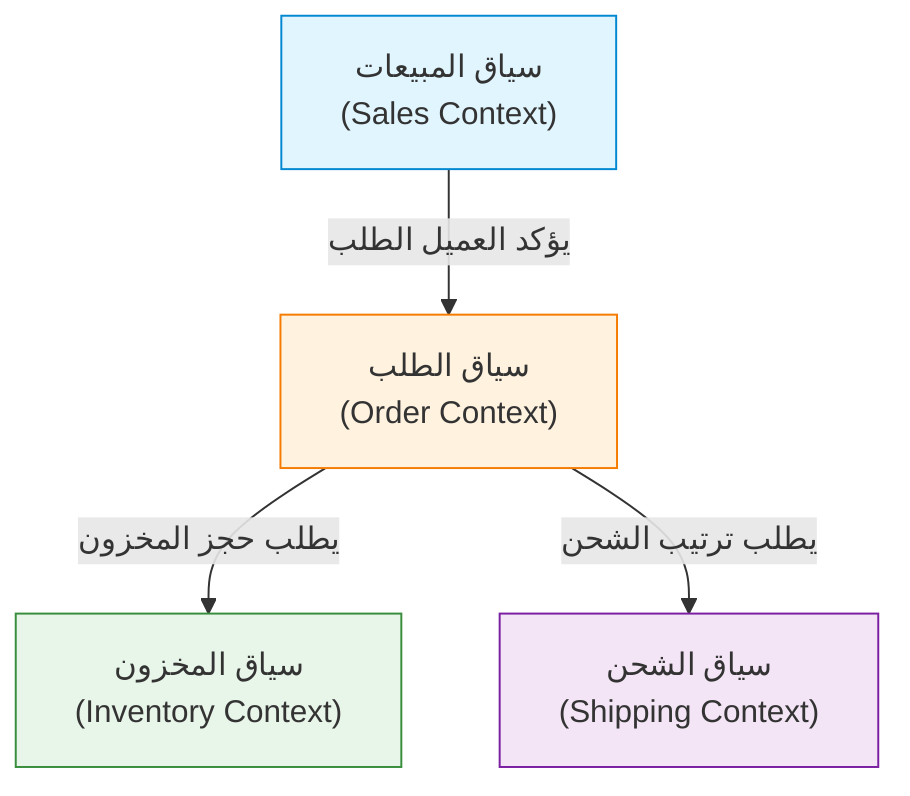

في تطوير البرمجيات، يكمن التحدي الأصعب والأكثر أهمية في "الفهم الدقيق للمتطلبات وترجمتها إلى كود". العديد من المشاريع تفشل ليس بسبب الصعوبة التقنية، بل بسبب انقطاع التواصل بين فريق التطوير وخبراء المجال (الخبراء في مجال الأعمال). هناك نهج قوي لحل هذا الانقطاع وإدارة تعقيد البرمجيات، وهو "التصميم الموجه بالمجال (Domain-Driven Design, DDD)" الذي اقترحه إريك إيفانز.

في هذا المقال، سنسلط الضوء على "اللغة المنتشرة (Ubiquitous Language)"، والتي تعد المفهوم المركزي في DDD، وسنتعمق في كيفية كسر حاجز اللغة بين المطورين وخبراء المجال لبناء برمجيات ذات قيمة أعمال عالية.

## 1. جوهر البرمجيات والتعقيد

يذكر إريك إيفانز في كتابه 'التصميم الموجه بالمجال لإريك إيفانز' أن "جوهر البرمجيات هو عكس تعقيدها في نموذج المجال (مجال الأعمال)".

في العديد من بيئات التطوير، يُخصص الكثير من الوقت للجوانب التقنية مثل تصميم قواعد البيانات، واختيار أطر العمل (Frameworks)، وبناء البنية التحتية. ومع ذلك، فإن المشكلة الأساسية التي يجب أن تحلها البرمجيات تكمن في "مجال الأعمال". إذا كان النظام مالياً، فإن مفاهيم مثل "الحساب" و"المعاملة" هي المجال. وفي نظام الخدمات اللوجستية، تكون مفاهيم مثل "طرق التوصيل" و"المخزون" هي المجال.

يمكن تقسيم تعقيد البرمجيات إلى تعقيد تقني وتعقيد المجال. أصبح من الممكن السيطرة على التعقيد التقني إلى حد ما بفضل تطور الأدوات والأنماط، لكن تعقيد المجال هو تعقيد الأعمال نفسها، ولا يمكن تجنبه. إن مواجهة تعقيد المجال هذا وجهاً لوجه والتعبير عنه كنموذج برمجي هو الهدف الأسمى لـ DDD.

## 2. فخ الترجمة

في أساليب التطوير التقليدية، يتحدث خبراء المجال والمطورون لغات مختلفة.

- **خبراء المجال:** يتحدثون باستخدام مصطلحات خاصة بالعمل مثل تدفق الأعمال، وقواعد الأعمال، ومتطلبات العملاء.
- **المطورون:** يتحدثون باستخدام مصطلحات تقنية مثل الفئات (Classes)، الجداول (Tables)، الأعمدة (Columns)، واجهات برمجة التطبيقات (API)، والمعالجة غير المتزامنة (Asynchronous processing).

عندما تتحدث هاتان المجموعتان، تتم "الترجمة" ضمنياً. عندما يقول خبير المجال "يضع العميل المنتج في العربة ويدفع"، يترجم المطور ذلك في ذهنه إلى "استرجاع سجل من جدول Customer، وإضافة Item إلى كائن Cart، واستدعاء PaymentService".

يؤدي وجود طبقة الترجمة هذه إلى حدوث المشكلات التالية:

1. **فقدان المعلومات وسوء الفهم:** أثناء عملية الترجمة، تضيع الفروق الدقيقة المهمة في الأعمال أو يتم تفسيرها بشكل خاطئ.
2. **انحراف النموذج:** تنحرف متطلبات العمل عن التنفيذ البرمجي، مما يجعل من الصعب تعديل الكود استجابة لتغيرات الأعمال.
3. **تأخير التواصل:** في كل مرة يتم فيها تأكيد المتطلبات أو الإبلاغ عن الأخطاء، تكون هناك حاجة إلى تحويل المصطلحات، مما يزيد من تكلفة التواصل.

## 3. اللغة المنتشرة: لغة مشتركة تكسر الجدار

الحل للخروج من فخ الترجمة هذا هو "اللغة المنتشرة (Ubiquitous Language)". اللغة المنتشرة هي لغة دقيقة تعتمد على نموذج المجال ويستخدمها كل من خبراء المجال والمطورين بشكل مشترك.

اللغة المنتشرة ليست مجرد مسرد مصطلحات (Glossary). إنها لغة حية تُستخدم "بشكل منتشر (Ubiquitous)" في المحادثات، والوثائق، وفي جميع أنحاء الكود المصدري.

### 3.1 توحيد المحادثات إلى كود

عند إدخال اللغة المنتشرة، يتغير تواصل فريق التطوير على النحو التالي:

**قبل التغيير:**
خبير المجال: "إذا ألغى المستخدم اشتراكه، تأكد من عدم ظهور بياناته على الشاشة."
المطور: "سأقوم بتعيين علامة is_deleted إلى true في جدول User وتصفيتها باستخدام استعلام SELECT."

**بعد التغيير (باستخدام اللغة المنتشرة):**
خبير المجال: "إذا انسحب (Withdraw) العميل، يصبح عقد (Contract) ذلك العميل في حالة إنهاء (Terminate)."
المطور: "فهمت. سأقوم باستدعاء طريقة withdraw في فئة Customer وتغيير حالة العقد (Contract) المرتبط إلى Terminate."

وبهذه الطريقة، باستخدام خبراء المجال والمطورين لنفس الكلمات (Customer, Withdraw, Contract, Terminate)، لا مجال لسوء الفهم. والأهم من ذلك أن هذه الكلمات **تنعكس مباشرة في الكود**.

```typescript
class Customer {
    private status: CustomerStatus;
    private contracts: Contract[];

    public withdraw(): void {
        this.status = CustomerStatus.WITHDRAWN;
        for (const contract of this.contracts) {
            contract.terminate();
        }
    }
}
```

بقراءة الكود يمكنك فهم قواعد العمل، والحديث عن قواعد العمل يصبح تصميم الكود نفسه. هذه هي القوة الحقيقية للغة المنتشرة.

### 3.2 التطور المستمر للمصطلحات والنماذج

اللغة المنتشرة لا تنتهي بمجرد تحديدها. مع تقدم المشروع، يتعمق فهم كل من خبراء المجال والمطورين للمجال. ستكون هناك دائماً اكتشافات مثل: "ألا تعبر هذه الكلمة عن العمل الفعلي بدقة؟" أو "هذا المفهوم يتضمن معنيين مختلفين".

في ذلك الوقت، من الضروري تنقيح اللغة المنتشرة، وفي الوقت نفسه إعادة هيكلة (Refactoring) النموذج والكود. إذا تغير تعريف الكلمة، سيتم تغيير أسماء الفئات والأساليب بلا رحمة. هذه الحلقة المستمرة من التغذية الراجعة هي المفتاح للحفاظ على تكييف البرمجيات مع واقع الأعمال.

## 4. المأساة الناتجة عن الانفصال بين أسماء جداول قواعد البيانات ومتطلبات الأعمال

إذا قمت بتصميم البرمجيات بالتركيز على نموذج البيانات (تصميم جداول قاعدة البيانات) دون استخدام اللغة المنتشرة، ستحدث مشاكل خطيرة. يُطلق على هذا أحياناً "التصميم الموجه بالبيانات" أو "فخ نصوص المعاملات (Transaction Script)".

على سبيل المثال، لنفترض أنك قمت بإنشاء جدول يسمى "منتج (Product)" في موقع للتجارة الإلكترونية. في البداية قد يسير الأمر على ما يرام، ولكن مع توسع الأعمال، ستقع في المواقف التالية:

- منتج يتطلب شحناً مادياً
- محتوى رقمي قابل للتنزيل
- حقوق الاشتراك الدوري (Subscription)
- تذاكر الفعاليات

إذا حاولت إجبار كل هذه العناصر في "جدول Product" واحد، سيصبح الجدول ضخماً، وممتلئاً بعدد لا يحصى من الأعمدة التي تقبل القيم الفارغة (NULL) والعلامات المعقدة (مثل `is_digital`، `has_shipping`).

سيقول جانب الأعمال: "نريد تغيير قواعد تسليم المحتوى الرقمي"، وسيرد جانب التطوير: "شروط العلامات في جدول Product معقدة للغاية، ولا يمكننا تحديد نطاق التأثير، لذا سيستغرق التعديل شهراً". نظراً لانفصال مفاهيم الأعمال عن هيكل البيانات، فإن أدنى تغيير في متطلبات الأعمال سيكون له تأثير مدمر على النظام.

في DDD، لمنع مثل هذه المآسي، يتم إجراء النمذجة بالتركيز على "السلوك (Behavior)" و"مفاهيم الأعمال" بدلاً من "البيانات".

## 5. السياق المقيد (Bounded Context)

إذا حاولت توحيد اللغة المنتشرة كنموذج ضخم واحد للنظام بأكمله، فمن المؤكد أنها ستفشل. السبب في ذلك هو أن نفس الكلمة لها معانٍ مختلفة في سياقات الأعمال المختلفة.

على سبيل المثال، دعونا نفكر في كلمة "منتج (Product)".

- **سياق المبيعات (Sales):** المنتج هو شيء له سعر، ويكون خاضعاً للتخفيضات، وهدفه جذب العملاء.
- **سياق المخزون (Inventory):** المنتج هو عنصر إدارة مادي يحدد مكانه في المستودع، والكمية المتبقية منه، ومتى يجب تجديده.
- **سياق الشحن (Shipping):** المنتج هو عنصر نقل له وزن وأبعاد، ويحدد حجم الصندوق الذي سيدخل فيه.

إذا دمجت كل هذه المتطلبات في فئة `Product` واحدة، ستنشئ "فئة إلهية (God Class)" حيث تختلط متطلبات كل قسم.

لذلك، يقدم DDD مفهوم **السياق المقيد (Bounded Context)**. هذا المفهوم يحدد "الحدود" التي يتم فيها تطبيق لغة منتشرة ونموذج معين بشكل كامل.



يمكن أن يكون لكل سياق فئة `Product` الخاصة به. `Product` في سياق المبيعات يحتوي على معلومات السعر، و `Product` في سياق الشحن يحتوي على معلومات الوزن. يتيح هذا بقاء النماذج بسيطة، ويمكّن الفِرق من متابعة التطوير بشكل مستقل دون التأثر بمتطلبات الفِرق الأخرى.

السياق المقيد هو أيضاً دليل قوي عند اعتماد بنية الخدمات المصغرة (Microservices Architecture) في الأنظمة الكبيرة. من خلال جعل حدود السياق هي حدود الخدمة، يمكنك تحقيق بنية ذات تماسك عالٍ (High Cohesion) واقتران منخفض (Loose Coupling).

## 6. الخلاصة: التنسيق من خلال اللغة

التصميم الموجه بالمجال (DDD) ليس مجرد نمط بنية تقنية. إنه فلسفة ترتقي بنشاط تطوير البرمجيات إلى عملية "استكشاف وتعبير عن الأعمال".

بناء لغة منتشرة والتحدث بنفس اللغة بين خبراء المجال والمطورين. وعكس تلك اللغة في كل زاوية من زوايا الكود دون مساومة. تحديد السياق المقيد بشكل صحيح والحفاظ على نقاء النموذج.

من خلال هذه الممارسات، يمكننا التوقف عن بناء جبال من الديون التقنية، وإنشاء برمجيات مرنة للتغيير وتكون قوة حقيقية للأعمال. الخطوة الأولى لكسر حاجز اللغة تبدأ بالاستماع بعمق للكلمات التي يقولها خبير المجال في اجتماع الغد.
