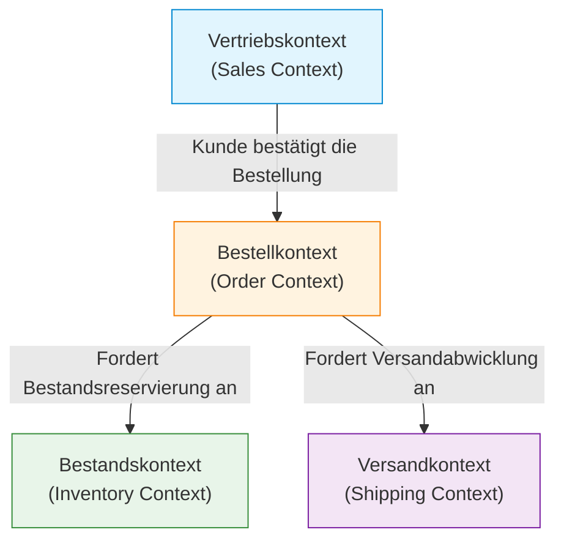

In der Softwareentwicklung ist die schwierigste und gleichzeitig wichtigste Herausforderung, "die Anforderungen genau zu verstehen und sie in Code zu übersetzen". Der Grund, warum viele Projekte scheitern, liegt nicht in der technischen Schwierigkeit, sondern in der gestörten Kommunikation zwischen dem Entwicklungsteam und den Fachexperten (Domain Experts). Ein starker Ansatz zur Beseitigung dieser Trennung und zur Beherrschung der Softwarekomplexität ist das von Eric Evans vorgeschlagene "Domain-Driven Design (DDD)".

In diesem Artikel konzentrieren wir uns auf die "Ubiquitous Language" (Allgegenwärtige Sprache), ein zentrales Konzept von DDD. Wir werden tiefgründig untersuchen, wie man die Sprachbarriere zwischen Entwicklern und Fachexperten durchbrechen und Software mit hohem Geschäftswert entwickeln kann.

## 1. Der Kern und die Komplexität von Software

Eric Evans stellt in seinem Buch "Domain-Driven Design" fest: "Das Herzstück von Software ist ihre Fähigkeit, die Komplexität der Domäne (des Geschäftsbereichs) in Modellen widerzuspiegeln."

In vielen Entwicklungsumgebungen wird viel Zeit für technische Aspekte wie Datenbankdesign, Framework-Auswahl und den Aufbau der Architektur aufgewendet. Die eigentlichen Probleme, die Software jedoch lösen soll, liegen in der "Geschäftsdomäne". In einem Finanzsystem sind Konzepte wie "Konto" oder "Transaktion" die Domäne, in einem Logistiksystem sind es "Lieferroute" oder "Bestand".

Die Komplexität von Software lässt sich in technische Komplexität und Domänenkomplexität unterteilen. Während technische Komplexität durch die Weiterentwicklung von Werkzeugen und Mustern bis zu einem gewissen Grad kontrollierbar geworden ist, kann die Domänenkomplexität nicht vermieden werden, da sie die Komplexität des Geschäfts selbst darstellt. Sich dieser Domänenkomplexität direkt zu stellen und sie als Softwaremodell auszudrücken, ist das Hauptziel von DDD.

## 2. Die Falle der Übersetzung

Bei herkömmlichen Entwicklungsmethoden sprachen Fachexperten und Entwickler unterschiedliche Sprachen.

- **Fachexperten:** Sprechen in geschäftsspezifischen Begriffen wie Arbeitsabläufen, Geschäftsregeln und Kundenanforderungen.
- **Entwickler:** Sprechen in technischen Begriffen wie Klassen, Tabellen, Spalten, APIs und asynchroner Verarbeitung.

Wenn sich diese beiden Gruppen unterhalten, findet implizit eine "Übersetzung" statt. Wenn der Fachexperte sagt: "Der Kunde legt das Produkt in den Warenkorb und bezahlt", übersetzt der Entwickler in seinem Kopf: "Einen Datensatz aus der Customer-Tabelle abrufen, ein Item zum Cart-Objekt hinzufügen und den PaymentService aufrufen."

Durch die Existenz dieser Übersetzungsebene entstehen folgende Probleme:

1. **Informationsverlust und Missverständnisse:** Während des Übersetzungsprozesses gehen wichtige geschäftliche Nuancen verloren oder werden falsch interpretiert.
2. **Abweichung des Modells:** Die geschäftlichen Anforderungen und die Software-Implementierung weichen voneinander ab, was es schwierig macht, den Code bei geschäftlichen Änderungen anzupassen.
3. **Verzögerungen in der Kommunikation:** Bei jeder Bestätigung von Anforderungen oder Meldung von Fehlern müssen Begriffe konvertiert werden, was die Kommunikationskosten erhöht.

## 3. Ubiquitous Language: Die gemeinsame Sprache, die Mauern einreißt

Die Lösung, um dieser Übersetzungsfalle zu entkommen, ist die "Ubiquitous Language" (Allgegenwärtige Sprache). Die Ubiquitous Language ist eine strikte, auf dem Domänenmodell basierende Sprache, die von Fachexperten und Entwicklern gemeinsam verwendet wird.

Die Ubiquitous Language ist nicht nur ein Glossar. Es ist eine lebendige Sprache, die in Gesprächen, Dokumentationen und überall im Quellcode "allgegenwärtig" (ubiquitous) verwendet wird.

### 3.1 Vereinheitlichung vom Gespräch bis zum Code

Die Einführung der Ubiquitous Language verändert die Kommunikation im Entwicklungsteam wie folgt:

**Vorher:**
Fachexperte: "Wenn ein Benutzer sein Konto löscht, stelle sicher, dass seine Daten nicht mehr auf dem Bildschirm erscheinen."
Entwickler: "Ich werde das is_deleted-Flag in der User-Tabelle auf true setzen und mit einer SELECT-Abfrage filtern."

**Nachher (mit Ubiquitous Language):**
Fachexperte: "Wenn ein Kunde austritt (Withdraw), geht sein Vertrag (Contract) in den Status 'Beendet' (Terminate) über."
Entwickler: "Verstanden. Ich rufe die withdraw-Methode der Customer-Klasse auf und ändere den Status des zugehörigen Contracts auf Terminate."

Auf diese Weise verwenden Fachexperten und Entwickler dieselben Wörter (Customer, Withdraw, Contract, Terminate), sodass kein Raum für Missverständnisse bleibt. Noch wichtiger ist, dass diese Wörter **direkt im Code widergespiegelt werden**.

```typescript
class Customer {
    private status: CustomerStatus;
    private contracts: Contract[];

    public withdraw(): void {
        this.status = CustomerStatus.WITHDRAWN;
        for (const contract of this.contracts) {
            contract.terminate();
        }
    }
}
```

Liest man den Code, versteht man die Geschäftsregeln, und wenn man über Geschäftsregeln spricht, wird dies direkt zum Softwaredesign. Das ist die wahre Kraft der Ubiquitous Language.

### 3.2 Kontinuierliche Weiterentwicklung von Begriffen und Modellen

Die Ubiquitous Language ist nicht endgültig, wenn sie einmal festgelegt wurde. Im Laufe des Projekts vertieft sich das Verständnis der Domäne sowohl bei den Fachexperten als auch bei den Entwicklern. Man macht unweigerlich Entdeckungen wie: "Dieser Begriff spiegelt das tatsächliche Geschäft vielleicht nicht genau wider" oder "Dieses Konzept beinhaltet zwei verschiedene Bedeutungen".

In solchen Fällen muss die Ubiquitous Language verfeinert werden, und gleichzeitig müssen auch das Modell und der Code einem Refactoring unterzogen werden. Wenn sich die Definition eines Wortes ändert, werden auch Klassen- und Methodennamen gnadenlos geändert. Diese kontinuierliche Feedbackschleife ist der Schlüssel, um die Software ständig an die Realität des Geschäfts anzupassen.

## 4. Die Tragödie, die durch die Trennung von DB-Tabellennamen und Geschäftsanforderungen entsteht

Wenn man eine Software hauptsächlich um das Datenmodell (DB-Tabellendesign) herum entwirft, ohne eine Ubiquitous Language zu verwenden, treten ernsthafte Probleme auf. Dies wird auch "datengetriebenes Design" oder die "Falle des Transaktionsskripts" genannt.

Angenommen, man erstellt in einer E-Commerce-Seite eine Tabelle namens "Produkt" (Product). Anfangs mag das gut funktionieren, aber wenn das Geschäft wächst, kommt es zu folgenden Situationen:

- Physisch gelieferte Produkte
- Herunterladbare digitale Inhalte
- Abonnementsrechte
- Tickets für Veranstaltungen

Wenn man versucht, all dies in eine einzige "Product-Tabelle" zu zwingen, wird die Tabelle riesig und überflutet mit unzähligen Nullable-Spalten und komplexen Flags (z. B. `is_digital`, `has_shipping`).

Die Geschäftsseite sagt vielleicht: "Wir möchten die Lieferregeln für digitale Inhalte ändern", aber die Entwicklung antwortet: "Die Flag-Bedingungen in der Product-Tabelle sind zu komplex, wir können die Auswirkungen nicht abschätzen, daher wird die Änderung einen Monat dauern." Da Geschäftskonzepte und Datenstrukturen voneinander abweichen, können selbst geringfügige Änderungen der Geschäftsanforderungen verheerende Auswirkungen auf das System haben.

In DDD modelliert man, um solche Tragödien zu verhindern, nicht um "Daten" herum, sondern konzentriert sich auf "Verhalten" (Behavior) und "Geschäftskonzepte".

## 5. Bounded Context (Abgegrenzter Kontext)

Der Versuch, die Ubiquitous Language als ein riesiges, einheitliches Modell für das gesamte System zu etablieren, wird zwangsläufig scheitern. Das liegt daran, dass dasselbe Wort in unterschiedlichen geschäftlichen Kontexten unterschiedliche Bedeutungen haben kann.

Betrachten wir zum Beispiel das Wort "Produkt" (Product).

- **Vertriebskontext (Sales):** Ein Produkt hat einen Preis, kann im Angebot sein und ist ein Objekt, das dem Kunden attraktiv präsentiert werden soll.
- **Bestandskontext (Inventory):** Ein Produkt ist ein physisch verwaltetes Objekt, bei dem es darum geht, wo es im Lager liegt, wie viele noch da sind und wann nachbestellt werden muss.
- **Versandkontext (Shipping):** Ein Produkt ist ein zu transportierendes Objekt mit Gewicht und Abmessungen, das bestimmt, in welche Kartongröße es passt.

Würde man all dies in einer einzigen `Product`-Klasse zusammenfassen, entstünde eine God Class (Gott-Klasse), in der sich die Anforderungen aller Abteilungen vermischen.

Deshalb führt DDD das Konzept des **Bounded Context** (Abgegrenzter Kontext) ein. Dieser definiert die "Grenze", innerhalb derer eine bestimmte Ubiquitous Language und ein bestimmtes Modell vollständig gelten.



In jedem Kontext kann es eine eigene `Product`-Klasse geben. Das `Product` im Vertriebskontext enthält Preisinformationen, während das `Product` im Versandkontext Gewichtsinformationen enthält. Dadurch bleiben die Modelle einfach, und die Teams können unabhängig voneinander entwickeln, ohne von den Anforderungen anderer Teams beeinflusst zu werden.

Der Bounded Context ist auch ein starker Leitfaden für die Einführung einer Microservices-Architektur in großen Systemen. Indem die Grenzen des Kontexts als Grenzen der Dienste definiert werden, lässt sich eine Architektur mit hoher Kohäsion und loser Kopplung realisieren.

## 6. Zusammenfassung: Koordination durch Sprache

Domain-Driven Design (DDD) ist nicht nur ein technisches Architekturmuster. Es ist eine Philosophie, die die Aktivität der Softwareentwicklung zu einem Prozess der "Erforschung und Darstellung des Geschäfts" erhebt.

Die Etablierung einer Ubiquitous Language, bei der Fachexperten und Entwickler dieselbe Sprache sprechen. Das kompromisslose Spiegeln dieser Sprache in jedem Winkel des Codes. Das korrekte Erkennen der Bounded Contexts und das Bewahren der Reinheit des Modells.

Durch diese Praktiken können wir aufhören, Berge von technischen Schulden anzuhäufen, und stattdessen anpassungsfähige Software schaffen, die dem Geschäft wirklich zugutekommt. Der erste Schritt, um die Sprachbarriere einzureißen, beginnt damit, in der morgigen Besprechung genau auf die Worte der Fachexperten zu hören.
