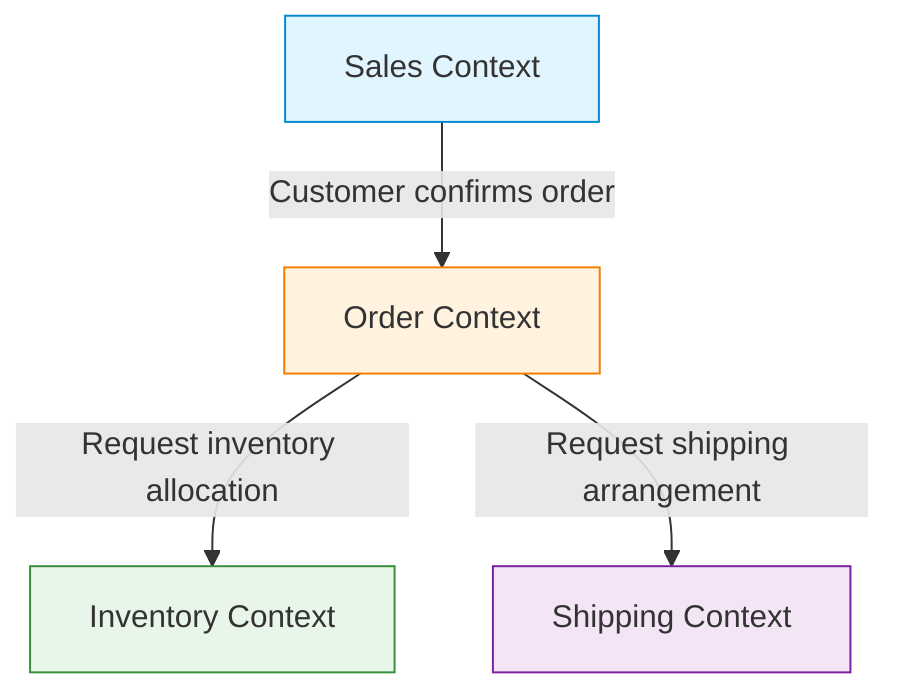

In software development, the most difficult and yet most important challenge is "accurately understanding requirements and reflecting them in code." The reason many projects fail is not due to technical difficulty, but a breakdown in communication between the development team and domain experts (business specialists). A powerful approach to resolve this disconnect and manage software complexity is "Domain-Driven Design (DDD)," advocated by Eric Evans.

This article focuses on "Ubiquitous Language," a central concept of DDD, and delves deeply into how to break down the language barrier between developers and domain experts to build software with high business value.

## 1. The Core of Software and Complexity

In his book *Domain-Driven Design*, Eric Evans states, "The core of software is reflecting its complexity into the model of the domain (business area)."

In many development environments, a lot of time is spent on technical aspects such as database design, framework selection, and architecture construction. However, the true problems that software must solve exist in the "business domain." For a financial system, concepts like "Account" or "Transaction" are the domain, while for a logistics system, it's concepts like "Delivery Route" or "Inventory."

Software complexity can be divided into technical complexity and domain complexity. Technical complexity has become somewhat controllable through the evolution of tools and patterns, but domain complexity is the complexity of the business itself, making it unavoidable. Facing this domain complexity head-on and expressing it as a software model is the primary goal of DDD.

## 2. The Trap of Translation

In traditional development methodologies, domain experts and developers spoke different languages.

- **Domain Experts:** Speak using business-specific terminology, such as business flows, business rules, and customer requirements.
- **Developers:** Speak using technical terminology, such as classes, tables, columns, APIs, and asynchronous processing.

When these two groups converse, a "translation" occurs implicitly. When a domain expert says, "A customer adds a product to the cart and checks out," the developer mentally translates this to "Retrieve a record from the Customer table, add an Item to the Cart object, and call the PaymentService."

The existence of this translation layer causes the following problems:

1. **Information Loss and Misunderstanding:** Important business nuances are lost or misinterpreted during the translation process.
2. **Model Divergence:** Business requirements and software implementation diverge, making it difficult to change the code in response to business changes.
3. **Communication Delays:** Terminology must be converted every time requirements are confirmed or bugs are reported, increasing communication costs.

## 3. Ubiquitous Language: The Common Language that Breaks the Barrier

The solution to escape this translation trap is "Ubiquitous Language." Ubiquitous Language is a rigorous language based on the domain model, used in common by both domain experts and developers.

Ubiquitous Language is not merely a glossary. It is a living language that is used pervasively ("Ubiquitous") throughout conversations, documents, and source code.

### 3.1 Unification from Conversation to Code

When Ubiquitous Language is introduced, the development team's communication changes as follows:

**Before Change:**
Domain Expert: "When a user unregisters, make sure their data doesn't appear on the screen."
Developer: "I'll set the is_deleted flag in the User table to true and filter it in the SELECT query."

**After Change (Using Ubiquitous Language):**
Domain Expert: "When a customer withdraws, that customer's contract goes into a terminate state."
Developer: "Understood. I'll call the withdraw method of the Customer class and change the status of the related Contract to Terminate."

By using the same vocabulary (Customer, Withdraw, Contract, Terminate) in this way, there is no room for misunderstanding between domain experts and developers. Even more importantly, these words are **reflected directly into the code**.

```typescript
class Customer {
    private status: CustomerStatus;
    private contracts: Contract[];

    public withdraw(): void {
        this.status = CustomerStatus.WITHDRAWN;
        for (const contract of this.contracts) {
            contract.terminate();
        }
    }
}
```

Reading the code reveals the business rules, and talking about the business rules directly becomes the code design. This is the true power of Ubiquitous Language.

### 3.2 Continuous Evolution of Terms and Models

Ubiquitous Language is not something you decide once and are done with. As the project progresses, both domain experts and developers deepen their understanding of the domain. You will inevitably make discoveries like, "Doesn't this word inaccurately represent the actual business?" or "This concept has ended up encompassing two different meanings."

At such times, you must refine the Ubiquitous Language while simultaneously refactoring the model and code. If the definition of a word changes, class names and method names must also be changed without hesitation. This continuous feedback loop is the key to keeping the software adapted to business reality.

## 4. The Tragedy Born of Divergence Between DB Table Names and Business Requirements

If you design software centered around the data model (DB table design) without using a Ubiquitous Language, serious problems arise. This is sometimes called "data-driven design" or the "trap of transaction scripts."

For example, imagine you created a "Product" table for an e-commerce site. It might work well at first, but as the business expands, you fall into situations like the following:

- Products involving physical shipping
- Downloadable digital content
- Subscription rights
- Event tickets

If you try to cram all of these into a single "Product" table, the table becomes massive, overflowing with countless nullable columns and complex flags (like `is_digital`, `has_shipping`).

While the business side says, "We want to change the delivery rules for digital content," the development side ends up replying, "The flag conditions in the Product table are so complex that we can't gauge the scope of impact, so it will take a month to fix." Because the business concepts and the data structure have diverged, even minor changes in business requirements can have a devastating impact on the system.

In DDD, to prevent such tragedies, modeling is centered around "behavior" and "business concepts" rather than "data."

## 5. Bounded Context

Trying to unify the Ubiquitous Language as one giant model across the entire system will inevitably fail. This is because the same word has different meanings in different business contexts.

For instance, let's consider the word "Product."

- **Sales Context:** A product is something that has a price, is subject to sales, and is an object whose appeal is presented to customers.
- **Inventory Context:** A product is a physical management object regarding where it's located in the warehouse, how many are left, and when it should be restocked.
- **Shipping Context:** A product is a transport object that has weight and dimensions, determining what size box it fits into.

If you combine all of these into a single `Product` class, a God Class is born, jumbled with the requirements of every department.

Therefore, DDD introduces the concept of the **Bounded Context**. This defines the "boundary" within which a specific Ubiquitous Language and model are strictly applied.



Each context can have its own `Product` class. The `Product` in the Sales Context has price information, and the `Product` in the Shipping Context has weight information. Because of this, models are kept simple, and teams can proceed with development independently without being swayed by the requirements of other teams.

Bounded Contexts also serve as a powerful guideline when adopting a Microservices Architecture in large-scale systems. By making the context boundaries the service boundaries, you can realize an architecture with high cohesion and low coupling.

## 6. Conclusion: Collaboration through Language

Domain-Driven Design (DDD) is not merely a technical architecture pattern. It is a philosophy for elevating the activity of software development into a process of "business exploration and expression."

Building a Ubiquitous Language and having domain experts and developers talk using the same words. Reflecting that language into every corner of the code without compromise. Properly identifying Bounded Contexts and maintaining model purity.

Through these practices, we can stop building mountains of technical debt and instead create software that truly empowers the business and is resilient to change. The first step to breaking down the language barrier begins with listening deeply to the words spoken by domain experts in tomorrow's meeting.
