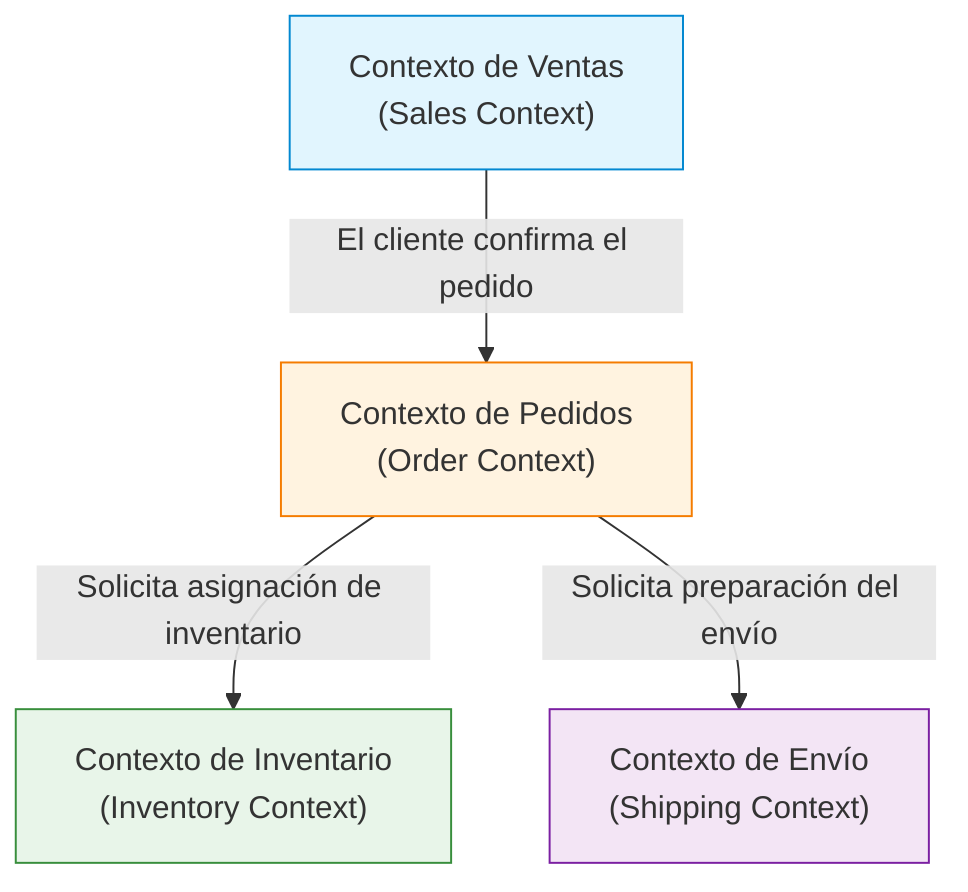

En el desarrollo de software, el desafío más difícil y, a la vez, más importante es "entender con precisión los requisitos y traducirlos a código". La razón por la que muchos proyectos fracasan no radica en la dificultad técnica, sino en la desconexión comunicativa entre el equipo de desarrollo y los expertos del dominio (especialistas en el negocio). Un enfoque poderoso para resolver esta desconexión y gestionar la complejidad del software es el "Diseño Guiado por el Dominio (Domain-Driven Design, DDD)", propuesto por Eric Evans.

En este artículo, nos centraremos en el "Lenguaje Ubicuo (Ubiquitous Language)", un concepto central de DDD, y profundizaremos en cómo derribar la barrera del lenguaje entre desarrolladores y expertos del dominio para construir software de alto valor comercial.

## 1. El núcleo y la complejidad del software

Eric Evans afirma en su libro 'Domain-Driven Design' que "el núcleo del software es reflejar su complejidad en el modelo del dominio (área de negocio)".

En muchos entornos de desarrollo, se invierte una gran cantidad de tiempo en aspectos técnicos como el diseño de bases de datos, la selección de frameworks o la construcción de arquitecturas. Sin embargo, el problema real que el software debe resolver existe en el "dominio del negocio". En un sistema financiero, conceptos como 'cuenta' y 'transacción' son el dominio; en un sistema logístico, lo son 'ruta de entrega' e 'inventario'.

La complejidad del software se divide en complejidad técnica y complejidad del dominio. Mientras que la complejidad técnica se ha vuelto manejable hasta cierto punto gracias a la evolución de herramientas y patrones, la complejidad del dominio es la complejidad inherente al negocio mismo, por lo que no se puede evadir. Afrontar directamente esta complejidad del dominio y expresarla como un modelo de software es el propósito principal de DDD.

## 2. La trampa de la traducción

En las metodologías de desarrollo tradicionales, los expertos del dominio y los desarrolladores hablaban lenguajes diferentes.

- **Expertos del dominio:** Hablan utilizando terminología específica del negocio, como flujos de trabajo, reglas de negocio y requisitos del cliente.
- **Desarrolladores:** Hablan utilizando terminología técnica, como clases, tablas, columnas, APIs y procesamiento asíncrono.

Cuando estos dos grupos conversan, se produce una "traducción" implícita. Cuando un experto del dominio dice "El cliente pone el producto en el carrito y realiza el pago", el desarrollador lo traduce mentalmente a "Obtener un registro de la tabla Customer, añadir un Item al objeto Cart y llamar a PaymentService".

La existencia de esta capa de traducción genera los siguientes problemas:

1. **Pérdida de información y malentendidos:** En el proceso de traducción, se pierden matices importantes del negocio o se interpretan erróneamente.
2. **Divergencia del modelo:** Los requisitos de negocio y la implementación del software se alejan, lo que dificulta modificar el código en respuesta a los cambios del negocio.
3. **Retrasos en la comunicación:** Cada vez que se confirman requisitos o se informan errores, es necesario convertir los términos, lo que aumenta los costos de comunicación.

## 3. Lenguaje Ubicuo: El lenguaje común que rompe barreras

La solución para escapar de esta trampa de traducción es el "Lenguaje Ubicuo (Ubiquitous Language)". El lenguaje ubicuo es un lenguaje estricto, basado en el modelo de dominio, que utilizan en común tanto los expertos del dominio como los desarrolladores.

El lenguaje ubicuo no es simplemente un glosario (Glossary). Es un lenguaje vivo que se utiliza de forma "ubicua" (Ubiquitous) en conversaciones, documentos y en todo el código fuente.

### 3.1 Unificación desde la conversación hasta el código

Cuando se introduce el lenguaje ubicuo, la comunicación del equipo de desarrollo cambia de la siguiente manera:

**Antes del cambio:**
Experto del dominio: "Cuando un usuario se dé de baja, asegúrate de que sus datos no aparezcan en la pantalla".
Desarrollador: "Pondré el flag is_deleted a true en la tabla User y filtraré con una consulta SELECT".

**Después del cambio (usando el lenguaje ubicuo):**
Experto del dominio: "Cuando un cliente se da de baja (Withdraw), su contrato (Contract) pasa a estado finalizado (Terminate)".
Desarrollador: "Entendido. Llamaré al método withdraw de la clase Customer y cambiaré el estado del Contract asociado a Terminate".

De esta manera, al usar los mismos términos (Customer, Withdraw, Contract, Terminate) tanto expertos del dominio como desarrolladores, no hay lugar a malentendidos. Y lo que es más importante, estos términos **se reflejan exactamente en el código**.

```typescript
class Customer {
    private status: CustomerStatus;
    private contracts: Contract[];

    public withdraw(): void {
        this.status = CustomerStatus.WITHDRAWN;
        for (const contract of this.contracts) {
            contract.terminate();
        }
    }
}
```

Leer el código permite comprender las reglas de negocio, y hablar de las reglas de negocio define directamente el diseño del código. Este es el verdadero poder del lenguaje ubicuo.

### 3.2 Evolución continua de términos y modelos

El lenguaje ubicuo no es algo que se decida una vez y se termine. A medida que avanza el proyecto, tanto los expertos del dominio como los desarrolladores profundizan su comprensión del dominio. Invariablemente surgen descubrimientos como: "¿Acaso este término no representa con precisión el negocio real?" o "Este concepto incluye dos significados diferentes".

En esos momentos, es necesario refinar el lenguaje ubicuo y, simultáneamente, refactorizar el modelo y el código. Si cambia la definición de una palabra, los nombres de clases y métodos también se cambian sin dudarlo. Este bucle de retroalimentación continua es la clave para mantener el software adaptado a la realidad del negocio.

## 4. La tragedia de la divergencia entre los nombres de tablas de la base de datos y los requisitos del negocio

Si se diseña el software centrándose en el modelo de datos (diseño de tablas de la base de datos) sin usar un lenguaje ubicuo, surgen problemas graves. A esto también se le llama "diseño impulsado por datos" o "la trampa del script de transacciones".

Por ejemplo, supongamos que se crea una tabla llamada "Producto (Product)" en un sitio de comercio electrónico. Aunque al principio funcione bien, a medida que el negocio se expande, se cae en las siguientes situaciones:

- Productos que implican envío físico
- Contenido digital descargable
- Derechos de suscripción (subscription)
- Entradas para eventos

Si se intenta encajar todo esto en una sola "tabla Product", la tabla se volverá gigantesca, repleta de innumerables columnas que permiten valores NULL y flags complejos (como `is_digital`, `has_shipping`).

Mientras el lado del negocio dice "Queremos cambiar las reglas de distribución del contenido digital", el lado del desarrollo responderá "Las condiciones de los flags de la tabla Product son tan complejas que no podemos prever el impacto; nos tomará un mes arreglarlo". Debido a que los conceptos de negocio y las estructuras de datos están divergentes, un pequeño cambio en los requisitos del negocio puede tener un impacto catastrófico en el sistema.

Para evitar este tipo de tragedias, en DDD el modelado se centra en el "Comportamiento (Behavior)" y los "Conceptos de negocio" en lugar de los "Datos".

## 5. Contexto Delimitado (Bounded Context)

Si se intenta unificar el lenguaje ubicuo como un único modelo gigantesco en todo el sistema, inevitablemente fracasará. Esto se debe a que la misma palabra puede tener significados diferentes según el contexto empresarial.

Pensemos, por ejemplo, en la palabra "Producto (Product)".

- **Contexto de Ventas (Sales):** Un producto tiene un precio, puede estar en oferta y es un objeto para atraer a los clientes.
- **Contexto de Inventario (Inventory):** Un producto es un objeto de gestión física: en qué parte del almacén se encuentra, cuántos quedan y cuándo debe reponerse.
- **Contexto de Envío (Shipping):** Un producto es un objeto de transporte que tiene peso, dimensiones y requiere saber en qué tamaño de caja cabe.

Si se combinan todos estos en una única clase `Product`, nacerá una "Clase Dios" (God Class) donde se mezclan los requisitos de todos los departamentos.

Por ello, en DDD se introduce el concepto de **Contexto Delimitado (Bounded Context)**. Esto define los "límites" dentro de los cuales se aplica estrictamente un modelo y un lenguaje ubicuo específicos.



Está perfectamente bien que exista una clase `Product` propia en cada contexto. El `Product` en el contexto de ventas tiene información de precios, y el `Product` en el contexto de envíos tiene información de peso. Esto mantiene los modelos simples y permite que los equipos desarrollen de forma independiente, sin dejarse influenciar por los requisitos de otros equipos.

El contexto delimitado también sirve como una directriz poderosa al adoptar una arquitectura de microservicios (Microservices Architecture) en sistemas a gran escala. Al hacer que los límites del contexto sean los límites del servicio, se puede lograr una arquitectura de alta cohesión y bajo acoplamiento.

## 6. Conclusión: Colaboración a través del lenguaje

El Diseño Guiado por el Dominio (DDD) no es solo un patrón de arquitectura técnica. Es una filosofía para elevar la actividad del desarrollo de software a un proceso de "exploración y expresión del negocio".

Construir un lenguaje ubicuo y asegurar que los expertos del dominio y los desarrolladores hablen el mismo idioma. Y reflejar ese lenguaje en cada rincón del código sin concesiones. Identificar adecuadamente los contextos delimitados y mantener la pureza de los modelos.

A través de estas prácticas, podemos dejar de acumular montañas de deuda técnica y crear software verdaderamente resistente al cambio, que se convierta en una fuerza real para el negocio. El primer paso para romper la barrera del idioma comienza por escuchar atentamente las palabras que pronuncian los expertos del dominio en la reunión de mañana.
