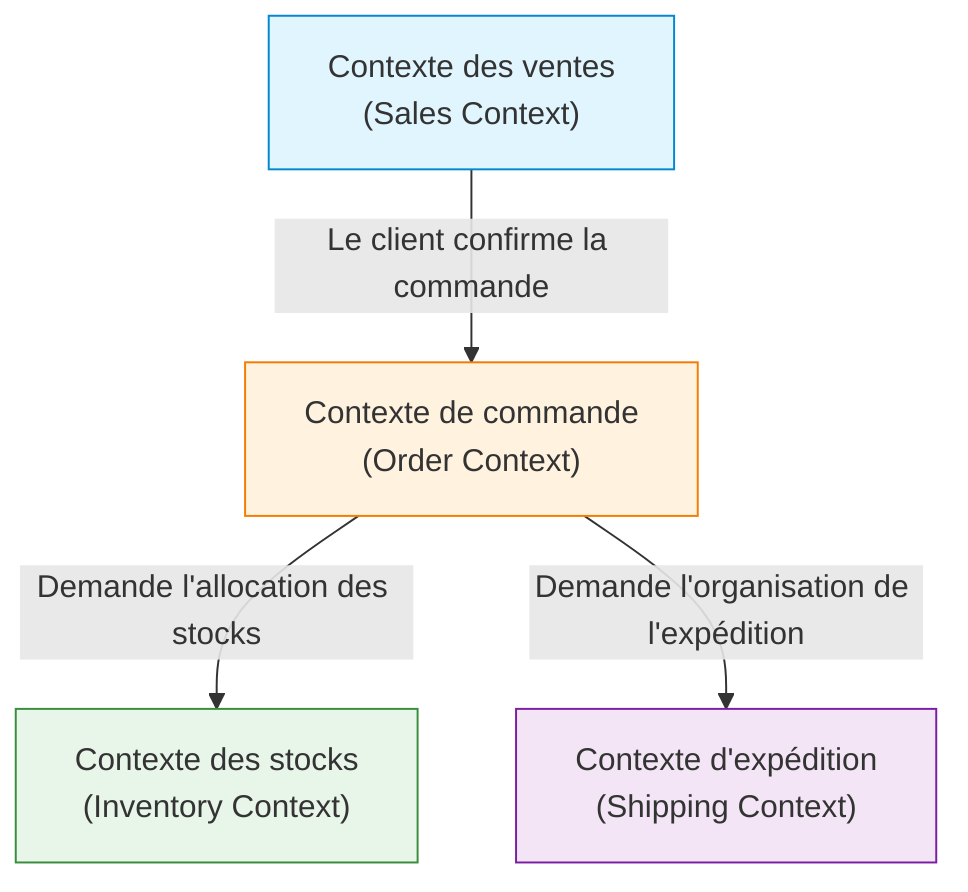

Dans le développement de logiciels, le défi le plus difficile et le plus important est de "comprendre précisément les exigences et de les traduire en code". La raison de l'échec de nombreux projets ne réside pas dans la difficulté technique, mais dans la rupture de communication entre l'équipe de développement et les experts du domaine (les spécialistes du métier). L'approche puissante pour résoudre cette rupture et gérer la complexité des logiciels est la "Conception Pilotée par le Domaine" (Domain-Driven Design, DDD), proposée par Eric Evans.

Dans cet article, nous nous concentrerons sur le concept central du DDD, le "Langage Ubiquiste" (Ubiquitous Language), et nous explorerons en profondeur comment briser la barrière de la langue entre les développeurs et les experts du domaine afin de construire des logiciels à forte valeur ajoutée commerciale.

## 1. Le cœur et la complexité des logiciels

Dans son livre *Domain-Driven Design*, Eric Evans déclare : "Le cœur du logiciel est de refléter sa complexité dans le modèle du domaine (domaine métier)."

Dans de nombreux environnements de développement, beaucoup de temps est consacré aux aspects techniques tels que la conception de la base de données, le choix du framework ou la construction de l'architecture. Cependant, le problème initial que le logiciel doit résoudre réside dans le "domaine métier". S'il s'agit d'un système financier, des concepts tels que "Compte" et "Transaction" constituent le domaine, et s'il s'agit d'un système logistique, "Itinéraire de livraison" et "Stock".

La complexité des logiciels peut être divisée en complexité technique et en complexité du domaine. Bien que la complexité technique soit devenue gérable dans une certaine mesure grâce à l'évolution des outils et des modèles, la complexité du domaine est inhérente au métier lui-même et ne peut être évitée. Faire face directement à cette complexité du domaine et l'exprimer sous forme de modèle logiciel est l'objectif principal du DDD.

## 2. Le piège de la traduction

Dans les méthodes de développement traditionnelles, les experts du domaine et les développeurs parlaient des langues différentes.

- **Experts du domaine :** Ils parlent en utilisant des termes spécifiques au métier, tels que le flux de travail, les règles métier et les exigences des clients.
- **Développeurs :** Ils parlent en utilisant des termes techniques, tels que classes, tables, colonnes, API et traitement asynchrone.

Lorsque ces deux groupes conversent, une "traduction" se produit implicitement. Lorsqu'un expert du domaine dit "Le client met le produit dans le panier et paie", le développeur traduit mentalement par "Récupérer un enregistrement de la table Customer, ajouter un Item à l'objet Cart et appeler PaymentService".

L'existence de cette couche de traduction entraîne les problèmes suivants :

1. **Perte d'informations et malentendus :** Au cours du processus de traduction, des nuances commerciales importantes sont perdues ou mal interprétées.
2. **Divergence du modèle :** Les exigences métier et l'implémentation logicielle divergent, ce qui rend difficile la modification du code en réponse aux changements commerciaux.
3. **Retards de communication :** Chaque fois qu'il faut confirmer des exigences ou signaler des bugs, il est nécessaire de convertir les termes, ce qui augmente le coût de la communication.

## 3. Langage Ubiquiste : un langage commun pour briser les murs

La solution pour échapper à ce piège de traduction est le "Langage Ubiquiste" (Ubiquitous Language). Le langage ubiquiste est un langage strict, basé sur le modèle du domaine, utilisé conjointement par les experts du domaine et les développeurs.

Le langage ubiquiste n'est pas un simple glossaire (Glossary). C'est un langage vivant qui est utilisé "partout" (Ubiquitous) dans les conversations, les documents et le code source.

### 3.1 Unification de la conversation au code

Avec l'introduction du langage ubiquiste, la communication au sein de l'équipe de développement change de la manière suivante :

**Avant :**
Expert du domaine : "Si un utilisateur se désabonne, assurez-vous que ses données n'apparaissent plus à l'écran."
Développeur : "Je vais définir l'indicateur is_deleted de la table User sur true et filtrer avec une requête SELECT."

**Après (avec le langage ubiquiste) :**
Expert du domaine : "Lorsqu'un client se retire (Withdraw), son contrat (Contract) passe à l'état terminé (Terminate)."
Développeur : "Compris. J'appellerai la méthode withdraw de la classe Customer pour changer le statut du Contract associé en Terminate."

Ainsi, en utilisant les mêmes mots (Customer, Withdraw, Contract, Terminate), il n'y a plus de place pour les malentendus entre les experts du domaine et les développeurs. Plus important encore, ces mots sont **directement reflétés dans le code**.

```typescript
class Customer {
    private status: CustomerStatus;
    private contracts: Contract[];

    public withdraw(): void {
        this.status = CustomerStatus.WITHDRAWN;
        for (const contract of this.contracts) {
            contract.terminate();
        }
    }
}
```

En lisant le code, vous comprenez les règles métier, et en parlant des règles métier, elles deviennent directement la conception du code. C'est le véritable pouvoir du langage ubiquiste.

### 3.2 Évolution continue des termes et des modèles

Le langage ubiquiste n'est pas figé une fois décidé. À mesure que le projet avance, les experts du domaine et les développeurs approfondissent leur compréhension du domaine. Des découvertes telles que "Ce terme ne reflète peut-être pas fidèlement le métier réel ?" ou "Ce concept inclut deux significations différentes" se produiront inévitablement.

Dans ce cas, il est nécessaire d'affiner le langage ubiquiste tout en remaniant simultanément le modèle et le code. Si la définition d'un mot change, les noms de classes et de méthodes doivent également être modifiés sans pitié. Cette boucle de rétroaction continue est la clé pour que le logiciel continue de s'adapter à la réalité de l'entreprise.

## 4. La tragédie causée par l'écart entre les noms de tables de la base de données et les exigences métier

Si vous concevez un logiciel en vous concentrant sur le modèle de données (conception des tables de la base de données) sans utiliser de langage ubiquiste, de graves problèmes surviendront. On appelle parfois cela la "conception pilotée par les données" ou le "piège du script de transaction".

Par exemple, supposons que vous créiez une table "Produit" (Product) sur un site e-commerce. Au début, tout va bien, mais à mesure que l'entreprise se développe, vous rencontrez les situations suivantes :

- Des produits nécessitant une livraison physique
- Du contenu numérique téléchargeable
- Des droits d'abonnement (subscription)
- Des billets pour des événements

Si vous essayez d'intégrer tout cela dans une seule "table Product", la table deviendra massive, remplie d'innombrables colonnes autorisant des valeurs NULL et d'indicateurs complexes (comme `is_digital`, `has_shipping`).

L'équipe métier dit : "Nous voulons changer les règles de distribution du contenu numérique", et l'équipe de développement répond : "Les conditions des indicateurs de la table Product sont trop complexes, nous ne pouvons pas anticiper l'étendue de l'impact, donc la modification prendra un mois." L'écart entre les concepts métier et la structure des données fait que le moindre changement dans les exigences métier a un impact dévastateur sur le système.

Dans le DDD, pour éviter une telle tragédie, la modélisation se concentre sur les "comportements" (Behavior) et les "concepts métier" plutôt que sur les "données".

## 5. Contextes Délimités (Bounded Contexts)

Essayer d'unifier le langage ubiquiste en tant qu'un seul grand modèle pour l'ensemble du système est voué à l'échec. En effet, un même mot peut avoir une signification différente selon le contexte commercial.

Prenons l'exemple du mot "Produit" (Product).

- **Contexte des ventes (Sales) :** Un produit a un prix, peut faire l'objet de promotions et doit attirer les clients.
- **Contexte des stocks (Inventory) :** Un produit est une entité physique gérée, située quelque part dans un entrepôt, avec une quantité restante et une date de réapprovisionnement.
- **Contexte d'expédition (Shipping) :** Un produit est un objet à transporter, avec un poids et des dimensions, qui rentre dans une boîte de taille spécifique.

Si tout cela est combiné dans une seule classe `Product`, une "classe divine" (God Class) verra le jour, mélangeant les exigences de tous les départements.

C'est pourquoi le DDD introduit le concept de **Contextes Délimités** (Bounded Contexts). Cela définit une "frontière" à l'intérieur de laquelle un langage ubiquiste spécifique et un modèle s'appliquent pleinement.



Chaque contexte peut posséder sa propre classe `Product`. Le `Product` du contexte des ventes possède des informations sur le prix, tandis que le `Product` du contexte d'expédition possède des informations sur le poids. De cette façon, les modèles restent simples, et les équipes peuvent développer indépendamment sans être perturbées par les exigences d'autres équipes.

Les contextes délimités constituent également un guide puissant lors de l'adoption d'une architecture de microservices (Microservices Architecture) dans des systèmes à grande échelle. En faisant des limites du contexte les limites du service, on peut réaliser une architecture avec une forte cohésion et un faible couplage.

## 6. Conclusion : La collaboration par le langage

La conception pilotée par le domaine (DDD) n'est pas un simple modèle architectural technique. C'est une philosophie visant à élever l'activité de développement logiciel au rang de processus d'"exploration et d'expression du métier".

Construire un langage ubiquiste, où les experts du domaine et les développeurs parlent avec les mêmes mots. Ensuite, refléter ce langage sans compromis dans chaque recoin du code. Identifier correctement les contextes délimités et maintenir la pureté du modèle.

Grâce à ces pratiques, nous pouvons cesser d'accumuler des montagnes de dettes techniques et créer des logiciels véritablement résistants au changement, qui deviennent une force pour l'entreprise. La première étape pour briser la barrière de la langue commence par écouter attentivement les mots prononcés par les experts du domaine lors de la réunion de demain.
