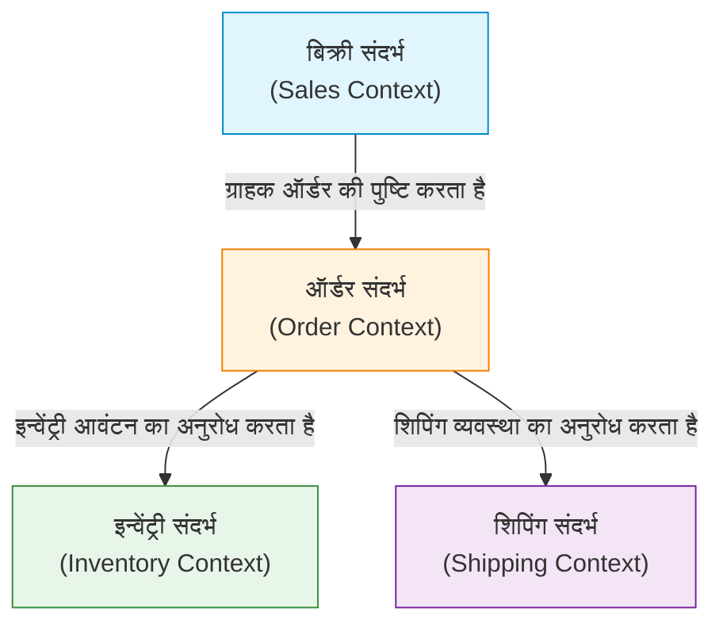

सॉफ्टवेयर विकास में, सबसे कठिन और सबसे महत्वपूर्ण चुनौती 'आवश्यकताओं को सटीक रूप से समझना और उन्हें कोड में बदलना' है। कई परियोजनाओं की विफलता का कारण तकनीकी कठिनाई नहीं है, बल्कि विकास टीम और डोमेन विशेषज्ञों (व्यापार विशेषज्ञों) के बीच संचार की कमी है। इस कमी को दूर करने और सॉफ्टवेयर की जटिलता को प्रबंधित करने का एक शक्तिशाली दृष्टिकोण 'डोमेन-ड्रिवेन डिज़ाइन (Domain-Driven Design, DDD)' है, जिसे एरिक इवांस (Eric Evans) द्वारा प्रस्तावित किया गया था।

इस लेख में, हम DDD की मुख्य अवधारणा 'युबिक्विटस लैंग्वेज (Ubiquitous Language - सर्वव्यापी भाषा)' पर ध्यान केंद्रित करेंगे, और गहराई से जानेंगे कि कैसे डेवलपर्स और डोमेन विशेषज्ञों के बीच की भाषा की दीवार को तोड़ा जाए और उच्च व्यावसायिक मूल्य वाले सॉफ्टवेयर का निर्माण किया जाए।

## 1. सॉफ्टवेयर का मूल और जटिलता

एरिक इवांस अपनी पुस्तक 'एरिक इवांस का डोमेन-ड्रिवेन डिज़ाइन' में कहते हैं कि 'सॉफ्टवेयर का मूल उसकी जटिलता को डोमेन (व्यापार क्षेत्र) के मॉडल में प्रतिबिंबित करना है।'

कई विकास वातावरणों में, तकनीकी पहलुओं जैसे डेटाबेस डिज़ाइन, फ्रेमवर्क का चयन, और आर्किटेक्चर निर्माण पर बहुत समय खर्च किया जाता है। हालांकि, सॉफ्टवेयर द्वारा हल की जाने वाली वास्तविक समस्या 'व्यापार के डोमेन' में मौजूद होती है। वित्तीय प्रणाली के लिए 'खाता (Account)' और 'लेन-देन (Transaction)', या रसद (लॉजिस्टिक्स) प्रणाली के लिए 'डिलीवरी रूट (Delivery Route)' और 'इन्वेंट्री (Inventory)' जैसी अवधारणाएं डोमेन हैं।

सॉफ्टवेयर की जटिलता को तकनीकी जटिलता और डोमेन जटिलता में विभाजित किया जा सकता है। तकनीकी जटिलता को टूल्स और पैटर्न के विकास के माध्यम से कुछ हद तक नियंत्रित किया जा सकता है, लेकिन डोमेन की जटिलता स्वयं व्यापार की जटिलता है, इसलिए इससे बचा नहीं जा सकता। इस डोमेन की जटिलता का सीधे सामना करना और इसे सॉफ्टवेयर के मॉडल के रूप में व्यक्त करना ही DDD का मुख्य उद्देश्य है।

## 2. अनुवाद का जाल

पारंपरिक विकास विधियों में, डोमेन विशेषज्ञ और डेवलपर्स अलग-अलग भाषाएं बोलते थे।

- **डोमेन विशेषज्ञ:** व्यापार प्रवाह (Business flow), व्यापार नियम, ग्राहक आवश्यकताएं आदि जैसे व्यापार-विशिष्ट शब्दों का उपयोग करके बात करते हैं।
- **डेवलपर:** क्लास, टेबल, कॉलम, API, एसिंक्रोनस प्रोसेसिंग आदि जैसे तकनीकी शब्दों का उपयोग करके बात करते हैं।

जब ये दोनों समूह बातचीत करते हैं, तो अनजाने में एक 'अनुवाद' होता है। जब डोमेन विशेषज्ञ कहता है, 'ग्राहक कार्ट में आइटम डालता है और भुगतान करता है', तो डेवलपर अपने दिमाग में इसका अनुवाद करता है, 'Customer टेबल से रिकॉर्ड प्राप्त करें, Cart ऑब्जेक्ट में Item जोड़ें, और PaymentService को कॉल करें।'

इस अनुवाद परत के मौजूद होने से निम्नलिखित समस्याएं उत्पन्न होती हैं:

1. **जानकारी का छूटना और गलतफहमी:** अनुवाद प्रक्रिया के दौरान, महत्वपूर्ण व्यावसायिक बारीकियाँ खो जाती हैं या गलत तरीके से समझी जाती हैं।
2. **मॉडल का विचलन:** व्यावसायिक आवश्यकताएं और सॉफ्टवेयर कार्यान्वयन एक-दूसरे से अलग हो जाते हैं, जिससे व्यावसायिक परिवर्तनों के जवाब में कोड बदलना मुश्किल हो जाता है।
3. **संचार में देरी:** आवश्यकताओं की पुष्टि करने या बग रिपोर्ट करने के हर बार शब्दों के रूपांतरण की आवश्यकता होती है, जिससे संचार लागत बढ़ जाती है।

## 3. युबिक्विटस लैंग्वेज: दीवार को तोड़ने वाली सामान्य भाषा

इस अनुवाद के जाल से बाहर निकलने का उपाय 'युबिक्विटस लैंग्वेज (Ubiquitous Language - सर्वव्यापी भाषा)' है। युबिक्विटस लैंग्वेज एक सख्त भाषा है जो डोमेन मॉडल पर आधारित होती है, जिसका उपयोग डोमेन विशेषज्ञों और डेवलपर्स दोनों द्वारा समान रूप से किया जाता है।

युबिक्विटस लैंग्वेज केवल एक शब्दावली (Glossary) नहीं है। यह एक जीवंत भाषा है जिसका उपयोग बातचीत, दस्तावेज़ों और सोर्स कोड में हर जगह 'सर्वव्यापी (Ubiquitous)' रूप से किया जाता है।

### 3.1 बातचीत से कोड तक एकीकरण

जब युबिक्विटस लैंग्वेज पेश की जाती है, तो विकास टीम का संचार कुछ इस तरह बदल जाता है:

**बदलाव से पहले:**
डोमेन विशेषज्ञ 'जब कोई उपयोगकर्ता अपना खाता रद्द करता है, तो उसका डेटा स्क्रीन पर नहीं दिखना चाहिए'
डेवलपर 'मैं User टेबल में is_deleted फ्लैग को true कर दूंगा और उसे SELECT क्वेरी में फ़िल्टर कर दूंगा'

**बदलाव के बाद (युबिक्विटस लैंग्वेज का उपयोग करते हुए):**
डोमेन विशेषज्ञ 'जब ग्राहक वापस लेता है (Withdraw), तो ग्राहक का अनुबंध (Contract) समाप्त (Terminate) स्थिति में चला जाता है'
डेवलपर 'समझ गया। मैं Customer क्लास के withdraw मेथड को कॉल करूंगा और संबंधित Contract का स्टेटस Terminate में बदल दूंगा'

इस तरह, डोमेन विशेषज्ञों और डेवलपर्स द्वारा समान शब्दों (Customer, Withdraw, Contract, Terminate) का उपयोग करने से गलतफहमी की कोई गुंजाइश नहीं रहती है। इससे भी अधिक महत्वपूर्ण बात यह है कि ये शब्द **सीधे कोड में परिलक्षित होते हैं**।

```typescript
class Customer {
    private status: CustomerStatus;
    private contracts: Contract[];

    public withdraw(): void {
        this.status = CustomerStatus.WITHDRAWN;
        for (const contract of this.contracts) {
            contract.terminate();
        }
    }
}
```

कोड पढ़ने से व्यापार के नियम समझ में आते हैं, और व्यापार के नियमों पर चर्चा करने से वह सीधे कोड का डिज़ाइन बन जाता है। यही युबिक्विटस लैंग्वेज की वास्तविक शक्ति है।

### 3.2 शब्दावली और मॉडल का निरंतर विकास

युबिक्विटस लैंग्वेज एक बार तय हो जाने के बाद खत्म नहीं होती है। जैसे-जैसे परियोजना आगे बढ़ती है, डोमेन विशेषज्ञों और डेवलपर्स दोनों की डोमेन के बारे में समझ गहरी होती जाती है। ऐसी खोजें निश्चित रूप से होंगी जैसे, 'क्या यह शब्द वास्तविक व्यापार का सटीक वर्णन नहीं कर रहा है?' या 'इस अवधारणा में दो अलग-अलग अर्थ शामिल हैं।'

उस समय, युबिक्विटस लैंग्वेज को परिष्कृत करना और साथ ही मॉडल और कोड को रीफैक्टर करना आवश्यक है। यदि किसी शब्द की परिभाषा बदलती है,越 क्लास का नाम और मेथड का नाम भी बिना किसी झिझक के बदल दिया जाना चाहिए। यह निरंतर फीडबैक लूप सॉफ्टवेयर को व्यापार की वास्तविकता के अनुकूल बनाए रखने की कुंजी है।

## 4. डेटाबेस टेबल के नाम और व्यावसायिक आवश्यकताओं के बीच अंतर की त्रासदी

यदि आप युबिक्विटस लैंग्वेज का उपयोग किए बिना डेटा मॉडल (DB टेबल डिज़ाइन) के आसपास सॉफ्टवेयर डिज़ाइन करते हैं, तो गंभीर समस्याएं उत्पन्न होती हैं। इसे अक्सर 'डेटा-संचालित डिज़ाइन' या 'लेन-देन स्क्रिप्ट का जाल' कहा जाता है।

उदाहरण के लिए, मान लें कि आप ई-कॉमर्स साइट के लिए 'Product (उत्पाद)' नाम की एक टेबल बनाते हैं। यह शुरू में अच्छी तरह से काम कर सकता है, लेकिन जैसे-जैसे व्यवसाय बढ़ता है, आप निम्नलिखित स्थितियों में पड़ जाएंगे:

- भौतिक वितरण वाले उत्पाद
- डाउनलोड करने योग्य डिजिटल सामग्री
- सदस्यता (सब्सक्रिप्शन) के अधिकार
- इवेंट के टिकट

यदि आप इन सभी को एक ही 'Product टेबल' में फिट करने का प्रयास करते हैं, तो टेबल विशाल हो जाएगी और अनगिनत NULL-अनुमत कॉलम और जटिल फ्लैग्स (`is_digital`, `has_shipping`, आदि) से भर जाएगी।

व्यापार पक्ष कह रहा है कि 'हम डिजिटल सामग्री के वितरण नियमों को बदलना चाहते हैं', लेकिन विकास पक्ष जवाब देता है, 'Product टेबल की फ्लैग शर्तें इतनी जटिल हैं कि प्रभाव के दायरे को समझना मुश्किल है, इसलिए इसे ठीक करने में 1 महीना लगेगा।' क्योंकि व्यावसायिक अवधारणाएं और डेटा संरचनाएं एक-दूसरे से अलग हो गई हैं, एक छोटी व्यावसायिक आवश्यकता में बदलाव का सिस्टम पर विनाशकारी प्रभाव पड़ सकता है।

ऐसी त्रासदियों को रोकने के लिए, DDD 'डेटा' के बजाय 'व्यवहार (Behavior)' और 'व्यावसायिक अवधारणाओं' के इर्द-गिर्द मॉडलिंग करता है।

## 5. बाउंडेड कॉन्टेक्स्ट (Bounded Context)

यदि आप पूरे सिस्टम में एक विशाल मॉडल के रूप में युबिक्विटस लैंग्वेज को एकीकृत करने का प्रयास करते हैं, तो यह निश्चित रूप से विफल हो जाएगा। ऐसा इसलिए है क्योंकि एक ही शब्द का अलग अर्थ हो सकता है यदि व्यावसायिक संदर्भ (कॉन्टेक्स्ट) भिन्न हो।

उदाहरण के लिए, 'उत्पाद (Product)' शब्द पर विचार करें।

- **बिक्री संदर्भ (Sales Context):** एक उत्पाद वह होता है जिसकी कीमत होती है, जो बिक्री के लिए पात्र होता है, और जो ग्राहकों को आकर्षित करता है।
- **इन्वेंट्री संदर्भ (Inventory Context):** एक उत्पाद एक भौतिक रूप से प्रबंधित वस्तु है, जिसे गोदाम में रखा जाता है, कितनी बची हैं, और उन्हें कब फिर से भरना है।
- **शिपिंग संदर्भ (Shipping Context):** एक उत्पाद एक शिपमेंट वस्तु है, जिसका वजन और आयाम होता है, और वह किस आकार के बॉक्स में फिट होगा।

यदि इन सभी को एक `Product` क्लास में जोड़ दिया जाता है, तो एक गॉड क्लास (God Class) बन जाएगी जिसमें हर विभाग की आवश्यकताएं मिश्रित होंगी।

इसलिए, DDD में **बाउंडेड कॉन्टेक्स्ट (Bounded Context - सीमांकित संदर्भ)** की अवधारणा पेश की गई है। यह एक 'सीमा' को परिभाषित करता है जहां एक विशिष्ट युबिक्विटस लैंग्वेज और मॉडल पूरी तरह से लागू होते हैं।



प्रत्येक संदर्भ की अपनी `Product` क्लास हो सकती है। बिक्री संदर्भ में `Product` के पास मूल्य की जानकारी होती है, जबकि शिपिंग संदर्भ में `Product` के पास वजन की जानकारी होती है। यह मॉडल को सरल रखता है और टीमों को अन्य टीमों की आवश्यकताओं से विचलित हुए बिना स्वतंत्र रूप से विकसित करने की अनुमति देता है।

बाउंडेड कॉन्टेक्स्ट बड़े सिस्टम में माइक्रोसर्विसेज आर्किटेक्चर (Microservices Architecture) को अपनाते समय भी एक मजबूत दिशानिर्देश के रूप में कार्य करता है। संदर्भ की सीमाओं को सेवाओं की सीमाओं के रूप में उपयोग करके, उच्च सामंजस्य (cohesion) और कम युग्मन (coupling) वाला आर्किटेक्चर प्राप्त किया जा सकता है।

## 6. निष्कर्ष: भाषा के माध्यम से सहयोग

डोमेन-ड्रिवेन डिज़ाइन (DDD) केवल एक तकनीकी आर्किटेक्चर पैटर्न नहीं है। यह सॉफ्टवेयर विकास की गतिविधि को 'व्यापार की खोज और अभिव्यक्ति' की प्रक्रिया में उन्नत करने का एक दर्शन है।

युबिक्विटस लैंग्वेज का निर्माण करना और डोमेन विशेषज्ञों और डेवलपर्स को एक ही भाषा में बात करने में सक्षम बनाना। और उस भाषा को बिना किसी समझौते के कोड के हर कोने में प्रतिबिंबित करना। बाउंडेड कॉन्टेक्स्ट की ठीक से पहचान करना और मॉडल की शुद्धता बनाए रखना।

इन प्रथाओं के माध्यम से, हम तकनीकी ऋण का पहाड़ बनाना बंद कर सकते हैं और ऐसे सॉफ़्टवेयर का निर्माण कर सकते हैं जो परिवर्तन के प्रति लचीला हो और जो वास्तव में व्यापार को सशक्त बनाता हो। भाषा की दीवार को तोड़ने का पहला कदम कल की मीटिंग में डोमेन विशेषज्ञों द्वारा बोले गए शब्दों को ध्यान से सुनने से शुरू होता है।
