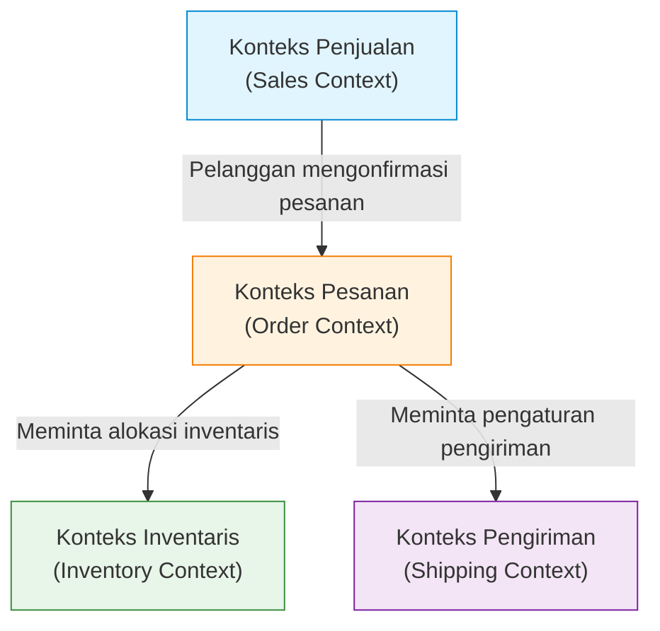

Dalam pengembangan perangkat lunak, tantangan yang paling sulit dan paling penting adalah "memahami persyaratan secara akurat dan menerjemahkannya ke dalam kode". Alasan banyak proyek gagal bukanlah karena kesulitan teknis, melainkan terputusnya komunikasi antara tim pengembang dan pakar domain (ahli bisnis). Sebuah pendekatan kuat untuk menjembatani kesenjangan ini dan mengelola kompleksitas perangkat lunak adalah "Desain Berbasis Domain (Domain-Driven Design, DDD)", yang diusulkan oleh Eric Evans.

Artikel ini berfokus pada "Bahasa Ubiquitous (Ubiquitous Language)", yang merupakan konsep sentral dari DDD, dan menggali lebih dalam tentang bagaimana meruntuhkan hambatan bahasa antara pengembang dan pakar domain, serta membangun perangkat lunak dengan nilai bisnis yang tinggi.

## 1. Inti dan Kompleksitas Perangkat Lunak

Eric Evans menyatakan dalam bukunya *Domain-Driven Design* bahwa "Inti dari perangkat lunak adalah kemampuannya untuk mencerminkan kompleksitas tersebut ke dalam model domain (area bisnis)".

Di banyak lingkungan pengembangan, banyak waktu yang dihabiskan untuk aspek teknis seperti desain basis data, pemilihan kerangka kerja (framework), dan konstruksi arsitektur. Namun, masalah sebenarnya yang harus diselesaikan oleh perangkat lunak ada pada "domain bisnis". Jika itu adalah sistem keuangan, konsep seperti "rekening" dan "transaksi" adalah domainnya; jika itu sistem logistik, konsep seperti "rute pengiriman" dan "inventaris" adalah domainnya.

Kompleksitas perangkat lunak dapat dibagi menjadi kompleksitas teknis dan kompleksitas domain. Kompleksitas teknis telah menjadi lebih terkendali sampai batas tertentu karena evolusi alat dan pola, tetapi kompleksitas domain adalah kompleksitas dari bisnis itu sendiri, sehingga tidak dapat dihindari. Menghadapi kompleksitas domain ini secara langsung dan mengekspresikannya sebagai model perangkat lunak adalah tujuan utama dari DDD.

## 2. Jebakan Terjemahan

Dalam metode pengembangan tradisional, pakar domain dan pengembang berbicara dalam bahasa yang berbeda.

- **Pakar Domain:** Berbicara menggunakan istilah khusus bisnis, seperti alur kerja, aturan bisnis, dan persyaratan pelanggan.
- **Pengembang:** Berbicara menggunakan istilah teknis, seperti kelas, tabel, kolom, API, dan pemrosesan asinkron.

Ketika kedua kelompok ini berkomunikasi, sebuah "terjemahan" terjadi secara implisit. Ketika seorang pakar domain berkata, "Pelanggan memasukkan produk ke dalam keranjang dan melakukan pembayaran", pengembang akan menerjemahkannya di kepalanya menjadi "Mengambil record dari tabel Customer, menambahkan Item ke objek Cart, dan memanggil PaymentService".

Keberadaan lapisan terjemahan ini menimbulkan masalah berikut:

1. **Kehilangan Informasi dan Kesalahpahaman:** Selama proses penerjemahan, nuansa bisnis yang penting mungkin hilang atau disalahtafsirkan.
2. **Perbedaan Model:** Terdapat kesenjangan antara kebutuhan bisnis dan implementasi perangkat lunak, sehingga sulit untuk mengubah kode saat bisnis berubah.
3. **Keterlambatan Komunikasi:** Setiap kali persyaratan dikonfirmasi atau bug dilaporkan, istilah-istilah perlu diterjemahkan, sehingga meningkatkan biaya komunikasi.

## 3. Bahasa Ubiquitous: Bahasa Umum yang Meruntuhkan Tembok

Solusi untuk keluar dari jebakan terjemahan ini adalah "Bahasa Ubiquitous (Ubiquitous Language)". Bahasa Ubiquitous adalah bahasa ketat berdasarkan model domain yang digunakan secara bersama-sama oleh pakar domain dan pengembang.

Bahasa Ubiquitous bukan sekadar glosarium (Glossary). Ia adalah bahasa hidup yang digunakan secara "ubiquitous" (di mana-mana) dalam percakapan, dokumen, dan bahkan di seluruh kode sumber.

### 3.1 Penyatuan dari Percakapan ke Kode

Saat Bahasa Ubiquitous diperkenalkan, komunikasi dalam tim pengembang berubah sebagai berikut:

**Sebelum perubahan:**
Pakar Domain: "Jika pengguna berhenti berlangganan, pastikan data orang tersebut tidak muncul di layar."
Pengembang: "Saya akan mengubah flag is_deleted pada tabel User menjadi true dan memfilternya dengan query SELECT."

**Setelah perubahan (menggunakan Bahasa Ubiquitous):**
Pakar Domain: "Jika pelanggan menarik diri (Withdraw), kontrak (Contract) pelanggan tersebut akan berubah menjadi status dihentikan (Terminate)."
Pengembang: "Dimengerti. Saya akan memanggil metode withdraw pada kelas Customer dan mengubah status Contract yang terkait menjadi Terminate."

Dengan cara ini, pakar domain dan pengembang menggunakan kata-kata yang sama (Customer, Withdraw, Contract, Terminate), sehingga tidak ada ruang untuk kesalahpahaman. Yang lebih penting lagi, kata-kata ini **tercermin secara langsung di dalam kode**.

```typescript
class Customer {
    private status: CustomerStatus;
    private contracts: Contract[];

    public withdraw(): void {
        this.status = CustomerStatus.WITHDRAWN;
        for (const contract of this.contracts) {
            contract.terminate();
        }
    }
}
```

Dengan membaca kode, Anda dapat memahami aturan bisnis; dengan membicarakan aturan bisnis, itu langsung menjadi desain kode. Inilah kekuatan sejati dari Bahasa Ubiquitous.

### 3.2 Evolusi Berkelanjutan dari Istilah dan Model

Bahasa Ubiquitous tidak selesai hanya dengan sekali ditetapkan. Seiring berjalannya proyek, pemahaman pakar domain dan pengembang tentang domain tersebut akan semakin dalam. Pasti akan ada penemuan seperti "Bukankah kata ini tidak secara akurat mewakili bisnis yang sebenarnya?" atau "Konsep ini sepertinya mengandung dua arti yang berbeda".

Pada saat itu, perlu dilakukan penyempurnaan Bahasa Ubiquitous serta refactoring pada model dan kode secara bersamaan. Jika definisi sebuah kata berubah, nama kelas dan metode juga harus diubah tanpa ragu-ragu. Putaran umpan balik (feedback loop) yang berkelanjutan inilah kunci untuk terus mengadaptasi perangkat lunak dengan realitas bisnis.

## 4. Tragedi yang Timbul Akibat Kesenjangan antara Nama Tabel DB dan Kebutuhan Bisnis

Jika Anda mendesain perangkat lunak yang berpusat pada model data (desain tabel DB) tanpa menggunakan Bahasa Ubiquitous, masalah serius akan terjadi. Hal ini sering disebut "desain berbasis data" atau "jebakan skrip transaksi".

Sebagai contoh, bayangkan Anda membuat tabel bernama "Produk (Product)" di sebuah situs e-commerce. Pada awalnya berjalan dengan baik, tetapi seiring dengan berkembangnya bisnis, Anda akan menghadapi situasi berikut:

- Produk fisik yang memerlukan pengiriman
- Konten digital yang dapat diunduh
- Hak berlangganan (subscription)
- Tiket untuk suatu acara

Jika Anda mencoba memaksakan semua ini ke dalam satu "tabel Product", tabel tersebut akan membesar dan dipenuhi dengan banyak kolom yang mengizinkan NULL serta flag yang kompleks (seperti `is_digital`, `has_shipping`).

Sisi bisnis mungkin berkata, "Kami ingin mengubah aturan distribusi konten digital," sementara sisi pengembangan akan merespons, "Kondisi flag di tabel Product terlalu rumit sehingga kita tidak bisa memprediksi dampaknya. Perbaikan ini butuh waktu satu bulan." Karena konsep bisnis dan struktur data terpisah jauh, perubahan kecil pada kebutuhan bisnis bisa berdampak merusak pada sistem.

Dalam DDD, untuk mencegah tragedi seperti ini, pemodelan tidak dipusatkan pada "data", melainkan pada "perilaku (Behavior)" dan "konsep bisnis".

## 5. Konteks Terbatas (Bounded Context)

Jika Anda mencoba menyatukan Bahasa Ubiquitous sebagai satu model raksasa di seluruh sistem, itu pasti akan gagal. Hal ini dikarenakan satu kata yang sama dapat memiliki arti yang berbeda dalam konteks bisnis (konteks) yang berbeda.

Mari kita ambil contoh kata "Produk (Product)".

- **Konteks Penjualan (Sales):** Produk adalah sesuatu yang memiliki harga, bisa didiskon, dan daya tariknya dipromosikan kepada pelanggan.
- **Konteks Inventaris (Inventory):** Produk adalah objek pengelolaan fisik: di mana letaknya di gudang, berapa banyak yang tersisa, dan kapan harus diisi ulang.
- **Konteks Pengiriman (Shipping):** Produk adalah objek yang akan dikirim: memiliki berat dan dimensi, serta ukuran kotak mana yang bisa menampungnya.

Jika semua hal tersebut disatukan ke dalam satu kelas `Product`, Anda akan melahirkan "Kelas Dewa (God Class)" yang mencampuradukkan semua kebutuhan dari berbagai departemen.

Oleh karena itu, dalam DDD diperkenalkan konsep **Konteks Terbatas (Bounded Context)**. Ini mendefinisikan sebuah "batas" di mana Bahasa Ubiquitous dan model tertentu diterapkan sepenuhnya.



Di dalam setiap konteks, sangat memungkinkan untuk memiliki kelas `Product` sendiri-sendiri. `Product` di Konteks Penjualan memiliki informasi harga, sedangkan `Product` di Konteks Pengiriman memiliki informasi berat. Dengan demikian, model tetap sederhana dan setiap tim dapat mengembangkan fitur secara independen tanpa terpengaruh oleh kebutuhan tim lain.

Konteks Terbatas (Bounded Context) juga menjadi panduan yang kuat saat mengadopsi Arsitektur Layanan Mikro (Microservices Architecture) dalam sistem skala besar. Dengan menjadikan batas konteks sebagai batas layanan, arsitektur dengan kohesi tinggi (high cohesion) dan keterkaitan yang rendah (low coupling) dapat dicapai.

## 6. Kesimpulan: Kolaborasi Melalui Bahasa

Desain Berbasis Domain (DDD) bukanlah sekadar pola arsitektur teknis. Ia adalah filosofi yang mengangkat aktivitas pengembangan perangkat lunak menjadi proses "eksplorasi dan ekspresi bisnis".

Membangun Bahasa Ubiquitous, di mana pakar domain dan pengembang berbicara menggunakan istilah yang sama. Dan mencerminkan bahasa tersebut tanpa kompromi ke setiap sudut kode. Mengidentifikasi Konteks Terbatas (Bounded Context) dengan tepat dan menjaga kemurnian model.

Melalui praktik-praktik ini, kita dapat berhenti menumpuk utang teknis dan mulai menciptakan perangkat lunak yang tahan terhadap perubahan, yang benar-benar menjadi kekuatan bisnis. Langkah pertama untuk meruntuhkan tembok bahasa dimulai dari mendengarkan secara mendalam apa yang diucapkan oleh pakar domain pada rapat keesokan harinya.
