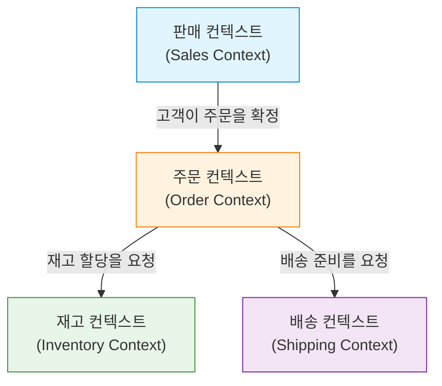

소프트웨어 개발에서 가장 어렵고도 중요한 과제는 '요구사항을 정확히 이해하고 이를 코드로 옮기는 것'입니다. 수많은 프로젝트가 실패하는 원인은 기술적인 난이도가 아니라, 개발 팀과 도메인 전문가(업무 전문가) 사이의 소통 단절에 있습니다. 이러한 단절을 해소하고 소프트웨어의 복잡성을 관리하기 위한 강력한 접근법이 바로 에릭 에반스가 제창한 '도메인 주도 설계(Domain-Driven Design, DDD)'입니다.

이 글에서는 DDD의 핵심 개념인 '유비쿼터스 언어(Ubiquitous Language)'에 초점을 맞춰, 개발자와 도메인 전문가 사이의 언어 장벽을 어떻게 허물고 비즈니스 가치가 높은 소프트웨어를 구축해 나갈 것인지 깊이 있게 살펴봅니다.

## 1. 소프트웨어의 핵심과 복잡성

에릭 에반스는 자신의 저서 『에릭 에반스의 도메인 주도 설계』에서 "소프트웨어의 핵심은 그 복잡성을 도메인(업무 영역) 모델에 반영하는 것"이라고 말했습니다.

많은 개발 현장에서는 데이터베이스 설계, 프레임워크 선정, 아키텍처 구축과 같은 기술적인 측면에 많은 시간을 할애합니다. 그러나 소프트웨어가 해결해야 할 본연의 과제는 '비즈니스 도메인'에 존재합니다. 금융 시스템이라면 '계좌'나 '거래', 물류 시스템이라면 '배송 경로'나 '재고'와 같은 개념이 도메인입니다.

소프트웨어의 복잡성은 기술적인 복잡성과 도메인의 복잡성으로 나눌 수 있습니다. 기술적인 복잡성은 도구나 패턴의 발전에 따라 어느 정도 통제 가능해졌지만, 도메인의 복잡성은 비즈니스 자체의 복잡함이기 때문에 피해 갈 수 없습니다. 이 도메인의 복잡성을 정면으로 마주하고 소프트웨어 모델로 표현하는 것이야말로 DDD의 가장 큰 목적입니다.

## 2. 번역이라는 함정

기존의 개발 방식에서는 도메인 전문가와 개발자가 서로 다른 언어를 사용했습니다.

- **도메인 전문가:** 업무 흐름, 비즈니스 규칙, 고객 요구사항 등 업무 특유의 용어를 사용하여 이야기합니다.
- **개발자:** 클래스, 테이블, 칼럼, API, 비동기 처리 등 기술적인 용어를 사용하여 이야기합니다.

이 두 그룹이 대화할 때 암묵적으로 '번역'이 일어납니다. 도메인 전문가가 "고객이 상품을 장바구니에 담고 결제한다"라고 말했을 때, 개발자는 머릿속에서 "Customer 테이블에서 레코드를 가져와서 Cart 객체에 Item을 추가하고, PaymentService를 호출한다"라고 번역합니다.

이러한 번역 계층이 존재함으로써 다음과 같은 문제가 발생합니다.

1. **정보 누락과 오해:** 번역 과정에서 비즈니스상 중요한 뉘앙스가 사라지거나 잘못 해석됩니다.
2. **모델의 괴리:** 비즈니스 요구사항과 소프트웨어 구현이 멀어지면서 비즈니스 변화에 맞게 코드를 변경하기 어려워집니다.
3. **소통 지연:** 요구사항 확인이나 버그를 보고할 때마다 용어 변환이 필요하여 소통 비용이 증가합니다.

## 3. 유비쿼터스 언어: 장벽을 허무는 공통 언어

이러한 번역의 함정에서 벗어나기 위한 해결책이 바로 '유비쿼터스 언어(Ubiquitous Language)'입니다. 유비쿼터스 언어란 도메인 전문가와 개발자가 공통으로 사용하는, 도메인 모델에 기반한 엄격한 언어를 말합니다.

유비쿼터스 언어는 단순한 용어집(Glossary)이 아닙니다. 대화, 문서화, 그리고 소스 코드 등 모든 곳에서 '편재(Ubiquitous)'하여 사용되는 살아있는 언어입니다.

### 3.1 대화에서 코드까지의 통일

유비쿼터스 언어를 도입하면 개발 팀의 소통은 다음과 같이 변화합니다.

**변경 전:**
도메인 전문가 "사용자가 탈퇴하면, 그 사람의 데이터는 화면에 나오지 않게 해주세요."
개발자 "User 테이블의 is_deleted 플래그를 true로 만들고, SELECT 쿼리에서 필터링할게요."

**변경 후 (유비쿼터스 언어 사용):**
도메인 전문가 "고객이 탈퇴(Withdraw)한 경우, 해당 고객의 계약(Contract)은 종료(Terminate) 상태가 됩니다."
개발자 "알겠습니다. Customer 클래스의 withdraw 메서드를 호출해서 관련된 Contract의 상태를 Terminate로 변경하겠습니다."

이렇게 도메인 전문가와 개발자가 동일한 단어(Customer, Withdraw, Contract, Terminate)를 사용함으로써 오해의 여지가 사라집니다. 더 중요한 것은 이러한 단어들이 **그대로 코드에 반영된다**는 점입니다.

```typescript
class Customer {
    private status: CustomerStatus;
    private contracts: Contract[];

    public withdraw(): void {
        this.status = CustomerStatus.WITHDRAWN;
        for (const contract of this.contracts) {
            contract.terminate();
        }
    }
}
```

코드를 읽으면 비즈니스의 규칙을 알 수 있고, 비즈니스 규칙을 말하면 그것이 곧 코드의 설계가 됩니다. 이것이 유비쿼터스 언어의 진정한 힘입니다.

### 3.2 용어와 모델의 지속적인 진화

유비쿼터스 언어는 한 번 정했다고 끝나는 것이 아닙니다. 프로젝트가 진행됨에 따라 도메인 전문가와 개발자 모두 도메인에 대한 이해가 깊어집니다. "이 단어는 실제 비즈니스를 정확히 표현하지 못하는 것 아닐까?" "이 개념은 두 가지 다른 의미를 포함하고 있다"와 같은 발견을 반드시 하게 됩니다.

그럴 때마다 유비쿼터스 언어를 다듬고, 동시에 모델과 코드도 리팩터링해야 합니다. 단어의 정의가 바뀌면 클래스 이름이나 메서드 이름도 가차 없이 변경합니다. 이러한 지속적인 피드백 루프가 소프트웨어를 비즈니스의 현실에 계속 적응하게 만드는 핵심입니다.

## 4. DB 테이블명과 업무 요구사항의 괴리가 낳는 비극

유비쿼터스 언어를 사용하지 않고, 데이터 모델(DB의 테이블 설계)을 중심으로 소프트웨어를 설계하게 되면 심각한 문제가 발생합니다. 이를 '데이터 주도 설계'나 '트랜잭션 스크립트의 함정'이라고 부르기도 합니다.

예를 들어, 이커머스 사이트에서 '상품(Product)'이라는 테이블을 만들었다고 가정해 봅시다. 처음에는 순조롭더라도 비즈니스가 확장됨에 따라 다음과 같은 상황에 부딪히게 됩니다.

- 물리적 배송이 필요한 상품
- 다운로드 가능한 디지털 콘텐츠
- 정기 구독(구독형) 권리
- 이벤트 티켓

이 모든 것을 하나의 'Product 테이블'에 구겨 넣으려고 하면 테이블은 거대해지고, 수많은 NULL 허용 칼럼이나 복잡한 플래그(`is_digital`, `has_shipping` 등)로 넘쳐나게 됩니다.

비즈니스 측에서는 "디지털 콘텐츠의 배포 규칙을 바꾸고 싶다"라고 하는데, 개발 측에서는 "Product 테이블의 플래그 조건이 너무 복잡해서 영향 범위를 예측할 수 없으니 수정에 한 달이 걸린다"라고 답하게 됩니다. 비즈니스 개념과 데이터 구조가 동떨어져 있기 때문에, 아주 작은 비즈니스 요구사항 변경조차 시스템에 치명적인 영향을 미치게 되는 것입니다.

DDD에서는 이러한 비극을 막기 위해 '데이터'가 아니라 '행위(Behavior)'와 '비즈니스 개념'을 중심으로 모델링을 진행합니다.

## 5. 제한된 컨텍스트 (Bounded Context)

유비쿼터스 언어를 시스템 전체에 걸쳐 하나의 거대한 모델로 통일하려고 하면 반드시 실패하게 됩니다. 왜냐하면 같은 단어라도 비즈니스의 문맥(컨텍스트)이 다르면 그 의미가 달라지기 때문입니다.

예를 들어 '상품(Product)'이라는 단어를 생각해 봅시다.

- **판매 컨텍스트(Sales):** 상품이란 가격이 있고, 할인 대상이 되며, 고객에게 매력을 어필하는 대상입니다.
- **재고 컨텍스트(Inventory):** 상품이란 창고의 어디에 위치해 있고, 몇 개가 남아 있으며, 언제 보충해야 하는지 물리적으로 관리해야 할 대상입니다.
- **배송 컨텍스트(Shipping):** 상품이란 무게와 부피가 있고, 어떤 크기의 상자에 들어가는지를 따지는 운송 대상입니다.

이것들을 모두 하나의 `Product` 클래스에 합치면, 모든 부서의 요구사항이 뒤섞인 신 클래스(God Class)가 탄생하고 맙니다.

따라서 DDD에서는 **제한된 컨텍스트(Bounded Context)**라는 개념을 도입합니다. 이는 특정한 유비쿼터스 언어와 모델이 완벽하게 적용되는 '경계'를 정의하는 것입니다.



각 컨텍스트에는 저마다 고유한 `Product` 클래스가 존재해도 상관없습니다. 판매 컨텍스트의 `Product`는 가격 정보를 가지고, 배송 컨텍스트의 `Product`는 무게 정보를 가집니다. 이를 통해 모델은 단순하게 유지되며, 팀은 다른 팀의 요구사항에 휘둘리지 않고 독립적으로 개발을 진행할 수 있습니다.

제한된 컨텍스트는 대규모 시스템에서 마이크로서비스 아키텍처(Microservices Architecture)를 채택할 때 강력한 지침이 되기도 합니다. 컨텍스트의 경계를 서비스의 경계로 삼음으로써, 응집도는 높고 결합도는 낮은 아키텍처를 구현할 수 있기 때문입니다.

## 6. 요약: 언어를 통한 협력

도메인 주도 설계(DDD)는 단순한 기술적 아키텍처 패턴이 아닙니다. 그것은 소프트웨어 개발이라는 활동을 '비즈니스의 탐구와 표현'이라는 과정으로 승화시키기 위한 철학입니다.

유비쿼터스 언어를 구축하여 도메인 전문가와 개발자가 같은 단어로 대화하는 것. 그리고 그 언어를 타협 없이 코드 구석구석까지 반영하는 것. 제한된 컨텍스트를 적절히 파악하여 모델의 순도를 유지하는 것.

이러한 실천을 통해 우리는 기술적 부채의 산을 쌓는 것을 멈추고, 진정으로 비즈니스에 힘이 되는, 변화에 유연한 소프트웨어를 만들어낼 수 있습니다. 언어의 장벽을 허무는 첫걸음은, 내일 있을 회의에서 도메인 전문가가 하는 말에 깊이 귀 기울이는 것에서 시작됩니다.
