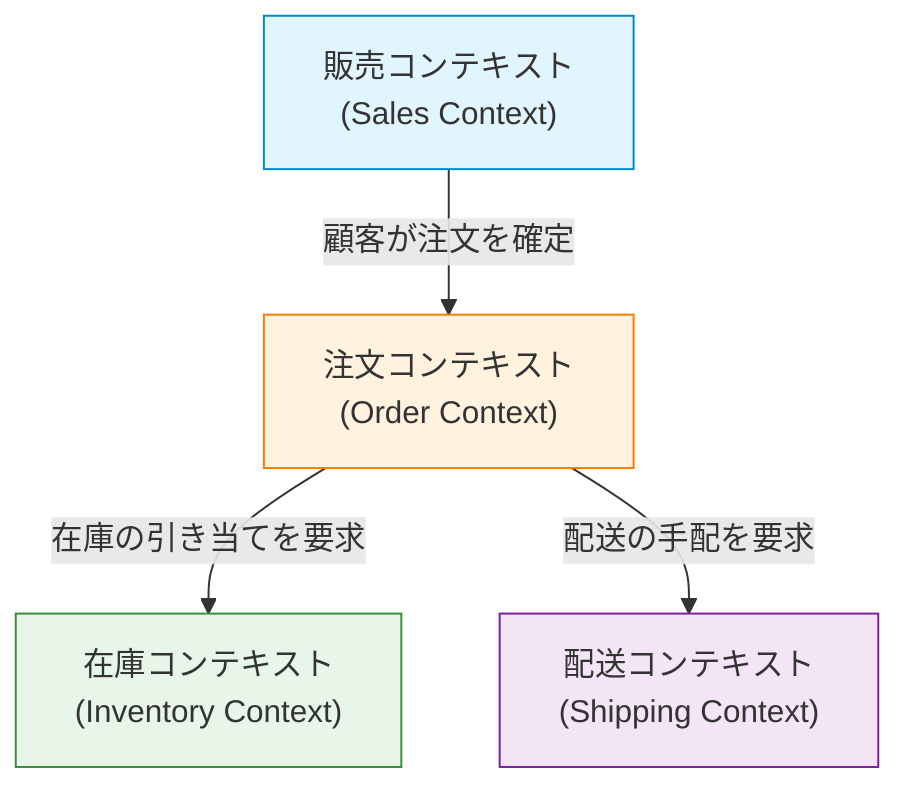

ソフトウェア開発において、最も困難で、かつ最も重要な課題は「要件を正確に理解し、それをコードに落とし込むこと」です。多くのプロジェクトが失敗する原因は、技術的な難易度ではなく、開発チームとドメインエキスパート（業務の専門家）の間のコミュニケーションの断絶にあります。この断絶を解消し、ソフトウェアの複雑性を管理するための強力なアプローチが、エリック・エヴァンスによって提唱された「ドメイン駆動設計（Domain-Driven Design, DDD）」です。

本記事では、DDDの中心的な概念である「ユビキタス言語（Ubiquitous Language）」に焦点を当て、開発者とドメインエキスパートの言語の壁をどのように壊し、ビジネス価値の高いソフトウェアを構築していくのかを深く掘り下げます。

## 1. ソフトウェアの核心と複雑性

エリック・エヴァンスはその著書『エリック・エヴァンスのドメイン駆動設計』の中で、「ソフトウェアの核心はその複雑性をドメイン（業務領域）のモデルに反映することである」と述べています。

多くの開発現場では、データベースの設計やフレームワークの選定、アーキテクチャの構築といった技術的な側面に多くの時間が割かれます。しかし、ソフトウェアが解決すべき本来の課題は「ビジネスのドメイン」に存在します。金融システムであれば「口座」や「取引」、物流システムであれば「配送ルート」や「在庫」といった概念がドメインです。

ソフトウェアの複雑性は、技術的な複雑性とドメインの複雑性に分けられます。技術的な複雑性はツールやパターンの進化によってある程度コントロール可能になりましたが、ドメインの複雑性はビジネスそのものの複雑さであるため、避けて通ることはできません。このドメインの複雑性に正面から向き合い、ソフトウェアのモデルとして表現することこそが、DDDの最大の目的です。

## 2. 翻訳という罠

従来の開発手法において、ドメインエキスパートと開発者は異なる言語を話していました。

- **ドメインエキスパート:** 業務フロー、ビジネスルール、顧客要件など、業務特有の用語を使って話します。
- **開発者:** クラス、テーブル、カラム、API、非同期処理など、技術的な用語を使って話します。

この二つのグループが会話をする際、暗黙のうちに「翻訳」が行われます。ドメインエキスパートが「顧客が商品をカートに入れて決済する」と言ったとき、開発者は頭の中で「Customerテーブルからレコードを取得し、CartオブジェクトにItemを追加し、PaymentServiceを呼び出す」と翻訳します。

この翻訳レイヤーが存在することで、以下のような問題が発生します。

1. **情報の欠落と誤解:** 翻訳の過程で、ビジネス上の重要なニュアンスが失われたり、誤って解釈されたりします。
2. **モデルの乖離:** ビジネス要件とソフトウェアの実装が乖離し、ビジネスの変化に対してコードを変更することが困難になります。
3. **コミュニケーションの遅延:** 要件の確認やバグの報告のたびに、用語の変換が必要となり、コミュニケーションのコストが増大します。

## 3. ユビキタス言語：壁を壊す共通言語

この翻訳の罠から抜け出すための解決策が「ユビキタス言語（Ubiquitous Language）」です。ユビキタス言語とは、ドメインエキスパートと開発者が共通して使用する、ドメインモデルに基づいた厳密な言語のことです。

ユビキタス言語は、単なる用語集（Glossary）ではありません。会話、ドキュメント、そしてソースコードの至る所で「遍在（Ubiquitous）」して使用される生きている言語です。

### 3.1 会話からコードへの統一

ユビキタス言語を導入すると、開発チームのコミュニケーションは次のように変化します。

**変更前:**
ドメインエキスパート「ユーザーが退会したら、その人のデータは画面に出ないようにして」
開発者「Userテーブルのis_deletedフラグをtrueにして、SELECTクエリでフィルタリングしますね」

**変更後（ユビキタス言語を使用）:**
ドメインエキスパート「顧客が退会（Withdraw）した場合、その顧客の契約（Contract）は終了（Terminate）状態になります」
開発者「わかりました。Customerクラスのwithdrawメソッドを呼び出して、関連するContractのステータスをTerminateに変更します」

このように、ドメインエキスパートと開発者が同じ単語（Customer, Withdraw, Contract, Terminate）を使うことで、誤解の余地がなくなります。さらに重要なのは、これらの単語が**そのままコードに反映される**ということです。

```typescript
class Customer {
    private status: CustomerStatus;
    private contracts: Contract[];

    public withdraw(): void {
        this.status = CustomerStatus.WITHDRAWN;
        for (const contract of this.contracts) {
            contract.terminate();
        }
    }
}
```

コードを読めばビジネスのルールが分かり、ビジネスのルールを語ればそれがそのままコードの設計になる。これがユビキタス言語の真の力です。

### 3.2 用語とモデルの継続的な進化

ユビキタス言語は一度決めたら終わりではありません。プロジェクトが進むにつれて、ドメインエキスパートも開発者もドメインについての理解が深まります。「この言葉は実際のビジネスを正確に表していないのではないか？」「この概念は二つの異なる意味を含んでしまっている」といった発見が必ずあります。

その際、ユビキタス言語を洗練させ、同時にモデルとコードもリファクタリングする必要があります。言葉の定義が変われば、クラス名やメソッド名も容赦なく変更します。この継続的なフィードバックループが、ソフトウェアをビジネスの現実に適応させ続ける鍵となります。

## 4. DBテーブル名と業務要件の乖離が生む悲劇

ユビキタス言語を使わずに、データモデル（DBのテーブル設計）を中心にソフトウェアを設計してしまうと、深刻な問題が発生します。これを「データ駆動設計」や「トランザクションスクリプトの罠」と呼ぶこともあります。

例えば、ECサイトで「商品（Product）」というテーブルを作ったとします。最初はうまくいっていても、ビジネスが拡大するにつれて、以下のような事態に陥ります。

- 物理的な配送を伴う商品
- ダウンロード可能なデジタルコンテンツ
- 定期購読（サブスクリプション）の権利
- イベントのチケット

これらすべてを一つの「Productテーブル」に押し込もうとすると、テーブルは巨大化し、無数のNULL許容カラムや複雑なフラグ（`is_digital`, `has_shipping`など）で溢れかえります。

ビジネス側は「デジタルコンテンツの配信ルールを変えたい」と言っているのに、開発側は「Productテーブルのフラグ条件が複雑すぎて、影響範囲が読めないから修正には1ヶ月かかる」と答えることになります。ビジネスの概念とデータ構造が乖離しているため、わずかなビジネス要件の変更がシステムに壊滅的な影響を与えてしまうのです。

DDDでは、このような悲劇を防ぐために「データ」ではなく「振る舞い（Behavior）」と「ビジネスの概念」を中心にモデリングを行います。

## 5. 境界付けられたコンテキスト（Bounded Context）

ユビキタス言語をシステム全体で一つの巨大なモデルとして統一しようとすると、必ず破綻します。なぜなら、同じ言葉でも、ビジネスの文脈（コンテキスト）が異なれば意味が異なるからです。

例えば「商品（Product）」という言葉を考えてみましょう。

- **販売コンテキスト（Sales）:** 商品とは、価格があり、セール対象になり、顧客に魅力をアピールする対象です。
- **在庫コンテキスト（Inventory）:** 商品とは、倉庫のどこに配置されており、いくつ残っていて、いつ補充すべきかという物理的な管理対象です。
- **配送コンテキスト（Shipping）:** 商品とは、重量や寸法があり、どのサイズの箱に入るかという輸送対象です。

これらをすべて一つの `Product` クラスにまとめると、あらゆる部署の要件が入り混じった神クラス（God Class）が誕生してしまいます。

そこでDDDでは、**境界付けられたコンテキスト（Bounded Context）** という概念を導入します。これは、特定のユビキタス言語とモデルが完全に適用される「境界」を定義するものです。



各コンテキストには、それぞれ独自の `Product` クラスが存在しても構いません。販売コンテキストの `Product` は価格情報を持ち、配送コンテキストの `Product` は重量情報を持ちます。これにより、モデルはシンプルに保たれ、チームは他のチームの要件に振り回されることなく、独立して開発を進めることができます。

境界付けられたコンテキストは、大規模なシステムにおいてマイクロサービスアーキテクチャ（Microservices Architecture）を採用する際の強力な指針ともなります。コンテキストの境界をサービスの境界とすることで、凝集度が高く結合度の低いアーキテクチャを実現できるからです。

## 6. まとめ：言語による協調

ドメイン駆動設計（DDD）は、単なる技術的なアーキテクチャパターンではありません。それは、ソフトウェア開発という活動を「ビジネスの探求と表現」のプロセスへと昇華させるための哲学です。

ユビキタス言語を構築し、ドメインエキスパートと開発者が同じ言葉で語り合うこと。そして、その言語を妥協することなくコードの隅々にまで反映させること。境界付けられたコンテキストを適切に見極め、モデルの純度を保つこと。

これらの実践を通じて、私たちは技術的な負債の山を築くのをやめ、真にビジネスの力となる、変化に強いソフトウェアを生み出すことができるのです。言語の壁を壊す第一歩は、明日のミーティングでドメインエキスパートが発する言葉に、深く耳を傾けることから始まります。
