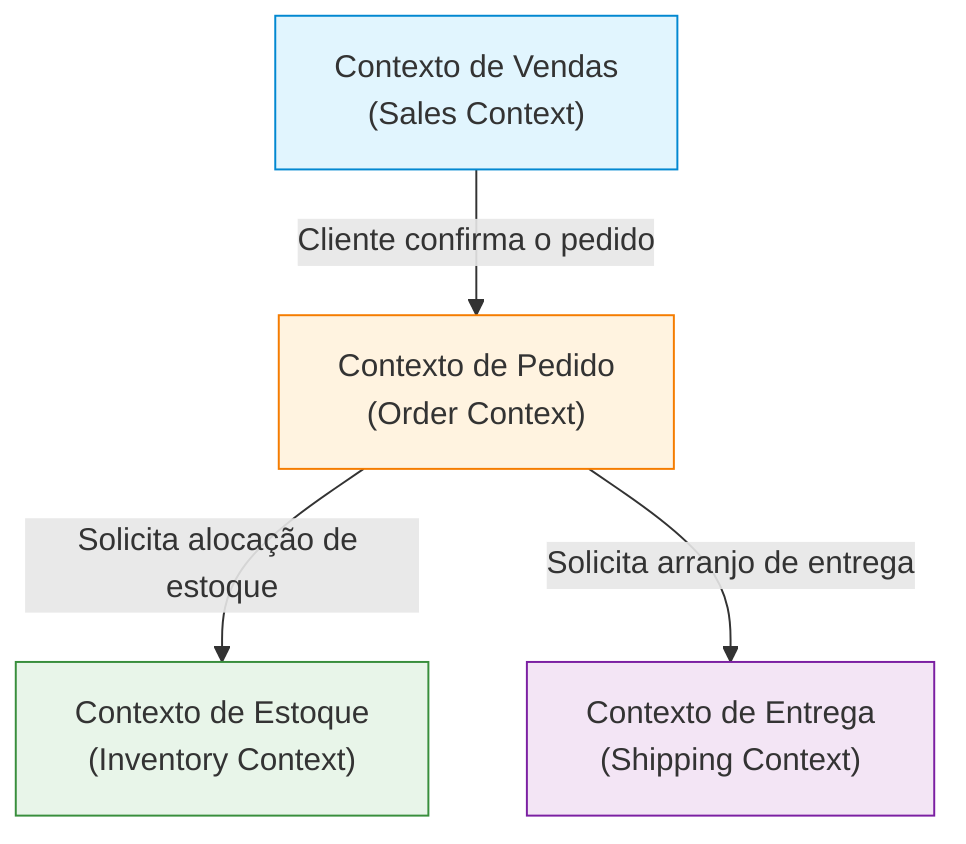

No desenvolvimento de software, o desafio mais difícil e mais importante é "compreender com precisão os requisitos e traduzi-los em código". A razão pela qual muitos projetos falham não é a dificuldade técnica, mas a quebra de comunicação entre a equipe de desenvolvimento e os especialistas de domínio (especialistas em negócios). Uma abordagem poderosa para superar essa desconexão e gerenciar a complexidade do software é o "Domain-Driven Design (DDD)", proposto por Eric Evans.

Neste artigo, focaremos no conceito central do DDD, a "Linguagem Ubíqua (Ubiquitous Language)", e nos aprofundaremos em como quebrar a barreira do idioma entre desenvolvedores e especialistas de domínio para construir softwares de alto valor comercial.

## 1. O Coração do Software e a Complexidade

Em seu livro *Domain-Driven Design*, Eric Evans afirma que "o coração do software é refletir sua complexidade no modelo de domínio".

Em muitos ambientes de desenvolvimento, muito tempo é gasto em aspectos técnicos, como o design do banco de dados, a seleção de frameworks e a construção da arquitetura. No entanto, o problema real que o software deve resolver reside no "domínio do negócio". Se for um sistema financeiro, conceitos como "conta" e "transação" são o domínio; se for um sistema de logística, são conceitos como "rota de entrega" e "estoque".

A complexidade do software pode ser dividida em complexidade técnica e complexidade de domínio. A complexidade técnica tornou-se, em certa medida, controlável com a evolução de ferramentas e padrões, mas a complexidade de domínio é a própria complexidade do negócio e, portanto, não pode ser evitada. O maior propósito do DDD é enfrentar essa complexidade de domínio de frente e expressá-la como um modelo de software.

## 2. A Armadilha da Tradução

Nas abordagens tradicionais de desenvolvimento, especialistas de domínio e desenvolvedores falavam idiomas diferentes.

- **Especialista de domínio:** Fala usando termos específicos do negócio, como fluxo de trabalho, regras de negócios e requisitos do cliente.
- **Desenvolvedor:** Fala usando termos técnicos, como classes, tabelas, colunas, APIs e processamento assíncrono.

Quando esses dois grupos conversam, uma "tradução" implícita ocorre. Quando o especialista de domínio diz "O cliente coloca o produto no carrinho e faz o pagamento", o desenvolvedor traduz mentalmente para "Buscar um registro na tabela Customer, adicionar um Item ao objeto Cart e chamar o PaymentService".

A existência dessa camada de tradução causa os seguintes problemas:

1. **Perda de informações e mal-entendidos:** Durante o processo de tradução, nuances importantes de negócios são perdidas ou mal interpretadas.
2. **Divergência do modelo:** Os requisitos de negócios e a implementação do software se distanciam, tornando difícil modificar o código em resposta a mudanças nos negócios.
3. **Atraso na comunicação:** Cada vez que os requisitos são verificados ou bugs são relatados, os termos devem ser convertidos, aumentando os custos de comunicação.

## 3. Linguagem Ubíqua: Uma Linguagem Comum que Quebra Barreiras

A solução para escapar dessa armadilha de tradução é a "Linguagem Ubíqua" (Ubiquitous Language). A Linguagem Ubíqua é uma linguagem rigorosa baseada no modelo de domínio, usada de forma comum por especialistas de domínio e desenvolvedores.

A Linguagem Ubíqua não é apenas um glossário (Glossary). É uma linguagem viva, usada de forma "ubíqua" (em todo lugar) em conversas, documentos e no código-fonte.

### 3.1 Unificação da Conversa ao Código

Ao introduzir a Linguagem Ubíqua, a comunicação da equipe de desenvolvimento muda da seguinte forma:

**Antes da mudança:**
Especialista de domínio: "Quando um usuário cancelar a conta, certifique-se de que os dados dele não apareçam na tela."
Desenvolvedor: "Vou definir a flag is_deleted da tabela User como true e filtrar com uma query SELECT."

**Depois da mudança (usando a Linguagem Ubíqua):**
Especialista de domínio: "Quando um cliente se retirar (Withdraw), o contrato (Contract) desse cliente mudará para o estado encerrado (Terminate)."
Desenvolvedor: "Entendido. Vou chamar o método withdraw da classe Customer para alterar o status do Contract associado para Terminate."

Dessa forma, como os especialistas de domínio e desenvolvedores usam as mesmas palavras (Customer, Withdraw, Contract, Terminate), não há margem para mal-entendidos. Mais importante ainda, essas palavras são **refletidas diretamente no código**.

```typescript
class Customer {
    private status: CustomerStatus;
    private contracts: Contract[];

    public withdraw(): void {
        this.status = CustomerStatus.WITHDRAWN;
        for (const contract of this.contracts) {
            contract.terminate();
        }
    }
}
```

Ao ler o código, você entende as regras de negócio, e ao falar sobre as regras de negócio, isso se torna diretamente o design do código. Esse é o verdadeiro poder da Linguagem Ubíqua.

### 3.2 Evolução Contínua de Termos e Modelos

A Linguagem Ubíqua não termina quando decidida uma vez. À medida que o projeto avança, tanto os especialistas de domínio quanto os desenvolvedores aprofundam sua compreensão do domínio. Inevitavelmente, surgirão descobertas como "Esta palavra não representa com precisão o negócio real?" ou "Esse conceito inclui dois significados diferentes".

Nesse ponto, é necessário refinar a Linguagem Ubíqua e, ao mesmo tempo, refatorar o modelo e o código. Se a definição de uma palavra mudar, os nomes de classes e métodos também devem ser alterados sem hesitação. Esse ciclo de feedback contínuo é a chave para manter o software adaptado à realidade dos negócios.

## 4. A Tragédia Causada pela Desconexão entre Nomes de Tabelas no BD e Requisitos de Negócios

Se você projetar um software centrado no modelo de dados (design de tabela do BD) sem usar a Linguagem Ubíqua, surgirão problemas sérios. Isso às vezes é chamado de "design orientado a dados" ou "armadilha do script de transação".

Por exemplo, suponha que você crie uma tabela chamada "Produto (Product)" em um site de comércio eletrônico. Embora possa funcionar bem no início, à medida que o negócio se expande, você se encontrará nas seguintes situações:

- Produtos que envolvem entrega física
- Conteúdo digital baixável
- Direitos de assinatura (subscription)
- Ingressos para eventos

Quando você tenta espremer tudo isso em uma única "tabela Product", a tabela se torna enorme e cheia de inúmeras colunas que permitem valores nulos e flags complexas (como `is_digital`, `has_shipping`).

Quando o lado dos negócios diz "Queremos mudar as regras de distribuição de conteúdo digital", o lado do desenvolvimento responde "As condições das flags na tabela Product são muito complexas, e como não podemos prever o escopo do impacto, levará um mês para corrigir". Como os conceitos de negócios e as estruturas de dados estão desconectados, uma pequena mudança nos requisitos de negócios pode ter um impacto catastrófico no sistema.

No DDD, para evitar essa tragédia, a modelagem foca no "comportamento (Behavior)" e nos "conceitos de negócios", em vez de nos "dados".

## 5. Contexto Delimitado (Bounded Context)

Se você tentar unificar a Linguagem Ubíqua como um modelo único e massivo em todo o sistema, ela inevitavelmente entrará em colapso. Isso ocorre porque a mesma palavra tem um significado diferente se o contexto de negócios for diferente.

Por exemplo, considere a palavra "Produto (Product)":

- **Contexto de Vendas (Sales):** Um produto é algo que tem um preço, pode estar à venda e atrai o cliente.
- **Contexto de Estoque (Inventory):** Um produto é um objeto de gestão física sobre onde está localizado no armazém, quantos restam e quando deve ser reabastecido.
- **Contexto de Entrega (Shipping):** Um produto é um objeto de transporte que tem peso e dimensões, e indica em que tamanho de caixa ele cabe.

Se você combinar tudo isso em uma única classe `Product`, uma God Class nascerá com requisitos misturados de todos os departamentos.

Portanto, o DDD introduz o conceito de **Contexto Delimitado (Bounded Context)**. Isso define uma "fronteira" dentro da qual uma Linguagem Ubíqua específica e um modelo se aplicam totalmente.



Está tudo bem ter uma classe `Product` separada para cada contexto. O `Product` no contexto de vendas tem informações de preço, e o `Product` no contexto de entrega tem informações de peso. Isso mantém o modelo simples e permite que as equipes desenvolvam independentemente, sem serem sobrecarregadas pelos requisitos de outras equipes.

Contextos Delimitados também servem como um guia poderoso ao adotar uma Arquitetura de Microsserviços (Microservices Architecture) em sistemas de grande escala. Fazer das fronteiras de contexto as fronteiras dos serviços permite uma arquitetura altamente coesa e fracamente acoplada.

## 6. Conclusão: Colaboração por meio da Linguagem

O Domain-Driven Design (DDD) não é apenas um padrão arquitetônico técnico. É uma filosofia para elevar a atividade de desenvolvimento de software em um processo de "exploração e expressão de negócios".

Construir uma Linguagem Ubíqua permite que especialistas de domínio e desenvolvedores falem o mesmo idioma. E refletir implacavelmente essa linguagem em cada canto do código. Identificar adequadamente os Contextos Delimitados e manter a pureza do modelo.

Por meio dessas práticas, podemos parar de construir montanhas de dívida técnica e criar um software verdadeiramente focado nos negócios, forte o suficiente para suportar mudanças. O primeiro passo para quebrar a barreira do idioma começa ouvindo atentamente as palavras dos especialistas de domínio em sua reunião de amanhã.
