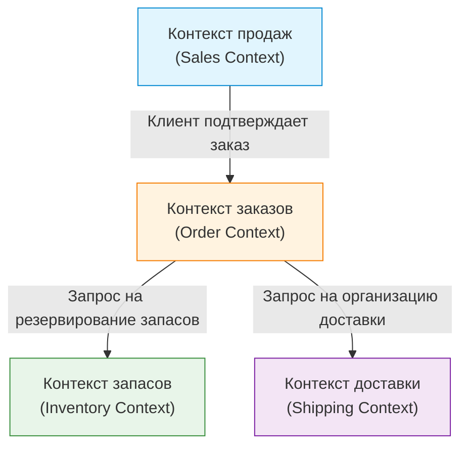

Самая сложная и в то же время самая важная задача при разработке программного обеспечения — это «точно понять требования и отразить их в коде». Причиной провала многих проектов является не техническая сложность, а отсутствие связи и взаимопонимания между командой разработчиков и экспертами предметной области (бизнес-экспертами). Мощным подходом к преодолению этого разрыва и управлению сложностью программного обеспечения является «Предметно-ориентированное проектирование» (Domain-Driven Design, DDD), предложенное Эриком Эвансом.

В этой статье мы сосредоточимся на «едином языке» (Ubiquitous Language), который является центральной концепцией DDD, и подробно рассмотрим, как разрушить языковой барьер между разработчиками и экспертами предметной области для создания программного обеспечения с высокой бизнес-ценностью.

## 1. Суть и сложность программного обеспечения

В своей книге «Предметно-ориентированное проектирование (DDD)» Эрик Эванс утверждает: «Суть программного обеспечения заключается в отражении его сложности в модели предметной области (домена)».

Во многих процессах разработки много времени уделяется техническим аспектам, таким как проектирование баз данных, выбор фреймворков и построение архитектуры. Однако реальные проблемы, которые должно решать программное обеспечение, лежат в «бизнес-домене». В финансовой системе доменом будут такие концепции, как «счет» или «транзакция», а в логистической системе — «маршрут доставки» или «запасы».

Сложность программного обеспечения можно разделить на техническую сложность и сложность предметной области. Техническую сложность стало возможно в какой-то мере контролировать благодаря развитию инструментов и паттернов, но сложность предметной области — это сложность самого бизнеса, и ее невозможно избежать. Истинная цель DDD заключается в том, чтобы встретиться с этой сложностью лицом к лицу и выразить ее в виде программной модели.

## 2. Ловушка перевода

В традиционных методах разработки эксперты предметной области и разработчики говорили на разных языках.

- **Эксперты предметной области:** говорят, используя специфические бизнес-термины, такие как бизнес-процессы, бизнес-правила и требования клиентов.
- **Разработчики:** говорят, используя технические термины, такие как классы, таблицы, столбцы, API и асинхронная обработка.

Когда эти две группы общаются, происходит неявный «перевод». Когда эксперт предметной области говорит: «Клиент добавляет товар в корзину и оплачивает его», разработчик в уме переводит это как: «Получить запись из таблицы Customer, добавить Item в объект Cart и вызвать PaymentService».

Наличие этого слоя перевода приводит к следующим проблемам:

1. **Потеря информации и недопонимание:** В процессе перевода важные бизнес-нюансы могут быть утеряны или неверно истолкованы.
2. **Расхождение моделей:** Возникает разрыв между бизнес-требованиями и программной реализацией, что затрудняет изменение кода в ответ на изменения в бизнесе.
3. **Задержки в коммуникации:** При каждом уточнении требований или сообщении об ошибке требуется преобразование терминов, что увеличивает затраты на коммуникацию.

## 3. Единый язык: общий язык, разрушающий барьеры

Решение, позволяющее выбраться из этой ловушки перевода, — это «Единый язык» (Ubiquitous Language). Единый язык — это строгий язык, основанный на модели предметной области, который совместно используется экспертами предметной области и разработчиками.

Единый язык — это не просто глоссарий терминов (Glossary). Это живой язык, который используется «повсеместно» (Ubiquitous) — в разговорах, документации и по всему исходному коду.

### 3.1 Единообразие от разговоров до кода

При внедрении единого языка коммуникация в команде разработчиков меняется следующим образом:

**До изменений:**
Эксперт предметной области: «Если пользователь удаляет аккаунт, сделайте так, чтобы его данные больше не отображались на экране».
Разработчик: «Я установлю флаг is_deleted в таблице User в true и отфильтрую данные с помощью SELECT-запроса».

**После изменений (с использованием единого языка):**
Эксперт предметной области: «Если клиент (Customer) отзывает свое участие (Withdraw), контракт (Contract) этого клиента переходит в статус завершенного (Terminate)».
Разработчик: «Понял. Я вызову метод withdraw класса Customer и изменю статус связанного Contract на Terminate».

Таким образом, когда эксперты предметной области и разработчики используют одни и те же слова (Customer, Withdraw, Contract, Terminate), места для недопонимания не остается. Что еще более важно, эти слова **напрямую отражаются в коде**.

```typescript
class Customer {
    private status: CustomerStatus;
    private contracts: Contract[];

    public withdraw(): void {
        this.status = CustomerStatus.WITHDRAWN;
        for (const contract of this.contracts) {
            contract.terminate();
        }
    }
}
```

Чтение кода позволяет понять бизнес-правила, а обсуждение бизнес-правил напрямую формирует архитектуру кода. В этом и заключается истинная сила единого языка.

### 3.2 Непрерывная эволюция терминов и моделей

Единый язык не создается раз и навсегда. По мере развития проекта и эксперты предметной области, и разработчики углубляют свое понимание домена. Обязательно будут сделаны такие открытия: «Возможно, это слово не совсем точно отражает реальный бизнес?» или «Эта концепция включает в себя два разных смысла».

В таких случаях необходимо уточнять единый язык и одновременно проводить рефакторинг модели и кода. Если определение слова меняется, имена классов и методов также должны быть безжалостно изменены. Этот непрерывный цикл обратной связи является ключом к постоянной адаптации программного обеспечения к реалиям бизнеса.

## 4. Трагедия расхождения между именами таблиц БД и бизнес-требованиями

Если программное обеспечение проектируется в первую очередь вокруг модели данных (схемы таблиц БД) без использования единого языка, возникают серьезные проблемы. Это часто называют «проектированием на основе данных» или «ловушкой транзакционных скриптов».

Например, представьте, что вы создали таблицу «Товар» (Product) для сайта электронной коммерции. Поначалу все идет хорошо, но по мере расширения бизнеса возникают следующие сценарии:

- Физические товары, требующие доставки
- Загружаемый цифровой контент
- Права на периодическую подписку (subscription)
- Билеты на мероприятия

Если вы попытаетесь втиснуть все это в одну «таблицу Product», она разрастется до огромных размеров и будет переполнена бесчисленными столбцами, допускающими значение NULL, и сложными флагами (например, `is_digital`, `has_shipping`).

Бизнес-отдел говорит: «Мы хотим изменить правила доставки цифрового контента», а команда разработчиков отвечает: «Условия флагов в таблице Product слишком сложны, мы не можем предсказать масштаб влияния, поэтому на исправление уйдет месяц». Поскольку бизнес-концепции и структуры данных разошлись, даже небольшое изменение бизнес-требований может оказать разрушительное воздействие на систему.

В DDD моделирование выполняется не вокруг «данных», а вокруг «поведения» (Behavior) и «бизнес-концепций», чтобы предотвратить подобные трагедии.

## 5. Ограниченный контекст (Bounded Context)

Если попытаться унифицировать единый язык в виде одной огромной модели для всей системы, это неизбежно приведет к провалу. Причина в том, что одно и то же слово может иметь разные значения в зависимости от бизнес-контекста.

Например, давайте рассмотрим слово «Товар» (Product).

- **Контекст продаж (Sales):** Товар — это объект, который имеет цену, может участвовать в распродажах и должен привлекать клиентов.
- **Контекст запасов (Inventory):** Товар — это физический объект управления: где на складе он находится, сколько его осталось и когда его нужно пополнить.
- **Контекст доставки (Shipping):** Товар — это объект транспортировки, имеющий вес и габариты, определяющие, в коробку какого размера он поместится.

Если объединить все это в один класс `Product`, получится «Божественный класс» (God Class), в котором смешаны требования всех отделов.

Поэтому DDD вводит концепцию **ограниченного контекста (Bounded Context)**. Она определяет «границы», в которых полностью применим конкретный единый язык и модель.



Каждый контекст может иметь свой собственный класс `Product`. `Product` в контексте продаж имеет информацию о цене, а `Product` в контексте доставки — информацию о весе. Это сохраняет модели простыми и позволяет командам разрабатывать независимо, не отвлекаясь на требования других команд.

Ограниченный контекст также служит сильным ориентиром при внедрении микросервисной архитектуры (Microservices Architecture) в крупномасштабных системах. Сделав границы контекста границами сервисов, можно создать архитектуру с высокой связностью и низким зацеплением.

## 6. Заключение: координация через язык

Предметно-ориентированное проектирование (DDD) — это не просто паттерн технической архитектуры. Это философия, которая возвышает деятельность по разработке программного обеспечения до процесса «исследования и выражения бизнеса».

Создание единого языка, на котором эксперты предметной области и разработчики говорят друг с другом. Бескомпромиссное отражение этого языка в каждом уголке кода. Правильное определение ограниченных контекстов и поддержание чистоты моделей.

Благодаря этим практикам мы можем перестать наращивать горы технического долга и создавать отказоустойчивое программное обеспечение, которое действительно расширяет возможности бизнеса. Первый шаг к разрушению языкового барьера начинается с того, чтобы внимательно прислушиваться к словам экспертов предметной области на завтрашней встрече.
