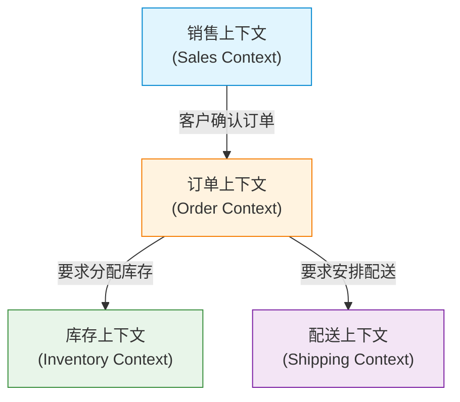

在软件开发中，最困难且最重要的课题是“准确理解需求并将其转化为代码”。许多项目失败的原因并不在于技术难度，而在于开发团队与领域专家（业务专家）之间沟通的断裂。为了消除这种断裂并管理软件的复杂性，Eric Evans 提出了一种强大的方法——“领域驱动设计（Domain-Driven Design, DDD）”。

本文将聚焦于 DDD 的核心概念“通用语言（Ubiquitous Language）”，深入探讨如何打破开发者与领域专家之间的语言壁垒，从而构建出具有高商业价值的软件。

## 1. 软件的核心与复杂性

Eric Evans 在其著作《领域驱动设计》中提到：“软件的核心在于将其复杂性反映在领域（业务领域）的模型中。”

在许多开发场景下，大量时间被耗费在数据库设计、框架选择、架构搭建等技术层面上。然而，软件真正需要解决的核心课题存在于“业务领域”之中。如果是金融系统，领域概念就是“账户”或“交易”；如果是物流系统，那就是“配送路线”或“库存”。

软件的复杂性可以分为技术复杂性和领域复杂性。技术复杂性随着工具和模式的演进而变得在一定程度上可控，但领域的复杂性是业务本身的复杂性，因此无法回避。直面这种领域的复杂性，并将其表达为软件模型，正是 DDD 的最大目的。

## 2. 翻译的陷阱

在传统的开发方法中，领域专家与开发者说着不同的语言。

- **领域专家:** 使用业务流、业务规则、客户需求等业务特有术语进行交流。
- **开发者:** 使用类、表、列、API、异步处理等技术术语进行交流。

当这两个群体进行对话时，会在暗中进行“翻译”。当领域专家说“客户将商品放入购物车并结账”时，开发者在脑海中会翻译为“从 Customer 表中获取记录，向 Cart 对象添加 Item，并调用 PaymentService”。

这种翻译层的存在，会导致以下问题的发生：

1. **信息缺失与误解:** 在翻译的过程中，业务上重要的细微差别可能会丢失，或者被错误解读。
2. **模型脱节:** 业务需求与软件实现发生脱节，使得代码很难适应业务的变化。
3. **沟通延迟:** 每次确认需求或报告 Bug 时都需要转换术语，增加了沟通成本。

## 3. 通用语言：打破壁垒的共同语言

摆脱这种翻译陷阱的解决方案就是“通用语言（Ubiquitous Language）”。通用语言是指领域专家与开发者共同使用的、基于领域模型的严谨语言。

通用语言绝不仅仅是一个术语表（Glossary）。它是一种充满活力的语言，在对话、文档以及源代码的各个角落“无处不在（Ubiquitous）”地被使用着。

### 3.1 从对话到代码的统一

引入通用语言后，开发团队的沟通方式将发生如下变化：

**变更前:**
领域专家“如果用户注销了，就不要在屏幕上显示那个人的数据了”
开发者“那我就把 User 表的 is_deleted 标志设为 true，然后用 SELECT 查询过滤一下”

**变更后（使用通用语言）:**
领域专家“当客户注销（Withdraw）时，该客户的合同（Contract）将变为终止（Terminate）状态”
开发者“明白了。我会调用 Customer 类的 withdraw 方法，并将相关联的 Contract 状态更改为 Terminate”

通过这种方式，领域专家和开发者使用相同的单词（Customer, Withdraw, Contract, Terminate），就不再有产生误解的余地。更重要的是，这些单词会**直接反映在代码中**。

```typescript
class Customer {
    private status: CustomerStatus;
    private contracts: Contract[];

    public withdraw(): void {
        this.status = CustomerStatus.WITHDRAWN;
        for (const contract of this.contracts) {
            contract.terminate();
        }
    }
}
```

阅读代码就能理解业务规则，谈论业务规则时就能直接转化为代码设计。这就是通用语言的真正力量。

### 3.2 术语与模型的持续演进

通用语言并不是一劳永逸的。随着项目的推进，领域专家和开发者对领域的理解都会不断加深。必然会发现“这个词是不是没有准确表达实际业务？”或者“这个概念是不是包含了两种不同的含义？”。

此时，必须对通用语言进行推敲，同时重构模型和代码。如果词语的定义发生了变化，类名和方法名也要毫不留情地更改。这种持续的反馈循环，是让软件持续适应业务现实的关键。

## 4. 数据库表名与业务需求脱节带来的悲剧

如果不使用通用语言，而是围绕数据模型（DB 表设计）来设计软件，就会产生严重的问题。这有时被称为“数据驱动设计”或“事务脚本陷阱”。

例如，在电商网站中创建了一个名为“商品（Product）”的表。起初一切顺利，但随着业务的扩张，会陷入以下境地：

- 伴随物理配送的商品
- 可下载的数字内容
- 定期订阅（Subscription）的权限
- 活动门票

如果试图将所有这些都塞进一个“Product 表”中，该表就会变得极其庞大，充斥着无数允许为空的列以及复杂的标志（如 `is_digital`、`has_shipping` 等）。

当业务方说“想改变数字内容的交付规则”时，开发方却只能回答“Product 表的标志条件太复杂了，无法评估影响范围，因此修改需要 1 个月的时间”。因为业务概念与数据结构发生了脱节，哪怕是微小的业务需求变更，也会对系统造成灾难性的影响。

在 DDD 中，为了防止这种悲剧的发生，建模的中心是“行为（Behavior）”和“业务概念”，而不是“数据”。

## 5. 限界上下文（Bounded Context）

如果试图用通用语言在整个系统中统一出一个庞大模型，必然会走向崩溃。因为即使是同一个词，在不同的业务语境（上下文）中，含义也是不同的。

例如，让我们思考一下“商品（Product）”这个词。

- **销售上下文（Sales）:** 商品是指具有价格、可参与促销并向客户展现吸引力的对象。
- **库存上下文（Inventory）:** 商品是指放置在仓库某处、还剩多少、何时需要补充的物理管理对象。
- **配送上下文（Shipping）:** 商品是指具有重量和尺寸、应该装入哪种尺寸箱子中的运输对象。

如果将这些全部整合到一个 `Product` 类中，就会诞生一个混杂了所有部门需求的上帝类（God Class）。

因此，在 DDD 中引入了**限界上下文（Bounded Context）**这一概念。它定义了一个“边界”，在边界内特定的通用语言和模型能够完全适用。



每个上下文中都可以拥有各自独立的 `Product` 类。销售上下文中的 `Product` 包含价格信息，配送上下文中的 `Product` 包含重量信息。这样一来，模型就能保持简洁，团队也能独立推进开发，而不会被其他团队的需求所左右。

限界上下文也是在大型系统中采用微服务架构（Microservices Architecture）时强有力的指导原则。因为将上下文的边界作为服务的边界，就能实现高内聚、低耦合的架构。

## 6. 总结：通过语言进行协作

领域驱动设计（DDD）不仅仅是一种技术性的架构模式。它是一种将软件开发活动升华为“探索与表达业务”过程的哲学。

建立通用语言，让领域专家与开发者使用相同的语言进行对话；并毫无妥协地将该语言反映到代码的每一个角落；准确识别限界上下文，保持模型的纯粹性。

通过这些实践，我们不再堆积技术债务，而是能够创造出真正成为业务助力、能够抵御变化的软件。打破语言壁垒的第一步，就始于在明天的会议上，去深深倾听领域专家口中说出的话语。
