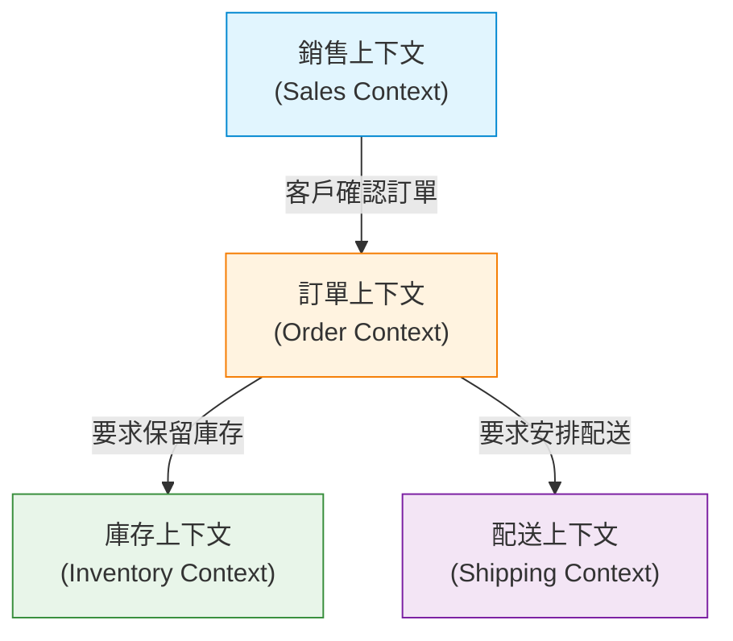

在軟體開發中，最困難且最重要的課題是「準確理解需求並將其轉化為程式碼」。許多專案失敗的原因並非技術上的難度，而是開發團隊與領域專家（業務專家）之間溝通的斷層。為了解決這個斷層並管理軟體的複雜性，由 Eric Evans 提倡的「領域驅動設計（Domain-Driven Design, DDD）」提供了一個強而有力的方法。

本文將聚焦於 DDD 的核心概念「通用語言（Ubiquitous Language）」，深入探討如何打破開發者與領域專家的語言隔閡，並建構出具備高商業價值的軟體。

## 1. 軟體的核心與複雜性

Eric Evans 在其著作《領域驅動設計》中提到：「軟體的核心在於將其複雜性反映在領域（業務領域）的模型中」。

在許多開發現場，往往會將大量時間花在資料庫設計、框架選擇或架構建構等技術層面上。然而，軟體應該解決的真正問題存在於「商業領域」之中。如果是金融系統，領域的概念就是「帳戶」或「交易」；如果是物流系統，則是「配送路線」或「庫存」。

軟體的複雜性可分為技術的複雜性與領域的複雜性。雖然技術的複雜性已能透過工具和模式的演進得到一定程度的控制，但領域的複雜性源自於商業本身的複雜度，是無法迴避的。正面迎擊這種領域複雜性，並將其表現為軟體模型，正是 DDD 的最大目的。

## 2. 翻譯的陷阱

在傳統的開發方法中，領域專家與開發者說著不同的語言。

- **領域專家:** 使用業務特有的術語來對話，例如業務流程、商業規則、客戶需求等。
- **開發者:** 使用技術術語來對話，例如類別、資料表、欄位、API、非同步處理等。

當這兩個群體在交流時，往往會在無形中進行「翻譯」。當領域專家說「客戶將商品放入購物車並結帳」時，開發者會在腦中將其翻譯為「從 Customer 資料表取得記錄，在 Cart 物件新增 Item，並呼叫 PaymentService」。

這種翻譯層的存在會導致以下問題：

1. **資訊遺失與誤解:** 在翻譯的過程中，重要的商業細微差別可能會流失，或是被錯誤解讀。
2. **模型脫節:** 業務需求與軟體實作產生脫節，使得在面對商業變化時，修改程式碼變得非常困難。
3. **溝通延遲:** 每次確認需求或回報錯誤時，都需要進行術語轉換，大幅增加了溝通成本。

## 3. 通用語言：打破隔閡的共通語言

為了擺脫這個翻譯的陷阱，解決方案就是「通用語言（Ubiquitous Language）」。通用語言是指領域專家與開發者共同使用、基於領域模型的嚴謹語言。

通用語言不僅僅是一份術語表（Glossary），它是在對話、文件以及原始碼的各個角落「無所不在（Ubiquitous）」被使用的活語言。

### 3.1 從對話到程式碼的統一

導入通用語言後，開發團隊的溝通方式將產生以下改變：

**改變前:**
領域專家「如果使用者退會，就不要讓他的資料顯示在畫面上」
開發者「我會把 User 資料表的 is_deleted 標記設為 true，然後用 SELECT 查詢來過濾」

**改變後（使用通用語言）:**
領域專家「當客戶退會（Withdraw）時，該客戶的合約（Contract）將變為終止（Terminate）狀態」
開發者「了解。我會呼叫 Customer 類別的 withdraw 方法，並將相關 Contract 的狀態更改為 Terminate」

如此一來，領域專家與開發者使用相同的單字（Customer, Withdraw, Contract, Terminate），便沒有了誤解的空間。更重要的是，這些單字將**原封不動地反映在程式碼中**。

```typescript
class Customer {
    private status: CustomerStatus;
    private contracts: Contract[];

    public withdraw(): void {
        this.status = CustomerStatus.WITHDRAWN;
        for (const contract of this.contracts) {
            contract.terminate();
        }
    }
}
```

閱讀程式碼就能理解商業規則，而談論商業規則時，它本身就成為了程式碼的設計。這正是通用語言的真正力量。

### 3.2 術語與模型的持續演進

通用語言並非一旦決定就結束了。隨著專案的推進，領域專家與開發者對領域的理解都會逐漸加深。「這個詞彙是不是沒有準確表達實際的業務？」「這個概念似乎包含了兩種不同的意義」，必定會有諸如此類的發現。

在這種時候，必須對通用語言進行精煉，並同時重構模型與程式碼。如果詞彙的定義改變了，類別名稱與方法名稱也必須毫不留情地隨之更改。這種持續的反饋循環，正是讓軟體不斷適應商業現實的關鍵。

## 4. 資料表名稱與業務需求脫節所造成的悲劇

如果在不使用通用語言的情況下，以資料模型（資料庫的資料表設計）為中心來設計軟體，將會產生嚴重的問題。這有時被稱為「資料驅動設計」或「交易指令碼（Transaction Script）的陷阱」。

舉例來說，假設我們在電商網站建立了一個名為「商品（Product）」的資料表。剛開始可能運作良好，但隨著業務的擴大，系統可能會陷入以下狀況：

- 需要實體配送的商品
- 可下載的數位內容
- 定期訂閱（Subscription）的權利
- 活動的門票

如果試圖將這一切都塞進單一個「Product 資料表」中，資料表將會變得非常巨大，充斥著無數允許 NULL 的欄位以及複雜的標記（例如 `is_digital`, `has_shipping` 等）。

業務端可能提出「想要改變數位內容的派發規則」，而開發端卻只能回答「Product 資料表的標記條件太複雜了，無法預估影響範圍，所以修改需要花費一個月的時間」。因為商業概念與資料結構產生了脫節，即便是微小的業務需求變更，也可能對系統造成毀滅性的影響。

在 DDD 中，為了防止這種悲劇發生，模型設計是以「行為（Behavior）」與「商業概念」為中心，而非「資料」。

## 5. 限界上下文（Bounded Context）

如果試圖將通用語言統一為整個系統中的單一巨大模型，必定會走向破滅。因為即使是相同的詞彙，在不同的業務脈絡（Context）中，意義也會有所不同。

例如，我們來考慮「商品（Product）」這個詞彙：

- **銷售上下文（Sales）:** 商品具有價格，可以成為折扣對象，並且是吸引客戶的目標。
- **庫存上下文（Inventory）:** 商品是實體的管理對象，關注於它放在倉庫的哪裡、剩下多少、何時應該補貨。
- **配送上下文（Shipping）:** 商品具有重量與尺寸，關注的是它能裝進什麼尺寸的箱子，作為運輸的對象。

如果將這些全部整合在一個 `Product` 類別中，就會誕生出一個混雜了所有部門需求的上帝類別（God Class）。

因此，DDD 導入了**限界上下文（Bounded Context）**的概念。這是用來定義一個特定的通用語言與模型完全適用的「邊界」。



每個上下文中，都可以擁有各自獨立的 `Product` 類別。銷售上下文的 `Product` 擁有價格資訊，配送上下文的 `Product` 則擁有重量資訊。透過這種方式，模型得以保持簡潔，團隊也能獨立推進開發，而不必被其他團隊的需求所左右。

限界上下文也是在大型系統中採用微服務架構（Microservices Architecture）時的強力指引。因為將上下文的邊界作為服務的邊界，就能實現高內聚、低耦合的架構。

## 6. 總結：透過語言的協作

領域驅動設計（DDD）不僅僅是一種技術性的架構模式，它更是一種將軟體開發活動昇華為「探索與表達商業」過程的哲學。

建立通用語言，讓領域專家與開發者能用相同的語言交談。並且毫不妥協地將該語言反映在程式碼的每一個角落。準確地辨識限界上下文，保持模型的純粹性。

透過這些實踐，我們能夠停止堆積技術債，並創造出真正成為商業助力、具備強大適應變更能力的軟體。打破語言隔閡的第一步，就從明天的會議中，仔細傾聽領域專家口中說出的詞彙開始。
