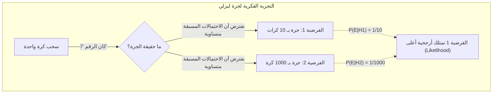
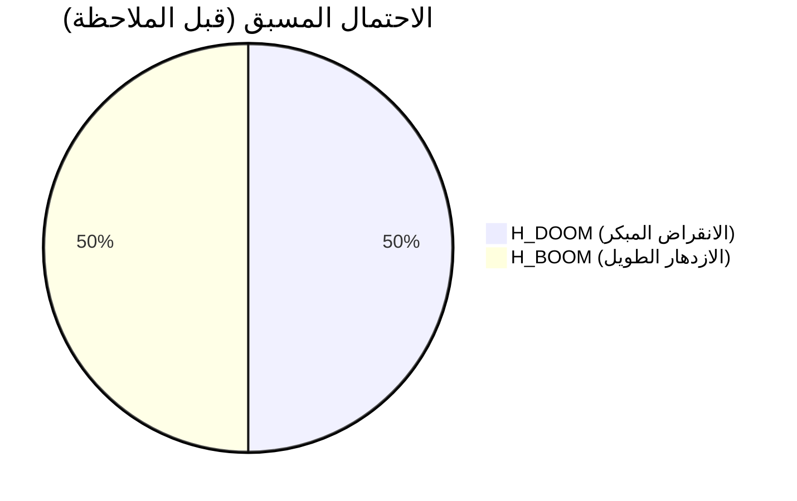
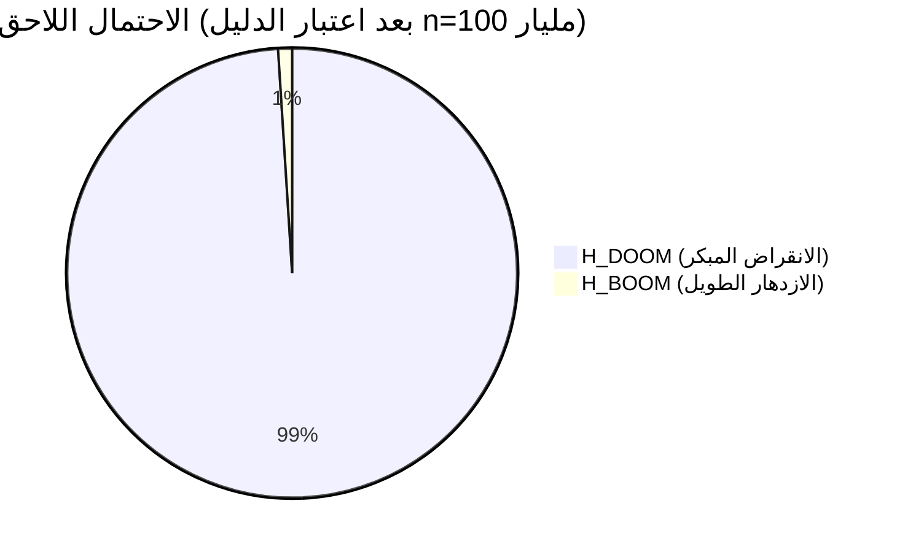
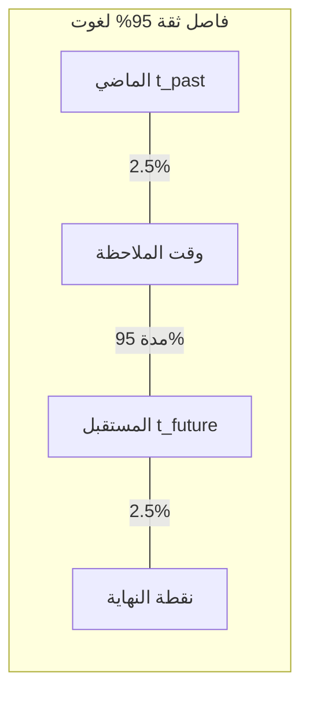
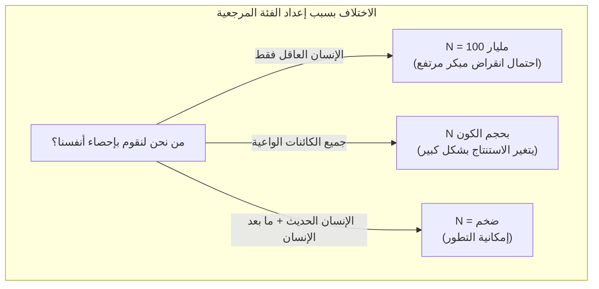

## 1. مقدمة: هل نعيش في عصر "خاص"؟

متى ستنقرض البشرية؟ لطالما تم تناول هذا السؤال كطرح في الأديان والفلسفة والخيال العلمي. ومع ذلك، منذ ثمانينيات القرن العشرين، ظهر باحثون يحاولون اتباع نهج رياضي لهذا السؤال باستخدام **نظرية الاحتمالات (Probability Theory)** و **الاستدلال البايزي (Bayesian inference)**. هذا ما سيتم تقديمه في هذه المقالة: **[حجة يوم القيامة (Doomsday Argument)](https://kenji.blog/ar/p/doomsday-argument/)**.

تم اقتراح حجة يوم القيامة لأول مرة من قبل الفيزيائي براندون كارتر، ثم تم تنقيحها من قبل الفيلسوف جون ليزلي، والفيزيائي الفلكي جيه. ريتشارد غوت، ونيك بوستروم. الأمر المثير للدهشة في هذه الحجة هو أنها تستنتج تنبؤات متشائمة للغاية حول بقاء البشرية دون الاعتماد على نماذج معقدة لتغير المناخ، أو محاكاة لحرب نووية، أو احتمالات لاصطدام الكويكبات، وإنما استنادًا فقط إلى "مبادئ الاحتمالات" و "الاستدلال الإحصائي".

في هذه المقالة، سنشرح بالتفصيل البنية المنطقية لـ **حجة يوم القيامة**، بدءًا من مبدأ كوبرنيكوس الكامن وراءها، والصيغ باستخدام الاستدلال البايزي، وحتى الاعتراضات عليها وأهميتها في العصر الحديث، مدعمة بالرسوم التوضيحية.

## 2. الفكرة الأساسية: مبدأ كوبرنيكوس والمبدأ الإنساني

المفتاح لفهم حجة يوم القيامة بعمق هو **مبدأ كوبرنيكوس (Copernican Principle)**. هذه قاعدة تجريبية تنص على "أننا لسنا مراقبين متميزين في الكون"، وهي إحدى المسلمات الأساسية في علم الفلك.

إذا نظرنا إلى التاريخ، فالأرض ليست مركز الكون (نظرية مركزية الشمس)، والنظام الشمسي ليس مركز مجرة درب التبانة، ومجرتنا ليست مركز الكون. لقد طورت البشرية العلم دائمًا بقبول حقيقة "أننا لسنا في موقع مميز".

توسع حجة يوم القيامة مبدأ كوبرنيكوس من "المكان" ليشمل "الزمان" و "ترتيب الولادة".
أي أنها تفترض أن "حقيقة ولادتك في هذا العصر تحديدًا، وفي هذا الترتيب المعين ضمن تاريخ البشرية بأكمله، ليس أمرًا خاصًا، بل هو مجرد نتيجة عشوائية".

إذا افترضنا أن البشرية ستزدهر لمليارات السنين القادمة، وستشهد ولادة تريليونات وكوادريليونات من البشر، فإن احتمال أن تولد "أنت" كواحد من حوالي 100 مليار شخص ولدوا حتى الآن سيكون منخفضًا جدًا. بدلًا من اعتبار أنك "من أوائل البشر النادرين جدًا في تاريخ البشرية"، فمن المنطقي احتماليًا الاعتبار بأن "العدد الإجمالي للبشر ليس كبيرًا جدًا، وأنك وُلدت في المنتصف بشكل متوسط جدًا". هذا نوع من تأثير الاختيار الرصدي (Observation Selection Effect).

## 3. التجربة الفكرية لجرة جون ليزلي

ابتكر الفيلسوف جون ليزلي "التجربة الفكرية للجرة" لشرح هذا الاستنتاج البديهي بطريقة مبسطة.

أمامك جرة واحدة لا يمكنك رؤية محتوياتها. أنت تعلم أن هذه الجرة هي إما:

*   **الفرضية 1 (الجرة الصغيرة):** تحتوي على 10 كرات مرقمة من 1 إلى 10.
*   **الفرضية 2 (الجرة الكبيرة):** تحتوي على 1000 كرة مرقمة من 1 إلى 1000.

تقوم بسحب كرة واحدة عشوائيًا من الجرة. وكان الرقم المكتوب على الكرة هو **"7"**.

الآن، هل هذه الجرة "الجرة الصغيرة" أم "الجرة الكبيرة"؟ بديهيًا، نظرًا لأن احتمال سحب رقم صغير جدًا مثل 7 عشوائيًا من أصل 1000 كرة (0.1%) أقل بكثير من احتمال سحبه من أصل 10 كرات (10%)، فمن المنطقي أن نستنتج أن **"هذه هي الجرة الصغيرة"**.

لنطبق هذا على تاريخ البشرية:

*   رقم الكرة = ترتيب ولادتك (بافتراض أنه حوالي رقم 100 مليار)
*   الجرة الصغيرة = ستنقرض البشرية قريبًا، وإجمالي عدد السكان قليل (مثل 200 مليار شخص)
*   الجرة الكبيرة = ستبني البشرية حضارة بين النجوم، وإجمالي السكان سيكون هائلًا (مثل 20 تريليون شخص)

إن حقيقة الملاحظة المتمثلة في امتلاكك لترتيب صغير نسبيًا "100 مليار" تعمل كدليل قوي يدعم فرضية "أن إجمالي عدد سكان البشر قليل".

## 4. الصياغة الرياضية باستخدام الاستدلال البايزي

دعنا نصيغ هذا الحدس رياضيًا بصرامة باستخدام **الاستدلال البايزي**. [مبرهنة بايز](https://kenji.blog/ar/p/bayes-theorem/) توضح كيف يجب تحديث احتمال فرضية معينة (الاحتمال اللاحق) عند الحصول على دليل جديد (بيانات ملاحظة).

$$ P(H|E) = \frac{P(E|H) \cdot P(H)}{P(E)} $$

حيث تعني المتغيرات ما يلي:
*   $H$ : الفرضية قيد الدراسة (Hypothesis)
*   $E$ : الدليل الملاحظ (Evidence)
*   $P(H)$ : الاحتمال المسبق (احتمال الفرضية قبل رؤية الدليل)
*   $P(E|H)$ : الأرجحية (Likelihood) (احتمال ملاحظة الدليل إذا كانت الفرضية صحيحة)
*   $P(H|E)$ : الاحتمال اللاحق (احتمال الفرضية بعد أخذ الدليل في الاعتبار)

ليكن إجمالي عدد البشر $N$، وترتيب ولادتك $n$.
للتبسيط، لنفترض وجود فرضيتين متنافستين فقط:

*   $H_{DOOM}$ (سيناريو الانقراض): ستنقرض البشرية مبكرًا. إجمالي السكان $N_{DOOM} = 2 \times 10^{11}$ (200 مليار شخص).
*   $H_{BOOM}$ (سيناريو الازدهار): ستزدهر البشرية لفترة طويلة. إجمالي السكان $N_{BOOM} = 2 \times 10^{13}$ (20 تريليون شخص).

الدليل $E$ هو حقيقة أن "ترتيب ولادتك $n$ هو حوالي $1 \times 10^{11}$ (100 مليار)".

لنفترض أن الاحتمالات المسبقة قبل الحصول على معلومات متساوية:
$$ P(H_{DOOM}) = P(H_{BOOM}) = 0.5 $$

بعد ذلك، نحسب الأرجحية $P(E|H)$ تحت كل فرضية. استنادًا إلى مبدأ كوبرنيكوس، نفترض أنه يتم اختيارك باحتمال متساوٍ (توزيع منتظم) من جميع البشر من الماضي إلى المستقبل (مبدأ اللامبالاة).

$$ P(n | H_{DOOM}) = \frac{1}{N_{DOOM}} = \frac{1}{2 \times 10^{11}} $$
$$ P(n | H_{BOOM}) = \frac{1}{N_{BOOM}} = \frac{1}{2 \times 10^{13}} $$

باستخدام هذه القيم، نحسب الاحتمال اللاحق لـ $H_{DOOM}$. بتوسيع [مبرهنة بايز](https://kenji.blog/ar/p/bayes-theorem/) باستخدام قانون الاحتمال الكلي، نحصل على التالي:

$$ P(H_{DOOM} | n) = \frac{P(n | H_{DOOM}) P(H_{DOOM})}{P(n | H_{DOOM}) P(H_{DOOM}) + P(n | H_{BOOM}) P(H_{BOOM})} $$

نعوض بالقيم ونستمر في الحساب:

$$ P(H_{DOOM} | n) = \frac{\frac{1}{2 \times 10^{11}} \times 0.5}{\frac{1}{2 \times 10^{11}} \times 0.5 + \frac{1}{2 \times 10^{13}} \times 0.5} $$

نحذف $0.5$ من البسط والمقام ونبسط:

$$ P(H_{DOOM} | n) = \frac{\frac{1}{2 \times 10^{11}}}{\frac{1}{2 \times 10^{11}} + \frac{1}{2 \times 10^{13}}} $$

نضرب كلا الجانبين في $2 \times 10^{11}$:

$$ P(H_{DOOM} | n) = \frac{1}{1 + \frac{2 \times 10^{11}}{2 \times 10^{13}}} = \frac{1}{1 + \frac{1}{100}} = \frac{1}{1.01} \approx 0.9901 $$

المفاجأة هنا، أن احتمال **"الانقراض المبكر ($H_{DOOM}$)"** الذي كان 50% في الاحتمال المسبق، قفز إلى **حوالي 99%** بعد إجراء التحديث البايزي باستخدام ترتيب ولادتك كدليل! نسبة 1% المتبقية تمثل احتمال سيناريو الازدهار. هذا هو الجوهر الرياضي لحجة يوم القيامة، وهو استنتاج مذهل يتعارض مع الحدس.

## 5. حجة "دلتا تي" (Delta t) لجيه. ريتشارد غوت

توصل الفيزيائي جيه. ريتشارد غوت إلى استنتاج مماثل من خلال نهج مختلف قليلًا. عندما زار جدار برلين عام 1969، تساءل: "إلى متى سيستمر هذا الجدار؟"

افترض أنه لم يزر الجدار في توقيت "خاص" في تاريخه، بل زاره في توقيت عشوائي (توزيع منتظم). لنجعل مدة بقاء الجدار في الماضي هي $t_{past}$ وفي المستقبل $t_{future}$. إجمالي مدة بقاء الجدار هو $t_{total} = t_{past} + t_{future}$.

نبحث عن احتمال أن الوقت الذي زار فيه لا يقع ضمن نسبة 2.5% من البداية والنهاية لإجمالي المدة $t_{total}$ (أي فاصل ثقة 95%).
إذا كان يقع في منتصف فترة الـ 95%، فستكون المتباينة التالية صحيحة:

$$ 0.025 \leq \frac{t_{past}}{t_{past} + t_{future}} \leq 0.975 $$

بحل هذه المتباينة بالنسبة لـ $t_{future}$، نحصل على:

$$ \frac{1}{39} t_{past} \leq t_{future} \leq 39 \cdot t_{past} $$

بما أنه في عام 1969 كانت قد مرت 8 سنوات على بناء جدار برلين ( $t_{past} = 8$ )، توقع غوت أن مدة بقاء الجدار المستقبلية تتراوح "بين 0.2 سنة و 312 سنة" باحتمال 95%. المذهل أن الجدار انهار بعد 20 عامًا في 1989، وهو ما يقع تمامًا ضمن نطاق توقعه.

لنجرب تطبيق **حجة دلتا تي** هذه على مدة بقاء البشرية.
لنفترض أن الإنسان الحديث (هومو سابينس) قد نشأ منذ حوالي 200,000 عام ( $t_{past} = 200,000$ سنة).
بتطبيق ذلك على الصيغة السابقة:

$$ \frac{200,000}{39} \leq t_{future} \leq 39 \times 200,000 $$
$$ 5,128 \text{ سنة} \leq t_{future} \leq 7,800,000 \text{ سنة} $$

هذا يعني أنه يُستنتج باحتمال 95% أن البشرية **"ستنقرض في فترة تتراوح بين 5000 إلى 7.8 مليون سنة من الآن"**. وفقًا لهذا الاستنتاج الإحصائي، فإن فرصة استمرار البشرية في الازدهار لمئات الملايين أو المليارات من السنين ضئيلة جدًا. ومن منظور مقياس الكون، فإن فترة 7.8 مليون سنة لا تتعدى كونها مجرد لحظة.

## 6. الاعتراضات على حجة يوم القيامة: SSA و SIA

مع كونها حجة بسيطة وقوية، فمن الطبيعي أن تُثار العديد من الانتقادات والاعتراضات عليها من قبل العلماء. يتركز النقاش الفلسفي حول الاختلاف في الافتراضات بشأن "كيف يجب أن نتعامل مع حقيقة وجودنا كدليل".

هناك موقفان رئيسيان:

### افتراض العينة الذاتية (SSA: Self-Sampling Assumption)
هذا هو الموقف الذي يتبناه مؤيدو حجة يوم القيامة، ويقوم على فكرة: "يجب أن نعتبر أنفسنا قد تم اختيارنا عشوائيًا من بين جميع المراقبين الفعليين". بناءً على هذا، وكما ذُكر أعلاه، فإن "احتمال أن يكون ترتيبي الحالي هو ما هو عليه سيكون أعلى إذا كان إجمالي السكان أقل"، مما يجعل حجة يوم القيامة قائمة.

### افتراض الإشارة الذاتية (SIA: Self-Indication Assumption)
من ناحية أخرى، تُعتبر SIA اعتراضًا قويًا على حجة يوم القيامة. وتفترض أنه "يجب اعتبار أننا قد تم اختيارنا عشوائيًا من بين جميع المراقبين **الممكنين**، وبالتالي، كلما زاد عدد المراقبين المفترض وجودهم في إحدى الفرضيات، زاد احتمال وجودنا أصلًا".

رياضيًا، يقترح افتراض SIA أنه يجب تعديل الاحتمال المسبق بالتناسب مع إجمالي عدد السكان $N$ في كل فرضية:

$$ P_{SIA}(H_{BOOM}) \propto N_{BOOM} \times P(H_{BOOM}) $$
$$ P_{SIA}(H_{DOOM}) \propto N_{DOOM} \times P(H_{DOOM}) $$

إذا دمجنا هذا في معادلة التحديث البايزي السابقة، فإن العقوبة الموقعة على الفرضية ذات التعداد السكاني الكبير ($H_{BOOM}$) (بسبب الأرجحية المنخفضة) والمكافأة في الاحتمال المسبق (بسبب ارتفاع احتمال وجودك كلما زاد التعداد) تلغيان بعضهما تمامًا. ونتيجة لذلك، نصل إلى استنتاج مفاده أنه قبل وبعد معرفة ترتيب ولادتك $n$، لا تتغير الاحتمالات النسبية لـ $H_{DOOM}$ و $H_{BOOM}$ على الإطلاق. إذا كان افتراض SIA صحيحًا، فسيتم إبطال حجة يوم القيامة منطقيًا. ومع ذلك، يمتلك افتراض SIA مفارقات خاصة به (مثل انهيار الاحتمالات عند افتراض تعداد لا نهائي)، ولم يتم حسم الجدل نهائيًا.

## 7. مشكلة الفئة المرجعية (The Reference Class Problem)

انتقاد رئيسي آخر لحجة يوم القيامة يتعلق بـ **مشكلة الفئة المرجعية (Reference Class)**.

في حساباتنا حتى الآن، قمنا بحساب أنفسنا كـ "واحد من جميع 'البشر' الذين وُلدوا على الإطلاق". لكن من أين إلى أين يمتد تعريف "البشر (المراقب)"؟

*   هل يجب تضمين الأنواع القريبة المنقرضة مثل إنسان نياندرتال؟
*   في المستقبل، عندما تتطور البشرية عبر التعديل الجيني أو التحول إلى سايبورغ وتصبح "ما بعد البشر (Posthumans)"، هل يجب شملهم في الحساب؟
*   هل تُعتبر الكائنات الفضائية أو الذكاء الاصطناعي (AI) عالي الوعي جزءًا من الفئة المرجعية كـ "مراقبين"؟

إذا لم نقم بتضمين الذكاء الاصطناعي الفائق أو "ما بعد البشر" في الفئة المرجعية (أي فصلناهم كفئة مختلفة)، فإن ما تشير إليه حجة يوم القيامة ليس "الانقراض الكامل للبشرية"، بل هو مجرد "نهاية الشكل الحالي للإنسان العاقل (Homo Sapiens) (التحول إلى نوع جديد عبر التطور)". يعتمد الاستنتاج ومعناه بشكل جذري على كيفية تعيين الفئة المرجعية، وهذا يمثل إحدى نقاط ضعف هذه الحجة.

## 8. الخاتمة: كيف يجب أن نتعامل مع حجة يوم القيامة؟

للوهلة الأولى، قد تبدو حجة يوم القيامة كلعب بالكلمات أو خدعة رياضية. ومع ذلك، فإن الفلاسفة المعاصرين أمثال نيك بوستروم والمؤسسات التي تبحث في المخاطر الوجودية (Existential Risk) مثل "معهد مستقبل الإنسانية" في جامعة أكسفورد، لا تزال تناقش هذه الحجة بجدية.

لأن حجة يوم القيامة تمثل **"تحذيرًا قويًا ضد الاعتقاد المطلق بأن البشرية ستستمر في الازدهار إلى الأبد"**. سواء كان التهديد يتمثل في الأسلحة النووية، أو خروج الذكاء الاصطناعي عن السيطرة، أو الأوبئة الاصطناعية من خلال البيولوجيا التركيبية، أو تغير المناخ، فإن البشرية تمتلك وسائل أكثر من أي وقت مضى لتدمير نفسها.

يعلمنا مبدأ كوبرنيكوس حقيقة قاسية وهي **"أنه لا يوجد ضمان بأن عصرنا الخاص هذا سيستمر إلى الأبد"**. وبدلاً من استبعاد هذه الحجة كمفارقة رياضية بحتة، فإن إدراك مدى هشاشة كائن كالبشر، واستخدامها كمصدر إلهام لاتخاذ إجراءات ترفع من احتمالية بقائنا، يظل القيمة التي تقدمها حجة يوم القيامة اليوم دون أن تفقد بريقها. يجب علينا أن نستمر في السعي لزيادة "N" المستقبلية بأيدينا لدحض توقعات حجة يوم القيامة.
