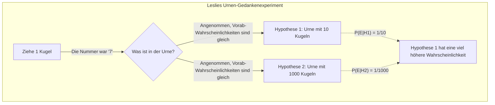
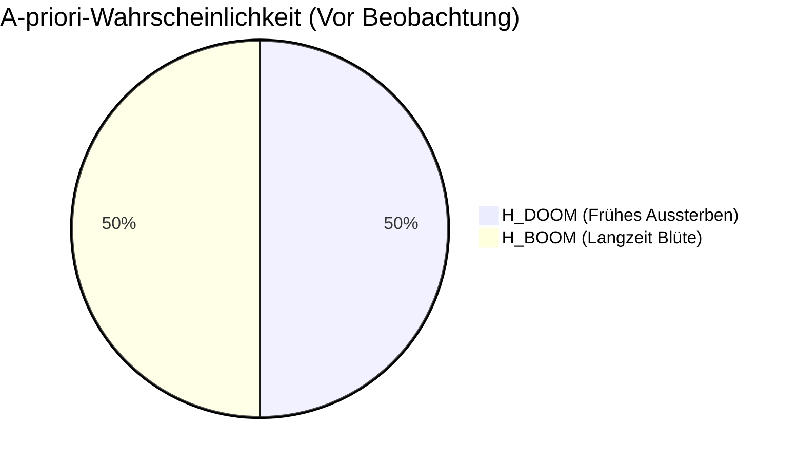
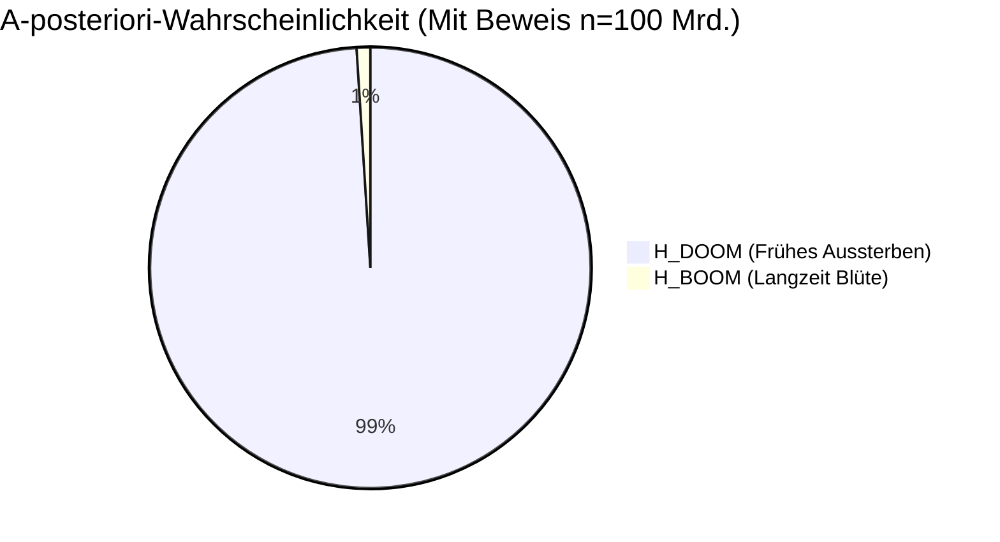
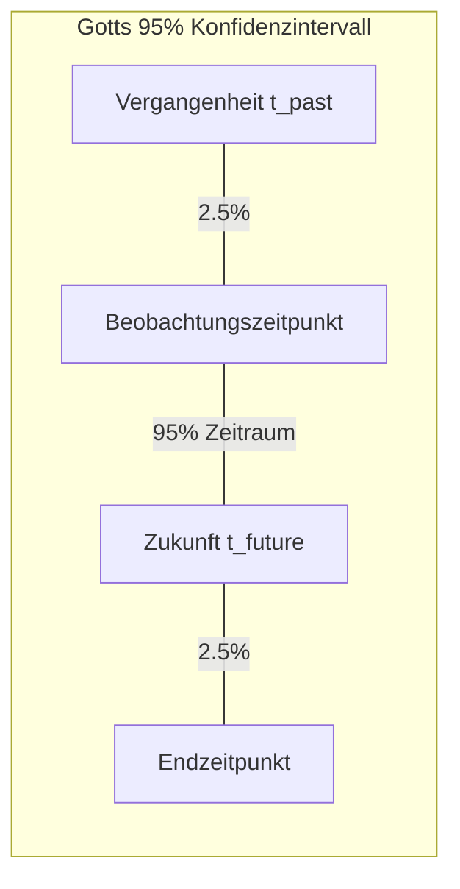
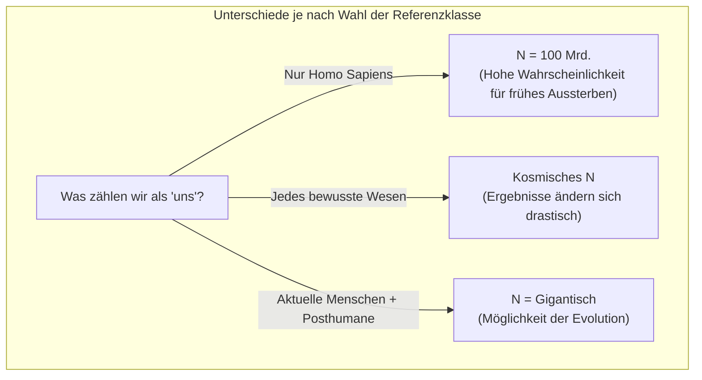

## 1. Einleitung: Leben wir in einer „besonderen“ Ära?

Wann wird die Menschheit untergehen? Diese Frage wird seit langem in Religion, Philosophie und Science-Fiction thematisiert. Doch seit den 1980er Jahren begannen Forscher, sich dieser Frage durch einen mathematischen Ansatz mithilfe von **Wahrscheinlichkeitstheorie** und **Bayes'scher Inferenz** zu nähern. Dies ist das hier vorgestellte **Doomsday-Argument** (Endzeit-Argument).

Das Doomsday-Argument wurde zuerst von dem Physiker Brandon Carter vorgeschlagen und später von dem Philosophen John Leslie, dem Astrophysiker J. Richard Gott und Nick Bostrom verfeinert. Das Erstaunliche an diesem Argument ist, dass es ganz ohne komplexe Klimamodelle, Simulationen eines Atomkriegs oder Wahrscheinlichkeiten für Asteroideneinschläge auskommt. Stattdessen leitet es durch bloße „Wahrscheinlichkeitsprinzipien“ und „statistische Schlussfolgerungen“ eine äußerst pessimistische Vorhersage für die verbleibende Existenzdauer der Menschheit ab.

In diesem Artikel werden wir die logische Struktur dieses **Doomsday-Arguments** erklären. Vom kopernikanischen Prinzip über die mathematische Formulierung der Bayes'schen Inferenz bis hin zu Gegenargumenten und der Bedeutung in der heutigen Zeit – alles wird ausführlich und mit Diagrammen veranschaulicht.

## 2. Die zugrunde liegende Idee: Kopernikanisches Prinzip und Anthropisches Prinzip

Der Schlüssel zum tiefen Verständnis des Doomsday-Arguments ist das **kopernikanische Prinzip** (Copernican Principle). Dies ist eine heuristische Regel, die besagt: „Wir sind keine besonderen Beobachter im Universum“ und stellt eine der grundlegenden Prämissen in der Astronomie dar.

Ein Blick in die Geschichte zeigt, dass die Erde nicht das Zentrum des Universums ist (heliozentrisches Weltbild), dass unser Sonnensystem nicht das Zentrum der Milchstraße ist und dass auch unsere Galaxie nicht das Zentrum des Kosmos ist. Die Menschheit hat die Wissenschaft stets dadurch vorangebracht, dass sie die Tatsache akzeptierte, dass „wir nicht an einem besonderen Ort existieren“.

Das Doomsday-Argument erweitert dieses kopernikanische Prinzip nicht nur auf den „Raum“, sondern auch auf die „Zeit“ und die „Geburtsreihenfolge“.
Das bedeutet: Man nimmt an, dass die Tatsache, dass Sie genau in dieser Epoche und genau an dieser bestimmten Stelle in der gesamten Geschichte der Menschheit geboren wurden, nichts Besonderes, sondern lediglich ein zufälliges Resultat ist.

Nehmen wir an, die Menschheit wird in den nächsten Milliarden Jahren florieren und es werden Billionen oder Billiarden Menschen geboren. In diesem Fall ist die Wahrscheinlichkeit extrem gering, dass „Sie“ als einer von den bisher etwa 100 Milliarden geborenen Menschen existieren. Anstatt zu denken, dass Sie zu den „sehr seltenen ersten Menschen der Menschheitsgeschichte“ gehören, ist es wahrscheinlichkeitstheoretisch viel plausibler anzunehmen, dass „die Gesamtzahl der Menschen nicht so groß sein wird und Sie in einer durchschnittlichen Mitte geboren wurden“. Dies ist auch eine Form des sogenannten Beobachter-Auswahl-Effekts (Observation Selection Effect).

## 3. John Leslies Urnen-Gedankenexperiment

Der Philosoph John Leslie entwarf das „Urnen-Gedankenexperiment“, um diese intuitive Schlussfolgerung verständlich zu erklären.

Vor Ihnen steht eine Urne, in die Sie nicht hineinsehen können. Sie wissen, dass diese Urne **eine der beiden folgenden** sein muss:

*   **Hypothese 1 (Kleine Urne):** Enthält 10 Kugeln, nummeriert von 1 bis 10.
*   **Hypothese 2 (Große Urne):** Enthält 1000 Kugeln, nummeriert von 1 bis 1000.

Sie ziehen nun zufällig eine Kugel aus der Urne. Die gezogene Nummer ist **„7“**.

Ist diese Urne nun die „kleine Urne“ oder die „große Urne“? Intuitiv gedacht ist die Wahrscheinlichkeit, dass Sie aus 1000 Kugeln zufällig eine so kleine Zahl wie die 7 ziehen (0,1%), sehr viel geringer als die Wahrscheinlichkeit, die 7 aus 10 Kugeln zu ziehen (10%). Es ist also rational zu folgern: **„Dies ist wahrscheinlich die kleine Urne.“**

Übertragen wir dies nun auf die Geschichte der Menschheit:

*   Kugelnummer = Ihre Geburtsreihenfolge (Angenommen etwa der 100-Milliardste)
*   Kleine Urne = Die Menschheit wird bald aussterben und die Gesamtpopulation bleibt gering (z.B. 200 Milliarden)
*   Große Urne = Die Menschheit wird eine interstellare Zivilisation aufbauen und die Gesamtpopulation wird gigantisch (z.B. 20 Billionen)

Die beobachtete Tatsache, dass Sie eine vergleichsweise kleine Geburtsnummer von „100 Milliarden“ haben, ist ein sehr starker Beweis, der die Hypothese „Die Gesamtbevölkerung der Menschheit wird gering bleiben“ unterstützt.

## 4. Mathematische Formulierung mit Bayes'scher Inferenz

Lassen Sie uns diese Intuition mit **Bayes'scher Inferenz** (Bayesian Inference) rigoros mathematisch formulieren. Der Satz von Bayes beschreibt, wie die Wahrscheinlichkeit einer Hypothese (A-posteriori-Wahrscheinlichkeit) aktualisiert werden sollte, wenn ein neuer Beweis (Beobachtungsdaten) gefunden wird.

$$ P(H|E) = \frac{P(E|H) \cdot P(H)}{P(E)} $$

Dabei haben die Variablen folgende Bedeutung:
*   $H$ : Betrachtete Hypothese (Hypothesis)
*   $E$ : Beobachteter Beweis (Evidence)
*   $P(H)$ : A-priori-Wahrscheinlichkeit (Wahrscheinlichkeit der Hypothese vor dem Beweis)
*   $P(E|H)$ : Likelihood (Wie wahrscheinlich der Beweis ist, falls die Hypothese stimmt)
*   $P(H|E)$ : A-posteriori-Wahrscheinlichkeit (Wahrscheinlichkeit der Hypothese nach Einbeziehung des Beweises)

Sei $N$ die Gesamtzahl aller jemals lebenden Menschen und $n$ Ihre persönliche Geburtsreihenfolge.
Der Einfachheit halber nehmen wir an, es gäbe nur zwei konkurrierende Hypothesen:

*   $H_{DOOM}$ (Aussterbe-Szenario) : Die Menschheit wird früh aussterben. Gesamtzahl $N_{DOOM} = 2 \times 10^{11}$ (200 Milliarden Menschen)
*   $H_{BOOM}$ (Blüte-Szenario) : Die Menschheit wird lange florieren. Gesamtzahl $N_{BOOM} = 2 \times 10^{13}$ (20 Billionen Menschen)

Der Beweis $E$ ist die Tatsache, dass „Ihre Geburtsnummer $n$ etwa bei $1 \times 10^{11}$ (100 Milliarden) liegt“.

Nehmen wir an, wir gehen vor der Datenerhebung davon aus, dass beide Hypothesen gleich wahrscheinlich sind.
$$ P(H_{DOOM}) = P(H_{BOOM}) = 0.5 $$

Nun berechnen wir die Likelihood $P(E|H)$ für beide Szenarien. Aufgrund des kopernikanischen Prinzips nehmen wir an, dass Sie mit gleicher Wahrscheinlichkeit (Gleichverteilung) aus der Menge aller in der Vergangenheit und Zukunft lebenden Menschen ausgewählt werden (Prinzip der Indifferenz).

$$ P(n | H_{DOOM}) = \frac{1}{N_{DOOM}} = \frac{1}{2 \times 10^{11}} $$
$$ P(n | H_{BOOM}) = \frac{1}{N_{BOOM}} = \frac{1}{2 \times 10^{13}} $$

Mit diesen Werten berechnen wir die A-posteriori-Wahrscheinlichkeit für $H_{DOOM}$ unter Verwendung des Satzes der totalen Wahrscheinlichkeit im Nenner des Bayes-Theorems:

$$ P(H_{DOOM} | n) = \frac{P(n | H_{DOOM}) P(H_{DOOM})}{P(n | H_{DOOM}) P(H_{DOOM}) + P(n | H_{BOOM}) P(H_{BOOM})} $$

Durch Einsetzen:

$$ P(H_{DOOM} | n) = \frac{\frac{1}{2 \times 10^{11}} \times 0.5}{\frac{1}{2 \times 10^{11}} \times 0.5 + \frac{1}{2 \times 10^{13}} \times 0.5} $$

Wir können die 0.5 aus Zähler und Nenner kürzen:

$$ P(H_{DOOM} | n) = \frac{\frac{1}{2 \times 10^{11}}}{\frac{1}{2 \times 10^{11}} + \frac{1}{2 \times 10^{13}}} $$

Multipliziert man nun den Zähler und Nenner mit $2 \times 10^{11}$:

$$ P(H_{DOOM} | n) = \frac{1}{1 + \frac{2 \times 10^{11}}{2 \times 10^{13}}} = \frac{1}{1 + \frac{1}{100}} = \frac{1}{1.01} \approx 0.9901 $$

Erstaunlicherweise ist die Wahrscheinlichkeit für **„frühes Aussterben ($H_{DOOM}$)“**, die anfangs bei 50% lag, nach der Bayes'schen Aktualisierung allein durch das Wissen über die eigene Geburtsnummer auf **ca. 99%** in die Höhe geschnellt. Die verbleibenden 1% stellen das Langzeit-Überlebens-Szenario dar. Das ist die mathematische Essenz des Doomsday-Arguments und ein kontraintuitives, erstaunliches Ergebnis.

## 5. Das Delta-t-Argument von J. Richard Gott

Der Physiker J. Richard Gott kam aus einem leicht anderen Ansatzwinkel zu einer sehr ähnlichen Schlussfolgerung. Als er 1969 die Berliner Mauer besuchte, fragte er sich: „Wie lange wird diese Mauer noch stehen?“

Er nahm an, dass sein Besuch an der Mauer zu keinem „besonderen“ Zeitpunkt in der Geschichte der Mauer stattfand, sondern zu einem völlig zufälligen Zeitpunkt (gleichverteilt). Sei die bisher vergangene Existenzzeit der Mauer $t_{past}$ und die zukünftige verbleibende Zeit $t_{future}$. Die gesamte Lebensdauer der Mauer ist $t_{total} = t_{past} + t_{future}$.

Wir suchen nun nach der Wahrscheinlichkeit, dass der Zeitpunkt seines Besuchs nicht in den ersten 2,5% oder den letzten 2,5% der Lebensdauer liegt (also innerhalb eines 95% Konfidenzintervalls liegt).
Wenn man sich im mittleren 95%-Bereich befindet, gilt die folgende Ungleichung:

$$ 0.025 \leq \frac{t_{past}}{t_{past} + t_{future}} \leq 0.975 $$

Löst man dies nach $t_{future}$ auf, erhält man:

$$ \frac{1}{39} t_{past} \leq t_{future} \leq 39 \cdot t_{past} $$

Als Gott 1969 diese Überlegung anstellte, stand die Mauer bereits seit 8 Jahren ($t_{past} = 8$). Er sagte also voraus, dass die zukünftige Lebensdauer der Mauer mit 95% Wahrscheinlichkeit „zwischen 0,2 und 312 Jahren“ liegen würde. Erstaunlicherweise fiel die Mauer 20 Jahre später, im Jahr 1989, und lag somit genau im Bereich seiner Vorhersage.

Wenden wir dieses **Delta-t-Argument** auf die Existenzdauer der Menschheit an.
Angenommen, der moderne Mensch (Homo Sapiens) existiert seit etwa 200.000 Jahren ($t_{past} = 200,000$).
Mit der obigen Formel ergibt sich:

$$ \frac{200,000}{39} \leq t_{future} \leq 39 \times 200,000 $$
$$ 5,128 \text{ Jahre} \leq t_{future} \leq 7,800,000 \text{ Jahre} $$

Die Schlussfolgerung lautet also, dass die Menschheit mit 95%iger Wahrscheinlichkeit **„in den nächsten 5.000 bis 7,8 Millionen Jahren aussterben wird“**. Die Wahrscheinlichkeit, dass die Menschheit noch über Hunderte Millionen oder Milliarden Jahre existiert, ist nach diesem statistischen Schluss extrem gering. Auf kosmischer Skala sind 7,8 Millionen Jahre nur ein Wimpernschlag.

## 6. Gegenargumente zum Doomsday-Argument: SSA vs. SIA

Trotz der Einfachheit und Stärke des Arguments gab es viele Kritiken und Gegenargumente von Wissenschaftlern. Die philosophischen Debatten drehen sich hauptsächlich um den Unterschied in den Annahmen darüber, wie „die Tatsache der eigenen Existenz als Beweis gewertet wird“.

Es gibt hauptsächlich zwei Standpunkte:

### SSA (Self-Sampling Assumption)
Dies ist die Position, die von Befürwortern des Doomsday-Arguments eingenommen wird. Sie besagt: „Man sollte davon ausgehen, dass man zufällig aus allen **tatsächlich existierenden Beobachtern** ausgewählt wurde.“ Darauf aufbauend entsteht die Logik: „Je kleiner die Gesamtpopulation, desto höher die Wahrscheinlichkeit für meine aktuelle Position“, was das Doomsday-Argument gültig macht.

### SIA (Self-Indication Assumption)
Die **SIA** hingegen bietet eine starke Entgegnung gegen das Doomsday-Argument. SIA besagt: „Man sollte davon ausgehen, dass man zufällig aus allen **möglichen Beobachtern** ausgewählt wurde. Folglich ist die Wahrscheinlichkeit, dass man überhaupt existiert, umso höher, je mehr Beobachter in einem Szenario existieren.“

In mathematischen Begriffen ausgedrückt: Bei Verwendung von SIA muss die A-priori-Wahrscheinlichkeit proportional zur Gesamtpopulation $N$ jeder Hypothese gewichtet werden.

$$ P_{SIA}(H_{BOOM}) \propto N_{BOOM} \times P(H_{BOOM}) $$
$$ P_{SIA}(H_{DOOM}) \propto N_{DOOM} \times P(H_{DOOM}) $$

Wenn man dies in die vorherige Bayes-Aktualisierungsformel einsetzt, gleicht der „Vorteil“ in der A-priori-Wahrscheinlichkeit (je größer die Population, desto höher die Existenzwahrscheinlichkeit) den „Nachteil“ der Likelihood bei großer Population exakt aus. Als Ergebnis verändern sich die relativen Wahrscheinlichkeiten von $H_{DOOM}$ und $H_{BOOM}$ vor und nach dem Wissen um die eigene Geburtsnummer $n$ überhaupt nicht. Wäre SIA korrekt, würde dies das Doomsday-Argument logisch entkräften. Jedoch führt auch SIA zu eigenen Paradoxien (wie z. B., dass die Wahrscheinlichkeit zusammenbricht, wenn man eine unendliche Population annimmt), sodass diese Debatte noch lange nicht endgültig entschieden ist.

## 7. Das Referenzklassen-Problem (The Reference Class Problem)

Eine weitere schwerwiegende Kritik am Doomsday-Argument betrifft die Definition der **Referenzklasse** (Reference Class).

In der bisherigen Berechnung haben wir uns selbst als „einer von allen ‚Menschen‘, die bisher geboren wurden“ betrachtet. Doch wo zieht man die Grenze für diese Definition von „Menschen (Beobachtern)“?

*   Sollte man ausgestorbene Verwandte wie den Neandertaler einbeziehen?
*   Wenn sich die Menschheit in Zukunft durch genetische Manipulation oder Cyborgisierung zu „Posthumanen“ weiterentwickelt, sollten diese mitgezählt werden?
*   Zählen außerirdische Lebensformen oder hochentwickelte, bewusste Künstliche Intelligenz (KI) als „Beobachter“ zu dieser Referenzklasse?

Wenn man z.B. hyper-fortschrittliche KI oder posthumane Existenzen nicht in dieselbe Referenzklasse einschließt (sondern sie als andere Spezies betrachtet), dann würde das Doomsday-Argument nicht „das totale Aussterben der Menschheit“ vorhersagen, sondern lediglich „das Ende des aktuellen Homo Sapiens in seiner derzeitigen Form (ein Übergang durch Evolution)“. Dass das Berechnungsergebnis und seine Implikationen radikal davon abhängen, wie man die Referenzklasse definiert, ist eine der größten Schwächen dieses Arguments.

## 8. Fazit: Wie sollen wir dem Doomsday-Argument begegnen?

Das Doomsday-Argument mag auf den ersten Blick nur wie ein linguistisches Spiel oder ein mathematischer Trick wirken. Doch moderne Philosophen wie Nick Bostrom oder Institute wie das „Future of Humanity Institute“ der Universität Oxford, die existenzielle Risiken (Existential Risk) studieren, betrachten und diskutieren dieses Argument weiterhin sehr ernsthaft.

Das liegt daran, dass das Doomsday-Argument eine sehr starke Warnung dagegen ist, **bedingungslos zu glauben, die Menschheit werde unendlich lange existieren**. Durch atomare Bedrohungen, unkontrollierte Künstliche Intelligenz, künstliche Pandemien durch synthetische Biologie oder den Klimawandel verfügt die Menschheit heute über mehr Mittel als je zuvor, um sich selbst zu vernichten.

Das kopernikanische Prinzip vermittelt uns eine harte Lektion: **„Es gibt absolut keine Garantie dafür, dass die heutige Ära etwas Besonderes ist und ewig andauern wird.“** Anstatt dies als bloßes mathematisches Paradoxon abzutun, bleibt das Doomsday-Argument von großem Wert, indem es uns dazu inspiriert, die Zerbrechlichkeit unserer Spezies zu erkennen und Maßnahmen zu ergreifen, die unsere Überlebenswahrscheinlichkeit zumindest ein wenig verbessern. Wir müssen unsere Anstrengungen fortsetzen, das zukünftige „N“ durch unsere eigenen Hände zu vergrößern, um die Vorhersage des Doomsday-Arguments eines Tages widerlegen zu können.
