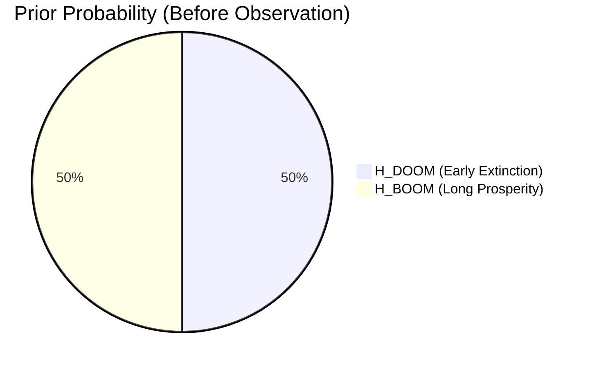
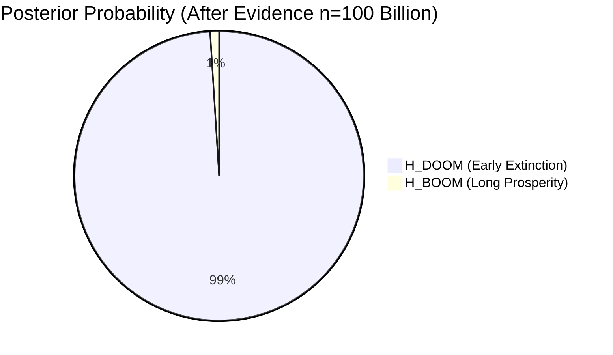
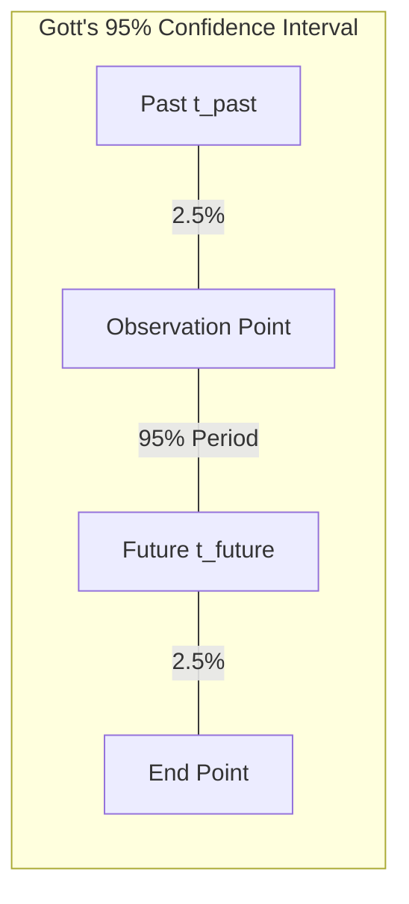
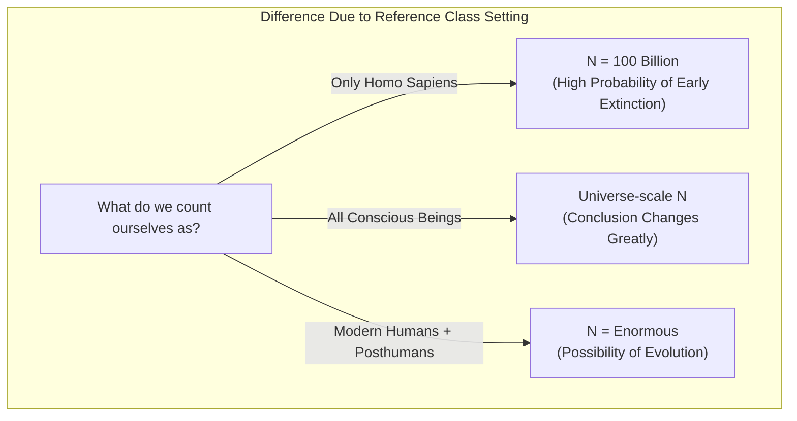

## 1. Introduction: Are We Living in a "Special" Era?

When will humanity go extinct? This question has long been treated as a theme in religion, philosophy, and science fiction. However, since the 1980s, researchers have emerged who attempted a mathematical approach to this question using **Probability Theory** and **Bayesian Inference**. That is the **Doomsday Argument**, which we will introduce this time.

[The Doomsday Argument](https://kenji.blog/en/p/doomsday-argument/) was first proposed by the physicist Brandon Carter, and later refined by the philosopher John Leslie, astrophysicist J. Richard Gott, and Nick Bostrom among others. The astonishing point of this argument is that it derives an extremely pessimistic prediction about the survival period of humanity based solely on "principles of probability" and "statistical inference," without using complex climate change models, nuclear war simulations, or asteroid collision probabilities.

In this article, we will explain in detail what kind of logical structure this **Doomsday Argument** has, starting from the underlying Copernican principle, through mathematical formulas using Bayesian inference, and even discussing counterarguments and its significance in modern times, incorporating diagrams.

## 2. The Underlying Philosophy: The Copernican Principle and the Anthropic Principle

The key to deeply understanding the Doomsday Argument is the **Copernican Principle**. This is an empirical rule stating that "we are not special observers in the universe," and is one of the fundamental prerequisites in astronomy.

Looking back at history, the Earth was not the center of the universe (heliocentrism), the solar system was not the center of the Milky Way galaxy, and our galaxy was not the center of the universe. Humanity has always advanced science by accepting the fact that "we are not in a special position."

[The Doomsday Argument](https://kenji.blog/en/p/doomsday-argument/) extends this Copernican Principle not only to "space" but also to "time" and "birth order."
In other words, it considers that "the fact that you were born in this era, at a specific rank in the entire history of humanity, is by no means special, but merely a random result."

Suppose humanity flourishes for billions of years to come, and trillions or quadrillions of humans are born. In that case, the probability of "you" being born as one of the approximately 100 billion people born up to now would be extremely low. Probabilistically, it is more reasonable to think that "the total number of humanity is not that large, and you were born in a very average middle stage" than to think that you are "a very rare early human in human history." This is also a type of Observation Selection Effect.

## 3. John Leslie's Urn Thought Experiment

The philosopher John Leslie devised an "Urn Thought Experiment" to explain this intuitive reasoning clearly.

There is one urn in front of you whose contents cannot be seen. You know that this urn is **one of the following**:

*   **Hypothesis 1 (Small Urn):** It contains 10 balls with numbers from 1 to 10 written on them.
*   **Hypothesis 2 (Large Urn):** It contains 1000 balls with numbers from 1 to 1000 written on them.

You randomly draw one ball from the urn. The number written on that ball was **"7"**.

Now, is this urn the "Small Urn" or the "Large Urn"? Intuitively thinking, since the probability of drawing the very small number 7 out of 10 balls (10%) is much higher than the probability of drawing it by chance out of 1000 balls (0.1%), it is rational for us to infer that **"This is the Small Urn."**

Let's apply this to human history:

*   Ball number = Your birth order (assumed to be about the 100 billionth)
*   Small Urn = Humanity will go extinct before long, and the total population is small (e.g., 200 billion people)
*   Large Urn = Humanity will build an interstellar civilization, and the total population will be enormous (e.g., 20 trillion people)

The observational fact that you possess the relatively small rank of "100 billionth" serves as strong evidence supporting the hypothesis that "the total population of humanity is small."

```mermaid
graph TD
    subgraph "Leslie's Urn Thought Experiment"
        A["Draw 1 Ball"] -->|"Number was '7'"| B{"What is the Urn?"}
        B -->|"Assume Prior Probabilities are Equal"| C["Hypothesis 1: Urn with 10 Balls"]
        B -->|"Assume Prior Probabilities are Equal"| D["Hypothesis 2: Urn with 1000 Balls"]
        C -.->|"P("E|H1") = 1/10"| E["Hypothesis 1 has Higher Likelihood"]
        D -.->|"P("E|H2") = 1/1000"| E
    end
```

## 4. Mathematical Formulation Using Bayesian Inference

Let's formulate this intuition strictly mathematically using **Bayesian Inference**. [Bayes' Theorem](https://kenji.blog/en/p/bayes-theorem/) is a theorem that shows how to update the probability of a certain hypothesis (posterior probability) when new evidence (observation data) is obtained.

$$ P(H|E) = \frac{P(E|H) \cdot P(H)}{P(E)} $$

Here, each variable has the following meaning:
*   $H$ : The hypothesis being considered
*   $E$ : The observed evidence
*   $P(H)$ : Prior probability (the probability of the hypothesis before seeing the evidence)
*   $P(E|H)$ : Likelihood (the probability that the evidence is observed assuming the hypothesis is true)
*   $P(H|E)$ : Posterior probability (the probability of the hypothesis after considering the evidence)

Let the total number of humanity be $N$, and your birth order be $n$.
For simplicity, we consider that there are only 2 competing hypotheses.

*   $H_{DOOM}$ (Extinction Scenario): Humanity goes extinct early. Total population $N_{DOOM} = 2 \times 10^{11}$ (200 billion people)
*   $H_{BOOM}$ (Prosperity Scenario): Humanity prospers for a long time. Total population $N_{BOOM} = 2 \times 10^{13}$ (20 trillion people)

The evidence $E$ is the fact that "your birth order $n$ is about $1 \times 10^{11}$ (100 billion)."

We assume the prior probabilities before obtaining information are equal.
$$ P(H_{DOOM}) = P(H_{BOOM}) = 0.5 $$

Next, we calculate the likelihood $P(E|H)$ under each hypothesis. Based on the Copernican Principle, we assume that you are chosen with equal probability (uniform distribution) from all humans from the past to the future (principle of indifference).

$$ P(n | H_{DOOM}) = \frac{1}{N_{DOOM}} = \frac{1}{2 \times 10^{11}} $$
$$ P(n | H_{BOOM}) = \frac{1}{N_{BOOM}} = \frac{1}{2 \times 10^{13}} $$

Using this, we calculate the posterior probability of $H_{DOOM}$. Expanding [Bayes' Theorem](https://kenji.blog/en/p/bayes-theorem/) using the Law of Total Probability gives the following:

$$ P(H_{DOOM} | n) = \frac{P(n | H_{DOOM}) P(H_{DOOM})}{P(n | H_{DOOM}) P(H_{DOOM}) + P(n | H_{BOOM}) P(H_{BOOM})} $$

We substitute the values to proceed with the calculation:

$$ P(H_{DOOM} | n) = \frac{\frac{1}{2 \times 10^{11}} \times 0.5}{\frac{1}{2 \times 10^{11}} \times 0.5 + \frac{1}{2 \times 10^{13}} \times 0.5} $$

We cancel $0.5$ from the numerator and denominator and simplify:

$$ P(H_{DOOM} | n) = \frac{\frac{1}{2 \times 10^{11}}}{\frac{1}{2 \times 10^{11}} + \frac{1}{2 \times 10^{13}}} $$

Multiply both sides by $2 \times 10^{11}$:

$$ P(H_{DOOM} | n) = \frac{1}{1 + \frac{2 \times 10^{11}}{2 \times 10^{13}}} = \frac{1}{1 + \frac{1}{100}} = \frac{1}{1.01} \approx 0.9901 $$

Surprisingly, the probability of **"Early Extinction ($H_{DOOM}$)"**, which was 50% in prior probability, has jumped to **about 99%** by performing a Bayesian update using one's own birth order as evidence. The remaining 1% is the probability of the prosperity scenario. This is the mathematical essence of the Doomsday Argument, and an astonishing conclusion that runs counter to intuition.




## 5. J. Richard Gott's Delta-t Argument

The physicist J. Richard Gott derived a similar conclusion from a slightly different approach. When he visited the Berlin Wall in 1969, he suddenly wondered, "How much longer will this wall exist?"

He assumed that he did not visit at a "special" timing in the wall's history, but at a random timing (uniform distribution). Let the past survival period of the wall be $t_{past}$ and the future survival period be $t_{future}$. The total survival period of the wall is $t_{total} = t_{past} + t_{future}$.

He sought the probability that the point in time he visited was not within the first or last 2.5% of the entire $t_{total}$ (in other words, a 95% confidence interval).
If you are in the middle 95% period, the following inequality holds:

$$ 0.025 \leq \frac{t_{past}}{t_{past} + t_{future}} \leq 0.975 $$

Solving this for $t_{future}$ yields the following:

$$ \frac{1}{39} t_{past} \leq t_{future} \leq 39 \cdot t_{past} $$

Since 8 years had passed since the construction of the Berlin Wall at the time in 1969 ($t_{past} = 8$), Gott predicted that the future survival period of the wall would be "between 0.2 years and 312 years" with a 95% probability. Amazingly, the wall fell 20 years later in 1989, beautifully falling within the range of his prediction.

Let's apply this **Delta-t Argument** to the survival period of humanity.
Suppose it has been about 200,000 years since modern humans (Homo sapiens) emerged ($t_{past} = 200,000$ years).
Applying the formula from earlier results in the following calculation:

$$ \frac{200,000}{39} \leq t_{future} \leq 39 \times 200,000 $$
$$ 5,128 \text{ years} \leq t_{future} \leq 7,800,000 \text{ years} $$

In other words, the conclusion is drawn that there is a 95% probability that humanity **"will go extinct within the next 5,000 to 7.8 million years."** According to this statistical inference, the probability of humanity continuing to prosper for hundreds of millions or billions of years is extremely low. From the scale of the universe, a period of 7.8 million years is but a fleeting moment.



## 6. Counterarguments to the Doomsday Argument: SSA and SIA

While it is such a simple and powerful argument, naturally, criticisms and counterarguments have been raised by many scholars. The center of the philosophical dispute lies in the difference in assumptions regarding "how to treat the fact that one exists as evidence."

There are mainly two standpoints.

### Self-Sampling Assumption (SSA)
This is the standpoint adopted by supporters of the Doomsday Argument. It is the idea that "one should consider oneself as having been randomly selected from all actually existing observers." Based on this, as mentioned above, "the smaller the total population, the higher the probability that one is at their current rank," making the Doomsday Argument valid.

### Self-Indication Assumption (SIA)
On the other hand, **SIA** serves as a strong counterargument to the Doomsday Argument. SIA asserts that "one should consider oneself as having been randomly selected from all **possible** observers, and therefore, the hypothesis with more observers gives a higher probability that one exists in the first place."

Expressed as a formula, it considers that the prior probability when adopting SIA should be corrected proportionally to the total population $N$ in each hypothesis.

$$ P_{SIA}(H_{BOOM}) \propto N_{BOOM} \times P(H_{BOOM}) $$
$$ P_{SIA}(H_{DOOM}) \propto N_{DOOM} \times P(H_{DOOM}) $$

If we incorporate this into the Bayesian update formula from earlier, the penalty for the large-population hypothesis ($H_{BOOM}$) (low likelihood) and the bonus for the prior probability (the larger the population, the higher the probability that you exist) perfectly cancel each other out. As a result, it leads to the conclusion that the relative probabilities of $H_{DOOM}$ and $H_{BOOM}$ do not change at all before and after knowing the birth order $n$. If SIA is correct, the Doomsday Argument is logically nullified. However, SIA also possesses other paradoxes, such as "the probability breaking down when assuming an infinite population," and the debate is not fully settled.

## 7. The Reference Class Problem

Another major criticism of the Doomsday Argument is the problem concerning the definition of the **Reference Class**.

In the calculations so far, we counted ourselves as "one of all the 'human beings' born so far." However, from where to where does this definition of "humanity (observer)" apply?

*   Should extinct close relatives like Neanderthals be included?
*   In the future, when humanity evolves into "posthumans" through genetic engineering or cybernetization, should they be included in the count?
*   Are extraterrestrial life forms or highly conscious artificial intelligences (AI) included in the reference class as "observers"?

If super-advanced AI or posthumans are not included in the reference class (separated as a different group), then what the Doomsday Argument suggests is not the "complete extinction of humanity," but merely the "end of the current form of Homo sapiens (transition via evolution into a new species)." A weakness of this argument is that the calculation results and their implications change fundamentally depending on how the reference class is set.



## 8. Conclusion: How Should We Face the Doomsday Argument?

At first glance, the Doomsday Argument might seem like just wordplay or a mathematical trick. However, among modern philosophers like Nick Bostrom and institutions studying Existential Risk like the Future of Humanity Institute at Oxford University, this argument continues to be debated seriously.

This is because the Doomsday Argument serves as a powerful warning against **"unconditionally believing that humanity will continue to prosper infinitely into the future."** The threat of nuclear weapons, runaway artificial intelligence, artificial pandemics via synthetic biology, or climate change—humanity has more means to destroy itself now than ever before.

What the Copernican Principle teaches us is the cold hard fact that **"there is no guarantee that the present is a special era that will last forever."** Rather than dismissing this as a mere mathematical paradox, the Doomsday Argument still holds unfading value as an inspiration to re-recognize the vulnerability of the species called humanity and to take action to increase the probability of our survival even a little. We must continue our efforts to increase the number "N" in the future with our own hands, and overturn the prediction of the Doomsday Argument.
