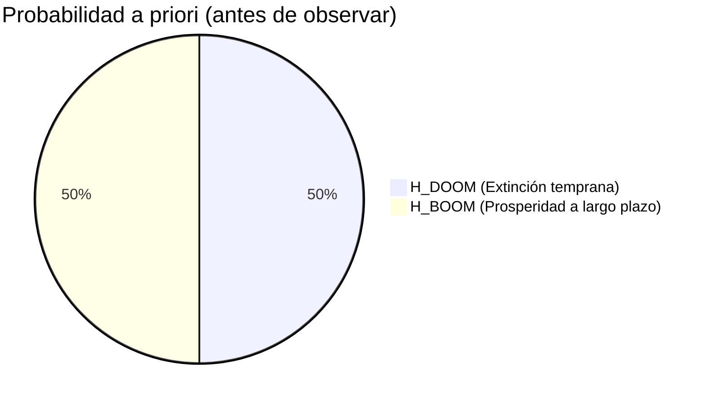
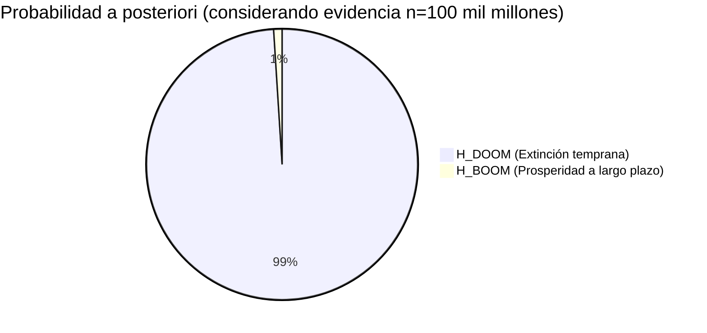
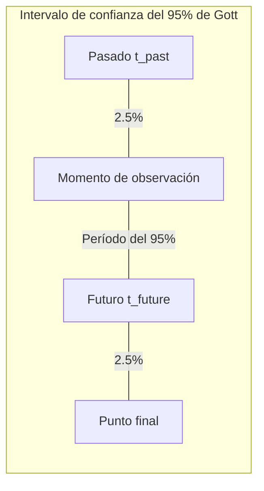
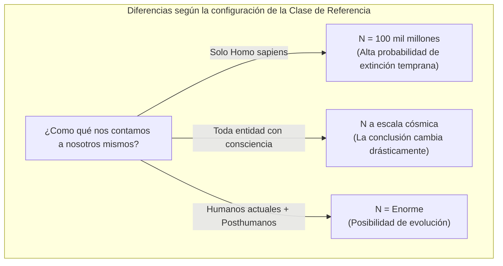

## 1. Introducción: ¿Vivimos en una época "especial"?

¿Cuándo se extinguirá la humanidad? Esta pregunta ha sido tratada desde la antigüedad como un tema recurrente en la religión, la filosofía y la ciencia ficción. Sin embargo, a partir de la década de 1980, aparecieron investigadores que intentaron abordar esta cuestión matemáticamente empleando la **teoría de la probabilidad** y la **inferencia bayesiana**. Ese es el **Argumento del Juicio Final (Doomsday Argument)** que presentaremos hoy.

El Argumento del Juicio Final fue propuesto inicialmente por el físico Brandon Carter, y posteriormente fue refinado por el filósofo John Leslie, el astrofísico J. Richard Gott y Nick Bostrom. Lo sorprendente de este argumento es que no requiere modelos complejos de cambio climático, simulaciones de guerra nuclear, ni las probabilidades de impacto de un asteroide; a partir meramente de los "principios de la probabilidad" e "inferencia estadística", deduce una predicción sumamente pesimista para la duración de la existencia humana.

En este artículo, desentrañaremos la estructura lógica del **Argumento del Juicio Final**, comenzando por el principio de Copérnico que subyace en él, continuando con la formulación de la inferencia bayesiana, y llegando incluso a las refutaciones y su relevancia en el mundo contemporáneo, explicándolo en detalle con la ayuda de diagramas.

## 2. La ideología subyacente: El principio de Copérnico y el principio antrópico

La clave para comprender en profundidad el Argumento del Juicio Final es el **Principio de Copérnico (Copernican Principle)**. Es la premisa empírica de que "no somos observadores especiales en el universo", y constituye uno de los pilares fundamentales en la astronomía.

Repasando la historia, la Tierra no era el centro del universo (heliocentrismo), ni el sistema solar el centro de la Vía Láctea, ni nuestra galaxia el centro del cosmos. La humanidad ha hecho avanzar la ciencia siempre aceptando el hecho de que "no estamos en una posición especial".

El Argumento del Juicio Final extiende este principio copernicano no solo al "espacio", sino también al "tiempo" y al "orden de nacimiento".
En otras palabras, considera que "el hecho de que hayas nacido en esta época, con un orden específico dentro de la totalidad de la historia de la humanidad, no tiene nada de especial, y es simplemente un resultado aleatorio".

Si suponemos que la humanidad prosperará durante los próximos miles de millones de años y que billones o trillones de personas nacerán, la probabilidad de que "tú" nazcas como uno de los aproximadamente 100,000 millones que han nacido hasta ahora se vuelve increíblemente minúscula. En lugar de pensar que eres "un humano extraordinariamente raro de la fase más temprana de la historia humana", es estadísticamente mucho más razonable pensar que "la población total de la humanidad no es tan grande, y tú naciste justo en el medio, como en la media". A esto se le conoce también como una variante del Efecto de Selección de Observación (Observation Selection Effect).

## 3. El experimento mental de la urna de John Leslie

Para explicar de forma comprensible esta inferencia tan contraintuitiva, el filósofo John Leslie ideó el "experimento mental de la urna".

Tienes delante de ti una urna cuyo interior no puedes ver. Sabes que esta urna es de uno de **estos dos** tipos:

*   **Hipótesis 1 (urna pequeña):** Contiene 10 bolas numeradas del 1 al 10.
*   **Hipótesis 2 (urna grande):** Contiene 1000 bolas numeradas del 1 al 1000.

Extraes una bola al azar de la urna. El número escrito en esa bola es el **"7"**.

Ahora bien, ¿es esta urna la "pequeña" o la "grande"? Intuitivamente, dado que la probabilidad de extraer por casualidad un número tan pequeño como el 7 de entre 1000 es mucho menor (0.1%) que la de extraer el 7 de entre 10 (10%), es racional deducir que **"esta es la urna pequeña"**.

Traslademos esto a la historia de la humanidad.

*   Número de la bola = Tu orden de nacimiento (asumamos que es alrededor del 100,000 millones).
*   Urna pequeña = La humanidad se extinguirá pronto, y la población total es baja (ej. 200,000 millones).
*   Urna grande = La humanidad construirá una civilización interestelar y la población total será inmensa (ej. 20 billones).

El hecho observable de que tienes un orden relativamente bajo, "el número 100,000 millones", se convierte en una fuerte evidencia a favor de la hipótesis de que "la población total de la humanidad es pequeña".

```mermaid
graph TD
    subgraph "Experimento mental de la urna de Leslie"
        A["Extraer una bola"] -->|"El número era '7'"| B{"¿Qué urna es?"}
        B -->|"Asumir probabilidades a priori iguales"| C["Hipótesis 1: Urna con 10 bolas"]
        B -->|"Asumir probabilidades a priori iguales"| D["Hipótesis 2: Urna con 1000 bolas"]
        C -.->|"P("E|H1") = 1/10"| E["La Hipótesis 1 tiene mayor verosimilitud"]
        D -.->|"P("E|H2") = 1/1000"| E
    end
```

## 4. Formalización matemática mediante Inferencia Bayesiana

Vamos a formalizar estrictamente esta intuición matemática usando la **Inferencia Bayesiana**. El teorema de Bayes nos dice cómo debemos actualizar la probabilidad de una hipótesis (probabilidad a posteriori) al obtener nueva evidencia (datos observados).

$$ P(H|E) = \frac{P(E|H) \cdot P(H)}{P(E)} $$

Donde cada variable significa lo siguiente:
*   $H$ : La hipótesis bajo consideración (Hypothesis)
*   $E$ : La evidencia observada (Evidence)
*   $P(H)$ : Probabilidad a priori (probabilidad de la hipótesis antes de ver la evidencia)
*   $P(E|H)$ : Verosimilitud (probabilidad de observar esa evidencia asumiendo que la hipótesis es correcta)
*   $P(H|E)$ : Probabilidad a posteriori (probabilidad de la hipótesis después de considerar la evidencia)

Llamemos $N$ a la población total de la humanidad, y $n$ a tu orden de nacimiento.
Para simplificar, consideraremos que solo existen 2 hipótesis competidoras.

*   $H_{DOOM}$ (Escenario de extinción): La humanidad se extinguirá pronto. Población total $N_{DOOM} = 2 \times 10^{11}$ (200,000 millones de personas).
*   $H_{BOOM}$ (Escenario de prosperidad): La humanidad prosperará largo tiempo. Población total $N_{BOOM} = 2 \times 10^{13}$ (20 billones de personas).

La evidencia $E$ es el hecho de que "tu orden de nacimiento $n$ es de aproximadamente $1 \times 10^{11}$ (100,000 millones)".

Asumiremos que las probabilidades a priori, antes de tener cualquier información, son iguales.
$$ P(H_{DOOM}) = P(H_{BOOM}) = 0.5 $$

A continuación, calcularemos la verosimilitud $P(E|H)$ bajo cada hipótesis. Según el principio de Copérnico, asumimos que tienes la misma probabilidad de ser elegido (distribución uniforme) de entre todos los seres humanos del pasado hasta el futuro (principio de indiferencia).

$$ P(n | H_{DOOM}) = \frac{1}{N_{DOOM}} = \frac{1}{2 \times 10^{11}} $$
$$ P(n | H_{BOOM}) = \frac{1}{N_{BOOM}} = \frac{1}{2 \times 10^{13}} $$

Con esto calcularemos la probabilidad a posteriori de $H_{DOOM}$. Expandiendo el teorema de Bayes con la ley de la probabilidad total, nos queda lo siguiente:

$$ P(H_{DOOM} | n) = \frac{P(n | H_{DOOM}) P(H_{DOOM})}{P(n | H_{DOOM}) P(H_{DOOM}) + P(n | H_{BOOM}) P(H_{BOOM})} $$

Sustituimos los valores y continuamos con el cálculo:

$$ P(H_{DOOM} | n) = \frac{\frac{1}{2 \times 10^{11}} \times 0.5}{\frac{1}{2 \times 10^{11}} \times 0.5 + \frac{1}{2 \times 10^{13}} \times 0.5} $$

Cancelamos el $0.5$ del numerador y denominador, y simplificamos:

$$ P(H_{DOOM} | n) = \frac{\frac{1}{2 \times 10^{11}}}{\frac{1}{2 \times 10^{11}} + \frac{1}{2 \times 10^{13}}} $$

Multiplicamos ambos lados por $2 \times 10^{11}$:

$$ P(H_{DOOM} | n) = \frac{1}{1 + \frac{2 \times 10^{11}}{2 \times 10^{13}}} = \frac{1}{1 + \frac{1}{100}} = \frac{1}{1.01} \approx 0.9901 $$

De forma pasmosa, la probabilidad de **"Extinción temprana ($H_{DOOM}$)"**, que en la probabilidad a priori era del 50%, se ha disparado hasta alcanzar el **99%** al realizar la actualización bayesiana tomando como evidencia nuestro propio orden de nacimiento. El 1% restante correspondería a la probabilidad del escenario de prosperidad. Esta es la esencia matemática del Argumento del Juicio Final, una conclusión contraintuitiva y sorprendente.




## 5. El argumento Delta-t de J. Richard Gott

El físico J. Richard Gott llegó a una conclusión similar desde un enfoque ligeramente diferente. Cuando visitó el Muro de Berlín en 1969, pensó: "¿Cuánto tiempo más existirá este muro?".

Asumió que no lo estaba visitando en un momento "especial" de su historia, sino en un momento aleatorio (distribución uniforme). Sea $t_{past}$ el tiempo de existencia pasado del muro, y $t_{future}$ el tiempo de existencia futuro. La duración total del muro será $t_{total} = t_{past} + t_{future}$.

Buscó calcular el intervalo de tiempo (el intervalo de confianza del 95%) que asegura que el momento de su visita no cayó en el 2.5% del período inicial ni en el 2.5% final del $t_{total}$.
Si se encuentra dentro del 95% del período central, se cumple la siguiente desigualdad:

$$ 0.025 \leq \frac{t_{past}}{t_{past} + t_{future}} \leq 0.975 $$

Despejando para $t_{future}$, obtenemos:

$$ \frac{1}{39} t_{past} \leq t_{future} \leq 39 \cdot t_{past} $$

Dado que para Gott en 1969 habían pasado 8 años desde la construcción del Muro de Berlín ($t_{past} = 8$), predijo que, con una probabilidad del 95%, el muro subsistiría en el futuro entre "0.2 y 312 años". Impresionantemente, el muro cayó 20 años después, en 1989, encajando a la perfección dentro del rango de su predicción.

Apliquemos este **Argumento Delta-t** a la duración de la humanidad.
Supongamos que el ser humano moderno (Homo sapiens) apareció hace aproximadamente 200,000 años ($t_{past} = 200,000$ años).
Si lo introducimos en la fórmula anterior, el cálculo es:

$$ \frac{200,000}{39} \leq t_{future} \leq 39 \times 200,000 $$
$$ 5,128 \text{ años} \leq t_{future} \leq 7,800,000 \text{ años} $$

Esto nos lleva a la conclusión de que, con un 95% de probabilidad, la humanidad **"se extinguirá dentro de 5,000 a 7.8 millones de años"**. La posibilidad de que la humanidad prospere durante cientos de millones o miles de millones de años es sumamente baja según esta deducción estadística. Visto en una escala cósmica, 7.8 millones de años no es más que un breve parpadeo.



## 6. Refutaciones al Argumento del Juicio Final: SSA y SIA

Si bien este argumento es asombrosamente sencillo y potente, es lógico que haya suscitado críticas y refutaciones por parte de numerosos académicos. El núcleo del debate filosófico radica en las suposiciones sobre "cómo debemos tratar como evidencia el hecho de que uno mismo exista".

Existen principalmente dos posturas:

### Asunción del Auto-muestreo (Self-Sampling Assumption, SSA)
Esta es la postura adoptada por los partidarios del Argumento del Juicio Final. Considera que "uno debe asumir que ha sido seleccionado al azar de entre todos los observadores que realmente existen". Basándonos en esto, tal como vimos antes, el Argumento del Juicio Final se sostiene porque "la probabilidad de que tengas el orden que posees es mayor si la población total es menor".

### Asunción de la Auto-indicación (Self-Indication Assumption, SIA)
Por otro lado, la **SIA** representa una contundente objeción al Argumento del Juicio Final. Argumenta que "uno debe considerar que ha sido seleccionado al azar de entre todos los observadores **posibles**; por consiguiente, cuanto mayor sea el número de observadores que postula una hipótesis, mayor será la probabilidad de que tú existas en absoluto".

Expresado matemáticamente, cuando se adopta la SIA, se considera que las probabilidades a priori deben ajustarse proporcionalmente a la población total $N$ en cada hipótesis.

$$ P_{SIA}(H_{BOOM}) \propto N_{BOOM} \times P(H_{BOOM}) $$
$$ P_{SIA}(H_{DOOM}) \propto N_{DOOM} \times P(H_{DOOM}) $$

Al incorporar esto a nuestra fórmula anterior de actualización de Bayes, el factor que penaliza a la hipótesis de la gran población ($H_{BOOM}$) (su baja verosimilitud) se cancela perfectamente con su recompensa en la probabilidad a priori (la alta probabilidad de tu existencia derivada de la vasta población). Como resultado, llegamos a la conclusión de que las probabilidades relativas de $H_{DOOM}$ y $H_{BOOM}$ no varían en absoluto tras conocer nuestro orden de nacimiento $n$. Si la SIA es correcta, el Argumento del Juicio Final queda lógicamente neutralizado. No obstante, la SIA acarrea sus propias paradojas, como el "colapso de las probabilidades ante poblaciones infinitas", con lo cual la disputa dista de estar saldada de forma definitiva.

## 7. El problema de la Clase de Referencia (The Reference Class Problem)

Otra objeción crucial al Argumento del Juicio Final es el problema en torno a la definición de la **Clase de Referencia (Reference Class)**.

En los cálculos que efectuamos previamente, te computaste a ti mismo como "uno entre todos los 'seres humanos' nacidos a lo largo del tiempo". Sin embargo, ¿qué abarca exactamente esa concepción de "humanidad (observador)"?

*   ¿Debemos englobar especies extintas y emparentadas como el hombre de Neandertal?
*   Cuando, en el futuro, la raza humana evolucione a "posthumanos" vía manipulaciones genéticas o integración de tecnología cíborg, ¿habremos de contarles a ellos también?
*   ¿Las formas de vida alienígena o las inteligencias artificiales avanzadas (IA) con alto grado de autoconsciencia se contemplan como "observadores" dentro de esta clase referencial?

Si decidimos exceptuar de la clase de referencia a las inteligencias artificiales superlativas o a los posthumanos (aislándolos en agrupaciones disímiles), entonces lo augurado por el Argumento del Juicio Final no implica "el aniquilamiento total del género humano", sino meramente "el ocaso del paradigma que atañe a nuestro modelo biológico actual de Homo sapiens (que cede el testigo evolutivo a una casta novedosa)". El gran flanco débil del argumento estriba en que el establecimiento de la clase de referencia es capaz de torcer el veredicto matemático y, con él, todo el sentido subyacente de la ecuación.



## 8. Conclusión: ¿Cómo enfrentarnos al Argumento del Juicio Final?

El Argumento del Juicio Final podría asemejarse, en un examen superficial, a una llana peripecia lingüística o a un mero malabarismo matemático. Pese a ello, esta especulación se aborda con plena severidad en círculos comandados por filósofos contemporáneos de la talla de Nick Bostrom y entidades enfocadas a sondear el Riesgo Existencial (Existential Risk), verbigracia, el "Instituto para el Futuro de la Humanidad" con sede en la Universidad de Oxford.

Este enfoque goza de repercusión dado que erige una formidable advertencia en detrimento de la creencia que fía **"incondicionalmente un florecimiento humano que habrá de perpetuarse en infinito al discurrir el porvenir"**. Bien a causa de pertrechos nucleares, sea por desboque de sistemas cimentados en inteligencia artificial, pestes manufacturadas por los cauces de la sintética bilógica, o por obra del reverso climático; es innegable que atesoramos vías prolíficas de inmolarnos colectivamente en una magnitud insólita hasta la fecha.

La lección descarnada del postulado de Copérnico radica en una verdad tan cruda como insoslayable: **"No hay ninguna garantía que selle al momento actual como una era privilegiada que pervivirá hasta la infinidad de los tiempos"**. En vez de desechar este enunciado rotulándolo en tanto que "disquisición con forma de paradoja numérica", valdría la pena valerse de él para revalorizar nuestra suma fragilidad colectiva a nivel de linaje terrícola. El Argumento del Juicio Final prevalece, indeleble, como un aguijón perentorio instándonos a obrar a conciencia para arañar milésimas de respiro probabilístico de supervivencia. Compete a nuestra entereza ensanchar la cuantía de una eventual «N» a la zaga y obviar con denuedo el dictamen adverso que rezuman las predicciones ligadas al Juicio Final.
