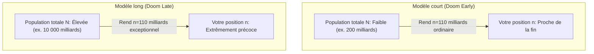

L'humanité s'éteindra-t-elle à cause d'une guerre nucléaire dans un siècle, ou prospérera-t-elle à travers la galaxie pour le prochain million d'années ?

S'il est bien sûr impossible de prédire l'avenir avec certitude, il existe une expérience de pensée qui tente de déduire l'espérance de vie restante de l'humanité uniquement en utilisant la **théorie des probabilités et les mathématiques**. Il s'agit de **l'argument de l'Apocalypse (Doomsday Argument)**, proposé indépendamment par l'astrophysicien Brandon Carter, puis détaillé par le philosophe John Leslie.

Cette théorie avance la conclusion troublante que « selon toute probabilité, l'histoire de l'humanité touche bientôt à sa fin ».

Dans cet article, nous allons expliquer de la manière la plus accessible possible ce qu'est cet argument de l'Apocalypse, ainsi que les fondements de ses calculs probabilistes.

---

## 1. L'hypothèse fondamentale : Le principe de Copernic

L'argument de l'Apocalypse repose sur une idée extrêmement fondamentale de la science moderne : le **principe de Copernic (Copernican Principle)**.

Le principe de Copernic est l'idée selon laquelle **« la position que nous occupons n'a rien de spécial ou de privilégié »**.
Historiquement, on croyait que la Terre était au centre de l'univers (géocentrisme), mais Copernic a montré que la Terre n'était qu'une planète banale. De même, le système solaire n'est pas au centre de la galaxie, et notre galaxie n'a rien de spécial dans l'univers.

L'argument de l'Apocalypse applique ce principe à la **position temporelle (l'ordre de naissance)** de l'humanité. Autrement dit, il postule que **« vous n'êtes pas né à un moment particulièrement exceptionnel dans l'histoire de l'humanité »**.

## 2. Formulation mathématique de l'argument de l'Apocalypse

Appuyons-nous sur ce postulat pour formuler mathématiquement les prédictions concernant l'espérance de vie de l'humanité.

### Étape 1 : Définition des variables

- $N$ : Le nombre total d'humains qui existeront sur Terre de la naissance de l'humanité à son extinction.
- $n$ : Votre numéro d'ordre de naissance (vous êtes le $n$-ème humain à naître).

Selon les démographes, le nombre total d'humains nés jusqu'à présent se situe à peu près entre 100 milliards et 110 milliards. Fixons donc $n = 110 \text{ milliards}$ ($1.1 \times 10^{11}$).

L'inconnue que nous voulons déterminer est $N$.

### Étape 2 : L'application du principe de Copernic (Probabilité uniforme)

Selon le principe de Copernic, vous n'êtes pas quelqu'un de spécial. Par conséquent, il est naturel de supposer que votre ordre de naissance $n$ est distribué de manière uniforme (aléatoire) par rapport au nombre total $N$.

Autrement dit, la probabilité que votre ordre de naissance relatif $f = \frac{n}{N}$ se situe dans un intervalle arbitraire peut être calculée en supposant une distribution uniforme de 0 à 1 (0% à 100%).

$$
P \left( 0.05 \le \frac{n}{N} \le 0.95 \right) = 0.90
$$

La formule ci-dessus stipule qu'« il y a 90% de chances que vous soyez né(e) entre les premiers 5% et les derniers 95% de l'histoire de tous les humains (donc au milieu des 90%) ». C'est une hypothèse très raisonnable, n'est-ce pas ? La probabilité que vous fassiez partie des tout premiers 5% de tous les humains qui existeront (une ère d'aurore extrêmement spéciale) n'est, par définition, que de 5%.

### Étape 3 : Estimation du nombre total d'humains ($N$)

Transformons l'inégalité de la probabilité de 90% précédente avec $N$ pour inconnue.
La partie $0.05 \le \frac{n}{N}$ devient :

$$
N \le \frac{n}{0.05} = 20n
$$

Puisque nous avons supposé que $n = 110 \text{ milliards}$, nous obtenons :

$$
N \le 20 \times 110 \text{ milliards} = 2.2 \text{ billions (2 200 milliards)}
$$

Conclusion : Avec un niveau de confiance de 95% (en excluant les 5% finaux), **le nombre total d'humains s'éteindra avant d'atteindre 2 200 milliards d'individus**.

## 3. Qu'est-ce que cela signifie concrètement ?

À l'heure actuelle, la population mondiale est d'environ 8 milliards. En raison du développement économique mondial, on s'attend à ce que la population humaine se stabilise autour de 10 milliards de personnes par siècle.

S'il reste environ 2 000 milliards d'humains à naître, et si chaque siècle voit naître 10 milliards d'humains, combien d'années l'humanité a-t-elle encore devant elle ?

$$
\frac{2 000 \text{ milliards de personnes}}{10 \text{ milliards de personnes / 100 ans}} = 20 000 \text{ ans}
$$

Même de façon optimiste, la conclusion mathématique qui en découle est qu'« avec un niveau de confiance de 95%, l'humanité s'éteindra dans les prochains milliers à plusieurs dizaines de milliers d'années ».

Si au contraire l'humanité réussissait à s'étendre dans l'univers, échappant ainsi à l'extinction, et qu'elle continuait de prospérer pendant encore des millions d'années, le nombre total d'humains $N$ deviendrait des milliers de billions, voire des trilliards.
Dans un tel scénario galactique de survie à long terme, « nous », qui vivons à notre époque ($n = 110 \text{ milliards}$), ferions partie d'une proportion astronomiquement petite du tout début, se chiffrant peut-être à 0.0000001% de tous les humains.

Or, le principe de Copernic nous dit que **la probabilité que nous soyons nés à une période « de genèse » aussi exceptionnelle et rare dans l'histoire de l'humanité est extrêmement faible**. C'est pour cette raison que les probabilités penchent naturellement vers le scénario selon lequel le nombre total d'humains reste faible et la fin est proche.

## 4. Est-ce bien vrai ? Réfutations de l'argument de l'Apocalypse

En voyant ce raisonnement logique qui frôle le sophisme, beaucoup d'esprits brillants ont pensé : « C'est absurde ! Il doit y avoir une faille dans la théorie ! » et ont tenté de formuler des réfutations. Voici quelques-uns de ces contre-arguments représentatifs.

### Réfutation 1 : La réfutation de l'Auto-Indication (Self-Indication Assumption)

Il s'agit d'une contre-mesure du point de vue de l'inférence bayésienne. Elle soutient que « s'il devait y avoir un très grand nombre d'humains dans le futur, la probabilité que nous existions aurait de toute façon été proportionnellement plus élevée dès le départ ».

L'argument de l'Apocalypse ne considère que la « probabilité de l'ordre de naissance » conditionnée au fait que nous existions déjà. Cependant, si l'on prend d'abord en compte la probabilité que nous puissions exister, si $N$ (le nombre total d'humains) est immense, les occasions d'existence (« les tirages de loterie ») pour l'humanité sont plus nombreuses. En compensant mathématiquement les probabilités a priori par la certitude a posteriori du fait que « je suis né et j'existe maintenant », les deux s'annulent miraculeusement, rendant les observations impuissantes à influencer nos prévisions sur la fin du monde.

### Réfutation 2 : Le problème de la classe de référence (Reference Class Problem)

Dans l'argument de l'Apocalypse, que doit-on considérer comme faisant partie des « Humains (ou observateurs) » ? Si l'on inclut non seulement *Homo sapiens*, mais aussi les australopithèques, les hommes de Néandertal ou les futurs humains génétiquement modifiés (post-humains), le nombre de base $n$ change.

S'il devenait possible un jour pour les êtres humains de télécharger leur esprit dans des ordinateurs ou que des Intelligences Artificielles (IA) possédaient une conscience, compteraient-elles comme « 1 individu » ? En fonction de la définition des observateurs, la valeur de la variable dans la formule probabiliste peut drastiquement changer.

## 5. Conclusion : Pourquoi l'argument de l'Apocalypse fascine-t-il autant les chercheurs ?

Alors, cet argument de l'Apocalypse n'était-il qu'un sophisme probabiliste ?

Pas nécessairement. Qu'il s'agisse de statistiques bayésiennes, de l'hypothèse de la simulation, ou du principe anthropique en cosmologie (Pourquoi notre univers possède-t-il les conditions nécessaires à la vie ?), la question du « traitement de l'échantillon d'observateur exceptionnel que je suis » continue de soulever de graves paradoxes dans les sciences modernes.

De nos jours, des instituts de recherche affiliés à l'Université d'Oxford, par exemple, évaluent sérieusement des menaces telles que le réchauffement climatique, les guerres nucléaires et la perte de contrôle des IA sous l'appellation de risques existentiels (Existential Risks), et abordent la prolongation de l'humanité comme une probabilité mathématique et scientifique.

Bien que l'argument de l'Apocalypse semble à première vue être une simple astuce de chiffres, il s'en dégage indéniablement une question philosophique profonde : « Qui suis-je pour être présent à ce moment précis ? » Et cette perspective pourrait bien nous obliger à réfléchir avec un peu plus d'humilité à l'avenir et à la survie de notre espèce.
