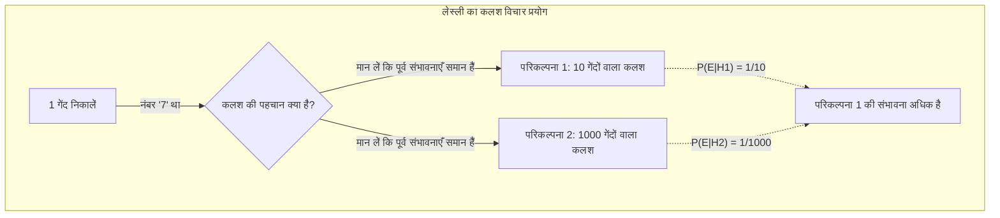
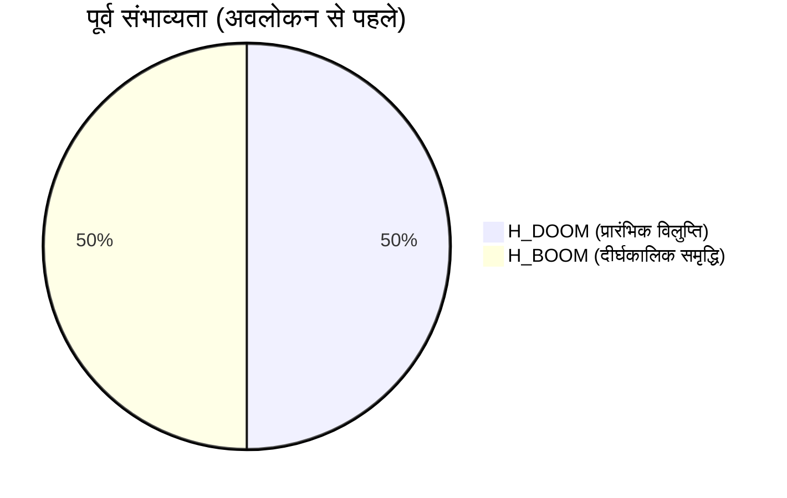
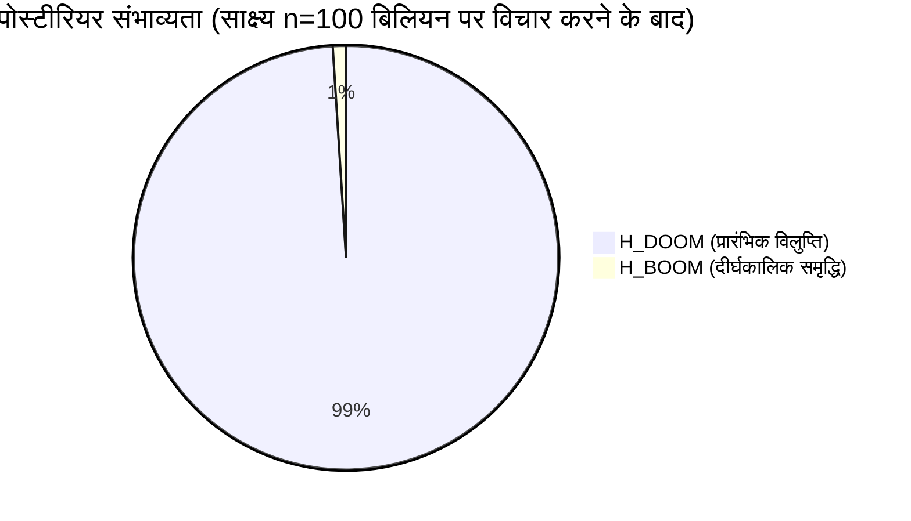
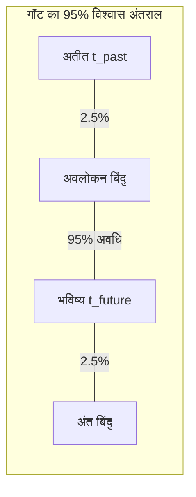
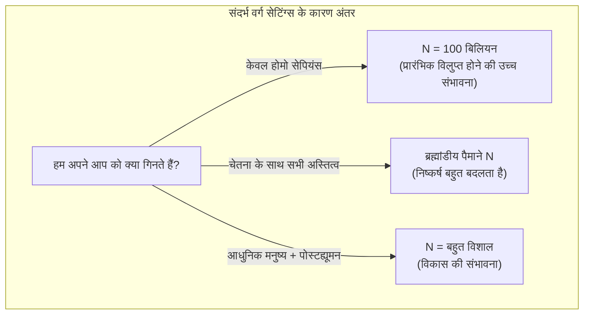

## 1. परिचय: क्या हम एक "विशेष" युग में रह रहे हैं?

मानवता का अंत कब होगा? इस प्रश्न को लंबे समय से धर्म, दर्शन और विज्ञान कथा के विषय के रूप में माना जाता रहा है। हालाँकि, 1980 के दशक के बाद से, शोधकर्ता सामने आए हैं जिन्होंने **संभाव्यता सिद्धांत (probability theory)** और **बायेसियन अनुमान (Bayesian inference)** का उपयोग करके इस प्रश्न के लिए एक गणितीय दृष्टिकोण का प्रयास किया है। वह है **कयामत का तर्क या [प्रलय का तर्क (Doomsday Argument)](https://kenji.blog/p/doomsday-argument/)** जिसे हम इस बार पेश करेंगे।

कयामत के तर्क को पहली बार भौतिक विज्ञानी ब्रैंडन कार्टर (Brandon Carter) द्वारा प्रस्तावित किया गया था, और बाद में दार्शनिक जॉन लेस्ली (John Leslie), खगोल भौतिकीविद् जे. रिचर्ड गॉट (J. Richard Gott), और निक बोस्ट्रोम (Nick Bostrom) द्वारा परिष्कृत किया गया था। इस तर्क के बारे में आश्चर्यजनक बात यह है कि यह जटिल जलवायु परिवर्तन मॉडल, परमाणु युद्ध सिमुलेशन, या क्षुद्रग्रह (asteroid) प्रभाव संभावनाओं का उपयोग किए बिना पूरी तरह से "संभावना के सिद्धांतों" और "सांख्यिकीय अनुमान (statistical inference)" से मानवता के अस्तित्व की लंबाई के बारे में बेहद निराशावादी भविष्यवाणियां करता है।

इस लेख में, हम विस्तार से बताएंगे, आरेखों के साथ, कि यह **कयामत का तर्क** किस तरह की तार्किक संरचना रखता है, जो अंतर्निहित कोपरनिकन सिद्धांत (Copernican Principle) से शुरू होकर, बायेसियन अनुमान का उपयोग करते हुए गणितीय सूत्रों तक, और आगे प्रतिवादों (counterarguments) और आधुनिक समय में इसके महत्व तक जाता है।

## 2. अंतर्निहित विचार: कोपरनिकन सिद्धांत और मानविक सिद्धांत (Anthropic Principle)

कयामत के तर्क को गहराई से समझने की कुंजी **कोपरनिकन सिद्धांत (Copernican Principle)** है। यह अनुभवजन्य नियम (rule of thumb) है कि "हम ब्रह्मांड में विशेष पर्यवेक्षक (special observers) नहीं हैं," और खगोल विज्ञान में बुनियादी पूर्वापेक्षाओं (prerequisites) में से एक है।

पीछे मुड़कर देखें, तो पृथ्वी ब्रह्मांड का केंद्र नहीं था (सूर्यकेन्द्रित सिद्धांत / heliocentric theory), न ही सौर मंडल मिल्की वे आकाशगंगा का केंद्र था, न ही हमारी आकाशगंगा ब्रह्मांड का केंद्र थी। मानवता ने हमेशा इस तथ्य को स्वीकार करके विज्ञान को आगे बढ़ाया है कि "हम किसी विशेष स्थिति में नहीं हैं।"

कयामत का तर्क इस कोपरनिकन सिद्धांत को केवल "अंतरिक्ष" ही नहीं बल्कि "समय" और "जन्म क्रम" तक विस्तारित करता है।
दूसरे शब्दों में, यह विचार है कि "तथ्य यह है कि आप मानव इतिहास के पूरे दौरान एक विशिष्ट क्रम में इस युग में पैदा हुए थे, वह विशेष नहीं है, बल्कि केवल एक यादृच्छिक परिणाम है।"

मान लीजिए कि मानवता अरबों वर्षों तक फलती-फूलती रहेगी और खरबों इंसान पैदा होंगे। उस मामले में, इस बात की संभावना बेहद कम है कि आप अब तक पैदा हुए लगभग 100 बिलियन लोगों में से एक के रूप में पैदा होंगे। यह सोचने की तुलना में कि आप "मानव इतिहास के शुरुआती दिनों में एक बहुत ही दुर्लभ इंसान हैं," संभाव्य रूप से (probabilistically) यह सोचना अधिक उचित है कि "इंसानों की कुल संख्या इतनी बड़ी नहीं है, और आपका जन्म एक बहुत ही औसत मध्य-चरण में हुआ था।" यह एक प्रकार का प्रेक्षण चयन प्रभाव (Observation Selection Effect) भी है।

## 3. जॉन लेस्ली का कलश (Urn) विचार प्रयोग

दार्शनिक जॉन लेस्ली ने इस सहज अनुमान को आसानी से समझने वाले तरीके से समझाने के लिए "कलश विचार प्रयोग" तैयार किया।

आपके सामने एक कलश (urna / बर्तन) है जिसका अंदर का हिस्सा आप नहीं देख सकते। आपको पता है कि यह कलश निम्नलिखित में से **एक** है:

*   **परिकल्पना 1 (छोटा कलश):** 10 गेंदें हैं जिन पर 1 से 10 तक के नंबर लिखे हैं।
*   **परिकल्पना 2 (बड़ा कलश):** 1000 गेंदें हैं जिन पर 1 से 1000 तक के नंबर लिखे हैं।

आप बेतरतीब ढंग से कलश से एक गेंद निकालते हैं। उस गेंद पर लिखा नंबर **"7"** था।

अब, क्या यह कलश "छोटा कलश" है या "बड़ा कलश"? सहज रूप से कहें तो, क्योंकि 10 में से 7 निकालने की संभावना (10%) 1000 में से 7 जैसी बहुत छोटी संख्या निकालने की संभावना (0.1%) से बहुत अधिक है, हमारे लिए यह निष्कर्ष निकालना तर्कसंगत है कि **"यह एक छोटा कलश है।"**

इसे मानव इतिहास पर लागू करते हैं:

*   गेंद संख्या = आपका जन्म क्रम (मान लें कि लगभग 100 बिलियनवाँ / 100,000,000,000th)
*   छोटा कलश = मानवता जल्द ही विलुप्त हो जाएगी, और कुल जनसंख्या कम है (उदाहरण के लिए: 200 बिलियन लोग)
*   बड़ा कलश = मानवता एक अंतरतारकीय (interstellar) सभ्यता का निर्माण करती है, और कुल जनसंख्या बहुत बड़ी हो जाती है (उदाहरण के लिए: 20 ट्रिलियन लोग)

प्रेक्षण तथ्य यह है कि आपके पास "100 बिलियन" का अपेक्षाकृत छोटा क्रम है, जो परिकल्पना का दृढ़ता से समर्थन करने वाला प्रमाण बन जाता है कि "मानवता की कुल जनसंख्या छोटी है।"

## 4. बायेसियन अनुमान (Bayesian Inference) का उपयोग कर गणितीय सूत्रीकरण

आइए **बायेसियन अनुमान** का उपयोग करके इस अंतर्ज्ञान (intuition) को सख्ती से गणितीय रूप से तैयार करें। बायेस का प्रमेय (Bayes' theorem) एक प्रमेय है जो दर्शाता है कि जब नए साक्ष्य (अवलोकन डेटा) प्राप्त होते हैं तो एक परिकल्पना (पोस्टीरियर संभाव्यता / posterior probability) की संभावना को कैसे अद्यतन किया जाना चाहिए।

$$ P(H|E) = \frac{P(E|H) \cdot P(H)}{P(E)} $$

यहाँ, प्रत्येक चर का अर्थ निम्नलिखित है:
*   $H$: परिकल्पना (Hypothesis) जिस पर विचार किया जा रहा है
*   $E$: देखा गया साक्ष्य (Evidence)
*   $P(H)$: पूर्व संभाव्यता (Prior probability) (साक्ष्य देखने से पहले परिकल्पना की संभावना)
*   $P(E|H)$: संभावना (Likelihood) (परिकल्पना सही होने पर साक्ष्य देखे जाने की संभावना)
*   $P(H|E)$: पोस्टीरियर संभाव्यता (Posterior probability) (साक्ष्य पर विचार करने के बाद परिकल्पना की संभावना)

मान लें कि मनुष्यों की कुल संख्या $N$ है और आपका जन्म क्रम $n$ है।
सादगी के लिए, हम मानते हैं कि केवल 2 प्रतिस्पर्धी (competing) परिकल्पनाएँ हैं।

*   $H_{DOOM}$ (डूम्सडे परिदृश्य): मानवता जल्दी विलुप्त हो जाती है। कुल जनसंख्या $N_{DOOM} = 2 \times 10^{11}$ (200 बिलियन लोग)
*   $H_{BOOM}$ (बूम परिदृश्य): मानवता लंबे समय तक समृद्ध रहती है। कुल जनसंख्या $N_{BOOM} = 2 \times 10^{13}$ (20 ट्रिलियन लोग)

साक्ष्य $E$ यह तथ्य है कि "आपका जन्म क्रम $n$ लगभग $1 \times 10^{11}$ (100 बिलियन) है।"

हम मानते हैं कि जानकारी प्राप्त करने से पहले की पूर्व संभावनाएँ समान हैं।
$$ P(H_{DOOM}) = P(H_{BOOM}) = 0.5 $$

इसके बाद, हम प्रत्येक परिकल्पना के तहत संभावना (likelihood) $P(E|H)$ की गणना करते हैं। कोपरनिकन सिद्धांत के अनुसार, हम मानते हैं कि आपको अतीत से भविष्य तक सभी मनुष्यों में से समान संभावना (समान वितरण / uniform distribution) के साथ चुना गया है (उदासीनता का सिद्धांत / principle of indifference)।

$$ P(n | H_{DOOM}) = \frac{1}{N_{DOOM}} = \frac{1}{2 \times 10^{11}} $$
$$ P(n | H_{BOOM}) = \frac{1}{N_{BOOM}} = \frac{1}{2 \times 10^{13}} $$

इसका उपयोग करके, हम $H_{DOOM}$ की पीछे की संभावना (posterior probability) की गणना करते हैं। कुल संभावना के नियम का उपयोग करके बायेस के प्रमेय का विस्तार करने पर निम्नलिखित परिणाम मिलते हैं:

$$ P(H_{DOOM} | n) = \frac{P(n | H_{DOOM}) P(H_{DOOM})}{P(n | H_{DOOM}) P(H_{DOOM}) + P(n | H_{BOOM}) P(H_{BOOM})} $$

मानों को प्रतिस्थापित करें और गणना के साथ आगे बढ़ें।

$$ P(H_{DOOM} | n) = \frac{\frac{1}{2 \times 10^{11}} \times 0.5}{\frac{1}{2 \times 10^{11}} \times 0.5 + \frac{1}{2 \times 10^{13}} \times 0.5} $$

अंश और हर दोनों से $0.5$ को हटाएँ और व्यवस्थित करें।

$$ P(H_{DOOM} | n) = \frac{\frac{1}{2 \times 10^{11}}}{\frac{1}{2 \times 10^{11}} + \frac{1}{2 \times 10^{13}}} $$

दोनों पक्षों को $2 \times 10^{11}$ से गुणा करें।

$$ P(H_{DOOM} | n) = \frac{1}{1 + \frac{2 \times 10^{11}}{2 \times 10^{13}}} = \frac{1}{1 + \frac{1}{100}} = \frac{1}{1.01} \approx 0.9901 $$

आश्चर्यजनक रूप से, **"शीघ्र विलुप्त होने ($H_{DOOM}$)"** की संभावना, जो पूर्व संभावना (prior probability) में 50% थी, साक्ष्य के रूप में किसी के अपने जन्म क्रम का उपयोग करके बायेसियन अद्यतन (Bayesian updating) करने के बाद **लगभग 99%** तक बढ़ गई है। शेष 1% बूम परिदृश्य (boom scenario) की संभावना है। यह कयामत के तर्क का गणितीय सार है, और एक आश्चर्यजनक रूप से विपरीत-सहज (counter-intuitive) निष्कर्ष है।

## 5. जे. रिचर्ड गॉट का डेल्टा टी तर्क (Delta t Argument)

भौतिक विज्ञानी जे. रिचर्ड गॉट (J. Richard Gott) थोड़े अलग दृष्टिकोण से एक समान निष्कर्ष पर पहुंचे। 1969 में जब वे बर्लिन की दीवार का दौरा कर रहे थे, तो उन्होंने अचानक सोचा, "यह दीवार कितने समय तक और मौजूद रहेगी?"

उन्होंने मान लिया कि उन्होंने दीवार के इतिहास में किसी "विशेष" समय पर दौरा नहीं किया, बल्कि एक यादृच्छिक समय (समान वितरण / uniform distribution) पर दौरा किया। दीवार की पिछली जीवन अवधि (past lifetime) को $t_{past}$ और भविष्य की जीवन अवधि (future lifetime) को $t_{future}$ होने दें। दीवार की कुल जीवन अवधि $t_{total} = t_{past} + t_{future}$ है।

हम उस संभावना को खोजते हैं कि जिस समय उन्होंने दौरा किया, वह कुल $t_{total}$ की पहली और आखिरी 2.5% अवधि नहीं थी (यानी 95% विश्वास अंतराल / 95% confidence interval)।
यदि वह मध्य 95% अवधि में थे, तो निम्नलिखित असमानता सही है:

$$ 0.025 \leq \frac{t_{past}}{t_{past} + t_{future}} \leq 0.975 $$

इसे $t_{future}$ के लिए हल करने पर निम्नलिखित प्राप्त होता है:

$$ \frac{1}{39} t_{past} \leq t_{future} \leq 39 \cdot t_{past} $$

1969 में, जब गॉट ने दौरा किया, बर्लिन की दीवार को बने 8 साल हो चुके थे ($t_{past} = 8$), इसलिए उन्होंने भविष्यवाणी की कि दीवार की भविष्य की जीवन अवधि 95% संभावना के साथ "0.2 वर्ष और 312 वर्ष के बीच" होगी। आश्चर्यजनक रूप से, दीवार ठीक 20 साल बाद 1989 में गिर गई, जो उनकी भविष्यवाणी की सीमा के भीतर पूरी तरह से फिट बैठता है।

आइए इस **डेल्टा टी तर्क** को मानव जाति के अस्तित्व की अवधि पर लागू करें।
मान लें कि आधुनिक मनुष्यों (होमो सेपियन्स) को अस्तित्व में आए लगभग 200,000 वर्ष ($t_{past} = 200,000$ वर्ष) हो चुके हैं।
इसे पिछले सूत्र में लागू करने पर निम्नलिखित गणना होती है:

$$ \frac{200,000}{39} \leq t_{future} \leq 39 \times 200,000 $$
$$ 5,128 \text{ वर्ष} \leq t_{future} \leq 7,800,000 \text{ वर्ष} $$

दूसरे शब्दों में, यह निष्कर्ष निकाला गया है कि 95% संभावना है कि मानवता **"अगले 5,000 से 7.8 मिलियन वर्षों के भीतर विलुप्त हो जाएगी।"** इस सांख्यिकीय अनुमान (statistical inference) के अनुसार, करोड़ों या अरबों वर्षों तक मानवता के फलते-फूलते रहने की संभावना अत्यंत कम है। ब्रह्मांडीय पैमाने पर, 7.8 मिलियन वर्ष सिर्फ एक पल है।

## 6. डूम्सडे तर्क पर आपत्तियां: SSA और SIA

यद्यपि यह इतना सरल और शक्तिशाली तर्क है, स्वाभाविक रूप से कई विद्वानों द्वारा आलोचनाएँ और आपत्तियाँ उठाई गई हैं। दार्शनिक विवाद का केंद्र धारणा में अंतर है "इस तथ्य को साक्ष्य के रूप में कैसे माना जाए कि कोई स्वयं मौजूद है।"

मुख्य रूप से दो स्थितियाँ (positions) हैं।

### सेल्फ-सैंपलिंग एजम्पशन (Self-Sampling Assumption - SSA)
यह डूम्सडे तर्क (Doomsday argument) के समर्थकों द्वारा अपनाई गई स्थिति है, और यह विचार है कि "किसी को यह मान लेना चाहिए कि उसे सभी मौजूद पर्यवेक्षकों में से यादृच्छिक रूप से चुना गया है।" इसके आधार पर, जैसा कि ऊपर उल्लेख किया गया है, "कुल जनसंख्या जितनी कम होगी, उतनी ही अधिक संभावना है कि आप अपनी वर्तमान रैंकिंग में होंगे," इसलिए डूम्सडे तर्क कायम है।

### सेल्फ-इंडिकेशन एजम्पशन (Self-Indication Assumption - SIA)
दूसरी ओर, **SIA** डूम्सडे तर्क के लिए एक शक्तिशाली प्रतिवाद है। SIA का तर्क है कि "किसी को यह मान लेना चाहिए कि उसे सभी **संभावित** पर्यवेक्षकों में से यादृच्छिक रूप से चुना गया था, और इसलिए, एक परिकल्पना में जितने अधिक पर्यवेक्षक होते हैं, उतनी ही अधिक संभावना है कि कोई पहली जगह में मौजूद होगा।"

गणितीय रूप से व्यक्त किया गया, हम मानते हैं कि SIA को अपनाने पर पूर्व संभावनाओं को प्रत्येक परिकल्पना में कुल जनसंख्या $N$ के अनुपात में सही किया जाना चाहिए।

$$ P_{SIA}(H_{BOOM}) \propto N_{BOOM} \times P(H_{BOOM}) $$
$$ P_{SIA}(H_{DOOM}) \propto N_{DOOM} \times P(H_{DOOM}) $$

जब इसे पहले वाले बायेसियन अपडेटिंग फॉर्मूले में शामिल किया जाता है, तो बड़ी आबादी वाले परिकल्पना ($H_{BOOM}$) के लिए जुर्माना (कि संभावना कम है) और पूर्व संभावना बोनस (कि बड़ी आबादी होने पर आपके मौजूद होने की अधिक संभावना है) पूरी तरह से एक-दूसरे को रद्द (offset) कर देते हैं। परिणामस्वरूप, निष्कर्ष यह है कि जन्म क्रम $n$ को जानने से पहले और बाद में $H_{DOOM}$ और $H_{BOOM}$ की सापेक्ष संभावनाएँ बिल्कुल नहीं बदलती हैं। यदि SIA सही है, तो कयामत का तर्क तार्किक रूप से अमान्य (invalidated) है। हालाँकि, SIA में अन्य विरोधाभास भी हैं, जैसे "अनंत जनसंख्या (infinite population) को मानने पर संभावना टूट जाती है," और कोई पूर्ण समाधान नहीं हुआ है।

## 7. संदर्भ वर्ग समस्या (The Reference Class Problem)

डूम्सडे तर्क की एक और प्रमुख आलोचना **संदर्भ वर्ग (reference class)** की परिभाषा के बारे में समस्या है।

अब तक की गणनाओं में, हमने खुद को "अब तक पैदा हुए सभी 'मनुष्यों' में से 1" के रूप में गिना है। हालाँकि, यह "मनुष्य (पर्यवेक्षक)" परिभाषा क्या दर्शाती है?

*   क्या हमें विलुप्त करीबी प्रजातियों जैसे कि निएंडरथल को शामिल करना चाहिए?
*   भविष्य में, जब मनुष्य आनुवंशिक हेरफेर या साइबोर्गीकरण (cyborgization) के माध्यम से "पोस्टह्यूमन (posthumans)" में विकसित होंगे, तो क्या उन्हें गिनती में शामिल किया जाना चाहिए?
*   क्या अलौकिक जीवनरूपों और अत्यधिक जागरूक कृत्रिम बुद्धिमत्ता (AI) को संदर्भ वर्ग में "पर्यवेक्षकों" के रूप में शामिल किया गया है?

यदि हम संदर्भ वर्ग में सुपर-उन्नत एआई और पोस्टह्यूमन्स को शामिल नहीं करते हैं (उन्हें एक अलग समूह के रूप में अलग करें), तो डूम्सडे तर्क "मानवता के पूर्ण विलुप्त होने" का सुझाव नहीं देता है, बल्कि केवल "वर्तमान होमो सेपियन्स रूप के अंत (विकास के माध्यम से एक नई प्रजाति में संक्रमण)" का सुझाव देता है। संदर्भ वर्ग कैसे सेट किया जाता है, इसके आधार पर, गणना के परिणाम और उनके निहितार्थ (implications) मौलिक रूप से बदल जाएंगे, जो इस तर्क की कमजोरी भी है।

## 8. निष्कर्ष: हमें डूम्सडे तर्क का सामना कैसे करना चाहिए?

पहली नज़र में, डूम्सडे तर्क (Doomsday argument) सिर्फ शब्दों के खेल या गणित की चाल (math trick) की तरह लग सकता है। हालाँकि, निक बोस्ट्रोम (Nick Bostrom) जैसे आधुनिक दार्शनिकों और ऑक्सफ़ोर्ड यूनिवर्सिटी के फ्यूचर ऑफ़ ह्यूमैनिटी इंस्टीट्यूट जैसे संस्थानों द्वारा इस तर्क पर गंभीरता से बहस की जा रही है जो अस्तित्व संबंधी जोखिमों (Existential Risk) का अध्ययन करते हैं।

ऐसा इसलिए है क्योंकि डूम्सडे तर्क **"बिना शर्त विश्वास करने के खिलाफ एक शक्तिशाली चेतावनी के रूप में कार्य करता है कि मानवता भविष्य में भी अनिश्चित काल तक समृद्ध होती रहेगी।"** परमाणु हथियारों का खतरा, कृत्रिम बुद्धिमत्ता का नियंत्रण से बाहर होना, सिंथेटिक जीव विज्ञान द्वारा बनाई गई कृत्रिम महामारियां (artificial pandemics), या जलवायु परिवर्तन - मानवता के पास खुद को नष्ट करने के पहले से कहीं अधिक साधन (means) हैं।

कोपरनिकन सिद्धांत हमें जो सिखाता है वह यह ठंडा तथ्य है कि **"इस बात की कोई गारंटी नहीं है कि वर्तमान युग एक विशेष युग है जो हमेशा के लिए रहेगा।"** डूम्सडे तर्क अभी भी इसे केवल एक गणितीय विरोधाभास के रूप में खारिज करने के बजाय, मानव प्रजातियों की भेद्यता (vulnerability) को पहचानने और हमारे अस्तित्व की संभावनाओं को थोड़ा भी बढ़ाने के लिए कार्रवाई करने के लिए एक प्रेरणा के रूप में अपना मूल्य बरकरार रखता है। हमें भविष्य में "N" की संख्या बढ़ाने और डूम्सडे तर्क की भविष्यवाणी को उलटने (overturn) के लिए अपने स्वयं के हाथों से प्रयास करना जारी रखना चाहिए।
