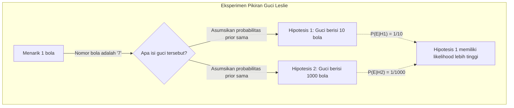
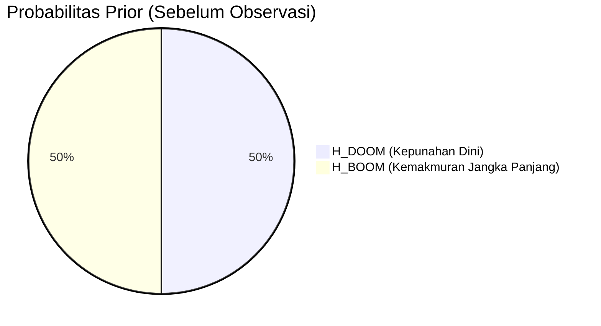
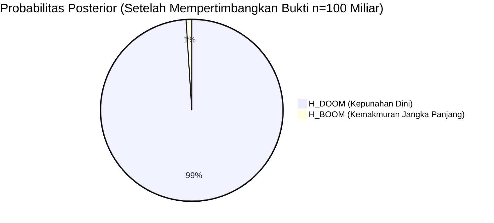
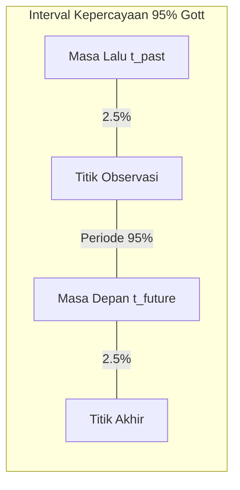
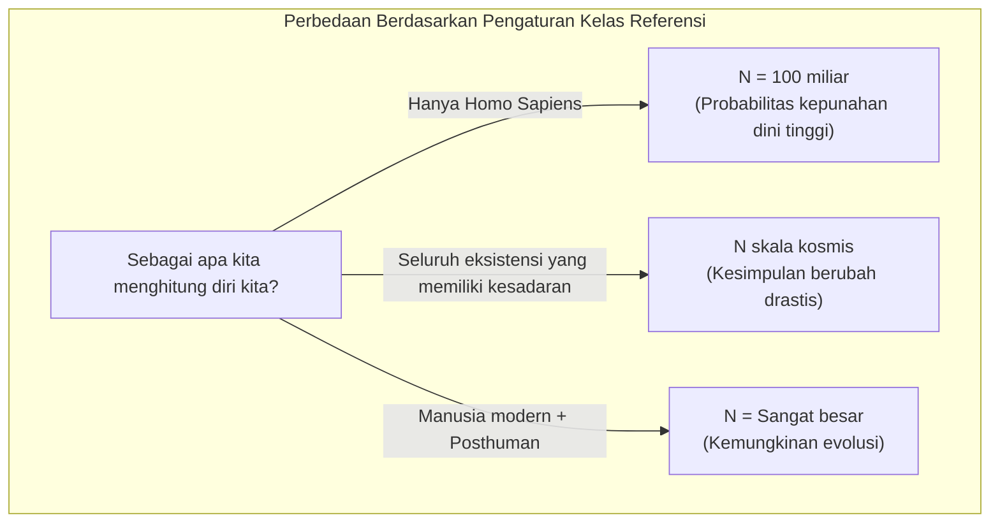

## 1. Pendahuluan: Apakah Kita Hidup di Era yang "Spesial"?

Kapan umat manusia akan punah? Pertanyaan ini telah lama menjadi tema dalam agama, filsafat, dan fiksi ilmiah (SF). Namun, sejak tahun 1980-an, muncul para peneliti yang mencoba melakukan pendekatan matematis terhadap pertanyaan ini menggunakan **teori probabilitas** dan **inferensi Bayesian**. Itulah **[Argumen Hari Kiamat (Doomsday Argument)](https://kenji.blog/p/doomsday-argument/)** yang akan kita bahas kali ini.

Argumen Hari Kiamat pertama kali diajukan oleh fisikawan Brandon Carter, dan kemudian disempurnakan oleh filsuf John Leslie, astrofisikawan J. Richard Gott, dan Nick Bostrom. Hal yang mengejutkan dari argumen ini adalah kemampuannya untuk menarik prediksi yang sangat pesimis mengenai durasi kelangsungan hidup umat manusia hanya dari "prinsip probabilitas" dan "penalaran statistik" murni, tanpa menggunakan model perubahan iklim yang kompleks, simulasi perang nuklir, atau probabilitas tabrakan asteroid.

Dalam artikel ini, kita akan membahas secara rinci dengan ilustrasi mengenai struktur logis dari **Argumen Hari Kiamat** ini, mulai dari Prinsip Copernicus yang mendasarinya, rumus matematika yang menggunakan inferensi Bayesian, hingga sanggahan dan signifikansinya di era modern.

## 2. Gagasan Dasar: Prinsip Copernicus dan Prinsip Antropik

Kunci untuk memahami Argumen Hari Kiamat secara mendalam adalah **Prinsip Copernicus (Copernican Principle)**. Ini adalah aturan empiris yang menyatakan bahwa "kita bukanlah pengamat yang spesial di alam semesta", dan merupakan salah satu premis dasar dalam astronomi.

Jika kita melihat kembali sejarah, Bumi bukanlah pusat alam semesta (heliosentrisme), tata surya bukanlah pusat dari Galaksi Bima Sakti, dan galaksi kita juga bukanlah pusat alam semesta. Umat manusia selalu memajukan sains dengan menerima fakta bahwa "kita tidak berada dalam posisi yang istimewa".

Argumen Hari Kiamat memperluas Prinsip Copernicus ini tidak hanya pada "ruang" tetapi juga pada "waktu" dan "urutan kelahiran".
Dengan kata lain, gagasan ini menganggap bahwa "fakta bahwa Anda lahir di era ini, dalam urutan tertentu dari keseluruhan sejarah umat manusia, sama sekali bukanlah hal yang spesial, melainkan murni hasil acak semata".

Mari kita asumsikan bahwa umat manusia akan makmur selama miliaran tahun ke depan, dan akan ada triliunan atau bahkan kuadriliunan manusia yang lahir. Dalam skenario tersebut, probabilitas "Anda" terlahir sebagai salah satu dari sekitar 100 miliar orang yang telah lahir sejauh ini akan menjadi sangat rendah. Daripada berpikir bahwa Anda adalah "manusia yang sangat langka yang berada di awal sejarah umat manusia", secara probabilistik lebih masuk akal untuk berpikir bahwa "jumlah total umat manusia tidak terlalu banyak, dan Anda terlahir di pertengahan rata-rata". Ini juga merupakan salah satu bentuk efek seleksi observasi (Observation Selection Effect).

## 3. Eksperimen Pikiran Guci John Leslie

Filsuf John Leslie merancang "eksperimen pikiran guci" untuk menjelaskan penalaran intuitif ini dengan cara yang mudah dipahami.

Ada sebuah guci di depan Anda yang isinya tidak terlihat. Anda tahu bahwa guci ini adalah salah satu dari **dua kemungkinan** berikut:

*   **Hipotesis 1 (Guci kecil):** Berisi 10 bola dengan nomor 1 sampai 10.
*   **Hipotesis 2 (Guci besar):** Berisi 1000 bola dengan nomor 1 sampai 1000.

Anda mengambil satu bola secara acak dari dalam guci. Nomor yang tertulis pada bola itu adalah **"7"**.

Nah, apakah guci ini "guci kecil" atau "guci besar"? Secara intuitif, peluang menarik angka yang sangat kecil seperti 7 secara kebetulan dari 1000 buah bola (0,1%) jauh lebih rendah daripada peluang menarik 7 dari 10 buah bola (10%), sehingga masuk akal bagi kita untuk menyimpulkan bahwa **"ini adalah guci kecil"**.

Mari kita terapkan ini pada sejarah umat manusia.

*   Nomor bola = Urutan kelahiran Anda (diasumsikan sekitar yang ke-100 miliar)
*   Guci kecil = Umat manusia akan segera punah, dan total populasi sedikit (misalnya: 200 miliar orang)
*   Guci besar = Umat manusia membangun peradaban antarbintang, dan total populasi sangat besar (misalnya: 20 triliun orang)

Fakta observasi bahwa Anda memiliki urutan yang relatif kecil yaitu "ke-100 miliar" menjadi bukti kuat yang mendukung hipotesis bahwa "total populasi umat manusia sedikit".

## 4. Formulasi Matematika Menggunakan Inferensi Bayesian

Mari kita formulasikan intuisi ini secara matematis dengan ketat menggunakan **inferensi Bayesian**. [Teorema Bayes](https://kenji.blog/p/bayes-theorem/) adalah teorema yang menunjukkan bagaimana kita harus memperbarui probabilitas suatu hipotesis (probabilitas posterior) ketika ada bukti baru (data observasi) yang diperoleh.

$$ P(H|E) = \frac{P(E|H) \cdot P(H)}{P(E)} $$

Di sini, setiap variabel memiliki arti sebagai berikut:
*   $H$ : Hipotesis yang sedang dipertimbangkan (Hypothesis)
*   $E$ : Bukti yang diamati (Evidence)
*   $P(H)$ : Probabilitas prior (Probabilitas hipotesis sebelum melihat bukti)
*   $P(E|H)$ : Likelihood (Probabilitas bukti tersebut diamati jika hipotesis tersebut benar)
*   $P(H|E)$ : Probabilitas posterior (Probabilitas hipotesis setelah mempertimbangkan bukti)

Misalkan jumlah total manusia adalah $N$, dan urutan kelahiran Anda adalah $n$.
Untuk penyederhanaan di sini, kita asumsikan hanya ada 2 hipotesis yang bersaing.

*   $H_{DOOM}$ (Skenario kepunahan) : Umat manusia punah lebih awal. Total populasi $N_{DOOM} = 2 \times 10^{11}$ (200 miliar orang)
*   $H_{BOOM}$ (Skenario kemakmuran) : Umat manusia makmur dalam waktu lama. Total populasi $N_{BOOM} = 2 \times 10^{13}$ (20 triliun orang)

Bukti $E$ adalah fakta bahwa "urutan kelahiran Anda $n$ adalah sekitar $1 \times 10^{11}$ (100 miliar)".

Kita asumsikan bahwa probabilitas prior sebelum memperoleh informasi adalah sama.
$$ P(H_{DOOM}) = P(H_{BOOM}) = 0.5 $$

Selanjutnya, kita menghitung likelihood $P(E|H)$ di bawah setiap hipotesis. Berdasarkan Prinsip Copernicus, kita asumsikan bahwa Anda dipilih dengan probabilitas yang sama (distribusi seragam) dari semua manusia yang ada dari masa lalu hingga masa depan (Prinsip Indiferensi).

$$ P(n | H_{DOOM}) = \frac{1}{N_{DOOM}} = \frac{1}{2 \times 10^{11}} $$
$$ P(n | H_{BOOM}) = \frac{1}{N_{BOOM}} = \frac{1}{2 \times 10^{13}} $$

Dengan menggunakan ini, kita menghitung probabilitas posterior untuk $H_{DOOM}$. Jika kita menjabarkan [Teorema Bayes](https://kenji.blog/p/bayes-theorem/) menggunakan Hukum Probabilitas Total, hasilnya adalah sebagai berikut:

$$ P(H_{DOOM} | n) = \frac{P(n | H_{DOOM}) P(H_{DOOM})}{P(n | H_{DOOM}) P(H_{DOOM}) + P(n | H_{BOOM}) P(H_{BOOM})} $$

Substitusikan nilai-nilai tersebut untuk melanjutkan perhitungan.

$$ P(H_{DOOM} | n) = \frac{\frac{1}{2 \times 10^{11}} \times 0.5}{\frac{1}{2 \times 10^{11}} \times 0.5 + \frac{1}{2 \times 10^{13}} \times 0.5} $$

Coret $0.5$ dari pembilang dan penyebut, lalu sederhanakan.

$$ P(H_{DOOM} | n) = \frac{\frac{1}{2 \times 10^{11}}}{\frac{1}{2 \times 10^{11}} + \frac{1}{2 \times 10^{13}}} $$

Kalikan kedua ruas dengan $2 \times 10^{11}$.

$$ P(H_{DOOM} | n) = \frac{1}{1 + \frac{2 \times 10^{11}}{2 \times 10^{13}}} = \frac{1}{1 + \frac{1}{100}} = \frac{1}{1.01} \approx 0.9901 $$

Hebatnya, probabilitas untuk **"kepunahan dini ($H_{DOOM}$)"** yang awalnya bernilai 50% pada probabilitas prior, melonjak tajam hingga **sekitar 99%** setelah melakukan pembaruan Bayesian dengan menggunakan urutan kelahiran kita sendiri sebagai bukti. Sisa 1% adalah probabilitas untuk skenario kemakmuran. Inilah esensi matematis dari Argumen Hari Kiamat, sebuah kesimpulan mengejutkan yang berlawanan dengan intuisi.

## 5. Argumen Delta-t dari J. Richard Gott

Fisikawan J. Richard Gott menarik kesimpulan serupa melalui pendekatan yang sedikit berbeda. Saat mengunjungi Tembok Berlin pada tahun 1969, ia tiba-tiba berpikir, "Berapa lama lagi tembok ini akan ada?"

Ia berasumsi bahwa kunjungannya bukanlah pada waktu yang "spesial" dalam sejarah tembok tersebut, melainkan pada waktu yang acak (distribusi seragam). Misalkan masa kelangsungan hidup tembok di masa lalu adalah $t_{past}$ , dan masa kelangsungan hidup di masa depan adalah $t_{future}$ . Total masa kelangsungan hidup tembok tersebut adalah $t_{total} = t_{past} + t_{future}$ .

Ia menghitung peluang bahwa kunjungannya tidak berada di 2,5% periode pertama maupun terakhir dari total $t_{total}$ (dengan kata lain, interval kepercayaan 95%).
Jika ia berada di 95% periode pertengahan tersebut, maka pertidaksamaan berikut ini berlaku.

$$ 0.025 \leq \frac{t_{past}}{t_{past} + t_{future}} \leq 0.975 $$

Jika kita selesaikan ini untuk $t_{future}$ , hasilnya akan seperti berikut.

$$ \frac{1}{39} t_{past} \leq t_{future} \leq 39 \cdot t_{past} $$

Pada saat itu di tahun 1969, 8 tahun telah berlalu sejak Tembok Berlin dibangun ($t_{past} = 8$), sehingga Gott memprediksi dengan tingkat kepercayaan 95% bahwa tembok tersebut akan bertahan di masa depan selama "antara 0,2 tahun hingga 312 tahun". Secara mengejutkan, tembok tersebut runtuh 20 tahun kemudian pada tahun 1989, dan jatuh dengan pas tepat di dalam rentang prediksinya.

Mari kita terapkan **Argumen Delta-t** ini pada periode kelangsungan hidup umat manusia.
Misalkan manusia modern (Homo sapiens) telah eksis selama sekitar 200.000 tahun ($t_{past} = 200,000$ tahun).
Jika kita menerapkannya pada rumus sebelumnya, perhitungannya menjadi sebagai berikut.

$$ \frac{200,000}{39} \leq t_{future} \leq 39 \times 200,000 $$
$$ 5,128 \text{ tahun} \leq t_{future} \leq 7,800,000 \text{ tahun} $$

Dengan kata lain, ditarik kesimpulan dengan peluang 95% bahwa **"umat manusia akan punah dalam kurun waktu 5.000 hingga 7,8 juta tahun ke depan"**. Berdasarkan penalaran statistik ini, kemungkinan umat manusia akan terus makmur selama ratusan juta atau miliaran tahun ke depan menjadi sangat rendah. Dilihat dari skala alam semesta, waktu 7,8 juta tahun hanyalah sekejap mata.

## 6. Sanggahan Terhadap Argumen Hari Kiamat: SSA dan SIA

Meskipun argumen ini sangat sederhana dan kuat, tentu saja banyak kritik dan sanggahan telah diajukan oleh para akademisi. Inti dari perdebatan filosofis ini terletak pada perbedaan asumsi tentang "bagaimana fakta mengenai eksistensi diri kita sendiri diperlakukan sebagai bukti".

Utamanya ada dua pandangan:

### Asumsi Sampling Diri (SSA: Self-Sampling Assumption)
Ini adalah pandangan yang diadopsi oleh para pendukung Argumen Hari Kiamat, yang berpendapat bahwa "kita harus menganggap diri kita dipilih secara acak dari seluruh pengamat yang benar-benar ada". Berdasarkan hal ini, seperti yang disebutkan sebelumnya, "semakin sedikit total populasi, semakin tinggi peluang kita mendapatkan urutan saat ini", sehingga Argumen Hari Kiamat terbukti benar.

### Asumsi Indikasi Diri (SIA: Self-Indication Assumption)
Di sisi lain, **SIA** merupakan sanggahan kuat terhadap Argumen Hari Kiamat. SIA berpendapat bahwa "kita harus menganggap diri kita dipilih secara acak dari semua **kemungkinan** pengamat, dan oleh karena itu, hipotesis yang melibatkan lebih banyak pengamat memiliki peluang lebih tinggi secara prior agar kita benar-benar eksis sejak awal".

Dinyatakan dalam rumus, saat mengadopsi SIA, probabilitas prior diasumsikan harus disesuaikan secara proporsional dengan total populasi $N$ pada setiap hipotesis.

$$ P_{SIA}(H_{BOOM}) \propto N_{BOOM} \times P(H_{BOOM}) $$
$$ P_{SIA}(H_{DOOM}) \propto N_{DOOM} \times P(H_{DOOM}) $$

Jika kita memasukkan ini ke dalam rumus pembaruan Bayesian sebelumnya, penalti terhadap hipotesis yang memiliki populasi besar ($H_{BOOM}$) (yaitu karena likelihood yang rendah) akan saling meniadakan secara sempurna dengan bonus probabilitas prior (yaitu semakin besar populasi, semakin tinggi kemungkinan kita eksis). Sebagai hasilnya, sebelum dan sesudah mengetahui urutan kelahiran $n$, ditarik kesimpulan bahwa probabilitas relatif antara $H_{DOOM}$ dan $H_{BOOM}$ tidak berubah sama sekali. Jika SIA benar, Argumen Hari Kiamat akan batal secara logis. Namun, SIA juga memiliki paradoks lain seperti "probabilitas akan runtuh jika mengasumsikan populasi tak terhingga", sehingga belum ada penyelesaian final untuk hal ini.

## 7. Masalah Kelas Referensi (The Reference Class Problem)

Kritik utama lain terhadap Argumen Hari Kiamat adalah mengenai definisi **Kelas Referensi (Reference Class)**.

Dalam perhitungan sejauh ini, kita menghitung diri kita sebagai "satu dari seluruh 'umat manusia' yang pernah lahir". Namun, batas definisi dari "umat manusia (pengamat)" ini mencakup apa saja?

*   Apakah spesies kerabat dekat yang telah punah seperti Neanderthal juga harus dimasukkan?
*   Di masa depan, jika umat manusia berevolusi menjadi "Posthuman" melalui manipulasi genetik atau sibernetika, haruskah mereka juga dimasukkan ke dalam hitungan?
*   Apakah kehidupan ekstraterestrial, atau kecerdasan buatan (AI) yang memiliki kesadaran tingkat tinggi, termasuk dalam kelas referensi sebagai "pengamat"?

Jika kita tidak memasukkan AI tingkat tinggi atau Posthuman ke dalam kelas referensi (memisahkan mereka sebagai kelompok yang berbeda), maka apa yang diindikasikan oleh Argumen Hari Kiamat bukanlah "kepunahan umat manusia secara total", melainkan hanya "berakhirnya wujud Homo sapiens saat ini (transisi melalui evolusi menuju spesies baru)". Kelemahan dari argumen ini adalah, bergantung pada bagaimana kelas referensi ditetapkan, hasil perhitungan dan maknanya bisa berubah secara fundamental.

## 8. Kesimpulan: Bagaimana Kita Harus Menyikapi Argumen Hari Kiamat?

Sekilas, Argumen Hari Kiamat mungkin terlihat seperti permainan kata atau trik matematika semata. Namun, di antara filsuf kontemporer seperti Nick Bostrom dan institusi yang meneliti Risiko Eksistensial (Existential Risk) seperti 'Future of Humanity Institute' di Universitas Oxford, argumen ini terus didiskusikan dengan serius.

Alasannya adalah karena Argumen Hari Kiamat menjadi peringatan keras terhadap **"kepercayaan tanpa syarat bahwa umat manusia akan terus makmur tanpa batas di masa depan"**. Dari ancaman senjata nuklir, kecerdasan buatan yang lepas kendali, pandemi buatan melalui biologi sintetik, hingga perubahan iklim, umat manusia kini memiliki lebih banyak cara untuk memusnahkan diri sendiri dibandingkan sebelumnya.

Hal yang diajarkan oleh Prinsip Copernicus kepada kita adalah fakta dingin bahwa **"tidak ada jaminan bahwa masa kini adalah era spesial yang akan bertahan selamanya"**. Daripada sekadar menganggapnya sebagai paradoks matematika, Argumen Hari Kiamat tetap memiliki nilai yang tak pudar sebagai inspirasi agar kita menyadari kembali kerapuhan spesies kita dan mengambil tindakan untuk sedikit demi sedikit meningkatkan probabilitas kelangsungan hidup kita. Dengan tangan kita sendiri, kita harus terus berupaya untuk meningkatkan angka "N" di masa depan, dan membalikkan prediksi dari Argumen Hari Kiamat.
