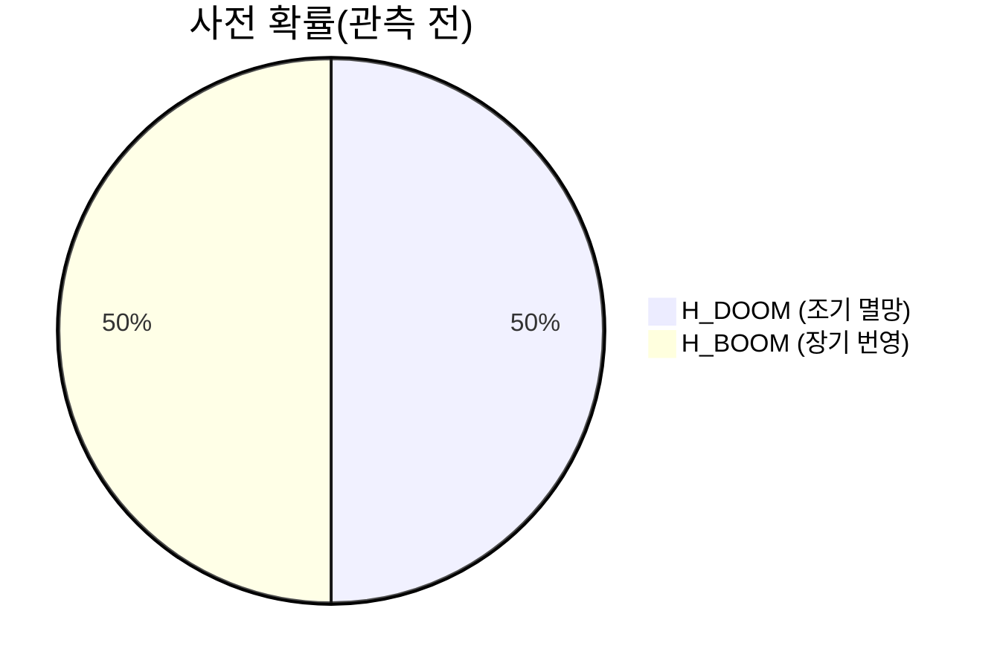
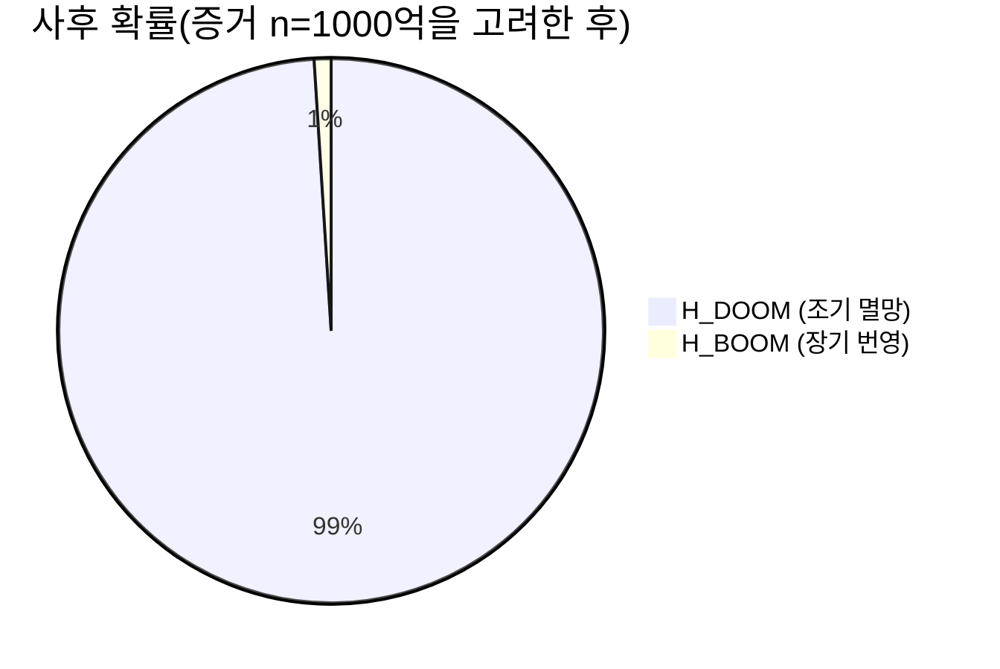
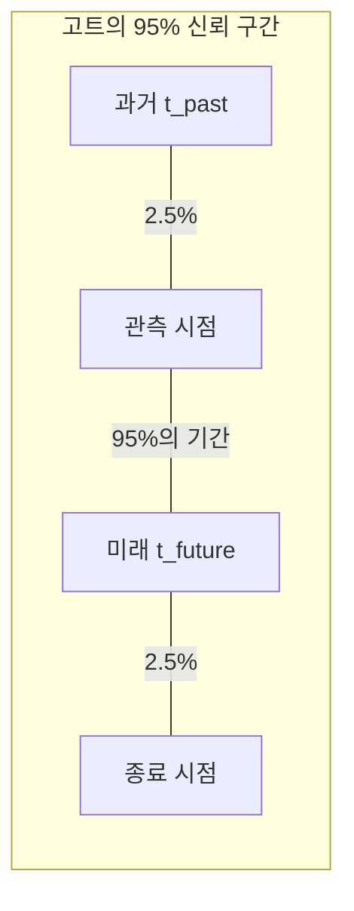

## 1. 시작하며: 우리는 '특별한' 시대에 살고 있는가?

인류는 언제 멸망할 것인가? 이 질문은 예로부터 종교나 철학, 그리고 SF의 주제로 다뤄져 왔습니다. 하지만 1980년대 이후 이 질문에 대해 ** 확률론 ** 과 ** 베이즈 추정 ** 을 이용하여 수학적인 접근을 시도하는 연구자들이 나타났습니다. 그것이 이번에 소개할 ** [종말 논법(Doomsday Argument)](https://kenji.blog/ko/p/doomsday-argument/) ** 입니다.

종말 논법은 물리학자 브랜든 카터에 의해 처음 제창되었고, 이후 철학자 존 레슬리나 천체물리학자 J. 리처드 고트, 그리고 닉 보스트롬 등에 의해 세련되게 다듬어졌습니다. 이 논법의 놀라운 점은 복잡한 기후 변동 모델이나 핵전쟁 시뮬레이션, 혹은 소행성 충돌 확률 등을 사용하지 않고, 단순한 '확률의 원칙'과 '통계적 추론'만으로 인류의 존속 기간에 대해 극히 비관적인 예측을 도출해낸다는 것입니다.

본 기사에서는 이 ** 종말 논법 ** 이 어떤 논리 구조를 가지고 있는지, 그 이면에 있는 코페르니쿠스의 원리에서 시작하여 베이즈 추정을 이용한 수식, 나아가 반론이나 현대에 있어서의 의의에 이르기까지 도해를 섞어 자세히 해설해 나가겠습니다.

## 2. 근저에 있는 사상: 코페르니쿠스의 원리와 인류 원리

종말 논법을 깊이 이해하기 위한 열쇠가 되는 것이 ** 코페르니쿠스의 원리(Copernican Principle) ** 입니다. 이는 "우리는 우주 속에서 특별한 관측자가 아니다"라는 경험칙이며 천문학에서의 기본적인 전제 조건 중 하나입니다.

역사를 되돌아보면 지구는 우주의 중심이 아니었고(지동설), 태양계도 은하계의 중심이 아니었으며, 우리 은하도 우주의 중심이 아니었습니다. 인류는 항상 "자신들이 특별한 위치에 있는 것은 아니다"라는 사실을 받아들임으로써 과학을 발전시켜 왔습니다.

종말 논법은 이 코페르니쿠스의 원리를 '공간'뿐만 아니라 '시간'이나 '출생 순위'로 확장합니다.
즉 "당신이 지금 이 시대에, 인류 역사 전체 속에서 특정한 순위로 태어난 것은 결코 특별한 일이 아니며 무작위적인 결과에 불과하다"고 생각하는 것입니다.

만약 인류가 앞으로 수십억 년에 걸쳐 번영하고 수조, 수경 명의 인간이 태어난다고 가정합시다. 그럴 경우 현재까지 태어난 약 1000억 명 중 1명으로서 '당신'이 태어날 확률은 극히 낮아집니다. 당신이 "인류사에서 초창기의 매우 드문 인류"라고 생각하기보다는 "인류의 총수는 그리 많지 않으며 당신은 지극히 평균적인 중반에 태어났다"고 생각하는 편이 확률론적으로 타당하다는 것입니다. 이는 관측 선택 효과(Observation Selection Effect)의 일종이기도 합니다.

## 3. 존 레슬리의 항아리 사고 실험

철학자 존 레슬리는 이 직관적인 추론을 알기 쉽게 설명하기 위해 '항아리 사고 실험'을 고안했습니다.

당신 눈앞에 속이 보이지 않는 항아리가 1개 있습니다. 이 항아리는 다음 ** 둘 중 하나 ** 임을 알고 있습니다.

*   ** 가설 1(작은 항아리): ** 1부터 10까지의 번호가 적힌 공이 10개 들어 있다.
*   ** 가설 2(큰 항아리): ** 1부터 1000까지의 번호가 적힌 공이 1000개 들어 있다.

당신은 항아리 속에서 무작위로 공을 1개 꺼냅니다. 그 공에 적혀 있던 번호는 ** '7' ** 이었습니다.

자, 이 항아리는 '작은 항아리'일까요, 아니면 '큰 항아리'일까요? 직관적으로 생각해 볼 때, 1000개 중에서 어쩌다 7이라는 매우 작은 숫자를 뽑을 확률(0.1%)보다 10개 중에서 7을 뽑을 확률(10%)이 훨씬 높기 때문에, 우리는 ** "이것은 작은 항아리이다" ** 라고 추론하는 것이 합리적입니다.

이것을 인류의 역사로 치환해 봅니다.

*   공의 번호 = 당신의 출생 순위(약 1000억 번째라고 가정)
*   작은 항아리 = 인류는 머지않아 멸망하며 총인구는 적다(예: 2000억 명)
*   큰 항아리 = 인류는 성간 문명을 이룩하며 총인구는 막대해진다(예: 20조 명)

당신이 '1000억 번째'라는 비교적 작은 순위를 가지고 있다는 관측 사실은 '인류의 총인구는 적다'는 가설을 강력하게 지지하는 증거가 되는 것입니다.

```mermaid
graph TD
    subgraph "레슬리의 항아리 사고 실험"
        A["공을 1개 뽑는다"] -->|"번호가 『7』이었다"| B{"항아리의 정체는?"}
        B -->|"사전 확률은 같다고 한다"| C["가설 1: 10개들이 항아리"]
        B -->|"사전 확률은 같다고 한다"| D["가설 2: 1000개들이 항아리"]
        C -.->|"P("E|H1") = 1/10"| E["가설 1 쪽이 우도가 높다"]
        D -.->|"P("E|H2") = 1/1000"| E
    end
```

## 4. 베이즈 추정을 이용한 수학적 정식화

이 직관을 ** 베이즈 추정 ** 을 이용하여 엄밀하게 수학적으로 정식화해 봅시다. [베이즈 정리](https://kenji.blog/ko/p/bayes-theorem/)는 새로운 증거(관측 데이터)를 얻었을 때 어떤 가설의 확률(사후 확률)을 어떻게 업데이트해야 하는지를 보여주는 정리입니다.

$$ P(H|E) = \frac{P(E|H) \cdot P(H)}{P(E)} $$

여기서 각 변수는 다음 의미를 갖습니다.
*   $H$ : 검토하고 있는 가설(Hypothesis)
*   $E$ : 관측된 증거(Evidence)
*   $P(H)$ : 사전 확률(증거를 보기 전의 가설 확률)
*   $P(E|H)$ : 우도(가설이 옳다고 했을 때 그 증거가 관측될 확률)
*   $P(H|E)$ : 사후 확률(증거를 고려한 후의 가설 확률)

인류의 총수를 $N$ 이라고 하고 당신의 출생 순위를 $n$ 이라고 합니다.
여기서는 간략화를 위해 두 가지 경합하는 가설만이 존재한다고 생각합니다.

*   $H_{DOOM}$ (멸망 시나리오): 인류는 조기에 멸망한다. 총인구 $N_{DOOM} = 2 \times 10^{11}$ (2000억 명)
*   $H_{BOOM}$ (번영 시나리오): 인류는 오래 번영한다. 총인구 $N_{BOOM} = 2 \times 10^{13}$ (20조 명)

증거 $E$ 는 "당신의 출생 순위 $n$ 이 약 $1 \times 10^{11}$(1000억)이다"라는 사실입니다.

정보를 얻기 전의 사전 확률은 동일하다고 가정합니다.
$$ P(H_{DOOM}) = P(H_{BOOM}) = 0.5 $$

다음으로 각 가설 하에서의 우도 $P(E|H)$ 를 계산합니다. 코페르니쿠스의 원리에 의해 당신은 과거에서 미래에 이르는 모든 인간 중에서 동일한 확률(균등 분포)로 선택된다고 가정합니다(무차별 원칙).

$$ P(n | H_{DOOM}) = \frac{1}{N_{DOOM}} = \frac{1}{2 \times 10^{11}} $$
$$ P(n | H_{BOOM}) = \frac{1}{N_{BOOM}} = \frac{1}{2 \times 10^{13}} $$

이를 이용하여 $H_{DOOM}$ 의 사후 확률을 계산합니다. 전체 확률의 정리를 이용하여 [베이즈 정리](https://kenji.blog/ko/p/bayes-theorem/)를 전개하면 다음과 같이 됩니다.

$$ P(H_{DOOM} | n) = \frac{P(n | H_{DOOM}) P(H_{DOOM})}{P(n | H_{DOOM}) P(H_{DOOM}) + P(n | H_{BOOM}) P(H_{BOOM})} $$

값을 대입하여 계산을 진행합니다.

$$ P(H_{DOOM} | n) = \frac{\frac{1}{2 \times 10^{11}} \times 0.5}{\frac{1}{2 \times 10^{11}} \times 0.5 + \frac{1}{2 \times 10^{13}} \times 0.5} $$

분모와 분자의 $0.5$ 를 소거하고 정리합니다.

$$ P(H_{DOOM} | n) = \frac{\frac{1}{2 \times 10^{11}}}{\frac{1}{2 \times 10^{11}} + \frac{1}{2 \times 10^{13}}} $$

양변에 $2 \times 10^{11}$ 을 곱합니다.

$$ P(H_{DOOM} | n) = \frac{1}{1 + \frac{2 \times 10^{11}}{2 \times 10^{13}}} = \frac{1}{1 + \frac{1}{100}} = \frac{1}{1.01} \approx 0.9901 $$

무려 사전 확률에서는 50%였던 ** "조기 멸망($H_{DOOM}$)" ** 의 확률이 자신의 출생 순위를 증거로 베이즈 업데이트를 수행함으로써 ** 약 99% ** 까지 뛰어올라 버렸습니다. 남은 1%가 번영 시나리오의 확률이 됩니다. 이것이 종말 논법의 수학적인 본질이며 직관에 반하는 놀라운 결론입니다.




## 5. J. 리처드 고트의 델타 t 논법

물리학자 J. 리처드 고트는 조금 다른 접근법에서 비슷한 결론을 도출해 냈습니다. 그는 1969년 베를린 장벽을 방문했을 때 '이 장벽은 앞으로 얼마나 더 존재할까'라고 문득 생각했습니다.

그는 자신이 장벽의 역사 속에서 '특별한' 타이밍에 방문한 것이 아니라 랜덤한 타이밍(균등 분포)에 방문했다고 가정했습니다. 장벽의 과거 존속 기간을 $t_{past}$ , 미래 존속 기간을 $t_{future}$ 라고 합니다. 장벽의 총 존속 기간은 $t_{total} = t_{past} + t_{future}$ 입니다.

자신이 방문한 시점이 전체 $t_{total}$ 중 처음과 마지막 2.5%의 기간이 아닐 확률(즉 95% 신뢰 구간)을 구합니다.
만약 자신이 중간의 95% 기간에 있다면 다음 부등식이 성립합니다.

$$ 0.025 \leq \frac{t_{past}}{t_{past} + t_{future}} \leq 0.975 $$

이것을 $t_{future}$ 에 대해 풀면 다음과 같이 됩니다.

$$ \frac{1}{39} t_{past} \leq t_{future} \leq 39 \cdot t_{past} $$

고트는 1969년 당시 베를린 장벽이 건설된 지 8년이 경과했기 때문에( $t_{past} = 8$ ), 장벽의 미래 존속 기간은 95% 확률로 '0.2년에서 312년 사이'일 것이라고 예측했습니다. 놀랍게도 장벽은 그 20년 후인 1989년에 붕괴되었고 그의 예측 범위 내에 멋지게 들어맞았습니다.

이 ** 델타 t 논법 ** 을 인류의 존속 기간에 적용해 보겠습니다.
현생 인류(호모 사피엔스)가 탄생한 지 약 20만 년( $t_{past} = 200,000$ 년)이라고 합시다.
아까의 공식에 대입하면 다음과 같은 계산이 됩니다.

$$ \frac{200,000}{39} \leq t_{future} \leq 39 \times 200,000 $$
$$ 5,128 \text{년} \leq t_{future} \leq 7,800,000 \text{년} $$

즉, 인류는 95%의 확률로 ** "앞으로 5000년에서 780만 년 이내에 멸망한다" ** 는 결론이 도출됩니다. 수억 년, 수십억 년에 걸쳐 인류가 번영을 계속할 가능성은 이 통계적 추론에 따르면 극히 낮다는 의미가 됩니다. 우주의 스케일에서 보면 780만 년이라는 시간은 찰나에 불과합니다.



## 6. 종말 논법에 대한 반론: SSA와 SIA

이렇게 심플하고 강력한 논법이지만 물론 많은 학자들로부터 비판이나 반론이 제기되고 있습니다. 철학적인 논쟁의 중심이 되고 있는 것은 '자기 자신이 존재하고 있다는 사실을 어떻게 증거로 취급할 것인가' 하는 가정의 차이입니다.

주로 2가지 입장이 존재합니다.

### 자기 표본 가정(SSA: Self-Sampling Assumption)
이것은 종말 논법의 지지자가 채택하는 입장으로, "모든 실재하는 관측자 중에서 자신이 무작위로 선택되었다고 간주해야 한다"는 사고방식입니다. 이에 따르면 앞서 언급했듯이 "총인구가 적을수록 자신이 현재의 순위가 될 확률이 높기" 때문에 종말 논법이 성립합니다.

### 자기 지시 가정(SIA: Self-Indication Assumption)
반면에 ** SIA ** 는 종말 논법에 대한 강력한 반론이 됩니다. SIA는 "모든 ** 가능한 ** 관측자 중에서 자신이 무작위로 선택되었다고 간주해야 하며, 따라서 더 많은 관측자가 존재하는 가설일수록 자신이 애초에 존재할 확률이 높다"고 주장합니다.

수식으로 나타내면 SIA를 채택했을 경우의 사전 확률은 각 가설에서의 총인구 $N$ 에 비례하여 보정되어야 한다고 생각합니다.

$$ P_{SIA}(H_{BOOM}) \propto N_{BOOM} \times P(H_{BOOM}) $$
$$ P_{SIA}(H_{DOOM}) \propto N_{DOOM} \times P(H_{DOOM}) $$

이것을 아까의 베이즈 업데이트 식에 넣으면 인구가 많은 가설( $H_{BOOM}$ )에 대한 페널티(우도가 낮다는 것)와 사전 확률의 보너스(인구가 많을수록 자신이 존재할 확률이 높다는 것)가 멋지게 상쇄됩니다. 결과적으로 출생 순위 $n$ 을 알기 전후로 $H_{DOOM}$ 과 $H_{BOOM}$ 의 상대적인 확률은 전혀 변화하지 않는다는 결론에 이릅니다. SIA가 옳다면 종말 논법은 논리적으로 무효화됩니다. 그러나 SIA에도 "무한한 인구를 상정하면 확률이 파탄난다"는 등의 또 다른 역설이 존재하여 완전한 결말은 나지 않은 상태입니다.

## 7. 레퍼런스 클래스 문제(The Reference Class Problem)

종말 논법에 대한 또 다른 중대한 비판은 ** 레퍼런스 클래스(참조 집단) ** 의 정의에 관한 문제입니다.

지금까지의 계산에서 우리는 자기 자신을 '지금까지 태어난 모든 "인류" 중 1명'으로 카운트했습니다. 하지만 이 "인류(관측자)"의 정의는 어디서부터 어디까지를 가리키는 것일까요?

*   네안데르탈인 등 멸종된 근연종을 포함해야 하는가?
*   장래에 인류가 유전자 조작이나 사이보그화를 통해 '포스트 휴먼'으로 진화했을 때 그들을 카운트에 포함해야 하는가?
*   외계 생명체나 고도의 의식을 가진 인공지능(AI)은 '관측자'로서 레퍼런스 클래스에 포함되는가?

만약 초고도 AI나 포스트 휴먼을 레퍼런스 클래스에 포함하지 않는(별개의 집단으로 분리하는) 것이라면 종말 논법이 시사하고 있는 것은 '인류의 완전한 멸망'이 아니라 '현행 호모 사피엔스라는 형태의 끝(새로운 종으로의 진화에 의한 이행)'에 지나지 않게 됩니다. 레퍼런스 클래스를 어떻게 설정하느냐에 따라 계산 결과나 그 의미가 근본적으로 변해 버리는 것이 이 논법의 약점이기도 합니다.

```mermaid
graph TD
    subgraph "레퍼런스 클래스 설정에 따른 차이"
        A["우리는 누구로서 자신을 카운트할 것인가?"] -->|"호모 사피엔스만"| B["N = 1000억\n("조기 멸망 확률 높음")"]
        A -->|"의식을 가진 모든 존재"| C["우주 규모의 N\n("결론이 크게 바뀜")"]
        A -->|"현생 인류 + 포스트 휴먼"| D["N = 막대\n("진화의 가능성")"]
    end
```

## 8. 결론: 우리는 종말 논법을 어떻게 마주해야 하는가?

종말 논법은 언뜻 보면 그저 말장난이나 수학의 트릭처럼 보일지도 모릅니다. 그러나 닉 보스트롬 등 현대의 철학자나 옥스퍼드 대학의 '인류의 미래 연구소'와 같은 실존적 리스크(Existential Risk)를 연구하는 기관에서 이 논법은 진지하게 논의되고 있습니다.

그것은 종말 논법이 ** "인류가 앞으로도 무한히 번영을 계속할 것이라고 무조건 믿는 것" ** 에 대한 강력한 경고가 되고 있기 때문입니다. 핵무기의 위협, 인공지능의 폭주, 합성 생물학에 의한 인공적인 팬데믹, 혹은 기후 변동 등 인류는 스스로를 멸망시킬 수단을 그 어느 때보다도 많이 손에 쥐고 있습니다.

코페르니쿠스의 원리가 가르쳐 주는 것은 ** "지금이 영원히 계속되는 특별한 시대라는 보장은 어디에도 없다" ** 는 냉철한 사실입니다. 이것을 단순한 수학적인 역설로 치부해 버릴 것이 아니라 인류라는 종의 취약성을 재인식하고 존속 확률을 조금이라도 높이기 위한 행동을 취하기 위한 영감으로서, 종말 논법은 지금도 여전히 퇴색되지 않는 가치를 가지고 있습니다. 우리는 스스로의 손으로 미래의 'N'의 수를 늘리고 종말 논법의 예측을 뒤집는 노력을 계속해야만 하는 것입니다.
