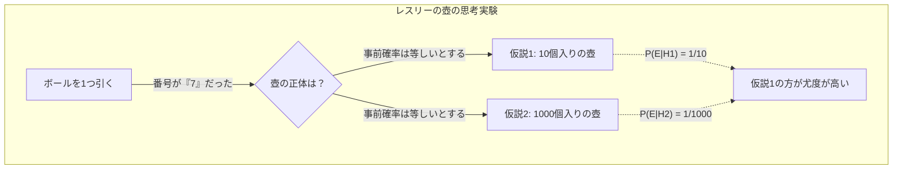
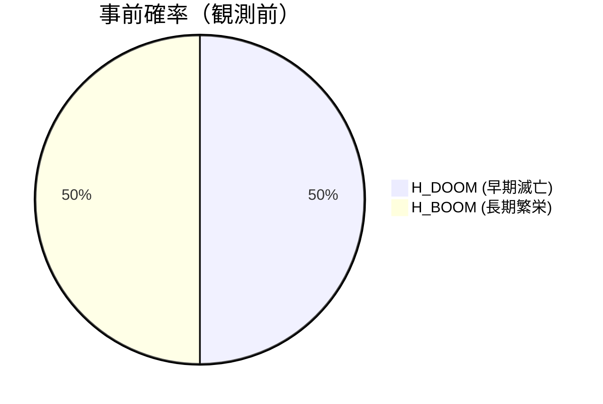
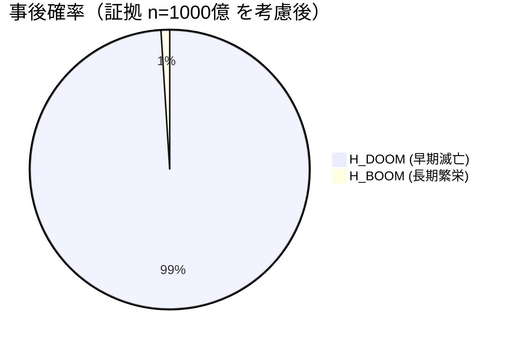
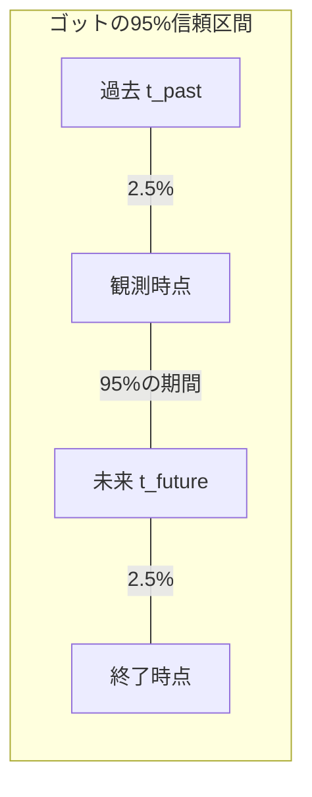
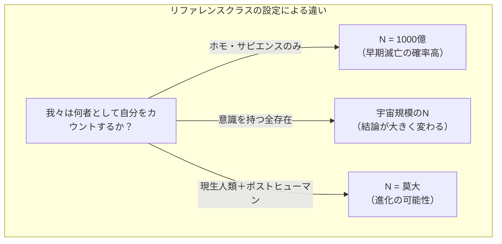

## 1. はじめに：我々は「特別な」時代に生きているのか？

人類はいつ滅亡するのか？この問いは、古くから宗教や哲学、そしてSFのテーマとして扱われてきました。しかし、1980年代以降、この問いに対して **確率論** と **ベイズ推定** を用いて数学的なアプローチを試みる研究者が現れました。それが今回紹介する **終末論法（Doomsday Argument）** です。

終末論法は、物理学者ブランドン・カーターによって最初に提唱され、その後哲学者ジョン・レスリーや天体物理学者J・リチャード・ゴット、そしてニック・ボストロムらによって洗練されました。この論法の驚くべき点は、複雑な気候変動モデルや核戦争のシミュレーション、あるいは小惑星衝突の確率などを用いることなく、単なる「確率の原則」と「統計的推論」のみから、人類の存続期間に対して極めて悲観的な予測を導き出すことです。

本記事では、この **終末論法** がどのような論理構造を持っているのか、背後にあるコペルニクスの原理から始まり、ベイズ推定を用いた数式、さらには反論や現代における意義に至るまで、図解を交えて詳細に解説していきます。

## 2. 根底にある思想：コペルニクスの原理と人間原理

終末論法を深く理解するための鍵となるのが **コペルニクスの原理（Copernican Principle）** です。これは「我々は宇宙の中で特別な観測者ではない」という経験則であり、天文学における基本的な前提条件の一つです。

歴史を振り返れば、地球は宇宙の中心ではなく（地動説）、太陽系も天の川銀河の中心ではなく、我々の銀河系も宇宙の中心ではありませんでした。人類は常に「自分たちは特別な位置にいるわけではない」という事実を受け入れることで科学を発展させてきました。

終末論法は、このコペルニクスの原理を「空間」だけでなく「時間」や「出生順位」に拡張します。
つまり、「あなたが今この時代に、人類の歴史全体の中で特定の順位で生まれてきたことは、決して特別ではなく、ランダムな結果に過ぎない」と考えるのです。

もし人類が今後何十億年にもわたって繁栄し、何兆、何京もの人間が生まれると仮定しましょう。その場合、現在までに生まれた約1000億人のうちの1人として「あなた」が生まれる確率は、極めて低くなります。あなたが「人類史における最初期の非常に珍しい人類」であると考えるよりも、「人類の総数はそれほど多くなく、あなたはごく平均的な中盤に生まれた」と考える方が、確率論的には妥当だということです。これは、観測選択効果（Observation Selection Effect）の一種でもあります。

## 3. ジョン・レスリーの壺の思考実験

哲学者ジョン・レスリーは、この直感的な推論を分かりやすく説明するために「壺の思考実験」を考案しました。

あなたの目の前に中身の見えない壺が1つあります。この壺は以下の **どちらか** であることが分かっています。

*   **仮説1（小さな壺）：** 1から10までの番号が書かれたボールが10個入っている。
*   **仮説2（大きな壺）：** 1から1000までの番号が書かれたボールが1000個入っている。

あなたは壺の中からランダムにボールを1つ取り出します。そのボールに書かれていた番号は **「7」** でした。

さて、この壺は「小さな壺」でしょうか、それとも「大きな壺」でしょうか？直感的に考えて、1000個の中からたまたま7という非常に小さな数字を引く確率（0.1%）よりも、10個の中から7を引く確率（10%）の方がはるかに高いため、我々は **「これは小さな壺である」** と推論するのが合理的です。

これを人類の歴史に置き換えます。

*   ボールの番号 = あなたの出生順位（約1000億番目と仮定）
*   小さな壺 = 人類は遠からず滅亡し、総人口は少ない（例：2000億人）
*   大きな壺 = 人類は星間文明を築き、総人口は莫大になる（例：20兆人）

あなたが「1000億番目」という比較的小さな順位を持っているという観測事実は、「人類の総人口は少ない」という仮説を強力に支持する証拠となるのです。

## 4. ベイズ推定を用いた数学的定式化

この直感を、 **ベイズ推定** を用いて厳密に数学的に定式化してみましょう。ベイズの定理は、新しい証拠（観測データ）が得られたときに、ある仮説の確率（事後確率）をどのように更新すべきかを示す定理です。

$$ P(H|E) = \frac{P(E|H) \cdot P(H)}{P(E)} $$

ここで、各変数は以下の意味を持ちます：
*   $H$ : 検討している仮説（Hypothesis）
*   $E$ : 観測された証拠（Evidence）
*   $P(H)$ : 事前確率（証拠を見る前の仮説の確率）
*   $P(E|H)$ : 尤度（仮説が正しいとした場合に、その証拠が観測される確率）
*   $P(H|E)$ : 事後確率（証拠を考慮した後の仮説の確率）

人類の総数を $N$ とし、あなたの出生順位を $n$ とします。
ここでは簡略化のため、2つの競合する仮説のみが存在すると考えます。

*   $H_{DOOM}$ （滅亡シナリオ）: 人類は早期に滅亡する。総人口 $N_{DOOM} = 2 \times 10^{11}$ （2000億人）
*   $H_{BOOM}$ （繁栄シナリオ）: 人類は長く繁栄する。総人口 $N_{BOOM} = 2 \times 10^{13}$ （20兆人）

証拠 $E$ は「あなたの出生順位 $n$ が約 $1 \times 10^{11}$（1000億）である」という事実です。

情報を得る前の事前確率は等しいと仮定します。
$$ P(H_{DOOM}) = P(H_{BOOM}) = 0.5 $$

次に、それぞれの仮説の下での尤度 $P(E|H)$ を計算します。コペルニクスの原理により、あなたは過去から未来に至る全ての人間の中から等確率（一様分布）で選ばれると仮定します（無差別原則）。

$$ P(n | H_{DOOM}) = \frac{1}{N_{DOOM}} = \frac{1}{2 \times 10^{11}} $$
$$ P(n | H_{BOOM}) = \frac{1}{N_{BOOM}} = \frac{1}{2 \times 10^{13}} $$

これを用いて、 $H_{DOOM}$ の事後確率を計算します。全確率の定理を用いてベイズの定理を展開すると以下のようになります。

$$ P(H_{DOOM} | n) = \frac{P(n | H_{DOOM}) P(H_{DOOM})}{P(n | H_{DOOM}) P(H_{DOOM}) + P(n | H_{BOOM}) P(H_{BOOM})} $$

値を代入して計算を進めます。

$$ P(H_{DOOM} | n) = \frac{\frac{1}{2 \times 10^{11}} \times 0.5}{\frac{1}{2 \times 10^{11}} \times 0.5 + \frac{1}{2 \times 10^{13}} \times 0.5} $$

分母と分子の $0.5$ を消去し、整理します。

$$ P(H_{DOOM} | n) = \frac{\frac{1}{2 \times 10^{11}}}{\frac{1}{2 \times 10^{11}} + \frac{1}{2 \times 10^{13}}} $$

両辺に $2 \times 10^{11}$ を掛けます。

$$ P(H_{DOOM} | n) = \frac{1}{1 + \frac{2 \times 10^{11}}{2 \times 10^{13}}} = \frac{1}{1 + \frac{1}{100}} = \frac{1}{1.01} \approx 0.9901 $$

なんと、事前確率では50%だった **「早期滅亡（$H_{DOOM}$）」** の確率が、自分自身の出生順位を証拠としてベイズ更新を行うことで、 **約99%** にまで跳ね上がってしまいました。残りの1%が繁栄シナリオの確率となります。これが終末論法の数学的な本質であり、直感に反する驚くべき結論です。

## 5. J・リチャード・ゴットのデルタt論法

物理学者J・リチャード・ゴットは、少し異なるアプローチから同様の結論を導き出しました。彼は1969年にベルリンの壁を訪れた際、「この壁はあとどれくらい存在するだろうか」とふと考えました。

彼は、自分が壁の歴史の中の「特別な」タイミングで訪れたわけではなく、ランダムなタイミング（一様分布）で訪れたと仮定しました。壁の過去の存続期間を $t_{past}$ 、未来の存続期間を $t_{future}$ とします。壁の総存続期間は $t_{total} = t_{past} + t_{future}$ です。

自分が訪れた時点が、全体の $t_{total}$ のうち、最初と最後の2.5%の期間ではない確率（つまり95%の信頼区間）を求めます。
もし自分が中間の95%の期間にいるならば、以下の不等式が成り立ちます。

$$ 0.025 \leq \frac{t_{past}}{t_{past} + t_{future}} \leq 0.975 $$

これを $t_{future}$ について解くと、次のようになります。

$$ \frac{1}{39} t_{past} \leq t_{future} \leq 39 \cdot t_{past} $$

ゴットは1969年当時、ベルリンの壁が建設されてから8年経過していたため（ $t_{past} = 8$ ）、壁の未来の存続期間は95%の確率で「0.2年から312年の間」であると予測しました。驚くべきことに、壁はその20年後の1989年に崩壊し、彼の予測の範囲内に見事に収まりました。

この **デルタt論法** を人類の存続期間に適用してみましょう。
現生人類（ホモ・サピエンス）が誕生して約20万年（ $t_{past} = 200,000$ 年）だとします。
先ほどの公式に当てはめると以下の計算になります。

$$ \frac{200,000}{39} \leq t_{future} \leq 39 \times 200,000 $$
$$ 5,128 \text{年} \leq t_{future} \leq 7,800,000 \text{年} $$

つまり、人類は95%の確率で **「あと5000年から780万年以内に滅亡する」** という結論が導かれます。数億年、数十億年にわたって人類が繁栄を続ける可能性は、この統計的推論によれば極めて低いということになります。宇宙のスケールから見れば、780万年という時間はほんの一瞬に過ぎません。

## 6. 終末論法への反論：SSAとSIA

これほどシンプルで強力な論法ですが、もちろん多くの学者から批判や反論が提起されています。哲学的な論争の中心となっているのは、「自分自身が存在しているという事実を、どのように証拠として扱うか」という仮定の違いです。

主に2つの立場が存在します。

### 自己サンプリング仮定（SSA: Self-Sampling Assumption）
これは終末論法の支持者が採用する立場で、「全ての実在する観測者の中から、自分がランダムに選ばれたとみなすべきである」という考え方です。これに基づくと、前述のように「総人口が少ない方が、自分が現在の順位になる確率が高い」ため、終末論法が成立します。

### 自己指示仮定（SIA: Self-Indication Assumption）
一方、 **SIA** は終末論法に対する強力な反論となります。SIAは「全ての **可能な** 観測者の中から、自分がランダムに選ばれたとみなすべきであり、したがって、より多くの観測者が存在する仮説ほど、自分がそもそも存在する確率が高い」と主張します。

数式で表すと、SIAを採用した場合の事前確率は、各仮説における総人口 $N$ に比例して補正されるべきだと考えます。

$$ P_{SIA}(H_{BOOM}) \propto N_{BOOM} \times P(H_{BOOM}) $$
$$ P_{SIA}(H_{DOOM}) \propto N_{DOOM} \times P(H_{DOOM}) $$

これを先ほどのベイズ更新の式に組み込むと、人口が多い仮説（ $H_{BOOM}$ ）に対するペナルティ（尤度が低いこと）と、事前確率のボーナス（人口が多いほど自分が存在する確率が高いこと）が見事に相殺されます。結果として、出生順位 $n$ を知る前後で、 $H_{DOOM}$ と $H_{BOOM}$ の相対的な確率は全く変化しないという結論に至ります。SIAが正しければ、終末論法は論理的に無効化されます。しかし、SIAにも「無限の人口を想定すると確率が破綻する」などの別のパラドックスが存在し、完全な決着はついていません。

## 7. リファレンスクラス問題（The Reference Class Problem）

終末論法に対するもう一つの重大な批判は **リファレンスクラス（参照集団）** の定義に関する問題です。

これまでの計算において、我々は自分自身を「これまで生まれた全ての『人類』の中の1人」としてカウントしました。しかし、この「人類（観測者）」の定義はどこからどこまでを指すのでしょうか？

*   ネアンデルタール人などの絶滅した近縁種を含めるべきか？
*   将来、人類が遺伝子操作やサイボーグ化によって「ポストヒューマン」へと進化したとき、彼らをカウントに含めるべきか？
*   地球外生命体や、高度な意識を持つ人工知能（AI）は「観測者」としてリファレンスクラスに含まれるのか？

もし、超高度なAIやポストヒューマンをリファレンスクラスに含めない（別の集団として切り離す）のであれば、終末論法が示唆しているのは「人類の完全な滅亡」ではなく、「現行のホモ・サピエンスという形態の終わり（新たな種への進化による移行）」に過ぎないことになります。リファレンスクラスをどのように設定するかによって、計算結果やその意味合いが根本から変わってしまうのが、この論法の弱点でもあります。

## 8. 結論：我々は終末論法とどう向き合うべきか？

終末論法は、一見するとただの言葉遊びや数学のトリックのように見えるかもしれません。しかし、ニック・ボストロムなどの現代の哲学者や、オックスフォード大学の「人類の未来研究所」のような実存的リスク（Existential Risk）を研究する機関において、この論法は真剣に議論され続けています。

それは、終末論法が **「人類がこの先も無限に繁栄し続けると無条件に信じること」** に対する強力な警告となっているからです。核兵器の脅威、人工知能の暴走、合成生物学による人工的なパンデミック、あるいは気候変動など、人類は自らを滅ぼす手段をかつてないほど多く手にしています。

コペルニクスの原理が教えてくれるのは、 **「今が永遠に続く特別な時代であるという保証はどこにもない」** という冷徹な事実です。これを単なる数学的なパラドックスとして片付けるのではなく、人類という種の脆弱性を再認識し、存続確率を少しでも高めるための行動をとるためのインスピレーションとして、終末論法は今もなお色褪せない価値を持っています。我々は、自らの手で未来の「N」の数を増やし、終末論法の予測を覆す努力を続けなければならないのです。

