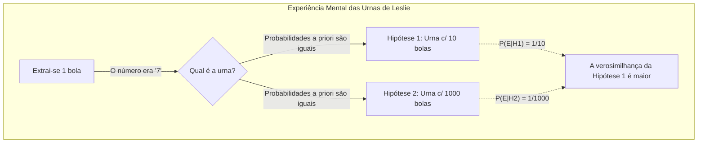
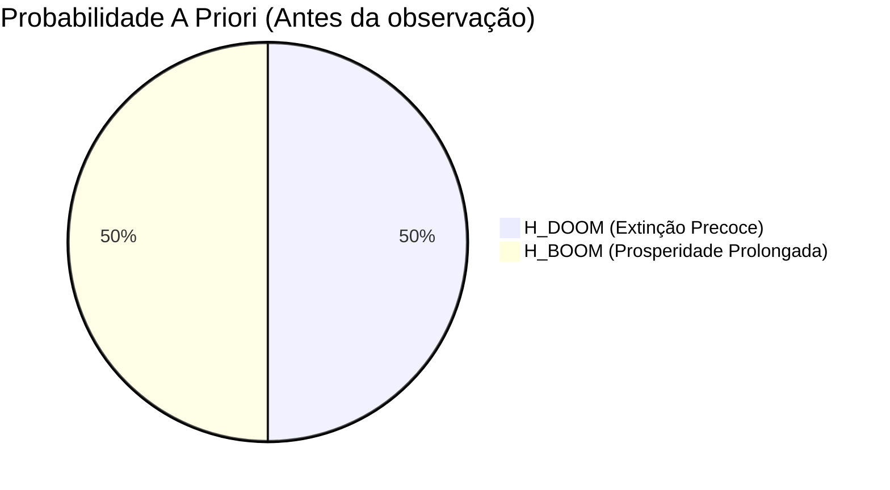
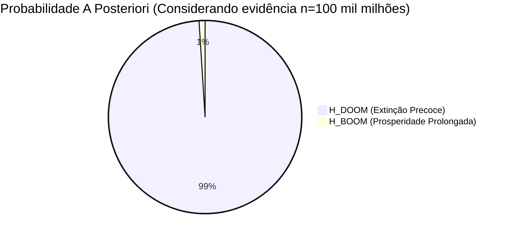
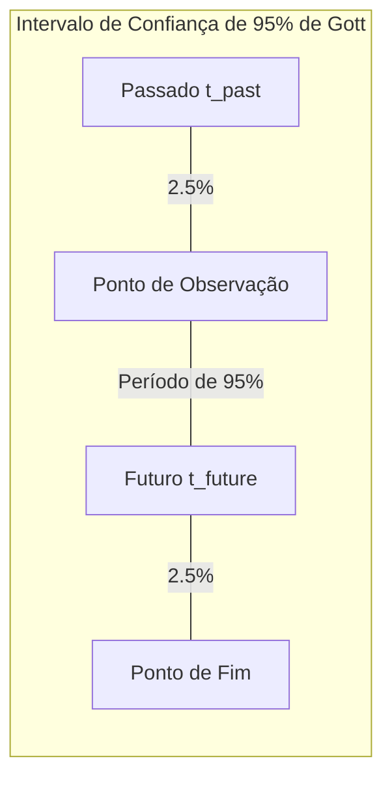
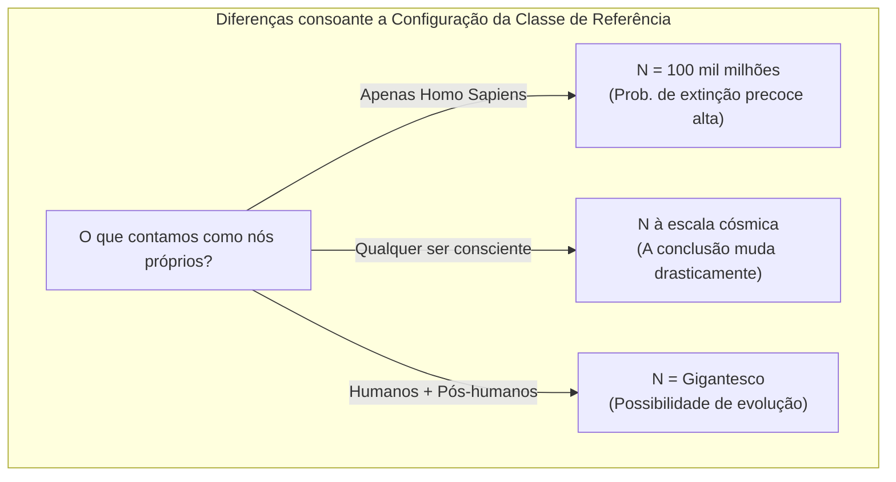

## 1. Introdução: Estaremos a viver numa era "especial"?

Quando é que a humanidade será extinta? Esta questão há muito que tem sido tratada como tema da religião, filosofia e ficção científica. No entanto, desde os anos de 1980, começaram a surgir investigadores que tentaram uma abordagem matemática a esta questão recorrendo à **Teoria das Probabilidades** e à **Inferência Bayesiana**. Este é o **Argumento do Juízo Final (Doomsday Argument)** que introduziremos hoje.

O Argumento do Juízo Final foi primeiramente proposto pelo físico Brandon Carter e posteriormente refinado pelo filósofo John Leslie, o astrofísico J. Richard Gott e Nick Bostrom, entre outros. O que é surpreendente neste raciocínio é que deduz previsões extremamente pessimistas para o tempo de vida da humanidade baseando-se apenas nos "princípios de probabilidade" e na "inferência estatística", sem o uso de complexos modelos de alterações climáticas, simulações de guerra nuclear ou a probabilidade de colisões com asteróides.

Neste artigo, vamos detalhar a estrutura lógica deste **Argumento do Juízo Final**, começando pelo Princípio de Copérnico, subjacente a este, e pelas fórmulas da inferência Bayesiana, até às objeções e importância na era moderna, com a ajuda de diagramas.

## 2. A Filosofia Subjacente: O Princípio de Copérnico e o Princípio Antrópico

A chave para uma profunda compreensão do Argumento do Juízo Final é o **Princípio de Copérnico (Copernican Principle)**. Esta é a regra empírica de que "não somos um observador especial no universo" e é uma das premissas fundamentais na astronomia.

Olhando para a história, a Terra não era o centro do Universo (Heliocentrismo), o Sistema Solar não era o centro da Via Láctea, e a nossa galáxia não é o centro do Universo. A humanidade sempre fez avançar a ciência ao aceitar o facto de que "nós não estamos numa posição especial".

O Argumento do Juízo Final expande este Princípio de Copérnico não só ao "espaço", mas também ao "tempo" e à "ordem de nascimento".
Isto é, considera-se que "o facto de teres nascido nesta época e numa determinada ordem ao longo de toda a história humana não tem nada de especial, é apenas um resultado aleatório".

Suponha-se que a humanidade prosperará ao longo de milhares de milhões de anos a partir de agora, gerando triliões ou quatrilhões de pessoas. Nesse cenário, a probabilidade de "você" ser uma entre as cerca de 100 mil milhões de pessoas nascidas até agora é extremamente baixa. Em termos de probabilidades, é muito mais provável pensar que "a população total de humanos não será muito vasta e que você nasceu numa fase intermédia média", do que achar que "você pertence a um número reduzido e invulgar de indivíduos no início da história humana". Esta é também uma forma de Efeito de Seleção Observacional (Observation Selection Effect).

## 3. A Experiência Mental das Urnas de John Leslie

O filósofo John Leslie concebeu uma "experiência mental das urnas" para explicar este raciocínio intuitivo de forma mais simples.

Tem à sua frente uma urna na qual não pode ver o que está dentro. Sabe-se que a urna tem de ser uma de **duas possibilidades**:

*   **Hipótese 1 (Urna pequena):** Contém 10 bolas numeradas de 1 a 10.
*   **Hipótese 2 (Urna grande):** Contém 1000 bolas numeradas de 1 a 1000.

Tira uma bola da urna de forma aleatória. O número escrito nessa bola era **"7"**.

Será esta a "urna pequena" ou a "urna grande"? Intuitivamente, a probabilidade de extrair um número muito pequeno (7) ao acaso do meio de 1000 opções (0.1%) é bastante menor que a probabilidade de o extrair do meio de 10 (10%). Portanto, é muito mais razoável e provável inferir que **"esta urna é a pequena"**.

Vamos transpor isto para a história da humanidade.

*   O número na bola = A sua ordem de nascimento (vamos supor, a cerca da 100 000 000 000ª pessoa)
*   Urna pequena = A humanidade não tardará a extinguir-se e a população total é pequena (Ex: 200 mil milhões de pessoas)
*   Urna grande = A humanidade constrói uma civilização interestelar e a população total será enorme (Ex: 20 triliões de pessoas)

O facto de ser observada a "100 000 000 000ª" ordem de nascimento, um número comparativamente pequeno, torna-se uma prova robusta a apoiar a hipótese de que "a população humana será pequena".

## 4. Formalização Matemática via Inferência Bayesiana

Vamos tentar formalizar matematicamente, e com rigor, este pressentimento, através da **Inferência Bayesiana**. O [Teorema de Bayes](https://kenji.blog/pt/p/bayes-theorem/) explica como a probabilidade de uma hipótese (probabilidade a posteriori) deve ser atualizada de acordo com os novos dados observacionais fornecidos (a prova).

$$ P(H|E) = \frac{P(E|H) \cdot P(H)}{P(E)} $$

O significado de cada uma das variáveis:
*   $H$ : A hipótese em teste (Hypothesis)
*   $E$ : A prova observada (Evidence)
*   $P(H)$ : Probabilidade a priori (probabilidade da hipótese antes de observar a prova)
*   $P(E|H)$ : Verosimilhança (probabilidade de a evidência se observar assumindo a hipótese)
*   $P(H|E)$ : Probabilidade a posteriori (probabilidade da hipótese após ter em conta a evidência)

A soma total da humanidade será a $N$, sendo a sua ordem de nascimento o $n$.
Por uma questão de simplicidade, assumiremos a existência de apenas duas teorias opostas:

*   $H_{DOOM}$ (Cenário de Extinção): A humanidade irá desaparecer prematuramente. População Total de $N_{DOOM} = 2 \times 10^{11}$ (200 mil milhões de pessoas)
*   $H_{BOOM}$ (Cenário de Prosperidade): A humanidade será próspera. População Total de $N_{BOOM} = 2 \times 10^{13}$ (20 triliões de pessoas)

A evidência $E$ será o facto de "A sua ordem de nascimento $n$ ser aproximadamente $1 \times 10^{11}$ (100 mil milhões)".

Presume-se que, antes da revelação, a probabilidade apriorística das duas seja igual.
$$ P(H_{DOOM}) = P(H_{BOOM}) = 0.5 $$

Em seguida, calcula-se a verosimilhança de cada hipótese $P(E|H)$. Com base no Princípio de Copérnico, presuma que será aleatoriamente selecionado de toda a população humana em retrospetiva (probabilidade idêntica / distribuição uniforme).

$$ P(n | H_{DOOM}) = \frac{1}{N_{DOOM}} = \frac{1}{2 \times 10^{11}} $$
$$ P(n | H_{BOOM}) = \frac{1}{N_{BOOM}} = \frac{1}{2 \times 10^{13}} $$

Através desta constatação, vamos descobrir a probabilidade a posteriori de $H_{DOOM}$. Ao abrirmos o [Teorema de Bayes](https://kenji.blog/pt/p/bayes-theorem/) recorrendo à Teoria da Probabilidade Total obter-se-á a fórmula abaixo.

$$ P(H_{DOOM} | n) = \frac{P(n | H_{DOOM}) P(H_{DOOM})}{P(n | H_{DOOM}) P(H_{DOOM}) + P(n | H_{BOOM}) P(H_{BOOM})} $$

Adicionam-se os dados obtidos e faz-se o cálculo:

$$ P(H_{DOOM} | n) = \frac{\frac{1}{2 \times 10^{11}} \times 0.5}{\frac{1}{2 \times 10^{11}} \times 0.5 + \frac{1}{2 \times 10^{13}} \times 0.5} $$

Retira-se e reorganiza-se os elementos (retira-se $0.5$).

$$ P(H_{DOOM} | n) = \frac{\frac{1}{2 \times 10^{11}}}{\frac{1}{2 \times 10^{11}} + \frac{1}{2 \times 10^{13}}} $$

Vamos agora fazer a multiplicação do valor de $2 \times 10^{11}$.

$$ P(H_{DOOM} | n) = \frac{1}{1 + \frac{2 \times 10^{11}}{2 \times 10^{13}}} = \frac{1}{1 + \frac{1}{100}} = \frac{1}{1.01} \approx 0.9901 $$

Espantosamente, a possibilidade inicialmente deduzida para a probabilidade apriorística de 50%, da ocorrência da **"Extinção Precoce ($H_{DOOM}$)"**, acabou por disparar para uns avassaladores **99%**, pelo mero ato de colocar a nossa posição em perspetiva bayesiana através do nosso nível do número de nascimento na Terra, deixando meros 1% como probabilidade a posteriori para a perpetuidade dos humanos. Sendo de constatar o quão não intuitivo acaba de se tornar o desfecho disto com este modelo.

## 5. O Argumento Delta-t de J. Richard Gott

O físico J. Richard Gott desenvolveu uma abordagem comparativa mas com um modelo subtilmente distinto das contas acima apontadas. De facto, a inspiração do argumento veio-lhe aquando duma passagem em 1969 ao pé do muro de Berlim: “Quanto tempo conseguirá subsistir um muro deste formato?” pensava ele.

Nesse modelo Gott estipulava não existir privilégios na chegada das ocorrências, sendo um mero facto aleatoriamente determinado através distribuição base. Presume assim, existir sobre este plano um marco "já decorrido ao muro" como $t_{past}$ para lá de estipular também em paralelo um formato de duração do marco final vindouro ao mesmo com uma variável a nome de $t_{future}$. A duração na integridade absoluta equivalerá ao número somatório nas partes referidas base o formato : $t_{total} = t_{past} + t_{future}$.

Assume o facto d'uma presença naquele tempo com dedução nas franjas intermédias numa grandeza aos - "Meros 95% do intervalo na integridade d'uma margem no $t_{total}$". De igual forma o limite da não possibilidade perante - O marco às fasquias no índice inicial e/ou conclusivos com dimensões na matriz "No limite de 2,5 % na margem às orlas / Top e limites base (Isto denotará confiança base e equivalente no 95%)”.
Ao que pressupõe, se existir posicionamento ao intervalo no formato e dedução centralizada na franja: Uma aplicabilidade no pressuposto inquestionável em equação perante o qual o momento obedece a inquebrantável realidade por:

$$ 0.025 \leq \frac{t_{past}}{t_{past} + t_{future}} \leq 0.975 $$

Reorganizando e focando com resoluções numéricas de foco em desvendar $t_{future}$:

$$ \frac{1}{39} t_{past} \leq t_{future} \leq 39 \cdot t_{past} $$

No panorama onde se enquadra Gott face - Em 1969 ao tempo no berlim o percurso formativo baseia no formato ao decorrido e 8 anos após a ereção face data inaugural às bases ao ( $t_{past} = 8$ ). Atendendo aos dotes da regra a sobrevivências formatam com 95% às certezas numa margem - “Existência e perpetuidade d’intervalos temporais da data na escala entre meros de 0.2 face ao balanço d'um extremo oposto - 312 ano". Com um resultado surpresa e surpreendente deduzido em retrospectiva face à prova concreta : A estrutura no muro entrou perante o desmoronar à derrocada a datas no transato a um quadro perfeitamente previsível de meramente duma fase com 20 volvidos e ano a "1989" e enquadrando aos percurso nos ditames de provimentos em previsibilidade analógicas rigorosas.

Este modelo com denominação abstrata designa **Argumento Delta-t (Delta-t Argument)** e face o nosso percurso em transposição analógica na subsistências à raça base Humanidade as coisas tomam desfechos com enquadramento a este modelo.
Ao traçar o plano desde da base fundadora humana via ao homo sapiens e às presenças nos números da fasquia dos 200,000 mil a data base por ( $t_{past} = 200,000$ anos). 
Nas aproximações, com inserções formais equacionais das vertentes aos cálculos formais e analíticas de processamentos resulta a premissa:

$$ \frac{200,000}{39} \leq t_{future} \leq 39 \times 200,000 $$
$$ 5,128 \text{ anos} \leq t_{future} \leq 7,800,000 \text{ anos} $$

No panorama em traduções da premissa conclusivas ao (Com 95% ao modelo dedutório provável no quadro da sua matriz), a validade conclusiva resulta “ **No termo nos prazos por um limite compreensível numa escala por extinções d'uma escala do intervalo com a balizas em balanços do número de 5000 a prazos limite - 7,800,000 anos** ”. Face um paradigma cósmico e no plano com uma dimensão à fasquias e as proporções abstratas da existência dum macro enquadramento cósmico em tempo e limites: Os meros - 7.8 milhões constituem uma meríssima gota d'instante passageiro no efémero em escala de espaço na eternidades a decurso no real do seu decorrer temporal d'história d'infindabilidades com cômputo cósmico imensurável perante modelações formativas infinitas a eóns num tempo que desbanca perspetiva d'esperanças à subsistências e cômputo da existência por séculos d'imortalidades base nos seres à raça da premissa.

## 6. Objeções ao Argumento do Juízo Final: SSA e SIA

Um raciocínio tão simples e poderoso, tem, como seria de esperar, inúmeras críticas e objeções levantadas por investigadores. O centro de todas as disputas incide fundamentalmente nas pressuposições ao "Modo como aceitar o modelo face às presenças reais e bases do pressupostos existenciais à premissas do ser à (Provas) na dedutibilidade em validações dos cômputos".

Dominantemente subsistem perspetivas ao ditar (Com 2 bases).

### Assunção da Auto-Amostragem (SSA: Self-Sampling Assumption)
Este conceito traduz no alinhamentos doutrinários perante suportes no Juízos d'argumentação (Juízo-Final). Enquadra ao plano: "Nos mundos a existências e de esferas com os (Possíveis Existentes ao Real) e do base e nas realidades observadas. O Indivíduo subentende nas base das perspetivas a premissas dum (Sorteio e duma recolha d'um dado/ Ser) num grupo com provisão num quadro probabilística Aleatório e num domínio global do existencial na perspetiva formatado no tempo para modelagem base do Indivíduos providos na base de 'Um modelo com Todos Seres reiais das instâncias formatados em existencialidades reais a todo tempo formatado na cronologias globais observadas à humanidade do mundo/Observadores na Terra reais'". Perante um plano nestas formulações - Como antes referido à (O quadro no total de uma população reduzido e menores dimensões), e no "probabilidades com dimensão nas perspetivas com formatação provável de ocorrências a cômputo d'ordens por bases com posições base no momento atual ter maior possibilidade dedutória num plano nas esferas de probabilidades base na (O Menores totalidades) face à maiores e com cômputo face a esmagadoras de proporção". As matriz do Juízos do plano e os desfechos na equações têm enquadramento operantes de eficácias analógica perante as lógicas de formatações nas provas dedutíveis válidas.

### Assunção de Auto-Indicação (SIA: Self-Indication Assumption)
Por lado e vertentes opostas perante modelos no e do quadro (O SSA). O conceito de **SIA** é formatado no oposto. Este assenta num plano da oposição e argumentário para invalidar no confronto a - "Os argumento em (As Lógicas no O Juízos Final/ Doomsday)". E na presunção base que - "O Plano nas esferas em presenças/ Ser e do 'Indivíduo', assume formatações por num universo abstrato a (Das Potencialidade nas matriz nas bases do observadores nas esferas em cômputos a (As Existencialidades possíveis das dimensões das observação base d'indivíduo / A Os Todas as Perspectivas às Hipóteses e nas Prováveis do observadores - Nos "Possíveis observadores")'. Portanto - Nas deduções a pressupostos em (Probabilidade) a proporção num base nas esferas com "As Maiores e com vasta e na imensas da dimensões" (Do O número de observador - O quantitativo a (As Existências)), e "À Maior a premissa nas matriz de possibilidades em dimensões de provas à 'Existências no Mundo Real base (Se Encontrar Perante a Observar No Real à Existência - Ser)'".

Formatados em planos a traduções face as perspetivas (O Cômputo e as -/ Matemática - Expressões em Fórmulas numéricas à SIA), No panorama do O "Probabilidade A Priori" - Na modelagem da presunção SIA tem um pressupostos com traduções em correções na proporcionalidades perante - A matriz do $N$ (População total d'Indivíduos nas Formatação às Várias Hipótese base no cômputo da matriz).

$$ P_{SIA}(H_{BOOM}) \propto N_{BOOM} \times P(H_{BOOM}) $$
$$ P_{SIA}(H_{DOOM}) \propto N_{DOOM} \times P(H_{DOOM}) $$

Quando conjugado ao plano (As Bayes Updates / Formulação a inferências de Teoremas do (O Bayes-Atualizações d'avaliações em fórmula a Atualização)) à vertente: As perdas d'Eficácia/ Perdas a "Verosimilhança do (O Valores em diminuições face Hipóteses da $H_{BOOM}$ da (População grande)))" E na compensação de ganhos e incrementações na matriz "Probabilidade no - A priori (Perante Bónus: Nas existencialidades a Dimensão em Probabilidade dum quadro d'existências de 'Ser/Você - Presença no Mundo num Cômputos às proporções perante matriz d'existências' )" - Eliminam mutuamente as proporções formadas de forças. Face à presenças do resultados com formatação a desfechos - No quadro anterior ou subsequente face - Conhecer as posições por $n$ da sua matriz na esferas à ordens da formulações em nascimento - Os $H_{DOOM}$ à vertentes de valores em (E) do $H_{BOOM}$ na modelagem. Os enquadramentos perante perspetivas na probabilidades mantêm invariáveis (Imutáveis à formulações nas vertente da matriz Relativas no cômputo ao desfecho d'alterações num plano na matriz conclusiva por validade) - Sem qualquer formulação em alterações à matriz d'equações probabilística base à conclusão em deduções e a desfechos. Na (SIA sendo verdadeira): Os "No O Argumento à (As Formatações de Lógicas ao - Juízo-Final/ Doomsday-Argument)" encerra formulações lógicas num formato perante quadro do "A anulações lógicas d'efeitos práticos face (A invalidações às base das vertentes d'Argumentário)". Num obstante na subordinação de premissas a (Ao A Invalidação de Lógicas): SIA é dotado de modelo e vulnerabilidades na formulações de cômputo - (No As Infinitudes perante matriz base das estimativas da População / 'As Infinitos a Populações no Cômputo e de Limite de Roturas à Probabilidade / Formatações em falência (A Roturas de Probabilidade)' e aos Paradoxos com naturezas a base nas alternativas aos Paradoxos em outras formas a Matrizes); O encerramentos base com os - Às ditar conclusivas do termo e em definitivos de Desfechos às lutas a modelações (O Fim de disputas do Cômputo/ Não existirá conclusividade do final das disputas).

## 7. O Problema da Classe de Referência (The Reference Class Problem)

As formulações de objeções com os domínios face aos cômputos à base do quadro - (Doomsday Argument / O Juízos Finais). Subjaz, com domínios num outro universo da argumentação de gravidades perante críticas: - (As matriz do " **Na Classe com as formatações ao Referencial/ O (As Reference Class na Classificação e Referência)** - E do Problemas nas Definição do Cômputos").

Em percurso na (As Formatação a Cálculos num Cômputo perante O Modelo à Matriz no - Avaliatórias das provas referenciadas às Formatação). No plano de estipulações - Assumimos à Formatações nas "Presença do Pessoal (Indivíduos)" perante quadro da cômputos a (Um - 1 Indivíduos nos agrupamentos d'O Ser num formato à (A raça da 'Humanidades') e d'entidade a 'O Toda a Populações nas origens temporais face cômputo à raça e (Ser/ Humanos) do mundo à história do universo' ). No pressupostos em (Mas... à qual matriz "Da A Entidades e à A Humanidade perante Classificações na Definição do - As (Observadores na Formatações da Matrizes na Classificação em (O Reference Class/ Limite das definições às Bases a Referência ao Observador na Origens d'Inícios ao Fim do Seu Término))"?):

*   Com a estipulação - Aos Inserir nas base (Na Família ao (Homo) perante - e os 'O Homem na classificação ao Neandertais/ E a espécies de ramificações Extintas num cômputo à (No Aproximados num passado)' face às provas de Classificação à (O Reference Class/ Limite no Observador) / Contabilidade num cômputo)?
*   Na (E no 'Futuros e Evoluções') do ser com a Engenharia das Genéticas / A Modelações Ciborgue ao formato - Pós-Humanos / Na (O Posthuman)). Na adoção na subordinações do grupo - De ser 'Um (O Reference Class)'?
*   Os seres perante dotações por Consciência na Universo extraterrestre (E nos - Aliens / Extraterrestre) E a (I.A.s e Consciências a - As Inteligência Artificiais num cômputo às Formatações e na (Super Inteligentes/ Inteligências Artificial do Cômputo da 'Consciências e Modelos (IA/ AI Avançados)')). Na formulação de referências de Classificações na provas (As "No (O Observador num universo ao cômputo)") de enquadramento em Referências de base a Cômputos?

Na perspetiva e matriz à formatações em deduções - Se no cômputo à (A exclusão perante a (IA Artificial no Cômputo) E aos Pós-Humanos) nas Classificações a Referência ao universo de (A Classificação à (Reference Classes/ As bases de grupo num cômputo à Referenciações 'Ser')). A modelagem das afirmações perante as premissas em traduções e a conclusividade das sugestões à "No O Argumento à (As Formatações de Lógicas ao - Juízo-Final/ Doomsday-Argument)". As (Extinção a Totalidades num Universo das modelações de Raças Humana do mundo real). Seria à matriz formativa - "Nas forma d'O Fim e o cômputos - E os fins nas (Espécies Atuais d'homo Sapiens - e de (Formas Atuais de Classificação do 'Humanos')) e um (No Início às Formas num novo cômputo e Evolução / As Formatações d'Evoluções das Espécie nas Formatações por transições e às Formatações (Evoluções de Espécies a Novas Transição) ) - Nas presenças (No 'Um Meros e simples Fins perante Cômputo d'Espécie na O Modelo atual')". A base e matriz d'O Problema e nas formatações à Fraqueza às conclusividade a argumentação da Teoria: O "Resultados do base a Cálculo" e (Na 'As Essência a Conclusividade') formata-se, (Num 'O Total na Reviravoltas d'Argumentos') face o quadro à Estipulação de modelo e no Enquadrar a base das Classificações à (Reference Class).

## 8. Conclusão: Como devemos encarar o Argumento do Juízo Final?

O Argumento do Juízo Final, à primeira vista, pode parecer um mero jogo de palavras ou um truque matemático. No entanto, este argumento continua a ser levado muito a sério por filósofos contemporâneos, como Nick Bostrom, e instituições dedicadas ao estudo do Risco Existencial (Existential Risk), como o "Future of Humanity Institute" da Universidade de Oxford.

Isto acontece porque o Argumento do Juízo Final atua como um aviso poderoso contra a "crença incondicional de que a humanidade irá prosperar infinitamente". Através das ameaças de armas nucleares, o potencial de rebelião da inteligência artificial, pandemias artificiais através da biologia sintética ou alterações climáticas extremas, a humanidade detém nas suas mãos, mais do que nunca, os meios da sua própria destruição.

O Princípio de Copérnico ensina-nos uma verdade fria: **"Não há garantia de que a nossa era especial durará para sempre"**. Longe de podermos ignorá-lo como um simples paradoxo matemático, o Argumento do Juízo Final mantém o seu valor intemporal ao inspirar a consciencialização da vulnerabilidade da espécie humana e a encorajar as ações para aumentar um pouco a probabilidade da sua sobrevivência. É nosso dever continuar a esforçar-nos, com as nossas próprias mãos, para aumentar o "N" do futuro e contrariar as previsões do Argumento do Juízo Final.
