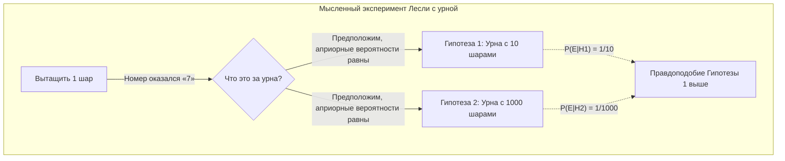
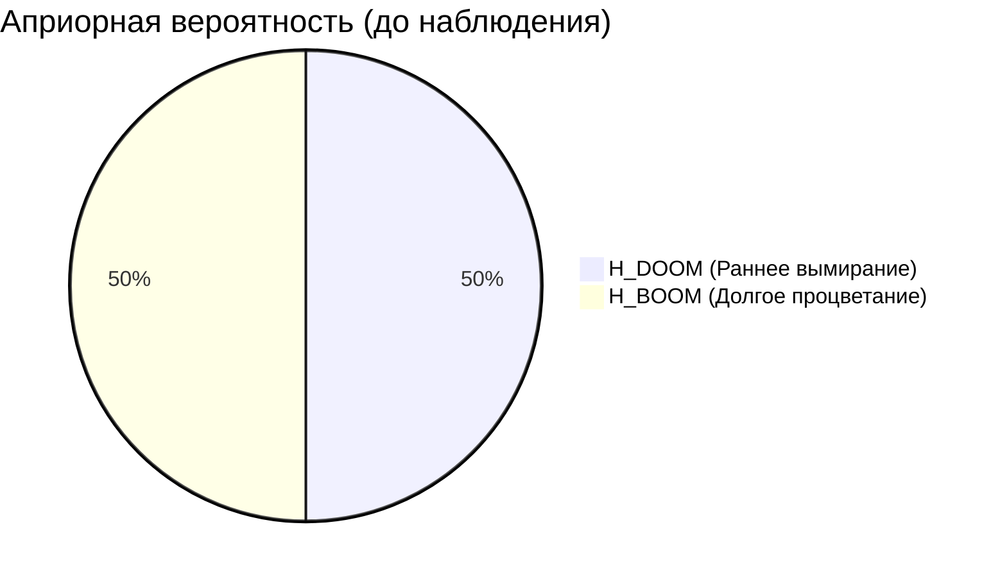
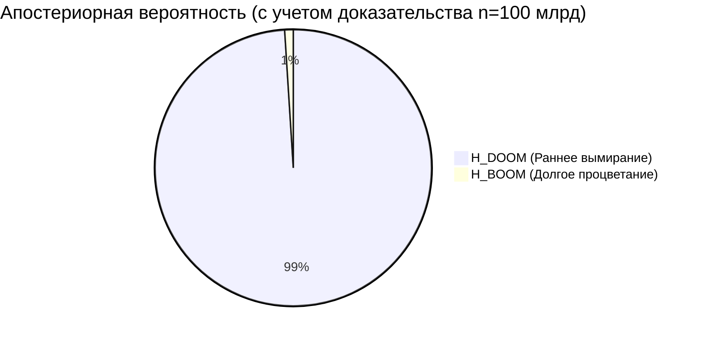
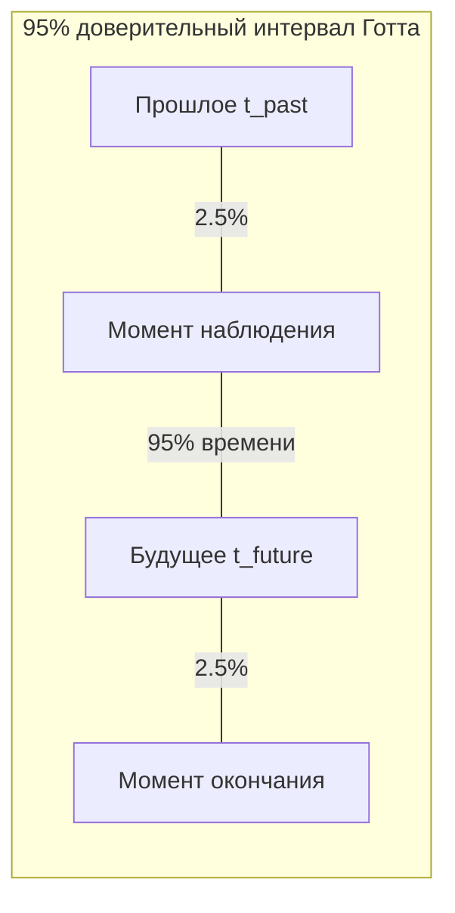
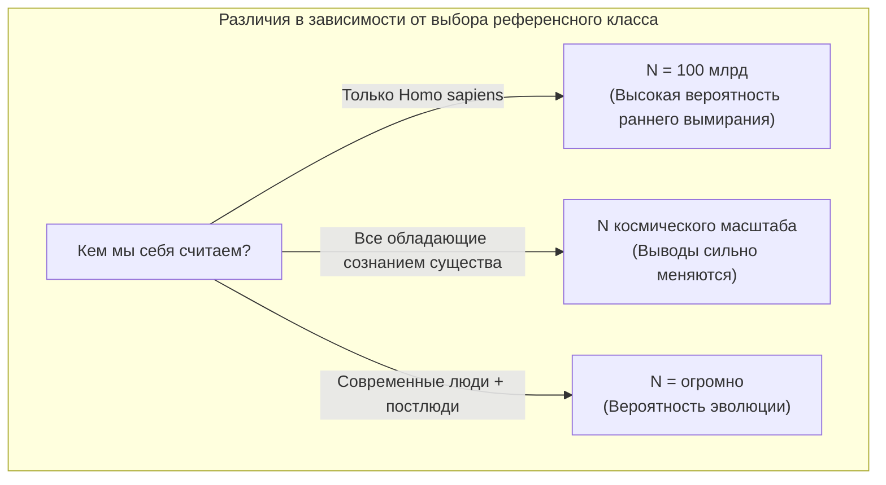

## 1. Введение: Живем ли мы в «особенную» эпоху?

Когда вымрет человечество? Этот вопрос издавна был темой религий, философии и научной фантастики. Однако начиная с 1980-х годов появились исследователи, попытавшиеся подойти к этому вопросу математически, используя **теорию вероятностей** и **байесовский вывод**. Это и есть **[Аргумент судного дня (Doomsday Argument)](https://kenji.blog/p/doomsday-argument/)**, о котором пойдет речь.

Аргумент судного дня был впервые предложен физиком Брэндоном Картером, а затем доработан философом Джоном Лесли, астрофизиком Дж. Ричардом Готтом и Ником Бостромом. Поразительно в этом аргументе то, что он приводит к крайне пессимистичному прогнозу относительно продолжительности существования человечества, не используя сложные модели изменения климата, симуляции ядерной войны или вероятности столкновения с астероидом, а опираясь исключительно на «принципы теории вероятностей» и «статистический вывод».

В этой статье мы подробно объясним, используя диаграммы, какова логическая структура этого **Аргумента судного дня**, начиная с лежащего в его основе принципа Коперника, через формулы байесовского вывода и заканчивая возражениями и его значением в современности.

## 2. Лежащая в основе идея: Принцип Коперника и антропный принцип

Ключом к глубокому пониманию Аргумента судного дня является **Принцип Коперника (Copernican Principle)**. Это эмпирическое правило, гласящее, что «мы не являемся особенными наблюдателями во Вселенной», и одна из фундаментальных предпосылок в астрономии.

Если оглянуться на историю, Земля не является центром Вселенной (гелиоцентризм), Солнечная система не является центром Млечного Пути, а наша галактика не является центром Вселенной. Человечество всегда развивало науку, принимая тот факт, что «мы не находимся в каком-то особом положении».

Аргумент судного дня расширяет этот принцип Коперника не только на «пространство», но и на «время» или «порядок рождения».
Другими словами, считается, что «тот факт, что вы родились именно в эту эпоху, на определенном порядковом месте во всей истории человечества, ни в коем случае не является чем-то особенным, а лишь случайным результатом».

Предположим, что человечество будет процветать еще миллиарды лет, и родятся триллионы или квадриллионы людей. В этом случае вероятность того, что «вы» родитесь одним из примерно 100 миллиардов человек, родившихся к настоящему времени, крайне мала. Вместо того чтобы считать, что вы являетесь «очень редким человеком из самого раннего периода истории человечества», с точки зрения теории вероятностей логичнее предположить, что «общее число людей не так уж велико, и вы родились в самом обычном среднем периоде». Это также является разновидностью эффекта наблюдательной селекции (Observation Selection Effect).

## 3. Мысленный эксперимент Джона Лесли с урной

Чтобы проиллюстрировать этот интуитивный вывод, философ Джон Лесли придумал «мысленный эксперимент с урной».

Перед вами находится одна непрозрачная урна. Известно, что эта урна является **одной из двух** следующих:

*   **Гипотеза 1 (маленькая урна):** Содержит 10 шаров с номерами от 1 до 10.
*   **Гипотеза 2 (большая урна):** Содержит 1000 шаров с номерами от 1 до 1000.

Вы наугад достаете один шар из урны. Номер на шаре оказался **«7»**.

Итак, эта урна — «маленькая» или «большая»? Интуитивно понятно, что вероятность случайно вытащить очень маленькое число 7 из 1000 (0,1%) намного ниже, чем вероятность вытащить 7 из 10 (10%). Поэтому логично сделать вывод, что **«это маленькая урна»**.

Давайте перенесем это на историю человечества.

*   Номер шара = Ваш порядковый номер рождения (предположим, около 100 миллиардов)
*   Маленькая урна = Человечество скоро вымрет, и общая численность населения невелика (например, 200 миллиардов человек)
*   Большая урна = Человечество построит межзвездную цивилизацию, и общая численность населения будет огромной (например, 20 триллионов человек)

Тот факт (наблюдение), что ваш порядковый номер сравнительно невелик («100 миллиардов»), является убедительным доказательством в пользу гипотезы о том, что «общая численность человечества невелика».

## 4. Математическая формулировка с использованием байесовского вывода

Давайте строго математически сформулируем эту интуицию, используя **байесовский вывод**. [Теорема Байеса](https://kenji.blog/p/bayes-theorem/) показывает, как следует обновлять вероятность гипотезы (апостериорную вероятность) при получении новых доказательств (данных наблюдений).

$$ P(H|E) = \frac{P(E|H) \cdot P(H)}{P(E)} $$

Здесь каждая переменная имеет следующее значение:
*   $H$ : Рассматриваемая гипотеза (Hypothesis)
*   $E$ : Наблюдаемое доказательство (Evidence)
*   $P(H)$ : Априорная вероятность (вероятность гипотезы до появления доказательств)
*   $P(E|H)$ : Правдоподобие (вероятность наблюдения этого доказательства, если гипотеза верна)
*   $P(H|E)$ : Апостериорная вероятность (вероятность гипотезы с учетом доказательств)

Пусть $N$ — общее количество людей, а $n$ — ваш порядковый номер рождения.
Для простоты предположим, что существует только две конкурирующие гипотезы.

*   $H_{DOOM}$ (Сценарий вымирания): Человечество вымрет рано. Общая численность населения $N_{DOOM} = 2 \times 10^{11}$ (200 миллиардов человек).
*   $H_{BOOM}$ (Сценарий процветания): Человечество будет процветать долго. Общая численность населения $N_{BOOM} = 2 \times 10^{13}$ (20 триллионов человек).

Доказательство $E$ — это факт, что «ваш порядковый номер рождения $n$ составляет около $1 \times 10^{11}$ (100 миллиардов)».

Предположим, что априорные вероятности до получения информации равны.
$$ P(H_{DOOM}) = P(H_{BOOM}) = 0.5 $$

Затем рассчитаем правдоподобие $P(E|H)$ для каждой гипотезы. Согласно принципу Коперника, предполагается, что вы выбираетесь с равной вероятностью (равномерное распределение) из всех людей от прошлого к будущему (принцип безразличия).

$$ P(n | H_{DOOM}) = \frac{1}{N_{DOOM}} = \frac{1}{2 \times 10^{11}} $$
$$ P(n | H_{BOOM}) = \frac{1}{N_{BOOM}} = \frac{1}{2 \times 10^{13}} $$

Используя это, рассчитаем апостериорную вероятность $H_{DOOM}$. Развернув теорему Байеса с помощью формулы полной вероятности, получим следующее.

$$ P(H_{DOOM} | n) = \frac{P(n | H_{DOOM}) P(H_{DOOM})}{P(n | H_{DOOM}) P(H_{DOOM}) + P(n | H_{BOOM}) P(H_{BOOM})} $$

Подставим значения и произведем вычисления.

$$ P(H_{DOOM} | n) = \frac{\frac{1}{2 \times 10^{11}} \times 0.5}{\frac{1}{2 \times 10^{11}} \times 0.5 + \frac{1}{2 \times 10^{13}} \times 0.5} $$

Сократим $0.5$ в числителе и знаменателе.

$$ P(H_{DOOM} | n) = \frac{\frac{1}{2 \times 10^{11}}}{\frac{1}{2 \times 10^{11}} + \frac{1}{2 \times 10^{13}}} $$

Умножим обе части на $2 \times 10^{11}$.

$$ P(H_{DOOM} | n) = \frac{1}{1 + \frac{2 \times 10^{11}}{2 \times 10^{13}}} = \frac{1}{1 + \frac{1}{100}} = \frac{1}{1.01} \approx 0.9901 $$

Поразительно, но вероятность **«раннего вымирания ($H_{DOOM}$ )»**, которая составляла 50% в качестве априорной вероятности, подскочила до **примерно 99%** после байесовского обновления с использованием вашего собственного порядкового номера рождения в качестве доказательства. Оставшийся 1% — это вероятность сценария процветания. Это математическая суть Аргумента судного дня и его парадоксальный вывод, противоречащий интуиции.

## 5. Аргумент дельта-t Дж. Ричарда Готта

Физик Дж. Ричард Готт пришел к аналогичному выводу с несколько иным подходом. В 1969 году, посетив Берлинскую стену, он задался вопросом: «Как долго еще просуществует эта стена?».

Он предположил, что он посетил стену не в какое-то «особое» время ее истории, а в случайное время (равномерное распределение). Пусть время существования стены в прошлом будет $t_{past}$, а в будущем — $t_{future}$. Общее время существования стены равно $t_{total} = t_{past} + t_{future}$.

Найдем вероятность того, что момент его визита не приходится на первые и последние 2,5% общего времени $t_{total}$ (то есть 95% доверительный интервал).
Если он находится в средних 95% времени, справедливо следующее неравенство:

$$ 0.025 \leq \frac{t_{past}}{t_{past} + t_{future}} \leq 0.975 $$

Если решить это для $t_{future}$, получится следующее:

$$ \frac{1}{39} t_{past} \leq t_{future} \leq 39 \cdot t_{past} $$

В 1969 году, когда Готт находился там, с момента постройки Берлинской стены прошло 8 лет ($t_{past} = 8$), поэтому он предсказал с вероятностью 95%, что в будущем стена простоит «от 0,2 до 312 лет». Удивительно, но стена рухнула 20 лет спустя, в 1989 году, что прекрасно уложилось в рамки его предсказания.

Давайте применим этот **аргумент дельта-t** к продолжительности существования человечества.
Предположим, что современный человек (Homo sapiens) существует около 200 000 лет ($t_{past} = 200,000$ лет).
Подставляя в формулу выше, получаем следующий расчет:

$$ \frac{200,000}{39} \leq t_{future} \leq 39 \times 200,000 $$
$$ 5,128 \text{ лет} \leq t_{future} \leq 7,800,000 \text{ лет} $$

Иными словами, напрашивается вывод, что человечество с вероятностью 95% **«вымрет в период от 5000 до 7,8 миллиона лет»**. Согласно этому статистическому выводу, вероятность того, что человечество будет продолжать процветать на протяжении сотен миллионов или миллиардов лет, крайне мала. В масштабах Вселенной 7,8 миллиона лет — это всего лишь мгновение.

## 6. Возражения против Аргумента судного дня: SSA и SIA

При всей простоте и силе этого аргумента, многие ученые, разумеется, выдвигали критику и возражения. В центре философских споров находится разница в предположениях о том, «как следует трактовать сам факт своего существования в качестве доказательства».

Существуют в основном две позиции.

### Предположение о самовыборке (SSA: Self-Sampling Assumption)
Эту позицию разделяют сторонники Аргумента судного дня. Она гласит: «Нужно считать, что вы были выбраны случайным образом из всех реально существующих наблюдателей». Исходя из этого, как упоминалось выше, «чем меньше общая численность населения, тем выше вероятность того, что у вас будет ваш нынешний порядковый номер», поэтому Аргумент судного дня работает.

### Предположение о самоиндикации (SIA: Self-Indication Assumption)
С другой стороны, **SIA** является сильным аргументом против Аргумента судного дня. SIA утверждает: «Нужно считать, что вы были выбраны случайным образом из всех **возможных** наблюдателей, и, следовательно, гипотеза, в которой существует больше наблюдателей, делает более вероятным сам факт вашего существования».

Если выразить это математически, при использовании SIA априорная вероятность должна корректироваться пропорционально общей численности населения $N$ в каждой гипотезе.

$$ P_{SIA}(H_{BOOM}) \propto N_{BOOM} \times P(H_{BOOM}) $$
$$ P_{SIA}(H_{DOOM}) \propto N_{DOOM} \times P(H_{DOOM}) $$

Если включить это в формулу байесовского обновления, представленную ранее, то штраф для гипотезы с большим населением ($H_{BOOM}$) (то, что правдоподобие низкое) и бонус к априорной вероятности (то, что чем больше население, тем выше вероятность вашего существования) идеально компенсируют друг друга. В результате мы приходим к выводу, что относительные вероятности $H_{DOOM}$ и $H_{BOOM}$ совершенно не меняются до и после того, как мы узнаем порядковый номер рождения $n$. Если SIA верно, Аргумент судного дня логически недействителен. Однако у SIA тоже есть свои парадоксы, например, «если предположить бесконечное население, вероятность рушится», и окончательного ответа пока нет.

## 7. Проблема референсного класса (The Reference Class Problem)

Еще одной серьезной критикой Аргумента судного дня является проблема определения **референсного класса (Reference Class)**.

В предыдущих расчетах мы считали себя «одним из всех 'людей', когда-либо родившихся». Но где границы этого определения «людей (наблюдателей)»?

*   Следует ли включать вымершие родственные виды, такие как неандертальцы?
*   Когда человечество в будущем эволюционирует в «постлюдей» с помощью генной инженерии или киборгизации, следует ли учитывать их в расчетах?
*   Входят ли инопланетные формы жизни или искусственный интеллект (ИИ) с высоким уровнем сознания в референсный класс как «наблюдатели»?

Если сверхпродвинутый ИИ или постлюди не включены в референсный класс (отделены в другую группу), то Аргумент судного дня указывает не на «полное вымирание человечества», а всего лишь на «конец современной формы Homo sapiens (переход к новому виду в результате эволюции)». Слабость этого аргумента в том, что в зависимости от того, как установлен референсный класс, результаты расчетов и их значение могут в корне измениться.

## 8. Заключение: Как нам относиться к Аргументу судного дня?

На первый взгляд Аргумент судного дня может показаться простой игрой слов или математическим трюком. Однако современные философы, такие как Ник Бостром, и организации, изучающие экзистенциальные риски (Existential Risk), такие как Институт будущего человечества при Оксфордском университете, продолжают всерьез обсуждать этот аргумент.

Причина в том, что Аргумент судного дня служит мощным предупреждением против **«безусловной веры в то, что человечество будет продолжать процветать бесконечно»**. Будь то угроза ядерного оружия, вышедший из-под контроля искусственный интеллект, искусственные пандемии, вызванные синтетической биологией, или изменение климата, человечество сейчас как никогда обладает средствами для самоуничтожения.

Принцип Коперника учит нас холодному факту: **«Нет никаких гарантий, что нынешняя особенная эпоха продлится вечно»**. Аргумент судного дня не следует отбрасывать как просто математический парадокс; его значение по-прежнему велико как вдохновение для того, чтобы осознать уязвимость нашего вида и предпринять действия для хоть малейшего повышения вероятности нашего выживания. Мы должны продолжать усилия, чтобы своими руками увеличить число «N» в будущем и опровергнуть предсказания Аргумента судного дня.
