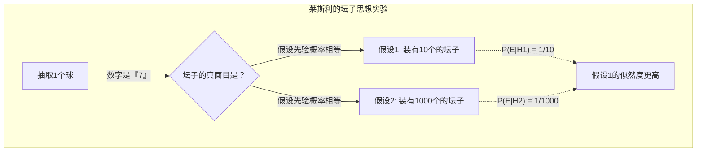
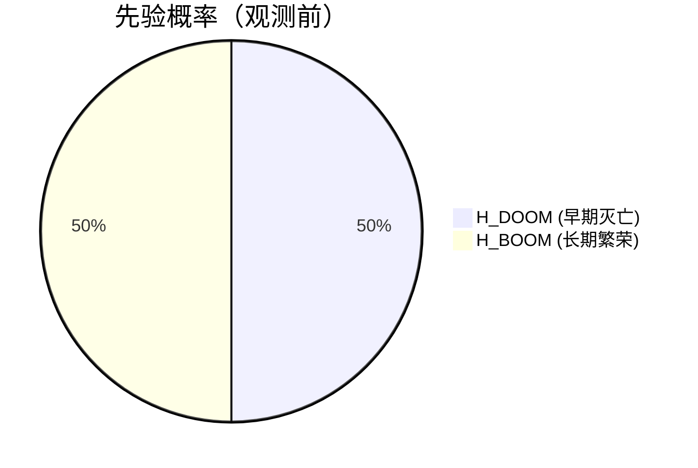
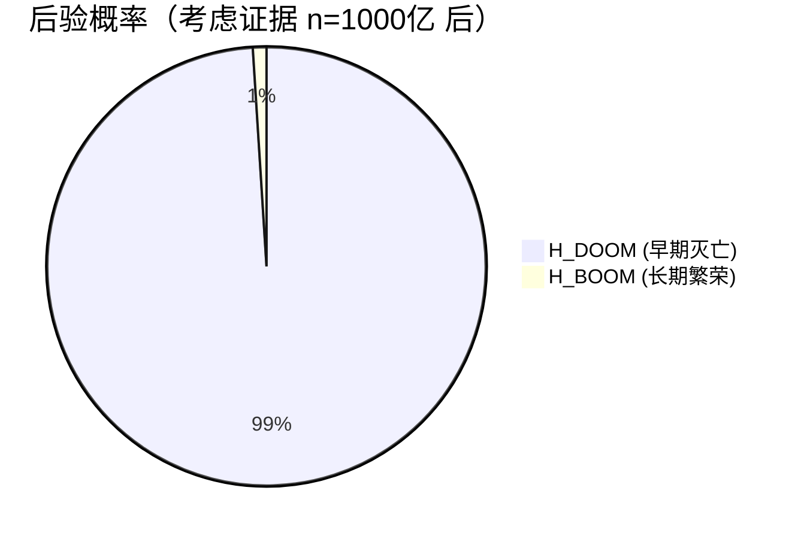
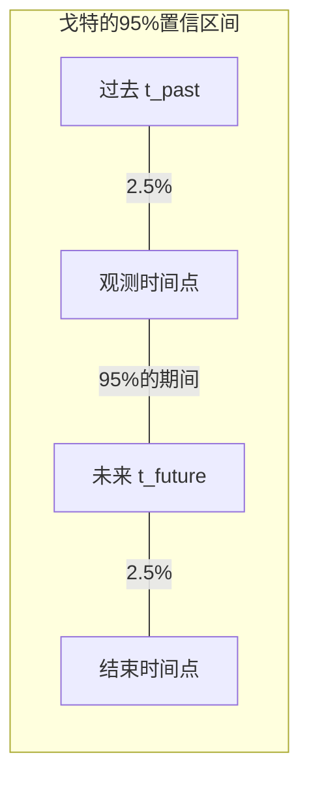
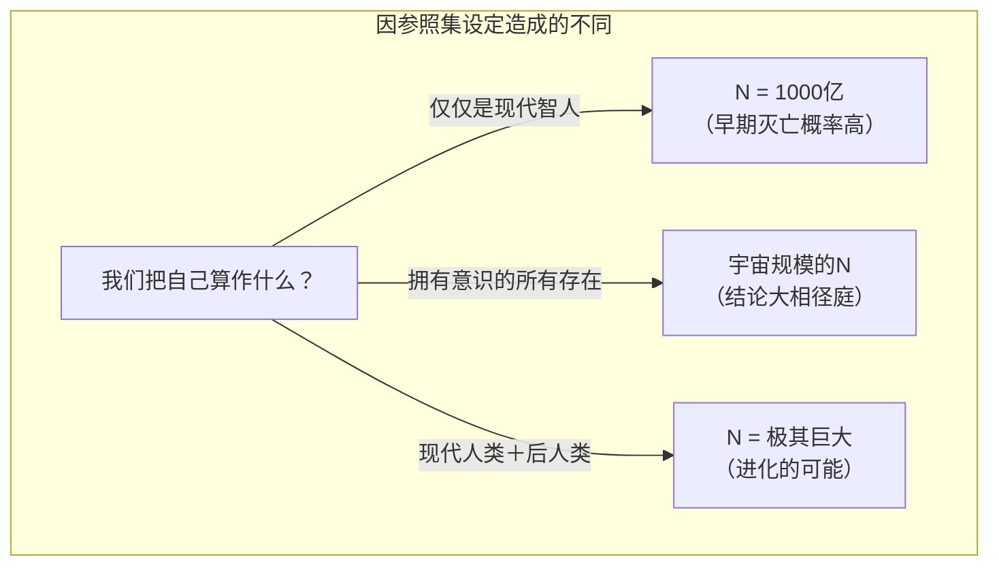

## 1. 前言：我们是否生活在一个“特殊”的时代？

人类何时会灭亡？这个问题自古以来就被作为宗教、哲学以及科幻题材所探讨。然而，到了20世纪80年代以后，出现了一些使用 **概率论** 和 **贝叶斯推断** 对这个问题进行数学探讨的研究者。这就是这次要介绍的 **[末日论证（Doomsday Argument）](https://kenji.blog/zh-cn/p/doomsday-argument/)** 。

末日论证最初由物理学家布兰登·卡特提出，之后被哲学家约翰·莱斯利、天体物理学家 J.理查德·戈特以及尼克·博斯特罗姆等人不断完善。这个论证令人惊讶之处在于，它不需要使用复杂的气候变化模型、核战争模拟，或者小行星撞击的概率等，仅仅从单纯的“概率原则”和“统计推断”出发，就能对人类存续期间推导出极其悲观的预测。

本文将深入探讨这个 **末日论证** 的逻辑结构，从其背后的哥白尼原则讲起，再到使用贝叶斯推断的数学公式，进一步涉及对其的反驳以及在现代的意义，配合图解进行详细解说。

## 2. 根基思想：哥白尼原则与人择原理

深入理解末日论证的关键是 **哥白尼原则（Copernican Principle）** 。这是一种经验法则，即“在宇宙中，我们并非特殊的观测者”，它是天文学的基本前提之一。

回顾历史，地球不是宇宙的中心（日心说），太阳系不是银河系的中心，我们的银河系也不是宇宙的中心。人类一直接受“我们并不处在一个特殊的位置”这一事实，并以此推动了科学的发展。

末日论证将这个哥白尼原则不仅扩展到“空间”，也扩展到“时间”和“出生顺序”上。
换句话说，它认为“你在这个时代，以人类历史整体中特定的顺序出生，绝不是什么特别的事，而仅仅是一个随机的结果”。

假设人类在今后几十亿年里持续繁荣，将有数万亿、数兆的人诞生。在那种情况下，作为迄今为止出生的约1000亿人中的一员，你诞生的概率会变得极低。与其认为你是“人类史最早期非常罕见的人类”，不如认为“人类的总数没那么多，你只是出生在了非常普通的中间阶段”，在概率论上更加合理。这也是观测选择效应（Observation Selection Effect）的一种。

## 3. 约翰·莱斯利的坛子思想实验

哲学家约翰·莱斯利设计了一个“坛子思想实验”，使这种直观的推理变得更容易理解。

在你的眼前有一个看不见内部的坛子。你已知这个坛子是以下 **两者之一** 。

*   **假设1（小坛子）：** 里面有10个标着数字1到10的球。
*   **假设2（大坛子）：** 里面有1000个标着数字1到1000的球。

你从坛子里随机抽取了一个球。上面写的数字是 **“7”** 。

那么，这个坛子是“小坛子”呢，还是“大坛子”呢？凭直觉去想，从1000个球中偶然抽到7这个非常小的数字的概率（0.1%），远低于从10个球中抽到7的概率（10%），因此我们推论 **“这是一个小坛子”** 才是合理的。

将其替换到人类的历史上。

*   球的数字 = 你的出生顺序（假设约在第1000亿）
*   小坛子 = 人类不久将灭亡，总人口很少（例如：2000亿人）
*   大坛子 = 人类建立了星际文明，总人口极其庞大（例如：20万亿人）

你拥有“第1000亿”这样相对较小的顺位，这一观测事实，成为了强有力地支持“人类总人口很少”这一假设的证据。

## 4. 使用贝叶斯推断的数学公式化

让我们使用 **贝叶斯推断** ，把这种直觉严格地数学公式化。[贝叶斯定理](https://kenji.blog/zh-cn/p/bayes-theorem/)是一个表明当获得新证据（观测数据）时，应如何更新某个假设概率（后验概率）的定理。

$$ P(H|E) = \frac{P(E|H) \cdot P(H)}{P(E)} $$

这里，各个变量具有以下意义：
*   $H$ : 正在探讨的假设（Hypothesis）
*   $E$ : 观测到的证据（Evidence）
*   $P(H)$ : 先验概率（看到证据之前的假设概率）
*   $P(E|H)$ : 似然度（如果假设正确，观测到该证据的概率）
*   $P(H|E)$ : 后验概率（考虑证据之后的假设概率）

设人类的总数为 $N$ ，你的出生顺序为 $n$ 。
为了简化，我们认为只有2个竞争的假设存在。

*   $H_{DOOM}$ （灭亡剧本）: 人类在早期灭亡。总人口 $N_{DOOM} = 2 \times 10^{11}$ （2000亿人）
*   $H_{BOOM}$ （繁荣剧本）: 人类长时间繁荣。总人口 $N_{BOOM} = 2 \times 10^{13}$ （20万亿人）

证据 $E$ 是“你的出生顺位 $n$ 约为 $1 \times 10^{11}$ （1000亿）”这个事实。

假设获得信息前的先验概率相等。
$$ P(H_{DOOM}) = P(H_{BOOM}) = 0.5 $$

接下来，计算在各自假设下的似然度 $P(E|H)$ 。根据哥白尼原则，假设你是从过去到未来的所有人中以均等概率（均匀分布）被选出的（无差别原则）。

$$ P(n | H_{DOOM}) = \frac{1}{N_{DOOM}} = \frac{1}{2 \times 10^{11}} $$
$$ P(n | H_{BOOM}) = \frac{1}{N_{BOOM}} = \frac{1}{2 \times 10^{13}} $$

使用这个，计算 $H_{DOOM}$ 的后验概率。使用全概率定理展开[贝叶斯定理](https://kenji.blog/zh-cn/p/bayes-theorem/)如下。

$$ P(H_{DOOM} | n) = \frac{P(n | H_{DOOM}) P(H_{DOOM})}{P(n | H_{DOOM}) P(H_{DOOM}) + P(n | H_{BOOM}) P(H_{BOOM})} $$

代入数值进行计算。

$$ P(H_{DOOM} | n) = \frac{\frac{1}{2 \times 10^{11}} \times 0.5}{\frac{1}{2 \times 10^{11}} \times 0.5 + \frac{1}{2 \times 10^{13}} \times 0.5} $$

消除分子分母的 $0.5$ ，然后整理。

$$ P(H_{DOOM} | n) = \frac{\frac{1}{2 \times 10^{11}}}{\frac{1}{2 \times 10^{11}} + \frac{1}{2 \times 10^{13}}} $$

两边乘以 $2 \times 10^{11}$ 。

$$ P(H_{DOOM} | n) = \frac{1}{1 + \frac{2 \times 10^{11}}{2 \times 10^{13}}} = \frac{1}{1 + \frac{1}{100}} = \frac{1}{1.01} \approx 0.9901 $$

令人震惊，先验概率为50%的 **“早期灭亡（$H_{DOOM}$）”** 概率，通过将自己的出生顺位作为证据进行贝叶斯更新，飙升到了 **约99%** 。剩下的1%才是繁荣剧本的概率。这就是末日论证在数学上的本质，是极其违背直觉的惊人结论。

## 5. J.理查德·戈特的 Delta t 论证

物理学家 J.理查德·戈特从稍微不同的途径得出了相同的结论。1969年他访问柏林墙时，突然想到：“这堵墙还能存在多久呢”。

他假设，自己并不是在墙的历史中某个“特殊”的时期去访问的，而是在一个随机的时间点（均匀分布）访问的。设墙过去的存续时间为 $t_{past}$ ，未来的存续时间为 $t_{future}$ 。墙的总存续时间为 $t_{total} = t_{past} + t_{future}$ 。

求自己访问的时间点不处于整体 $t_{total}$ 最初和最后2.5%期间的概率（即95%的置信区间）。
如果自己处于中间95%的期间，则以下不等式成立。

$$ 0.025 \leq \frac{t_{past}}{t_{past} + t_{future}} \leq 0.975 $$

将此对于 $t_{future}$ 进行求解，如下所示。

$$ \frac{1}{39} t_{past} \leq t_{future} \leq 39 \cdot t_{past} $$

戈特在1969年时，因为柏林墙已经建成了8年（ $t_{past} = 8$ ），预测墙的未来存续时间在95%的概率下是“在0.2年到312年之间”。令人惊叹的是，柏林墙在20年后的1989年倒塌了，漂亮地落入了他的预测范围之内。

让我们将这个 **Delta t 论证** 应用于人类的存续时间上。
假设现代智人（Homo sapiens）诞生至今约20万年（ $t_{past} = 200,000$ 年）。
代入刚才的公式，得出以下计算结果。

$$ \frac{200,000}{39} \leq t_{future} \leq 39 \times 200,000 $$
$$ 5,128 \text{年} \leq t_{future} \leq 7,800,000 \text{年} $$

也就是说，可以得出人类有95%的概率 **“在今后5000年到780万年以内灭亡”** 的结论。根据这项统计推断，人类在今后几亿年、几十亿年继续繁荣的可能性极低。在宇宙的尺度上来看，780万年的时间不过是一瞬之间。

## 6. 对末日论证的反驳：SSA与SIA

虽然这是一个如此简洁有力的论证，但当然也有很多学者提出了批评和反驳。引发哲学争论的焦点在于，“如何将自身存在这一事实作为证据来处理”这一假设的差异。

主要存在两种立场。

### 自身采样假设（SSA: Self-Sampling Assumption）
这是末日论证支持者所采取的立场，其观点是“应该认为我是从所有实际存在的观测者中随机被选出的”。基于这个观点，如前所述“总人口越少，自己排在现在顺位的概率就越高”，因此末日论证成立。

### 自身指示假设（SIA: Self-Indication Assumption）
另一方面， **SIA** 是对末日论证强有力的反驳。SIA主张“应该认为我是从所有 **可能存在的** 观测者中随机选出的。因此，假设里存在的观测者越多，我最初存在的概率本身也就越高”。

用公式表示的话，认为如果采用SIA，先验概率应与各假设下的总人口 $N$ 成正比地进行修正。

$$ P_{SIA}(H_{BOOM}) \propto N_{BOOM} \times P(H_{BOOM}) $$
$$ P_{SIA}(H_{DOOM}) \propto N_{DOOM} \times P(H_{DOOM}) $$

把这个纳入刚才的贝叶斯更新公式的话，人口多的假设（ $H_{BOOM}$ ）的惩罚项（似然度低）和先验概率的奖励项（人口越多自己存在的概率越高）巧妙地相互抵消了。结果，在知道出生顺位 $n$ 的前后， $H_{DOOM}$ 和 $H_{BOOM}$ 的相对概率完全没有变化，得出了这一结论。如果SIA是正确的，末日论证在逻辑上就被无效化了。但是，SIA也存在“假定无限的人口时概率会崩溃”等其他的悖论，并没有完全定论。

## 7. 参照集问题（The Reference Class Problem）

对末日论证另一个重大的批评是有关 **参照集（参考群体）** 定义的问题。

在迄今为止的计算中，我们把自己算作“至今出生的所有‘人类’中的1个人”。然而，这个“人类（观测者）”的定义到底从何算起，到何为止呢？

*   应该包括像尼安德特人这样已灭绝的近亲物种吗？
*   未来人类通过基因工程和赛博格化进化为“后人类”时，是否应把他们包含在内？
*   具有高度意识的人工智能（AI）或外星生命体，是否算作“观测者”包含在参照集中？

如果超高智能的AI和后人类不包含在参照集中（视为不同的群体），那么末日论证暗示的就不是“人类的完全灭绝”，而仅仅是“现代智人这种形态的终结（向新物种进化的过渡）”。这个论证的弱点也在于，如何设定参照集，将会从根本上改变计算结果和其含义。

## 8. 结论：我们该如何面对末日论证？

乍看之下，末日论证可能只是文字游戏或数学把戏。然而，诸如尼克·博斯特罗姆等现代哲学家，以及牛津大学“人类未来研究所”等专门研究存在性风险（Existential Risk）的机构中，至今仍在认真地讨论这个论证。

这是因为末日论证对 **“无条件地相信人类在这之后也会无限繁荣下去”** 这一想法发出了强有力的警告。核武器的威胁、人工智能的失控、合成生物学引发的人为大流行，又或是气候变化，人类正握有前所未有的足以毁灭自己的手段。

哥白尼原则告诉我们， **“没有任何保证说明，当下就是一个能够永远持续的特殊时代”** 这个冷酷的事实。不仅是将其当作数学悖论一笑置之，而是重新认识人类这个物种的脆弱性，并以此作为采取行动来哪怕是一点点提高存续概率的灵感来源，末日论证至今依然具有毫不褪色的价值。我们必须凭借自己的双手努力增加未来“N”的数量，去推翻末日论证的预测。
