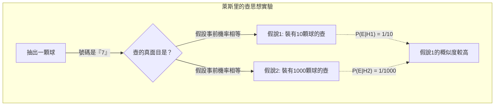
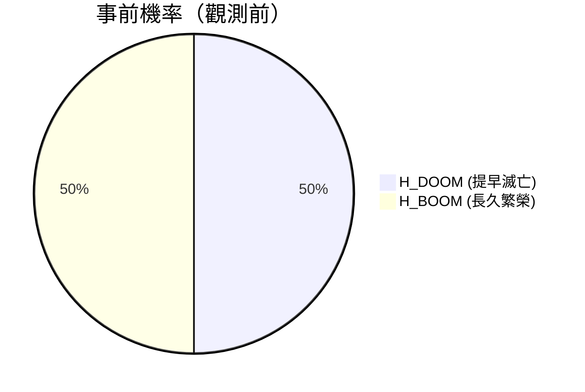
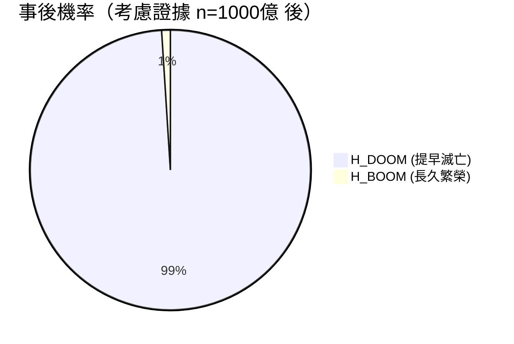
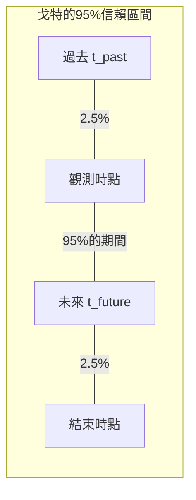
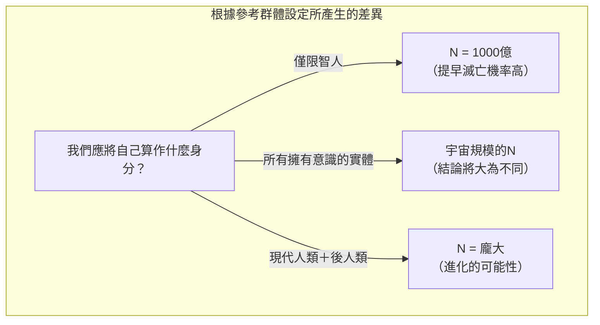

## 1. 前言：我們生活在一個「特別的」時代嗎？

人類何時會滅亡？這個問題自古以來就被視為宗教、哲學，以及科幻作品的主題。然而，1980年代之後，出現了使用 **機率論** 與 **貝氏推斷** 對這個問題嘗試進行數學探討的研究者。這就是本次要介紹的 **終末論（Doomsday Argument）** 。

終末論最初由物理學家布蘭登·卡特（Brandon Carter）提出，其後由哲學家約翰·萊斯里（John Leslie）、天體物理學家 J·理查德·戈特（J. Richard Gott）以及尼克·博斯特羅姆（Nick Bostrom）等人加以完善。這個論述的驚人之處在於，它不需要使用複雜的氣候變遷模型、核戰模擬或小行星撞擊的機率等，僅憑單純的「機率原則」與「統計推斷」，就能推導出對人類存續期間極度悲觀的預測。

在本文中，我們將配合圖解，詳細解說這項 **終末論** 究竟具有什麼樣的邏輯結構，從其背後的哥白尼原理開始，到使用貝氏推斷的數學公式，甚至是反駁意見與在現代的意義。

## 2. 根本思想：哥白尼原理與人擇原理

要深入理解終末論，關鍵在於 **哥白尼原理（Copernican Principle）** 。這是一項經驗法則，主張「我們在宇宙中並非特別的觀測者」，同時也是天文學的基本前提條件之一。

回顧歷史，地球並不是宇宙的中心（日心說），太陽系也不是銀河系的中心，而我們的銀河系同樣不是宇宙的中心。人類一直以來都是透過接受「自己並未處於特別的位置」這項事實，才得以發展科學。

終末論將這項哥白尼原理不僅擴展到「空間」，還擴展到了「時間」與「出生順序」上。
也就是說，它認為「你現在生於這個時代，在人類整體歷史中排在某個特定的順序，這絕對不是什麼特別的事，只不過是一個隨機的結果罷了」。

假設人類在未來的幾十億年內將繼續繁榮，並且會誕生出幾兆、幾萬兆的人口。在這種情況下，身為目前已出生的約1000億人中的其中1人，「你」誕生的機率將會變得極低。與其認為你是「人類歷史上最早期且非常罕見的人類」，從機率論的角度來看，認為「人類的總數並沒有那麼多，而你只是誕生在非常平均的中段時期」是更為合理的。這也是一種觀測選擇效應（Observation Selection Effect）。

## 3. 約翰·萊斯里的壺思想實驗

為了淺顯易懂地說明這種直覺式的推斷，哲學家約翰·萊斯里設計了「壺的思想實驗」。

在你的眼前有一個看不見內容物的壺。我們已經知道這個壺是以下的 **其中之一** 。

*    **假說1（小壺）：** 裡面裝有10顆球，球上寫著從1到10的號碼。
*    **假說2（大壺）：** 裡面裝有1000顆球，球上寫著從1到1000的號碼。

你從壺中隨機取出一顆球。那顆球上寫著的號碼是 **「7」** 。

那麼，這個壺究竟是「小壺」還是「大壺」呢？直覺上來想，比起從1000顆球中碰巧抽到7這個非常小數字的機率（0.1%），從10顆球中抽到7的機率（10%）要高得多，因此我們推斷 **「這是一個小壺」** 才是合理的。

我們將這個情況套用到人類歷史上。

*   球的號碼 = 你的出生順序（假設約為第1000億名）
*   小壺 = 人類在不久的將來會滅亡，總人口數較少（例：2000億人）
*   大壺 = 人類將建立星際文明，總人口數龐大（例：20兆人）

你擁有「第1000億名」這個相對較小順序的觀測事實，就成為了強力支持「人類總人口數較少」這項假說的證據。

## 4. 使用貝氏推斷進行數學公式化

讓我們使用 **貝氏推斷** 來將這個直覺嚴謹地進行數學公式化。貝氏定理是一項定理，用於說明當獲得新證據（觀測數據）時，應當如何更新某項假說的機率（事後機率）。

$$ P(H|E) = \frac{P(E|H) \cdot P(H)}{P(E)} $$

在這裡，每個變數代表以下意義：
*   $H$ : 正在檢討的假說（Hypothesis）
*   $E$ : 觀測到的證據（Evidence）
*   $P(H)$ : 事前機率（看到證據前該假說的機率）
*   $P(E|H)$ : 概似度（假設該假說為真時，觀測到該證據的機率）
*   $P(H|E)$ : 事後機率（考慮到證據後該假說的機率）

假設人類總數為 $N$ ，你的出生順序為 $n$ 。
為了簡化說明，這裡我們假設只有2個互相競爭的假說。

*   $H_{DOOM}$ （滅亡情境）: 人類將提早滅亡。總人口 $N_{DOOM} = 2 \times 10^{11}$ （2000億人）
*   $H_{BOOM}$ （繁榮情境）: 人類將長久繁榮。總人口 $N_{BOOM} = 2 \times 10^{13}$ （20兆人）

證據 $E$ 是指「你的出生順序 $n$ 約為 $1 \times 10^{11}$（1000億）」這項事實。

我們假設在獲得資訊前的事前機率是相等的。
$$ P(H_{DOOM}) = P(H_{BOOM}) = 0.5 $$

接著，我們計算在各自假說下的概似度 $P(E|H)$ 。根據哥白尼原理，我們假設你是從過去到未來所有的人類中，以相等機率（均勻分布）被挑選出來的（無差異原則）。

$$ P(n | H_{DOOM}) = \frac{1}{N_{DOOM}} = \frac{1}{2 \times 10^{11}} $$
$$ P(n | H_{BOOM}) = \frac{1}{N_{BOOM}} = \frac{1}{2 \times 10^{13}} $$

我們使用上述數值來計算 $H_{DOOM}$ 的事後機率。利用全機率定理來展開貝氏定理，會得到以下算式：

$$ P(H_{DOOM} | n) = \frac{P(n | H_{DOOM}) P(H_{DOOM})}{P(n | H_{DOOM}) P(H_{DOOM}) + P(n | H_{BOOM}) P(H_{BOOM})} $$

代入數值後繼續進行計算：

$$ P(H_{DOOM} | n) = \frac{\frac{1}{2 \times 10^{11}} \times 0.5}{\frac{1}{2 \times 10^{11}} \times 0.5 + \frac{1}{2 \times 10^{13}} \times 0.5} $$

消除分母與分子的 $0.5$ 並進行整理：

$$ P(H_{DOOM} | n) = \frac{\frac{1}{2 \times 10^{11}}}{\frac{1}{2 \times 10^{11}} + \frac{1}{2 \times 10^{13}}} $$

兩邊同乘 $2 \times 10^{11}$ ：

$$ P(H_{DOOM} | n) = \frac{1}{1 + \frac{2 \times 10^{11}}{2 \times 10^{13}}} = \frac{1}{1 + \frac{1}{100}} = \frac{1}{1.01} \approx 0.9901 $$

沒想到，原本事前機率只有50%的 **「提早滅亡（$H_{DOOM}$）」** ，在將自己的出生順序作為證據進行貝氏更新後，機率居然飆升到了 **約99%** 。剩下的1%才是繁榮情境的機率。這就是終末論的數學本質，也是一項違反直覺卻又令人震驚的結論。

## 5. J·理查德·戈特的 Delta t 論法

物理學家 J·理查德·戈特（J. Richard Gott）從稍微不同的角度，推導出了同樣的結論。他在1969年造訪柏林圍牆時，突然想到：「這座牆還能存在多久呢？」

他假設自己並非在柏林圍牆歷史上「特別的」時機點來訪，而是在隨機的時機點（均勻分布）來訪的。我們假設柏林圍牆過去存在的期間為 $t_{past}$ ，未來存在的期間為 $t_{future}$ 。圍牆的總存在期間就是 $t_{total} = t_{past} + t_{future}$ 。

我們要求出自己造訪的時間點，在整體的 $t_{total}$ 之中，並非落在最初與最後的2.5%期間內的機率（也就是95%的信賴區間）。
如果自己處於中間95%的期間，那麼以下的不等式將會成立：

$$ 0.025 \leq \frac{t_{past}}{t_{past} + t_{future}} \leq 0.975 $$

針對 $t_{future}$ 求解後，會得到以下結果：

$$ \frac{1}{39} t_{past} \leq t_{future} \leq 39 \cdot t_{past} $$

戈特在1969年當時，距離柏林圍牆建好已經過了8年（ $t_{past} = 8$ ），因此他預測圍牆未來存在的期間有95%的機率會落在「0.2年到312年之間」。令人驚訝的是，柏林圍牆在20年後的1989年倒塌了，漂亮地落在他的預測範圍內。

我們將這個 **Delta t 論法** 應用到人類的存續期間上吧。
假設現代人（智人）誕生至今約20萬年（ $t_{past} = 200,000$ 年）。
代入剛才的公式後，會得到以下計算結果：

$$ \frac{200,000}{39} \leq t_{future} \leq 39 \times 200,000 $$
$$ 5,128 \text{年} \leq t_{future} \leq 7,800,000 \text{年} $$

也就是說，這推導出人類有95%的機率 **「將在未來的5000年到780萬年內滅亡」** 這個結論。根據這項統計推斷，人類持續繁榮數億年、數十億年的可能性極低。從宇宙的尺度來看，780萬年不過是一瞬間罷了。

## 6. 對終末論的反駁：SSA 與 SIA

雖然這是如此簡單又有力的論述，但理所當然地也受到了許多學者的批評與反駁。哲學爭論的中心在於「對於將自己存在這項事實作為證據來處理」這項假設的差異。

主要有兩種立場。

### 自我抽樣假設（SSA: Self-Sampling Assumption）
這是支持終末論者所採用的立場，主張「應當將自己視為從所有實際存在的觀測者中隨機選出的一員」。根據這項假設，如前所述，「總人口數越少，自己排在現在這個順序的機率就越高」，因此終末論便能成立。

### 自我指示假設（SIA: Self-Indication Assumption）
另一方面， **SIA** 則對終末論構成了強力的反駁。SIA主張「應當將自己視為從所有 **可能的** 觀測者中隨機選出的一員，因此，觀測者越多的假說，自己一開始就存在的機率也就越高」。

用數學公式來表示的話，採用SIA時的事前機率，應當與各假說中的總人口數 $N$ 成正比來進行補償。

$$ P_{SIA}(H_{BOOM}) \propto N_{BOOM} \times P(H_{BOOM}) $$
$$ P_{SIA}(H_{DOOM}) \propto N_{DOOM} \times P(H_{DOOM}) $$

如果將這個算式帶入剛才的貝氏更新公式中，人口眾多的假說（ $H_{BOOM}$ ）所受到的懲罰（概似度較低），以及事前機率的獎勵（人口越多自己存在的機率越高）兩者將會完美抵銷。結果，這推導出在得知出生順序 $n$ 的前後， $H_{DOOM}$ 與 $H_{BOOM}$ 的相對機率將完全不會發生改變。如果SIA是正確的，終末論在邏輯上就會失效。然而，SIA也存在著「假設無窮人口時機率會崩潰」等其他的悖論，目前尚無完全定論。

## 7. 參考群體問題（The Reference Class Problem）

對終末論的另一項重大批評，是關於 **參考群體（Reference Class）** 定義的問題。

在至今為止的計算中，我們將自己計算為「至今誕生所有『人類』中的其中1人」。但是，這個「人類（觀測者）」的定義到底包含了哪些範圍？

*   是否應該包含尼安德塔人等已滅絕的近緣物種？
*   未來，當人類透過基因改造或生化改造進化成「後人類（Posthuman）」時，是否應該將他們計入其中？
*   外星生命體或是擁有高度意識的人工智慧（AI），是否包含在作為「觀測者」的參考群體之中？

如果超級先進的AI或後人類不被包含在參考群體中（被切割為另一個群體），那麼終末論所暗示的就不是「人類的完全滅亡」，而僅僅是「現有智人這種形態的終結（進化至新物種的過渡期）」。根據參考群體的設定方式不同，計算結果與其涵義也會發生根本性的改變，這同時也是這項論述的弱點。

## 8. 結論：我們該如何面對終末論？

乍看之下，終末論或許只像是在玩文字遊戲或數學把戲。然而，在尼克·博斯特羅姆等現代哲學家，以及如牛津大學「人類未來研究所」等研究存在性風險（Existential Risk）的機構中，這項論述一直受到認真的討論。

這是因為終末論發出了一項強烈的警告： **「不要無條件地相信人類未來會無限繁榮」** 。核武的威脅、人工智慧的失控、合成生物學引發的人造瘟疫，或是氣候變遷等，人類正掌握著前所未有、足以毀滅自身的眾多手段。

哥白尼原理告訴我們一項冷酷的事實： **「沒有任何保證能確保現在這個時代會永遠持續下去」** 。我們不應僅將其視為一項數學悖論，而是應該重新體認到人類這個物種的脆弱性，並作為採取行動以微幅提升存續機率的靈感，終末論在今日依然保有其不朽的價值。我們必須親手努力增加未來的「N」數量，持續致力於推翻終末論的預測。
