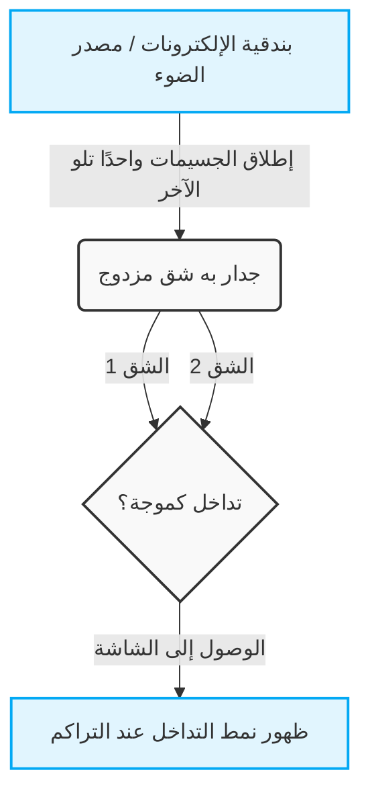
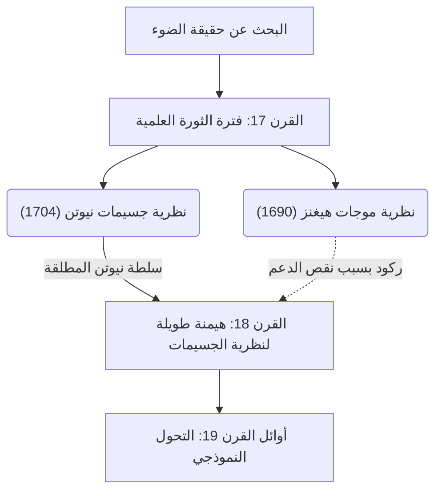
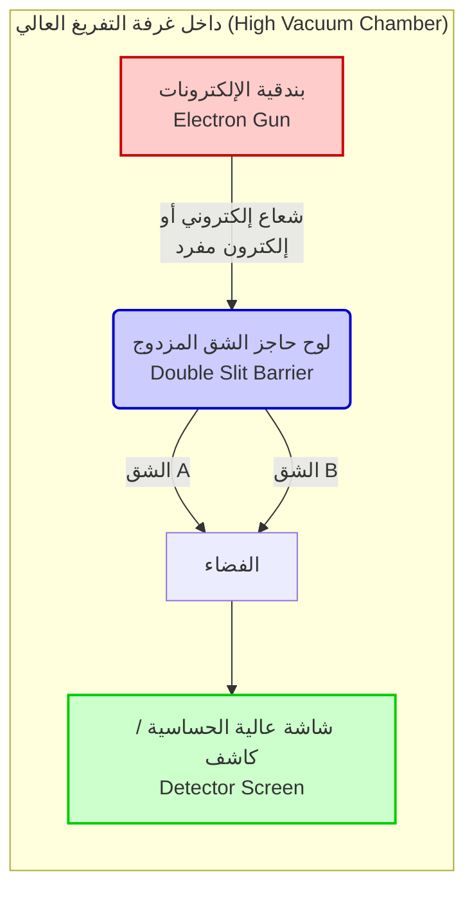

## 1. 【مقدمة】ما هي تجربة الشق المزدوج؟

يبدو أن العالم الذي نعيش فيه تحكمه قواعد راسخة. فالكرة التي تُرمى إلى الأعلى ترسم مسارًا مكافئًا وتسقط، وإذا رمينا حجرًا في سطح الماء تنتشر التموجات. هذه هي ثوابت "العالم العياني" (الماكرو) التي تصفها الفيزياء الكلاسيكية، بما في ذلك ميكانيكا نيوتن، وهي تتفق تمامًا مع حدسنا. ولكن، بمجرد أن تطأ أقدامنا "العالم المجهري" (المايكرو) مثل الذرات والإلكترونات، أو جسيمات الضوء (الفوتونات) التي تشكل أصغر الوحدات الأساسية للمادة، ينهار ذلك المنطق وتلك الثوابت بصوت مدوٍ. فهذا المجال تحكمه قواعد غريبة وغامضة للغاية، ولا تنطبق عليه حواسنا أو حدسنا اليومي على الإطلاق.

إن ما يضعنا أمام غرابة هذا العالم المجهري بأبسط الأشكال وأكثرها صدمة هو "تجربة الشق المزدوج" (Double-slit experiment). عالم الفيزياء العبقري وأحد أبرز علماء القرن العشرين، ريتشارد فاينمان، تحدث عن هذه التجربة قائلاً إنها "اللغز الوحيد في ميكانيكا الكم"، وأضاف أن "كل أسرار ميكانيكا الكم محصورة في هذه التجربة". كما أن العديد من علماء الفيزياء البارزين لا يترددون في وصف هذه التجربة بأنها "أجمل تجربة في تاريخ الفيزياء". إذن، لماذا تُعتبر تجربة بسيطة للغاية، تعتمد فقط على إحداث شقين (فتحتين) في لوح واحد، مميزة إلى هذا الحد وتستمر في جذب وإبهار العلماء؟

### عوالم الماكرو والمايكرو التي تخالف الحدس

في البداية، دعونا نتخيل ظاهرة في العالم العياني (الماكرو) حيث يعمل حدسنا بشكل دقيق.
على سبيل المثال، افترض أن لدينا آلة تطلق كرات صغيرة مطلية بالدهان (أو حتى رصاصات رشاش) واحدة تلو الأخرى نحو جدار. وأمام هذه الآلة، وُضع لوح حديدي فيه شقان (فتحتان) عموديان رفيعان ومتجاوران. عندما نطلق الكرات بشكل عشوائي، فإن الكرات التي تمر عبر أحد الشقين فقط هي التي ستصطدم بالجدار الخلفي وتترك علامة حبر. ونتيجة لذلك، يجب أن تظهر على الجدار علامتان بشكل "خطين عموديين" مطابقين لشكل الشقين الموجودين في الأمام. هذا هو سلوك الكرات كـ "جسيمات" لها مسار واضح، وهي نتيجة بديهية يمكن لأي شخص أن يتوقعها بحدسه.

بعد ذلك، لنتأمل حالة "الموجات". نضع حاجزًا يحتوي على شقين داخل حوض ماء، ونحدث موجة من جانب واحد. عندما تصل الموجة إلى الشقين تمر عبرهما، ويصبح كل شق مصدرًا جديدًا لموجة، لتنتشر موجتان نصف دائريتين نحو الجانب الآخر. وعندما تتصادم هاتان الموجتان، تحدث ظاهرة تُعرف باسم "التداخل" (Interference). ففي الأماكن التي تتلاقى فيها قمة موجة مع قمة أخرى، تتكون موجة أعلى، وفي الأماكن التي تتلاقى فيها قمة مع قاع، يلغي كل منهما الآخر ليصبح السطح مستويًا. ونتيجة لذلك، تتشكل على الجدار الخلفي (أو الحافة) أنماط شريطية جميلة تُعرف باسم "نمط التداخل" (Interference pattern)، حيث تتناوب الأماكن التي تضربها الموجة بقوة مع الأماكن التي لا تصلها الموجة على الإطلاق. وهذا أيضًا خاصية أساسية للموجات يمكن ملاحظتها يوميًا على سطح الماء أو في الموجات الصوتية.

حتى الآن، لا يوجد أي شيء غريب. رمي الجسيمات يصنع "خطين"، وإرسال الموجات يصنع "نمط تداخل". هذه هي ثوابت العالم الذي نعيش فيه، وهي الفرضية الأساسية للفيزياء الكلاسيكية.

### نظرة عامة على التجربة ولماذا تُسمى "أجمل تجربة"

ولكن، عندما نجري تجربة بنفس الهيكلية تمامًا باستخدام كيانات مجهرية مثل الضوء أو الإلكترونات، يتغير الوضع فجأة، ويُخذل الحدس البشري تمامًا.
إذا نظرنا إلى التاريخ، في عام 1801، أجرى عالم الفيزياء البريطاني توماس يونغ أول تجربة للشق المزدوج باستخدام ضوء الشمس (تجربة يونغ). في ذلك الوقت، كانت النظرية القائلة بأن الضوء عبارة عن "جسيمات" -والتي اقترحها نيوتن- هي السائدة، ولكن نتيجة لتجربة يونغ، ظهر "نمط تداخل" جميل على الشاشة. وبذلك، تم تقديم دليل قاطع على أن "الضوء عبارة عن موجة"، وبدا أن الجدل الطويل قد حُسم لمرة واحدة وإلى الأبد.

اللغز الحقيقي، وأكبر تحول نموذجي (Paradigm shift) في الفيزياء، يبدأ من هنا. في القرن العشرين، مع التقدم المذهل في تقنيات التجريب، أصبح من الممكن إطلاق الضوء أو الإلكترونات "واحدًا تلو الآخر". الإلكترون يمتلك كتلة ويشغل موقعًا محددًا في الفضاء، فهو بلا شك "جسيم" واضح. نُطلق إلكترونًا واحدًا فقط من بندقية إلكترونات، ويمر عبر الشق المزدوج ليصل إلى مكان ما على الشاشة كنقطة مضيئة وحيدة. في هذه اللحظة، وانطلاقًا من الأثر الذي يتركه على الشاشة، فإن الإلكترون يتصرف بالتأكيد كجسيم.

ثم نقوم بتكرار هذا "الإطلاق الفردي للإلكترونات" آلاف وعشرات الآلاف من المرات، لدرجة تفوق الخيال. وبما أن الإلكترونات تطير دائمًا واحدًا تلو الآخر، فمن المستحيل فيزيائيًا أن تصطدم بإلكترونات أخرى في الهواء لتتداخل مثل الموجات. من الطبيعي أن يعتقد الجميع أن الشاشة ستُظهر "خطين" متوافقين مع شكل الشقين، تمامًا كما حدث عند رمي الكرات.

ومع ذلك، ومع تراكم عدد لا يحصى من نقاط الإلكترونات على الشاشة، كان النمط الذي ظهر لا يُصدق. لقد كان "نمط تداخل" الذي لا يُفترض أن يظهر إلا عندما تتصادم الموجات مع بعضها البعض.

الإلكترونات التي هي "جسيمات" والتي أُطلقت واحدة تلو الأخرى، تصرفت ككل بطريقة ما مثل "الموجات"، وتداخلت مع نفسها لترسم نمطًا شريطيًا. ما معنى هذا بحق السماء؟ يبدو الأمر وكأن إلكترونًا واحدًا أُطلق، فانتشر في الفضاء كالموجة، ومر عبر الشقين في وقت واحد، وأحدث تداخلاً ذاتيًا، وفي اللحظة التي اصطدم فيها بالشاشة، ظهر مرة أخرى كجسيم واحد.

وما يزيد الأمر غرابة، أنه بمجرد أن حاول العلماء التحقق من "أي شق مر منه الإلكترون" عن طريق وضع جهاز رصد (مثل كاميرا) بجانب الشقين، فقدت الإلكترونات فجأة طبيعتها الموجية، وبدلاً من نمط التداخل، ظهر "خطان" عاديان على الشاشة. هذه الظاهرة المتمثلة في تغيير السلوك عند "المراقبة" أدخلت علماء الفيزياء في دوامة أعمق من الارتباك.

السبب الرئيسي الذي يجعل تجربة الشق المزدوج تُسمى "أجمل تجربة في الفيزياء" هو أنها تبرز اللغز الأساسي للكون من خلال إعداد بسيط وأنيق للغاية يتكون من مجرد شقين وشاشة، دون الحاجة إلى مسرعات ضخمة أو معادلات رياضية بالغة التعقيد. إنها تظهر لنا بصريًا وبوضوح تام لحظة انهيار ثوابت العالم العياني ببراعة. فالأمر لا يقتصر على مجرد تأكيد ظاهرة فيزيائية، بل يستمر في طرح أسئلة فلسفية ومعرفية عميقة للغاية علينا: "ما هو الواقع؟" و"هل هذا العالم الذي 'نراه' موجود حقًا بشكل موضوعي؟". إن هذه التجربة البسيطة والوحيدة تلخص حدود العقل البشري، والرومانسية اللامحدودة للعلم الذي يسعى لتجاوز هذه الحدود.

## 2. 【التاريخ】هل الضوء موجة أم جسيم؟ مسار الجدل الذي لا ينتهي

منذ أن أدركت البشرية وجود "الضوء"، لم يتوقف البحث عن حقيقته. منذ عصر اليونان القديمة، تأمل فلاسفة وعلماء رياضيات مثل إيمبيدوكليس وإقليدس في آليات الضوء والرؤية، ولكن النهج الجاد كعلم حديث بدأ في القرن السابع عشر. إن الجدل حول ما إذا كان "الضوء جسيمًا أم موجة"، والذي بدأ في ذلك العصر، أدى إلى انقسام مجتمع الفيزياء لأكثر من 300 عام لاحقًا، وأصبح في النهاية القوة الدافعة لفتح أبواب ميكانيكا الكم، وهي فيزياء جديدة تمامًا. في هذا القسم، سنتتبع مسار هذا التاريخ العلمي الملحمي بالتفصيل.

### 2.1 نظرية جسيمات نيوتن مقابل نظرية موجات هيغنز: صراع القرن السابع عشر

في النصف الثاني من القرن السابع عشر، وفي خضم الثورة العلمية، قُدمت نظريتان قويتان حول حقيقة الضوء. وهما "نظرية الجسيمات (Corpuscular theory)" التي اقترحها إسحاق نيوتن (Isaac Newton)، و"النظرية الموجية (Wave theory)" التي اقترحها كريستيان هيغنز (Christiaan Huygens).

#### نظرية جسيمات نيوتن

اعتقد إسحاق نيوتن، نجم الفيزياء الحديثة المعروف بقانون الجاذبية العامة وغيرها، أن الضوء عبارة عن مجموعة من الحبيبات الصغيرة جدًا (جسيمات دقيقة). في ورقة بحثية عام 1672 وفي كتابه الرئيسي "البصريات (Opticks)" الصادر عام 1704، شرح نيوتن ببراعة خاصية انتقال الضوء في خطوط مستقيمة وقانون الانعكاس في المرايا من خلال نموذج ميكانيكي لجسيمات ترتد عن الجدار. وبالنسبة لظاهرة تشتت الضوء الأبيض إلى سبعة ألوان عبر المنشور، جادل بأن ألوان الضوء المختلفة هي جسيمات ذات كتل مختلفة، ولهذا يختلف معامل انكسارها عند مرورها عبر وسط ما.

وقد رد نيوتن على النظرية الموجية بالإشارة إلى أنه "إذا كان الضوء موجة كالصوت، فيجب أن يلتف حول العوائق (ظاهرة الحيود)، لكن الضوء ينتقل في خطوط مستقيمة ويصنع ظلالاً واضحة"، وبذلك أنكر كونه موجة.

#### نظرية موجات هيغنز

من ناحية أخرى، جادل الفيزيائي الهولندي البارز كريستيان هيغنز في كتابه "رسالة في الضوء (Treatise on Light)" المنشور عام 1690 بأن الضوء عبارة عن موجات (موجات طولية) تنتقل عبر وسط مرن يُسمى "الأثير" يملأ الفضاء الكوني. اقترح هيغنز "مبدأ هيغنز (Huygens' Principle)" الشهير الذي ينص على أن "كل نقطة على جبهة الموجة تصبح مصدرًا لموجة ثانوية جديدة"، وشرح ببراعة هندسية قوانين انتقال الضوء في خط مستقيم والانعكاس والانكسار.

وفيما يتعلق بالانكسار بشكل خاص، توقع نيوتن أنه "عندما يدخل الضوء في وسط كثيف مثل الماء أو الزجاج، تتسارع الجسيمات بسبب قوة الجذب مما يزيد من سرعة الضوء"، لكن نظرية هيغنز الموجية خلصت إلى أن "سرعة انتشار الموجة تتباطأ في الأوساط الكثيفة"، وبالتالي تعارض الاثنان بشكل مباشر.

ومع ذلك، وبسبب السلطة والتأثير المطلقين لنيوتن في الأوساط العلمية آنذاك، تلاشت نظرية موجات هيغنز تدريجيًا في الظل، واستمرت نظرية جسيمات نيوتن في الهيمنة كتيار سائد طوال القرن الثامن عشر.

## 2.2 تجربة الشق المزدوج للضوء لتوماس يونغ (1801) وانتصار النظرية الموجية

مع دخول القرن التاسع عشر، وقع حدث حاسم دمر معقل النظرية الجسيمية التي سادت لفترة طويلة. بطل هذا الحدث كان العالم الموسوعي البريطاني توماس يونغ (Thomas Young). يونغ، الذي كان طبيبًا وساهم أيضًا في فك رموز الهيروغليفية المصرية (حجر رشيد)، أجرى في عام 1801 تجربة تتألق بشكل رائع في تاريخ الفيزياء. وهي "تجربة تداخل يونغ (التي عُرفت لاحقًا بتجربة الشق المزدوج)".

#### اكتشاف أهداب التداخل
كان إعداد تجربة يونغ بسيطًا للغاية ولكنه بارع. لقد قام بتمرير ضوء الشمس عبر ثقب صغير جدًا (أو شق) لإنشاء مصدر ضوء نقطي، ثم مرر هذا الضوء عبر شقين رفيعين متقاربين جدًا (شق مزدوج)، وعكسه على شاشة في الخلف.
لو كان الضوء عبارة عن "جسيمات" خالصة كما زعم نيوتن، لكان من المفترض أن تظهر على الشاشة خطوط مضيئة تتوافق مع شكل الشقين. لكن ما رآه يونغ على الشاشة كان نمطًا مخططًا تتناوب فيه الأهداب المضيئة والمظلمة، أي "أهداب التداخل (Interference fringes)".

هذه الظاهرة لم يكن من الممكن تفسيرها على الإطلاق إلا إذا اعتبرنا الضوء موجة. عندما تتصادم موجتان على سطح الماء، فإن الأماكن التي تتداخل فيها قمم الموجات تصبح أعلى (تداخل بناء)، بينما الأماكن التي تتداخل فيها قمة مع قاع تلغي بعضها البعض وتصبح مسطحة (تداخل هدام). استنتج يونغ أن موجات الضوء الخارجة من الشقين تتداخل بنفس هذه الطريقة.

#### الأساس الرياضي وتأسيس النظرية الموجية
شروط التداخل البناء والهدام هذه يتم تحديدها من خلال فرق طول المسار من الشقين إلى نقطة على الشاشة (فرق المسار البصري $\Delta L$). إذا افترضنا أن المسافة بين الشقين هي $d$، وزاوية الشاشة هي $\theta$، والطول الموجي للضوء هو $\lambda$، فإن فرق المسار البصري يُعبر عنه كما يلي:

$$ \Delta L = d \sin \theta $$

* **الخط المضيء (شرط التداخل البناء)**: $\Delta L = m\lambda \quad (m = 0, \pm1, \pm2, \dots)$
* **الخط المظلم (شرط التداخل الهدام)**: $\Delta L = \left(m + \frac{1}{2}\right)\lambda$

تعرض إعلان يونغ هذا في البداية لانتقادات وسخرية شديدة من أتباع نيوتن في بريطانيا. ولكن في وقت لاحق من عام 1815، قام الفرنسي أوغستان-جان فرينل (Augustin-Jean Fresnel) ببناء حيود وتداخل الضوء كنظرية رياضية صارمة. وعلاوة على ذلك، في مسابقة الأكاديمية الفرنسية للعلوم عام 1818، أشار سيميون دينيس بواسون (وهو من المعارضين للنظرية الموجية) كأحد الحكام: "إذا كانت نظرية فرينل صحيحة، فمن المفترض أن تظهر بقعة مضيئة في مركز ظل عائق دائري. ولا يمكن أن يحدث مثل هذا الشيء السخيف". ومع ذلك، عندما قام دومينيك فرانسوا جان أراغو بإجراء التجربة فعليًا ورصد "بقعة بواسون (بقعة أراغو)" بشكل مثالي، أصبح صحة النظرية الموجية أمرًا لا شك فيه.

في عام 1850، أثبت ليون فوكو وآخرون من خلال تجربة أن سرعة الضوء في الماء أبطأ منها في الهواء، مما دحض توقعات نيوتن تمامًا. وفي عام 1864، وضع جيمس كليرك ماكسويل ذروة الكهرومغناطيسية من خلال تأسيس نظرية أن "الضوء هو نوع من الموجات الكهرومغناطيسية"، وهنا حققت "النظرية الموجية" للضوء انتصارًا كاملاً، وبدا أن الجدل قد حُسم.

### 2.3 عودة النظرية الجسيمية بفضل فرضية الكم الضوئي لأينشتاين (1905)

كانت نظرية ماكسويل القائلة بأن الضوء موجة كهرومغناطيسية جميلة جدًا، لدرجة أن الفيزيائيين في أواخر القرن التاسع عشر كانوا يعتقدون أن "الفيزياء قد اكتملت تقريبًا، وما تبقى هو مجرد قياس بعض القيم الدقيقة". ومع ذلك، من أواخر القرن التاسع عشر إلى أوائل القرن العشرين، ظهرت ظاهرة غريبة لم يكن من الممكن تفسيرها بالنظرية الموجية بأي شكل من الأشكال. وهي "التأثير الكهروضوئي (Photoelectric effect)".

#### لغز التأثير الكهروضوئي
التأثير الكهروضوئي هو ظاهرة تنبعث فيها الإلكترونات (الإلكترونات الضوئية) من سطح المعدن عند تسليط الضوء عليه. وفقًا للمنطق السائد في النظرية الموجية في ذلك الوقت، كان من المفترض أن تتناسب طاقة الضوء (الموجة) مع سعتها (سطوعها). لذلك، كان يُعتقد أنه "إذا تم تسليط ضوء قوي (ساطع)، فإن الإلكترونات ستنطلق بقوة بغض النظر عن لون هذا الضوء".
ولكن نتائج التجربة خانت تمامًا توقعات النظرية الموجية.

1. **وجود تردد العتبة**: الضوء الذي تردده (لونه) أقل من تردد معين (مثل الضوء الأحمر)، بغض النظر عن مدى قوة (سطوع) تسليطه أو طول مدة تسليطه، لم يؤدِ إلى انبعاث أي إلكترونات على الإطلاق.
2. **الفورية**: على العكس من ذلك، إذا كان الضوء تردده أعلى من تردد العتبة (مثل الأشعة فوق البنفسجية)، فحتى لو كان الضوء ضعيفًا جدًا، تنبعث الإلكترونات على الفور في لحظة تسليطه.
3. **الاعتماد على الطاقة**: الطاقة الحركية للإلكترونات المنبعثة كانت تعتمد فقط على تردد (لون) الضوء، وليس على شدة (سطوع) الضوء.

#### الحل الجذري لأينشتاين: الكم الضوئي (الفوتون)
الشخص الذي حل هذا اللغز اليائس كان شابًا مغمورًا يعمل في مكتب براءات الاختراع السويسري يُدعى ألبرت أينشتاين (Albert Einstein). في عام 1905، والذي يُطلق عليه "سنة المعجزات"، قام بتطبيق "فرضية كمات الطاقة" التي اقترحها ماكس بلانك في أبحاث الإشعاع الحراري (عام 1900) على الضوء نفسه، وأعلن عن "فرضية الكم الضوئي (Light quantum hypothesis)".

افترض أينشتاين بجرأة أن الضوء، الذي كان يُعتقد أنه موجة مستمرة، هو في الواقع كتل من الطاقة، أي مجموعة من الجسيمات تسمى "الكمات الضوئية (الفوتونات: Photon)". الطاقة $E$ التي يمتلكها كم ضوئي واحد تتناسب مع تردد الضوء $\nu$، ويتم التعبير عنها بواسطة صيغة بلانك-أينشتاين التالية:

$$ E = h\nu $$
(حيث $h$ هو ثابت بلانك، $6.626 \times 10^{-34} \, \text{J}\cdot\text{s}$)

باستخدام هذه الفرضية، تم حل لغز التأثير الكهروضوئي وكأنه سحر.
التأثير الكهروضوئي كان بمثابة ظاهرة تشبه لعبة البلياردو حيث يصطدم "كم ضوئي واحد" بـ "إلكترون واحد" في المعدن وينقل طاقته بالكامل إليه. إذا افترضنا أن الحد الأدنى من الطاقة اللازمة للإلكترون للتغلب على ارتباطه بالمعدن هو "دالة الشغل ($W$)"، فإن أقصى طاقة حركية $E_k$ للإلكترون المنبعث يُعبر عنها بالمعادلة الرائعة التالية:

$$ E_k = h\nu - W $$

إذا كانت طاقة الكم الضوئي $h\nu$ أقل من دالة الشغل $W$ (ضوء منخفض التردد)، فبغض النظر عن كمية الكمات الضوئية الهائلة التي تصطدم به (حتى لو تم تقوية الضوء)، فلن يتمكن الإلكترون من القفز خارج المعدن. وهذا هو سبب وجود تردد العتبة.

#### نحو عالم غامض حيث الضوء "موجة وجسيم"
تم إثبات فرضية الكم الضوئي لأينشتاين بالكامل من خلال تجربة دقيقة قام بها روبرت ميليكان في عام 1914، وبفضل هذا الإنجاز حصل أينشتاين على جائزة نوبل في الفيزياء عام 1921. (لم يكن ميليكان نفسه يصدق نظرية أينشتاين في البداية، وأجرى التجربة في محاولة لدحضها، ولكن من سخرية القدر أسفرت التجربة عن إثبات صحة النظرية). وعلاوة على ذلك، في عام 1923 اكتشف آرثر كومبتون "تشتت كومبتون"، حيث يتغير الطول الموجي للأشعة السينية عند اصطدامها بالإلكترونات، مما أكد أن الضوء يتصرف كـ "جسيم" يمتلك زخمًا قدره $p = \frac{h}{\lambda}$ .

وهكذا حققت "النظرية الجسيمية"، التي كان من المفترض أن تكون قد هُزمت تمامًا بتجربة يونغ، عودة معجزة بعد 100 عام في شكل أكثر تطورًا يُعرف باسم "الكم".
ومع ذلك، فقد خلق هذا تناقضًا خطيرًا. فالضوء يمتلك بوضوح خصائص موجية مثل "التداخل" الذي أظهره في تجربة الشق المزدوج ليونغ، وفي الوقت نفسه يمتلك خصائص "جسيمية" كما ظهر في التأثير الكهروضوئي.

هل الضوء موجة أم جسيم؟
كانت الإجابة النهائية للفيزياء على هذا السؤال تتعارض بشدة مع الحدس البشري: "الضوء هو كلاهما وليس أيًا منهما. الضوء هو كيان كمي يجمع بين 'خصائص الموجة' و 'خصائص الجسيم'". كانت هذه هي ولادة "ازدواجية الموجة والجسيم (Wave-particle duality)".
ولم يقتصر مفهوم الازدواجية هذا على الضوء فحسب، بل تم تطبيقه أيضًا على المادة نفسها كالإلكترونات (موجات دي بروي المادية)، مما دفع الفيزياء للدخول إلى هاوية غير مسبوقة وعالم غريب وساحر يُعرف باسم "ميكانيكا الكم". والمسرح الأكثر رمزية لهذا العالم هو "تجربة الشق المزدوج في ميكانيكا الكم"، والتي تم تحديثها لتلائم العصر الحديث.

## 3. 【التحول】 المادة أيضًا موجة؟ موجات دي بروي وتجربة الشق المزدوج للإلكترون

بسبب فرضية الكم الضوئي لأينشتاين (1905) القائلة بأن الضوء "موجة وجسيم في نفس الوقت"، كان عالم الفيزياء في خضم ارتباك كبير وتحول في النماذج. على الرغم من الاعتقاد السائد لسنوات عديدة، استنادًا إلى تجربة تداخل يونغ وكهرومغناطيسية ماكسويل، بأن "الضوء موجة بشكل مطلق"، فإن ظواهر مثل التأثير الكهروضوئي لم يكن من الممكن تفسيرها إلا باعتبار الضوء "جسيمات (فوتونات)". في البداية، كان يُعتقد أن هذه الخاصية الغريبة المتمثلة في "ازدواجية الموجة والجسيم" هي خاصية فريدة يمتلكها الضوء فقط. ومع ذلك، مع دخول العشرينيات من القرن الماضي، لم يقتصر مفهوم الازدواجية هذا على عالم الضوء فحسب، بل كشر عن أنيابه ليطال "المادة" نفسها التي تتكون منها أجسامنا.

### 3.1. اقتراح لويس دي بروي لموجات المادة: قفزة من التماثل الجميل

في عام 1924، اقترح طالب الدراسات العليا الفرنسي الشاب لويس دي بروي (Louis de Broglie)، في رسالته للدكتوراه، فرضية جريئة للغاية قلبت تاريخ الفيزياء رأسًا على عقب. وكانت الفرضية تتلخص في: "إذا كان الضوء (الذي كان يُعتقد أنه موجة) يمتلك خصائص الجسيمات، فهل يمكن بالمقابل أن تمتلك المادة مثل الإلكترونات (والتي كانت تُعتبر جسيمات) خصائص الموجات أيضًا؟".

كان الحدس الفلسفي لدي بروي بأن الطبيعة تفضل دائمًا التماثل يكمن في أساس هذه الفرضية. لقد قام بتطبيق معادلات العلاقة بين الطاقة والزخم التي استنتجها أينشتاين في النظرية النسبية الخاصة وفرضية الكم الضوئي على الجسيمات المادية التي تمتلك كتلة. يتم التعبير عن الزخم $p$ للفوتون باستخدام ثابت بلانك $h$ والطول الموجي $\lambda$ كـ $p = h / \lambda$. قام دي بروي بعكس هذا، وعبر عن الطول الموجي $\lambda$ للموجة المصاحبة لجسيم يمتلك كتلة $m$ ويتحرك بسرعة $v$ (زخم $p = mv$) بصيغة رياضية بسيطة للغاية كما يلي:

$$ \lambda = \frac{h}{p} = \frac{h}{mv} $$

هذه هي صيغة "طول موجة دي بروي (طول موجة المادة)" الشهيرة. تعني هذه الصيغة أن كل ما يتحرك، بدءًا من كرات البيسبول والسيارات التي نراها في حياتنا اليومية وحتى الإلكترونات متناهية الصغر، يحمل خصائص "الموجة". إذن، لماذا لا نرى كرات البيسبول تتداخل أو تحيد مثل الموجات في حياتنا اليومية؟ ذلك لأن ثابت بلانك $h$ (حوالي $6.626 \times 10^{-34} \text{ J}\cdot\text{s}$) صغير جدًا. في الأجسام العيانية (الماكروسكوبية)، تكون الكتلة $m$ كبيرة جدًا، مما يجعل طول موجة دي بروي $\lambda$ صغيرًا لدرجة يمكن اعتباره صفرًا عمليًا، وبالتالي تختفي الخاصية الموجية تمامًا. ومع ذلك، في عالم الإلكترونات حيث تكون الكتلة صغيرة جدًا، يصبح هذا الطول الموجي مقاربًا لمدى الطول الموجي للأشعة السينية (الموجات الكهرومغناطيسية) (مثل حوالي $0.1 \text{ nm}$)، ويبرز كحجم لا يمكن تجاهله أبدًا.

كانت ورقة دي بروي هذه خارجة عن المألوف لدرجة أنها أربكت الحكام في ذلك الوقت بشكل كبير. ولكن عندما أرسل أحد الحكام، وهو بول لانجفان، هذه الورقة إلى أينشتاين، أشاد بها أينشتاين قائلاً: "لقد رفع زاوية من ستار عظيم". بفضل هذا، حظي مفهوم "موجات المادة (matter wave)" لدي بروي باهتمام عالمي، وارتبط مباشرة بإكمال ميكانيكا الموجات لاحقًا بواسطة شرودنغر.

### 3.2. تجربة دافيسون-جيرمر: إثبات الخاصية الموجية للمادة

على الرغم من أن فرضية دي بروي كانت جميلة من الناحية النظرية، إلا أنها كانت بحاجة إلى إثبات تجريبي لمعرفة ما إذا كانت تصف العالم الطبيعي الحقيقي حقًا. "إذا كان الإلكترون موجة حقًا، فيجب أن يُحدث ظواهر مميزة للموجات مثل 'الحيود' و'التداخل'". وبناءً على هذا الاعتقاد، بدأ الفيزيائيون في جميع أنحاء العالم في إجراء تجارب لالتقاط الخاصية الموجية للإلكترون.

وفي عام 1927، تم أخيرًا تقديم الدليل القاطع. إنها "تجربة دافيسون-جيرمر" التي أجراها الفيزيائيان الأمريكيان من مختبرات بيل، كلينتون دافيسون (Clinton Davisson) وليستر جيرمر (Lester Germer).

كانا يجريان التجربة في البداية لغرض آخر يتمثل في تسليط شعاع إلكتروني على بلورة من النيكل وفحص نمط تشتتها. ولكن من أجل استعادة النظام بعد حادث أثناء التجربة (أكسدة سطح النيكل بسبب كسر الأنبوب المفرغ)، قاما بتسخين النيكل في درجات حرارة عالية، ولحسن الحظ تبلور النيكل في بلورة أحادية عن طريق الصدفة. وعندما تم تسليط شعاع إلكتروني على هذا النيكل المتبلور أحاديًا مرة أخرى، لوحظت ظاهرة مذهلة. لقد أظهرت شدة الإلكترونات المتشتتة قيمة عظمى عند زاوية معينة، وهو ما يمثل "نمط حيود" واضح.

المسافة التي تصطف فيها الذرات داخل البلورة بشكل منتظم (ثابت الشبكة) تكون تقريبًا بنفس مقياس طول موجة دي بروي للإلكترون. وبعبارة أخرى، عملت بلورة النيكل نفسها كـ "محزوز حيود طبيعي" للإلكترونات. النتيجة التي حصل عليها دافيسون وجيرمر بحساب طول موجة الإلكترون عكسيًا من نمط الحيود هذا، تطابقت تمامًا مع القيمة التي تنبأت بها معادلة دي بروي $\lambda = h/p$. في نفس العام، نجح البريطاني جورج باجيت طومسون (ابن ج.ج. طومسون مكتشف الإلكترون) أيضًا في رصد حلقات حيود (حلقات ديباي-شيرر) ناتجة عن مرور شعاع إلكتروني عبر رقاقة معدنية رقيقة.

قدمت نتائج هذه التجارب حقيقة لا تقبل الشك لمجتمع الفيزياء بأن المادة تمتلك خصائص موجية. الإلكترون، الذي كان من المفترض أن يكون جسيمًا، يتصرف كموجة. كانت هذه هي اللحظة التي انكشفت فيها هذه الحقيقة العميقة للطبيعة، وكانت بمثابة إعلان لفجر ميكانيكا الكم. حصل دي بروي في عام 1929، ودافيسون وطومسون في عام 1937، على جائزة نوبل في الفيزياء تباعًا.

### 3.3. تجربة الشق المزدوج الحاسمة لشركة هيتاشي (أكيرا تونومورا وآخرون) (1989)

حتى بعد إثبات أن الإلكترون موجة، لم يتوقف استكشاف الفيزيائيين. إنها المحاولة لتنفيذ "تجربة الشق المزدوج للإلكترون"، التي لطالما تمت مناقشتها كتجربة فكرية، في الواقع وبأقصى درجات الدقة.

تمامًا كما في تجربة الشق المزدوج للضوء (تجربة يونغ)، إذا أُطلقت الإلكترونات نحو شق مزدوج، فيجب أن تظهر أهداب تداخل على الشاشة الخلفية. ولكن هنا يظهر المفارقة الأكثر غموضًا في ميكانيكا الكم: "ماذا سيحدث إذا أُطلقت الإلكترونات **واحدًا تلو الآخر** بدلاً من إطلاق كمية كبيرة منها دفعة واحدة؟"

الإلكترون الواحد هو جسيم غير قابل للانقسام. ولذلك، من المفترض أنه يمكنه المرور فقط عبر الشق الأيسر أو الشق الأيمن، وليس كلاهما. الإلكترون الذي يصل إلى الشاشة بمفرده لا يترك سوى نقطة مضيئة واحدة عليها. عند تكرار ذلك عشرات الآلاف من المرات، هل ستصبح مجموعة النقاط مجرد ظل للشقين (خطين)، أم ستصبح أهداب تداخل تُظهر خصائص موجية؟

استجابة لهذا السؤال النهائي، كان فريق البحث من مختبر الأبحاث الأساسية التابع لشركة هيتاشي اليابانية (الدكتور أكيرا تونومورا وزملاؤه) هو من قدم الإجابة الأكثر جمالًا ومثالية في العالم، متجاوزًا الحدود التقنية. في عام 1989، نجحوا ببراعة في "تجربة تداخل الموشور المزدوج للإلكترون الواحد" باستخدام تقنية الهولوغرام الشعاعي للإلكترون وتقنية المجهر الإلكتروني ذات الفراغ العالي جدًا والحرارة المنخفضة جدًا.

كان إعداد التجربة مذهلًا. لقد قللوا عدد الإلكترونات المنبعثة من مسدس الإلكترون إلى أقصى حد، وخلقوا حالة يكون فيها دائمًا "لا يوجد سوى إلكترون واحد في الجهاز" أثناء تحليق الإلكترون في الفضاء. تصل سرعة الإلكترون إلى حوالي 150 ألف كيلومتر في الثانية، والوقت المستغرق لقطع المسافة من مصدر الضوء إلى الكاشف هو مجرد لحظة. إطلاق الإلكترون التالي لا يتم إلا بعد فترة طويلة من وصول الإلكترون السابق إلى الشاشة.

عندما بدأت التجربة، بدأت النقاط المضيئة التي تشير إلى وصول الإلكترونات تظهر متناثرة واحدة تلو الأخرى على الكاشف (الشاشة). في المراحل الأولى التي شملت بضعة إلكترونات ومئات الإلكترونات، بدا الأمر وكأن النقاط مبعثرة بشكل عشوائي على الشاشة فقط. وبدا وكأنه لا يوجد أي نظام هناك، تمامًا مثل النجوم في سماء الليل.

ومع ذلك، ومع تراكم آلاف وعشرات الآلاف من الإلكترونات، ظهر مشهد مذهل واضح للعيان. مجموعة النقاط التي كانت تبدو عشوائية، شكلت تدريجيًا نمطًا مخططًا منتظمًا من الأضواء والظلال ── "أهداب تداخل" لا لبس فيها.

ما تعنيه هذه النتيجة كان متعارضًا بشدة مع الحدس. الإلكترون يصل بالتأكيد إلى الشاشة كـ "جسيم واحد" (ولهذا السبب يتم تسجيل نقطة واحدة). ومع ذلك، فإن تشكيل أهداب تداخل ككل لا يمكن تفسيره إلا بأن هذا الإلكترون الواحد "مر عبر كلا الشقين (كلا جانبي الموشور المزدوج) في نفس الوقت كموجة، وتداخل مع نفسه". إلكترون منفرد لا يتفاعل مع أي شيء، يُحدث تداخلاً مع نفسه. المبدأ الذي قاله ديراك بأن "الفوتون يتداخل فقط مع نفسه"، تم إثباته بشكل كامل في الإلكترون، وهو جسيم مادي يمتلك كتلة.

نالت تجربة الدكتور أكيرا تونومورا وزملائه إشادة عالمية باعتبارها الإثبات الأكثر وضوحًا ومباشرة لغرابة ميكانيكا الكم، أي "ازدواجية الموجة والجسيم". وليس من المستغرب أن يتم اختيار "تجربة الشق المزدوج للإلكترون" هذه في المرتبة الأولى بجدارة في تصويت القراء لـ "أجمل تجربة في تاريخ الفيزياء" الذي أجرته المجلة العلمية البريطانية "عالم الفيزياء" (Physics World) في عام 2002.

وهكذا، فإن فرضية دي بروي الغريبة القائلة بأن "المادة هي موجة"، أظهرت حقيقتها أمام أعيننا كأهداب تداخل غامضة يرسمها إلكترون واحد، بعد أكثر من 60 عامًا. ولكن هذه التجربة، في الوقت الذي حلت فيه لغز ميكانيكا الكم، فتحت الباب أيضًا أمام لغز أعمق، وهو "مشكلة القياس". "إذا حاولت معرفة أي شق مر من خلاله، فإن أهداب التداخل تختفي" ── في الفصل التالي، دعونا نخطو خطوة أعمق في هاوية هذا العالم الكمي الغريب.
## 4. 【طريقة التجربة والنتائج】 ما الذي يحدث بالتحديد

(للاقتراب من جوهر تجربة الشق المزدوج والنظر في أعماق ميكانيكا الكم، سنركز هنا على شرح التجربة باستخدام "الإلكترونات" بدلاً من الضوء. على الرغم من أن نفس الظاهرة قد تم تأكيدها باستخدام الفوتونات والجسيمات الأولية الأخرى، وحتى الجزيئات الكبيرة نسبياً مثل الفوليرين، إلا أن استخدام الإلكترونات التي تمتلك كتلة ونعتبرها "بوضوح جسيمات مادية" يجعل مفارقة وغرابة هذه الظاهرة تبرز بشكل أكبر.)

### 4.1 إعداد جهاز التجربة: المسرح لالتقاط العالم متناهي الصغر

أولاً، دعونا نلقي نظرة تفصيلية على نوع الجهاز الذي تجرى به هذه التجربة التاريخية والمبتكرة، وكيفية إعداد هذا المسرح. الهيكل المفاهيمي لتجربة الشق المزدوج بسيط بشكل مدهش، ولكن وراء نجاحها الفعلي كتجربة فيزيائية تكمن الحاجة إلى تقنيات متقدمة وتحكم بيئي صارم للغاية.

يتكون جهاز التجربة بشكل أساسي من المكونات الثلاثة الرئيسية التالية. يتم وضع جميع هذه المكونات وإغلاقها بإحكام داخل غرفة تفريغ متقدمة (وعاء مفرغ من الهواء) لمنع تشتت الإلكترونات نتيجة الاصطدام بجزيئات الهواء.

1. **بندقية الإلكترونات (Electron Gun)**:
   وهي الجهاز المخصص لإطلاق "الإلكترونات" التي تعتبر بطلة التجربة. باستخدام مبادئ مثل تسخين الفتيل لإصدار إلكترونات حرارية، أو استخدام مجال كهربائي قوي لاستخراج الإلكترونات، يتم إطلاق إلكترونات بطاقة حركية معينة في اتجاه محدد. الأمر بالغ الأهمية في هذه التجربة هو أنه يمكن إطلاق الإلكترونات كـ "شعاع" قوي بشكل مستمر مثل الشلال، أو بشكل مدهش، يمكن تقليل الطاقة إلى الحد الأقصى والتحكم في إطلاقها "بالتأكيد إلكتروناً تلو الآخر". تعتبر "تقنية إطلاق الإلكترون المفرد" هذه واحدة من التقنيات الدقيقة التي لا غنى عنها في تجارب ميكانيكا الكم الحديثة.

2. **الشق المزدوج (Double Slit)**:
   وهو عبارة عن لوح عازل (جدار) يحتوي على شقين (فتحتين) ضيقين جداً ومتوازيين بمسافة قريبة جداً لكي تمر من خلالهما الإلكترونات المنطلقة من بندقية الإلكترونات. نظراً لأن الطول الموجي لـ "موجة المادة (موجة دي برولي)" للإلكترون قصير جداً، يجب صنع عرض هذه الشقوق والمسافة بينها بدقة بأحجام متناهية الصغر تتراوح من النانومتر (جزء من مليار من المتر) إلى مقياس الميكرومتر. إذا كان عرض الشق أو المسافة الفاصلة كبيراً جداً مقارنة بالطول الموجي للإلكترون، فلن يكون من الممكن ملاحظة "التداخل" بوضوح، وهو خاصية موجية. يمكن القول إن تقنية تصنيع هذا الشق المزدوج المتناهي الصغر في حد ذاتها هي ثمرة تقنيات المعالجة الدقيقة المتطورة مثل أنظمة الطباعة بشعاع الإلكترون.

3. **الشاشة (الكاشف، Screen / Detector)**:
   هي شاشة المراقبة التي تسجل موقع الإلكترونات التي مرت بنجاح عبر الشق المزدوج ووصلت إليها في النهاية. في التجارب السابقة، كانت تُستخدم لوحات فوتوغرافية حساسة للضوء، ولكن حالياً تُستخدم كاميرات CCD عالية الحساسية، ولوحات فلورية، وكواشف بكسل شبه موصلة خاصة وما إلى ذلك. يتيح ذلك تسجيل "أين وصل (أو ضرب) الإلكترون" في كل مرة كإحداثيات ثنائية الأبعاد دقيقة للغاية. عندما يصطدم الإلكترون بالشاشة، فإنه إما يصدر ضوءاً ضئيلاً هناك أو يولد إشارة كهربائية، مما يترك أثراً واضحاً (نقطة) يثبت أنه "قد وصل بالتأكيد إلى هنا كجسيم واحد".

يوضح الشكل أدناه تخطيطاً للترتيب العام لجهاز التجربة هذا ومسار الإلكترونات.

### 4.2 في حالة توجيه كمية كبيرة من الإلكترونات: السلوك الموجي الذي يخون الحدس (تكوين نمط التداخل)

الآن، سنبدأ التجربة أخيراً. كخطوة أولى، سنزيد من طاقة بندقية الإلكترونات، ونطلق "كمية كبيرة من الإلكترونات" في وقت واحد وبشكل مستمر نحو الشق المزدوج كما لو كانت وابلاً أو رشاشاً.

بالتفكير في الفطرة السليمة للفيزياء الكلاسيكية التي نمتلكها يومياً، فإن الإلكترونات هي "جسيمات (مثل الرصاصات الصغيرة)" تمتلك كتلة. لذلك، من المتوقع أن تصطدم العديد من الإلكترونات التي تمر عبر الشقين بشكل مكثف في موقعين على الشاشة على امتداد الاتجاه المستقيم لكل شق، ونتيجة لذلك ستشكل نمطاً يشبه "شريطين عموديين". تخيل رش الطلاء على لوحة استنسل تحتوي على فجوتين. الطلاء الذي يمر عبر الفجوات يجب أن يرسم خطين على الجدار متوافقين مع شكل الفجوات.

ومع ذلك، فإن النمط الذي يظهر فعلياً على الشاشة يخون تماماً حدسنا وتوقعاتنا. على الشاشة، بدلاً من شريطين عموديين بسيطين، تتشكل بوضوح **العديد من الأشرطة المضيئة والمظلمة (نمط التداخل: Interference Pattern)**.

يمتلك هذا "نمط التداخل" نفس الخصائص الهندسية للنمط المتشكل من تداخل التموجات الناتجة عند إلقاء حجرين في نفس الوقت على سطح بركة ماء، أو النمط المشاهد في تجربة تداخل الضوء.
- **في الأماكن التي تتداخل فيها قمة الموجة مع قمة، أو قاع مع قاع (تداخل بناء)**، يصبح شريطاً "مضيئاً (كثافة اصطدام الإلكترونات عالية)" حيث تصل إليه العديد من الإلكترونات.
- **في الأماكن التي تتداخل فيها قمة الموجة مع قاع (تداخل هدام)**، تلغي الموجات بعضها البعض، ويصبح شريطاً "مظلماً (كثافة اصطدام الإلكترونات قريبة من الصفر)" حيث لا يصل إليه أي إلكترون تقريباً.

هناك استنتاج واحد فقط يمكن أن يعنيه هذا ผล. وهو **"أن الإلكترونات تتصرف كموجات"**. تنتشر مجموعة الإلكترونات المنطلقة من بندقية الإلكترونات في الفضاء مثل موجات الماء، وتمر عبر الشقين "في نفس الوقت". ومن ثم، فإن التفسير الوحيد هو أن الموجة التي انحرفت وانتشرت من الشق A، والموجة التي انحرفت وانتشرت من الشق B، تتداخلان في الفضاء أمام الشاشة، وتسببان التداخل، مما يؤدي إلى إنشاء هذا النمط المميز من الأشرطة المضيئة والمظلمة.

الإلكترونات التي كان يُعتقد بشدة أنها "جسيمات"، تمتلك في الواقع أيضاً خصائص "الموجة" (ازدواجية الموجة والجسيم). هذه الحقيقة وحدها تمثل اكتشافاً تاريخياً عظيماً في الفيزياء ومدهشة بما فيه الكفاية، ولكن اللغز الحقيقي لميكانيكا الكم، والظاهرة التي تقلب الفطرة السليمة لدينا رأساً على عقب، تزداد عمقاً بخطوة أخرى من هنا.

### 4.3 في حالة إطلاق الإلكترونات "واحداً تلو الآخر": التجربة القصوى التي تكشف هوية "موجة الاحتمال"

"أليس من الممكن أنه لأننا نطلق كمية كبيرة من الإلكترونات في نفس الوقت، فإن الإلكترونات تصطدم ببعضها البعض في الهواء، أو تتنافر بسبب القوة الكهربائية (قوة كولوم)، ونتيجة لذلك تشكل ببساطة نمطاً يشبه الموجة؟"
من الطبيعي جداً كعالم أن تطرح مثل هذا السؤال. في الواقع، عندما تم اكتشاف نمط التداخل لأول مرة، اعتقد العديد من الفيزيائيين ذلك، وحاولوا تفسير الظاهرة بشكل كلاسيكي.

لحسم هذا السؤال تماماً، تم تطوير تقنيات التجربة وإجراء تجربة أكثر حسماً. (في اليابان، تُعد التجربة التي أجرتها مجموعة أكيرا تونومورا في شركة هيتاتشي عام 1989 مشهورة جداً، وتُشاد بها كواحدة من أجمل التجارب في العالم).
وهذه التجربة هي التي **تقلل من طاقة بندقية الإلكترونات إلى أقصى حد وتطلق الإلكترونات "بالتأكيد إلكتروناً تلو الآخر"**.

على وجه التحديد، بعد التأكد من أن الإلكترون السابق قد تم إطلاقه ووصل إلى الشاشة واختفى تماماً (أو تم امتصاصه)، يتم إطلاق إلكترون جديد. يتم تكرار هذا الأمر عشرات الآلاف، بل مئات الآلاف من المرات. في هذا الإعداد، من المضمون أنه "لا يوجد سوى إلكترون واحد فقط دائماً" في الفضاء داخل جهاز التجربة. لذلك، من المستحيل فيزيائياً بنسبة 100% أن تصطدم الإلكترونات ببعضها البعض في الهواء أو تتداخل مع بعضها البعض.

دعونا نتتبع نتائج التجربة باستخدام إلكترون مفرد في هذه الحالة القصوى بمرور الوقت (العدد المتراكم من الإلكترونات).

**الخطوة 1: مباشرة بعد بدء التجربة (عشرات إلى مئات الإلكترونات)**
على الشاشة، تُطبع النقاط بشكل عشوائي تماماً واحدة تلو الأخرى. في اللحظة التي يصل فيها الإلكترون إلى الشاشة، فإنه يُظهر بوضوح خصائص "جسيم واحد"، ويسجل نقطة واحدة (دوت) في إحداثيات دقيقة محددة. في هذه المرحلة، لا يمكن العثور على أي انتظام في نمط الشاشة، ويبدو مجرد مجموعة من النقاط العشوائية وغير المنتظمة. وكأنك ترمي السهام بشكل عشوائي وأنت معصوب العينين.

**الخطوة 2: بعد وصول الآلاف إلى عشرات الآلاف من الإلكترونات**
مع مرور الوقت وتكرار التجربة، وتراكم الآلاف إلى عشرات الآلاف من النقاط على الشاشة، تبدأ ظاهرة غريبة في الحدوث. ضمن توزيع النقاط الذي اعتقدنا أنه عشوائي تماماً، يبدأ تدريجياً ظهور "انحياز" أو "تدرج". تبدأ المناطق التي تتركز فيها النقاط بكثافة والمناطق التي بالكاد تحتوي على أي نقاط في التمايز بشكل خفيف.

**الخطوة 3: عند نهاية التجربة (بعد وصول مئات الآلاف أو أكثر من الإلكترونات)**
بعد قضاء وقت طويل كافٍ، وإطلاق عدد هائل من الإلكترونات (مئات الآلاف إلى الملايين) واحداً تلو الآخر في عملية شاقة، عند النظر إلى الصورة المتراكمة للشاشة بأكملها... تظهر بوضوح هناك **"نمط تداخل"** رائع ومماثل تماماً لما حدث عند إطلاق كمية كبيرة من الإلكترونات في وقت واحد!

تعتبر هذه النتيجة واحدة من أكثر النتائج التي تقشعر لها الأبدان، وتخالف الحدس، ولكنها الأجمل والأكثر عمقاً في تاريخ الفيزياء.

والسبب في ذلك هو أن الإلكترونات تم إطلاقها "بشكل فردي تماماً واحداً تلو الآخر". من المستحيل قطعاً أن تتفاعل مع الإلكترونات السابقة أو اللاحقة. ومع ذلك، فإن تشكيل نمط شريطي يدل على تداخل الموجات في النهاية، يعني أنه ليس لدينا خيار سوى قبول الاستنتاج الذي لا يُصدق بأن **"الإلكترون الواحد يتداخل مع نفسه"**.

عند محاولة تفسير هذه الظاهرة منطقياً، فإن إحساسنا اليومي بالمكان والمادة ينهار تماماً.
بعد انطلاق إلكترون واحد من بندقية الإلكترونات، فإنه ينتشر عبر الفضاء بأسره كما لو كان "موجة"، ويمر **عبر كلا الشقين الأيمن والأيسر "في نفس الوقت"**، ويتداخل مع "موجته الخاصة" أمام الشاشة، وفي اللحظة التي يصل فيها إلى الشاشة ويتم رصده، يتقلص (يُحدد) مرة أخرى كـ "جسيم واحد" في نقطة معينة.

إذن، ما هي بالضبط ماهية هذه "الموجة" للإلكترون الواحد التي تنتقل عبر الفضاء؟
في ميكانيكا الكم، هذا ليس موجة مادية تتموج في وسط فيزيائي مثل سطح الماء أو الهواء. وفقاً للتفسير الذي اقترحه ماكس بورن، فإن هذه هي **"موجة تمثل 'احتمال' وجود الإلكترون في موقع معين في ذلك الفضاء (موجة الاحتمال)"**. رياضياً يُطلق على هذا اسم "الدالة الموجية".

الإلكترون لا يطير في خط مستقيم على طول مسار (طريق) معين مثل كرة الباتشينكو. فمنذ إطلاقه وحتى وصوله إلى الشاشة، ينتشر الإلكترون في الفضاء على شكل "حالات متراكبة (حالة التراكب)" باحتمالات مختلفة، تتضمن "حالة المرور عبر الشق الأيمن" و"حالة المرور عبر الشق الأيسر" وحتى "حالة المرور عبر كل مسار ممكن في الفضاء".

وبمجرد اصطدامه بالكاشف المسمى الشاشة، وفي اللحظة التي يتم فيها قياس "أين وصل"، فإن موجة الاحتمال التي كانت منتشرة في الفضاء تتقلص في لحظة إلى نقطة واحدة (انهيار الدالة الموجية)، ولأول مرة يتم تحديد الموقع الفعلي للجسيم بأنه "كان هنا".

يعني "الجزء المضيء (الجزء الذي تتجمع فيه النقاط بكثافة في النهاية)" من نمط التداخل المكان الذي زاد فيه احتمال وجود الإلكترونات بسبب تداخل الموجات، ويعني "الجزء المظلم (الجزء الذي لا تتجمع فيه النقاط)" المكان الذي ألغت فيه موجات الاحتمال بعضها البعض وأصبحت صفراً. تماماً كما يقترب احتمال ظهور كل وجه عند رمي النرد عدة مرات من القيمة النظرية (1/6)، فإن تكرار "السلوك الاحتمالي" للإلكترونات الفردية مئات الآلاف من المرات يؤدي إلى ظهور شكل موجة الاحتمال (نمط التداخل) كنمط واقعي.

"إلكترون واحد يمر عبر شقين في نفس الوقت"، "لا تتحدد حالته حتى يتم رصده، وهو موجود فقط كموجة احتمال تتراكب فيها احتمالات لا حصر لها".
إن الحقائق التجريبية الباردة التي تفرضها تجربة الشق المزدوج هذه تطرح علينا أسئلة فلسفية عميقة تتجاوز إطار الفيزياء، مثل "ماذا يعني الوجود في المقام الأول؟" و "ما هو الواقع الذي ندركه بالضبط؟".

## 5. 【مشكلة القياس】 الكم الذي يغير سلوكه عندما نراقبه

يكمن جوهر السبب الذي يجعل تجربة الشق المزدوج في ميكانيكا الكم تؤثر بشكل كبير ليس فقط على الفيزياء ولكن أيضاً على مجالات الفلسفة والفكر، وتُسمى بأنها أجمل تجربة وفي نفس الوقت أكثرها إثارة للرعب في تاريخ العلم، هنا. وهو الحقيقة المذهلة بأن فعل "المراقبة (القياس)" بحد ذاته يغير بشكل حاسم نتيجة الظاهرة الفيزيائية.

في العالم اليومي (العياني) الذي نعيش فيه، أي العالم الذي تحكمه الفيزياء الكلاسيكية، فإن "الرؤية" ليست سوى فعل سلبي. سواء كنا ننظر إلى القمر في سماء الليل أم لا، فإن القمر موجود هناك بثبات ويتحرك في مدار ثابت وفقاً لميكانيكا نيوتن. مداره لا يتغير لمجرد أننا ننظر إليه. إن الفطرة السليمة الراسخة لدينا هي أن وجود المراقب لا يؤثر بأي شكل من الأشكال على الواقع الموضوعي للشيء المراقب.

ومع ذلك، في العالم متناهي الصغر للكم، تنقلب هذه الفطرة السليمة رأساً على عقب. فـ "الرؤية (المراقبة)" ليست مجرد تلقي للمعلومات، بل هي عملية نشطة تترك تأثيراً لا رجعة فيه وحاسماً على الشيء. في اللحظة التي يطرح فيها المراقب سؤالاً على الطبيعة، تغير الطبيعة سلوكها. في هذا القسم، سنتعمق بالتفصيل في اللغز الأكبر في تجربة الشق المزدوج، وهو "مشكلة القياس (Measurement Problem)"، والتي لا تزال موضع نقاش في الفيزياء الحديثة.

### ماذا يحدث عندما نقوم بـ "مراقبة" أي الشقين قد مر منه

تخيل عملية إطلاق جسيمات كمية واحداً تلو الآخر، سواء كانت إلكترونات أو فوتونات، أو حتى جزيئات كبيرة مثل الفوليرين (C60)، ومرورها عبر شقين وصولاً إلى الشاشة. في الشرح السابق، أكدنا أنه حتى لو تم إطلاق الكميات بشكل فردي مع فترات زمنية فاصلة، فإن مراقبة البقع المضيئة المتراكمة على الشاشة لفترة طويلة ستُظهر تشكيل نمط تداخل جميل (دليل يوضح طبيعتها الموجية). يُفسر هذا بأن جسيماً كمياً واحداً ينتقل عبر الفضاء كـ تراكب (Superposition) لحالتين هما "احتمال المرور عبر الشق الأيمن" و "احتمال المرور عبر الشق الأيسر"، وأن موجات الاحتمال الخاصة به تتداخل مع بعضها البعض.

ومع ذلك، هنا طرح الفيزيائيون سؤالاً طبيعياً، لكنه شيطاني في عالم الكم. "هل يمر الجسيم الكمي حقاً 'عبر كلا الشقين في نفس الوقت'؟ أم أنه 'يمر في الواقع عبر شق واحد فقط ولكننا لا نعرف ذلك'؟ لنضع كاميرا بجوار الشقين ونتأكد من ذلك".

للإجابة على هذا السؤال، يتم إجراء تغيير واحد على جهاز التجربة. نضع "كاشفاً (جهاز مراقبة)" عالي الحساسية بجوار الشقين مباشرة. صُمم هذا الكاشف لـ "مراقبة" وتسجيل ما إذا كان الإلكترون قد مر عبر الشق الأيمن أم الشق الأيسر. إعداد التجربة هو نفسه تماماً باستثناء إضافة الكاشف. نطلق الإلكترونات واحداً تلو الآخر. يعمل الكاشف بشكل مؤكد، ويخبرنا بدقة بمعلومات مسار (Which-path information) الإلكترون بـ "مر من اليمين" أو "مر من اليسار". وكما هو متوقع، يتم التأكد من أن نصف الإلكترونات تمر من اليمين، والنصف الآخر يمر من اليسار. بهذا يتم إرضاء حدسنا. "آه، يبدو أن الإلكترون، كجسيم، يمر ببساطة عبر أحد الثقوب. التراكب مجرد وهم".

ومع ذلك، فقد الفيزيائيون الذين تحققوا في النهاية من نمط توزيع الإلكترونات التي وصلت إلى الشاشة الكلمات للتعبير. فما تم رسمه هناك لم يعد نمط التداخل الجميل الذي يدل على الطبيعة الموجية، بل مجرد "خطين (أو قمتين)". هذا النمط مطابق تماماً للنمط الناتج عند رمي جسيمات كلاسيكية مثل كرات البيسبول أو الحصى باتجاه الشقوق. لقد اختفى "تداخل الموجات" الضروري لتكوين نمط التداخل تماماً.

في اللحظة التي حاولنا فيها مراقبة "من أي شق مر"، تخلى الإلكترون عن طبيعته الموجية (حالة التراكب) وبدأ يتصرف كجسيم كلاسيكي نقي. إذا أطفأنا الكاشف يظهر نمط التداخل مرة أخرى، وإذا شغلناه يختفي نمط التداخل دون أن يترك أثراً. والأمر الأكثر إثارة للدهشة، أنه في التجارب اللاحقة (تجربة الممحاة الكمومية)، تبين أنه "إذا تم تسجيل بيانات المراقبة ولكن تم محوها دون أن ينظر إليها أحد"، فإن نمط التداخل يعود للظهور. تتصرف الجسيمات الكمية كما لو أنها "تعرف" أننا نراقبها، أو أن معلومات المسار قد تُركت في مكان ما في الكون. يُطلق على هذا اسم "تدمير التداخل بسبب الحصول على معلومات المسار"، وأصبح دليلاً حاسماً يوضح مدى ابتعاد عالم الكم عن حدسنا.

### تفسير كوبنهاغن (انهيار الحزمة الموجية)

كيف ينبغي لنا أن نفسر هذه الظاهرة غير المفهومة على الإطلاق؟ في عشرينيات القرن الماضي، كان "تفسير كوبنهاغن" هو التفسير الأكثر معيارية وأرثوذكسية لميكانيكا الكم، والذي صاغه بشكل رئيسي نيلز بور وفيرنر هايزنبرغ وماكس بورن وآخرون.

في تفسير كوبنهاغن، يُعتبر الجسيم الكمي قبل مراقبته موجوداً فقط كـ "موجة احتمال (دالة موجية)" تنتشر في الفضاء. الدالة الموجية (تُكتب عادةً كـ $\Psi$) بحد ذاتها ليست كياناً فيزيائياً، بل أداة رياضية تمثل "سعة الاحتمال" للعثور على الجسيم الكمي في مكان معين. تتطور موجة الاحتمال هذه زمنياً (تتغير) بسلاسة وبشكل حتمي وفقاً لمعادلة شرودنغر. في تجربة الشق المزدوج، تمر موجة احتمال الإلكترون عبر كل من الشقين الأيمن والأيسر، وتتداخل مع بعضها البعض أمام الشاشة. حتى هذه النقطة، إنه عالم تحكمه الطبيعة الموجية، وهي عملية حتمية.

ومع ذلك، في اللحظة التي تتم فيها العملية الفيزيائية المسماة "القياس" (المراقبة)، تخضع هذه الدالة الموجية لتغيير جذري ومتقطع. يُسمى هذا "انهيار الحزمة الموجية (انهيار الدالة الموجية: Wavefunction Collapse)". في اللحظة التي يكتشف فيها الكاشف أن "الإلكترون قد مر عبر الشق الأيمن"، فإن كل موجات الاحتمال التي كانت منتشرة في الفضاء، مثل "قد يمر عبر اليسار" و"قد يمر عبر المنتصف"، تتلاشى في لحظة وبسرعة تفوق سرعة الضوء، وتتقلص إلى واقع (نقطة) واحد فقط هو "الجسيم الذي مر عبر الشق الأيمن".

الادعاء الأكثر تطرفاً وأهمية في تفسير كوبنهاغن هو أنه "قبل المراقبة، لم يكن 'محدداً' أين يوجد الجسيم الكمي أو ما هي حالته". لا يتعلق الأمر بأنه موجود في مكان ما ونحن لا نعرفه (وهذا ما يسمى "نظرية المتغيرات الخفية")، بل بالمعنى الحرفي للكلمة فإن "الحالة التي ينتشر فيها احتمال الوجود في الفضاء هي الواقع نفسه"، ويؤكد أن التفاعل مع نظام عياني من خلال المراقبة "يختار" و"يحدد" بشكل عشوائي واقعاً واحداً من بين احتمالات لا حصر لها.

عارض ألبرت أينشتاين بشدة هذه الفكرة الغامضة والاحتمالية طوال حياته. مقولته الشهيرة "الله لا يلعب النرد مع الكون (God does not play dice with the universe)" هي نقد لهذا التفسير الاحتمالي. كما سخر قائلاً: "هل تقصدون أن القمر غير موجود هناك عندما لا أنظر إليه؟"، واستمر في الادعاء بأن ميكانيكا الكم نظرية غير مكتملة (مفارقة EPR وغيرها). ومع ذلك، فقد نفت تجارب التحقق من متباينة بيل اللاحقة (مثل تجربة أسبيه) نظرية المتغيرات الخفية المحلية التي كان يأملها أينشتاين، وحتى يومنا هذا، تستمر العديد من النتائج التجريبية الدقيقة في دعم صحة تفسير كوبنهاغن المخيف هذا (أو النماذج غير المحلية والاحتمالية المرتبطة به مثل تفسير العوالم المتعددة).

### العلاقة مع مبدأ عدم اليقين لهايزنبرغ

لماذا يغير فعل المراقبة حتماً حالة الجسيم الكمي ويدمر نمط التداخل؟ إن ما يشرح هذا اللغز بوضوح من مبدأ فيزيائي أكثر جوهرية هو "مبدأ عدم اليقين (Uncertainty Principle)" الذي اقترحه فيرنر هايزنبرغ في عام 1927.

مبدأ عدم اليقين هو قانون أساسي للكون ينص على أنه في العالم متناهي الصغر، من المستحيل مبدئياً قياس كل من الكميات الفيزيائية المترافقة (الخصائص المزدوجة) لجسيم ما، مثل "الموقع (أين يوجد)" و "الزخم (كم كتلته، وبأي سرعة وفي أي اتجاه يطير)" في نفس الوقت بدقة لا نهائية.

التعبير الرياضي لهذا هو المتباينة الشهيرة التالية:

$$ \Delta x \cdot \Delta p \ge \frac{\hbar}{2} $$

هنا، يعني كل رمز ما يلي:
- $\Delta x$ : "اللايقين في الموقع (الانحراف المعياري في قياس الموقع، انتشار الخطأ)"
- $\Delta p$ : "اللايقين في الزخم (الانحراف المعياري في قياس الزخم)"
- $\hbar$ : "ثابت ديراك (إتش بار، ثابت بلانك المخفض)". وهو ثابت بلانك $h$ مقسوماً على $2\pi$ ، وهو قيمة صغيرة جداً تبلغ حوالي $1.054 \times 10^{-34} \mathrm{J\cdot s}$.

ما تعنيه هذه الصيغة هو أن حاصل ضرب "اللايقين في الموقع" و "اللايقين في الزخم" يجب أن يكون دائماً أكبر من أو يساوي قيمة صغيرة جداً ثابتة ($\hbar / 2$). بمعنى آخر، كلما حاولت تحديد موقع الجسيم بدقة بالغة (كلما اقتربنا بـ $\Delta x$ إلى الصفر كحد أقصى)، فإن اللايقين في الزخم ($\Delta p$) سيتجه بشكل عكسي نحو اللانهاية، مما يجعل التنبؤ بالمكان الذي سيطير إليه الجسيم في اللحظة التالية مستحيلاً تماماً. والعكس صحيح أيضاً، فإذا حاولت قياس الزخم بدقة، فإن موقع ذلك الجسيم سيصبح غير واضح في الفضاء بأكمله.

الشيء المهم هو أن هذا ليس "خطأ ناتجاً عن الأداء الضعيف لأدوات القياس التي يصنعها الإنسان"، بل هو "خاصية تقلب أساسية في الطبيعة" متأصلة في الكم نفسه. لا يُسمح للكم بحد ذاته بأن يمتلك قيماً محددة لكل من الموقع والزخم في نفس الوقت.

دعونا نحلل "مشكلة القياس" في تجربة الشق المزدوج من خلال عدسة مبدأ عدم اليقين هذا.
إن محاولتنا استخدام الكاشف لمعرفة "ما إذا كان الإلكترون قد مر عبر الشق الأيمن أم الشق الأيسر" ليست بعبارة أخرى سوى "القياس الدقيق وتحديد الموقع العمودي ($x$) للإلكترون على مستوى الشق" (جعل $\Delta x$ أصغر بكثير من المسافة بين الشقين).

من أجل رؤية موقع الإلكترون، يجب إحداث نوع من التفاعل مع الإلكترون. على سبيل المثال، فكر في تسليط الضوء (فوتون) على الإلكترون ورؤية الضوء المتشتت من خلال المجهر (تجربة هايزنبرغ الفكرية للمجهر). من أجل التمييز بين أي الشقين مر منه الإلكترون، يجب تسليط ضوء ذي طول موجي أقصر من المسافة بين الشقين، أي ضوء بطاقة عالية جداً.

ومع ذلك، عندما يصطدم فوتون عالي الطاقة بإلكترون، كما تتصادم كرات البلياردو، فإن الفوتون سيعطي الإلكترون صدمة كبيرة (تغير في الزخم). ونتيجة لذلك، يتعطرب الزخم العمودي ($p$) للإلكترون بشدة وبشكل عشوائي (وفقاً لمبدأ عدم اليقين، يزداد $\Delta p$ كتعويض لتقليل $\Delta x$).

إن الاضطراب العشوائي لزخم الإلكترون مباشرة بعد مروره عبر الشق يعني أن الموقع الذي سيصل إليه الإلكترون على الشاشة بعد ذلك سيتشتت تماماً بشكل منفصل. نمط التداخل الدقيق، الذي كان من المفترض أن ينتقل في الفضاء كموجات متراكبة مع الحفاظ على مرحلتها، وأن تتراكم احتمالاتها في مواقع محددة، يتم تدميره تماماً بواسطة هذا الاضطراب (العشوائية في المرحلة = فك الترابط). ونتيجة لذلك، يختفي تداخل الموجات، ولا يظهر سوى خطين كلاسيكيين ناتجين عن تشتت الجسيمات التي مرت ببساطة عبر الشقين.

بهذه الطريقة، يثبت مبدأ عدم اليقين بمعادلات رياضية باردة الحقيقة القاسية المتمثلة في أنه "من المستحيل إجراء ملاحظة تستخرج معلومات المسار دون التأثير على الهدف بأي شكل من الأشكال (مع الحفاظ على التداخل)". إن فعل المراقبة هو عمل عنيف نستخرج من خلاله بشكل حاسم معلومة واحدة (الموقع) من الهدف، وفي الوقت نفسه نشوش معلومة أخرى مهمة يمتلكها الهدف (الزخم أو مرحلة الطبيعة الموجية)، وننتزعها إلى الأبد في مكان مجهول في الكون. يمكن القول إن تجربة الشق المزدوج هي العرض النهائي لميكانيكا الكم، حيث ترسم بشكل واضح لكي يراه الجميع كيف يحكم مبدأ عدم اليقين وانهيار الحزمة الموجية العالم متناهي الصغر.
## 6. [الأحدث] أساسيات ميكانيكا الكم وتفسيرها الحديث

طرحت الحقيقة الغريبة التي قدمتها تجربة الشق المزدوج، والتي تفيد بأنه "موجة حتى يتم رصدها، وتصبح جسيمًا في لحظة الرصد"، تساؤلات عميقة لدى علماء الفيزياء حول الطبيعة الأساسية للكون. في هذا الفصل، سنتعمق في الموضوع الأكثر عمقًا في ميكانيكا الكم، وهو كيفية الوصف الرياضي لهذه الظاهرة الغامضة، وكيف ينبغي لنا تفسيرها. هنا، تنتظرنا أحدث النظريات والتجارب التي تقلب منطقنا السليم رأساً على عقب. إن القوانين الفيزيائية في العالم المجهري تعمل بمبادئ مختلفة تمامًا عن العالم العياني (الماكرو) الذي نختبره يوميًا.

### معادلة شرودنجر وسعة الاحتمال

الذي يحكم عالم ميكانيكا الكم رياضيًا هو "معادلة شرودنجر"، التي استنتجها الفيزيائي النمساوي إروين شرودنجر في عام 1926. وكما أن معادلة الحركة في ميكانيكا نيوتن ($F = ma$) تصف حركة الأجسام العيانية بشكل حتمي، فإن معادلة شرودنجر تصف بدقة كيف تتطور حالة الجسيمات المجهرية مع مرور الوقت (التطور الزمني).

أبسط شكل لمعادلة شرودنجر المعتمدة على الزمن لجسيم واحد بكتلة $m$ يتحرك في فضاء أحادي البعد يتم التعبير عنه على النحو التالي:

$$ i\hbar \frac{\partial}{\partial t} \Psi(x, t) = \left[ -\frac{\hbar^2}{2m} \frac{\partial^2}{\partial x^2} + V(x, t) \right] \Psi(x, t) $$

يحمل كل جزء من هذه المعادلة التفاضلية الجزئية، التي تبدو معقدة للوهلة الأولى، معنى فيزيائيًا مهمًا يميز ميكانيكا الكم:

*   ** $i$ ** : الوحدة التخيلية ($i^2 = -1$). أحد أبرز ميزات معادلة شرودنجر هو أن معادلتها الأساسية تحتوي على أعداد تخيلية. في ميكانيكا الكم، لا تعتبر الأعداد المركبة مجرد حيلة رياضية، بل تلعب دورًا جوهريًا في وصف الطبيعة.
*   ** $\hbar$ ** (ثابت ديراك): قيمة ثابت بلانك $h$ مقسومة على $2\pi$ (حوالي $1.054 \times 10^{-34} \mathrm{J \cdot s}$). وهو ثابت طبيعي أساسي يحدد المقياس الكمي ويرسم الحدود بين العالمين المجهري والعياني.
*   ** $\frac{\partial}{\partial t}$ ** : المشتقة الجزئية بالنسبة للزمن $t$. وهي جزء من "مؤثر التطور الزمني" الذي يعبر عن كيفية تغير حالة النظام بمرور الوقت.
*   ** $\Psi(x, t)$ ** (الدالة الموجية): هي دالة ذات قيمة مركبة تعبر عن حالة النظام عند الموضع $x$ والزمن $t$. هذا هو العنصر الأهم، ويحتوي على جميع المعلومات المتعلقة بحالة الجسيم (الموضع، الزخم، الطاقة، إلخ).
*   ** $m$ ** : كتلة الجسيم.
*   ** $-\frac{\hbar^2}{2m} \frac{\partial^2}{\partial x^2}$ ** : مؤثر الطاقة الحركية. يتضمن المشتقة الثانية بالنسبة للموضع، ويقابل الطاقة الحركية للجسيم.
*   ** $V(x, t)$ ** : طاقة الوضع. تمثل البيئة التي يتواجد فيها الجسيم (مجالات القوة مثل المجال الكهرومغناطيسي أو مجال الجاذبية).
*   **الطرف الأيمن بأكمله (مؤثر هاميلتوني $\hat{H}$)**: مؤثر يمثل الطاقة الكلية للنظام (الطاقة الحركية + طاقة الوضع). بمعنى آخر، توضح المعادلة بأكملها العلاقة المتمثلة في أن "الطاقة الكلية تحدد التغير الزمني للدالة الموجية".

من خلال تحديد الشروط الابتدائية والحدية وحل معادلة شرودنجر، يمكننا إيجاد الدالة الموجية $\Psi(x, t)$. ومع ذلك، فإن $\Psi$ بحد ذاتها هي عدد مركب وليست كمية فيزيائية يمكن رصدها بشكل مباشر. لقد اقترح الفيزيائي الألماني ماكس بورن تفسيرًا ثوريًا للمعنى الفيزيائي لهذه الدالة الموجية، وهو ما يُعرف بـ "تفسير الاحتمال (قاعدة بورن)".

وفقًا لقاعدة بورن، فإن مربع القيمة المطلقة للدالة الموجية، أي $|\Psi(x, t)|^2$، يمثل "كثافة الاحتمال" للعثور على الجسيم عند الموضع $x$ في الزمن $t$. تُسمى الدالة الموجية نفسها "سعة الاحتمال"، وهي بحد ذاتها ليست احتمالاً، ولكن بتربيعها فقط تصبح احتمالاً واقعياً.

تُفهم أنماط التداخل في تجربة الشق المزدوج على أنها أنماط من تدرجات كثافة الاحتمال (قوة وضعف الموجة) الناتجة عن تداخل سعات الاحتمال هذه وفقًا لمبدأ التراكب. الأماكن التي تكون فيها الموجة أعلى (كثافة احتمال أكبر) هي التي يكون فيها احتمال رصد الجسيمات على الشاشة أعلى. بعبارة أخرى، لا تطير الإلكترونات في مسارات محددة، بل تتصرف كـ "موجة احتمال وجود تنتشر في جميع أنحاء الفضاء"، ولا يتم تحديد المكان الذي ستصل إليه على الشاشة بشكل احتمالي إلا في لحظة وصولها بالذات. كانت معارضة أينشتاين بقوله "إن الإله لا يلعب النرد" هي مقاومة لهذه الاحتمالية الجذرية.

### تفسير العوالم المتعددة ونظرية الموجة الدليلية

يمكن لتفسير كوبنهاغن (وهو التفسير الأرثوذكسي الذي يتمحور حول نيلز بور، والذي يفترض أن الدالة الموجية تنهار لحظيًا بفعل الرصد، ويتم اختيار نتيجة واحدة عشوائيًا) التنبؤ بنتائج جميع التجارب السابقة بشكل مثالي. ومع ذلك، فإنه يحمل معضلات فلسفية عميقة تُعرف باسم "مشكلة القياس"، مثل "لماذا يغير فعل الرصد القوانين الفيزيائية؟"، "ما هو الراصد في المقام الأول؟"، و "أين يقع الحد الفاصل بين جهاز الرصد العياني والنظام المجهري؟". لتجنب هذه المشكلة وفهم العالم الغريب لميكانيكا الكم بشكل متسق من زاوية مختلفة، هناك العديد من التفسيرات الأخرى، وأبرز أمثلتها "تفسير العوالم المتعددة" و"نظرية الموجة الدليلية".

#### تفسير العوالم المتعددة (تفسير إيفريت)

يعتبر "تفسير العوالم المتعددة" (Many-Worlds Interpretation)، الذي اقترحه هيو إيفريت الثالث عام 1957، مفهوماً مألوفاً في عالم الخيال العلمي، ولكنه نظرية جادة للغاية في الفيزياء. لقد أنكر إيفريت تماماً عملية "انهيار الدالة الموجية بالرصد"، والتي تعد الجزء الأكثر غرابة في تفسير كوبنهاغن، وافترض أن معادلة شرودنجر تنطبق دائمًا وبلا استثناء على الكون بأسره.

وفقًا لتفسير العوالم المتعددة، عندما يتم رصد نظام في حالة تراكب كمي (على سبيل المثال، تراكب حالة المرور عبر الشق الأيمن وحالة المرور عبر الشق الأيسر)، فإن الدالة الموجية لا تنهار لتصبح إحداهما، بل إن الكون نفسه يتفرع (ينقسم إلى حالات مستقلة من خلال عملية فيزيائية تسمى فك الترابط).

بمعنى آخر، في كل مرة يتم فيها إطلاق إلكترون واحد في تجربة الشق المزدوج، يتفرع "كون مر فيه الإلكترون عبر الشق الأيمن" و"كون مر فيه الإلكترون عبر الشق الأيسر" إلى عدد لا يحصى من الفروع التي توجد بالتوازي. وبما أننا نحن الراصدون جزء من الكون أيضًا، فإننا نتفرع بأنفسنا في نفس الوقت الذي يتم فيه الرصد، وفي كل كون يدرك "أنا الذي رصد في اليمين" و"أنا الذي رصد في اليسار" نتائج مختلفة. يشعر كل "أنا" بأنه في الكون الوحيد. في حين أن هذا التفسير يلغي الآلية الغامضة لانهيار الموجة ويحافظ على الجمال الرياضي، فإنه يتطلب تحولًا نموذجيًا يتعارض بشكل كبير مع حدسنا، حيث يفرض علينا قبول وجود عدد لا يحصى من الأكوان الموازية (الكون المتعدد).

#### نظرية الموجة الدليلية (نظرية دي بروي-بوم)

تتخذ "نظرية الموجة الدليلية" (Pilot-Wave Theory) أو "ميكانيكا بوم"، التي ابتكرها لويس دي بروي وطورها ديفيد بوم عام 1952، نهجاً مختلفاً تماماً عن تفسير العوالم المتعددة.

هذه النظرية هي مثال نموذجي لـ "نظرية المتغيرات الخفية"، التي تفترض أن الجسيمات تمتلك دائمًا مواضع ومسارات محددة (أي أنها موجودة بشكل حقيقي حتى لو لم نقم برصدها). ومع ذلك، ما يميزها عن الميكانيكا الكلاسيكية العادية هو افتراض وجود موجات غير مرئية تسمى "الموجات الدليلية (مجال الجهد الكمي)" تنتشر في جميع أنحاء الفضاء، وتقوم بتوجيه (إرشاد) حركة الجسيمات بشكل حتمي.

بتطبيق ذلك على تجربة الشق المزدوج، يمر الإلكترون المنبعث نفسه دائمًا وبالتأكيد عبر أحد الشقين. ومع ذلك، فإن الموجة الدليلية التي توجه الإلكترون تمر عبر كلا الشقين مثل موجات الماء، مما يسبب تداخلاً. ونظرًا لأن الإلكترون يُحمل على طول تيار هذه الموجة الدليلية المتداخلة، فإن الموضع النهائي الذي يصل إليه على الشاشة يكون متحيزًا، ونتيجة لذلك تتشكل أنماط التداخل. يتم تحديد المسار الذي سيتخذه الإلكترون تمامًا من خلال موضعه الأولي (المتغير الخفي) وقت الإطلاق.

تتمتع نظرية الموجة الدليلية بجاذبية كبيرة تتمثل في قدرتها على الحفاظ على نظرة حتمية للعالم دون الحاجة إلى الانهيار المخيف للدالة الموجية أو الأكوان الموازية التي تتكاثر إلى ما لا نهاية. ومع ذلك، وبسبب بنية النظرية، فإنها تتضمن "اللا موضعية" (Non-locality)، حيث تؤثر الموجة الدليلية فورياً على الفضاء بأكمله متجاوزة سرعة الضوء، مما يخلق مشكلة جديدة تجعل التكامل الجميل مع النظرية النسبية الخاصة لأينشتاين أمراً صعباً.

### تجربة الممحاة الكمية ذات الاختيار المتأخر (هل يعود الزمن إلى الوراء؟)

من بين النقاشات حول تفسير ميكانيكا الكم، هناك تجربة فكرية وتجربة فعلية تعتبر الأكثر غموضًا، وتهز مفاهيمنا عن "الزمن" و"السببية" من جذورها. هذه هي "تجربة الاختيار المتأخر" التي اقترحها جون ويلر عام 1978، و"تجربة الممحاة الكمية ذات الاختيار المتأخر" (Delayed-Choice Quantum Eraser Experiment) التي تم التحقق منها عمليًا بواسطة كيم وآخرين في عام 1999.

في تجربة الشق المزدوج العادية، إذا رصدنا "معلومات المسار" (Which-way information)، أي "أي شق مر منه" الإلكترون أو الفوتون، فإن الطبيعة الموجية تُفقد وتختفي أنماط التداخل لتصبح خطين فقط. إذن، ماذا لو قررنا ما إذا كنا سنرصد معلومات المسار أم لا **بعد** أن يمر الجسيم عبر الشق و **قبل** أن يصل إلى الشاشة؟ هذه هي الفكرة الأساسية لتجربة الاختيار المتأخر لويلر.

بشكل مثير للدهشة، حتى لو اخترنا رصد معلومات المسار بعد مرور الجسيم عبر الشق، فلن تظهر أنماط التداخل. وعلى العكس، إذا اخترنا عدم الرصد، ستظهر أنماط التداخل. يبدو الأمر وكأن قرار الرصد في المستقبل يحدد بأثر رجعي سلوك الجسيم في الماضي (ما إذا كان قد تصرف كموجة أو كجسيم عند مروره عبر الشق).

في النسخة الأكثر تطورًا، "تجربة الممحاة الكمية ذات الاختيار المتأخر"، يتم استغلال التشابك الكمي لخلق موقف أكثر غرابة. يتم توليد زوج من الفوتونات باستخدام بلورة خاصة: الفوتون A الذي يمر عبر الشق، والفوتون B الذي يتشابك كميًا معه. يتجه الفوتون A فورًا إلى شاشة قريبة (مكشاف)، بينما يتخذ الفوتون B مسارًا أطول باتجاه نظام بصري معقد وبعيد (شبكة من المرايا النصف عاكسة والمكشافات).

1.  إذا قمنا بإعداد النظام بحيث يمكننا معرفة معلومات مسار الفوتون A بشكل غير مباشر من خلال فحص أي مكشاف دخله الفوتون B، فإن الفوتون A لن يُنشئ أنماط تداخل على الشاشة.
2.  ومع ذلك، لنفترض أننا أدخلنا جهازًا (ممحاة) يقوم بمسح معلومات مسار الفوتون B عمداً (عن طريق تشفيرها لجعلها غير قابلة للتمييز) قبل أن يصل الفوتون B إلى المكشاف. حينها لن يعرف أحد معلومات مسار الفوتون A على الإطلاق، وبشكل مثير للدهشة، سيشكل الفوتون A أنماط تداخل على الشاشة.

الأمر الأكثر صدمة هنا هو التوقيت. بضبط أطوال مساري الفوتونين A و B، نختار ما إذا كنا "سنرصد أم نمسح" معلومات الفوتون B، الذي لا يزال يطير بعيدًا، **بعد فترة طويلة** من وصول الفوتون A إلى الشاشة وتسجيل بياناته. حتى في هذه الحالة، إذا اخترنا مسح معلومات الفوتون B في المستقبل، وعند تحليل مجموعة بيانات الفوتون A التي كان من المفترض أنها قد وصلت بالفعل وثُبتت على الشاشة في الماضي، ستظهر أنماط التداخل فيها (وبشكل أكثر دقة، يمكن استخراج أنماط التداخل من خلال إيجاد ارتباط بينها وبين نتائج رصد الفوتون المتشابك B).

هل يعني هذا حرفياً أن "اختيار الرصد في المستقبل قد غير حدثًا فيزيائياً في الماضي"؟ هل انهارت السببية؟

يتعامل معظم علماء الفيزياء المعاصرين بحذر شديد مع تفسير أن "السببية قد انعكست" أو "أن الزمن قد عاد إلى الوراء حرفيًا". بدلاً من ذلك، يشير هذا إلى أنه في ميكانيكا الكم، فإن "الأحداث الموضوعية الراسخة في الماضي (مثل الشق الذي تم المرور من خلاله)" التي نفكر فيها عادة في حياتنا اليومية، لا توجد فعليًا حتى تكتمل عملية الرصد وتُستخرج المعلومات. لا يمكن تفسير هذه الظاهرة رياضيًا دون تناقض إلا من خلال التعامل مع الكل، بما في ذلك الفوتون A والفوتون B وجهاز القياس والبيئة، كحالة كمية واحدة عملاقة (حالة متشابكة).

تفرض تجربة الممحاة الكمية ذات الاختيار المتأخر بقوة احتمال أن تكون المفاهيم التي نعتبرها من المسلمات، مثل "الزمن المطلق" و"حتمية السبب والنتيجة" و"الواقع الموضوعي المستقل عن الرصد"، مجرد أوهام لا تنطبق على العالم الكمي المجهري. إن مفارقة الرصد التي بدأت مع قطة شرودنجر، تستمر في طرح تساؤلات فلسفية أعمق وأكثر اقترابًا من جوهر الكون نفسه، وذلك بفضل التقنيات التجريبية الدقيقة الحديثة.

## 7. [خاتمة] الواقع الذي تفرضه علينا تجربة الشق المزدوج

لا تعتبر تجربة الشق المزدوج مجرد تجربة تاريخية من الماضي مذكورة في الكتب المدرسية للفيزياء. بل لا تزال تمثل المدخل الأسمى الذي يزلزل أسس ما نسميه بـ "الواقع"، ويقربنا من حقيقة الكون. إن حقيقة أن سكان العالم المتناهي الصغر، مثل الضوء والإلكترونات، ينتشرون في الفضاء كموجة عندما لا يتم رصدهم، ويتحددون كجسيم واحد في لحظة الرصد، هي سلوك سحري يصعب تصديقه مقارنة بحدسنا اليومي. ومع ذلك، فقد أثبتت التجارب الدقيقة والتحققات النظرية التي لا تعد ولا تحصى على مدى أكثر من قرن من الزمان، أن تنبؤات ميكانيكا الكم هذه التي تتعارض مع الحدس هي حقائق كونية لا تقبل الجدل. في ختام هذا المقال، دعونا نتأمل بعمق مرة أخرى في كيف تُحدث هذه التجربة البسيطة والعميقة ثورة في المجتمع الحديث، وكيف تحوّل نظرتنا وإدراكنا لـ "الواقع".

### التطبيق في علم المعلومات الكمية: الحوسبة الكمية والتشفير الكمي

إن الخصائص الغريبة لميكانيكا الكم التي انبثقت من تجربة الشق المزدوج - "التراكب" (Superposition) و"التشابك الكمي" (Entanglement) - لم تعد مجرد مواضيع لنقاشات فلسفية في الأبراج العاجية، بل أصبحت تمثل جوهر التقنيات المتطورة في القرن الحادي والعشرين. في مقدمة ذلك تأتي الحواسيب الكمية التي تشهد منافسة تطويرية شرسة حول العالم. فبينما تعتمد الحواسيب الكلاسيكية في حساباتها على "البت" كوحدة أساسية بحالة محددة إما "0" أو "1"، تستخدم الحواسيب الكمية "البتات الكمية" (Qubits) التي تمتلك حالة تراكب تكون فيها "0 و 1 في نفس الوقت". وهذا ليس سوى استغلال مباشر لظاهرة مرور إلكترون واحد عبر الشق الأيسر والشق الأيمن "في نفس الوقت" كمورد حوسبي. تصل القدرة على الحوسبة المتوازية الناتجة عن تشابك عدد كبير من البتات الكمية إلى مقاييس فلكية، وتحمل القدرة على حل أنواع معينة من المسائل الحسابية (مثل تحليل الأعداد الضخمة إلى عواملها الأولية، ومحاكاة الجزيئات المعقدة لتطوير أدوية جديدة، ومشاكل تحسين شبكات النقل) في جزء من الثانية، حتى لو كانت بمقياس يستغرق من الحواسيب الخارقة الحالية زمناً يعادل عمر الكون.

علاوة على ذلك، فإن التشفير الكمي (وخاصة توزيع المفاتيح الكمية)، الذي يعد تقنية الأمان للجيل القادم، هو تقنية متجذرة بشكل مباشر في "مشكلة القياس" في ميكانيكا الكم. في تجربة الشق المزدوج، بمجرد محاولة رصد "أي شق مر من خلاله الإلكترون"، تختفي أنماط التداخل ويتغير سلوك الجسيم. يستخدم التشفير الكمي هذا المبدأ عينه، أي القانون الفيزيائي الأساسي القائل بأنه "عندما يتم رصد (أو التنصت على) حالة كمية غير معروفة، فإن تلك الحالة تتغير دائمًا وبشكل لا رجعة فيه، تاركة أثراً مؤكدًا"، كضمان للأمان. مهما كانت تقنيات القرصنة الرياضية متقدمة أو القدرات الحسابية هائلة، لا يمكنها التحايل على القوانين الأساسية للطبيعة نفسها. وبفضل ذلك، يجري العمل حاليًا على بناء شبكات اتصالات من الجيل القادم تتمتع بأمان مطلق لا يمكن اختراقه من الناحية النظرية.

إن عجائب العالم المجهري التي كانت في الماضي محط نقاشات حادة بين أينشتاين وبور أمام السبورات، يتم تطبيقها اليوم عمليًا داخل مراكز البيانات الضخمة وشبكات الألياف الضوئية، وهي على وشك إعادة كتابة بنيتنا التحتية الاجتماعية من جذورها. إن "الطبيعة المزدوجة للموجة والجسيم" و"انهيار الحالة نتيجة للرصد"، التي أشارت إليها تجربة الشق المزدوج، تنبض بالحياة في كل ركن من أركان المجتمع كأكبر قوة دافعة في الثورة التكنولوجية الحديثة.

### السؤال الأسمى: "ما هو الواقع؟"

ولكن، وبعيدًا عن الجوانب العملية لتطبيق التكنولوجيا، فإن أهم وأصعب موضوع تطرحه علينا تجربة الشق المزدوج هو السؤال الفلسفي: "ما هو الواقع في نهاية المطاف؟". نحن عادة نؤمن لا شعوريًا بأن القمر موجود هناك سواء كنا ننظر إليه أم لا، وأن العالم موجود ككيان موضوعي وراسخ (الواقعية المحلية). إنها رؤية للعالم تفيد بأن الكون كان موجودًا قبل وجود البشر، وأنه يعمل مثل آلية الساعة وفقًا للقوانين الفيزيائية. ومع ذلك، فإن تجربة الشق المزدوج، والتحققات اللاحقة لمبرهنة بيل، وحتى تجارب الاختيار المتأخر، قد نفت تمامًا هذه النظرة البسيطة للواقع.

إن العالم الذي كشفت عنه ميكانيكا الكم ليس مجموعة من "الأشياء" المحددة مسبقًا، بل هو عالم يتأرجح كـ "موجات احتمالية" تتراكب فيها احتمالات لا حصر لها حتى يتم رصدها. هذه هي النظرة للعالم التي يقدمها التفسير القياسي لميكانيكا الكم (تفسير كوبنهاغن). إن فعل "الرؤية"، أو بالأحرى عملية "استخراج المعلومات" من خلال التفاعل مع البيئة، هو بحد ذاته العامل الحاسم في تشكيل العالم. فقط عندما يتدخل الراصد، كجزء من الكون، في النظام الفيزيائي، يتم رمي النرد واختيار واقع واحد من بين احتمالات لا حصر لها ليُسجل كتاريخ. لقد عبر أينشتاين عن استيائه العميق بقوله: "هل يعني هذا أن القمر غير موجود عندما لا ينظر إليه أحد؟"، لكن الفيزياء الحديثة وصلت إلى مرحلة تُجبر فيها على الإجابة على هذا السؤال بـ "إن حالة القمر عندما لا يتم النظر إليه تختلف جذريًا عن حالته عند النظر إليه".

لقد أدت هذه الحقيقة أيضًا إلى ظهور رؤية أكثر إثارة للدهشة، ألا وهي تفسير العوالم المتعددة (تفسير إيفريت). إنها الفكرة القائلة بأنه مع كل اختيار يمر فيه الإلكترون إما يمينًا أو يسارًا، لا تنهار الحزمة الموجية، بل إن الكون نفسه يتفرع، وأن هناك أعدادًا لا تحصى من الأكوان الموازية التي تتحقق فيها جميع الاحتمالات. هذا التفسير، الذي قد يبدو للوهلة الأولى وكأنه خيال علمي، يُناقش حاليًا بجدية كبيرة من قبل كبار علماء الفيزياء ويحصد عددًا متزايدًا من المؤيدين. وأيًا كان التفسير الذي نتبناه، فإن ما كشفته تجربة الشق المزدوج هو حقيقة أن هذا العالم الراسخ الذي نطلق عليه اسم "الواقع" هو في الواقع عالم دقيق للغاية، ومرتبط بشكل وثيق بالرصد والمعلومات، ويقوم على توازن إعجازي.

### نحو رحلة استكشاف لا نهاية لها

من خلال هذا المقال، رأينا بالتفصيل كيف أدت تجربة بسيطة للغاية، تتمثل في تمرير شعاع من الضوء أو إلكترون واحد عبر شقين، إلى تحطيم المنطق السليم للفيزياء الكلاسيكية منذ نيوتن، وفتح الطريق أمام نموذج معرفي جديد تمامًا يُعرف بميكانيكا الكم. بدءًا من قطة شرودنجر، ومبدأ عدم اليقين لهايزنبرغ، ومقولة أينشتاين "إن الإله لا يلعب النرد"، وصولاً إلى تجربة الممحاة الكمية ذات الاختيار المتأخر الحديثة، لطالما كانت تجربة الشق المزدوج في مركز جميع النقاشات الفيزيائية والفلسفية.

نحن نقف الآن على أعتاب الفصل الثاني من الثورة الكمية. مهما تقدمت العلوم والتكنولوجيا، فإن اللغز العميق لـ "موجة الاحتمال" و"التحديد عن طريق الرصد" الذي يمتد وراء هذين الشقين لم يُحل بالكامل بعد. كيف بدأ الكون؟ ما هو المعنى الفيزيائي للوعي والرصد؟ وكيف يمكن توحيد ميكانيكا الكم في العالم المجهري مع النظرية النسبية العامة في العالم العياني (أبحاث نظرية الجاذبية الكمية)؟ لعل المفتاح لحل هذه الألغاز المطلقة يكمن أيضًا مخفيًا داخل هذه الظاهرة البسيطة والعميقة: تجربة الشق المزدوج.

في خضم انشغالات حياتك اليومية، عندما ترى الضوء يتدفق فجأة عبر النافذة، أو عندما تنظر إلى وميض النجوم في سماء الليل، تذكر هذا: إن عددًا لا يحصى من الفوتونات التي يتكون منها ذلك الضوء، وحتى اللحظة التي تصل فيها إلى "المكشاف" المتمثل في عينيك بعد رحلة طويلة، كانت عبارة عن موجات تحمل إمكانيات لا حصر لها للمرور عبر جميع المسارات في الكون في نفس الوقت. إن هذا الواقع الذي نشهده ما هو إلا جزء صغير من رقصة أبدية وعظيمة حيث يواصل الكون رصد نفسه وتحديده. إن ما تفرضه علينا تجربة الشق المزدوج ليس الخوف أو العدمية تجاه عدم يقين العالم، بل هو شعور غامر بالدهشة والرهبة تجاه مدى غموض هذا الكون، وثراءه الذي يفوق الخيال، وارتباطه العميق بوجودنا ذاته. يمكن القول إن هذا هو أعظم هدية قدمتها تجربة الشق المزدوج للبشرية.
