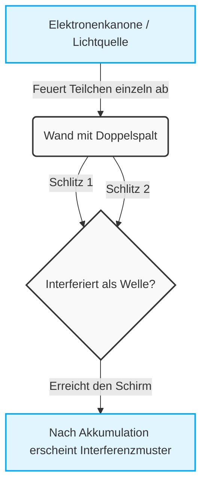
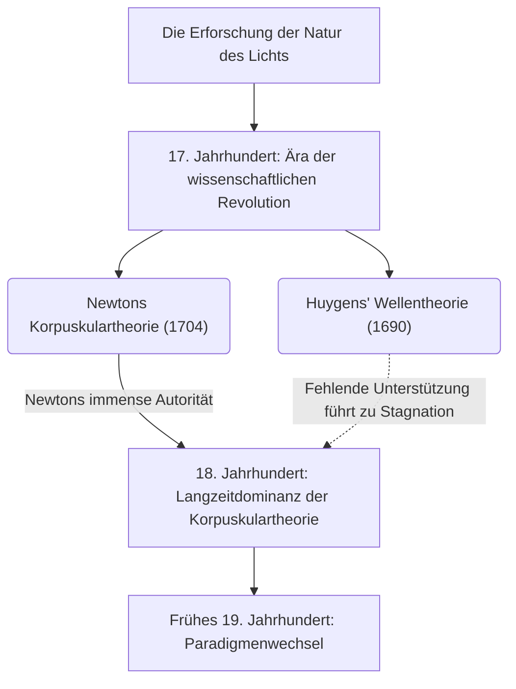
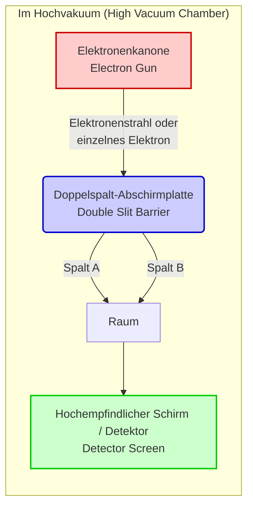

---
title: '[Umfassender Leitfaden] Das größte Rätsel der Quantenmechanik, das „Doppelspaltexperiment“, leicht verständlich und detailliert erklärt'
slug: "double-slit-experiment-ultimate-guide"
date: "2026-09-08T01:00:00+09:00"
tags: ["Physik", "Quantenmechanik", "Doppelspaltexperiment", "Schrödinger-Gleichung"]
categories: ["Physik/Wissenschaft"]
math: true
mermaid: true
image: "cover.webp"
description: 'Wir erklären detailliert das sogenannte schönste Experiment in der Geschichte der Physik, das „Doppelspaltexperiment“. Die Anomalien der Mikrowelt, in der der gesunde Menschenverstand der Makrowelt nicht gilt, und die tiefen Geheimnisse der Quantenmechanik sind auch für Anfänger leicht verständlich zusammengefasst.'
---
## 1. 【Einführung】Was ist das Doppelspaltexperiment?

Unsere Welt scheint von festen Regeln beherrscht zu werden. Ein geworfener Ball fällt in einer Parabel, und wenn man einen Stein ins Wasser wirft, breiten sich Wellen aus. Dies ist der gesunde Menschenverstand der „Makrowelt“, wie sie von der klassischen Physik, einschließlich der Newtonschen Mechanik, beschrieben wird, und stimmt vollkommen mit unserer Intuition überein. Sobald man jedoch die „Mikrowelt“ betritt, also in die ultimativ kleinsten Bausteine der Materie wie Atome, Elektronen oder Lichtteilchen (Photonen), bricht dieser gesunde Menschenverstand krachend zusammen. Es ist ein Bereich, der von extrem seltsamen und unerklärlichen Regeln beherrscht wird, in dem unsere alltäglichen Sinne und Intuitionen überhaupt nicht mehr gelten.

Was uns die Anomalie dieser Mikrowelt in der einfachsten und schockierendsten Form vor Augen führt, ist das „Doppelspaltexperiment“ (Double-slit experiment). Richard Feynman, ein geniales Genie der Physik des 20. Jahrhunderts, sagte über dieses Experiment, es sei „das einzige Rätsel der Quantenmechanik“ und bemerkte weiter: „In diesem Experiment stecken alle Mysterien der Quantenmechanik“. Viele berühmte Physiker hören nicht auf, dieses Experiment als „das schönste Experiment in der Geschichte der Physik“ zu bezeichnen. Aber warum wird ein so einfaches Experiment, das nur aus zwei Schlitzen in einer Platte besteht, so besonders behandelt und fasziniert die Wissenschaftler weiterhin so sehr?

### Die Makro- und Mikrowelt im Widerspruch zur Intuition

Stellen wir uns zunächst ein Phänomen in der Makrowelt vor, in der unsere Intuition genau funktioniert.
Nehmen wir zum Beispiel an, es gäbe eine Maschine, die kleine, mit Farbe bestrichene Bälle (oder auch Maschinengewehrkugeln) nacheinander gegen eine Wand feuert. Davor befindet sich eine Eisenplatte mit zwei schmalen vertikalen Schlitzen. Wenn man Bälle zufällig abfeuert, treffen nur die Bälle, die durch einen der beiden Schlitze fliegen, auf die hintere Wand und hinterlassen einen Tintenabdruck. Als Ergebnis sollten zwei „vertikale Linien“ auf der Wand erscheinen, die dieselbe Form wie die beiden Schlitze davor haben. Dies ist das Verhalten als „Teilchen“ mit einer klaren Flugbahn, und es ist ein natürliches Ergebnis, das jeder intuitiv erwarten würde.

Als Nächstes wollen wir den Fall einer „Welle“ betrachten. Stellen Sie sich eine Trennwand mit zwei Schlitzen in einem Wassertank vor und erzeugen Sie von einer Seite aus Wellen. Wenn die Welle die beiden Schlitze erreicht, geht sie durch sie hindurch und breitet sich als zwei halbkreisförmige Wellen weiter nach hinten aus, wobei jeder Schlitz als neue Wellenquelle dient. Wenn diese beiden Wellen aufeinander treffen, entsteht ein Phänomen, das „Interferenz“ genannt wird. An Stellen, wo Wellenberg auf Wellenberg trifft, entsteht eine höhere Welle, und wo Wellenberg und Wellental aufeinander treffen, löschen sie sich gegenseitig aus und werden flach. Infolgedessen bildet sich auf der hinteren Wand (oder dem Ufer) ein schönes Streifenmuster, das „Interferenzmuster“ genannt wird, bei dem sich Orte abwechseln, an denen die Welle stark trifft und solche, an denen sie überhaupt nicht trifft. Dies ist ebenfalls eine grundlegende Eigenschaft von Wellen, die man im Alltag bei Wasseroberflächen, Schallwellen usw. beobachten kann.

Bis hierhin gibt es absolut nichts Mysteriöses. Wirft man Teilchen, entstehen „zwei Linien“, sendet man Wellen, entsteht ein „Interferenzmuster“. Das ist der gesunde Menschenverstand der Welt, in der wir leben, und die Prämisse der klassischen Physik.

### Überblick über das Experiment und der Grund, warum es „das schönste Experiment“ genannt wird

Führt man jedoch dasselbe Experiment mit mikroskopischen Entitäten wie Licht oder Elektronen durch, ändert sich die Situation schlagartig und die menschliche Intuition wird völlig betrogen.
Ein Blick in die Geschichte zeigt, dass der britische Physiker Thomas Young im Jahr 1801 dieses Doppelspaltexperiment erstmals mit Sonnenlicht durchführte (Youngsches Doppelspaltexperiment). Damals war die von Newton vorgeschlagene Theorie, dass Licht aus „Teilchen“ bestehe, weit verbreitet. Aber als Ergebnis von Youngs Experiment erschien ein wunderschönes „Interferenzmuster“ auf dem Schirm. Dies lieferte den entscheidenden Beweis dafür, dass „Licht eine Welle ist“, und der langjährige Streit schien vorerst beigelegt zu sein.

Das wahre Mysterium und der größte Paradigmenwechsel in der Physik beginnen genau hier. Im 20. Jahrhundert ermöglichten phänomenale Fortschritte in der Experimentiertechnik das Abfeuern von Licht und Elektronen „eines nach dem anderen“. Das Elektron hat eine Masse und nimmt eine bestimmte Position im Raum ein, es ist zweifellos ein klares „Teilchen“. Ein einzelnes Elektron wird aus einer Elektronenkanone abgefeuert, durchläuft den Doppelspalt und trifft irgendwo auf dem Schirm als einzelner Punkt (Lichtpunkt) ein. Zu diesem Zeitpunkt verhält sich das Elektron zweifellos wie ein Teilchen, was die Spuren seines Einschlags auf dem Schirm zeigen.
Und dieses „Abfeuern von Elektronen eins nach dem anderen“ wird Tausende, Zehntausende Male, also unzählige Male, wiederholt. Da Elektronen immer nur einzeln fliegen, ist es physikalisch unmöglich, dass sie in der Luft mit anderen Elektronen zusammenstoßen und wie Wellen interferieren. Natürlich dachte jeder, dass auf dem Schirm, genau wie beim Werfen von Bällen, „zwei Linien“ entsprechend der Form der Schlitze erscheinen sollten.

Doch während sich unzählige Elektronenpunkte auf dem Schirm ansammelten, tauchte ein unglaubliches Muster auf. Es war das „Interferenzmuster“, das eigentlich nur entstehen sollte, wenn Wellen aufeinandertreffen.

Die Elektronen, die als „Teilchen“ einzeln abgefeuert worden sein sollten, verhalten sich als Ganzes irgendwie wie eine „Welle“, interferieren mit sich selbst und erzeugen ein Streifenmuster. Was um alles in der Welt hat das zu bedeuten? Es ist so, als ob ein einzelnes abgefeuertes Elektron sich wie eine Welle im Raum ausbreitet, gleichzeitig durch beide Schlitze geht, Selbstinterferenz verursacht und in dem Moment, in dem es auf den Schirm trifft, wieder als einzelnes Teilchen in Erscheinung tritt.
Noch seltsamer ist, dass in dem Moment, als Wissenschaftler ein Beobachtungsgerät (eine Art Kamera) neben die Schlitze stellten, um festzustellen, „durch welchen Schlitz das Elektron gegangen ist“, das Elektron plötzlich seine wellenartigen Eigenschaften verlor und auf dem Schirm kein Interferenzmuster, sondern nur noch „zwei Linien“ erschienen. Dieses Phänomen, sein Verhalten zu ändern, wenn es „beobachtet wird“, hat die Physiker in noch größere Verwirrung gestürzt.

Der Hauptgrund, warum das Doppelspaltexperiment als „das schönste Experiment in der Physik“ bezeichnet wird, ist, dass es die fundamentalen Rätsel des Universums offenbart, ohne dass riesige Teilchenbeschleuniger oder extrem schwierige mathematische Formeln erforderlich sind – mit nur einem sehr einfachen und eleganten Aufbau aus zwei Schlitzen und einem Schirm. Es führt uns visuell und lebhaft den Moment vor Augen, in dem der gesunde Menschenverstand der Makrowelt brillant zusammenbricht. Es geht über die bloße Bestätigung physikalischer Phänomene hinaus und wirft uns weiterhin tiefgreifende philosophische und erkenntnistheoretische Fragen auf: „Was ist Realität?“ und „Existiert diese Welt, die wir ‚sehen‘, wirklich objektiv?“. In diesem einzigen, simplen Experiment sind die Grenzen der menschlichen Intelligenz und die unendliche Romantik der Wissenschaft, die versucht, diese zu überwinden, komprimiert.

## 2. 【Geschichte】Ist Licht eine Welle oder ein Teilchen? Die Spur einer endlosen Debatte

Seit die Menschheit die Existenz von „Licht“ erkannt hat, hörte die Erforschung seiner wahren Natur niemals auf. Seit der Zeit des antiken Griechenlands haben Philosophen und Mathematiker wie Empedokles und Euklid über die Mechanismen des Lichts und des Sehens nachgedacht, aber ein ernsthafter Ansatz im Sinne der modernen Wissenschaft begann erst im 17. Jahrhundert. Die Debatte „Ist Licht ein Teilchen oder eine Welle?“, die in dieser Ära begann, spaltete die Welt der Physik für mehr als 300 Jahre und wurde schließlich zur treibenden Kraft, um die Tür zu einer völlig neuen Physik – der Quantenmechanik – zu öffnen. In diesem Abschnitt werden wir die Spur dieser epischen Wissenschaftsgeschichte im Detail verfolgen.

### 2.1 Newtons Korpuskulartheorie vs. Huygens' Wellentheorie: Der Zusammenstoß im 17. Jahrhundert

In der zweiten Hälfte des 17. Jahrhunderts, inmitten der wissenschaftlichen Revolution, wurden zwei starke Theorien über die Natur des Lichts vorgelegt. Dies waren die „Teilchentheorie (Korpuskulartheorie: Corpuscular theory)“ von Isaac Newton und die „Wellentheorie (Wave theory)“ von Christiaan Huygens.

#### Newtons Korpuskulartheorie

Isaac Newton, der Gigant der modernen Physik, der unter anderem für das Gravitationsgesetz bekannt ist, dachte, dass Licht eine Ansammlung extrem kleiner Teilchen (Korpuskeln) sei. In seinem Aufsatz von 1672 und in seinem Hauptwerk „Opticks“ von 1704 erklärte Newton die gradlinige Ausbreitung des Lichts und das Gesetz der Reflexion an einem Spiegel anschaulich mit einem mechanischen Modell, bei dem Teilchen von einer Wand abprallen. Was das Phänomen betrifft, bei dem weißes Licht durch ein Prisma in sieben Farben zerlegt wird (Spektroskopie), argumentierte er auch, dass Licht unterschiedlicher Farben aus Teilchen unterschiedlicher Masse bestehe und daher der Brechungsindex beim Durchgang durch ein Medium unterschiedlich sei.
Newton wandte sich gegen die Wellentheorie, indem er darauf hinwies: „Wenn Licht eine Welle wie der Schall wäre, sollte es um die Rückseite von Hindernissen herumgehen (Beugungsphänomen), aber Licht breitet sich geradlinig aus und wirft klare Schatten.“ So lehnte er es ab, dass es eine Welle sei.

#### Huygens' Wellentheorie

Andererseits argumentierte der brillante niederländische Physiker Christiaan Huygens in seiner 1690 veröffentlichten „Abhandlung über das Licht“ (Treatise on Light), dass Licht eine Welle (Longitudinalwelle) sei, die sich durch ein elastisches Medium namens „Äther“ ausbreitet, das den Weltraum füllt. Huygens schlug das berühmte „Huygenssche Prinzip“ (Huygens' Principle) vor, das besagt: „Jeder Punkt auf einer Wellenfront wird zur Quelle einer neuen Sekundärwelle“, und erklärte geometrisch meisterhaft die Gesetze der gradlinigen Ausbreitung, der Reflexion und der Brechung von Licht.
Besonders in Bezug auf die Brechung sagte Newton voraus, dass „wenn Licht in ein dichtes Medium wie Wasser oder Glas eintritt, werden die Teilchen von Gravitation angezogen und beschleunigt, wodurch die Lichtgeschwindigkeit steigt“. Huygens' Wellentheorie kam jedoch zu dem Schluss, dass „in einem dichten Medium die Ausbreitungsgeschwindigkeit der Welle langsamer wird“, womit die beiden in direktem Konflikt standen.

Aufgrund von Newtons absoluter Autorität und Einfluss in der damaligen wissenschaftlichen Gemeinschaft geriet Huygens' Wellentheorie jedoch allmählich in den Hintergrund, und Newtons Korpuskulartheorie herrschte im gesamten 18. Jahrhundert als die vorherrschende Theorie vor.

## 2.2 Thomas Youngs Doppelspaltexperiment mit Licht (1801) und der Triumph der Wellentheorie

Zu Beginn des 19. Jahrhunderts ereignete sich etwas Entscheidendes, das die langjährige Vorherrschaft der Teilchentheorie ins Wanken brachte. Die Hauptfigur dabei war der britische Universalgelehrte Thomas Young. Young, der Arzt war und auch zur Entzifferung der ägyptischen Hieroglyphen (Stein von Rosetta) beitrug, führte 1801 ein Experiment durch, das in der Geschichte der Physik hell erstrahlt. Dies war „Youngs Interferenzexperiment (das spätere Doppelspaltexperiment)“.

#### Entdeckung der Interferenzstreifen
Youngs Versuchsaufbau war extrem einfach und doch genial. Er ließ Sonnenlicht durch ein winziges Loch (oder einen Spalt) fallen, um eine Punktlichtquelle zu erzeugen, und ließ dieses Licht dann durch zwei sehr feine, dicht beieinander liegende Spalte (Doppelspalt) auf einen dahinter liegenden Schirm projizieren.
Wenn Licht ein reines „Teilchen“ im Sinne Newtons wäre, müssten auf dem Schirm zwei helle Linien erscheinen, die der Form der Spalte entsprechen. Was Young jedoch auf dem Schirm sah, war ein Muster aus abwechselnd hellen und dunklen Streifen, nämlich „Interferenzstreifen (Interference fringes)“.

Dieses Phänomen ließ sich unmöglich erklären, ohne Licht als Welle zu betrachten. Wenn zwei Wellen auf einer Wasseroberfläche aufeinandertreffen, werden die Stellen, an denen Wellenberge aufeinandertreffen, höher (konstruktive Interferenz), und die Stellen, an denen Berge und Täler aufeinandertreffen, heben sich gegenseitig auf und werden flach (destruktive Interferenz). Young kam zu dem Schluss, dass die Lichtwellen aus den beiden Spalten genau wie diese Wasserwellen interferierten.

#### Mathematische Untermauerung und die Etablierung der Wellentheorie
Die Bedingungen für diese konstruktive und destruktive Interferenz werden durch die Differenz der Weglängen (Gangunterschied $\Delta L$) von den beiden Spalten zu einem Punkt auf dem Schirm bestimmt. Wenn der Spaltabstand $d$, der Winkel zum Schirm $\theta$ und die Wellenlänge des Lichts $\lambda$ ist, lässt sich der Gangunterschied wie folgt ausdrücken:

$$ \Delta L = d \sin \theta $$

* **Helle Linien (konstruktive Interferenz)**: $\Delta L = m\lambda \quad (m = 0, \pm1, \pm2, \dots)$
* **Dunkle Linien (destruktive Interferenz)**: $\Delta L = \left(m + \frac{1}{2}\right)\lambda$

Youngs Veröffentlichung stieß anfangs im Vereinigten Königreich auf heftige Kritik und Spott seitens der Anhänger Newtons. Doch 1815 formulierte der Franzose Augustin-Jean Fresnel die Beugung und Interferenz des Lichts als strenge mathematische Theorie. Bei einem Wettbewerb der Französischen Akademie der Wissenschaften im Jahr 1818 wies der Juror Siméon Denis Poisson (ein Gegner der Wellentheorie) darauf hin: „Wenn Fresnels Theorie richtig wäre, müsste in der Mitte des Schattens eines kreisförmigen Hindernisses ein heller Fleck entstehen. So etwas Absurdes ist unmöglich.“ Doch als Dominique-François-Jean Arago das Experiment tatsächlich durchführte und diesen „Poisson-Fleck (Arago-Fleck)“ perfekt beobachtete, wurde die Richtigkeit der Wellentheorie unbestreitbar.

Im Jahr 1850 bewiesen Léon Foucault und andere experimentell, dass die Lichtgeschwindigkeit im Wasser langsamer ist als in der Luft, was Newtons Vorhersage vollständig widerlegte. Und 1864 etablierte James Clerk Maxwell als Krönung des Elektromagnetismus die Theorie, dass „Licht eine Art elektromagnetische Welle ist“. Damit errang die „Wellentheorie“ des Lichts einen vollständigen Sieg, und der Streit schien beigelegt.

### 2.3 Die Wiederbelebung der Teilchentheorie durch Einsteins Lichtquantenhypothese (1905)

Maxwells Theorie, dass Licht eine elektromagnetische Welle ist, war so elegant, dass die Physiker Ende des 19. Jahrhunderts glaubten: „Die Physik ist nahezu vollendet, wir müssen nur noch detaillierte Zahlenwerte messen.“ Vom Ende des 19. bis zum Anfang des 20. Jahrhunderts stieß man jedoch auf ein seltsames Phänomen, das durch die Wellentheorie absolut nicht erklärt werden konnte. Es handelte sich um den „Photoelektrischen Effekt (Photoelectric effect)“.

#### Das Rätsel des photoelektrischen Effekts
Der photoelektrische Effekt ist ein Phänomen, bei dem Elektronen (Photoelektronen) aus einem Metall herausgeschleudert werden, wenn Licht auf dessen Oberfläche trifft. Nach dem damaligen gesunden Menschenverstand der Wellentheorie sollte die Energie des Lichts (der Welle) proportional zu seiner Amplitude (Helligkeit) sein. Daher nahm man an: „Wenn man starkes (helles) Licht einstrahlt, sollten Elektronen bei jeder Lichtfarbe kräftig herausgeschleudert werden.“
Die experimentellen Ergebnisse widerlegten jedoch die Vorhersagen der Wellentheorie völlig.

1. **Die Existenz einer Grenzfrequenz**: Bei Licht mit einer niedrigeren als einer bestimmten Frequenz (Farbe) – zum Beispiel rotem Licht – wurden überhaupt keine Elektronen herausgeschleudert, egal wie stark (hell) oder wie lange man es einstrahlte.
2. **Unmittelbarkeit**: Umgekehrt wurden bei Licht oberhalb der Grenzfrequenz (zum Beispiel ultraviolettem Licht) Elektronen sofort im Moment der Bestrahlung herausgeschleudert, unabhängig davon, wie schwach das Licht war.
3. **Energieabhängigkeit**: Die kinetische Energie der herausgeschleuderten Elektronen hing ausschließlich von der Frequenz (Farbe) des Lichts ab und nicht von der Intensität (Helligkeit) des Lichts.

#### Einsteins dramatische Lösung: Das Lichtquant (Photon)
Dieses hoffnungslose Rätsel wurde von einem unbekannten jungen Mann entschlüsselt, der im Schweizer Patentamt arbeitete: Albert Einstein. Im Jahr 1905, seinem sogenannten „Wunderjahr“, wandte er die von Max Planck in seinen Studien zur Wärmestrahlung (1900) aufgestellte „Energiequantenhypothese“ auf das Licht selbst an und veröffentlichte die „Lichtquantenhypothese (Light quantum hypothesis)“.

Einstein nahm kühn an, dass Licht, das als kontinuierliche Welle betrachtet wurde, eine Ansammlung von Energiepaketen ist, das heißt, von Teilchen namens „Lichtquanten (Photonen)“. Die Energie $E$ eines einzigen Lichtquants ist proportional zur Frequenz $\nu$ des Lichts und wird durch die folgende Planck-Einstein-Gleichung ausgedrückt:

$$ E = h\nu $$
(Wobei $h$ das Plancksche Wirkungsquantum ist, $6.626 \times 10^{-34} \, \text{J}\cdot\text{s}$)

Mit dieser Hypothese ließ sich das Rätsel des photoelektrischen Effekts wie durch Magie lösen.
Der photoelektrische Effekt war ein billardähnliches Phänomen, bei dem „ein Lichtquant“ mit „einem Elektron“ im Metall kollidierte und seine gesamte Energie übertrug. Wenn die Mindestenergie, die das Elektron benötigt, um sich von der Bindung des Metalls zu befreien, als „Austrittsarbeit ($W$)“ bezeichnet wird, wird die maximale kinetische Energie $E_k$ des herausgeschleuderten Elektrons durch die folgende brillante Gleichung dargestellt:

$$ E_k = h\nu - W $$

Wenn die Energie des Lichtquants $h\nu$ kleiner ist als die Austrittsarbeit $W$ (niederfrequentes Licht), kann das Elektron das Metall nicht verlassen, egal wie viele Lichtquanten darauf prallen (wie stark das Licht gemacht wird). Dies ist der Grund für die Grenzfrequenz.

#### In eine rätselhafte Welt, die „sowohl Welle als auch Teilchen ist“
Einsteins Lichtquantenhypothese wurde 1914 durch die präzisen Experimente von Robert Millikan vollständig bewiesen, und Einstein erhielt für diese Leistung 1921 den Nobelpreis für Physik. (Millikan selbst glaubte anfangs nicht an Einsteins Theorie und führte seine Experimente durch, um sie zu widerlegen, was ironischerweise genau zu ihrem Beweis führte). Im Jahr 1923 entdeckte Arthur Compton darüber hinaus die „Compton-Streuung“, bei der sich die Wellenlänge von Röntgenstrahlen bei der Kollision mit Elektronen ändert, was die Gewissheit erbrachte, dass sich Licht als „Teilchen“ mit dem Impuls $p = \frac{h}{\lambda}$ verhält.

Die „Teilchentheorie“, die durch Youngs Experiment vollständig besiegt schien, feierte nach 100 Jahren eine wundersame Wiederauferstehung in der raffinierteren Form der „Quanten“.
Dies führte jedoch zu einem schwerwiegenden Widerspruch. Das Licht besitzt eindeutig Welleneigenschaften wie die „Interferenz“, die Young in seinem Doppelspaltexperiment zeigte, und gleichzeitig Teilcheneigenschaften, wie sie im photoelektrischen Effekt zutage traten.

Ist Licht nun eine Welle oder ein Teilchen?
Die letztendliche Antwort der Physik auf diese Frage widersprach der menschlichen Intuition vehement: „Licht ist beides und keines von beiden. Licht ist eine quantenmechanische Entität, die sowohl 'Welleneigenschaften' als auch 'Teilcheneigenschaften' besitzt.“ Dies war die Geburtsstunde des „Welle-Teilchen-Dualismus (Wave-particle duality)“.
Dieses Konzept der Dualität wurde bald nicht nur auf Licht, sondern auch auf Materie selbst, wie etwa Elektronen, angewendet (De-Broglie-Materiewellen). Die Physik betrat einen beispiellosen Abgrund, die seltsame und faszinierende Welt der „Quantenmechanik“. Die symbolträchtigste Bühne dafür ist das „quantenmechanische Doppelspaltexperiment“, aktualisiert für die moderne Ära.

## 3. [Wende] Ist auch Materie eine Welle? De-Broglie-Wellen und das Doppelspaltexperiment mit Elektronen

Durch Einsteins Lichtquantenhypothese (1905), wonach Licht „sowohl Welle als auch Teilchen ist“, befand sich die Welt der Physik im Strudel großer Verwirrung und eines Paradigmenwechsels. Obwohl aufgrund von Youngs Interferenzexperiment und Maxwells Elektromagnetismus lange Zeit geglaubt wurde, dass „Licht absolut eine Welle ist“, ließen sich Phänomene wie der photoelektrische Effekt nur erklären, wenn man Licht als „Teilchen (Photon)“ betrachtete. Diese seltsame Eigenschaft des „Welle-Teilchen-Dualismus“ wurde zunächst als eine einzigartige Eigenschaft angesehen, die nur dem Licht vorbehalten war. In den 1920er Jahren sollte dieses Konzept der Dualität jedoch die Grenzen der Lichtwelt überschreiten und seine Zähne in die „Materie“ selbst schlagen, aus der unsere Körper bestehen.

### 3.1. Louis de Broglies Vorschlag der Materiewellen: Ein Sprung aus schöner Symmetrie

Im Jahr 1924 stellte der junge französische Doktorand Louis de Broglie in seiner Dissertation eine äußerst kühne Hypothese auf, die die Geschichte der Physik grundlegend auf den Kopf stellen sollte. Sie lautete: „Wenn Licht (das als Welle betrachtet wurde) Teilcheneigenschaften besitzt, könnten dann nicht umgekehrt auch Materieteilchen wie Elektronen (die als Teilchen betrachtet wurden) Welleneigenschaften besitzen?“

De Broglies philosophische Intuition, dass die Natur stets Symmetrie bevorzugt, lag dieser Hypothese zugrunde. Er wendete die Gleichungen für Energie und Impuls, die Einstein in der speziellen Relativitätstheorie und der Lichtquantenhypothese abgeleitet hatte, auf Materieteilchen mit Masse an. Der Impuls $p$ eines Photons wird mithilfe des Planckschen Wirkungsquantums $h$ und der Wellenlänge $\lambda$ als $p = h / \lambda$ ausgedrückt. De Broglie kehrte dies um und drückte die Wellenlänge $\lambda$ der Welle, die ein Teilchen mit der Masse $m$ und der Geschwindigkeit $v$ (Impuls $p = mv$) begleitet, in einer sehr einfachen Formel wie folgt aus:

$$ \lambda = \frac{h}{p} = \frac{h}{mv} $$

Dies ist die berühmte Formel für die „De-Broglie-Wellenlänge (Wellenlänge der Materiewelle)“. Diese Formel bedeutet, dass alles, was sich bewegt, von Basebällen und Autos, die wir im Alltag sehen, bis hin zu winzigen Elektronen, „Wellen“-Eigenschaften besitzt. Warum sehen wir dann im Alltag nicht, wie ein Baseball wie eine Welle interferiert oder gebeugt wird? Das liegt daran, dass das Plancksche Wirkungsquantum $h$ (ca. $6.626 \times 10^{-34} \text{ J}\cdot\text{s}$) extrem klein ist. Bei makroskopischen Objekten ist die Masse $m$ so groß, dass die De-Broglie-Wellenlänge $\lambda$ so winzig wird, dass sie praktisch als Null angesehen werden kann und die Welleneigenschaften vollständig verborgen bleiben. In der Welt der Elektronen jedoch, deren Masse extrem gering ist, nimmt diese Wellenlänge eine Größenordnung an, die der von Röntgenstrahlen (elektromagnetischen Wellen) entspricht (etwa $0.1 \text{ nm}$), und tritt als eine Größe in Erscheinung, die keinesfalls ignoriert werden kann.

Da de Broglies Dissertation so weit vom gesunden Menschenverstand entfernt war, verwirrte sie die damaligen Juroren sehr. Als jedoch einer der Juroren, Paul Langevin, diese Arbeit an Einstein schickte, lobte dieser sie in den höchsten Tönen: „Er hat einen Zipfel des großen Schleiers gelüftet.“ Infolgedessen erregte de Broglies Konzept der „Materiewelle (matter wave)“ weltweite Aufmerksamkeit und führte direkt zur späteren Vollendung der Wellenmechanik durch Schrödinger.

### 3.2. Das Davisson-Germer-Experiment: Der Beweis für die Welleneigenschaften der Materie

De Broglies Hypothese war zwar als Theorie wunderschön, musste jedoch durch Experimente bewiesen werden, um zu klären, ob sie die tatsächliche Natur beschrieb. „Wenn das Elektron wirklich eine Welle ist, muss es Phänomene wie ‚Beugung‘ und ‚Interferenz‘ zeigen, die für Wellen charakteristisch sind.“ Mit dieser Überzeugung begannen Physiker auf der ganzen Welt mit Experimenten, um die Welleneigenschaften von Elektronen zu erfassen.

Und im Jahr 1927 wurde schließlich der entscheidende Beweis erbracht. Es war das „Davisson-Germer-Experiment“ der Physiker Clinton Davisson und Lester Germer von den amerikanischen Bell Laboratories.

Ursprünglich hatten sie das Experiment zu einem anderen Zweck durchgeführt: Sie wollten das Streuverhalten von Elektronenstrahlen auf einem Nickelkristall untersuchen. Um jedoch einen Unfall während des Experiments zu beheben (Oxidation der Nickeloberfläche durch Bruch der Vakuumröhre), erhitzten sie das Nickel auf hohe Temperaturen und hatten das Glück, dass das Nickel versehentlich einkristallin wurde. Als sie diesen einkristallinen Nickel erneut mit einem Elektronenstrahl beschossen, wurde ein erstaunliches Phänomen beobachtet. Die Intensität der gestreuten Elektronen zeigte ein deutliches „Beugungsmuster“ mit Maxima bei bestimmten Winkeln.

Der Abstand, in dem die Atome im Kristall regelmäßig angeordnet sind (Gitterkonstante), liegt ungefähr in derselben Größenordnung wie die De-Broglie-Wellenlänge des Elektrons. Mit anderen Worten: Der Nickelkristall selbst fungierte als „natürliches Beugungsgitter“ für die Elektronen. Als Davisson und Germer die Wellenlänge des Elektrons aus diesem Beugungsmuster zurückberechneten, stimmte das Ergebnis perfekt mit dem durch de Broglies Formel $\lambda = h/p$ vorhergesagten Wert überein. Im selben Jahr gelang es auch dem Briten George Paget Thomson (Sohn des Elektronen-Entdeckers J.J. Thomson), durch Elektronenstrahlen, die eine dünne Metallfolie durchdrangen, Beugungsringe (Debye-Scherrer-Ringe) zu beobachten.

Diese experimentellen Ergebnisse präsentierten der physikalischen Gemeinschaft die unbestreitbare Tatsache, dass Materie Welleneigenschaften besitzt. Das Elektron, das ein Teilchen sein sollte, verhält sich wie eine Welle. Dies war der Moment, in dem diese profunde Wahrheit der Natur enthüllt wurde, und es war gleichzeitig die Fanfare, die den Beginn der Quantenmechanik ankündigte. De Broglie erhielt 1929 den Nobelpreis für Physik, Davisson und Thomson folgten im Jahr 1937.

### 3.3. Das bahnbrechende Doppelspaltexperiment von Hitachi (Akira Tonomura et al.) (1989)

Auch nachdem bewiesen war, dass das Elektron eine Welle ist, hörten die Untersuchungen der Physiker nicht auf. Es war der Versuch, das als Gedankenexperiment diskutierte „Doppelspaltexperiment mit Elektronen“ in die Realität umzusetzen, und zwar mit extremer Präzision.

Genau wie bei Youngs Doppelspaltexperiment mit Licht sollten auf dem dahinter liegenden Schirm Interferenzstreifen erscheinen, wenn man Elektronen auf einen Doppelspalt abschießt. Doch hier taucht das rätselhafteste Paradoxon der Quantenmechanik auf: „Was passiert, wenn man Elektronen nicht alle auf einmal, sondern **einzeln nacheinander** abschießt?“

Ein einzelnes Elektron ist ein unteilbares Teilchen. Es sollte daher in der Lage sein, nur den linken oder den rechten Spalt zu durchdringen, aber nicht beide. Ein Elektron, das den Schirm einzeln erreicht, hinterlässt nur einen einzigen Leuchtpunkt auf dem Schirm. Wenn dies zehntausende Male wiederholt wird, wird dann die Ansammlung dieser Punkte einfach ein Schatten der beiden Spalte (zwei Linien) sein, oder wird sie zu einem Interferenzmuster, das Welleneigenschaften zeigt?

Die Antwort auf diese ultimative Frage lieferte auf weltweit schönste und perfekteste Weise das Forschungsteam des Advanced Research Laboratory von Hitachi in Japan (Dr. Akira Tonomura et al.), indem sie technologische Grenzen überwanden. 1989 nutzten sie die Elektronenstrahl-Holographie sowie Ultrahochvakuum- und Tieftemperatur-Elektronenmikroskopie, um ein „Einzel-Elektronen-Biprisma-Interferenzexperiment“ erfolgreich durchzuführen.

Der Versuchsaufbau war phänomenal. Sie reduzierten die Anzahl der aus der Elektronenkanone emittierten Elektronen auf das Äußerste und schufen einen Zustand, in dem „sich immer nur ein einziges Elektron in der Apparatur befand“, während das Elektron durch den Raum flog. Die Geschwindigkeit der Elektronen erreichte etwa 150.000 Kilometer pro Sekunde, und die Zeit, die benötigt wurde, um die Entfernung von der Lichtquelle zum Detektor zurückzulegen, war nur ein winziger Sekundenbruchteil. Das nächste Elektron wurde erst lange nach der Ankunft des vorherigen Elektrons auf dem Schirm abgefeuert.

Als das Experiment begann, erschienen nach und nach Leuchtpunkte auf dem Detektor (Monitor), die die Ankunft von Elektronen anzeigten. In der Phase der ersten paar oder hundert Elektronen schienen die Punkte nur zufällig auf dem Bildschirm verstreut zu sein. Wie bei den Sternen am Nachthimmel schien es dort keinerlei Ordnung zu geben.

Doch als sich tausende, zehntausende von Elektronen ansammelten, zeichnete sich ein für jedermann offensichtliches, verblüffendes Bild ab. Die Ansammlung scheinbar ungeordneter Punkte formte allmählich ein regelmäßiges Muster aus hellen und dunklen Streifen – ein unverkennbares „Interferenzmuster“.

Was dieses Ergebnis bedeutete, widersprach der Intuition radikal. Das Elektron erreichte den Schirm zweifellos als „ein einziges Teilchen“ (deshalb wurde auch nur ein einziger Punkt aufgezeichnet). Die Tatsache, dass sie insgesamt ein Interferenzmuster erzeugen, kann jedoch nur so interpretiert werden, dass dieses eine Elektron „als Welle beide Spalte (beide Seiten des Biprismas) gleichzeitig passierte und mit sich selbst interferierte“. Ein einzelnes Elektron, das mit niemandem interagiert, interferiert mit sich selbst. Dasselbe Prinzip, nach dem Dirac sagte, dass „ein Photon nur mit sich selbst interferiert“, wurde nun auch bei einem massebehafteten Materieteilchen, dem Elektron, perfekt nachgewiesen.

Dieses Experiment von Dr. Akira Tonomura und seinem Team wurde weltweit als der visuellste und direkteste Beweis für das Wunder der Quantenmechanik, den „Welle-Teilchen-Dualismus“, gefeiert. Es ist nur natürlich, dass dieses „Doppelspaltexperiment mit Elektronen“ bei einer Leserumfrage der britischen Wissenschaftszeitschrift „Physics World“ im Jahr 2002 zum „schönsten Experiment in der Geschichte der Physik“ gewählt wurde und stolz den ersten Platz belegte.

So offenbarte sich die Wahrheit von de Broglies abstruser Hypothese, dass „Materie eine Welle ist“, nach mehr als 60 Jahren in Form mysteriöser Interferenzmuster, die von einzelnen Elektronen gezeichnet wurden, direkt vor unseren Augen. Gleichzeitig öffnete dieses Experiment jedoch, während es das Rätsel der Quantenmechanik löste, die Tür zu einem noch tieferen Geheimnis: dem „Messproblem“. „Wenn man versucht zu beobachten, durch welchen Spalt das Elektron gegangen ist, verschwindet das Interferenzmuster“ – im nächsten Kapitel werden wir noch tiefer in den Abgrund dieser seltsamen Quantenwelt vordringen.
## 4. 【Experimentelle Methode und Ergebnisse】 Was genau passiert

(Um den Kern des Doppelspaltexperiments zu erforschen und in die Abgründe der Quantenmechanik zu blicken, konzentrieren wir uns hier auf ein Experiment mit „Elektronen“ anstelle von Licht. Ein ähnliches Phänomen wurde auch bei Photonen und anderen Elementarteilchen sowie bei relativ großen Molekülen wie Fullerenen bestätigt, aber durch die Verwendung von Elektronen, die eine Masse haben und die wir als „eindeutig materielle Teilchen“ erkennen, werden die Paradoxie und die Rätselhaftigkeit dieses Phänomens noch deutlicher.)

### 4.1 Aufbau des Experiments: Die Bühne zur Erfassung der mikroskopischen Welt

Lassen Sie uns zunächst im Detail betrachten, wie das Setup (die Bühne) für dieses historische und revolutionäre Experiment aussieht. Die konzeptionelle Struktur des Doppelspaltexperiments ist erstaunlich einfach, aber um es als physikalisches Experiment tatsächlich erfolgreich durchzuführen, sind fortschrittliche Technologie und eine extrem strenge Umgebungskontrolle im Hintergrund erforderlich.

Das Experimentiergerät besteht im Wesentlichen aus den folgenden drei Hauptkomponenten. Sie alle sind streng versiegelt in einer Hochvakuumkammer (Vakuumbehälter) untergebracht, um eine Streuung der Elektronen durch Kollisionen mit Luftmolekülen zu verhindern.

1. **Elektronenkanone (Electron Gun)**:
   Dies ist das Gerät zum Abfeuern der „Elektronen“, der Hauptakteure des Experiments. Unter Ausnutzung von Prinzipien wie dem Erhitzen eines Filaments zur Emission thermischer Elektronen oder der Verwendung eines starken elektrischen Feldes zum Herausziehen von Elektronen, feuert sie Elektronen mit einer bestimmten kinetischen Energie in eine festgelegte Richtung ab. In diesem Experiment ist es äußerst wichtig, dass es nicht nur möglich ist, Elektronen als starken „Strahl“ kontinuierlich wie einen Wasserfall abzufeuern, sondern erstaunlicherweise auch die Leistung auf das Äußerste zu reduzieren und sie kontrolliert „sicher einzeln nacheinander“ abzufeuern. Diese „Einzelelektronen-Schusstechnik“ ist eine der unverzichtbaren, hochpräzisen Techniken in modernen quantenmechanischen Experimenten.

2. **Doppelspalt (Double Slit)**:
   Dies ist eine Abschirmplatte (Wand) mit zwei sehr schmalen und extrem eng beieinander liegenden parallelen Schlitzen (Spalten), durch die die aus der Elektronenkanone abgefeuerten Elektronen hindurchtreten. Da die Wellenlänge der „Materiewelle (De-Broglie-Welle)“ des Elektrons sehr kurz ist, müssen auch die Breite dieser Schlitze und der Abstand zwischen ihnen extrem präzise in winzigen Größenordnungen von Nanometern (Milliardstel Metern) bis Mikrometern hergestellt werden. Wenn die Breite und der Abstand der Schlitze im Verhältnis zur Wellenlänge des Elektrons zu groß sind, kann die als wellenartige Eigenschaft auftretende „Interferenz“ nicht klar beobachtet werden. Die Technologie zur Herstellung dieses winzigen Doppelspalts selbst kann als Krönung der Mikrofabrikationstechnologie, wie etwa modernster Elektronenstrahllithographie-Systeme, bezeichnet werden.

3. **Schirm (Detektor, Screen / Detector)**:
   Dies ist der Beobachtungsschirm, auf den die Elektronen, die den Doppelspalt erfolgreich passiert haben, letztendlich treffen und auf dem ihre Positionen aufgezeichnet werden. In früheren Experimenten wurden lichtempfindliche fotografische Platten verwendet, aber heutzutage kommen hochempfindliche CCD-Kameras, fluoreszierende Bildschirme oder spezielle Halbleiter-Pixeldetektoren zum Einsatz. Dadurch ist es möglich, für jeden Schuss äußerst genau als zweidimensionale Koordinate aufzuzeichnen, „wo das Elektron angekommen ist (getroffen hat)“. Wenn ein Elektron auf den Schirm trifft, gibt es dort ein winziges Licht ab oder erzeugt ein elektrisches Signal und hinterlässt so eine eindeutige Spur (einen Punkt), dass es „zweifellos als ein einzelnes Teilchen hier angekommen ist“.

Das folgende Diagramm zeigt schematisch die Gesamtanordnung dieses Experimentiergeräts und die Flugbahn der Elektronen.

### 4.2 Wenn eine große Menge an Elektronen abgefeuert wird: Wellenartiges Verhalten, das die Intuition täuscht (Bildung von Interferenzmustern)

Nun beginnen wir endlich mit dem Experiment. Als ersten Schritt erhöhen wir die Leistung der Elektronenkanone und feuern „eine große Menge an Elektronen“ wie einen Schauer oder ein Maschinengewehr kontinuierlich und gleichzeitig auf den Doppelspalt ab.

Wenn wir mit dem gesunden Menschenverstand der klassischen Physik denken, den wir im Alltag haben, ist ein Elektron ein „Teilchen (so etwas wie ein kleines Projektil)“ mit einer Masse. Daher ist zu erwarten, dass zahlreiche Elektronen, die durch die beiden Schlitze hindurchgetreten sind, konzentriert an zwei Stellen auf dem Schirm kollidieren, die auf der Verlängerungslinie der geraden Richtung jedes Schlitzes liegen, und als Folge davon ein Muster wie „zwei vertikale Streifen“ bilden. Stellen Sie sich vor, Sie sprühen Farbe auf eine Schablonenplatte mit zwei Lücken. Die durch die Lücken strömende Farbe sollte gemäß der Form der Lücken zwei Linien auf die Wand zeichnen.

Das Muster, das jedoch tatsächlich auf dem Schirm erscheint, täuscht unsere Intuition und Vorhersagen völlig. Auf dem Schirm bilden sich nicht zwei einfache vertikale Streifen, sondern deutlich **mehrere helle und dunkle Streifenmuster (Interferenzmuster: Interference Pattern)**.

Dieses „Interferenzmuster“ weist exakt die gleichen geometrischen Merkmale auf wie das Muster, das entsteht, wenn sich die Wellen überlagern, die entstehen, wenn man gleichzeitig zwei Steine auf die Oberfläche eines Teiches wirft, oder wie das Muster, das bei optischen Interferenzexperimenten zu sehen ist.
- **An Orten, an denen sich Wellenberge mit Wellenbergen oder Wellentäler mit Wellentälern überschneiden (konstruktive Interferenz)**, entstehen „helle (hohe Kollisionsdichte von Elektronen)“ Streifen, an denen viele Elektronen ankommen.
- **An Orten, an denen sich Wellenberge und Wellentäler überschneiden (destruktive Interferenz)**, heben sich die Wellen gegenseitig auf, was zu „dunklen (Kollisionsdichte von Elektronen nahe Null)“ Streifen führt, an denen fast gar keine Elektronen ankommen.

Es gibt nur eine Schlussfolgerung aus diesem Ergebnis. Sie lautet: **„Das Elektron verhält sich wie eine Welle“**. Der Schwarm der aus der Elektronenkanone abgefeuerten Elektronen wandert wie eine Wasserwelle durch den Raum und passiert „gleichzeitig“ beide Schlitze. Und man kann es nur so interpretieren, dass die Welle, die vom Spalt A gebeugt wurde und sich ausgebreitet hat, und die Welle, die vom Spalt B gebeugt wurde und sich ausgebreitet hat, sich im Raum vor dem Schirm überlagern, was eine Interferenz verursacht und so dieses charakteristische helle und dunkle Streifenmuster erzeugt.

Ein Elektron, das fest für ein „Teilchen“ gehalten wurde, besitzt tatsächlich auch Eigenschaften als „Welle“ (Welle-Teilchen-Dualismus). Diese Tatsache allein ist eine historische große Entdeckung in der Physik und überraschend genug, aber das wahre Mysterium der Quantenmechanik und das Phänomen, das unseren gesunden Menschenverstand von Grund auf auf den Kopf stellt, geht von hier aus noch einen Schritt weiter.

### 4.3 Wenn Elektronen „einzeln“ abgefeuert werden: Die extreme Entdeckung der „Wahrscheinlichkeitswelle“

„Liegt es nicht einfach daran, dass wir eine große Menge von Elektronen gleichzeitig abschießen, sodass die Elektronen in der Luft miteinander kollidieren oder sich durch elektrische Kräfte (Coulomb-Kraft) gegenseitig abstoßen, was letztendlich nur ein wellenartiges Muster erzeugt?“
Dies ist eine sehr natürliche Frage für Wissenschaftler. Tatsächlich dachten viele Physiker, als die Interferenzmuster zum ersten Mal entdeckt wurden, auf diese Weise und versuchten, das Phänomen klassisch zu interpretieren.

Um diese Frage vollständig zu klären, wurden experimentelle Techniken weiterentwickelt und ein noch entscheidenderes Experiment durchgeführt. (In Japan ist das Experiment, das 1989 von der Gruppe um Akira Tonomura von Hitachi Ltd. durchgeführt wurde, sehr berühmt und wird als eines der schönsten Experimente der Welt gepriesen).
Dabei handelt es sich um ein Experiment, bei dem **die Leistung der Elektronenkanone bis zum Äußersten reduziert wird, um Elektronen „sicher einzeln“ abzufeuern**.

Konkret wird das nächste neue Elektron erst abgefeuert, nachdem bestätigt wurde, dass das vorherige Elektron abgefeuert wurde, den Schirm erreicht hat und vollständig verschwunden (oder absorbiert) ist. Dies wird zehntausendfach, hunderttausendfach mit einer unfassbaren Häufigkeit wiederholt. In dieser Konfiguration ist garantiert, dass sich im Raum innerhalb des Experimentiergeräts „immer nur ein einziges Elektron befindet“. Daher ist es physikalisch zu 100 % unmöglich, dass Elektronen in der Luft zusammenstoßen oder miteinander interferieren.

Verfolgen wir die experimentellen Ergebnisse mit einzelnen Elektronen in diesem extremen Zustand im Verlauf der Zeit (die Anzahl der angesammelten Elektronen).

**Schritt 1: Kurz nach Beginn des Experiments (Dutzende bis Hunderte von Elektronen)**
Auf dem Schirm werden hier und da Punkte an völlig zufälligen Positionen erzeugt. In dem Moment, in dem das Elektron den Schirm erreicht, zeigt es deutlich seine Eigenschaft als „einzelnes Teilchen“ und registriert einen einzelnen Punkt (Dot) an einer bestimmten mikroskopischen Koordinate. Zu diesem Zeitpunkt lässt sich in dem Muster auf dem Schirm keine Regelmäßigkeit erkennen, es sieht nur wie eine ungeordnete und zufällige Ansammlung von Punkten aus. Es ist so, als würde man mit verbundenen Augen blindlings Darts werfen.

**Schritt 2: Nachdem Tausende bis Zehntausende von Elektronen angekommen sind**
Mit der Zeit und der Wiederholung des Experiments beginnen sich seltsame Phänomene einzustellen, wenn sich Tausende bis Zehntausende von Punkten auf dem Schirm ansammeln. In der Verteilung der Punkte, die für völlig zufällig gehalten wurde, beginnen sich allmählich „Verzerrungen“ und „Schattierungen“ abzuzeichnen. Es bilden sich schwach Bereiche heraus, in denen Punkte dicht an dicht und in großer Zahl auftreffen, und Bereiche, in denen fast gar keine Punkte landen.

**Schritt 3: Am Ende des Experiments (nachdem Hunderttausende oder mehr Elektronen angekommen sind)**
Nachdem eine ausreichend lange Zeit vergangen ist und in mühseliger Arbeit eine riesige Anzahl (Hunderttausende bis Millionen) von Elektronen einzeln abgefeuert wurde, betrachtet man das kumulierte Bild des gesamten Schirms... und da taucht dasselbe wunderbare **„Interferenzmuster“** deutlich auf, wie wenn eine riesige Menge an Elektronen auf einmal abgefeuert wird!

Dies ist eines der schaurigsten, der Intuition am meisten widersprechenden, aber auch der schönsten und tiefgründigsten Ergebnisse in der Geschichte der Physik.

Denn die Elektronen wurden „vollständig einzeln“ abgefeuert. Eine Wechselwirkung mit vorherigen oder nachfolgenden Elektronen ist absolut unmöglich. Dennoch, die Tatsache, dass sich letztendlich ein Streifenmuster bildet, das eine Welleninterferenz anzeigt, lässt uns keine andere Wahl, als die unglaubliche Schlussfolgerung zu akzeptieren, dass **„ein einziges Elektron mit sich selbst interferiert“**.

Wenn wir versuchen, dieses Phänomen logisch zu erklären, bricht unser alltägliches Raum- und Materiegefühl völlig zusammen.
Ein einzelnes Elektron breitet sich, nachdem es aus der Elektronenkanone abgefeuert wurde, wie eine „Welle“ im gesamten Raum aus, **passiert „gleichzeitig“ sowohl den rechten als auch den linken Spalt**, interferiert vor dem Schirm mit „seiner eigenen Welle“ und schrumpft in dem Moment, in dem es den Schirm erreicht und beobachtet wird, wieder als „ein einzelnes Teilchen“ auf einen bestimmten Punkt zusammen (Kollaps).

Was also ist das eigentliche Wesen dieser „Welle“, die dieses einzige Elektron im Raum ausbreitet?
In der Quantenmechanik ist dies keine physische Welle, bei der ein materielles Medium wie die Wasseroberfläche oder die Luft wellt. Gemäß der von Max Born vorgeschlagenen Interpretation ist dies eine **„Welle, die die ‚Wahrscheinlichkeit‘ darstellt, dass das Elektron an einem bestimmten Ort in diesem Raum existiert (Wahrscheinlichkeitswelle)“**. Mathematisch wird dies „Wellenfunktion“ genannt.

Elektronen fliegen nicht in einer geraden Linie auf einer bestimmten Flugbahn (Route) wie ein Flipperball. Von dem Moment, in dem es abgefeuert wird, bis es den Schirm erreicht, breitet sich das Elektron im Raum als „überlagerter Zustand (Superposition)“ aus „dem Zustand, in dem es durch den rechten Spalt gegangen ist“ und „dem Zustand, in dem es durch den linken Spalt gegangen ist“, sowie „Zuständen, in denen es jeden Pfad im Raum genommen hat“, mit verschiedenen Wahrscheinlichkeiten aus.

Und in dem Moment, in dem es auf den Detektor namens Schirm trifft und gemessen wird, „wo es angekommen ist“, schrumpft die im Raum ausgebreitete Wahrscheinlichkeitswelle im Bruchteil einer Sekunde auf einen einzigen Punkt zusammen (Kollaps der Wellenfunktion), und zum ersten Mal wird die Position des realen Teilchens, das „hier war“, fixiert.

Die „hellen Teile (wo sich schließlich viele Punkte ansammeln)“ des Interferenzmusters sind Orte, an denen die Wahrscheinlichkeit für die Existenz des Elektrons durch Welleninterferenz erhöht wurde, und die „dunklen Teile (wo sich keine Punkte ansammeln)“ bedeuten Orte, an denen sich die Wahrscheinlichkeitswellen gegenseitig aufgehoben haben und null wurden. So wie sich die Wahrscheinlichkeit für jede Augenzahl beim mehrmaligen Werfen eines Würfels dem theoretischen Wert (1/6) nähert, tritt die Form der Wahrscheinlichkeitswelle (Interferenzmuster) als reales Muster auf dem Schirm auf, weil das „stochastische Verhalten“ der einzelnen Elektronen hunderttausendfach wiederholt wird.

„Ein einzelnes Elektron passiert zwei Schlitze gleichzeitig.“ „Bis zur Beobachtung ist sein Zustand nicht fixiert, und es existiert nur als eine Wahrscheinlichkeitswelle, in der unzählige Möglichkeiten überlagert sind.“
Die eiskalten experimentellen Fakten, mit denen uns dieses Doppelspaltexperiment konfrontiert, stellen uns vor eine tiefgründige philosophische Frage jenseits der Grenzen der Physik: „Was bedeutet es überhaupt zu existieren?“ und „Was zum Teufel ist die Realität, die wir wahrnehmen?“.

## 5. 【Das Messproblem】 Quanten, die ihr Verhalten ändern, wenn man sie beobachtet

Hier liegt der Kern des Grundes, warum das Doppelspaltexperiment in der Quantenmechanik einen so großen Einfluss nicht nur auf die Physik, sondern auch auf Philosophie und Ideologie hatte, und warum es als das schönste und zugleich unheimlichste Experiment der Wissenschaftsgeschichte bezeichnet wird. Es ist die erstaunliche Tatsache, dass die bloße Handlung der „Beobachtung (Messung)“ das Ergebnis eines physikalischen Phänomens entscheidend verändert.

In der makroskopischen Alltagswelt, in der wir leben, d. h. in der von der klassischen Physik beherrschten Welt, ist das „Sehen“ lediglich eine passive Handlung. Ob wir nun den Mond am Nachthimmel betrachten oder nicht, der Mond ist fest dort und bewegt sich auf einer konstanten Umlaufbahn nach den Gesetzen der Newtonschen Mechanik. Die Umlaufbahn des Mondes ändert sich nicht, nur weil wir ihn betrachten. Es ist unser fester gesunder Menschenverstand, dass die Existenz des Beobachters keinen Einfluss auf die objektive Realität des beobachteten Objekts hat.

In der mikroskopischen Quantenwelt wird dieser gesunde Menschenverstand jedoch radikal umgestoßen. „Sehen (Beobachten)“ ist nicht nur ein Empfangen von Informationen, sondern ein aktiver Prozess, der eine irreversible und entscheidende Auswirkung auf das Zielobjekt hat. In dem Moment, in dem der Beobachter der Natur eine Frage stellt, ändert die Natur ihr Verhalten. In diesem Abschnitt werden wir das „Messproblem (Measurement Problem)“ extrem detailliert untersuchen, das größte Mysterium im Doppelspaltexperiment, über das selbst in der modernen Physik noch immer diskutiert wird.

### Was passiert, wenn wir „beobachten“, durch welchen Spalt es gegangen ist?

Stellen Sie sich den Prozess vor, bei dem Quanten – ob Elektronen, Photonen oder gar große Moleküle wie Fullerene (C60) – einzeln abgefeuert werden, zwei Schlitze passieren und einen Schirm erreichen. In der bisherigen Erklärung haben wir bestätigt, dass selbst wenn Quanten einzeln mit zeitlichem Abstand abgefeuert werden, sich dort ein wunderschönes Interferenzmuster (Beweis für wellenartige Eigenschaften) bildet, wenn man die über einen langen Zeitraum auf dem Schirm angesammelten Leuchtpunkte beobachtet. Dies wird als das Ergebnis der Interferenz der Wahrscheinlichkeitswelle des Quantums mit sich selbst interpretiert, die sich als eine Überlagerung (Superposition) zweier Zustände durch den Raum ausbreitet: der „Möglichkeit, durch den rechten Spalt zu gehen“ und der „Möglichkeit, durch den linken Spalt zu gehen“.

Hier stellten die Physiker jedoch eine natürliche, aber in der Quantenwelt teuflische Frage. „Geht das Quant wirklich ‚durch beide Schlitze gleichzeitig‘? Oder ‚geht es eigentlich nur durch einen der Schlitze, aber wir wissen es nur nicht‘? Lassen Sie uns eine Kamera neben den Spalt stellen und das überprüfen.“

Um diese Frage zu beantworten, wird am Experimentiergerät eine Änderung vorgenommen. Direkt neben dem Spalt wird ein extrem empfindlicher „Detektor (Beobachtungsgerät)“ installiert. Dieser Detektor soll „beobachten“ und aufzeichnen, ob das Elektron den rechten oder den linken Spalt passiert hat. Der experimentelle Aufbau ist bis auf den hinzugefügten Detektor völlig identisch. Elektronen werden einzeln abgefeuert. Der Detektor funktioniert zuverlässig und liefert uns genaue Weg-Informationen (Which-path information) des Elektrons, wie „es ist durch den rechten gegangen“ oder „es ist durch den linken gegangen“. Wie erwartet wird bestätigt, dass die Hälfte der Elektronen durch den rechten und die andere Hälfte durch den linken Spalt geht. Damit ist unsere Intuition befriedigt. „Ach was, das Elektron als Teilchen ist doch nur durch eines der Löcher gegangen. Die Überlagerung ist nur eine Illusion.“

Als die Physiker jedoch das Verteilungsmuster der Elektronen überprüften, die schließlich den Schirm erreichten, waren sie sprachlos. Was dort gezeichnet wurde, war nicht länger ein wunderschönes Interferenzmuster, das wellenartige Eigenschaften aufweist, sondern einfach „zwei Linien (oder zwei Berge)“. Dies ist exakt das gleiche Muster, das entsteht, wenn klassische Teilchen wie Basebälle oder Kieselsteine auf einen Spalt geworfen werden. Die „Welleninterferenz“, die für die Bildung von Interferenzmustern unerlässlich ist, war vollständig verschwunden.

In dem Moment, in dem wir versuchten zu beobachten, „welchen Weg es genommen hat“, legte das Elektron seine wellenartige Natur (Überlagerungszustand) ab und begann sich als rein klassisches Teilchen zu verhalten. Wenn man den Detektor ausschaltet, erscheint das Interferenzmuster wieder, und wenn man ihn einschaltet, verschwindet das Interferenzmuster spurlos. Noch erstaunlicher ist, dass spätere Experimente (Quantenradierer-Experiment) sogar gezeigt haben, dass das Interferenzmuster wiederkehrt, wenn „Beobachtungsdaten aufgezeichnet, dann aber gelöscht werden, ohne dass sie jemand betrachtet hat“. Quanten verhalten sich so, als „wüssten“ sie, dass sie von uns beobachtet werden oder dass Weg-Informationen irgendwo im Universum zurückbleiben. Dies wird als „Zerstörung der Interferenz durch die Gewinnung von Weg-Informationen“ bezeichnet und wurde zu einem entscheidenden Beweis dafür, wie weit die Quantenwelt von unserer Intuition entfernt ist.

### Die Kopenhagener Deutung (Kollaps der Wellenfunktion)

Wie sollen wir dieses extrem rätselhafte Phänomen interpretieren? Die „Kopenhagener Deutung“ ist die standardmäßigste und orthodoxeste Interpretation der Quantenmechanik, die in den 1920er Jahren von Niels Bohr, Werner Heisenberg, Max Born und anderen entwickelt wurde.

In der Kopenhagener Deutung wird angenommen, dass das Quant vor seiner Beobachtung nur als eine im Raum ausgebreitete „Wahrscheinlichkeitswelle (Wellenfunktion)“ existiert. Die Wellenfunktion (normalerweise als $\Psi$ bezeichnet) selbst ist keine physikalische Realität, sondern ein mathematisches Werkzeug, das die „Wahrscheinlichkeitsamplitude“ darstellt, das Quant an einem bestimmten Ort zu finden. Diese Wahrscheinlichkeitswelle entwickelt (verändert) sich deterministisch und glatt in der Zeit gemäß der Schrödinger-Gleichung. Im Doppelspaltexperiment durchläuft die Wahrscheinlichkeitswelle des Elektrons sowohl den rechten als auch den linken Spalt und interferiert vor dem Schirm miteinander. Bis hierhin ist es eine Welt, die von Welleneigenschaften dominiert wird, und ein deterministischer Prozess.

In dem Moment jedoch, in dem der physikalische Prozess der „Beobachtung“ stattfindet, erfährt diese Wellenfunktion eine drastische und diskontinuierliche Veränderung. Dies wird als „Kollaps des Wellenpakets (Kollaps der Wellenfunktion: Wavefunction Collapse)“ bezeichnet. In dem Bruchteil einer Sekunde, in dem der Detektor erfasst, dass „das Elektron den rechten Spalt passiert hat“, verschwinden alle Wellen der Möglichkeiten, wie „es könnte durch den linken gehen“ oder „es könnte durch die Mitte gehen“, die sich im gesamten Raum ausgebreitet hatten, blitzartig schneller als das Licht und schrumpfen auf eine einzige Realität (einen Punkt) zusammen, nämlich „das Teilchen, das den rechten Spalt passiert hat“.

Die radikalste und wichtigste Behauptung der Kopenhagener Deutung ist, dass „vor der Beobachtung nicht ‚bestimmt‘ ist, wo sich das Quant befindet oder in welchem Zustand es ist“. Es ist nicht so, dass es irgendwo ist, und wir es nur nicht wissen (dies nennt man Theorie der verborgenen Variablen), sondern wörtlich „der Zustand, in dem sich die Wahrscheinlichkeit der Existenz im Raum ausbreitet, ist die Realität selbst“, und sie behauptet, dass die Interaktion mit dem makroskopischen System, der Beobachtung, eine Realität aus unzähligen Möglichkeiten zufällig „auswählt“ und „bestimmt“.

Albert Einstein lehnte diesen vagen, probabilistischen Gedanken zeitlebens stark ab. Das berühmte Zitat „Gott würfelt nicht (God does not play dice with the universe)“ ist eine Kritik an dieser probabilistischen Interpretation. Er spottete auch: „Wollen Sie damit sagen, dass der Mond nicht existiert, wenn ich ihn nicht ansehe?“ und beharrte darauf, dass die Quantenmechanik eine unvollständige Theorie sei (EPR-Paradoxon usw.). Durch spätere Experimente zur Überprüfung der Bellschen Ungleichung (wie das Aspect-Experiment) wurden jedoch lokale Theorien verborgener Variablen, wie Einstein sie sich wünschte, widerlegt, und bis heute unterstützen zahlreiche präzise experimentelle Ergebnisse weiterhin die Richtigkeit dieser unheimlichen Kopenhagener Deutung (oder nicht-lokaler, probabilistischer Modelle wie der damit verbundenen Viele-Welten-Interpretation).

### Die Beziehung zur Heisenbergschen Unschärferelation

Warum verändert die Handlung der Beobachtung unweigerlich den Zustand des Quantums und zerstört das Interferenzmuster? Die „Unschärferelation (Uncertainty Principle)“, die 1927 von Werner Heisenberg vorgeschlagen wurde, erklärt dieses Rätsel brillant anhand noch grundlegenderer physikalischer Prinzipien.

Die Unschärferelation ist ein fundamentales Gesetz des Universums, das besagt, dass es in der mikroskopischen Welt prinzipiell unmöglich ist, beide konjugierten physikalischen Größen (gepaarte Eigenschaften) eines bestimmten Teilchens, zum Beispiel „Position (wo es ist)“ und „Impuls (mit wie viel Masse und mit welcher Geschwindigkeit es in welche Richtung fliegt)“, gleichzeitig mit unendlicher Genauigkeit exakt zu messen.

Der mathematische Ausdruck dafür ist die folgende berühmte Ungleichung:

$$ \Delta x \cdot \Delta p \ge \frac{\hbar}{2} $$

Hierbei bedeuten die einzelnen Symbole Folgendes:
- $\Delta x$ : „Unsicherheit der Position (Standardabweichung bei der Positionsmessung, Streuung des Fehlers)“
- $\Delta p$ : „Unsicherheit des Impulses (Standardabweichung bei der Impulsmessung)“
- $\hbar$ : „Diracsches $h$ (h-quer, reduziertes Plancksches Wirkungsquantum)“. Dies ist das Plancksche Wirkungsquantum $h$ geteilt durch $2\pi$ und ist ein extrem kleiner Wert von etwa $1.054 \times 10^{-34} \mathrm{J\cdot s}$.

Diese Formel bedeutet, dass das Produkt aus der „Unsicherheit der Position“ und der „Unsicherheit des Impulses“ immer größer oder gleich einem bestimmten, extrem kleinen Wert ($\hbar / 2$) sein muss. Das heißt, je genauer man versucht, die Position eines Teilchens zu bestimmen (je näher man $\Delta x$ an null bringt), desto mehr divergiert umgekehrt die Unsicherheit des Impulses ($\Delta p$) gegen unendlich, und es wird völlig unvorhersehbar, wohin das Teilchen im nächsten Moment fliegen wird. Umgekehrt gilt auch: Wenn man versucht, den Impuls präzise zu messen, verschwimmt der Ort, an dem sich das Teilchen befindet, über den gesamten Raum.

Wichtig ist, dass dies kein „Fehler ist, der durch die schlechte Leistung von menschengemachten Messgeräten entsteht“, sondern eine „fundamentale Fluktuationseigenschaft der Natur“, die das Quant selbst in sich trägt. Quanten ist es an sich nicht erlaubt, gleichzeitig bestimmte Werte für Ort und Impuls zu besitzen.

Lassen Sie uns das „Messproblem“ im Doppelspaltexperiment durch die Linse dieser Unschärferelation entschlüsseln.
Unser Versuch, mit einem Detektor herauszufinden, „ob das Elektron den rechten oder den linken Spalt passiert hat“, ist nichts anderes als „die vertikale Position ($x$) des Elektrons auf der Spaltebene hochpräzise zu messen und zu spezifizieren“ ($\Delta x$ ausreichend kleiner zu machen als den Abstand der Spalte).

Um die Position eines Elektrons zu sehen, muss man irgendeine Art von Interaktion mit dem Elektron hervorrufen. Stellen Sie sich zum Beispiel vor, Licht (Photonen) auf ein Elektron zu richten und das gestreute Licht durch ein Mikroskop zu betrachten (Heisenbergsches Mikroskop-Gedankenexperiment). Um zu unterscheiden, durch welchen Spalt das Elektron gegangen ist, muss Licht verwendet werden, dessen Wellenlänge kürzer ist als der Spaltabstand, d. h. Licht mit sehr hoher Energie.

Wenn jedoch ein Photon mit hoher Energie mit einem Elektron kollidiert, versetzt das Photon dem Elektron wie beim Zusammenstoß von Billardkugeln einen starken Stoß (Impulsänderung). Dadurch wird der vertikale Impuls ($p$) des Elektrons zufällig und heftig gestört (aufgrund der Unschärferelation steigt $\Delta p$ als Preis für die Verringerung von $\Delta x$ an).

Dass der Impuls des Elektrons unmittelbar nach dem Passieren des Spaltes zufällig gestört wird, bedeutet, dass die Position, die das Elektron danach auf dem Schirm erreicht, völlig verstreut sein wird. Das feine Interferenzmuster, bei dem die Quanten sich eigentlich als überlagerte Wellen unter Beibehaltung ihrer Phase durch den Raum bewegt und sich Wahrscheinlichkeiten an bestimmten Orten angesammelt hätten, wird durch diese Störung vollständig zerstört (Randomisierung der Phase = Dekohärenz). Infolgedessen verschwindet die Welleninterferenz, und es erscheinen nur noch die zwei klassischen Linien, die durch die Teilchen entstehen, die durch die beiden Schlitze hindurchgetreten sind und gestreut wurden.

Auf diese Weise beweist die Unschärferelation mit kalten mathematischen Formeln die grausame Tatsache, dass „eine Beobachtung, die Weg-Informationen extrahiert, ohne das Objekt in irgendeiner Weise zu beeinflussen (unter Beibehaltung der Interferenz), unmöglich ist“. Der Akt der Beobachtung ist ein gewaltsamer Akt, bei dem wir deterministisch eine Information (Position) aus dem Objekt extrahieren, während wir gleichzeitig eine andere wichtige Information (Impuls oder Phase der Welleneigenschaft) des Objekts stören und sie für immer in die Unerkennbarkeit des Universums entführen. Man kann das Doppelspaltexperiment als die ultimative Demonstration der Quantenmechanik bezeichnen, die auf für jeden offensichtliche Weise darstellt, wie diese Unschärferelation und der Kollaps des Wellenpakets die mikroskopische Welt beherrschen.
## 6. [Zukunftsweisend] Grundlagen und moderne Interpretation der Quantenmechanik

Die seltsame Tatsache, die das Doppelspaltexperiment aufzeigte – „es ist eine Welle, bis es beobachtet wird, und in dem Moment der Beobachtung wird es zu einem Teilchen“ –, warf bei Physikern tiefgreifende Fragen über die grundlegende Natur des Universums auf. In diesem Kapitel tauchen wir in das tiefste Thema der Quantenmechanik ein: wie man dieses unerklärliche Phänomen mathematisch beschreibt und wie man es interpretieren sollte. Hier erwarten uns modernste Theorien und Experimente, die unseren gesunden Menschenverstand von Grund auf auf den Kopf stellen. Die physikalischen Gesetze in der Mikrowelt funktionieren nach völlig anderen Prinzipien als die Makrowelt, die wir im Alltag erleben.

### Schrödingergleichung und Wahrscheinlichkeitsamplitude

Die Welt der Quantenmechanik wird mathematisch von der „Schrödingergleichung“ beherrscht, die 1926 von dem österreichischen Physiker Erwin Schrödinger abgeleitet wurde. So wie die Bewegungsgleichung in der Newtonschen Mechanik ( $F = ma$ ) die Bewegung makroskopischer Objekte deterministisch beschreibt, beschreibt die Schrödingergleichung streng, wie sich der Zustand mikroskopischer Teilchen im Laufe der Zeit verändert (Zeitentwicklung).

Die grundlegendste zeitabhängige Schrödingergleichung für ein einzelnes Teilchen der Masse $m$, das sich im eindimensionalen Raum bewegt, wird wie folgt ausgedrückt:

$$ i\hbar \frac{\partial}{\partial t} \Psi(x, t) = \left[ -\frac{\hbar^2}{2m} \frac{\partial^2}{\partial x^2} + V(x, t) \right] \Psi(x, t) $$

Jeder Teil dieser scheinbar komplexen partiellen Differentialgleichung enthält eine wichtige physikalische Bedeutung, die die Quantenmechanik charakterisiert.

*   ** $i$ **: Imaginäre Einheit ( $i^2 = -1$ ). Eines der Hauptmerkmale der Schrödingergleichung ist, dass die Grundgleichung imaginäre Zahlen enthält. In der Quantenmechanik sind komplexe Zahlen nicht nur ein mathematischer Behelf, sondern spielen eine wesentliche Rolle bei der Beschreibung der Natur.
*   ** $\hbar$ ** (Dirac-Konstante): Der Wert des Planckschen Wirkungsquantums $h$ geteilt durch $2\pi$ (ca. $1.054 \times 10^{-34} \mathrm{J \cdot s}$). Es ist eine fundamentale Naturkonstante, die die quantenmechanische Skala bestimmt und die Grenze zwischen der Mikro- und Makrowelt festlegt.
*   ** $\frac{\partial}{\partial t}$ **: Partielle Ableitung nach der Zeit $t$. Ein Teil des „Zeitentwicklungsoperators“, der ausdrückt, wie sich der Zustand des Systems im Laufe der Zeit ändert.
*   ** $\Psi(x, t)$ ** (Wellenfunktion): Eine komplexwertige Funktion, die den Zustand des Systems am Ort $x$ und zur Zeit $t$ beschreibt. Dies ist das wichtigste Element und enthält alle Informationen über den Zustand des Teilchens (Ort, Impuls, Energie usw.).
*   ** $m$ **: Masse des Teilchens.
*   ** $-\frac{\hbar^2}{2m} \frac{\partial^2}{\partial x^2}$ **: Operator der kinetischen Energie. Enthält die zweite Ableitung nach dem Ort und entspricht der kinetischen Energie des Teilchens.
*   ** $V(x, t)$ **: Potenzielle Energie. Beschreibt die Umgebung (Kraftfelder wie elektromagnetische oder Gravitationsfelder), in der sich das Teilchen befindet.
*   ** Die gesamte rechte Seite (Hamilton-Operator $\hat{H}$) **: Ein Operator, der die Gesamtenergie des Systems (kinetische Energie + potenzielle Energie) darstellt. Das bedeutet, dass die gesamte Gleichung die Beziehung zeigt: „Die Gesamtenergie bestimmt die zeitliche Änderung der Wellenfunktion.“

Indem man die Schrödingergleichung mit Anfangs- und Randbedingungen löst, kann man die Wellenfunktion $ \Psi(x, t) $ bestimmen. Diese $ \Psi $ selbst ist jedoch eine komplexe Zahl und keine direkt beobachtbare physikalische Größe. Der deutsche Physiker Max Born schlug eine bahnbrechende Interpretation der physikalischen Bedeutung dieser Wellenfunktion vor. Das ist die „Wahrscheinlichkeitsinterpretation (Bornsche Regel)“.

Nach der Bornschen Regel stellt das Quadrat des Absolutbetrags der Wellenfunktion, also $ |\Psi(x, t)|^2 $, die „Wahrscheinlichkeitsdichte“ dar, das Teilchen zur Zeit $t$ am Ort $x$ zu finden. Die Wellenfunktion selbst wird als „Wahrscheinlichkeitsamplitude“ bezeichnet und ist an sich keine Wahrscheinlichkeit, wird aber erst durch das Quadrieren zu einer realen Wahrscheinlichkeit.

Das Interferenzmuster im Doppelspaltexperiment wird genau als ein Muster von Schattierungen der Wahrscheinlichkeitsdichte (Stärke der Welle) verstanden, das als Ergebnis der Interferenz dieser Wahrscheinlichkeitsamplituden gemäß dem Superpositionsprinzip entsteht. Je höher die Welle (je größer die Wahrscheinlichkeitsdichte), desto höher ist die Wahrscheinlichkeit, dass das Teilchen an diesem Ort auf dem Schirm beobachtet wird. Das bedeutet, dass das Elektron nicht auf einer festgelegten Flugbahn fliegt, sondern sich als „Welle der Existenzwahrscheinlichkeit, die sich über den gesamten Raum ausbreitet“ verhält, und wo es auf dem Schirm ankommt, wird erst in dem Moment der Ankunft probabilistisch bestimmt. Dass Einstein protestierte: „Gott würfelt nicht“, war auch ein Widerstand gegen diese fundamentale Wahrscheinlichkeit.

### Viele-Welten-Interpretation und Pilotwellen-Theorie

Die Kopenhagener Interpretation (die orthodoxe Interpretation, zentriert um Niels Bohr, welche besagt, dass die Wellenfunktion durch Beobachtung augenblicklich kollabiert und zufällig ein Ergebnis ausgewählt wird) kann alle bisherigen experimentellen Ergebnisse perfekt vorhersagen. Sie birgt jedoch tiefgreifende philosophische Schwierigkeiten, die als „Messproblem“ bezeichnet werden, wie etwa: „Warum verändert der Akt der Beobachtung physikalische Gesetze?“, „Was ist überhaupt ein Beobachter?“ und „Wo liegt die Grenze zwischen makroskopischen Messgeräten und mikroskopischen Systemen?“. Um dieses Problem zu umgehen, gibt es verschiedene Interpretationen, die versuchen, die seltsame Welt der Quantenmechanik aus einem anderen Blickwinkel widerspruchsfrei zu verstehen. Typische Beispiele dafür sind die „Viele-Welten-Interpretation“ und die „Pilotwellen-Theorie“.

#### Viele-Welten-Interpretation (Everett-Interpretation)

Die 1957 von Hugh Everett III vorgeschlagene „Viele-Welten-Interpretation (Many-Worlds Interpretation)“ ist ein aus der Science-Fiction vertrautes Konzept, in der Physik jedoch eine äußerst ernsthafte Theorie. Everett lehnte den Prozess des „Kollapses der Wellenfunktion durch Beobachtung“, der den unnatürlichsten Teil der Kopenhagener Interpretation darstellt, vollständig ab und ging davon aus, dass die Schrödingergleichung für das gesamte Universum immer ohne Ausnahme gilt.

Nach der Viele-Welten-Interpretation kollabiert die Wellenfunktion bei der Beobachtung eines Systems in einer quantenmechanischen Superposition (z. B. eine Überlagerung des Zustands, durch den rechten Spalt gegangen zu sein, und des Zustands, durch den linken Spalt gegangen zu sein) nicht in den einen oder anderen Zustand, sondern das Universum selbst verzweigt sich (die Aufspaltung in unabhängige Zustände durch einen physikalischen Prozess, der Dekohärenz genannt wird).

Das bedeutet, dass jedes Mal, wenn ein Elektron im Doppelspaltexperiment abgefeuert wird, sich „ein Universum, in dem das Elektron den rechten Spalt passiert hat“ und „ein Universum, in dem das Elektron den linken Spalt passiert hat“ in unzählige Zweige aufteilen und parallel existieren. Da auch wir Beobachter Teil des Universums sind, verzweigen wir uns gleichzeitig mit der Beobachtung selbst, und das „Ich, das rechts beobachtet hat“ und das „Ich, das links beobachtet hat“, nehmen in ihren jeweiligen Universen unterschiedliche Ergebnisse wahr. Jedes „Ich“ hat das Gefühl, sich in dem einzigen existierenden Universum zu befinden. Während der mysteriöse Mechanismus des Wellenkollapses eliminiert wird und die mathematische Schönheit erhalten bleibt, erfordert diese Interpretation einen Paradigmenwechsel, der unserer Intuition stark zuwiderläuft: Wir müssen die Realität unzähliger Paralleluniversen (Multiversen) akzeptieren.

#### Pilotwellen-Theorie (De-Broglie-Bohm-Theorie)

Die von Louis de Broglie konzipierte und 1952 von David Bohm weiterentwickelte „Pilotwellen-Theorie (Pilot-Wave Theory)“ oder „Bohmsche Mechanik“ verfolgt einen völlig anderen Ansatz als die Viele-Welten-Interpretation.

Diese Theorie ist repräsentativ für „Theorien verborgener Variablen“, die besagen, dass Teilchen immer eine bestimmte Position und Flugbahn haben (das heißt, sie existieren in der Realität, auch wenn wir sie nicht beobachten). Anders als in der klassischen Mechanik wird jedoch davon ausgegangen, dass es eine unsichtbare Welle namens „Pilotwelle (Quantenpotenzialfeld)“ gibt, die sich über den gesamten Raum ausbreitet, und dass diese Welle die Bewegung des Teilchens deterministisch lenkt (führt).

Auf das Doppelspaltexperiment angewandt bedeutet dies, dass das abgefeuerte Elektron selbst immer definitiv durch einen der beiden Spalte geht. Die Pilotwelle, die das Elektron führt, passiert jedoch wie eine Wasserwelle beide Spalte und erzeugt Interferenz. Da das Elektron auf der Strömung dieser interferierenden Pilotwelle mitgetragen wird, ist die Position, an der es letztendlich auf dem Schirm ankommt, verzerrt, was zur Bildung von Interferenzmustern führt. Welche Flugbahn es nimmt, wird durch die Anfangsposition (die verborgene Variable) beim Abfeuern vollständig determiniert.

Die Pilotwellen-Theorie hat den großen Reiz, dass sie ein deterministisches Weltbild aufrechterhalten kann, ohne dass ein unheimlicher Kollaps der Wellenfunktion oder unendlich sich vermehrende Paralleluniversen erforderlich sind. Aufgrund der Struktur der Theorie beinhaltet sie jedoch eine „Nichtlokalität (Non-locality)“, bei der die Pilotwelle augenblicklich, schneller als das Licht, das gesamte System beeinflusst, was ein neues Problem mit sich bringt: eine elegante Integration in Einsteins spezielle Relativitätstheorie wird dadurch erschwert.

### Quantenradierer-Experiment mit verzögerter Entscheidung (Geht die Zeit rückwärts?)

In der Debatte um die Interpretation der Quantenmechanik gibt es ein Gedankenexperiment und tatsächliche Experimente, die am rätselhaftesten sind und unsere Konzepte von „Zeit“ und „Kausalität“ in ihren Grundfesten erschüttern. Dies sind das 1978 von John Wheeler vorgeschlagene „Delayed-Choice-Experiment (Experiment mit verzögerter Entscheidung)“ und das „Delayed-Choice Quantum Eraser Experiment (Quantenradierer-Experiment mit verzögerter Entscheidung)“, das 1999 von Kim et al. tatsächlich verifiziert wurde.

Wenn man im normalen Doppelspaltexperiment die Weg-Information (Which-way information) beobachtet, „durch welchen Spalt“ das Elektron oder Photon gegangen ist, geht die Welleneigenschaft verloren, das Interferenzmuster verschwindet und es entstehen zwei Streifen. Was passiert aber, wenn wir entscheiden, ob wir die Weg-Information beobachten wollen oder nicht, zu einem Zeitpunkt **nachdem** das Teilchen den Spalt passiert hat, aber **bevor** es den Schirm erreicht? Das ist die Grundidee von Wheelers Experiment mit verzögerter Entscheidung.

Erstaunlicherweise treten selbst dann keine Interferenzmuster auf, wenn die Beobachtung der Weg-Information erst gewählt wird, nachdem das Teilchen den Spalt passiert hat. Wenn man sich umgekehrt entscheidet, nicht zu beobachten, erscheint das Interferenzmuster. Es ist fast so, als ob die Entscheidung zur Beobachtung in der Zukunft rückwirkend das Verhalten des Teilchens in der Vergangenheit bestimmen würde (ob es sich beim Passieren des Spalts als Welle oder als Teilchen verhielt).

Das weiterentwickelte „Quantenradierer-Experiment mit verzögerter Entscheidung“ nutzt die Verschränkung (Quantenverschränkung), um eine noch seltsamere Situation zu schaffen. Ein Paar aus einem Photon A, das den Spalt passiert, und einem Photon B, das sich mit diesem in quantenverschränktem Zustand befindet, wird in einem speziellen Kristall erzeugt. Photon A fliegt sofort zu einem nahegelegenen Schirm (Detektor), während Photon B einen längeren Weg zu einem weit entfernten, komplexen optischen System (einem Netzwerk aus Halbspiegeln und Detektoren) zurücklegt.

1.  Wenn der Aufbau so gewählt ist, dass man indirekt die Weg-Information von Photon A ermitteln kann, indem man untersucht, in welchen Detektor Photon B eingetreten ist, erzeugt Photon A kein Interferenzmuster auf dem Schirm.
2.  Angenommen jedoch, es wird ein Gerät (ein „Radierer“) eingesetzt, das die Weg-Information von Photon B absichtlich löscht (verschlüsselt und ununterscheidbar macht), bevor Photon B den Detektor erreicht. Dann ist die Weg-Information von Photon A für niemanden mehr zugänglich, und erstaunlicherweise bildet Photon A ein Interferenzmuster auf dem Schirm.

Das Schockierendste hierbei ist das Timing. Indem man die Weglängen von Photon A und Photon B anpasst, entscheidet man, ob die Information von dem weit fliegenden Photon B „beobachtet oder gelöscht“ wird, **lange nachdem** Photon A den Schirm erreicht hat und die Daten aufgezeichnet wurden. Selbst in diesem Fall, wenn man sich in der Zukunft entscheidet, die Informationen von Photon B zu löschen und später den Datensatz von Photon A analysiert, der bereits in der Vergangenheit den Schirm erreicht hatte und fixiert sein sollte, tauchen darin Interferenzmuster auf (genauer gesagt: Interferenzmuster können extrahiert werden, indem man sie mit den Beobachtungsergebnissen des verschränkten Photons B korreliert).

Bedeutet das buchstäblich, dass „die Wahl der Beobachtung in der Zukunft physikalische Ereignisse in der Vergangenheit verändert hat“? Ist die Kausalität zusammengebrochen?

Viele moderne Physiker sind äußerst vorsichtig, dies als „umgekehrte Kausalität“ oder „buchstäblich rückwärtslaufende Zeit“ zu interpretieren. Vielmehr deutet es darauf hin, dass in der Quantenmechanik „feste, objektive Ereignisse der Vergangenheit (wie die Frage, durch welchen Spalt es gegangen ist)“, wie wir sie uns alltäglich vorstellen, gar nicht existieren, bis der Beobachtungsprozess tatsächlich abgeschlossen und die Information extrahiert ist. Nur wenn man das Ganze – Photon A und Photon B sowie die Messgeräte und die Umgebung – als einen einzigen riesigen Quantenzustand (verschränkten Zustand) behandelt, lässt sich dieses Phänomen mathematisch widerspruchsfrei erklären.

Das Quantenradierer-Experiment mit verzögerter Entscheidung konfrontiert uns vehement mit der Möglichkeit, dass Konzepte wie „absolute Zeit“, „die Zwangsläufigkeit von Ursache und Wirkung“ und „eine von der Beobachtung unabhängige objektive Realität“, die wir für selbstverständlich halten, in der mikroskopischen Quantenwelt lediglich Illusionen sein könnten, die keine Gültigkeit besitzen. Das Beobachtungsparadoxon, das mit Schrödingers Katze begann, wirft uns durch die moderne, präzise Experimentiertechnik weiterhin immer tiefere philosophische Fragen auf, die an den Kern des Universums selbst rühren.

## 7. [Fazit] Die Realität, mit der uns das Doppelspaltexperiment konfrontiert

Das Doppelspaltexperiment ist nicht einfach nur ein historisches Experiment aus der Vergangenheit, das in Physiklehrbüchern steht. Es erschüttert die Grundlagen dessen, was wir als „Realität“ bezeichnen, und bleibt der ultimative Einstieg, um der Wahrheit des Universums auf den Grund zu gehen. Die Tatsache, dass sich die Bewohner der mikroskopisch kleinen Welt, wie Licht und Elektronen, im unbemerkt Zustand wie Wellen im Raum ausbreiten und in dem Moment der Beobachtung als ein Teilchen festgelegt werden, ist für unseren alltäglichen Verstand ein fast unglaubliches, magisch anmutendes Verhalten. Die unzähligen Präzisionsexperimente und theoretischen Überprüfungen von über einem Jahrhundert haben jedoch bewiesen, dass diese der Intuition widersprechenden Vorhersagen der Quantenmechanik unbestreitbare Fakten unseres Universums sind. Lassen Sie uns zum Abschluss dieses Artikels noch einmal tiefgehend darüber nachdenken, welche Innovationen dieses einfache und doch so tiefgründige Experiment in die moderne Gesellschaft bringt und wie es unsere eigene Wahrnehmung der „Realität“ verändert.

### Anwendung in der Quanteninformationswissenschaft: Quantencomputer und Quantenkryptographie

Die seltsamen Eigenschaften der Quantenmechanik, die auf das Doppelspaltexperiment zurückgehen – „Superposition (Überlagerung)“ und „Quantenverschränkung (Entanglement)“ –, sind nicht länger Gegenstand philosophischer Debatten im Elfenbeinturm, sondern bilden den Kern der Spitzentechnologie des 21. Jahrhunderts. An erster Stelle steht der Quantencomputer, um den sich weltweit ein erbitterter Entwicklungswettbewerb entfaltet hat. Während klassische Computer Berechnungen mit Bits als Grundeinheiten durchführen, die einen festgelegten Zustand von entweder „0“ oder „1“ haben, verwenden Quantencomputer „Quantenbits (Qubits)“, die einen überlagerten Zustand besitzen, in dem sie „sowohl 0 als auch 1“ sind. Dies ist nichts anderes als die direkte Nutzung des Phänomens, dass ein einzelnes Elektron „gleichzeitig“ den linken und rechten Spalt passiert, als Rechenressource. Die durch die Verschränkung zahlreicher Quantenbits erzeugte parallele Rechenleistung erreicht astronomische Ausmaße und birgt das Potenzial, bestimmte Arten von Rechenproblemen (z. B. die Faktorisierung riesiger Zahlen, komplexe Molekülsimulationen für die Medikamentenentwicklung oder Probleme der Verkehrsnetzoptimierung) in einem Bruchteil einer Sekunde zu lösen, selbst wenn aktuelle Supercomputer dafür so viel Zeit wie das Alter des Universums benötigen würden.

Darüber hinaus ist auch die Quantenkryptographie (insbesondere der Quantenschlüsselaustausch) als Sicherheitstechnologie der nächsten Generation eine Technologie, die direkt im „Messproblem“ der Quantenmechanik wurzelt. Als man beim Doppelspaltexperiment versuchte zu beobachten, „durch welchen Spalt das Elektron gegangen ist“, verschwand allein dadurch das Interferenzmuster und das Verhalten des Teilchens veränderte sich. Die Quantenkryptographie nutzt genau dieses Prinzip – das fundamentale physikalische Gesetz, dass „die Beobachtung (oder das Abhören) eines unbekannten Quantenzustands diesen Zustand stets irreversibel verändert und sichere Spuren hinterlässt“ – als Garantie für die Sicherheit. Egal wie fortschrittlich die mathematischen Hacking-Techniken oder wie überwältigend die Rechenleistung auch sein mag, es ist unmöglich, die Grundgesetze der Natur selbst zu überlisten. Auf diese Weise wird derzeit der Aufbau eines Kommunikationsnetzes der nächsten Generation mit ultimativer Sicherheit vorangetrieben, das theoretisch absolut unknackbar ist.

Das mikroskopische Wunder, über das Einstein, Bohr und andere einst vor der Tafel hitzig debattierten, wird heute in riesigen Rechenzentren und Glasfasernetzen in die Praxis umgesetzt und ist dabei, unsere soziale Infrastruktur von Grund auf neu zu schreiben. Die durch das Doppelspaltexperiment suggerierte „Welle-Teilchen-Dualität“ und der „Kollaps des Zustands durch Beobachtung“ leben überall in der Gesellschaft als die größte treibende Kraft der modernen technologischen Revolution.

### Die ultimative Frage: „Was ist Realität?“

Über die praktischen Aspekte der technologischen Anwendung hinaus ist jedoch das wichtigste und zugleich schwierigste Thema, mit dem uns das Doppelspaltexperiment konfrontiert, nichts anderes als die philosophische Frage: „Was ist eigentlich Realität?“. Wir glauben im Alltag unbewusst daran, dass der Mond da ist, unabhängig davon, ob wir ihn ansehen oder nicht, und dass die Welt als eine objektive und feste Entität existiert (lokaler Realismus). Es ist ein Weltbild, in dem das Universum schon vor der Existenz der Menschheit da war und sich wie ein Uhrwerk nach den Gesetzen der Physik bewegt. Das Doppelspaltexperiment, die anschließende Verifizierung der Bellschen Ungleichung sowie Experimente mit verzögerter Entscheidung haben diese naive Sicht der Realität jedoch frontal widerlegt.

Die von der Quantenmechanik offenbarte Welt ist keine Ansammlung vorher festgelegter „Dinge“, sondern eine Welt, die als „Wahrscheinlichkeitswelle“, in der sich unzählige Möglichkeiten überlagern, fluktuiert, bis sie beobachtet wird. Dies ist das Weltbild, das die Standardinterpretation der Quantenmechanik (Kopenhagener Interpretation) zeigt. Der Akt des „Sehens“ oder der Prozess des „Herausziehens von Informationen“ durch Interaktion mit der Umgebung selbst ist ein entscheidendes Element, das die Welt formt. Erst wenn ein Beobachter als Teil des Universums in das physikalische System eingreift, werden die Würfel geworfen, eine Realität wird aus unzähligen Möglichkeiten ausgewählt und als Geschichte festgeschrieben. Einstein äußerte tiefe Frustration mit den Worten: „Glauben Sie wirklich, dass der Mond nicht existiert, wenn niemand hinsieht?“, aber die moderne Physik ist an dem Punkt angelangt, an dem sie auf diese Frage antworten muss: „Der Zustand des Mondes, wenn man ihn nicht ansieht, ist grundlegend anders als sein Zustand, wenn man ihn ansieht.“

Diese Tatsache brachte auch eine noch erstaunlichere Vision hervor: die Viele-Welten-Interpretation (Everett-Interpretation). Es ist die Vorstellung, dass jedes Mal bei der Wahl, ob ein Elektron rechts oder links durchgeht, nicht das Wellenpaket kollabiert, sondern sich das Universum selbst verzweigt und unzählige Paralleluniversen (Parallelwelten) tatsächlich existieren, in denen sich alle Möglichkeiten verwirklichen. Diese auf den ersten Blick wie Science-Fiction wirkende Interpretation wird heute von führenden Physikern völlig ernsthaft diskutiert und findet zunehmend Anhänger. Egal für welche Interpretation man sich entscheidet, das Doppelspaltexperiment hat deutlich gemacht, dass diese feste Welt, die wir als „Realität“ bezeichnen, in Wahrheit extrem delikat ist und auf einem wundersamen Gleichgewicht beruht, das eng mit Beobachtung und Information verbunden ist.

### Auf zu einer endlosen Suche

In diesem Artikel haben wir uns im Detail angesehen, wie das äußerst einfache Experiment, einen einzigen Lichtstrahl oder ein einzelnes Elektron durch zwei Spalte zu schicken, den gesunden Menschenverstand der klassischen Physik seit Newton zerstört und ein völlig neues Wissensparadigma namens Quantenmechanik eröffnet hat. Von Schrödingers Katze über die Heisenbergsche Unschärferelation und Einsteins Zitat „Gott würfelt nicht“ bis hin zu modernen Quantenradierer-Experimenten mit verzögerter Entscheidung stand das Doppelspaltexperiment immer im Zentrum aller physikalischen und philosophischen Diskussionen.

Wir stehen heute am Eingang zum zweiten Akt der Quantenrevolution. Egal, wie weit die Wissenschaft und Technologie fortschreitet, das tiefe Geheimnis der „Wahrscheinlichkeitswelle“ und der „Festlegung durch Beobachtung“, das sich hinter diesen beiden Spalten erstreckt, ist immer noch nicht vollständig gelöst. Wie hat das Universum begonnen? Welche physikalische Bedeutung haben Bewusstsein und Beobachtung? Wie können die mikroskopische Quantenmechanik und die makroskopische allgemeine Relativitätstheorie vereinheitlicht werden (Forschung zur Theorie der Quantengravitation)? Der Schlüssel zur Lösung dieser ultimativen Rätsel könnte ebenfalls in dem einfachen, aber tiefgründigen Phänomen des Doppelspaltexperiments verborgen sein.

Wenn Sie in der Hektik des Alltags zufällig das durchs Fenster hereinfallende Licht oder das Funkeln der Sterne am Nachthimmel betrachten, denken Sie bitte daran: Die unzähligen Photonen, aus denen dieses Licht besteht, waren bis zu dem Moment, in dem sie nach einer langen Reise Ihren „Detektor“ – Ihr Auge – erreichten, Wellen mit dem unendlichen Potenzial, alle Pfade des Universums gleichzeitig zu durchlaufen. Diese Realität, deren Zeugen wir sind, ist nur ein kleiner Teil eines grandiosen, ewigen Tanzes, in dem das Universum sich selbst beobachtet und unentwegt festlegt. Das Doppelspaltexperiment konfrontiert uns weder mit der Angst vor der Unsicherheit der Welt noch mit dem Nichts. Es erfüllt uns vielmehr mit überwältigendem Staunen und Ehrfurcht darüber, wie mysteriös, unvorstellbar reich und eng dieses Universum mit unserer eigenen Existenz verbunden ist. Dies kann wohl als das größte Geschenk angesehen werden, das das Doppelspaltexperiment der Menschheit gemacht hat.
