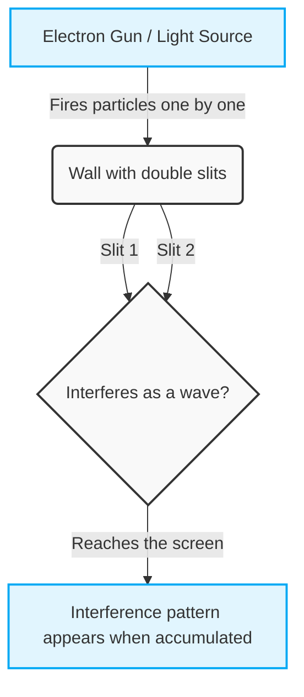
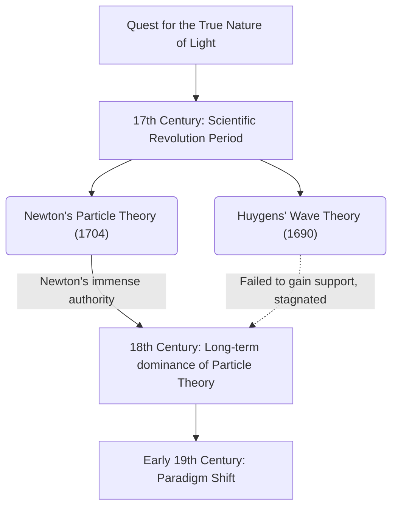
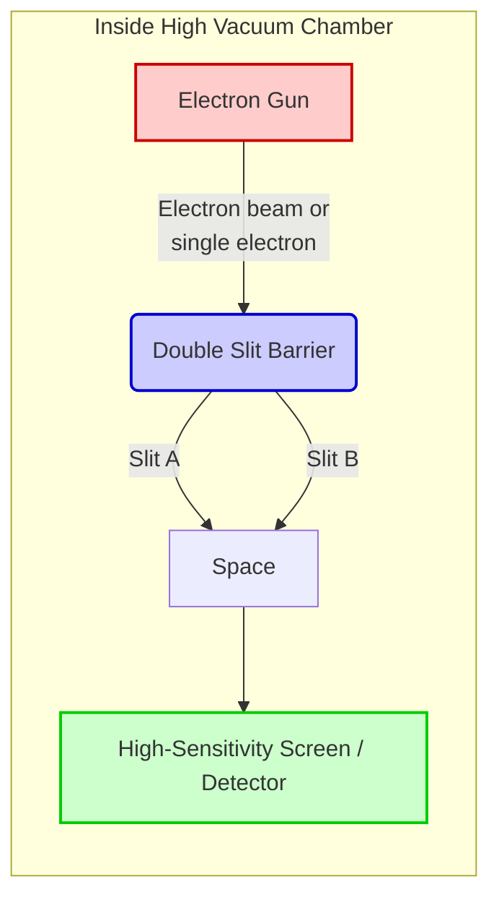

## 1. [Introduction] What is the Double-Slit Experiment?

The world we live in appears to be governed by firm rules. A thrown ball falls in a parabolic arc, and a stone thrown into water spreads ripples. These are the common sense of the "macro world" described by classical physics, such as Newtonian mechanics, and they perfectly match our intuition. However, the moment we step into the "micro world" of the ultimate smallest units of matter, such as atoms and electrons, or particles of light (photons), this common sense crumbles with a resounding crash. It is a realm governed by extremely strange and incomprehensible rules, where our everyday senses and intuition do not apply at all.

This abnormality of the micro world is thrust upon us in the simplest and most shocking form by the "Double-slit experiment". Richard Feynman, a genius physicist representing the 20th century, spoke of this experiment as "the only mystery of quantum mechanics," and further evaluated that "all the mysteries of quantum mechanics are packed within this experiment." Also, many prominent physicists never cease to call this experiment "the most beautiful experiment in the history of physics". So, why is an extremely simple experiment with just two gaps (slits) opened in a single board considered so special and continues to fascinate scientists?

### The Counterintuitive Macro and Micro Worlds

First, let's imagine phenomena in the macro world where our intuition functions accurately.
For example, suppose there is a machine that repeatedly fires small balls painted with ink (or machine gun bullets is fine too) at a wall. In front of it, an iron plate with two long, narrow vertical slits (gaps) side by side is placed. When balls are fired randomly, only the balls that pass through either of the slits hit the wall in the back and leave an ink mark. As a result, marks of "two vertical lines" with the same shape as the two slits in the front should emerge on the wall. This is the behavior as a "particle" where the balls have a clear trajectory, and it is a natural result that anyone can intuitively predict.

Next, let's consider the case of a "wave". Place a screen with two slits in a water tank and generate waves from one side. When the waves reach the two slits, they pass through them, and with each slit as a new wave source, they spread to the back as two semicircular waves. Then, when these two waves collide, a phenomenon called "interference" occurs. Places where the peaks of the waves overlap become higher waves, and places where a peak and a trough overlap cancel each other out and become flat. As a result, on the wall in the back (or the shore), a beautiful striped pattern called an "interference pattern" is formed, where places hit strongly by the waves and places not hit at all appear alternately. This is also a basic property of waves that can be routinely observed with water surfaces and sound waves.

Up to this point, there is nothing strange at all. Throw particles and they create "two lines"; send waves and they create an "interference pattern". This is the common sense of the world we live in, and the premise of classical physics.

### Overview of the Experiment and Why It is Called the "Most Beautiful Experiment"

However, when exactly the same structure of experiment is conducted using micro entities like light or electrons, the situation changes drastically, and human intuition is completely betrayed.
Looking back at history, in 1801, British physicist Thomas Young first conducted this double-slit experiment using sunlight (Young's experiment). At the time, the theory proposed by Newton that light is a "particle" was predominant, but as a result of Young's experiment, a beautiful "interference pattern" appeared on the screen. This provided definitive evidence that "light is a wave," and it seemed that the long-standing dispute had finally been settled for a time.

The true mystery, and the greatest paradigm shift in the history of physics, begins here. Entering the 20th century, as experimental techniques made astonishing progress, it became possible to fire light and electrons "one by one". An electron has mass, occupies a specific position in space, and is undeniably a distinct "particle". A single electron is fired from an electron gun, passes through the double slits, and reaches somewhere on the screen as a single dot (a bright spot). At this point, looking at the trace left on the screen, the electron is undoubtedly behaving as a particle.
Then, this "firing of electrons one by one" is repeated a mind-boggling number of times, thousands or tens of thousands of times. Since electrons are only ever flying one by one, it is physically impossible for them to collide with other electrons in mid-air and interfere like waves. Naturally, everyone thought that "two lines" corresponding to the shape of the slits would emerge on the screen, just like when throwing balls.

However, as countless dots of electrons accumulated on the screen, what emerged there was an unbelievable pattern. It was an "interference pattern" that should only appear when waves collide with each other.

Why does the electron, an undeniably "particle" fired one by one, behave overall as a "wave", interfere with itself, and draw a striped pattern? What on earth does this mean? It is as if a single fired electron spreads out into space like a wave, passes through two slits simultaneously, causes self-interference, and appears again as a single particle the moment it hits the screen.
Even more strangely, the moment scientists installed an observer (like a camera) next to the slits to confirm "which slit the electron passed through," the electron suddenly lost its wave-like properties, and instead of an interference pattern, just "two lines" began to appear on the screen. This phenomenon of changing behavior when "being watched" threw physicists into an even deeper whirlpool of confusion.

The biggest reason why the double-slit experiment is called "the most beautiful experiment in physics" is that it highlights the fundamental mysteries of the universe with an extremely simple and elegant setup of just two gaps and a screen, without using large-scale accelerators or extremely complex mathematical formulas. It vividly shows us visually the moment when the common sense of the macro world brilliantly collapses. It is not limited to merely confirming physical phenomena, but continues to pose extremely deep philosophical and epistemological questions to us: "What is reality?" and "Does this world that we are 'seeing' truly exist objectively?" Within this single simple experiment, the limits of human intellect and the infinite romance of science trying to transcend them are condensed.

## 2. [History] Is Light a Wave or a Particle? The Trajectory of a Never-Ending Dispute

Since humanity recognized the existence of "light", the quest for its true nature has never ceased. From the era of ancient Greece, philosophers and mathematicians like Empedocles and Euclid have pondered the mechanisms of light and vision, but it was in the 17th century that a full-fledged approach as modern science began. The dispute that opened in this era, "Is light a particle, or is it a wave?", divided the physics community for over 300 years thereafter, and ultimately became the driving force that opened the door to an entirely new physics called quantum mechanics. In this section, we will trace the trajectory of this magnificent scientific history in detail.

### 2.1 Newton's Particle Theory vs. Huygens' Wave Theory: The Clash of the 17th Century

In the late 17th century, right in the midst of the Scientific Revolution, two powerful theories regarding the true nature of light were presented. These were the "Particle theory (Corpuscular theory)" by Isaac Newton and the "Wave theory" by Christiaan Huygens.

#### Newton's Particle Theory
Isaac Newton, a giant of modern physics known for the law of universal gravitation, thought that light was a collection of extremely small particles (corpuscles). In his 1672 paper and his 1704 major work "Opticks", Newton brilliantly explained the property of light traveling in straight lines and the law of reflection on mirrors using a mechanical model of particles bouncing off a wall. Furthermore, regarding the phenomenon where white light is separated into seven colors by a prism (dispersion), he argued that lights of different colors are particles of different masses, and thus have different refractive indices when passing through a medium.
Against the wave theory, Newton pointed out, "If light were a wave like sound, it should bend around the back of obstacles (diffraction phenomenon), but light travels straight and creates clear shadows," thereby denying that it is a wave.

#### Huygens' Wave Theory
On the other hand, Christiaan Huygens, an outstanding Dutch physicist, argued in his "Treatise on Light" published in 1690 that light is a wave (longitudinal wave) propagating through an elastic medium filling outer space called "aether". Huygens proposed the famous "Huygens' Principle", which states that "every point on a wavefront becomes a source of new secondary waves," and beautifully explained the laws of rectilinear propagation, reflection, and refraction of light geometrically.
Particularly regarding refraction, Newton predicted that "when light enters a denser medium like water or glass, the speed of light becomes faster because the particles undergo an attractive force and accelerate," whereas Huygens' wave theory concluded that "the speed at which waves travel becomes slower in denser mediums," and the two were in direct opposition.

However, due to Newton's absolute authority and influence in the scientific community at the time, Huygens' wave theory gradually faded into the background, and Newton's particle theory continued to reign as the mainstream throughout the 18th century.

## 2.2 Thomas Young's Double-Slit Experiment with Light (1801) and the Triumph of the Wave Theory

Entering the 19th century, a decisive event occurred that shattered the long-dominant stronghold of the particle theory. The leading figure in this was the British polymath Thomas Young. A physician who also contributed to the decipherment of Egyptian hieroglyphs (the Rosetta Stone), Young conducted an experiment in 1801 that shines brilliantly in the history of physics. This was "Young's interference experiment" (later known as the double-slit experiment).

#### Discovery of Interference Fringes
Young's experimental setup was extremely simple yet ingenious. He passed sunlight through a very fine pinhole (or slit) to create a point light source, and then allowed that light to pass through two narrow slits (a double slit) located very close to each other, projecting it onto a screen behind them.
If light were purely "particles" as Newton claimed, two bright lines corresponding to the shape of the slits should have been projected on the screen. However, what Young saw on the screen was a striped pattern where bright and dark fringes alternated, namely "interference fringes".

This phenomenon was absolutely inexplicable unless light was considered a wave. When two waves collide on a water surface, the places where the crests of the waves overlap become higher (constructive interference), and the places where a crest and a trough overlap cancel each other out to become flat (destructive interference). Young concluded that the light waves emerging from the two slits were causing interference in exactly this manner.

#### Mathematical Backing and the Establishment of the Wave Theory
The conditions for this constructive and destructive interference are determined by the difference in the path lengths from the two slits to a point on the screen (the optical path difference $\Delta L$). Letting the distance between the slits be $d$, the angle to the screen be $\theta$, and the wavelength of the light be $\lambda$, the optical path difference is expressed as follows:

$$ \Delta L = d \sin \theta $$

* **Bright fringes (constructive condition)**: $\Delta L = m\lambda \quad (m = 0, \pm1, \pm2, \dots)$
* **Dark fringes (destructive condition)**: $\Delta L = \left(m + \frac{1}{2}\right)\lambda$

Young's announcement initially faced fierce criticism and ridicule from Newtonian followers in Britain. However, in 1815, the French physicist Augustin-Jean Fresnel later established the diffraction and interference of light as a rigorous mathematical theory. Furthermore, at the 1818 French Academy of Sciences competition, judge Siméon Denis Poisson (an opponent of the wave theory) pointed out, "If Fresnel's theory is correct, there should be a bright spot at the center of the shadow of a circular obstacle. Such a ridiculous thing is impossible." However, when Dominique F. J. Arago actually conducted the experiment and perfectly observed that "Poisson spot" (or Arago spot), the correctness of the wave theory became undeniable.

In 1850, Léon Foucault and others experimentally proved that the speed of light in water is slower than in air, completely refuting Newton's prediction. Then, in 1864, James Clerk Maxwell established the theory that "light is a form of electromagnetic wave" as the culmination of electromagnetism, and with this, the "wave theory" of light achieved a complete victory, seemingly settling the debate once and for all.

### 2.3 The Revival of the Particle Theory Through Einstein's Light Quantum Hypothesis (1905)

Maxwell's theory that light is an electromagnetic wave was so beautiful that physicists at the end of the 19th century believed, "Physics is nearly complete, and all that remains is to measure precise numerical values." However, from the late 19th to the early 20th century, a strange phenomenon emerged that the wave theory could not possibly explain. This was the "photoelectric effect."

#### The Mystery of the Photoelectric Effect
The photoelectric effect is a phenomenon where electrons (photoelectrons) are ejected from the surface of a metal when light shines on it. According to the common sense of the wave theory at the time, the energy of light (a wave) should be proportional to its amplitude (brightness). Therefore, it was thought that "if you shine a strong (bright) light, electrons should forcefully fly out regardless of the color of the light."
However, the experimental results completely betrayed the predictions of the wave theory.

1. **Existence of a threshold frequency**: No matter how strongly (brightly) or for how long light below a certain specific frequency (color) - for example, red light - was applied, electrons never flew out.
2. **Immediacy**: Conversely, if it was light above the threshold frequency (for example, ultraviolet light), no matter how faint the light was, electrons flew out instantaneously the moment it was applied.
3. **Energy dependence**: The kinetic energy of the ejected electrons depended only on the frequency (color) of the light, not on the intensity (brightness) of the light.

#### Einstein's Dramatic Solution: The Light Quantum (Photon)
The person who unravelled this desperate mystery was an unknown young man working at the Swiss patent office, Albert Einstein. In 1905, known as his "miracle year," he applied the "energy quantum hypothesis" proposed by Max Planck in his study of thermal radiation (1900) to light itself, publishing the "light quantum hypothesis."

Einstein boldly assumed that light, which had been thought to be a continuous wave, was actually a collection of particles that were clumps of energy, namely "light quanta (photons)." The energy $E$ possessed by a single light quantum is proportional to the frequency $\nu$ of the light, and is expressed by the following Planck-Einstein formula.

$$ E = h\nu $$
(Here, $h$ is Planck's constant, $6.626 \times 10^{-34} \, \text{J}\cdot\text{s}$)

Using this hypothesis, the mystery of the photoelectric effect was solved as if by magic.
The photoelectric effect was a billiard-like phenomenon where "one light quantum" collides with "one electron" in the metal, transferring its energy entirely. Letting the minimum energy required for the electron to shake off the bonds of the metal be the "work function ($W$)", the maximum kinetic energy $E_k$ of the ejected electron is expressed by the following elegant equation:

$$ E_k = h\nu - W $$

If the energy of the light quantum $h\nu$ is smaller than the work function $W$ (low-frequency light), no matter how massive a quantity of light quanta are bombarded against it (no matter how strong the light is made), electrons cannot fly out of the metal. This is the reason for the threshold frequency.

#### Into the Incomprehensible World of "Both Wave and Particle"
Einstein's light quantum hypothesis was completely proven by a precise experiment by Robert Millikan in 1914, and Einstein was awarded the Nobel Prize in Physics in 1921 for this achievement. (Millikan himself initially did not believe Einstein's theory and conducted the experiment to disprove it, but ironically the results proved its correctness). Furthermore, in 1923, Arthur Compton discovered "Compton scattering," where the wavelength of X-rays changes when they collide with electrons, making it certain that light behaves as a "particle" possessing momentum $p = \frac{h}{\lambda}$.

The "particle theory," which should have been completely defeated by Young's experiment, achieved a miraculous resurrection after 100 years in the more refined form of a "quantum."
However, this created a profound contradiction. It meant that light possessed an obvious wave-like nature such as "interference" as shown in Young's double-slit experiment, while also possessing a "particle-like" nature as shown in the photoelectric effect.

Is light a wave, or is it a particle?
The final answer of physics to this question was fiercely counter-intuitive to human instinct: "Light is both, and it is neither. Light is a quantum entity that possesses both 'wave properties' and 'particle properties'." This was the birth of "wave-particle duality."
And this concept of duality came to be applied not only to light, but also to matter itself such as electrons (de Broglie's matter waves), causing physics to step into an unprecedented abyss, the strange and fascinating world of "quantum mechanics." Its most symbolic stage would be the "quantum mechanical double-slit experiment," updated for the modern era.

## 3. [Turning Point] Is Matter Also a Wave? de Broglie Waves and the Double-Slit Experiment with Electrons

Due to Einstein's light quantum hypothesis (1905) that light is "both a wave and a particle," the world of physics was in the midst of massive confusion and a paradigm shift. Despite it being believed for many years through Young's interference experiment and Maxwell's electromagnetism that "light is absolutely a wave," phenomena such as the photoelectric effect could not be explained without considering light as "particles (photons)." This bizarre property of "wave-particle duality" was initially thought to be a unique characteristic possessed only by light. However, entering the 1920s, this concept of duality began to bare its fangs not just at the world of light, but at the very "matter" that makes up our bodies.

### 3.1. Louis de Broglie's Proposal of Matter Waves: A Leap from Beautiful Symmetry

In 1924, Louis de Broglie, a young French graduate student, proposed an extremely bold hypothesis in his doctoral thesis that would fundamentally overturn the history of physics. It was this: "If light (which was thought to be a wave) has the properties of a particle, then conversely, shouldn't matter such as electrons (which were thought to be particles) also have the properties of a wave?"

De Broglie's philosophical intuition that nature always prefers symmetry lay at the root of this hypothesis. He applied the relational equations for energy and momentum, which Einstein had derived in his special theory of relativity and light quantum hypothesis, to matter particles with mass. The momentum $p$ of a photon is expressed as $p = h / \lambda$ using Planck's constant $h$ and the wavelength $\lambda$. De Broglie inverted this, expressing the wavelength $\lambda$ of the wave associated with a particle having mass $m$ and moving at velocity $v$ (momentum $p = mv$) with an extremely simple formula as follows:

$$ \lambda = \frac{h}{p} = \frac{h}{mv} $$

This is the famous formula for the "de Broglie wavelength (wavelength of matter waves)." This formula implies that everything that moves, from the baseballs and cars we see in everyday life to minuscule electrons, is imbued with the properties of a "wave." Then, why do we not see a baseball interfering or diffracting like a wave in our daily lives? That is because Planck's constant $h$ (approximately $6.626 \times 10^{-34} \text{ J}\cdot\text{s}$) is extremely small. For macroscopic objects, the mass $m$ is so large that the de Broglie wavelength $\lambda$ becomes small enough to be considered practically zero, completely hiding any wave-like nature. However, in the world of electrons where the mass is extremely small, this wavelength reaches a scale comparable to the wavelength of X-rays (electromagnetic waves) (e.g., about $0.1 \text{ nm}$), emerging as a magnitude that can never be ignored.

Because this thesis by de Broglie was so far beyond common sense, it greatly bewildered the examiners of the time. However, when Paul Langevin, one of the examiners, sent this thesis to Einstein, Einstein highly praised it, saying, "He has lifted a corner of the great veil." As a result, de Broglie's concept of the "matter wave" gained worldwide attention, leading directly to the later completion of wave mechanics by Schrödinger.

### 3.2. The Davisson-Germer Experiment: Proof of the Wave Nature of Matter

Although de Broglie's hypothesis was beautiful as a theory, whether it actually described the real natural world had to await experimental proof. "If electrons are truly waves, they must exhibit phenomena unique to waves, such as 'diffraction' and 'interference'." Driven by this conviction, physicists around the world began experiments in an attempt to capture the wave nature of electrons.

Then, in 1927, definitive evidence was finally brought forth. This was the "Davisson-Germer experiment" conducted by American Bell Labs physicists Clinton Davisson and Lester Germer.

They were initially conducting the experiment for a different purpose: to shine an electron beam onto a nickel crystal and investigate its scattering. However, when they heated the nickel to high temperatures to recover from an accident during the experiment (oxidation of the nickel surface due to a broken vacuum tube), they were blessed with the stroke of luck that the nickel accidentally crystallized into a single crystal. When they shined the electron beam onto this single-crystal nickel again, an astonishing phenomenon was observed. The intensity of the scattered electrons showed a clear "diffraction pattern," having a maximum value at a specific angle.

The spacing at which atoms are regularly arranged within the crystal (the lattice constant) is on almost the exact same scale as the de Broglie wavelength of an electron. In other words, the nickel crystal itself functioned as a "natural diffraction grating" for the electrons. The result when Davisson and Germer reverse-calculated the electron's wavelength from this diffraction pattern perfectly matched the value predicted by de Broglie's formula, $\lambda = h/p$. In the same year, the British physicist George Paget Thomson (son of J.J. Thomson, the discoverer of the electron) also succeeded in observing a diffraction ring (Debye-Scherrer ring) caused by an electron beam transmitting through a thin metal foil.

These experimental results thrust the fact that matter has wave-like properties onto the physics community as an unquestionable truth. Electrons, which were supposed to be particles, behaved as waves. This was the moment when this profound truth of nature was revealed, and it was also the fanfare heralding the dawn of quantum mechanics. De Broglie won the Nobel Prize in Physics in 1929, while Davisson and Thomson won it in 1937.

### 3.3. The Definitive Double-Slit Experiment by Hitachi (Akira Tonomura et al.) (1989)

Even after it was proven that electrons are waves, the quest of physicists did not stop. It was an attempt to execute the "double-slit experiment with electrons," which had been discussed as a thought experiment, in reality and with extreme precision.

Just like the double-slit experiment with light (Young's experiment), if electrons are fired toward a double slit, interference fringes should appear on the screen behind them. However, here emerges the most incomprehensible paradox of quantum mechanics: "What happens if, instead of firing a massive amount of electrons all at once, they are fired **one by one**?"

A single electron is an indivisible particle. Therefore, it should only be able to pass through either one side, the left slit or the right slit. Electrons arriving at the screen one by one simply leave a single bright spot on the screen. When this is repeated tens of thousands of times, will the collection of dots just become shadows of the two slits (two lines), or will they become interference fringes showing the properties of a wave?

In response to this ultimate question, it was a research team from the Advanced Research Laboratory of Hitachi, Ltd. in Japan (Dr. Akira Tonomura et al.) that broke through technical limitations to present the world's most beautiful and perfect answer. In 1989, utilizing electron holography technology along with ultra-high vacuum and ultra-low temperature electron microscopy technology, they brilliantly succeeded in the "single-electron biprism interference experiment."

The experimental setup was astounding. They reduced the number of electrons emitted from the electron gun to the absolute limit, creating a state where there was always "only one electron present inside the apparatus" while the electron was flying through space. The speed of the electrons reached about 150,000 kilometers per second, and the time required to fly the distance from the light source to the detector was but an instant. The next electron would be fired long after the previous electron had arrived at the screen.

When the experiment began, bright spots indicating the arrival of electrons started to appear on the detector (monitor) one by one. During the stages of the first few and first few hundred, it only looked as if dots were randomly scattered across the screen. Like stars in the night sky, it seemed there was no order to be found.

However, as thousands and tens of thousands of electrons accumulated, an astonishing sight obvious to anyone's eyes emerged. The collection of dots that had appeared disordered gradually formed a regular striped pattern of light and dark - unmistakable "interference fringes."

The implication of this result fiercely defied intuition. The electrons had certainly arrived at the screen as "individual particles" (which is exactly why single dots were recorded). However, forming interference fringes as a whole meant it could only be interpreted as that single electron having "simultaneously passed through both slits (both sides of the biprism) itself as a wave, interfering with itself." A lone electron, interacting with nothing else, causing interference with itself. The very same principle of which Dirac spoke, saying "each photon then interferes only with itself," was perfectly demonstrated for electrons, which are matter particles with mass, as well.

This experiment by Dr. Akira Tonomura and his colleagues was highly acclaimed worldwide as having provided the most visual and direct proof of the strangeness of quantum mechanics, namely "wave-particle duality." It is only natural that this "double-slit experiment with electrons" was proudly selected as the first place in a reader poll for "the most beautiful experiment in the history of physics" conducted by the British science magazine "Physics World" in 2002.

Thus, de Broglie's outlandish hypothesis that "matter is a wave" revealed its true form before our eyes after more than 60 years, as mysterious interference fringes drawn by single electrons. However, while this experiment unravelled a mystery of quantum mechanics, it also simultaneously opened the door to an even deeper mystery, namely the "measurement problem." "If you try to see which slit it passed through, the interference fringes disappear" - in the next chapter, let us step further into the abyss of this bizarre quantum world.
## 4. [Experimental Methods and Results] What Exactly is Happening?

(In order to approach the core of the double-slit experiment and peer into the abyss of quantum mechanics, we will focus our explanation here on an experiment using "electrons" instead of light. Similar phenomena have been confirmed with photons, other elementary particles, and even relatively large molecules like fullerenes. However, by using electrons, which have mass and which we recognize as "clearly particles of matter," the paradox and mystery of this phenomenon become even more prominent.)

### 4.1 Experimental Setup: Setting the Stage to Capture the Microscopic World

First, let's take a detailed look at the setup for this historical and innovative experiment. The conceptual structure of the double-slit experiment is surprisingly simple, but successfully executing it as a physical experiment requires advanced technology and extremely strict environmental control.

The experimental apparatus is broadly composed of the following three main components. These are all strictly sealed and placed inside a high-vacuum chamber to prevent the scattering of electrons due to collisions with air molecules.

1. **Electron Gun**:
   This is a device used to fire the "electrons," the main actors of the experiment. Using principles such as heating a filament to emit thermionic electrons or using a strong electric field to extract electrons, it fires electrons with a certain kinetic energy in a fixed direction. What is extremely important in this experiment is that it is possible to fire electrons continuously like a waterfall as a powerful "beam," or, surprisingly, to narrow down the output to the absolute limit and fire them "reliably one by one." This "single-electron firing technology" is one of the sophisticated techniques essential in modern quantum mechanics experiments.

2. **Double Slit**:
   This is a shielding plate (wall) with two extremely narrow and very closely spaced parallel slits (gaps) through which the electrons fired from the electron gun pass. Because the wavelength of an electron's "matter wave (de Broglie wave)" is extremely short, the width of these slits and the distance between them must also be precisely fabricated on a microscopic scale of nanometers (one billionth of a meter) to micrometers. If the slit width or spacing is too wide relative to the electron's wavelength, the wave nature, "interference," cannot be clearly observed. The technology itself to create this microscopic double slit is the culmination of microfabrication technology, such as state-of-the-art electron beam lithography systems.

3. **Screen / Detector**:
   This is an observation screen where electrons that have successfully passed through the double slit finally arrive, recording their positions. In past experiments, photosensitive photographic plates were used, but today, highly sensitive CCD cameras, fluorescent screens, and special semiconductor pixel detectors are used. This makes it possible to record exactly "where the electron arrived (hit)" as extremely precise two-dimensional coordinates for each shot. When an electron hits the screen, it emits a tiny light or generates an electrical signal, leaving a clear trace (dot) that it "undoubtedly arrived here as a single particle."

The following diagram schematically illustrates the overall arrangement of this experimental apparatus and the trajectory of the electrons.

### 4.2 When Firing a Large Number of Electrons: Wave-like Behavior Defying Intuition (Formation of Interference Fringes)

Now, let's finally start the experiment. First, as an initial step, we increase the output of the electron gun and fire a "large number of electrons" all at once toward the double slit in a continuous stream, like a shower or a machine gun.

If we think based on our everyday classical physics common sense, an electron is a "particle (like a tiny bullet)" with mass. Therefore, the numerous electrons that pass through the two slits should intensively hit two areas on the screen on the extensions of the straight-line directions of the respective slits, resulting in a pattern like "two vertical stripes." Imagine spraying paint onto a stencil plate with two gaps. The paint passing through the gaps should draw two lines on the wall corresponding to the shape of those gaps.

However, the pattern that actually appears on the screen completely betrays our intuition and predictions. On the screen, instead of two simple vertical stripes, **multiple bright and dark stripes (Interference Pattern)** are clearly formed.

This "interference pattern" has exactly the same geometric features as the overlapping ripple patterns created when two stones are simultaneously thrown into the surface of a pond, or the patterns seen in light interference experiments.
- **Where the crests and crests, or troughs and troughs of the waves overlap (constructive interference)**, it becomes a "bright" stripe where many electrons arrive (high electron collision density).
- **Where the crests and troughs of the waves overlap (destructive interference)**, the waves cancel each other out, resulting in a "dark" stripe where almost no electrons arrive (electron collision density is close to zero).

There is only one conclusion that can be drawn from this result. It is that **"electrons behave as waves."** The swarm of electrons emitted from the electron gun propagates through space like water waves and passes through the two slits "simultaneously." And the only way to interpret it is that the wave diffracted and spread from slit A and the wave diffracted and spread from slit B overlap in the space in front of the screen, causing interference to create that characteristic bright and dark striped pattern.

The fact that electrons, which were firmly believed to be "particles," actually also possess properties as "waves" (wave-particle duality). This fact alone is a historical major discovery in physics and is sufficiently surprising, but the true mystery of quantum mechanics and the phenomenon that fundamentally overturns our common sense deepens one step further from here.

### 4.3 When Firing Electrons "One by One": The True Nature of the "Probability Wave" Revealed by the Extreme Experiment

"Because we shoot a massive amount of electrons simultaneously, the electrons collide with each other in mid-air or repel each other due to electrical force (Coulomb force), and as a result, aren't they just creating a wave-like pattern?"
Thinking this way is a very natural question as a scientist. In fact, when interference fringes were first discovered, many physicists thought that way and tried to interpret the phenomenon classically.

To settle this question completely, experimental techniques advanced, and a more decisive experiment was conducted. (In Japan, an experiment conducted by Dr. Akira Tonomura and his group at Hitachi in 1989 is very famous and praised as one of the most beautiful experiments in the world.)
That is the experiment of **narrowing down the output of the electron gun to the absolute limit and firing electrons "reliably one by one."**

Specifically, a new electron is fired only after confirming that the previous electron was fired, reached the screen, and completely disappeared (or was absorbed). This is repeated a staggering number of times: tens of thousands, hundreds of thousands of times. In this setup, it is guaranteed that there is "always only one electron" in the space within the experimental apparatus. Therefore, it is physically 100% impossible for electrons to collide with each other in mid-air or interfere with one another.

Let's follow the results of this extreme single-electron experiment over time (the number of accumulated electrons).

**Step 1: Immediately After Starting the Experiment (Tens to Hundreds of Electrons)**
Points are struck onto the screen one by one at completely random positions. At the moment an electron reaches the screen, it clearly shows its nature as a "single particle" and records one point (dot) at specific minute coordinates. At this point, no regularity can be found in the pattern on the screen, and it only looks like a disorderly and random collection of points. It is as if someone is throwing darts blindly.

**Step 2: After Thousands to Tens of Thousands of Electrons Have Arrived**
As time passes, the experiment is repeated, and thousands to tens of thousands of points accumulate on the screen, a strange phenomenon begins to occur. Within the distribution of points that was thought to be completely random, "biases" and "shading" gradually begin to emerge. Areas where points densely hit and accumulate, and areas where almost no points hit, faintly begin to separate.

**Step 3: At the End of the Experiment (Hundreds of Thousands or More Electrons Have Arrived)**
After spending a sufficiently long time and continuously firing a massive number of electrons (hundreds of thousands to millions) one by one in a mind-boggling process, when we look at the accumulated image of the entire screen... right there, the spectacular **"interference pattern"** , exactly the same as when a large number of electrons were fired all at once, clearly emerges!

This is one of the most chilling, counter-intuitive, yet most beautiful and profound results in the history of physics.

Because the electrons were fired "completely one by one." It is absolutely impossible for them to interact with the preceding or succeeding electrons. Despite this, the fact that a striped pattern indicating wave interference is ultimately formed forces us to accept the unbelievable conclusion that **"a single electron interferes with itself."**

When we try to explain this phenomenon logically, our everyday sense of space and matter completely collapses.
After a single electron is fired from the electron gun, it spreads throughout the space as if it were a "wave," **passes through both the right slit and the left slit "simultaneously,"** interferes with "its own wave" in front of the screen, and the moment it arrives at the screen and is observed, it collapses (is determined) again into a single point as a "single particle."

So, what exactly is the true nature of this "wave" of a single electron propagating through space?
In quantum mechanics, this is not a substantial wave rippling in a physical medium like the surface of water or air. According to the interpretation proposed by Max Born, this is **"a wave representing the 'probability' that an electron exists in a specific place in that space (probability wave)."** Mathematically, this is called a "wave function."

An electron does not fly in a straight line along a specific trajectory (route) like a pachinko ball. From the time it is fired until it reaches the screen, the electron spreads through space as a "superposition state" where the "state of passing through the right slit," the "state of passing through the left slit," and even "states of taking every possible path in space" are superimposed with various probabilities.

And the instant it hits the observation instrument called a screen and "where it arrived" is measured, the probability wave that was spreading in space instantly collapses into a single point (collapse of the wave function), and for the first time, the actual position of the particle is determined as "it was here."

The "bright parts" of the interference fringes (areas where many points ultimately gather) are places where the probability of the electron existing was heightened by wave interference, and the "dark parts" (areas where points do not gather) mean places where the probability waves canceled each other out to zero. Just as rolling a die many times brings the probability of each face closer to its theoretical value (1/6), the probabilistic wave's shape (interference pattern) emerges as a reality when the "probabilistic behavior" of individual electrons is repeated hundreds of thousands of times.

"A single electron passes through two slits simultaneously," and "until it is observed, its state is not determined, and it exists only as a probability wave where infinite possibilities are superimposed."
This cold experimental fact presented by the double-slit experiment poses a profound philosophical question beyond the framework of physics: "What does it mean to exist in the first place?" and "What on earth is the reality we perceive?"

## 5. [The Measurement Problem] Quanta Changing Behavior When Watched

This is the core of why the double-slit experiment in quantum mechanics has profoundly influenced not only physics but also the realms of philosophy and thought, and is called the most beautiful and simultaneously the most eerie experiment in the history of science. It is the astonishing fact that the act of "observation (measurement)" itself decisively alters the outcome of physical phenomena.

In the everyday (macro) world we live in, that is, the world governed by classical physics, "looking" is merely a passive act. Whether we look at the moon floating in the night sky or not, the moon firmly exists there and moves along a constant orbit according to Newtonian mechanics. Its orbit does not change just because we look at it. Our strong common sense dictates that the presence of an observer has no influence on the objective reality of the object being observed.

However, in the micro world of quanta, this common sense is fundamentally overturned. "Looking (observing)" is not just receiving information, but an active process that exerts an irreversible and decisive influence on the object. The moment an observer naturally poses a question, nature changes its behavior. In this section, we will delve deeply into the "Measurement Problem," the greatest mystery of the double-slit experiment, which continues to be debated in modern physics.

### What Happens When You "Observe" Which Slit It Passed Through

Imagine a process where quanta, whether electrons, photons, or large molecules like fullerene (C60), are fired one by one, pass through two slits, and reach a screen. As explained so far, even if quanta are fired one by one with intervals, observing the accumulated bright spots on the screen over a long time confirmed that beautiful interference fringes (evidence of wave-like properties) are formed. This is interpreted as a single quantum propagating through space as a superposition of two states: the "possibility of passing through the right slit" and the "possibility of passing through the left slit," resulting in the interference of its own probability wave.

However, here physicists held a natural, yet diabolical question in the quantum world. "Is the quantum really passing through 'both slits simultaneously'? Or 'is it actually passing through only one of the slits, but we just don't know it'? Let's put a camera next to the slits and find out."

To answer this question, they made one modification to the experimental apparatus. An extremely sensitive "detector (observation device)" is placed right next to the slits. This detector is intended to "observe" and record whether the electron passed through the right slit or the left slit. The experimental setup is exactly the same except for the addition of the detector. Electrons are fired one by one. The detector works reliably, telling us exactly the which-path information of the electron: "it passed through the right" or "it passed through the left." As expected, half of the electrons are confirmed to pass through the right, and the other half through the left. Now our intuition is satisfied. "See, the electron was just a particle passing through one of the holes after all. Superposition is an illusion."

However, the physicists who checked the distribution pattern of the electrons that finally reached the screen are left speechless. What was depicted there were no longer beautiful interference fringes showing wave properties, but just "two lines (or two peaks)." This is exactly the same pattern created when classical particles like baseballs or pebbles are thrown toward slits. The "wave interference," essential for the formation of interference fringes, had completely disappeared.

The moment we tried to observe "which path it took," the electron discarded its wave nature (superposition state) and began to behave as a pure classical particle. Turn off the detector, and the interference fringes reappear; turn it on, and they vanish without a trace. Even more surprisingly, a later experiment (the quantum eraser experiment) demonstrated that the interference fringes even revive when "the observation data was recorded, but deleted without anyone ever looking at it." Quanta behave as if they "know" that they are being watched by us, or that the path information remains somewhere in the universe. This is called the "destruction of interference by obtaining path information," and it became decisive evidence showing how far removed the quantum world is from our intuition.

### The Copenhagen Interpretation (Wavefunction Collapse)

How should we interpret this profoundly incomprehensible phenomenon? The most standard and orthodox interpretation of quantum mechanics, constructed primarily in the 1920s by Niels Bohr, Werner Heisenberg, and Max Born, is the "Copenhagen Interpretation."

In the Copenhagen Interpretation, it is considered that a quantum before observation exists only as a "probability wave (wave function)" spreading through space. The wave function (usually denoted as $\Psi$) itself is not a physical entity but a mathematical tool representing the "probability amplitude" of finding the quantum at a certain location. This probability wave evolves (changes) over time deterministically and smoothly according to the Schrödinger equation. In the double-slit experiment, the electron's probability wave passes through both the right and left slits, and interferes with itself in front of the screen. Up to this point, it is a deterministic process governed by wave properties.

However, the moment the physical process of "observation" is performed, this wave function undergoes a dramatic and non-continuous change. This is called the "collapse of the wave packet (Wavefunction Collapse)." In the split second the detector senses "the electron passed through the right slit," all waves of possibilities spreading through space, such as "it might pass through the left" or "it might pass through the middle," vanish instantly faster than the speed of light, collapsing into a single reality (point): "a particle that passed through the right slit."

The most radical and important assertion of the Copenhagen Interpretation is that "before observation, where the quantum is or what state it is in is 'undetermined'." It is not that it is actually somewhere and we just don't know it (this is called a "hidden-variable theory"); rather, it argues literally that "the state where the probability of existence is spread through space is reality itself," and that interaction with a macro system like an observation randomly "selects" and "determines" a single reality from countless possibilities.

Albert Einstein strongly opposed this vague and probabilistic idea throughout his life. The famous phrase "God does not play dice with the universe" is a criticism of this probabilistic interpretation. He also quipped, "Are you telling me that the moon does not exist when I am not looking at it?", and continued to assert that quantum mechanics was an incomplete theory (such as the EPR paradox). However, subsequent verification experiments of Bell's inequalities (like Aspect's experiment) rejected the local hidden-variable theories Einstein desired, and to this day, numerous precise experimental results continue to support the correctness of this eerie Copenhagen Interpretation (or its related non-local/probabilistic models like the many-worlds interpretation).

### Relationship with Heisenberg's Uncertainty Principle

Why does the act of observation inevitably change the state of a quantum and destroy interference fringes? This mystery is brilliantly explained from a more fundamental principle of physics by the "Uncertainty Principle," proposed by Werner Heisenberg in 1927.

The Uncertainty Principle is a fundamental law of the universe stating that in the microscopic world, it is theoretically impossible to simultaneously measure a particle's conjugate physical quantities (paired properties), such as "position (where it is)" and "momentum (with what mass and velocity, and in what direction it is flying)," with infinite precision.

The mathematical representation of this is the following famous inequality:

$$ \Delta x \cdot \Delta p \ge \frac{\hbar}{2} $$

Here, each symbol means the following:
- $\Delta x$ : "Uncertainty in position (standard deviation in position measurement, spread of error)"
- $\Delta p$ : "Uncertainty in momentum (standard deviation in momentum measurement)"
- $\hbar$ : "Dirac constant (h-bar, reduced Planck constant)". It is Planck's constant $h$ divided by $2\pi$, an extremely small value of about $1.054 \times 10^{-34} \mathrm{J\cdot s}$.

What this formula means is that the product of the "uncertainty in position" and the "uncertainty in momentum" must always be greater than or equal to a certain minimal value ($\hbar / 2$). In other words, the more accurately we try to specify the position of a particle (the closer we bring $\Delta x$ to the limit of zero), the more the uncertainty in momentum ($\Delta p$) diverges to infinity in inverse proportion, making it completely impossible to predict where the particle will fly in the next instant. The reverse is also true: if we try to measure momentum precisely, the position of the particle becomes blurred across space.

Crucially, this is not an "error caused by the poor performance of human-made measuring instruments," but a "fundamental fluctuating property of nature" inherent in the quantum itself. Quanta are simply not allowed to simultaneously possess definite values for both position and momentum.

Let's unravel the "Measurement Problem" in the double-slit experiment through the lens of this Uncertainty Principle.
When we try to know "whether the electron passed through the right slit or the left slit" using a detector, it means, in other words, to "measure and specify the vertical position ($x$) of the electron at the slit plane with high precision" ($\Delta x$ made sufficiently smaller than the distance between the slits).

To see the position of an electron, it is necessary to cause some kind of interaction with the electron. For example, consider shining light (photons) on the electron and looking at the scattered light through a microscope (Heisenberg's microscope thought experiment). To distinguish which slit the electron passed through, we must shine light with a wavelength shorter than the slit interval, that is, light with very high energy.

However, when high-energy photons collide with an electron, the photon gives a large impact (change in momentum) to the electron, just like billiard balls colliding. Due to this, the vertical momentum ($p$) of the electron is violently and randomly disturbed (according to the uncertainty principle, as the cost of reducing $\Delta x$, $\Delta p$ increases).

The random disturbance of the electron's momentum immediately after passing through the slit means that the position where the electron will subsequently reach on the screen will be completely scattered. The precise interference pattern, where probability was supposed to accumulate in specific places while propagating through space maintaining its phase as superimposed waves, is completely destroyed by this disturbance (randomization of phase = decoherence). As a result, the wave interference vanishes, and the classical two lines created by particles scattering after passing through two slits appear.

In this way, the uncertainty principle proves with cold mathematical formulas the cruel fact that "it is impossible to extract path information without exerting any influence on the object (while preserving interference)." The act of observation is a violent act where we definitively extract one piece of information (position) from the object while simultaneously disturbing another important piece of information (momentum or wave phase), forever robbing it away to the unknowable beyond of the universe. The double-slit experiment can be called the ultimate demonstration of quantum mechanics, depicting in a way obvious to everyone how this uncertainty principle and the collapse of the wave packet rule the microscopic world.
## 6. [Cutting Edge] The Foundations and Modern Interpretations of Quantum Mechanics

The bizarre fact presented by the double-slit experiment—that "it is a wave until observed, and becomes a particle the moment it is observed"—posed profound questions to physicists about the fundamental nature of the universe. In this chapter, we will delve into the deepest themes of quantum mechanics: how to mathematically describe this inexplicable phenomenon, and how it should be interpreted. Here awaits cutting-edge theories and experiments that will completely overturn our common sense. The laws of physics in the microscopic world operate on principles entirely different from the macroscopic world we experience daily.

### The Schrödinger Equation and Probability Amplitude

What mathematically governs the world of quantum mechanics is the "Schrödinger equation," derived in 1926 by the Austrian physicist Erwin Schrödinger. Just as the equation of motion in Newtonian mechanics ($F = ma$) deterministically describes the movement of macroscopic objects, the Schrödinger equation rigorously describes how the state of a microscopic particle changes over time (time evolution).

The most fundamental time-dependent Schrödinger equation for a single particle of mass $m$ moving in one-dimensional space is expressed as follows:

$$ i\hbar \frac{\partial}{\partial t} \Psi(x, t) = \left[ -\frac{\hbar^2}{2m} \frac{\partial^2}{\partial x^2} + V(x, t) \right] \Psi(x, t) $$

Each part of this seemingly complex partial differential equation contains important physical meanings that characterize quantum mechanics.

*   ** $i$ **: The imaginary unit ($i^2 = -1$). One of the most prominent features of the Schrödinger equation is that its fundamental equation includes an imaginary number. In quantum mechanics, complex numbers are not merely a mathematical convenience but play an essential role in describing nature.
*   ** $\hbar$ ** (Reduced Planck constant or Dirac constant): The value of the Planck constant $h$ divided by $2\pi$ (approximately $1.054 \times 10^{-34} \mathrm{J \cdot s}$). It is a fundamental natural constant that determines the quantum mechanical scale and defines the boundary between the micro and macro worlds.
*   ** $\frac{\partial}{\partial t}$ **: Partial derivative with respect to time $t$. It is a part of the "time evolution operator" representing how the state of the system changes over time.
*   ** $\Psi(x, t)$ ** (Wave function): A complex-valued function representing the state of the system at position $x$ and time $t$. This is the most crucial element, containing all information about the state of the particle (position, momentum, energy, etc.).
*   ** $m$ **: The mass of the particle.
*   ** $-\frac{\hbar^2}{2m} \frac{\partial^2}{\partial x^2}$ **: The kinetic energy operator. It contains the second spatial derivative and corresponds to the kinetic energy of the particle.
*   ** $V(x, t)$ **: Potential energy. It represents the environment the particle is placed in (force fields such as electromagnetic or gravitational fields).
*   **The entire right side (Hamiltonian operator $\hat{H}$)**: The operator representing the total energy of the system (kinetic energy + potential energy). In other words, the whole equation shows the relationship that "total energy determines the time evolution of the wave function."

By providing initial and boundary conditions and solving the Schrödinger equation, the wave function $\Psi(x, t)$ can be found. However, this $\Psi$ itself is a complex number and not a directly observable physical quantity. The German physicist Max Born proposed a groundbreaking interpretation of the physical meaning of this wave function. This is known as the "probabilistic interpretation (Born's rule)."

According to Born's rule, the square of the absolute value of the wave function, i.e., $|\Psi(x, t)|^2$, represents the "probability density" of finding a particle at position $x$ at time $t$. The wave function itself is called the "probability amplitude," which is not a probability on its own, but becomes a real probability only after being squared.

The interference fringes in the double-slit experiment are understood exactly as a pattern of probability density variations (the strength and weakness of waves) resulting from these probability amplitudes interfering with each other according to the superposition principle. The higher the wave (the greater the probability density), the higher the probability that a particle will be observed on the screen at that location. In other words, electrons do not fly drawing a definitive trajectory, but act as a "wave of existence probability spreading throughout space," and exactly where they will hit the screen is only probabilistically determined until the very moment they arrive. It was resistance to this fundamental probabilism that caused Einstein to object, saying, "God does not play dice with the universe."

### The Many-Worlds Interpretation and Pilot-Wave Theory

The Copenhagen interpretation (the orthodox interpretation centered around Niels Bohr, which posits that the wave function instantaneously collapses upon observation, and one result is randomly selected) can perfectly predict all experimental results thus far. However, it suffers from a deep philosophical conundrum known as the "measurement problem," which asks "why does the act of observation change the laws of physics?", "what constitutes an observer in the first place?", and "where is the boundary between a macroscopic measuring device and a microscopic system?". There are various interpretations that attempt to avoid this problem and understand the bizarre world of quantum mechanics from a different angle without contradictions. Representative examples are the "Many-Worlds Interpretation" and the "Pilot-Wave Theory."

#### The Many-Worlds Interpretation (Everett Interpretation)

The "Many-Worlds Interpretation," proposed by Hugh Everett III in 1957, is a familiar concept in the world of science fiction, but it is an extremely serious theory in physics. Everett completely rejected the process of "wave function collapse upon observation," which is the most unnatural part of the Copenhagen interpretation, and posited that the Schrödinger equation applies to the entire universe at all times without exception.

According to the Many-Worlds Interpretation, when observing a system in a quantum mechanical state of superposition (e.g., a superposition of the state passing through the right slit and the state passing through the left slit), the wave function does not collapse into one or the other; instead, the universe itself branches (separating into independent states through a physical process called decoherence).

In other words, every time a single electron is fired in the double-slit experiment, a "universe where the electron passed through the right slit" and a "universe where the electron passed through the left slit" branch off endlessly and exist in parallel. Because we, the observers, are also part of the universe, we ourselves branch off at the same time as the observation, and in each respective universe, the "me who observed it on the right" and the "me who observed it on the left" are each recognizing different results. Each "me" feels that they are in a unique universe. While it preserves mathematical beauty by eliminating the mysterious mechanism of wave collapse, it demands a paradigm shift that vastly contradicts our intuition by requiring us to accept the reality of countless parallel universes (multiverses).

#### The Pilot-Wave Theory (De Broglie-Bohm Theory)

The "Pilot-Wave Theory" or "Bohmian mechanics," initially proposed by Louis de Broglie and later developed by David Bohm in 1952, takes an entirely different approach from the Many-Worlds Interpretation.

This theory is a representative of "hidden variable theories," positing that a particle always has a definite position and trajectory (that is, it exists even when we are not observing it). However, it differs from ordinary classical mechanics in that it assumes the existence of an invisible wave called a "pilot wave" (quantum potential field) that spreads throughout space, and this wave deterministically guides the motion of the particle.

Applied to the double-slit experiment, the fired electron itself definitely passes through only one of the slits at all times. However, the pilot wave that guides the electron passes through both slits like a water wave, creating interference. Because the electron is carried along the flow of this interfering pilot wave, the positions where it ultimately reaches the screen are biased, resulting in the formation of interference fringes. Which trajectory it takes is entirely determined by its initial position (the hidden variable) upon firing.

The Pilot-Wave Theory has the great appeal of maintaining a deterministic worldview without the need for eerie wave function collapses or infinitely multiplying parallel universes. However, structurally, the theory intrinsically involves "non-locality"—where the pilot wave instantaneously affects all of space faster than light—presenting a new problem that makes it difficult to beautifully integrate with Einstein's theory of special relativity.

### The Delayed-Choice Quantum Eraser Experiment (Does Time Flow Backwards?)

In the debates surrounding the interpretation of quantum mechanics, there are thought experiments and actual experiments that are the most inexplicable and fundamentally shake our concepts of "time" and "causality." These are the "Delayed-Choice Experiment" proposed by John Wheeler in 1978, and the "Delayed-Choice Quantum Eraser Experiment" actually verified by Kim et al. in 1999.

In a normal double-slit experiment, if one observes the "which-way information"—which slit the electron or photon passed through—its wave nature is lost, and the interference fringes disappear, becoming two bands. But what happens if we decide whether to observe the which-way information at a time **before** the screen is hit, but **after** the particle has passed through the slits? This is the fundamental idea of Wheeler's delayed-choice experiment.

Astoundingly, even if one chooses to observe the which-way information after the particle has passed through the slits, the interference fringes do not appear. Conversely, if one chooses not to observe, the interference fringes do appear. It looks as if the choice of observation in the future retrospectively determined the behavior of the particle in the past (whether it acted as a wave or a particle when passing through the slits).

In the further developed "Delayed-Choice Quantum Eraser Experiment," entanglement is utilized to create an even more bizarre situation. A pair of photons, Photon A passing through the slits and Photon B entangled with it, is generated by a special crystal. Photon A immediately heads to a nearby screen (detector), while Photon B travels a longer path to a distant, complex optical system (a network of half-mirrors and detectors).

1.  When the setup allows indirect knowledge of Photon A's which-way information by determining which detector Photon B entered, Photon A does not produce interference fringes on the screen.
2.  However, suppose a device (an "eraser") is inserted before Photon B reaches the detector, intentionally erasing (scrambling into indistinguishability) Photon B's which-way information. Then, no one can ever know Photon A's which-way information anymore, and astonishingly, Photon A forms interference fringes on the screen.

The most shocking aspect here is the timing. By adjusting the path lengths of Photon A and Photon B, the choice to "observe or erase" the information of the far-flying Photon B is made **long after** Photon A has hit the screen and its data has been recorded. Even in this case, if one chooses to erase Photon B's information in the future, a subsequent analysis of Photon A's dataset—which should have already been fixed in the past upon reaching the screen—reveals interference fringes emerging (more precisely, interference fringes can be extracted by correlating with the observation results of the entangled Photon B).

Does this literally mean that "a future choice of observation changed a physical event in the past"? Has causality collapsed?

Many modern physicists are extremely cautious about interpreting this as "causality reversing" or "time literally flowing backwards." Rather, it suggests that in quantum mechanics, "solid objective events of the past (such as which slit it went through)" as we think of them daily do not actually exist until the observation process is completed and the information is extracted. This phenomenon can only be explained mathematically without contradiction by treating the whole—including Photon A, Photon B, the measuring devices, and the environment—as one giant quantum state (an entangled state).

The Delayed-Choice Quantum Eraser Experiment strongly confronts us with the possibility that the concepts we take for granted—such as "absolute time," "inevitability of cause and effect," and "objective reality independent of observation"—are nothing more than illusions that do not hold in the microscopic quantum world. The measurement paradox, which began with Schrödinger's cat, continues to pose philosophical questions to us that approach the very essence of the universe, ever deeper, through modern, sophisticated experimental techniques.

## 7. [Conclusion] The Reality the Double-Slit Experiment Thrusts Upon Us

The double-slit experiment is not merely a past historical experiment found in physics textbooks. It remains the ultimate gateway for shaking the foundations of what we call "reality" and closing in on the truths of the universe. The fact that the inhabitants of the minuscule world, like light and electrons, spread out through space like waves when unobserved, and lock into a single particle the moment they are observed, is an almost unbelievably magical behavior from our everyday sensibilities. However, countless precise experiments and theoretical verifications over more than a century have proven that this counterintuitive prediction of quantum mechanics is an undeniable fact of the universe. To conclude this article, let us once again deeply consider what kind of innovation this simple yet profound experiment is bringing to modern society, and how it transforms our own perception of "reality."

### Applications in Quantum Information Science: Quantum Computers and Quantum Cryptography

The strange properties of quantum mechanics originating from the double-slit experiment—"superposition" and "entanglement"—are no longer confined to philosophical debates in ivory towers, but have come to play a central role in cutting-edge 21st-century technology. Leading the pack, with fierce development competition unfolding worldwide, is the quantum computer. Whereas classical computers compute using bits with a definitive state of either "0" or "1" as their basic unit, quantum computers use "qubits," which have a superposition state of being "both 0 and 1." This is precisely the direct utilization of the phenomenon where a single electron passes through the left and right slits "simultaneously" as a computational resource. The parallel computing capability generated by the entanglement of numerous qubits reaches astronomical scales, holding the potential to solve specific types of computational problems (e.g., prime factorization of enormous numbers, complex molecular simulations for new drug development, optimization problems for transportation networks, etc.) in a mere instant, even if they are of a scale that would take current supercomputers the age of the universe to solve.

Furthermore, quantum cryptography (especially quantum key distribution), the next-generation security technology, is also deeply rooted directly in the "measurement problem" of quantum mechanics. In the double-slit experiment, merely attempting to observe "which slit the electron went through" causes the interference fringes to vanish and changes the particle's behavior. Quantum cryptography employs precisely this principle—the fundamental law of physics that "observing (or eavesdropping on) an unknown quantum state inevitably and irreversibly alters that state, leaving a definitive trace"—as its guarantee of security. No matter how advanced the mathematical hacking techniques or overwhelming the computational power used, one cannot outwit the fundamental laws of nature themselves. Consequently, the construction of next-generation communication networks equipped with ultimate security, theoretically impossible to break, is currently underway.

The microscopic mysteries over which Einstein, Bohr, and others once fiercely debated in front of chalkboards are now being practically applied within giant data centers and optical fiber networks, poised to fundamentally rewrite our societal infrastructure. The "wave-particle duality" and "state collapse upon observation" suggested by the double-slit experiment live on everywhere in society as the greatest driving force behind the modern technological revolution.

### The Ultimate Question: "What is Reality?"

However, more so than the practical aspect of technological applications, the most important and most difficult theme the double-slit experiment thrusts upon us is none other than the philosophical question: "What exactly is reality?". We usually unconsciously believe that the moon exists whether we look at it or not, and that the world exists as an objective and solid entity (local realism). It is a worldview where the universe existed before humans did, running like clockwork according to the laws of physics. However, the double-slit experiment, subsequent verifications of Bell's theorem, and even delayed-choice experiments have flatly denied this naive view of reality.

The world revealed by quantum mechanics is not a collection of predetermined "things," but a world fluctuating as "waves of probability" where infinite possibilities are superposed until observed. This is the worldview presented by the standard interpretation of quantum mechanics (the Copenhagen interpretation). The act of "seeing," or the very process of "extracting information" through interaction with the environment, has become the decisive factor shaping the world. Only when an observer intervenes in a physical system as a part of the universe is the die cast, a single reality selected from among infinite possibilities, and carved into history. Einstein expressed deep irritation, asking, "Do you really believe the moon is not there when nobody looks?", but modern physics has reached the point where it must answer that question with: "The state of the moon when not being looked at is fundamentally different from its state when it is."

This fact also gave rise to an even more astonishing vision: the Many-Worlds Interpretation (Everett interpretation). It is the idea that, rather than the wave packet collapsing with every choice—like whether an electron passes to the right or left—the universe itself branches off, and countless parallel universes (parallel worlds) where every possibility is realized actually exist. This interpretation, which seems like science fiction at first glance, is being seriously debated and gathering supporters among today's top-tier physicists. Whichever interpretation one takes, what the double-slit experiment has made clear is the fact that this solid world we call "reality" is actually extremely delicate, and rests upon a miraculous balance intricately tied to observation and information.

### Towards an Unending Quest

Through this article, we have looked in detail at how an extremely simple experiment—passing a single ray of light or a single electron through two gaps—broke down the common sense of classical physics since Newton, and pioneered the entirely new intellectual paradigm of quantum mechanics. From Schrödinger's cat, Heisenberg's uncertainty principle, and Einstein's remark that "God does not play dice," to modern delayed-choice quantum eraser experiments, the double-slit experiment has always been at the center of all physical and philosophical debates.

We are now standing at the threshold of the second act of the quantum revolution. No matter how much science and technology advance, the deep mystery of the "waves of probability" and "determination through observation" spreading beyond those two slits has yet to be fully unraveled. How did the universe begin? What physical meaning do consciousness and observation have? How will microscopic quantum mechanics and macroscopic general relativity be unified (the study of quantum gravity theory)? The key to unlocking these ultimate mysteries may also be hidden within the simple yet profound phenomenon that is the double-slit experiment.

When, amidst the busyness of daily life, you happen to see light streaming through a window, or look up at the twinkling stars in the night sky, please try to remember. Those countless photons making up that light were waves holding the infinite potential to pass simultaneously through every path in the universe, right up until the moment they concluded their long journey and reached the "detector" that is your pupil. This reality we are witnessing is nothing more than a mere fraction of a grand and eternal dance in which the universe continuously observes and determines itself. What the double-slit experiment thrusts upon us is not terror or nihilism toward the uncertainty of the world. It is a sense of overwhelming wonder and awe at how mysterious, unimaginably rich, and deeply connected this universe is to our very existence. This could be said to be the greatest gift the double-slit experiment has given humanity.
