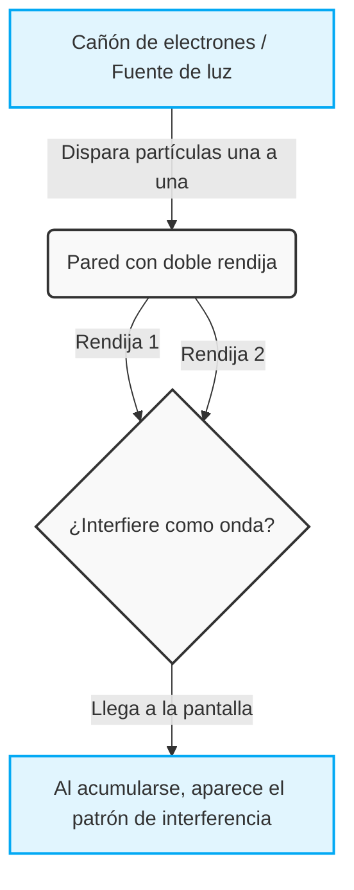
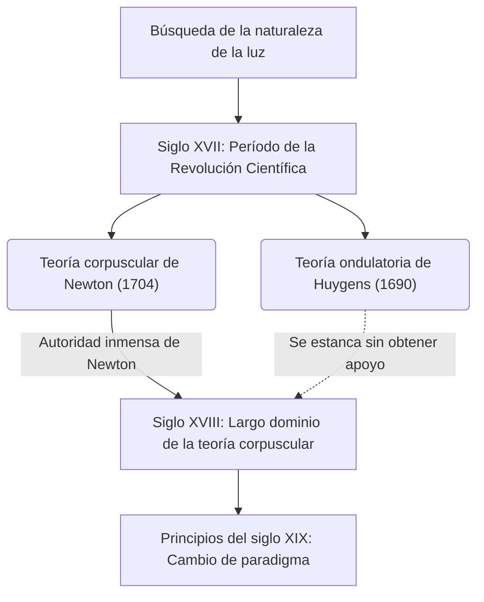
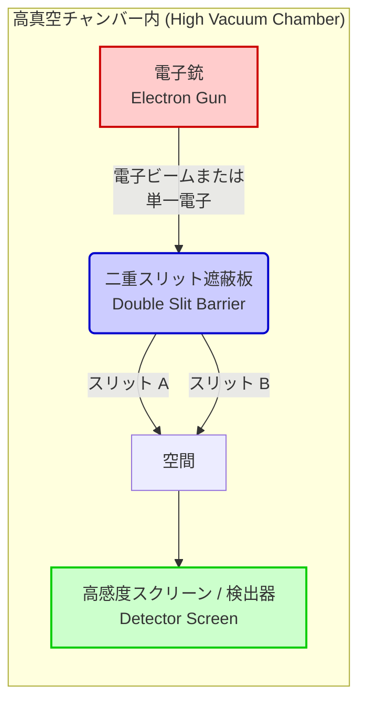

## 1. [Introducción] ¿Qué es el experimento de la doble rendija?

El mundo en el que vivimos parece estar regido por reglas sólidas y establecidas. Una pelota lanzada al aire traza una parábola al caer, y al lanzar una piedra al agua, las ondas se expanden por la superficie. Estas son las leyes del sentido común del "mundo macroscópico" descrito por la física clásica, incluida la mecánica newtoniana, y concuerdan perfectamente con nuestra intuición. Sin embargo, en el momento en que nos adentramos en el "mundo microscópico" —el de los átomos y electrones, las unidades mínimas definitivas que constituyen la materia, o de las partículas de luz (fotones)— ese sentido común se desmorona estrepitosamente. Es un dominio donde nuestros sentidos cotidianos y nuestra intuición no aplican en absoluto, gobernado por reglas extremadamente extrañas e incomprensibles.

Lo que nos enfrenta a la anomalía de este mundo microscópico de la forma más simple e impactante es el "experimento de la doble rendija (Double-slit experiment)". Richard Feynman, el genial físico representativo del siglo XX, dijo sobre este experimento que es "el único misterio de la mecánica cuántica", y además comentó que "todos los misterios de la mecánica cuántica están contenidos en este experimento". Asimismo, muchos físicos destacados no dejan de llamar a este experimento "el experimento más hermoso en la historia de la física". Entonces, ¿por qué un experimento extremadamente simple, que consiste en abrir solo dos rendijas en una placa, es visto de manera tan especial y sigue cautivando a los científicos?

### El mundo macroscópico y microscópico que desafía la intuición

Primero, imaginemos un fenómeno en el mundo macroscópico, donde nuestra intuición funciona con precisión.
Por ejemplo, supongamos que hay una máquina que dispara sucesivamente pequeñas pelotas cubiertas de pintura (o bien pueden ser balas de una ametralladora) contra una pared. Delante de ella, se coloca una placa de hierro con dos rendijas largas y estrechas (aberturas) dispuestas una al lado de la otra. Si disparamos las pelotas al azar, solo aquellas que pasen por alguna de las rendijas chocarán contra la pared del fondo, dejando una marca de tinta. Como resultado, en la pared deberían aparecer marcas en forma de "dos líneas verticales" con la misma forma que las dos rendijas frontales. Este es el comportamiento como "partículas" de las pelotas con una trayectoria clara, y es un resultado natural que cualquiera puede predecir intuitivamente.

A continuación, consideremos el caso de una "onda". Colocamos una barrera con dos rendijas dentro de un tanque de agua y generamos olas desde un lado. Cuando las olas alcanzan las dos rendijas, las atraviesan y, utilizando cada rendija como una nueva fuente de ondas, se expanden hacia el fondo como dos olas semicirculares. Luego, cuando estas dos olas chocan entre sí, ocurre un fenómeno llamado "interferencia". Los lugares donde las crestas de las olas se superponen se convierten en olas más altas, y los lugares donde se superponen una cresta y un valle se anulan mutuamente, volviéndose planos. Como resultado, en la pared del fondo (o en la orilla) se forma un hermoso patrón de franjas llamado "patrón de interferencia", donde se alternan áreas en las que las olas golpean con fuerza y áreas en las que no golpean en absoluto. Esta también es una propiedad básica de las ondas que se puede observar a diario en la superficie del agua o en las ondas sonoras.

Hasta aquí no hay nada extraño. Si lanzas partículas, se forman "dos líneas", y si envías ondas, se forma un "patrón de interferencia". Este es el sentido común del mundo en el que vivimos y la premisa de la física clásica.

### Resumen del experimento y la razón por la que se le llama "el experimento más hermoso"

Sin embargo, cuando se realiza un experimento con exactamente la misma estructura utilizando entidades microscópicas como la luz o los electrones, la situación cambia drásticamente y la intuición humana es traicionada por completo.
Repasando la historia, en 1801, el físico inglés Thomas Young realizó por primera vez este experimento de la doble rendija utilizando luz solar (el experimento de Young). En esa época, la teoría de que la luz era una "partícula", propuesta por Newton, era la predominante; sin embargo, como resultado del experimento de Young, apareció un hermoso "patrón de interferencia" en la pantalla. Esto proporcionó evidencia concluyente de que "la luz es una onda", y pareció poner fin, al menos temporalmente, a un largo debate.

El verdadero misterio, y el mayor cambio de paradigma en la física, comienza aquí. Al entrar en el siglo XX, con el asombroso avance de las técnicas experimentales, se hizo posible disparar luz o electrones "uno por uno". Un electrón es, sin lugar a dudas, una "partícula" clara que tiene masa y ocupa una posición específica en el espacio. Se dispara un solo electrón desde un cañón de electrones y, tras pasar por la doble rendija, llega a algún lugar de la pantalla como un único punto luminoso. En este momento, a juzgar por las marcas que impactan en la pantalla, el electrón se comporta indudablemente como una partícula.
Luego, se repite esta "emisión de electrones uno por uno" miles y decenas de miles de veces, una cantidad de veces abrumadora. Dado que los electrones siempre vuelan solo uno por uno, es físicamente imposible que choquen con otros electrones en el aire e interfieran como una onda. Naturalmente, todos pensaron que en la pantalla surgirían "dos líneas" correspondientes a la forma de las rendijas, igual que cuando se lanzaban las pelotas.

Sin embargo, a medida que innumerables puntos de electrones se acumulaban en la pantalla, lo que surgió allí fue un patrón increíble. Era el "patrón de interferencia" que se suponía que solo aparecía cuando las ondas chocaban entre sí.

¿Cómo es posible que electrones, que se supone son "partículas" disparadas una por una, se comporten misteriosamente como una "onda" en su conjunto, interfieran consigo mismos y dibujen un patrón de franjas? ¿Qué significa esto exactamente? Es como si un solo electrón disparado se expandiera por el espacio como una onda, atravesara simultáneamente las dos rendijas, causara autointerferencia y, en el momento de chocar con la pantalla, reapareciera nuevamente como una sola partícula.
Para hacerlo aún más extraño, tan pronto como los científicos instalaron detectores (algo parecido a cámaras) junto a las rendijas para comprobar "por qué rendija pasaba el electrón", el electrón perdió repentinamente sus propiedades de onda, y en la pantalla aparecieron simples "dos líneas" en lugar de un patrón de interferencia. Este fenómeno de cambiar de comportamiento cuando es "observado" sumergió a los físicos en un vórtice de confusión aún mayor.

La principal razón por la que el experimento de la doble rendija es llamado "el experimento más hermoso de la física" es que, sin utilizar aceleradores a gran escala ni fórmulas matemáticas extremadamente complejas, saca a la luz un misterio fundamental del universo con una configuración sumamente sencilla y elegante: solo dos aberturas y una pantalla. Nos muestra vívida y visualmente el momento en que el sentido común del mundo macroscópico colapsa de manera espectacular. No se limita a una simple confirmación de un fenómeno físico, sino que continúa planteándonos preguntas filosóficas y epistemológicas extremadamente profundas: "¿Qué es la realidad?", "¿Existe verdaderamente de forma objetiva este mundo que 'vemos'?". En este único y sencillo experimento se condensan los límites del intelecto humano y el infinito romance de la ciencia por intentar superarlos.
## 2. [Historia] ¿Es la luz una onda o una partícula? La trayectoria de un debate interminable

Desde que la humanidad tomó conciencia de la existencia de la "luz", la exploración sobre su verdadera naturaleza nunca ha cesado. Desde la época de la antigua Grecia, filósofos y matemáticos como Empédocles y Euclides han reflexionado sobre los mecanismos de la luz y la visión, pero el enfoque serio desde la ciencia moderna comenzó en el siglo XVII. El debate sobre "si la luz es una partícula o una onda", que se inició en esta época, dividió a la comunidad de la física durante más de 300 años, y finalmente se convirtió en la fuerza motriz que abrió la puerta a una física completamente nueva: la mecánica cuántica. En esta sección, trazaremos en detalle la trayectoria de esta épica historia de la ciencia.

### 2.1 La teoría corpuscular de Newton vs La teoría ondulatoria de Huygens: El choque del siglo XVII

A finales del siglo XVII, en medio de la revolución científica, se presentaron dos poderosas teorías sobre la verdadera naturaleza de la luz. Estas fueron la "teoría corpuscular (Corpuscular theory)" de Isaac Newton y la "teoría ondulatoria (Wave theory)" de Christiaan Huygens.

#### La teoría corpuscular de Newton
Isaac Newton, la estrella gigante de la física moderna conocida por la ley de la gravitación universal, entre otras, consideró que la luz era un conjunto de partículas extremadamente pequeñas (corpúsculos). En su artículo de 1672 y en su obra principal de 1704, "Óptica (Opticks)", Newton explicó brillantemente la propiedad de la luz de viajar en línea recta y la ley de la reflexión en los espejos utilizando un modelo mecánico de partículas rebotando en una pared. Además, en cuanto al fenómeno de la separación de la luz blanca en siete colores a través de un prisma (dispersión), argumentó que las luces de diferentes colores eran partículas de diferentes masas, y que por eso sus índices de refracción variaban al pasar por un medio.
Newton señaló respecto a la teoría ondulatoria que "si la luz fuera una onda como el sonido, debería rodear la parte posterior de los obstáculos (fenómeno de difracción), pero la luz viaja en línea recta y crea sombras nítidas", negando así que fuera una onda.

#### La teoría ondulatoria de Huygens
Por otro lado, el destacado físico holandés Christiaan Huygens, en su "Tratado sobre la luz (Treatise on Light)" publicado en 1690, argumentó que la luz era una onda (onda longitudinal) que se propagaba a través de un medio elástico llamado "éter" que llenaba el espacio del universo. Huygens propuso el famoso "Principio de Huygens (Huygens' Principle)", que postula que "todos los puntos de un frente de onda se convierten en fuentes de nuevas ondas secundarias", y explicó geométricamente y de manera magistral las leyes de la propagación en línea recta, la reflexión y la refracción de la luz.
Especialmente en lo que respecta a la refracción, Newton predijo que "cuando la luz entra en un medio denso como el agua o el vidrio, la velocidad de la luz aumenta porque las partículas se aceleran debido a la atracción", pero la teoría ondulatoria de Huygens concluyó que "en los medios densos, la velocidad de propagación de la onda disminuye", lo que hizo que ambos se enfrentaran frontalmente.

Sin embargo, debido a la autoridad absoluta e influencia de Newton en la comunidad científica de la época, la teoría ondulatoria de Huygens se desvaneció gradualmente, y la teoría corpuscular de Newton continuó reinando como la corriente principal a lo largo de todo el siglo XVIII.

## 2.2 El experimento de la doble rendija de la luz de Thomas Young (1801) y el triunfo de la teoría ondulatoria

Al entrar en el siglo XIX, ocurrió un evento decisivo que derribó la fortaleza de la teoría corpuscular que había sido dominante durante mucho tiempo. El protagonista fue el erudito británico Thomas Young. Médico y también contribuyente al desciframiento de los jeroglíficos egipcios (Piedra de Rosetta), Young llevó a cabo un experimento en 1801 que brilla con esplendor en la historia de la física. Este es el "experimento de interferencia de Young (más tarde conocido como el experimento de la doble rendija)".

#### Descubrimiento de los patrones de interferencia
La configuración del experimento de Young era extremadamente simple e ingeniosa. Hizo pasar la luz del sol a través de un agujero muy fino (o rendija) para crear una fuente de luz puntual, y luego hizo que esa luz pasara a través de dos rendijas finas (doble rendija) situadas a una distancia muy cercana entre sí, proyectándola en una pantalla ubicada detrás.
Si la luz fuera puramente una "partícula" como decía Newton, en la pantalla deberían proyectarse dos líneas brillantes correspondientes a la forma de las rendijas. Sin embargo, lo que Young vio en la pantalla fue un patrón de franjas donde se alternaban bandas brillantes y oscuras, es decir, un "patrón de interferencia (Interference fringes)".

Este fenómeno era absolutamente inexplicable a menos que se considerara que la luz era una onda. Cuando dos ondas colisionan en la superficie del agua, en los lugares donde coinciden las crestas de las ondas la altura se incrementa (interferencia constructiva), y en los lugares donde coinciden una cresta y un valle, se anulan mutuamente quedando planas (interferencia destructiva). Young concluyó que las ondas de luz provenientes de las dos rendijas estaban causando interferencias de la misma manera.

#### Respaldo matemático y establecimiento de la teoría ondulatoria
Esta condición de interferencia constructiva y destructiva está determinada por la diferencia en la longitud de las trayectorias (diferencia de camino óptico $\Delta L$) desde las dos rendijas hasta un punto en la pantalla. Si la distancia entre las rendijas es $d$, el ángulo hacia la pantalla es $\theta$, y la longitud de onda de la luz es $\lambda$, la diferencia de camino óptico se expresa de la siguiente manera.

$$ \Delta L = d \sin \theta $$

* **Franja brillante (Condición de interferencia constructiva)**: $\Delta L = m\lambda \quad (m = 0, \pm1, \pm2, \dots)$
* **Franja oscura (Condición de interferencia destructiva)**: $\Delta L = \left(m + \frac{1}{2}\right)\lambda$

El anuncio de Young inicialmente recibió feroces críticas y burlas por parte de los seguidores de Newton en Gran Bretaña. Sin embargo, más tarde en 1815, el francés Augustin-Jean Fresnel construyó una rigurosa teoría matemática de la difracción e interferencia de la luz. Además, en el concurso de la Academia de Ciencias de Francia de 1818, el juez Siméon Denis Poisson (opositor de la teoría ondulatoria) señaló: "Si la teoría de Fresnel es correcta, debería aparecer un punto brillante en el centro de la sombra de un obstáculo circular. Algo tan ridículo es imposible". Sin embargo, cuando Dominique-François-Jean Arago realizó el experimento y observó perfectamente ese "punto de Poisson (punto de Arago)", la exactitud de la teoría ondulatoria se volvió indiscutible.

En 1850, Léon Foucault y otros demostraron experimentalmente que la velocidad de la luz en el agua es más lenta que en el aire, refutando por completo la predicción de Newton. Y en 1864, James Clerk Maxwell estableció la teoría de que "la luz es un tipo de onda electromagnética" como la culminación del electromagnetismo, con lo cual la "teoría ondulatoria" de la luz obtuvo una victoria completa, y la disputa parecía haber concluido.

### 2.3 El resurgimiento de la teoría corpuscular gracias a la hipótesis del cuanto de luz de Einstein (1905)

La teoría de Maxwell de que la luz es una onda electromagnética era tan hermosa que los físicos de finales del siglo XIX creían que "la física está casi completa, y solo queda medir valores numéricos precisos". Sin embargo, desde finales del siglo XIX hasta principios del siglo XX, surgieron fenómenos extraños que no podían explicarse de ninguna manera mediante la teoría ondulatoria. Uno de ellos es el "efecto fotoeléctrico (Photoelectric effect)".

#### El misterio del efecto fotoeléctrico
El efecto fotoeléctrico es el fenómeno por el cual, al iluminar la superficie de un metal, este emite electrones (fotoelectrones). Según el sentido común de la teoría ondulatoria de la época, la energía de la luz (onda) debería ser proporcional a su amplitud (brillo). Por lo tanto, se pensaba que "si se aplica una luz intensa (brillante), los electrones deberían salir despedidos con fuerza sin importar el color de la luz".
Sin embargo, los resultados experimentales traicionaron por completo las predicciones de la teoría ondulatoria.

1. **Existencia de una frecuencia umbral**: Para una luz de una frecuencia (color) inferior a un límite específico (por ejemplo, luz roja), sin importar qué tan intensa (brillante) fuera o cuánto tiempo se aplicara, los electrones no salían expulsados en absoluto.
2. **Inmediatez**: Por el contrario, si la luz tenía una frecuencia superior a la frecuencia umbral (por ejemplo, luz ultravioleta), sin importar qué tan débil fuera, los electrones salían expulsados inmediatamente en el instante en que incidía.
3. **Dependencia de la energía**: La energía cinética de los electrones expulsados no dependía de la intensidad (brillo) de la luz, sino únicamente de la frecuencia (color) de la luz.

#### La dramática solución de Einstein: El cuanto de luz (Fotón)
Quien desentrañó este misterio desesperanzador fue un joven desconocido que trabajaba en una oficina de patentes en Suiza, Albert Einstein. En 1905, conocido como su "año milagroso", aplicó la "hipótesis de la cuantización de la energía" propuesta por Max Planck en su estudio de la radiación térmica (1900) a la luz misma, y publicó la "hipótesis del cuanto de luz (Light quantum hypothesis)".

Einstein asumió audazmente que la luz, que se creía era una onda continua, era en realidad una colección de paquetes de energía, es decir, partículas llamadas "cuantos de luz (Fotón: Photon)". La energía $E$ que posee un cuanto de luz es proporcional a la frecuencia de la luz $\nu$, y se expresa mediante la siguiente fórmula de Planck-Einstein.

$$ E = h\nu $$

(Aquí, $h$ es la constante de Planck, $6.626 \times 10^{-34} \, \text{J}\cdot\text{s}$)

Utilizando esta hipótesis, el misterio del efecto fotoeléctrico se resolvió como por arte de magia.
El efecto fotoeléctrico era un fenómeno parecido al billar, donde "un cuanto de luz" choca con "un electrón" dentro del metal, transfiriéndole toda su energía. Si la energía mínima necesaria para que el electrón escape de la ligadura del metal es la "función de trabajo ($W$)", la energía cinética máxima $E_k$ del electrón expulsado se expresa mediante esta elegante ecuación.

$$ E_k = h\nu - W $$

Si la energía del cuanto de luz $h\nu$ es menor que la función de trabajo $W$ (luz de baja frecuencia), no importa cuántos cientos de miles de cuantos de luz choquen (aunque la luz se haga más intensa), los electrones no pueden salir del metal. Esta es la razón de la frecuencia umbral.

#### Hacia un mundo incomprensible de "ser onda y partícula"
La hipótesis del cuanto de luz de Einstein fue demostrada completamente por el experimento de precisión de Robert Millikan en 1914, y Einstein recibió el Premio Nobel de Física en 1921 por este logro. (Irónicamente, el propio Millikan no creía en la teoría de Einstein al principio y realizó los experimentos para refutarla, pero terminó demostrando su validez). Además, en 1923, Arthur Compton descubrió la "dispersión de Compton", donde la longitud de onda de los rayos X cambia al colisionar con electrones, confirmando que la luz se comporta como una "partícula" con un momento lineal $p = \frac{h}{\lambda}$.

La "teoría corpuscular", que se suponía había sido completamente derrotada por el experimento de Young, experimentó una resurrección milagrosa después de 100 años en una forma más refinada llamada "cuanto".
Sin embargo, esto creó una profunda contradicción. Significa que la luz tiene claramente propiedades ondulatorias, como la "interferencia" mostrada en el experimento de la doble rendija de Young, pero al mismo tiempo posee propiedades de "partícula", como se vio en el efecto fotoeléctrico.

¿La luz es una onda o una partícula?
La respuesta definitiva de la física a esta pregunta fue: "La luz no es ninguna de las dos, y es ambas a la vez. La luz es una entidad cuántica que posee conjuntamente las 'propiedades de onda' y las 'propiedades de partícula'", algo que va violentamente en contra de la intuición humana. Este fue el nacimiento de la "dualidad onda-partícula (Wave-particle duality)".
Y este concepto de dualidad comenzó a aplicarse no solo a la luz, sino a la materia misma, como los electrones (ondas de materia de de Broglie), y la física se adentró en un abismo sin precedentes, el mundo extraño y fascinante de la "mecánica cuántica". El escenario más emblemático de esto es el "experimento de la doble rendija cuántico", actualizado a su versión moderna.

## 3. [Transición] ¿La materia también es una onda? Las ondas de de Broglie y el experimento de la doble rendija con electrones

Con la hipótesis del cuanto de luz de Einstein (1905) de que la luz "es una onda y también una partícula", el mundo de la física se vio sumido en una gran confusión y un cambio de paradigma. A pesar de que durante muchos años, el experimento de interferencia de Young y el electromagnetismo de Maxwell habían hecho creer que "la luz es absolutamente una onda", fenómenos como el efecto fotoeléctrico no podían explicarse a menos que se pensara en la luz como una "partícula (fotón)". Inicialmente se pensaba que esta extraña propiedad de "dualidad onda-partícula" era algo peculiar y exclusivo de la luz. Sin embargo, en la década de 1920, este concepto de dualidad no se limitó al mundo de la luz, sino que mostró sus garras sobre la misma "materia" que compone nuestros cuerpos.

### 3.1. La propuesta de las ondas de materia de Louis de Broglie: Un salto a partir de una hermosa simetría

En 1924, Louis de Broglie, un joven estudiante de posgrado francés, propuso en su tesis doctoral una hipótesis extremadamente audaz que sacudió los cimientos de la historia de la física. Decía: "Si la luz (que se consideraba una onda) tiene propiedades de partícula, por el contrario, ¿no tendría también la materia como los electrones (que se consideraban partículas) propiedades de onda?".

La intuición filosófica de de Broglie de que la naturaleza siempre prefiere la simetría estaba en la base de esta hipótesis. Él aplicó audazmente a las partículas de materia con masa las ecuaciones de relación entre energía y momento lineal que Einstein había deducido en la teoría de la relatividad especial y la hipótesis del cuanto de luz. El momento lineal del fotón $p$ se expresa utilizando la constante de Planck $h$ y la longitud de onda $\lambda$ como $p = h / \lambda$. De Broglie invirtió esto, y expresó la longitud de onda $\lambda$ de la onda asociada a una partícula que tiene una masa $m$ y se mueve con una velocidad $v$ (momento lineal $p = mv$) con la siguiente fórmula matemática muy simple.

$$ \lambda = \frac{h}{p} = \frac{h}{mv} $$

Esta es la famosa fórmula de la "longitud de onda de de Broglie (longitud de onda de la onda de materia)". Esta fórmula significa que cualquier cosa que se mueva, desde las pelotas de béisbol o los automóviles que vemos en nuestra vida diaria, hasta los minúsculos electrones, lleva consigo la naturaleza de una "onda". Entonces, ¿por qué no vemos que una pelota de béisbol interfiera o se difracte como una onda en nuestra vida cotidiana? Eso se debe a que la constante de Planck $h$ (aproximadamente $6.626 \times 10^{-34} \text{ J}\cdot\text{s}$) es extremadamente pequeña. En los objetos macroscópicos, dado que la masa $m$ es demasiado grande, la longitud de onda de de Broglie $\lambda$ se vuelve tan pequeña que prácticamente puede considerarse nula, y la naturaleza ondulatoria queda completamente oculta. Sin embargo, en el mundo de los electrones, donde la masa es extremadamente pequeña, esta longitud de onda alcanza una escala comparable a la longitud de onda de los rayos X (ondas electromagnéticas) (aproximadamente $0.1 \text{ nm}$, etc.), manifestándose con una magnitud que de ninguna manera puede ser ignorada.

Este trabajo de de Broglie estaba tan fuera del sentido común que desconcertó enormemente a los jueces de la época. Sin embargo, cuando Paul Langevin, uno de los miembros del tribunal, envió esta tesis a Einstein, este último la elogió inmensamente diciendo: "Él ha levantado la esquina de un gran velo". Esto hizo que el concepto de las "ondas de materia (matter wave)" de de Broglie atrajera la atención mundial, conectando directamente con la posterior culminación de la mecánica ondulatoria por parte de Schrödinger.

### 3.2. El experimento de Davisson-Germer: La demostración de la naturaleza ondulatoria de la materia

Aunque la hipótesis de de Broglie era hermosa como teoría, se necesitaba la confirmación experimental para saber si describía el mundo natural real. "Si los electrones son realmente ondas, deberían producir fenómenos propios de las ondas, como la 'difracción' y la 'interferencia'". Con esta convicción, físicos de todo el mundo comenzaron a experimentar para capturar la naturaleza ondulatoria de los electrones.

Finalmente, en 1927 se obtuvo la prueba decisiva. Se trató del "experimento de Davisson-Germer", realizado por Clinton Davisson y Lester Germer, físicos de los Laboratorios Bell de los Estados Unidos.

Al principio, ellos estaban realizando el experimento con un propósito diferente: disparar un haz de electrones sobre un cristal de níquel para examinar cómo se dispersaba. Sin embargo, al calentar el níquel a altas temperaturas para reparar un accidente durante el experimento (la oxidación de la superficie del níquel debido a la rotura del tubo de vacío), tuvieron la suerte de que el níquel se recristalizara accidentalmente en un monocristal. Cuando dispararon nuevamente el haz de electrones a este níquel monocristalino, se observó un fenómeno sorprendente. La intensidad de los electrones dispersados presentaba un valor máximo en un ángulo específico, mostrando un claro "patrón de difracción".

La distancia regular entre los átomos en el cristal (constante de red) es de una escala casi idéntica a la longitud de onda de de Broglie del electrón. Es decir, el cristal de níquel en sí funcionó como una "red de difracción natural" para los electrones. El resultado de la longitud de onda de los electrones calculada por Davisson y Germer a partir de este patrón de difracción coincidió perfectamente con el valor predicho por la fórmula de de Broglie $\lambda = h/p$. Ese mismo año, el británico George Paget Thomson (hijo del descubridor del electrón, J.J. Thomson) también logró observar anillos de difracción (anillos de Debye-Scherrer) producidos por un haz de electrones que atravesaba una fina lámina de metal.

Estos resultados experimentales se presentaron a la comunidad física como un hecho irrefutable de que la materia tiene la naturaleza de una onda. El electrón, que se suponía era una partícula, se comporta como una onda. Fue el momento en el que se reveló esta profunda verdad natural, y fue la fanfarria que anunció los albores de la mecánica cuántica. De Broglie recibió el Premio Nobel de Física en 1929, y Davisson y Thomson lo recibieron en 1937.

### 3.3. El experimento decisivo de la doble rendija de Hitachi (Akira Tonomura y colegas, 1989)

Incluso después de que se demostrara que los electrones son ondas, la búsqueda de los físicos no se detuvo. Intentaron llevar a la realidad, y con la máxima precisión, el "experimento de la doble rendija con electrones", que hasta entonces había sido discutido solo como un experimento mental.

Al igual que en el experimento de la doble rendija de la luz (el experimento de Young), si se disparan electrones hacia una doble rendija, deberían aparecer franjas de interferencia en una pantalla situada detrás. Sin embargo, aquí es donde asoma la paradoja más incomprensible de la mecánica cuántica. "¿Qué pasaría si los electrones no se dispararan en grandes cantidades a la vez, sino que se dispararan **uno por uno**?"

Un solo electrón es una partícula indivisible. Por lo tanto, solo debería poder atravesar una de las dos rendijas, ya sea la izquierda o la derecha. Los electrones que llegan a la pantalla uno por uno solo dejarán un punto luminoso en la pantalla. Cuando se repite esto decenas de miles de veces, ¿la acumulación de puntos se convertirá en la simple sombra de dos rendijas (dos líneas), o se convertirá en un patrón de interferencia que muestra las propiedades de una onda?

Frente a esta pregunta definitiva, fue un equipo de investigación del Laboratorio de Investigación Básica de Hitachi en Japón (liderado por el Dr. Akira Tonomura) el que superó las barreras técnicas y ofreció la respuesta más hermosa y perfecta del mundo. En 1989, utilizando de manera experta la tecnología de holografía de electrones y técnicas de microscopía electrónica de ultra alto vacío y temperaturas criogénicas, tuvieron un éxito rotundo en el "experimento de interferencia con biprisma de un solo electrón".

La configuración del experimento era asombrosa. Redujeron al máximo la cantidad de electrones emitidos por el cañón de electrones, creando un estado en el que "solo hay un electrón en el aparato en todo momento" mientras el electrón volaba por el espacio. La velocidad de los electrones alcanzaba aproximadamente los 150.000 kilómetros por segundo, por lo que el tiempo necesario para volar la distancia desde la fuente hasta el detector era solo un instante. El siguiente electrón no se disparaba hasta mucho después de que el electrón anterior hubiera llegado a la pantalla.

Al comenzar el experimento, en el detector (monitor) empezaron a aparecer puntos luminosos de forma aislada, indicando la llegada de los electrones. En la etapa de los primeros pocos o cientos, no parecía haber más que puntos dispersos aleatoriamente en la pantalla. Al igual que las estrellas en el cielo nocturno, parecía que no había ningún orden.

Sin embargo, a medida que se iban acumulando miles y decenas de miles de electrones, surgió ante los ojos de todos una visión impactante y asombrosa. El conjunto de puntos, que antes parecía desordenado, comenzó a formar gradualmente un patrón regular de franjas claras y oscuras: un inconfundible "patrón de interferencia".

El significado de este resultado iba violentamente en contra de la intuición. El electrón definitivamente está llegando a la pantalla como "una sola partícula" (razón por la cual se registra un solo punto). Sin embargo, el hecho de que en conjunto formen un patrón de interferencia solo puede interpretarse como que ese único electrón "pasó simultáneamente a través de ambas rendijas (a ambos lados del biprisma) como una onda, e interfirió consigo mismo". Un solo electrón solitario, que no interactúa con nada más, causa interferencia consigo mismo. El mismo principio del que habló Dirac cuando dijo que "el fotón solo interfiere consigo mismo" se demostró perfectamente también en el electrón, una partícula material con masa.

Este experimento realizado por el Dr. Akira Tonomura y su equipo fue aclamado mundialmente como la demostración más visual y directa de la extrañeza de la mecánica cuántica, es decir, de la "dualidad onda-partícula". Era natural que en una encuesta entre los lectores de la revista científica británica "Physics World" en 2002 para elegir el "experimento más hermoso en la historia de la física", este "experimento de la doble rendija con electrones" obtuviera con orgullo el primer puesto.

Así es como la descabellada hipótesis de de Broglie de que "la materia es una onda", más de 60 años después, reveló su verdadera cara ante nuestros ojos como el misterioso patrón de interferencia dibujado por electrones individuales. Sin embargo, este experimento, al mismo tiempo que resolvía el misterio de la mecánica cuántica, abría la puerta a un misterio aún más profundo, a saber, el "problema de la medición". "Cuando intentamos ver por qué rendija pasó, el patrón de interferencia desaparece" — en el próximo capítulo, nos adentraremos aún más en este abismo del extraño mundo cuántico.
## 4. [Métodos y resultados del experimento] ¿Qué sucede exactamente?

(Para llegar al núcleo del experimento de la doble rendija y asomarnos al abismo de la mecánica cuántica, nos centraremos aquí en experimentos que utilizan "electrones" en lugar de luz. Fenómenos similares se han confirmado con fotones y otras partículas elementales, e incluso con moléculas relativamente grandes como los fullerenos, pero el uso de electrones, que tienen masa y reconocemos como "claramente partículas de materia", resalta aún más la paradoja y el asombro de este fenómeno).

### 4.1 Configuración del experimento: El escenario para capturar el mundo microscópico

En primer lugar, veamos en detalle cómo se configura el escenario (montaje) de este experimento histórico e innovador. La estructura conceptual del experimento de la doble rendija es sorprendentemente simple, pero detrás de su éxito como experimento físico real, se requiere tecnología avanzada y un control ambiental extremadamente estricto.

El equipo experimental consta principalmente de los siguientes 3 componentes principales. Todos ellos están herméticamente sellados y colocados dentro de una cámara de vacío avanzada para evitar la dispersión de los electrones debido a colisiones con las moléculas de aire.

1. **Cañón de electrones (Electron Gun)**:
   Es el dispositivo para disparar los "electrones", que son los protagonistas del experimento. Utiliza el principio de calentar un filamento para emitir electrones térmicos o utilizar un fuerte campo eléctrico para extraer electrones, y dispara electrones con una cierta energía cinética en una dirección determinada. Lo que es extremadamente importante en este experimento es que los electrones se pueden disparar continuamente como un poderoso "haz", como una cascada, o, sorprendentemente, la salida se puede reducir al límite y controlar para disparar "exactamente de uno en uno". Esta "tecnología de emisión de un solo electrón" es una de las tecnologías sofisticadas indispensables en los experimentos modernos de mecánica cuántica.

2. **Doble rendija (Double Slit)**:
   Es una placa de blindaje (pared) con dos rendijas (ranuras) extremadamente estrechas y paralelas a una distancia extremadamente corta por donde pasan los electrones disparados desde el cañón de electrones. Dado que la longitud de onda de la "onda de materia (onda de de Broglie)" de los electrones es muy corta, el ancho de estas rendijas y la distancia entre ellas también deben fabricarse con precisión en tamaños microscópicos a escala nanométrica (una milmillonésima de metro) a micrométrica. Si el ancho de las rendijas o la distancia entre ellas es demasiado grande para la longitud de onda del electrón, será imposible observar claramente la "interferencia", que es una propiedad de las ondas. La tecnología misma para fabricar estas diminutas dobles rendijas puede considerarse una cristalización de tecnologías de microfabricación de vanguardia, como los sistemas de litografía por haz de electrones.

3. **Pantalla (Detector, Screen / Detector)**:
   Es una pantalla de observación a la que los electrones que han pasado a través de la doble rendija finalmente llegan, y donde se registra su posición. En los experimentos del pasado se utilizaban placas fotográficas fotosensibles, pero en la actualidad se utilizan cámaras CCD de alta sensibilidad, pantallas fluorescentes o detectores especiales de píxeles semiconductores. Esto permite registrar con extremada precisión en coordenadas bidimensionales "dónde ha llegado (impactado)" cada electrón por cada disparo. Cuando el electrón choca contra la pantalla, emite una luz diminuta o genera una señal eléctrica, dejando un rastro claro (punto) de que "definitivamente llegó aquí como una sola partícula".

La siguiente figura es una representación esquemática de la disposición general de este dispositivo experimental y la trayectoria de los electrones.

### 4.2 Al aplicar una gran cantidad de electrones: Un comportamiento ondulatorio que desafía la intuición (formación de un patrón de interferencia)

Ahora, finalmente comenzamos el experimento. Como primer paso, aumentamos la potencia del cañón de electrones y disparamos "una gran cantidad de electrones" a la vez hacia la doble rendija, de forma continua, como una ducha o una ametralladora.

Si pensamos desde el sentido común de la física clásica que tenemos a diario, el electrón es una "partícula (como una pequeña bala)" con masa. Por lo tanto, se esperaría que una gran cantidad de electrones que pasan a través de las dos rendijas colisionen intensamente en dos lugares de la pantalla ubicados en la extensión rectilínea de cada rendija, formando un patrón similar a "dos franjas verticales". Imagine que rocía pintura con spray a través de una plantilla con dos aberturas. La pintura que pasa a través de los huecos debería dibujar dos líneas en la pared de la forma de dichos huecos.

Sin embargo, el patrón que realmente aparece en la pantalla desafía por completo nuestra intuición y nuestras predicciones. En la pantalla no se forman dos simples franjas verticales, sino **múltiples franjas de luz y oscuridad (patrón de interferencia: Interference Pattern)** claramente definidas.

Este "patrón de interferencia" tiene exactamente las mismas características geométricas que el patrón formado por la superposición de las ondas creadas al arrojar dos piedras simultáneamente a la superficie de un estanque, o el patrón visto en los experimentos de interferencia de la luz.
- En **los lugares donde se superponen crestas y crestas o valles y valles de las ondas (interferencia constructiva)**, se forman franjas "brillantes (alta densidad de colisión de electrones)" a las que llegan muchos electrones.
- En **los lugares donde se superponen las crestas y los valles de las ondas (interferencia destructiva)**, las ondas se anulan entre sí, creando franjas "oscuras (la densidad de colisión de electrones es casi cero)" a las que prácticamente no llega ningún electrón.

Solo hay una conclusión que este resultado implica. Y es que **"los electrones se comportan como ondas"** . El enjambre de electrones emitido por el cañón de electrones viaja por el espacio como ondas en el agua y atraviesa las dos rendijas "al mismo tiempo". Y solo podemos interpretarlo en el sentido de que la onda que se difractó y propagó desde la rendija A, y la onda que se difractó y propagó desde la rendija B, se superponen en el espacio justo frente a la pantalla y causan interferencia para crear ese patrón característico de franjas de luz y oscuridad.

El electrón, que se creía firmemente que era una "partícula", de hecho tiene al mismo tiempo propiedades de "onda" (dualidad onda-partícula). Este hecho por sí solo es un gran descubrimiento histórico en la física y ya es bastante sorprendente, pero el verdadero misterio de la mecánica cuántica y el fenómeno que anulará por completo nuestro sentido común se profundiza un paso más a partir de aquí.

### 4.3 Cuando los electrones se disparan "de uno en uno": La verdadera naturaleza de la "onda de probabilidad" revelada por el experimento extremo

"Dado que disparan una gran cantidad de electrones al mismo tiempo, ¿no podría ser que los electrones estén chocando entre sí en el aire, o repeliéndose con fuerza eléctrica (fuerza de Coulomb), y que eso esté creando simplemente un patrón similar al de las ondas?"
Plantearse esto es una duda muy natural para un científico. De hecho, cuando se descubrió por primera vez el patrón de interferencia, muchos físicos pensaron eso e intentaron interpretar el fenómeno clásicamente.

Para zanjar completamente esta cuestión, la tecnología experimental avanzó y se llevó a cabo un experimento aún más decisivo. (En Japón, el experimento realizado en 1989 por el grupo de Akira Tonomura de Hitachi es muy famoso y es aclamado como uno de los experimentos más hermosos del mundo).
Ese es el experimento de **reducir al límite la potencia del cañón de electrones y disparar los electrones "exactamente de uno en uno"**.

Específicamente, verificamos que el electrón anterior ha sido disparado y llegado a la pantalla, desapareciendo (o siendo absorbido) por completo antes de disparar el siguiente electrón nuevo. Repetimos esto un número asombroso de veces: decenas de miles, cientos de miles de veces. En esta configuración, se garantiza que "solo un electrón existe a la vez" en el espacio dentro del dispositivo experimental. Por lo tanto, es físicamente 100% imposible que los electrones choquen en el aire o interfieran entre sí.

Sigamos los resultados experimentales de un solo electrón en este estado extremo, a lo largo del tiempo (número acumulado de electrones).

**Paso 1: Inmediatamente después del inicio del experimento (decenas a cientos de electrones)**
En la pantalla, poco a poco, aparecen puntos en posiciones completamente aleatorias. En el momento de llegar a la pantalla, los electrones muestran claramente su naturaleza como "una partícula", registrando un solo punto en unas coordenadas microscópicas específicas. En este punto, no se observa ninguna regularidad en el patrón de la pantalla; solo parece una colección caótica y aleatoria de puntos. Es como si lanzaras dardos al azar con los ojos vendados.

**Paso 2: Después de que han llegado de varios miles a decenas de miles de electrones**
A medida que pasa el tiempo, se repite el experimento y se acumulan miles y decenas de miles de puntos en la pantalla, comienza a ocurrir un fenómeno extraño. Dentro de la distribución de los puntos, que creíamos completamente aleatoria, comenzamos a ver gradualmente un "sesgo" o "sombras". Las áreas densamente pobladas por puntos y las áreas donde casi no hay impactos empiezan a diferenciarse ligeramente.

**Paso 3: Al finalizar el experimento (han llegado cientos de miles o más electrones)**
Después de mucho tiempo disparando electrones, uno por uno, en una cantidad asombrosa (cientos de miles a millones) en una labor tediosa, miramos la imagen acumulada en toda la pantalla... y allí, emerge claramente el mismo hermoso **"patrón de interferencia"** que cuando se dispararon todos esos electrones a la vez.

Este es uno de los resultados más asombrosos, contraintuitivos, pero a la vez hermosos y profundos en la historia de la física.

Esto es porque los electrones fueron disparados "completamente de uno en uno". Es absolutamente imposible que hayan interactuado con los electrones anteriores o posteriores. A pesar de esto, el hecho de que finalmente se forme un patrón de franjas que muestra la interferencia de ondas significa que debemos aceptar la increíble conclusión de que **"un solo electrón está interfiriendo consigo mismo"**.

Si tratamos de explicar lógicamente este fenómeno, nuestro sentido común del espacio y la materia cotidiano colapsa por completo.
Un solo electrón, después de ser disparado desde el cañón de electrones, se expande por todo el espacio como si fuera una "onda", **atraviesa tanto la rendija derecha como la izquierda "al mismo tiempo"**, y luego interfiere con "su propia onda" justo frente a la pantalla, y en el momento en el que llega a la pantalla y es observado, colapsa (se determina) de nuevo como "una sola partícula" en un punto.

Entonces, ¿cuál es exactamente la entidad real de esta "onda" que transmite a este único electrón a través del espacio?
En la mecánica cuántica, esta no es una onda sustancial en la que un medio físico, como la superficie del agua o el aire, ondule. Según la interpretación propuesta por Max Born, se trata de **"una onda que representa la 'probabilidad' de que el electrón exista en una ubicación particular en el espacio (onda de probabilidad)"**. Matemáticamente, a esto se le llama "función de onda".

Los electrones no vuelan en línea recta a lo largo de una trayectoria (ruta) específica como la bola del pinball (pachinko). Desde el momento en que se dispara el electrón hasta que llega a la pantalla, se expande por el espacio como un estado en el cual el "estado de haber atravesado la rendija derecha" y el "estado de haber atravesado la rendija izquierda", e incluso el "estado de viajar por cualquier ruta en el espacio", se encuentran en un "estado superpuesto (estado de superposición)" con varias probabilidades.

Y en el momento en que el electrón choca con un instrumento de observación como la pantalla, y se mide "dónde llegó", la onda de probabilidad que se extendía en el espacio colapsa instantáneamente en un solo punto (colapso de la función de onda), y la posición real de la partícula que "estaba aquí" se determina por primera vez.

La "parte brillante (la parte donde se concentran muchos puntos al final)" del patrón de interferencia es el lugar donde la probabilidad de que el electrón exista ha aumentado debido a la interferencia de las ondas, y la "parte oscura (la parte donde no se acumulan puntos)" significa el lugar donde las ondas de probabilidad se anularon entre sí y se convirtieron en cero. Así como la probabilidad de que salga cada cara se acerca a su valor teórico (1/6) cuando lanzas un dado repetidas veces, la "conducta probabilística" de cada electrón individual se repite cientos de miles de veces, permitiendo que la forma de la onda de probabilidad (el patrón de interferencia) surja como un patrón en la realidad.

"Un electrón pasa a través de las dos rendijas al mismo tiempo", "el estado no se determina hasta que se observa, y solo existe como una onda de probabilidad donde se superponen innumerables posibilidades".
Este hecho experimental frío presentado por el experimento de la doble rendija nos plantea profundas preguntas filosóficas, más allá del ámbito de la física, como: "¿Qué significa realmente existir?" y "¿Qué diablos es esta realidad que reconocemos?".

## 5. [Problema de la medición] El comportamiento cuántico cambia cuando se observa

Aquí es donde yace el núcleo de por qué el experimento de la doble rendija en la mecánica cuántica no solo ha tenido un inmenso impacto en la física, sino también en las áreas de la filosofía y el pensamiento, y se le llama el experimento más hermoso y, al mismo tiempo, más espeluznante en la historia de la ciencia. Esto se debe al hecho sorprendente de que el mero acto de la "observación (medición)" altera decisivamente el resultado del fenómeno físico.

En el mundo cotidiano (macroscópico) en el que vivimos, es decir, el mundo regido por la física clásica, el acto de "mirar" no es más que una acción pasiva. Miremos o no la luna flotando en el cielo nocturno, la luna existe firmemente allí, moviéndose de acuerdo a las leyes de Newton en una trayectoria constante. La trayectoria de la luna no cambiará porque la estemos mirando. Nuestro sólido sentido común es que la presencia de un observador no tiene ningún efecto sobre la realidad objetiva de los objetos que se observan.

Sin embargo, en el mundo microscópico de la cuántica, este sentido común es volcado desde la base. El acto de "ver (observar)" no es la mera recepción de información, sino un proceso activo que causa una influencia irreversible y decisiva sobre el objeto. En el instante en que el observador lanza naturalmente una pregunta, la naturaleza cambia su comportamiento. En esta sección, profundizaremos con mucho detalle sobre el mayor misterio en el experimento de la doble rendija, y un tema que aún se discute en la física moderna: el "problema de la medición (Measurement Problem)".

### ¿Qué ocurre cuando "observamos" por qué rendija pasó?

Imagine el proceso de disparar partículas cuánticas una por una, como electrones, fotones, o incluso moléculas grandes como el fullereno (C60), pasando a través de dos rendijas y llegando a la pantalla. Como vimos antes, incluso si disparamos entidades cuánticas una por una dejando un espacio, al observar los puntos de impacto brillantes acumulados en la pantalla durante un largo periodo de tiempo, hemos confirmado que se forma un hermoso patrón de interferencia (prueba que demuestra las propiedades de onda). Esto se interpreta como el resultado de una partícula cuántica que viaja por el espacio como una superposición de dos estados: "la posibilidad de pasar por la rendija derecha" y "la posibilidad de pasar por la rendija izquierda (Superposición)", y su propia onda de probabilidad interfiere consigo misma.

Sin embargo, aquí los físicos tuvieron una pregunta natural, pero en el mundo de la mecánica cuántica era una pregunta diabólica. "¿Las partículas cuánticas están atravesando realmente 'ambas rendijas al mismo tiempo'? ¿O 'en realidad solo pasan a través de una de las rendijas, pero no lo sabemos'? Coloquemos una cámara al lado de las rendijas y veámoslo".

Para responder a esta pregunta, añadiremos un solo cambio al equipo experimental. Colocaremos un "detector (instrumento de observación)" altamente sensible justo al lado de las rendijas. Este detector tiene el propósito de "observar" y registrar si el electrón pasó por la rendija derecha o la izquierda. El montaje del experimento es completamente el mismo, con excepción de añadir el detector. Se disparan electrones uno a uno. El detector funciona perfectamente y nos informa exactamente de la información del recorrido del electrón (Which-path information): "pasó por la derecha" o "pasó por la izquierda". Como era de esperar, se confirma que la mitad de los electrones pasaron por la derecha y la otra mitad pasaron por la izquierda. Esto satisface nuestra intuición. "Qué cosas, después de todo los electrones, como partículas, simplemente estaban pasando por uno solo de los agujeros. La superposición era solo una ilusión".

Sin embargo, al revisar el patrón de distribución de los electrones que llegaron finalmente a la pantalla, los físicos se quedaron sin palabras. Lo que aparecía allí dibujado ya no era el hermoso patrón de interferencia que mostraba las propiedades de onda, sino simplemente "dos líneas (o dos picos)". Este es exactamente el mismo patrón que se forma al lanzar partículas clásicas, como pelotas de béisbol o piedras, a las rendijas. La "interferencia de ondas", que es indispensable para la formación del patrón de interferencia, había desaparecido por completo.

En el momento en que intentamos observar "por dónde pasó", el electrón abandonó su naturaleza de onda (estado superpuesto) y comenzó a comportarse como una pura partícula clásica. Cuando el instrumento de observación se apaga, reaparece el patrón de interferencia, y cuando se enciende, el patrón desaparece sin dejar rastro. Más sorprendentemente, experimentos posteriores (el experimento del borrador cuántico) demostraron incluso que "cuando se registran los datos de observación, pero se borran sin que nadie los mire", el patrón de interferencia se restablece. La entidad cuántica actúa como si "supiera" que está siendo observada, o que la información de su trayectoria se mantiene en alguna parte del universo. Esto es lo que llamamos "la destrucción de la interferencia debido a la adquisición de información de la trayectoria", y se ha convertido en la evidencia definitiva que nos demuestra lo alejado que está el mundo cuántico de nuestra intuición.

### La interpretación de Copenhague (colapso del paquete de ondas)

¿Cómo debemos interpretar este fenómeno extremadamente incomprensible? En la década de 1920, Niels Bohr, Werner Heisenberg, Max Born y otros se convirtieron en figuras clave de la "interpretación de Copenhague", la interpretación más estándar y ortodoxa en mecánica cuántica.

En la interpretación de Copenhague, se considera que un cuanto antes de ser observado existe únicamente como una "onda de probabilidad (función de onda)" extendida en el espacio. La función de onda (normalmente denotada como  $\Psi$ ) en sí no es una entidad física, sino una herramienta matemática que representa la "amplitud de probabilidad" de encontrar la partícula cuántica en un lugar determinado. Esta onda de probabilidad evoluciona en el tiempo (cambia) de forma determinista y continua según la ecuación de Schrödinger. En el experimento de la doble rendija, la onda de probabilidad del electrón atraviesa las rendijas derecha e izquierda e interfieren entre sí frente a la pantalla. Hasta este punto, es un mundo dominado por las propiedades de onda, un proceso determinista.

Sin embargo, en el instante en que ocurre el proceso físico de "observación", esta función de onda sufre un cambio dramático y no continuo. A esto se le denomina "colapso del paquete de ondas (colapso de la función de onda: Wavefunction Collapse)". En el instante en que el detector detecta que "el electrón pasó por la rendija derecha", las ondas de todas las posibilidades como "podría haber pasado por la izquierda" o "podría haber pasado por el centro" esparcidas por todo el espacio se desvanecen en un instante a una velocidad más rápida que la luz, y todo colapsa a la única realidad (punto) de "la partícula que pasó por la rendija derecha".

La afirmación más radical e importante de la interpretación de Copenhague es que "antes de ser observado, 'no está decidido' dónde o en qué estado se halla la partícula cuántica". No afirma que exista en alguna parte y solo nosotros lo ignoramos (esto se denomina "teoría de las variables ocultas"), sino que literalmente "la realidad es el estado mismo donde la probabilidad de existencia está esparcida en el espacio", y la interacción macroscópica de observación "selecciona" aleatoriamente una realidad entre un número infinito de posibilidades y la "determina".

Albert Einstein se opuso enérgicamente a lo largo de su vida a esta idea probabilística y ambigua. La famosa frase "Dios no juega a los dados (God does not play dice with the universe)" es una crítica a esta interpretación probabilística. También ironizó diciendo: "¿Acaso quieres decir que cuando no miro la luna, la luna no existe allí?", y continuó argumentando que la mecánica cuántica era una teoría incompleta (como en la paradoja EPR). Sin embargo, los experimentos posteriores que verificaron la desigualdad de Bell (como el experimento de Aspect) refutaron la teoría local de variables ocultas que Einstein deseaba, y hasta la fecha, los resultados de numerosos experimentos precisos siguen apoyando la exactitud de esta espeluznante interpretación de Copenhague (o los modelos probabilísticos y no locales vinculados a ella, como la interpretación de los muchos mundos).

### Relación con el principio de incertidumbre de Heisenberg

¿Por qué el acto de observar cambia de forma inevitable el estado del cuanto y destruye el patrón de interferencia? Este misterio se explica de manera brillante a partir de un principio más fundamental de la física, el "Principio de incertidumbre (Uncertainty Principle)" propuesto por Werner Heisenberg en 1927.

El principio de incertidumbre es una ley fundamental del universo que establece que en el mundo microscópico es, en principio, imposible medir de manera precisa y con precisión infinita simultáneamente las magnitudes físicas conjugadas de una partícula (propiedades emparejadas), por ejemplo, "su posición (dónde está)" y "su momento (cuánta masa tiene, a qué velocidad y en qué dirección vuela)".

Esto expresado matemáticamente es la siguiente famosa desigualdad.

$$ \Delta x \cdot \Delta p \ge \frac{\hbar}{2} $$

Aquí, cada símbolo significa lo siguiente:
-  $\Delta x$  : "Incertidumbre en la posición (desviación estándar en la medición de la posición, el grado de extensión del error)"
-  $\Delta p$  : "Incertidumbre en el momento (desviación estándar en la medición del momento)"
-  $\hbar$  : "Constante de Dirac (h-barra, constante de Planck reducida)". Es la constante de Planck  $h$  dividida por  $2\pi$ , y tiene un valor extremadamente pequeño de aproximadamente  $1.054 \times 10^{-34} \mathrm{J\cdot s}$ .

Lo que significa esta fórmula es que el producto de la "incertidumbre en la posición" por la "incertidumbre en el momento" debe ser siempre mayor o igual a un cierto valor minúsculo (  $\hbar / 2$  ). Es decir, cuanto más se intenta identificar la posición de una partícula de forma extremadamente precisa (cuanto más se acerca  $\Delta x$  al límite de cero), la incertidumbre de su momento (  $\Delta p$  ) diverge hacia el infinito de forma inversamente proporcional, y será completamente impredecible hacia dónde volará la partícula en el próximo instante. Y a la inversa, si se intenta medir el momento de manera precisa, la posición de la partícula se desenfocará en todo el espacio.

Lo importante es que este "error no es producido por el mal rendimiento del equipo de medición construido por los humanos", sino una "propiedad de fluctuación fundamental de la naturaleza" que está inherentemente poseída por los cuantos en sí. Las partículas cuánticas no tienen permitido poseer simultáneamente una posición y un momento con valores precisos.

Intentemos desentrañar el "problema de la medición" en el experimento de la doble rendija a través del lente de este principio de incertidumbre.
Cuando intentamos usar el detector para saber "si el electrón pasó por la rendija derecha o la izquierda", es, en otras palabras, equivalente a "medir e identificar con alta precisión la posición vertical (  $x$  ) del electrón en el plano de las rendijas" (haciendo que  $\Delta x$  sea suficientemente menor que la distancia entre las rendijas).

Para ver la posición de los electrones, necesitamos causar algún tipo de interacción con ellos. Por ejemplo, consideramos iluminar los electrones con luz (fotones) y ver su luz dispersada bajo un microscopio (el experimento mental del microscopio de Heisenberg). Para poder discernir por qué rendija pasó el electrón, debemos iluminarlo con una luz cuya longitud de onda sea más corta que el ancho de la rendija, lo que significa que la luz debe tener una energía muy alta.

Sin embargo, cuando un fotón de alta energía colisiona con un electrón, como lo hacen las bolas de billar al chocar, el fotón causa un gran impacto (cambio de momento) en el electrón. Con esto, el momento vertical del electrón (  $p$  ) es aleatoria y severamente perturbado (según el principio de incertidumbre,  $\Delta p$  aumenta como compensación por hacer pequeño  $\Delta x$ ).

Que el momento del electrón justo después de pasar la rendija se perturbe aleatoriamente, significa que la posición de la pantalla a la que llegará el electrón más tarde estará completamente dispersa. El patrón de interferencia preciso, que originalmente debería haberse propagado en el espacio manteniendo la fase como una onda superpuesta para acumular probabilidades en ubicaciones específicas, se destruye por completo mediante esta perturbación (aleatorización de la fase = decoherencia). Como resultado, la interferencia de ondas se pierde, y todo lo que aparece son las dos líneas clásicas creadas por la dispersión de la partícula tras atravesar las dos rendijas.

De este modo, el principio de incertidumbre prueba con una fría ecuación matemática el cruel hecho de que "es imposible observar para extraer la información de la trayectoria sin influir en lo absoluto sobre el objeto (manteniendo la interferencia)". El acto de observar es un acto violento en el que simultáneamente extraemos una pieza de información (posición) del objeto de manera certera, y al mismo tiempo perturbamos y nos llevamos permanentemente otra importante pieza de información que el objeto posee (momento o fase de onda) hacia los rincones incognoscibles del universo. Se podría decir que el experimento de la doble rendija es la demostración definitiva de la mecánica cuántica, ya que ilustra claramente para que cualquiera lo vea cómo el principio de incertidumbre y el colapso del paquete de ondas dominan en el mundo microscópico.
## 6. [Vanguardia] Fundamentos e interpretación moderna de la mecánica cuántica

El extraño hecho que presentó el experimento de la doble rendija, "es una onda hasta que se observa, y en el instante de la observación se convierte en partícula", planteó a los físicos profundos interrogantes sobre la naturaleza fundamental del universo. En este capítulo, nos adentraremos en el tema más profundo de la mecánica cuántica: cómo describir matemáticamente este fenómeno incomprensible y cómo debemos interpretarlo. Aquí nos aguardan teorías y experimentos de vanguardia que anularán nuestro sentido común desde la raíz. Las leyes físicas en el mundo microscópico operan bajo principios completamente diferentes al mundo macroscópico que experimentamos a diario.

### La ecuación de Schrödinger y la amplitud de probabilidad

Lo que gobierna matemáticamente el mundo de la mecánica cuántica es la "ecuación de Schrödinger", derivada en 1926 por el físico austriaco Erwin Schrödinger. Así como la ecuación de movimiento en la mecánica newtoniana ($F = ma$) describe de manera determinista el movimiento de los objetos macroscópicos, la ecuación de Schrödinger describe rigurosamente cómo cambia con el tiempo el estado de las partículas microscópicas (evolución temporal).

La ecuación de Schrödinger dependiente del tiempo más básica para una sola partícula de masa $m$ que se mueve en un espacio unidimensional se expresa de la siguiente manera:

$$ i\hbar \frac{\partial}{\partial t} \Psi(x, t) = \left[ -\frac{\hbar^2}{2m} \frac{\partial^2}{\partial x^2} + V(x, t) \right] \Psi(x, t) $$

Cada parte de esta ecuación diferencial parcial aparentemente compleja encierra importantes significados físicos que caracterizan a la mecánica cuántica:

*   ** $i$ **: Unidad imaginaria ($i^2 = -1$). Una de las mayores características de la ecuación de Schrödinger es que la ecuación fundamental incluye números imaginarios. En la mecánica cuántica, los números complejos no son simplemente una conveniencia matemática, sino que juegan un papel esencial para describir la naturaleza.
*   ** $\hbar$ ** (Constante de Dirac): El valor de la constante de Planck $h$ dividida por $2\pi$ (aproximadamente $1.054 \times 10^{-34} \mathrm{J \cdot s}$). Es una constante natural fundamental que determina la escala cuántica y establece el límite entre lo microscópico y lo macroscópico.
*   ** $\frac{\partial}{\partial t}$ **: Derivada parcial con respecto al tiempo $t$. Es parte del "operador de evolución temporal" que representa cómo cambia el estado del sistema con el tiempo.
*   ** $\Psi(x, t)$ ** (Función de onda): Es una función de valor complejo que representa el estado del sistema en la posición $x$ y el tiempo $t$. Este es el elemento más importante y contiene toda la información sobre el estado de la partícula (posición, cantidad de movimiento, energía, etc.).
*   ** $m$ **: Masa de la partícula.
*   ** $-\frac{\hbar^2}{2m} \frac{\partial^2}{\partial x^2}$ **: Operador de energía cinética. Incluye la segunda derivada con respecto a la posición y corresponde a la energía cinética de la partícula.
*   ** $V(x, t)$ **: Energía potencial. Representa el entorno en el que se encuentra la partícula (campos de fuerza como campos electromagnéticos o gravitatorios).
*   ** Todo el lado derecho (operador hamiltoniano $\hat{H}$) **: Es el operador que representa la energía total del sistema (energía cinética + energía potencial). Es decir, toda la ecuación muestra la relación de que "la energía total determina el cambio temporal de la función de onda".

Al resolver la ecuación de Schrödinger proporcionando condiciones iniciales y de contorno, podemos obtener la función de onda $\Psi(x, t)$. Sin embargo, esta $\Psi$ en sí misma es un número complejo y no es una cantidad física observable directamente. El físico alemán Max Born propuso una interpretación revolucionaria sobre el significado físico de esta función de onda. Esta es la "interpretación probabilística (regla de Born)".

Según la regla de Born, el cuadrado del valor absoluto de la función de onda, es decir, $|\Psi(x, t)|^2$, representa la "densidad de probabilidad" de encontrar la partícula en la posición $x$ en el tiempo $t$. La función de onda en sí se llama "amplitud de probabilidad", y no es una probabilidad por sí misma, pero se convierte en una probabilidad real solo al elevarla al cuadrado.

El patrón de interferencia en el experimento de la doble rendija se entiende precisamente como un patrón de variaciones en la densidad de probabilidad (la intensidad de la onda) que resulta de la interferencia de estas amplitudes de probabilidad de acuerdo con el principio de superposición. Cuanto más alta es la onda (mayor es la densidad de probabilidad), mayor es la probabilidad de que se observe una partícula en la pantalla. Es decir, los electrones no vuelan trazando trayectorias determinadas, sino que se comportan como "ondas de probabilidad de existencia que se extienden por todo el espacio", y en qué parte de la pantalla impactarán solo se determina probabilísticamente hasta el instante exacto de su llegada. Cuando Einstein objetó que "Dios no juega a los dados", fue una resistencia contra esta naturaleza probabilística fundamental.

### Interpretación de los muchos mundos y teoría de la onda piloto

La interpretación de Copenhague (la interpretación ortodoxa centrada en Niels Bohr, que postula que la función de onda colapsa instantáneamente por la observación y se elige aleatoriamente un resultado) puede predecir perfectamente todos los resultados experimentales hasta la fecha. Sin embargo, alberga profundos enigmas filosóficos llamados el "problema de la medida", tales como "¿por qué el acto de observar cambia las leyes físicas?", "¿qué es un observador en primer lugar?" y "¿dónde está el límite entre el dispositivo de medición macroscópico y el sistema microscópico?". Existen varias interpretaciones que intentan evadir este problema y comprender el extraño mundo de la mecánica cuántica desde otros ángulos sin contradicciones. Ejemplos representativos de esto son la "interpretación de los muchos mundos" y la "teoría de la onda piloto".

#### Interpretación de los muchos mundos (Interpretación de Everett)

La "Interpretación de los muchos mundos (Many-Worlds Interpretation)", propuesta por Hugh Everett III en 1957, es un concepto familiar en el mundo de la ciencia ficción, pero en la física es una teoría sumamente seria. Everett negó por completo el proceso de "colapso de la función de onda inducido por la observación", que es la parte más antinatural de la interpretación de Copenhague, y consideró que la ecuación de Schrödinger siempre se cumple sin excepción para todo el universo.

Según la interpretación de los muchos mundos, cuando se observa un sistema en estado de superposición cuántica (por ejemplo, la superposición del estado de haber pasado por la rendija derecha y el estado de haber pasado por la rendija izquierda), la función de onda no colapsa en uno de los dos, sino que el universo mismo se ramifica (se separa en estados independientes a través de un proceso físico llamado decoherencia).

Es decir, cada vez que se dispara un solo electrón en el experimento de la doble rendija, "el universo donde el electrón pasó por la rendija derecha" y "el universo donde el electrón pasó por la rendija izquierda" se ramifican y existen en paralelo en cantidades innumerables. Dado que nosotros, los observadores, también somos parte del universo, al mismo tiempo que la observación, nosotros mismos nos ramificamos, y el "yo que observó a la derecha" y el "yo que observó a la izquierda" en sus respectivos universos perciben resultados diferentes. Cada "yo" siente que está en el único universo. Si bien elimina el misterioso mecanismo del colapso de la onda y mantiene la belleza matemática, requiere un cambio de paradigma que va enormemente en contra de nuestra intuición: tener que aceptar la existencia real de innumerables universos paralelos (multiverso).

#### Teoría de la onda piloto (Teoría de De Broglie-Bohm)

La "Teoría de la onda piloto (Pilot-Wave Theory)" o "Mecánica de Bohm", concebida por Louis de Broglie y desarrollada por David Bohm en 1952, adopta un enfoque completamente diferente a la interpretación de los muchos mundos.

Esta teoría es un ejemplo representativo de las "teorías de variables ocultas", que afirman que las partículas siempre tienen una posición y trayectoria definidas (es decir, existen de forma real aunque no las estemos observando). Sin embargo, a diferencia de la mecánica clásica habitual, postula la existencia de una onda invisible llamada "onda piloto (campo de potencial cuántico)" que se extiende por todo el espacio, y considera que esta onda guía de manera determinista el movimiento de la partícula.

Aplicado al experimento de la doble rendija, el electrón disparado en sí siempre pasa por una u otra rendija con certeza. Sin embargo, la onda piloto que guía al electrón atraviesa ambas rendijas como una onda en la superficie del agua y produce interferencia. Dado que el electrón es transportado al montar el flujo de esta onda piloto interferida, su posición final de llegada a la pantalla se desvía, y como resultado se forma un patrón de interferencia. Qué trayectoria seguirá está completamente determinado por su posición inicial al momento del disparo (la variable oculta).

La teoría de la onda piloto tiene el gran atractivo de poder mantener una visión del mundo determinista sin requerir el espeluznante colapso de la función de onda ni universos paralelos que se multiplican infinitamente. Sin embargo, debido a la estructura de la teoría, encierra la "no localidad (Non-locality)", según la cual la onda piloto afecta instantáneamente a todo el espacio superando la velocidad de la luz, lo que conlleva un nuevo problema: dificulta su hermosa integración con la teoría de la relatividad especial de Einstein.

### Experimento del borrador cuántico de elección retardada (¿El tiempo retrocede?)

En medio de los debates sobre las interpretaciones de la mecánica cuántica, existe un experimento mental y un experimento real que son los más incomprensibles y que sacuden nuestros conceptos de "tiempo" y "causalidad" desde sus cimientos. Estos son el "experimento de elección retardada" propuesto por John Wheeler en 1978, y el "experimento del borrador cuántico de elección retardada (Delayed-Choice Quantum Eraser Experiment)", verificado experimentalmente por Kim y sus colegas en 1999.

En un experimento normal de la doble rendija, cuando se observa la información de la trayectoria (Which-way information) sobre "por cuál rendija pasó" un electrón o un fotón, se pierde su naturaleza ondulatoria, y el patrón de interferencia desaparece convirtiéndose en dos franjas. Entonces, ¿qué sucedería si decidiéramos si observamos o no la información de la trayectoria **después** de que la partícula haya pasado por la rendija, pero **antes** de que alcance la pantalla? Esta es la idea básica del experimento de elección retardada de Wheeler.

Sorprendentemente, incluso si elegimos observar la información de la trayectoria después de que la partícula haya pasado por las rendijas, no aparece el patrón de interferencia. A la inversa, si elegimos no observar, el patrón de interferencia sí aparece. Es como si la elección de la observación en el futuro determinara retroactivamente el comportamiento de la partícula en el pasado (si se comportó como una onda o como una partícula al pasar por la rendija).

En el más avanzado "experimento del borrador cuántico de elección retardada", se crea una situación aún más extraña utilizando el entrelazamiento cuántico. Se genera, mediante un cristal especial, un par de fotones: el fotón A, que pasa por la rendija, y el fotón B, que está entrelazado cuánticamente con él. El fotón A se dirige inmediatamente a una pantalla cercana (detector), y el fotón B toma un camino más largo hacia un complejo sistema óptico distante (una red de espejos semitransparentes y detectores).

1.  Si la configuración permite conocer indirectamente la información de la trayectoria del fotón A verificando en qué detector entró el fotón B, el fotón A no formará un patrón de interferencia en la pantalla.
2.  Sin embargo, supongamos que antes de que el fotón B llegue al detector, insertamos un dispositivo (borrador) que borra intencionalmente (codifica para que sea indistinguible) la información de la trayectoria del fotón B. Entonces, la información de la trayectoria del fotón A ya no la conoce nadie y, sorprendentemente, el fotón A forma un patrón de interferencia en la pantalla.

Lo más impactante aquí es el momento de los sucesos. Ajustando las longitudes de trayectoria del fotón A y del fotón B, elegimos "observar o borrar" la información del fotón B, que vuela muy lejos, **mucho después** de que el fotón A haya llegado a la pantalla y sus datos hayan sido registrados. Incluso en este caso, si en el futuro elegimos borrar la información del fotón B, al analizar a posteriori el conjunto de datos del fotón A, que se suponía ya estaba fijo y había llegado a la pantalla en el pasado, emerge un patrón de interferencia (más exactamente, el patrón de interferencia se puede extraer al correlacionarlo con los resultados de la observación del fotón B entrelazado).

¿Significa esto literalmente que "la elección de observación en el futuro cambió los eventos físicos del pasado"? ¿Ha colapsado la causalidad?

Muchos físicos modernos son extremadamente cautelosos a la hora de interpretar esto como que "la causalidad se ha invertido" o que "literalmente el tiempo retrocedió". Más bien, sugiere que en la mecánica cuántica, los "eventos objetivos firmes en el pasado (como por cuál rendija pasó)", tal como solemos pensar en el día a día, en realidad no existen hasta que el proceso de observación se completa y se extrae la información. Este fenómeno solo se puede explicar matemáticamente sin contradicciones tratando todo el conjunto, incluyendo el fotón A, el fotón B, el equipo de medición y el entorno, como un solo estado cuántico gigante (estado entrelazado).

El experimento del borrador cuántico de elección retardada nos confronta fuertemente con la posibilidad de que conceptos que creemos evidentes, como el "tiempo absoluto", la "inevitabilidad de causa y efecto" y una "realidad objetiva independiente de la observación", no sean más que ilusiones que no se aplican en el mundo cuántico microscópico. La paradoja de la observación que comenzó con el gato de Schrödinger, gracias a la precisa tecnología experimental moderna, nos sigue planteando cuestiones filosóficas cada vez más profundas que se acercan a la esencia misma del universo.

## 7. [Conclusión] La realidad con la que nos confronta el experimento de la doble rendija

El experimento de la doble rendija no es solo un experimento histórico del pasado que aparece en los libros de texto de física. Sigue siendo la puerta definitiva que sacude los cimientos de lo que llamamos "realidad" y nos acerca a las verdades del universo. El hecho de que los diminutos habitantes del mundo, como la luz y los electrones, se propaguen por el espacio como una onda cuando no son observados y se determinen como una sola partícula en el instante en que son observados, es un comportamiento mágico difícil de creer desde nuestra percepción cotidiana. Sin embargo, más de un siglo de innumerables experimentos precisos y verificaciones teóricas han demostrado que estas predicciones contraintuitivas de la mecánica cuántica son hechos innegables del universo. Como cierre de este artículo, reflexionemos profundamente una vez más sobre el tipo de innovación que este experimento simple pero profundo está aportando a la sociedad moderna, y cómo transformará nuestra propia percepción de la "realidad".

### Aplicaciones a la ciencia de la información cuántica: Computadoras cuánticas y criptografía cuántica

Las extrañas propiedades de la mecánica cuántica que se originan en el experimento de la doble rendija —la "superposición (superposition)" y el "entrelazamiento cuántico (entanglement)"— ya no se limitan a ser objeto de debates filosóficos en torres de marfil, sino que se han convertido en el núcleo de las tecnologías de vanguardia del siglo XXI. A la cabeza de esto se encuentran las computadoras cuánticas, que están desencadenando una feroz carrera de desarrollo en todo el mundo. Mientras que las computadoras clásicas realizan cálculos utilizando como unidad básica los bits, que tienen un estado determinado de "0" o "1", las computadoras cuánticas utilizan "cúbits (bits cuánticos)" que tienen un estado de superposición de "ser 0 y 1 a la vez". Esto no es otra cosa que utilizar directamente como recurso de cálculo el fenómeno de un electrón pasando por las rendijas izquierda y derecha "al mismo tiempo". La capacidad de procesamiento paralelo que se genera al entrelazar un gran número de cúbits alcanza una escala astronómica, y tiene el potencial de resolver en un instante tipos específicos de problemas computacionales (por ejemplo, la factorización de números primos gigantescos, complejas simulaciones moleculares para el desarrollo de nuevos medicamentos o problemas de optimización de redes de transporte), incluso en escalas en las que a las supercomputadoras actuales les tomaría un tiempo equivalente a la edad del universo.

Además, la criptografía cuántica (especialmente la distribución de claves cuánticas), una tecnología de seguridad de próxima generación, también está directamente arraigada en el "problema de la medida" de la mecánica cuántica. En el experimento de la doble rendija, el solo intento de observar "por cuál rendija pasó el electrón" causó que el patrón de interferencia desapareciera y el comportamiento de la partícula cambiara. La criptografía cuántica utiliza este mismo principio, es decir, la ley fundamental de la física de que "si se observa (o se intercepta) un estado cuántico desconocido, invariablemente cambiará de manera irreversible, dejando un rastro inconfundible", como garantía de seguridad. Sin importar cuán avanzadas sean las técnicas matemáticas de hackeo o el abrumador poder computacional que se emplee, no es posible burlar las leyes básicas de la naturaleza misma. Con esto, actualmente está en progreso la construcción de redes de comunicación de próxima generación con la seguridad definitiva, que en teoría son absolutamente irrompibles.

Los misterios microscópicos sobre los que Einstein, Bohr y otros alguna vez debatieron acaloradamente frente a una pizarra, ahora se han puesto en práctica dentro de enormes centros de datos y redes de fibra óptica, y están a punto de reescribir nuestra infraestructura social desde sus cimientos. La "dualidad onda-partícula" y el "colapso del estado por la observación" sugeridos por el experimento de la doble rendija están vivos en todos los rincones de la sociedad como la principal fuerza motriz de la revolución tecnológica moderna.

### La pregunta fundamental de "¿Qué es la realidad?"

Sin embargo, más allá del aspecto práctico de las aplicaciones tecnológicas, el tema más importante y difícil con el que nos confronta el experimento de la doble rendija no es otro que la cuestión filosófica de "¿Qué es exactamente la realidad?". Normalmente creemos de manera inconsciente que, ya sea que estemos mirando o no, la luna está ahí y el mundo existe como una entidad objetiva y firme (realismo local). Es una visión del mundo donde el universo existía incluso antes de que existieran los humanos, y se mueve como un mecanismo de relojería siguiendo las leyes físicas. No obstante, el experimento de la doble rendija, junto con la posterior verificación del teorema de Bell e incluso el experimento de elección retardada, negaron frontalmente esta visión ingenua de la realidad.

El mundo revelado por la mecánica cuántica no es un conjunto de "cosas" predeterminadas, sino un mundo que fluctúa como "ondas de probabilidad" con innumerables posibilidades superpuestas hasta que es observado. Esta es la visión del mundo que muestra la interpretación estándar de la mecánica cuántica (interpretación de Copenhague). El acto de "mirar", o el proceso mismo de "extraer información" a través de la interacción con el entorno, se convierte en un factor decisivo para dar forma al mundo. Cuando el observador interviene en el sistema físico como parte del universo, es entonces cuando se tiran los dados, se elige una realidad entre innumerables posibilidades y queda grabada como historia. Einstein expresó una profunda frustración al preguntar: "¿Me estás diciendo que la luna no existe cuando nadie la está mirando?", pero la física moderna ha llegado a un punto en el que se ve obligada a responder a esa pregunta diciendo: "El estado de la luna cuando no se mira es fundamentalmente diferente de su estado cuando se mira".

Este hecho también ha dado lugar a una visión aún más asombrosa conocida como la interpretación de los muchos mundos (interpretación de Everett). Es la idea de que con cada elección, como si un electrón pasa por la derecha o por la izquierda, el paquete de ondas no colapsa, sino que el universo mismo se ramifica y existen innumerables universos paralelos (mundos paralelos) reales en los que se materializan todas las posibilidades. Esta interpretación, que a simple vista parece ciencia ficción, es discutida con total seriedad por destacados físicos en la actualidad y está ganando partidarios. Independientemente de la interpretación que se adopte, lo que el experimento de la doble rendija ha dejado claro es el hecho de que este mundo firme que llamamos "realidad" es, de hecho, extremadamente delicado y se basa en un equilibrio milagroso estrechamente ligado a la observación y la información.

### Hacia una búsqueda sin fin

A lo largo de este artículo, hemos visto en detalle cómo un experimento extremadamente simple, pasar un rayo de luz o un solo electrón a través de dos rendijas, ha desmoronado el sentido común de la física clásica desde Newton y ha forjado un paradigma de conocimiento completamente nuevo llamado mecánica cuántica. Desde el gato de Schrödinger, el principio de incertidumbre de Heisenberg, la frase de Einstein "Dios no juega a los dados", hasta el moderno experimento del borrador cuántico de elección retardada, el experimento de la doble rendija siempre ha estado en el centro de todos los debates físicos y filosóficos.

Ahora nos encontramos en el umbral del segundo acto de la revolución cuántica. No importa cuánto avance la ciencia y la tecnología, los profundos misterios de las "ondas de probabilidad" y la "determinación por observación" que se extienden más allá de esas dos rendijas aún no se han resuelto por completo. ¿Cómo comenzó el universo? ¿Qué significado físico tienen la conciencia y la observación? ¿Cómo se unificarán la mecánica cuántica microscópica y la relatividad general macroscópica (el estudio de la teoría de la gravedad cuántica)? Las claves para descifrar estos misterios definitivos también podrían estar ocultas dentro del fenómeno simple y profundo del experimento de la doble rendija.

En el ajetreo de la vida diaria, cuando de repente veas la luz entrar por la ventana, o cuando mires hacia arriba al parpadeo de las estrellas en el cielo nocturno, por favor recuérdalo: los innumerables fotones que componen esa luz, hasta el mismo instante en que llegaron a los "instrumentos de observación" que son tus ojos al final de un largo viaje, fueron ondas que albergaban el potencial infinito de atravesar todos los caminos del universo simultáneamente. Esta realidad que estamos presenciando no es más que una pequeña fracción de una danza épica y eterna en la que el universo se observa y se determina a sí mismo continuamente. El experimento de la doble rendija no nos confronta con el terror o la vacuidad ante la incertidumbre del mundo. Es un sentimiento abrumador de asombro y reverencia por lo místico que es este universo, lo inimaginablemente rico que es y lo profundamente conectado que está con nuestra propia existencia. Este podría considerarse el mayor regalo que el experimento de la doble rendija ha dado a la humanidad.
