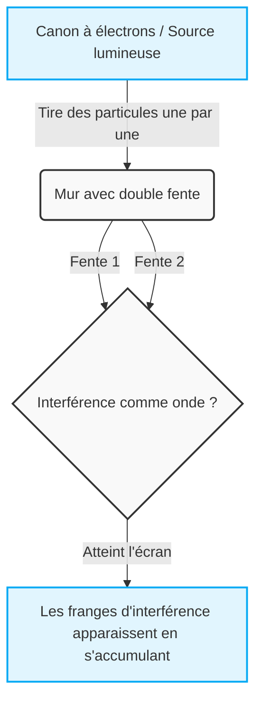
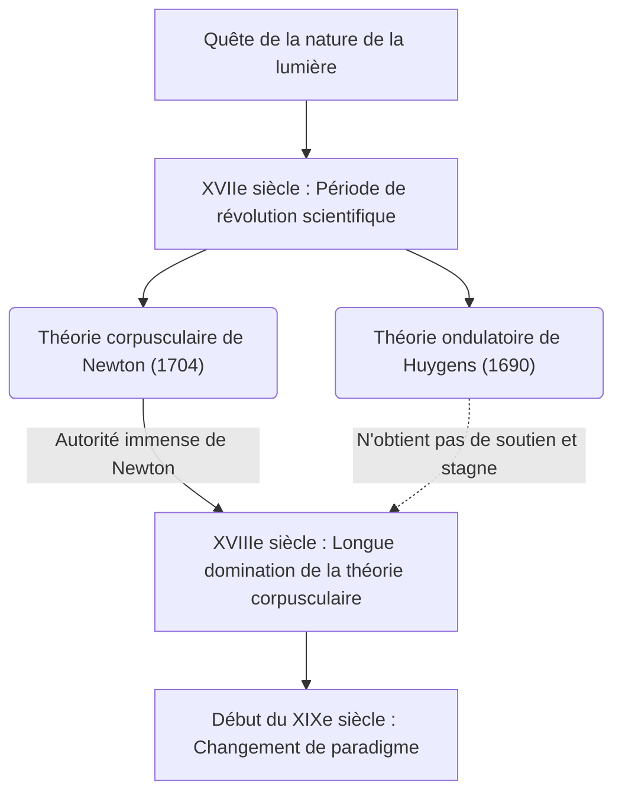
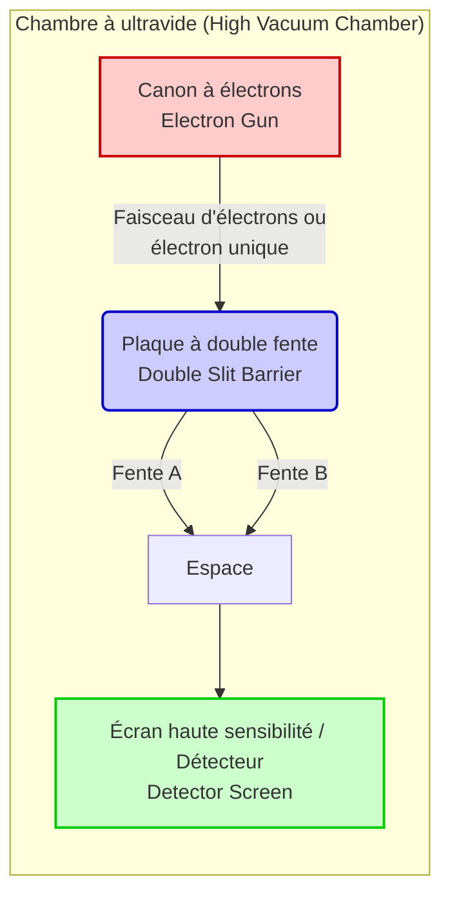

## 1. 【Introduction】 Qu'est-ce que l'expérience de la double fente ?

Le monde dans lequel nous vivons semble régi par des règles immuables. Une balle lancée en l'air décrit une parabole avant de retomber, et une pierre jetée dans l'eau crée des ondulations qui se propagent. Ce sont les évidences du « monde macroscopique » décrit par la physique classique, dont la mécanique newtonienne, et qui correspondent parfaitement à notre intuition. Cependant, dès que l'on pénètre dans le « monde microscopique » des constituants ultimes de la matière tels que les atomes, les électrons ou les particules de lumière (photons), ce sens commun s'effondre avec fracas. C'est un domaine régi par des règles extrêmement étranges et incompréhensibles, où nos sensations et intuitions quotidiennes ne s'appliquent plus du tout.

C'est « l'expérience de la double fente » (Double-slit experiment) qui nous confronte de la manière la plus simple et la plus choquante à l'anormalité de ce monde microscopique. Richard Feynman, génial physicien du XXe siècle, disait de cette expérience qu'elle était « le seul mystère de la mécanique quantique », ajoutant que « tous les mystères de la mécanique quantique sont concentrés dans cette expérience ». De plus, de nombreux physiciens de renom ne cessent de qualifier cette expérience de « la plus belle expérience de l'histoire de la physique ». Alors, pourquoi une expérience aussi extrêmement simple, consistant à percer deux fentes (ouvertures) dans une plaque, est-elle considérée comme si spéciale et continue-t-elle de fasciner les scientifiques ?

### Le monde macroscopique et microscopique à l'encontre de l'intuition

Imaginons d'abord des phénomènes dans le monde macroscopique où notre intuition fonctionne précisément.
Supposons par exemple qu'il y ait une machine tirant l'une après l'autre de petites balles recouvertes de peinture vers un mur (des balles de mitrailleuse feraient tout aussi bien l'affaire). Devant le mur est placée une plaque de fer percée de deux fentes étroites et verticales côte à côte. Si l'on tire les balles au hasard, seules celles qui traversent l'une ou l'autre des fentes iront heurter le mur au fond, y laissant une marque d'encre. En conséquence, « deux lignes verticales » de la même forme que les deux fentes devraient apparaître sur le mur. C'est le comportement des balles en tant que « particules » ayant une trajectoire claire, un résultat évident que tout le monde peut deviner intuitivement.

Ensuite, considérons le cas des « ondes ». Plaçons un écran avec deux fentes dans un bassin d'eau et créons une vague d'un côté. Lorsque la vague atteint les deux fentes, elle les traverse et, utilisant chaque fente comme une nouvelle source, se propage vers le fond sous la forme de deux ondes semi-circulaires. Et lorsque ces deux ondes se rencontrent, un phénomène appelé « interférence » se produit. Là où la crête d'une onde rencontre la crête de l'autre, la vague s'élève encore plus haut, et là où une crête rencontre un creux, elles s'annulent mutuellement pour devenir plates. En conséquence, sur le mur du fond (ou le rivage), un magnifique motif rayé appelé « franges d'interférence » se forme, où des zones fortement frappées par les vagues alternent avec des zones qui ne le sont pas du tout. C'est également une propriété fondamentale des ondes que l'on peut observer quotidiennement à la surface de l'eau ou avec les ondes sonores.

Jusqu'ici, il n'y a absolument rien de mystérieux. Si l'on lance des particules, elles créent « deux lignes », et si l'on envoie des ondes, elles créent des « franges d'interférence ». C'est le sens commun du monde dans lequel nous vivons et la prémisse de la physique classique.

### Aperçu de l'expérience et raisons pour lesquelles elle est appelée « la plus belle expérience »

Cependant, si l'on mène une expérience avec la même configuration exacte en utilisant des entités microscopiques comme la lumière ou des électrons, la situation change brusquement, et l'intuition humaine est complètement trahie.
Si l'on regarde l'histoire, c'est en 1801 que le physicien britannique Thomas Young a réalisé cette expérience de la double fente pour la première fois en utilisant la lumière du soleil (les fentes de Young). À l'époque, la théorie dominante était celle proposée par Newton selon laquelle la lumière était constituée de « particules », mais suite à l'expérience de Young, de magnifiques « franges d'interférence » sont apparues sur l'écran. Cela a fourni la preuve décisive que « la lumière est une onde », et il a semblé que la longue controverse était enfin résolue.

Le véritable mystère, et le plus grand changement de paradigme de la physique, commence ici. Au début du XXe siècle, avec des avancées technologiques spectaculaires, il est devenu possible de tirer de la lumière ou des électrons « un par un ». Un électron possède une masse et occupe une position spécifique dans l'espace ; c'est incontestablement une « particule » bien définie. On tire un seul électron à partir d'un canon à électrons, qui traverse la double fente et atteint un point sur l'écran sous la forme d'un point lumineux. À ce stade, en regardant la trace laissée sur l'écran, l'électron se comporte indéniablement comme une particule.
Ensuite, on répète ce « tir d'un électron à la fois » un nombre faramineux de fois, des milliers ou des dizaines de milliers de fois. Puisque les électrons ne volent toujours qu'un par un, il est physiquement impossible qu'ils entrent en collision avec d'autres électrons dans les airs et interfèrent comme des ondes. Naturellement, tout le monde pensait que sur l'écran, tout comme lors du jet de balles, « deux lignes » correspondant à la forme des fentes apparaîtraient.

Cependant, à mesure que d'innombrables points d'électrons s'accumulaient sur l'écran, le motif qui émergeait était incroyable. C'étaient des « franges d'interférence », qui n'étaient censées apparaître que lorsque des ondes se rencontraient.

Comment se fait-il qu'un électron, une « particule » censée être tirée une par une, se comporte de manière globale comme une « onde », interférant avec lui-même pour dessiner un motif à rayures ? Qu'est-ce que cela signifie ? C'est comme si un seul électron tiré se répandait dans l'espace comme une onde, traversait les deux fentes simultanément, causait une auto-interférence et réapparaissait en tant que particule unique au moment de heurter l'écran.
Plus étrange encore, dès que les scientifiques ont installé un détecteur (comme une caméra) à côté des fentes pour vérifier « par quelle fente l'électron est passé », l'électron a soudainement perdu sa nature ondulatoire, et seules de simples « deux lignes » sont apparues sur l'écran au lieu de franges d'interférence. Ce phénomène de changement de comportement lorsqu'il est « observé » a plongé les physiciens dans un tourbillon de confusion encore plus grand.

La raison principale pour laquelle l'expérience de la double fente est appelée « la plus belle expérience de la physique » est qu'elle met en évidence les mystères fondamentaux de l'univers avec une configuration extrêmement simple et élégante, composée seulement de deux fentes et d'un écran, sans recourir à d'imposants accélérateurs ni à des formules mathématiques extrêmement complexes. Elle nous montre visuellement et de manière frappante le moment où le sens commun du monde macroscopique s'effondre magnifiquement. Elle va au-delà de la simple confirmation d'un phénomène physique et continue de nous poser des questions philosophiques et épistémologiques très profondes : « Qu'est-ce que la réalité ? » et « Le monde que nous 'voyons' existe-t-il vraiment de manière objective ? ». Dans cette seule et simple expérience sont condensés les limites de l'intelligence humaine et la romance infinie de la science qui tente de les dépasser.

## 2. 【Histoire】 La lumière est-elle une onde ou une particule ? La trajectoire d'une controverse sans fin

Depuis que l'humanité a pris conscience de l'existence de la « lumière », la quête de sa véritable nature n'a jamais cessé. Depuis la Grèce antique, des philosophes et des mathématiciens comme Empédocle et Euclide ont spéculé sur les mécanismes de la lumière et de la vision, mais ce n'est qu'au XVIIe siècle qu'une approche véritablement scientifique moderne a commencé. La controverse « la lumière est-elle une particule ou une onde », qui a débuté à cette époque, a ensuite divisé la communauté des physiciens pendant plus de 300 ans et est finalement devenue la force motrice ouvrant la porte à une physique totalement nouvelle, la mécanique quantique. Dans cette section, nous retracerons en détail la trajectoire de cette grandiose histoire des sciences.

### 2.1 La théorie corpusculaire de Newton vs la théorie ondulatoire de Huygens : Le choc du XVIIe siècle

À la fin du XVIIe siècle, au beau milieu de la révolution scientifique, deux théories puissantes concernant la nature de la lumière ont été présentées. Il s'agit de la « théorie corpusculaire » (Corpuscular theory) d'Isaac Newton et de la « théorie ondulatoire » (Wave theory) de Christiaan Huygens.

#### La théorie corpusculaire de Newton
Isaac Newton, la grande figure de la physique moderne connue pour la loi de la gravitation universelle, pensait que la lumière était un rassemblement de particules extrêmement petites (corpuscules). Dans son article de 1672 et son œuvre principale « Opticks » (Optique) de 1704, Newton a brillamment expliqué la propriété de propagation rectiligne de la lumière et la loi de la réflexion sur les miroirs à l'aide d'un modèle mécanique où des particules rebondissent sur un mur. En ce qui concerne le phénomène de dispersion (séparation) de la lumière blanche en sept couleurs par un prisme, il a soutenu que les différentes couleurs de lumière étaient des particules de masses différentes, ayant des indices de réfraction différents lorsqu'elles traversent un milieu.
Contre la théorie ondulatoire, Newton a souligné : « Si la lumière est une onde comme le son, elle devrait contourner l'arrière des obstacles (phénomène de diffraction), or la lumière se propage en ligne droite et crée des ombres nettes », rejetant ainsi l'idée qu'elle soit une onde.

#### La théorie ondulatoire de Huygens
D'autre part, l'éminent physicien néerlandais Christiaan Huygens a affirmé dans son « Traité de la Lumière » (Treatise on Light) publié en 1690 que la lumière est une onde (onde longitudinale) se propageant à travers un milieu élastique remplissant l'espace appelé « éther ». Huygens a proposé le célèbre « principe de Huygens » (Huygens' Principle), selon lequel « tous les points sur le front d'onde deviennent la source d'une nouvelle onde secondaire », et a brillamment expliqué géométriquement les lois de la propagation rectiligne, de la réflexion et de la réfraction de la lumière.
En ce qui concerne particulièrement la réfraction, Newton avait prédit que « lorsque la lumière pénètre dans un milieu dense comme l'eau ou le verre, les particules sont soumises à une attraction et accélèrent, augmentant ainsi la vitesse de la lumière », tandis que la théorie ondulatoire de Huygens concluait que « la vitesse de propagation de l'onde ralentit dans un milieu dense », plaçant les deux en opposition frontale.

Cependant, en raison de l'autorité absolue et de l'influence de Newton dans le monde scientifique de l'époque, la théorie ondulatoire de Huygens s'est progressivement effacée, et tout au long du XVIIIe siècle, la théorie corpusculaire de Newton a continué de régner en tant que courant dominant.

## 2.2 L'expérience des fentes de Young sur la lumière (1801) et le triomphe de la théorie ondulatoire

Au début du 19e siècle, un événement décisif est venu ébranler le bastion de la théorie corpusculaire, longtemps dominante. Le protagoniste en fut l'érudit britannique Thomas Young. Médecin et ayant également contribué au déchiffrement des hiéroglyphes égyptiens (la pierre de Rosette), Young a réalisé en 1801 une expérience qui brille d'un éclat exceptionnel dans l'histoire de la physique. Il s'agit de « l'expérience des fentes de Young (plus tard appelée expérience de la double fente) ».

#### La découverte des franges d'interférence

La configuration expérimentale de Young était extrêmement simple et ingénieuse. Il a fait passer la lumière du soleil à travers un trou d'épingle (ou fente) très fin pour créer une source lumineuse ponctuelle, puis a fait passer cette lumière à travers deux fentes très étroites (une double fente) situées très près l'une de l'autre, et l'a projetée sur un écran placé derrière.

Si la lumière était purement composée de « particules » comme le prétendait Newton, deux lignes brillantes correspondant à la forme des fentes auraient dû apparaître sur l'écran. Cependant, ce que Young a vu sur l'écran était un motif de rayures où des bandes lumineuses et sombres alternaient, c'est-à-dire des « franges d'interférence (Interference fringes) ».

Ce phénomène était absolument inexplicable à moins de considérer la lumière comme une onde. À la surface de l'eau, lorsque deux ondes se rencontrent, les endroits où les crêtes des ondes se superposent deviennent plus hauts (interférence constructive), et les endroits où une crête et un creux se superposent s'annulent et s'aplatissent (interférence destructive). Young a conclu que les ondes lumineuses émergeant des deux fentes interféraient de la même manière.

#### Confirmation mathématique et établissement de la théorie ondulatoire

Les conditions d'interférence constructive et destructive sont déterminées par la différence de longueur de trajet des deux fentes jusqu'à un point sur l'écran (différence de marche $\Delta L$). Si l'on note l'espacement des fentes $d$, l'angle vers l'écran $\theta$, et la longueur d'onde de la lumière $\lambda$, la différence de marche s'exprime comme suit :

$$ \Delta L = d \sin \theta $$

* **Ligne brillante (condition d'interférence constructive)** : $\Delta L = m\lambda \quad (m = 0, \pm1, \pm2, \dots)$
* **Ligne sombre (condition d'interférence destructive)** : $\Delta L = \left(m + \frac{1}{2}\right)\lambda$

Cette annonce de Young a d'abord fait l'objet de critiques féroces et de moqueries de la part des partisans de Newton au Royaume-Uni. Cependant, en 1815, le Français Augustin-Jean Fresnel a formulé la diffraction et l'interférence de la lumière sous la forme d'une théorie mathématique rigoureuse. De plus, lors d'un concours de l'Académie des sciences française en 1818, Siméon Denis Poisson, membre du jury (et opposant à la théorie ondulatoire), a fait remarquer : « Si la théorie de Fresnel est correcte, une tache brillante devrait se former au centre de l'ombre d'un obstacle circulaire. Une telle absurdité est impossible. » Cependant, Dominique F. Jean Arago, qui a réellement mené l'expérience, a parfaitement observé cette « tache de Poisson (tache d'Arago) », rendant ainsi la validité de la théorie ondulatoire incontestable.

En 1850, Léon Foucault et d'autres ont prouvé expérimentalement que la vitesse de la lumière dans l'eau est plus lente que dans l'air, réfutant complètement la prédiction de Newton. Puis en 1864, James Clerk Maxwell a établi la théorie selon laquelle « la lumière est une forme d'onde électromagnétique », couronnement de l'électromagnétisme. Ainsi, la « théorie ondulatoire » de la lumière a remporté une victoire complète, et la controverse semblait être réglée.

### 2.3 La résurrection de la théorie corpusculaire grâce à l'hypothèse des quanta de lumière d'Einstein (1905)

La théorie de Maxwell selon laquelle la lumière est une onde électromagnétique était si élégante qu'à la fin du 19e siècle, les physiciens croyaient que « la physique était presque achevée, et qu'il ne restait plus qu'à mesurer des valeurs précises ». Cependant, de la fin du 19e au début du 20e siècle, un phénomène étrange est apparu, que la théorie ondulatoire ne pouvait absolument pas expliquer. Il s'agissait de « l'effet photoélectrique (Photoelectric effect) ».

#### Le mystère de l'effet photoélectrique

L'effet photoélectrique est le phénomène par lequel des électrons (photoélectrons) sont éjectés d'un métal lorsqu'on éclaire sa surface. Selon le bon sens de la théorie ondulatoire de l'époque, l'énergie de la lumière (l'onde) devait être proportionnelle à son amplitude (sa luminosité). Par conséquent, on pensait que « si l'on applique une lumière forte (lumineuse), les électrons devraient être éjectés vigoureusement, quelle que soit la couleur de la lumière ».

Cependant, les résultats expérimentaux ont complètement trahi les prédictions de la théorie ondulatoire.

1. **L'existence d'une fréquence seuil** : Avec une lumière d'une fréquence (couleur) inférieure à un certain seuil (par exemple, la lumière rouge), les électrons ne sortaient absolument pas, quelle que soit l'intensité (luminosité) ou la durée de l'éclairage.
2. **L'instantanéité** : Inversement, avec une lumière d'une fréquence supérieure au seuil (par exemple, la lumière ultraviolette), même la lumière la plus faible éjectait instantanément des électrons au moment où elle frappait.
3. **La dépendance énergétique** : L'énergie cinétique des électrons éjectés dépendait uniquement de la fréquence (couleur) de la lumière, et non de l'intensité (luminosité) de la lumière.

#### La solution dramatique d'Einstein : le quantum de lumière (photon)

C'est un jeune homme inconnu travaillant à l'Office des brevets suisse, Albert Einstein, qui a résolu ce mystère désespéré. En 1905, surnommée « l'année miraculeuse », il a appliqué l'« hypothèse des quanta d'énergie », proposée par Max Planck dans ses recherches sur le rayonnement thermique (1900), à la lumière elle-même, et a publié l'« hypothèse des quanta de lumière (Light quantum hypothesis) ».

Einstein a audacieusement supposé que la lumière, considérée comme une onde continue, était une collection de paquets d'énergie, c'est-à-dire de particules appelées « quanta de lumière (photons : Photon) ». L'énergie $E$ que possède un seul quantum de lumière est proportionnelle à la fréquence $\nu$ de la lumière et s'exprime par la formule de Planck-Einstein suivante :

$$ E = h\nu $$

(Ici, $h$ est la constante de Planck, $6.626 \times 10^{-34} \, \text{J}\cdot\text{s}$)

En utilisant cette hypothèse, le mystère de l'effet photoélectrique fut résolu comme par magie.
L'effet photoélectrique était un phénomène comparable au billard, où « un quantum de lumière » entre en collision avec « un électron » dans le métal et lui transfère la totalité de son énergie. Si l'énergie minimale requise par un électron pour se libérer de la liaison du métal est le « travail d'extraction ( $W$ ) », alors l'énergie cinétique maximale $E_k$ de l'électron éjecté est exprimée par la magnifique équation suivante :

$$ E_k = h\nu - W $$

Si l'énergie du quantum de lumière $h\nu$ est inférieure au travail d'extraction $W$ (lumière de basse fréquence), un électron ne peut pas être éjecté du métal, même si on le bombarde d'une grande quantité de quanta de lumière (même si on augmente l'intensité lumineuse). C'est la raison de la fréquence seuil.

#### Vers un monde incompréhensible où l'on est « à la fois onde et particule »

L'hypothèse des quanta de lumière d'Einstein a été complètement prouvée par l'expérience précise de Robert Millikan en 1914, et Einstein a reçu le prix Nobel de physique en 1921 pour cet accomplissement. (Millikan lui-même ne croyait pas initialement à la théorie d'Einstein, et ironiquement, bien qu'il ait mené des expériences pour la réfuter, les résultats en ont finalement prouvé l'exactitude). De plus, en 1923, Arthur Compton a découvert la « diffusion Compton », où la longueur d'onde des rayons X change lors d'une collision avec un électron, ce qui a confirmé que la lumière se comporte comme une « particule » possédant une quantité de mouvement   $p = \frac{h}{\lambda}$.

La « théorie corpusculaire », qui était censée avoir été complètement vaincue par l'expérience de Young, a connu une résurrection miraculeuse 100 ans plus tard sous la forme plus raffinée de « quantum ».

Cependant, cela a créé une contradiction profonde. La lumière se retrouve ainsi à posséder des caractéristiques claires d'une onde, comme « l'interférence » montrée dans l'expérience de la double fente de Young, tout en possédant également les caractéristiques d'une « particule », comme montré dans l'effet photoélectrique.

La lumière est-elle une onde, ou une particule ?
La réponse finale de la physique à cette question fut violemment contre-intuitive pour l'humain : « La lumière est à la fois les deux et ni l'un ni l'autre. La lumière est une entité quantique qui combine 'la nature d'une onde' et 'la nature d'une particule'. » Ce fut la naissance de la « dualité onde-particule (Wave-particle duality) ».

Et ce concept de dualité ne s'est pas limité à la lumière ; il s'est également appliqué à la matière elle-même, comme les électrons (les ondes de matière de de Broglie), et la physique s'est aventurée dans des profondeurs sans précédent, le monde étrange et fascinant de la « mécanique quantique ». Le théâtre le plus emblématique de ceci est l'« expérience de la double fente quantique », mise à jour dans sa version moderne.

## 3. [Tournant] La matière est-elle aussi une onde ? Les ondes de de Broglie et l'expérience de la double fente avec des électrons

L'hypothèse des quanta de lumière d'Einstein (1905), affirmant que la lumière est « à la fois onde et particule », a plongé le monde de la physique dans une grande confusion et un profond changement de paradigme. Bien que l'on ait cru pendant de nombreuses années que « la lumière était absolument une onde », en raison de l'expérience d'interférence de Young et de l'électromagnétisme de Maxwell, des phénomènes tels que l'effet photoélectrique ne pouvaient être expliqués qu'en considérant la lumière comme des « particules (photons) ». Cette étrange propriété de « dualité onde-particule » était initialement considérée comme une particularité unique de la lumière. Cependant, dans les années 1920, ce concept de dualité ne se limita plus au monde de la lumière et commença à s'attaquer à la « matière » même qui compose notre corps.

### 3.1. La proposition de l'onde de matière de Louis de Broglie : Un bond à partir d'une belle symétrie

En 1924, Louis de Broglie, un jeune étudiant français en thèse, proposa dans sa thèse de doctorat une hypothèse d'une audace extrême qui allait bouleverser fondamentalement l'histoire de la physique. Elle stipulait que : « Si la lumière (considérée comme une onde) possède les propriétés d'une particule, inversement, la matière comme les électrons (considérée comme des particules) ne posséderait-elle pas aussi les propriétés d'une onde ? »

L'intuition philosophique de de Broglie, selon laquelle la nature préfère toujours la symétrie, était à la base de cette hypothèse. Il a appliqué l'équation reliant l'énergie et la quantité de mouvement, qu'Einstein avait dérivée de la théorie de la relativité restreinte et de l'hypothèse des quanta de lumière, aux particules de matière dotées d'une masse. La quantité de mouvement $p$ d'un photon est exprimée par $p = h / \lambda$ en utilisant la constante de Planck $h$ et la longueur d'onde $\lambda$. De Broglie a inversé cela et a exprimé la longueur d'onde $\lambda$ de l'onde associée à une particule de masse $m$ se déplaçant à la vitesse $v$ (quantité de mouvement $p = mv$) avec une formule mathématique très simple comme suit :

$$ \lambda = \frac{h}{p} = \frac{h}{mv} $$

C'est la célèbre formule de la « longueur d'onde de de Broglie (longueur d'onde des ondes de matière) ». Cette formule mathématique signifie que tout ce qui bouge, des balles de baseball et des voitures que nous voyons tous les jours jusqu'aux électrons microscopiques, revêt les propriétés d'une « onde ». Alors, pourquoi ne voyons-nous pas une balle de baseball interférer ou se diffracter comme une onde dans notre vie quotidienne ? C'est parce que la constante de Planck $h$ (environ $6.626 \times 10^{-34} \text{ J}\cdot\text{s}$) est extrêmement petite. Pour les objets macroscopiques, la masse $m$ est si grande que la longueur d'onde de de Broglie $\lambda$ devient si petite qu'elle peut être considérée comme virtuellement nulle, masquant ainsi complètement le comportement ondulatoire. Cependant, dans le monde des électrons dont la masse est extrêmement petite, cette longueur d'onde se situe à la même échelle que celle des rayons X (ondes électromagnétiques) (environ $0.1 \text{ nm}$, etc.), et émerge comme une grandeur qui ne peut absolument pas être ignorée.

Cette thèse de de Broglie était tellement en dehors du sens commun qu'elle a grandement déconcerté les membres du jury de l'époque. Cependant, lorsque Paul Langevin, l'un des membres du jury, envoya ce mémoire à Einstein, ce dernier fit l'éloge : « Il a soulevé un coin du grand voile. » De ce fait, le concept d'« onde de matière (matter wave) » de de Broglie attira l'attention mondiale et conduisit directement à l'achèvement ultérieur de la mécanique ondulatoire par Schrödinger.

### 3.2. L'expérience de Davisson-Germer : La preuve de la nature ondulatoire de la matière

Bien que l'hypothèse de de Broglie fût théoriquement élégante, il fallait attendre une preuve expérimentale pour savoir si elle décrivait la réalité de la nature. « Si les électrons sont vraiment des ondes, ils devraient produire de la « diffraction » et de l'« interférence », qui sont des phénomènes caractéristiques des ondes. » Avec cette conviction, les physiciens du monde entier ont commencé des expériences pour essayer de capturer la nature ondulatoire des électrons.

Et en 1927, la preuve décisive fut enfin apportée. Il s'agissait de l'« expérience de Davisson-Germer » menée par les physiciens américains Clinton Davisson et Lester Germer des Laboratoires Bell.

Ils menaient initialement une expérience dans un autre but, celui d'examiner la diffusion des faisceaux d'électrons frappant un cristal de nickel. Cependant, pour réparer un accident survenu pendant l'expérience (l'oxydation de la surface du nickel due au bris du tube à vide), ils ont chauffé le nickel à haute température, et par chance, le nickel s'est accidentellement transformé en monocristal. Lorsqu'ils ont à nouveau dirigé un faisceau d'électrons sur ce nickel monocristallin, un phénomène étonnant a été observé. L'intensité des électrons diffusés présentait un maximum à des angles spécifiques, révélant un clair « motif de diffraction ».

L'espacement régulier des atomes à l'intérieur du cristal (paramètre de maille) est à peu près à la même échelle que la longueur d'onde de de Broglie des électrons. En d'autres termes, le cristal de nickel lui-même fonctionnait comme un « réseau de diffraction naturel » pour les électrons. Le résultat du calcul inverse de la longueur d'onde de l'électron à partir de ce motif de diffraction par Davisson et Germer concordait parfaitement avec la valeur prédite par la formule de de Broglie, $\lambda = h/p$. La même année, le Britannique George Paget Thomson (le fils de J.J. Thomson, découvreur de l'électron) a également réussi à observer des anneaux de diffraction (anneaux de Debye-Scherrer) produits par un faisceau d'électrons traversant une fine feuille métallique.

Ces résultats expérimentaux ont confronté la communauté physique au fait incontestable que la matière possède des propriétés ondulatoires. Les électrons, qui étaient censés être des particules, se comportaient comme des ondes. Ce fut le moment où cette profonde vérité de la nature fut révélée, servant de fanfare annonçant l'aube de la mécanique quantique. De Broglie a reçu le prix Nobel de physique en 1929, et Davisson et Thomson en 1937.

### 3.3. L'expérience décisive de la double fente par Hitachi (Akira Tonomura et al., 1989)

Même après qu'il a été prouvé que les électrons étaient des ondes, la quête des physiciens ne s'est pas arrêtée. Il s'agissait d'une tentative pour réaliser l'« expérience de la double fente avec des électrons », souvent discutée en tant qu'expérience de pensée, dans la réalité, et ce, avec une précision extrême.

Tout comme dans l'expérience de la double fente avec la lumière (l'expérience de Young), si l'on tire des électrons vers une double fente, des franges d'interférence devraient apparaître sur l'écran derrière. Cependant, c'est ici que le paradoxe le plus déroutant de la mécanique quantique fait son apparition. « Que se passerait-il si les électrons n'étaient pas tirés en grand nombre à la fois, mais tirés **un par un** ? »

Un seul électron est une particule indivisible. Par conséquent, il ne devrait pouvoir passer qu'à travers la fente de gauche ou la fente de droite. Un électron atteignant l'écran un par un ne laisserait qu'un seul point lumineux sur l'écran. Lorsqu'on répète cela des dizaines de milliers de fois, cet ensemble de points se transformera-t-il simplement en l'ombre de deux fentes (deux lignes), ou deviendra-t-il un motif d'interférence montrant les propriétés d'une onde ?

Pour répondre à cette question ultime, c'est l'équipe de recherche du Laboratoire de Recherche Fondamentale d'Hitachi au Japon (le Dr Akira Tonomura et ses collègues) qui a dépassé les limites technologiques pour présenter la réponse la plus belle et parfaite au monde. En 1989, ils ont brillamment réussi l'« expérience d'interférence par biprisme avec un électron unique », utilisant pleinement la technologie de l'holographie électronique et la technologie de microscopie électronique sous ultra-vide et à ultra-basse température.

La configuration expérimentale était étonnante. Ils ont réduit le nombre d'électrons émis par le canon à électrons jusqu'à la limite extrême, créant une condition où il y avait toujours « seulement un électron présent dans l'appareil » pendant que l'électron volait dans l'espace. La vitesse de l'électron atteignait environ 150 000 kilomètres par seconde, et le temps nécessaire pour parcourir la distance de la source lumineuse au détecteur n'était qu'un instant. Le prochain électron n'était tiré que bien après que l'électron précédent eut atteint l'écran.

Dès le début de l'expérience, des points lumineux marquant l'arrivée d'électrons commencent à apparaître sporadiquement sur le détecteur (moniteur). Aux stades des premiers quelques-uns, ou quelques centaines d'électrons, il semble seulement que des points soient dispersés de manière aléatoire sur l'écran. Tout comme les étoiles dans le ciel nocturne, il semblait n'y avoir aucun ordre là-bas.

Cependant, à mesure que des milliers, puis des dizaines de milliers d'électrons s'accumulaient, un spectacle stupéfiant et évident pour quiconque émergea. L'amas de points qui paraissait désordonné formait progressivement un motif régulier de rayures claires et sombres — d'incontestables « franges d'interférence ».

Ce que signifiait ce résultat était violemment contre-intuitif. Les électrons atteignent l'écran de manière certaine en tant que « particule unique » (c'est pourquoi un seul point est enregistré). Cependant, le fait qu'ils créent des franges d'interférence dans leur ensemble ne peut être interprété que comme l'unique électron « passant simultanément par les deux fentes (les deux côtés du biprisme) en tant qu'onde et interférant avec lui-même ». Un électron unique qui n'interagit avec personne interfère avec lui-même. Le même principe que Dirac a décrit lorsqu'il a dit « un photon n'interfère qu'avec lui-même » a été parfaitement démontré pour les électrons, des particules de matière ayant une masse.

Cette expérience du Dr Akira Tonomura et de ses collègues a été louée dans le monde entier comme la preuve la plus visuelle et directe du mystère de la mécanique quantique, à savoir la « dualité onde-particule ». Il est tout à fait naturel que cette « expérience de la double fente avec des électrons » ait été élue fièrement à la première place lors du vote des lecteurs pour la « plus belle expérience de l'histoire de la physique », organisé par la revue scientifique britannique « Physics World » en 2002.

Ainsi, l'hypothèse excentrique de de Broglie selon laquelle « la matière est une onde », plus de 60 ans plus tard, a révélé sa véritable nature sous nos yeux sous la forme de mystérieuses franges d'interférence dessinées par des électrons uniques. Cependant, alors que cette expérience démystifiait la mécanique quantique, elle ouvrit également la porte à un mystère encore plus profond, à savoir le « problème de la mesure ». « Dès lors qu'on essaie de voir par quelle fente il est passé, les franges d'interférence disparaissent. » — Dans le chapitre suivant, nous allons nous aventurer plus loin dans les abysses de cet étrange monde quantique.
## 4. [Méthodes et résultats expérimentaux] Que se passe-t-il concrètement ?

(Afin de plonger au cœur de l'expérience des fentes de Young et d'explorer les abysses de la mécanique quantique, nous nous concentrerons ici sur l'expérience utilisant des "électrons" plutôt que de la lumière. Bien que des phénomènes similaires aient été confirmés avec des photons, d'autres particules élémentaires, et même des molécules relativement grosses comme les fullerènes, l'utilisation d'électrons — qui ont une masse et que nous reconnaissons clairement comme des "particules matérielles" — rend les paradoxes et les mystères de ce phénomène encore plus frappants.)

### 4.1 Configuration expérimentale : Planter le décor pour capturer le monde microscopique

Tout d'abord, examinons en détail le dispositif et la mise en scène (configuration) de cette expérience historique et révolutionnaire. La structure conceptuelle de l'expérience des fentes de Young est étonnamment simple, mais sa réalisation sous forme d'expérience physique réussie exige une technologie de pointe et un contrôle environnemental extrêmement rigoureux.

Le dispositif expérimental se compose principalement de trois grands éléments. Ils sont tous rigoureusement confinés dans une chambre à vide (récipient sous vide) de haute qualité afin d'empêcher la diffusion des électrons par collision avec les molécules d'air.

1. **Canon à électrons (Electron Gun)** :
   Il s'agit du dispositif permettant de tirer les "électrons", les protagonistes de l'expérience. En chauffant un filament pour émettre des électrons thermiques ou en utilisant un champ électrique intense pour extraire des électrons, ce dispositif projette des électrons avec une énergie cinétique constante dans une direction donnée. Ce qui est extrêmement important dans cette expérience, c'est qu'il est possible d'émettre des électrons de manière continue sous la forme d'un puissant "faisceau" en cascade, ou, étonnamment, de réduire la puissance à l'extrême pour les émettre de façon contrôlée, "un par un avec certitude". Cette "technologie d'émission d'électron unique" est l'une des techniques sophistiquées indispensables aux expériences modernes de mécanique quantique.

2. **Double fente (Double Slit)** :
   Il s'agit d'une plaque de protection (mur) percée de deux fentes (ouvertures) extrêmement fines et très proches l'une de l'autre, par lesquelles passent les électrons émis par le canon à électrons. La longueur d'onde de "l'onde de matière (onde de de Broglie)" de l'électron étant extrêmement courte, la largeur de ces fentes ainsi que la distance qui les sépare doivent être usinées avec précision à une échelle microscopique allant du nanomètre (un milliardième de mètre) au micromètre. Si la largeur ou l'espacement des fentes est trop grand par rapport à la longueur d'onde de l'électron, il devient impossible d'observer clairement "l'interférence", qui est une caractéristique ondulatoire. La technologie de fabrication de ces doubles fentes minuscules est en soi l'aboutissement de techniques de micro-fabrication, telles que la lithographie par faisceau d'électrons de pointe.

3. **Écran (Détecteur, Screen / Detector)** :
   Il s'agit de l'écran d'observation sur lequel les électrons ayant traversé avec succès la double fente finissent par arriver, afin d'enregistrer leur position. Autrefois, des plaques photographiques photosensibles étaient utilisées, mais aujourd'hui on emploie des caméras CCD à haute sensibilité, des écrans fluorescents, ou des détecteurs de pixels à semi-conducteurs spéciaux. Cela permet d'enregistrer "où l'électron est arrivé (a frappé)" sous forme de coordonnées bidimensionnelles extrêmement précises, pour chaque tir. Lorsque l'électron frappe l'écran, il émet une infime quantité de lumière ou génère un signal électrique, laissant ainsi une trace (point) claire indiquant qu'"il est indubitablement arrivé ici en tant que particule unique".

Le schéma ci-dessous illustre schématiquement la disposition générale de ce dispositif expérimental ainsi que la trajectoire des électrons.

### 4.2 Lorsqu'une grande quantité d'électrons est projetée : Un comportement ondulatoire qui défie l'intuition (Formation de franges d'interférence)

Et maintenant, l'expérience commence. Lors de la première étape, on augmente la puissance du canon à électrons et on tire simultanément une "grande quantité d'électrons" de manière continue vers la double fente, à la façon d'une douche ou d'une mitrailleuse.

Si l'on se fie à notre bon sens quotidien issu de la physique classique, l'électron est une "particule (comme une petite balle)" dotée d'une masse. On s'attend donc à ce que les nombreux électrons passant par les deux fentes viennent frapper l'écran de manière concentrée à deux endroits, situés dans le prolongement de la trajectoire directe de chaque fente, formant ainsi un motif semblable à "deux bandes verticales". Imaginez que vous pulvérisiez de la peinture sur un pochoir percé de deux fentes. La peinture passant par les fentes devrait dessiner deux lignes sur le mur, épousant la forme des ouvertures.

Cependant, le motif qui apparaît réellement sur l'écran dément complètement notre intuition et nos prédictions. Au lieu de deux simples bandes verticales, de **multiples rayures claires et sombres (franges d'interférence : Interference Pattern)** se forment nettement sur l'écran.

Ces "franges d'interférence" présentent exactement les mêmes caractéristiques géométriques que le motif créé par la superposition des ondes générées lorsque l'on jette simultanément deux pierres à la surface d'un étang, ou que les motifs observés lors d'expériences d'interférence lumineuse.
- **Là où les crêtes et les crêtes, ou les creux et les creux des ondes se superposent (interférence constructive)**, on obtient des bandes "claires (forte densité de collision d'électrons)" où de nombreux électrons atterrissent.
- **Là où les crêtes et les creux des ondes se superposent (interférence destructive)**, les ondes s'annulent mutuellement, ce qui donne des bandes "sombres (densité de collision d'électrons proche de zéro)" où pratiquement aucun électron n'arrive.

Il n'y a qu'une seule conclusion possible à ce résultat : **"Les électrons se comportent comme des ondes"**. L'essaim d'électrons émis par le canon se propage dans l'espace à la manière des vagues à la surface de l'eau, et traverse les deux fentes "simultanément". Ensuite, l'onde diffractée par la fente A et celle diffractée par la fente B se superposent dans l'espace devant l'écran et interfèrent, ce qui est la seule façon d'expliquer la création de ces franges claires et sombres caractéristiques.

L'électron, que l'on croyait fermement être une "particule", possède en réalité également les propriétés d'une "onde" (la dualité onde-corpuscule). Ce fait à lui seul constitue une découverte historique majeure en physique et est suffisamment surprenant en soi. Cependant, le véritable mystère de la mécanique quantique, le phénomène qui bouleverse fondamentalement notre bon sens, s'approfondit encore davantage à partir de là.

### 4.3 Lorsque les électrons sont émis "un par un" : La véritable nature de "l'onde de probabilité" révélée par une expérience extrême

"Étant donné qu'on tire un grand nombre d'électrons en même temps, ne se pourrait-il pas qu'ils entrent en collision dans l'air ou se repoussent mutuellement par force électrique (force coulombienne), créant simplement, en conséquence, un motif semblable à celui d'une onde ?"
Il est tout à fait naturel pour un scientifique de se poser cette question. De fait, lors de la découverte initiale des franges d'interférence, de nombreux physiciens l'ont pensé et ont tenté d'interpréter le phénomène de manière classique.

Afin de trancher définitivement cette question, les techniques expérimentales ont été perfectionnées et une expérience décisive a été menée. (Au Japon, l'expérience réalisée en 1989 par le groupe d'Akira Tonomura chez Hitachi est très célèbre et est saluée comme l'une des plus belles expériences au monde).
Il s'agit de l'expérience consistant à **réduire la puissance du canon à électrons à l'extrême et à émettre les électrons "avec certitude un par un"**.

Plus précisément, un nouvel électron n'est émis qu'après avoir confirmé que l'électron précédent a été tiré, a atteint l'écran et a complètement disparu (ou a été absorbé). On répète cela un nombre faramineux de fois, des dizaines ou des centaines de milliers de fois. Dans cette configuration, il est garanti qu'il n'y a "toujours qu'un seul électron présent" dans l'espace du dispositif expérimental. Par conséquent, il est physiquement à 100 % impossible que les électrons entrent en collision dans l'air ou interfèrent les uns avec les autres.

Suivons le résultat de cette expérience impliquant des électrons uniques dans des conditions extrêmes, au fil du temps (en fonction du nombre d'électrons accumulés).

**Étape 1 : Juste après le début de l'expérience (quelques dizaines à quelques centaines d'électrons)**
Sur l'écran, des points viennent frapper l'écran de manière sporadique, à des positions totalement aléatoires. Au moment où il atteint l'écran, l'électron montre clairement les propriétés d'une "particule unique" et enregistre un seul point (dot) à une coordonnée minuscule spécifique. À ce stade, aucune régularité ne peut être décelée dans le motif sur l'écran ; cela ressemble simplement à un ensemble de points désordonnés et aléatoires. C'est comme si l'on lançait des fléchettes au hasard, les yeux bandés.

**Étape 2 : Après l'arrivée de milliers à des dizaines de milliers d'électrons**
Au fur et à mesure que le temps passe, que l'expérience est répétée et que des milliers à des dizaines de milliers de points s'accumulent sur l'écran, un phénomène étrange commence à se produire. Au sein de la distribution de points que l'on pensait totalement aléatoire, des "biais" et des "nuances" commencent progressivement à apparaître. Des zones où les points s'agglutinent en grand nombre et des zones où presque aucun point ne vient frapper commencent à se distinguer légèrement.

**Étape 3 : À la fin de l'expérience (arrivée de centaines de milliers d'électrons ou plus)**
Après avoir pris beaucoup de temps et avoir continué à tirer un nombre faramineux d'électrons (des centaines de milliers à des millions) un par un, dans un travail de longue haleine, si l'on regarde l'image accumulée sur l'ensemble de l'écran... On y voit se dessiner clairement des **"franges d'interférence"** magnifiques, exactement identiques à celles obtenues lorsqu'on avait émis une grande quantité d'électrons d'un seul coup !

C'est l'un des résultats les plus effrayants, les plus contre-intuitifs, mais aussi les plus beaux et les plus profonds de l'histoire de la physique.

Car les électrons ont été tirés "absolument un par un". Interagir avec les électrons précédents ou suivants est strictement impossible. Malgré cela, le fait qu'un motif à rayures indiquant une interférence ondulatoire finisse par se former ne nous laisse pas d'autre choix que d'accepter la conclusion incroyable que **"un seul électron interfère avec lui-même"**.

Si l'on essaie d'expliquer logiquement ce phénomène, notre perception quotidienne de l'espace et de la matière s'effondre complètement.
Après avoir été émis par le canon, un seul électron se propage dans tout l'espace comme s'il était une "onde", **traverse "simultanément" la fente de droite et la fente de gauche**, interfère avec "sa propre onde" devant l'écran, et au moment où il atteint l'écran et est observé, il se réduit (se détermine) à nouveau en un point unique en tant que "particule unique".

Quelle est donc la véritable nature de cette "onde" qui permet à cet électron unique de se propager dans l'espace ?
En mécanique quantique, il ne s'agit pas d'une onde matérielle comme l'ondulation d'un milieu physique tel que la surface de l'eau ou l'air. Selon l'interprétation proposée par Max Born, il s'agit **"d'une onde représentant la 'probabilité' que l'électron se trouve à un endroit spécifique de cet espace (onde de probabilité)"**. Mathématiquement, on appelle cela la "fonction d'onde".

L'électron ne vole pas en ligne droite sur une trajectoire (route) spécifique comme une bille de flipper. Entre son émission et son arrivée sur l'écran, l'électron se propage dans l'espace sous la forme d'un "état superposé (superposition d'états)" avec diverses probabilités, incluant "l'état d'être passé par la fente de droite", "l'état d'être passé par la fente de gauche", et même "l'état d'être passé par tous les chemins de l'espace".

Puis, lorsqu'il heurte le détecteur qu'est l'écran et que "l'endroit où il est arrivé" est mesuré, l'onde de probabilité qui s'étendait dans l'espace se réduit instantanément en un seul point (réduction de la fonction d'onde), et la position réelle de la particule est définie pour la première fois en indiquant "elle était ici".

Les "parties claires (où les points finissent par se concentrer)" des franges d'interférence sont les endroits où la probabilité de présence de l'électron a été augmentée par l'interférence des ondes, et les "parties sombres (où les points ne s'accumulent pas)" signifient les endroits où les ondes de probabilité se sont annulées pour tomber à zéro. Tout comme les probabilités d'obtenir chaque face se rapprochent de la valeur théorique (1/6) lorsqu'on lance un dé de nombreuses fois, c'est la répétition du "comportement probabiliste" d'un électron unique des centaines de milliers de fois qui fait émerger la forme de l'onde de probabilité (franges d'interférence) sous forme de motif réel.

"Un seul électron traverse deux fentes simultanément." "Tant qu'il n'est pas observé, son état n'est pas déterminé, et il n'existe que sous la forme d'une onde de probabilité où s'entremêlent d'innombrables possibilités."
Les faits expérimentaux froids et implacables mis en évidence par cette expérience des fentes de Young nous posent des questions philosophiques profondes qui dépassent le cadre de la physique, telles que : "Que signifie fondamentalement exister ?" et "Quelle est cette réalité que nous percevons ?"

## 5. [Le problème de la mesure] Le quantum qui modifie son comportement lorsqu'on le regarde

C'est là que réside le cœur de la raison pour laquelle l'expérience des fentes de Young en mécanique quantique a eu une influence considérable non seulement en physique, mais aussi dans les domaines de la philosophie et de la pensée, et pour laquelle elle est qualifiée de l'expérience la plus belle et en même temps la plus troublante de l'histoire des sciences. C'est le fait stupéfiant que l'acte d'"observation (mesure)" lui-même modifie de manière décisive l'issue du phénomène physique.

Dans le monde quotidien (macro) dans lequel nous vivons, c'est-à-dire le monde régi par la physique classique, "voir" n'est qu'un acte passif. Que nous regardions ou non la lune flottant dans le ciel nocturne, elle s'y trouve de manière inébranlable et se déplace sur une orbite constante selon la mécanique newtonienne. Le fait de la regarder ne modifie pas l'orbite de la lune. Notre bon sens inébranlable nous dit que la présence de l'observateur n'a aucune influence sur la réalité objective de l'objet observé.

Cependant, dans le monde microscopique des quanta, ce bon sens est fondamentalement remis en question. "Voir (observer)" n'est pas simplement une réception d'informations, mais un processus actif qui exerce une influence irréversible et décisive sur l'objet. À l'instant où l'observateur pose naturellement une question à la nature, celle-ci modifie son comportement. Dans cette section, nous explorerons très en détail le plus grand mystère de l'expérience des fentes de Young, qui continue d'être débattu dans la physique moderne : le "problème de la mesure (Measurement Problem)".

### Que se passe-t-il lorsque l'on "observe" par quelle fente il est passé ?

Imaginez le processus par lequel des quanta — qu'il s'agisse d'électrons, de photons, ou même de grandes molécules comme les fullerènes (C60) — sont émis un par un, traversent deux fentes, et arrivent sur un écran. Dans les explications précédentes, nous avons confirmé que même si l'on projette les quanta un par un avec un intervalle de temps, si l'on observe les points lumineux accumulés sur l'écran pendant une longue période, de magnifiques franges d'interférence (preuve de la nature ondulatoire) s'y forment. On interprète cela comme le fait qu'un quantum unique se propage dans l'espace sous la forme d'une superposition (Superposition) de deux états ("la possibilité de passer par la fente droite" et "la possibilité de passer par la fente gauche"), et que c'est le résultat de l'interférence de sa propre onde de probabilité avec elle-même.

Cependant, les physiciens se sont alors posé une question naturelle, mais qui prend des allures diaboliques dans le monde quantique : "Le quantum traverse-t-il vraiment 'les deux fentes simultanément' ? Ou bien 'ne passe-t-il en réalité que par une seule fente, mais nous l'ignorons' ? Plaçons une caméra à côté des fentes pour nous en assurer."

Pour répondre à cette question, on apporte une modification au dispositif expérimental. On installe juste à côté des fentes un "détecteur (appareil d'observation)" extrêmement sensible. Ce détecteur a pour but d'"observer" et d'enregistrer si l'électron est passé par la fente droite ou par la fente gauche. La configuration de l'expérience reste rigoureusement la même, à l'exception de l'ajout de ce détecteur. On émet les électrons un par un. Le détecteur fonctionne parfaitement et nous indique avec précision l'information de chemin (Which-path information) de l'électron, en signalant s'il est "passé à droite" ou "passé à gauche". Comme on pouvait s'y attendre, on confirme que la moitié des électrons passent à droite et l'autre moitié à gauche. Voilà qui satisfait notre intuition : "Eh bien, finalement, l'électron n'était qu'une particule passant par un seul trou. La superposition n'était qu'une illusion."

Mais les physiciens qui ont finalement examiné le schéma de distribution des électrons arrivés sur l'écran en sont restés sans voix. Ce qui s'y dessinait n'était plus de belles franges d'interférence montrant les propriétés d'une onde, mais simplement "deux lignes (ou deux monticules)". C'est exactement le même motif qui se forme lorsqu'on jette des particules classiques, comme des balles de baseball ou des cailloux, vers les fentes. L'"interférence d'onde", indispensable à la formation des franges d'interférence, avait complètement disparu.

Dès l'instant où nous avons essayé d'observer "par où" l'électron est passé, ce dernier a abandonné sa nature ondulatoire (son état superposé) pour se comporter comme une particule classique pure. Si l'on éteint le détecteur, les franges d'interférence réapparaissent ; si on l'allume, elles disparaissent sans laisser de trace. Plus surprenant encore, des expériences ultérieures (l'expérience de la gomme quantique) ont montré que "lorsque les données d'observation sont enregistrées, mais effacées sans que personne ne les ait regardées", les franges d'interférence peuvent même renaître. Le quantum se comporte comme s'il "savait" que nous le regardons ou que l'information sur son parcours a été conservée quelque part dans l'univers. On appelle cela "la destruction de l'interférence par l'obtention de l'information de chemin", ce qui est devenu la preuve irréfutable à quel point le monde quantique est éloigné de notre intuition.

### L'interprétation de Copenhague (Réduction du paquet d'onde)

Comment devrions-nous interpréter ce phénomène d'une nature fondamentalement incompréhensible ? Dans les années 1920, Niels Bohr, Werner Heisenberg, Max Born et d'autres ont élaboré "l'interprétation de Copenhague", qui constitue l'interprétation la plus standard et orthodoxe de la mécanique quantique.

Dans l'interprétation de Copenhague, on considère qu'avant d'être observé, le quantum n'existe que sous la forme d'une "onde de probabilité (fonction d'onde)" s'étendant dans l'espace. La fonction d'onde (généralement notée $\Psi$) n'est pas elle-même une entité physique, mais un outil mathématique représentant "l'amplitude de probabilité" que le quantum soit découvert à un endroit donné. Cette onde de probabilité évolue dans le temps de manière déterministe et lisse, conformément à l'équation de Schrödinger. Dans l'expérience des fentes de Young, l'onde de probabilité de l'électron passe à la fois par la fente droite et la fente gauche, et ces ondes interfèrent l'une avec l'autre devant l'écran. Jusqu'ici, il s'agit d'un monde régi par les propriétés ondulatoires, et d'un processus déterministe.

Cependant, à l'instant même où a lieu le processus physique de "mesure" (d'observation), cette fonction d'onde subit une modification spectaculaire et discontinue. C'est ce qu'on appelle la "réduction du paquet d'onde (réduction de la fonction d'onde : Wavefunction Collapse)". Au moment précis où le détecteur détecte que "l'électron est passé par la fente droite", toutes les ondes des autres possibilités ("il pourrait passer par la gauche", "il pourrait passer par le milieu") qui s'étendaient dans tout l'espace s'évanouissent instantanément, dépassant la vitesse de la lumière, pour se réduire en une seule réalité (un point) : "la particule qui est passée par la fente droite".

L'affirmation la plus radicale et la plus importante de l'interprétation de Copenhague est que "avant l'observation, l'endroit où se trouve le quantum et l'état dans lequel il se trouve ne sont 'pas déterminés'". Il ne s'agit pas de dire qu'il est en fait quelque part, mais que nous l'ignorons (ce qu'on appelle la "théorie des variables cachées") ; l'interprétation soutient que, littéralement, "l'état où la probabilité d'existence s'étend dans l'espace est la réalité elle-même", et que l'interaction avec un système macroscopique, telle que l'observation, "sélectionne" et "détermine" au hasard une réalité unique parmi une myriade de possibilités.

Albert Einstein s'est vivement opposé à cette idée probabiliste et floue tout au long de sa vie. Sa célèbre citation, « Dieu ne joue pas aux dés (God does not play dice with the universe) », est une critique de cette interprétation probabiliste. De plus, il ironisait en disant : « Croyez-vous vraiment que la lune n'existe pas quand je ne la regarde pas ? », et a continué d'affirmer que la mécanique quantique était une théorie incomplète (cf. le paradoxe EPR, etc.). Cependant, les expériences ultérieures de vérification de l'inégalité de Bell (telles que l'expérience d'Aspect) ont réfuté la théorie des variables cachées locales souhaitée par Einstein. Jusqu'à aujourd'hui, de nombreux résultats d'expériences de haute précision continuent de soutenir la validité de cette étrange interprétation de Copenhague (ou des modèles non locaux et probabilistes qui y sont liés, comme l'interprétation des mondes multiples).

### Relation avec le principe d'incertitude de Heisenberg

Pourquoi l'acte d'observation modifie-t-il inévitablement l'état quantique et détruit-il les franges d'interférence ? Ce mystère est brillamment expliqué à partir d'un principe fondamental de la physique : le "principe d'incertitude (Uncertainty Principle)", proposé par Werner Heisenberg en 1927.

Le principe d'incertitude est une loi fondamentale de l'univers stipulant que dans le monde microscopique, il est en principe impossible de mesurer simultanément et avec une précision infinie les grandeurs physiques conjuguées (propriétés allant par paires) d'une particule, telles que sa "position (où elle se trouve)" et sa "quantité de mouvement (quelle est sa masse, dans quelle direction et à quelle vitesse vole-t-elle)".

Son expression mathématique est la célèbre inégalité suivante :

$$ \Delta x \cdot \Delta p \ge \frac{\hbar}{2} $$

Ici, chaque symbole a la signification suivante :
- $\Delta x$ : "Incertitude sur la position (écart-type ou étendue de l'erreur dans la mesure de la position)"
- $\Delta p$ : "Incertitude sur la quantité de mouvement (écart-type dans la mesure de la quantité de mouvement)"
- $\hbar$ : "Constante de Dirac (h-barre, constante de Planck réduite)". Il s'agit de la constante de Planck $h$ divisée par $2\pi$, soit une valeur extrêmement petite d'environ $1.054 \times 10^{-34} \mathrm{J\cdot s}$.

Cette formule signifie que le produit de "l'incertitude sur la position" et de "l'incertitude sur la quantité de mouvement" doit toujours être supérieur ou égal à une valeur minimale constante ($\hbar / 2$). En d'autres termes, plus on essaie de déterminer avec une extrême précision la position de la particule (plus on rapproche $\Delta x$ de zéro à la limite), plus l'incertitude sur la quantité de mouvement ($\Delta p$) diverge vers l'infini de manière inversement proportionnelle. Il devient alors totalement impossible de prédire dans quelle direction la particule va voler l'instant suivant. L'inverse est également vrai : si l'on tente de mesurer précisément la quantité de mouvement, la position de la particule devient alors floue et étalée dans tout l'espace.

Il est important de noter qu'il ne s'agit pas d'une "erreur due aux mauvaises performances des instruments de mesure fabriqués par l'homme", mais d'une "propriété de fluctuation inhérente et fondamentale de la nature" contenue dans le quantum lui-même. Le quantum n'est tout simplement pas autorisé à posséder simultanément des valeurs déterminées à la fois pour sa position et pour sa quantité de mouvement.

Démêlons le "problème de la mesure" dans l'expérience des fentes de Young à travers le prisme de ce principe d'incertitude.
Lorsque nous utilisons un détecteur pour savoir "si l'électron est passé par la fente droite ou par la fente gauche", cela revient ni plus ni moins à "mesurer et spécifier avec une grande précision la position verticale ($x$) de l'électron au niveau du plan des fentes" (rendre $\Delta x$ suffisamment petit par rapport à l'espacement des fentes).

Pour observer la position de l'électron, il est nécessaire de provoquer une certaine interaction avec lui. Par exemple, on peut imaginer envoyer de la lumière (des photons) sur l'électron et observer la lumière diffusée à l'aide d'un microscope (l'expérience de pensée du microscope de Heisenberg). Pour distinguer par quelle fente l'électron est passé, il faut utiliser une lumière dont la longueur d'onde est plus courte que l'espacement entre les fentes, c'est-à-dire une lumière dont l'énergie est très élevée.

Cependant, lorsque l'on fait entrer en collision un photon de haute énergie avec un électron, le photon donne un choc important (changement de la quantité de mouvement) à l'électron, comme lors du choc entre des boules de billard. En conséquence, la quantité de mouvement verticale ($p$) de l'électron est violemment et aléatoirement perturbée (selon le principe d'incertitude, $\Delta p$ augmente en compensation de la réduction de $\Delta x$).

Le fait que la quantité de mouvement de l'électron soit aléatoirement perturbée juste après son passage par les fentes signifie que la position où l'électron atteindra finalement l'écran sera complètement dispersée. Le motif d'interférence précis, où la probabilité aurait dû s'accumuler en des endroits spécifiques grâce à la propagation d'ondes superposées gardant leur phase, est totalement détruit par cette perturbation (randomisation de la phase = décohérence). En conséquence, l'interférence des ondes disparaît, et seules apparaissent les deux lignes classiques formées par la dispersion des particules ayant traversé les deux fentes.

Ainsi, le principe d'incertitude démontre, par des équations impitoyables, la vérité cruelle selon laquelle "il est impossible de réaliser une observation qui extraie l'information de chemin sans avoir le moindre impact sur l'objet (tout en préservant l'interférence)". L'acte d'observation est un acte violent : au moment même où nous extrayons de manière déterminée une information (la position) de l'objet, nous perturbons une autre information cruciale (la quantité de mouvement ou la phase de la nature ondulatoire) de cet objet, et la lui ravissons pour l'éternité, la repoussant dans l'inconnaissable de l'univers. L'expérience des fentes de Young est, peut-on dire, la démonstration ultime de la mécanique quantique, illustrant de manière évidente pour tous à quel point ce principe d'incertitude et la réduction du paquet d'onde régissent le monde microscopique.
## 6. 【À la pointe】Fondements de la mécanique quantique et interprétations modernes

Le fait étrange mis en évidence par l'expérience des fentes de Young, selon lequel « les particules sont des ondes jusqu'à ce qu'elles soient observées, et deviennent des particules au moment de l'observation », a soulevé de profondes questions chez les physiciens quant à la nature fondamentale de l'univers. Dans ce chapitre, nous allons nous plonger dans les thèmes les plus profonds de la mécanique quantique, à savoir comment décrire mathématiquement ce phénomène incompréhensible et comment l'interpréter. Des théories et des expériences à la pointe, capables de bouleverser radicalement notre bon sens, nous y attendent. Les lois de la physique dans le monde microscopique fonctionnent selon des principes totalement différents de ceux du monde macroscopique que nous expérimentons au quotidien.

### L'équation de Schrödinger et l'amplitude de probabilité

Ce qui régit mathématiquement le monde de la mécanique quantique est « l'équation de Schrödinger », dérivée en 1926 par le physicien autrichien Erwin Schrödinger. Tout comme l'équation du mouvement dans la mécanique newtonienne ($F = ma$) décrit de manière déterministe le mouvement des objets macroscopiques, l'équation de Schrödinger décrit rigoureusement la façon dont l'état des particules microscopiques évolue au fil du temps (évolution temporelle).

L'équation de Schrödinger dépendante du temps la plus fondamentale pour une particule de masse $m$ se déplaçant dans un espace unidimensionnel s'exprime comme suit :

$$ i\hbar \frac{\partial}{\partial t} \Psi(x, t) = \left[ -\frac{\hbar^2}{2m} \frac{\partial^2}{\partial x^2} + V(x, t) \right] \Psi(x, t) $$

Chaque partie de cette équation aux dérivées partielles apparemment complexe contient une signification physique importante qui caractérise la mécanique quantique.

*   ** $i$ ** : Unité imaginaire ($i^2 = -1$). L'une des plus grandes caractéristiques de l'équation de Schrödinger est que l'équation fondamentale contient des nombres imaginaires. En mécanique quantique, les nombres complexes ne sont pas de simples artifices mathématiques, mais jouent un rôle essentiel dans la description de la nature.
*   ** $\hbar$ ** (Constante de Dirac) : Valeur de la constante de Planck $h$ divisée par $2\pi$ (environ $1.054 \times 10^{-34} \mathrm{J \cdot s}$). Il s'agit d'une constante naturelle fondamentale qui détermine l'échelle quantique et définit la frontière entre le microscopique et le macroscopique.
*   ** $\frac{\partial}{\partial t}$ ** : Dérivée partielle par rapport au temps $t$. Fait partie de « l'opérateur d'évolution temporelle » qui indique comment l'état du système change avec le temps.
*   ** $\Psi(x, t)$ ** (Fonction d'onde) : Fonction à valeurs complexes représentant l'état du système à la position $x$ et au temps $t$. C'est l'élément le plus important, contenant toutes les informations (position, quantité de mouvement, énergie, etc.) sur l'état de la particule.
*   ** $m$ ** : Masse de la particule.
*   ** $-\frac{\hbar^2}{2m} \frac{\partial^2}{\partial x^2}$ ** : Opérateur d'énergie cinétique. Contient la dérivée seconde par rapport à la position et correspond à l'énergie cinétique de la particule.
*   ** $V(x, t)$ ** : Énergie potentielle. Représente l'environnement (champ de force tel qu'un champ électromagnétique ou gravitationnel) dans lequel se trouve la particule.
*   ** Côté droit entier (Opérateur hamiltonien $\hat{H}$) ** : Opérateur représentant l'énergie totale du système (énergie cinétique + énergie potentielle). En d'autres termes, l'équation entière montre la relation selon laquelle « l'énergie totale détermine l'évolution temporelle de la fonction d'onde ».

En résolvant l'équation de Schrödinger avec des conditions initiales et des conditions aux limites, on peut trouver la fonction d'onde $\Psi(x, t)$. Cependant, ce $\Psi$ lui-même est un nombre complexe et n'est pas une quantité physique directement observable. Le physicien allemand Max Born a proposé une interprétation révolutionnaire de la signification physique de cette fonction d'onde. Il s'agit de « l'interprétation probabiliste (Règle de Born) ».

Selon la règle de Born, le carré de la valeur absolue de la fonction d'onde, c'est-à-dire $|\Psi(x, t)|^2$, représente la « densité de probabilité » de trouver la particule à la position $x$ au temps $t$. La fonction d'onde elle-même est appelée « amplitude de probabilité » et n'est pas une probabilité en soi, mais elle devient une probabilité réelle seulement après avoir été élevée au carré.

Les franges d'interférence dans l'expérience des fentes de Young sont comprises précisément comme un motif de nuances de densité de probabilité (intensité de l'onde), résultant de l'interférence de ces amplitudes de probabilité selon le principe de superposition. Là où l'onde est élevée (la densité de probabilité est grande), la probabilité d'observer la particule sur l'écran est plus élevée. En d'autres termes, l'électron ne vole pas en décrivant une trajectoire déterminée, mais se comporte comme une « onde de probabilité d'existence se propageant dans tout l'espace », et le point d'impact sur l'écran n'est déterminé que de manière probabiliste jusqu'au moment exact où il l'atteint. La célèbre réplique d'Einstein, « Dieu ne joue pas aux dés », exprimait précisément sa résistance à cette nature probabiliste fondamentale.

### L'interprétation des mondes multiples et la théorie de l'onde pilote

L'interprétation de Copenhague (l'interprétation orthodoxe, centrée autour de Niels Bohr, selon laquelle l'observation provoque l'effondrement instantané de la fonction d'onde, un résultat étant choisi au hasard) peut prédire parfaitement tous les résultats expérimentaux jusqu'à présent. Cependant, elle se heurte à de profondes énigmes philosophiques connues sous le nom de « problème de la mesure », telles que « pourquoi l'acte d'observer modifie-t-il les lois de la physique ? », « qu'est-ce qu'un observateur, au fond ? », ou encore « où se situe la frontière entre l'appareil de mesure macroscopique et le système microscopique ? ». Pour contourner ce problème et tenter de comprendre le monde étrange de la mécanique quantique sous un autre angle, et sans contradictions, diverses autres interprétations existent. Les plus représentatives sont « l'interprétation des mondes multiples » et « la théorie de l'onde pilote ».

#### L'interprétation des mondes multiples (Interprétation d'Everett)

L'« interprétation des mondes multiples » (Many-Worlds Interpretation), proposée par Hugh Everett III en 1957, est un concept familier dans le monde de la science-fiction, mais c'est une théorie extrêmement sérieuse en physique. Everett a totalement rejeté le processus le plus contre-intuitif de l'interprétation de Copenhague, à savoir « l'effondrement de la fonction d'onde dû à l'observation », et a postulé que l'équation de Schrödinger s'applique toujours à l'ensemble de l'univers, sans aucune exception.

Selon l'interprétation des mondes multiples, lorsqu'on observe un système dans un état de superposition quantique (par exemple, la superposition de l'état d'être passé par la fente droite et de l'état d'être passé par la fente gauche), la fonction d'onde ne s'effondre pas pour devenir l'un des deux, mais c'est l'univers lui-même qui se ramifie (se divisant en états indépendants par un processus physique appelé décohérence).

En d'autres termes, chaque fois qu'un électron est tiré dans l'expérience des fentes de Young, « l'univers où l'électron est passé par la fente droite » et « l'univers où l'électron est passé par la fente gauche » se ramifient à l'infini et existent en parallèle. Puisque nous, les observateurs, faisons également partie de l'univers, nous nous ramifions en même temps que l'observation, et dans chaque univers, « le moi qui a observé à droite » et « le moi qui a observé à gauche » perçoivent des résultats différents. Chaque « moi » a le sentiment de se trouvant dans le seul univers existant. Bien qu'elle élimine le mécanisme mystérieux de l'effondrement de l'onde et préserve une beauté mathématique, elle exige un changement de paradigme allant fortement à l'encontre de notre intuition, en nous obligeant à accepter la réalité d'innombrables univers parallèles (multivers).

#### La théorie de l'onde pilote (Théorie de De Broglie-Bohm)

La « théorie de l'onde pilote » (Pilot-Wave Theory) ou « mécanique bohmienne », conçue par Louis de Broglie et développée par David Bohm en 1952, adopte une approche totalement différente de l'interprétation des mondes multiples.

Cette théorie est un exemple classique de « théorie des variables cachées », affirmant que les particules ont toujours une position et une trajectoire claires (c'est-à-dire qu'elles ont une réalité, même si nous ne les observons pas). Cependant, ce qui la différencie de la mécanique classique habituelle, c'est l'idée qu'il existe une onde invisible appelée « onde pilote (champ de potentiel quantique) » qui se propage dans tout l'espace, et que cette onde guide (dirige) le mouvement de la particule de manière déterministe.

Appliquée à l'expérience des fentes de Young, l'électron émis lui-même passe toujours de manière certaine par l'une des deux fentes. Toutefois, l'onde pilote qui guide l'électron traverse les deux fentes comme une vague à la surface de l'eau, et crée des interférences. L'électron est transporté par le flux de cette onde pilote interférée, ce qui fait que sa position finale sur l'écran est biaisée, formant ainsi des franges d'interférence en conséquence. La trajectoire suivie est entièrement déterminée par la position initiale lors de l'émission (la variable cachée).

La théorie de l'onde pilote présente le grand attrait de ne nécessiter ni effondrement inquiétant de la fonction d'onde, ni prolifération infinie d'univers parallèles, permettant ainsi de maintenir une vision du monde déterministe. Néanmoins, en raison de la structure même de la théorie, elle implique une « non-localité » (Non-locality), car l'onde pilote affecte instantanément tout l'espace à une vitesse dépassant celle de la lumière, ce qui soulève un nouveau problème : il devient difficile de la concilier de manière élégante avec la théorie de la relativité restreinte d'Einstein.

### L'expérience de la gomme quantique à choix retardé (Le temps remonte-t-il ?)

Parmi les débats sur l'interprétation de la mécanique quantique, il existe une expérience de pensée et une expérience réelle qui sont les plus déroutantes et qui ébranlent les fondements mêmes de nos concepts de « temps » et de « causalité ». Il s'agit de « l'expérience à choix retardé » proposée par John Wheeler en 1978, et de « l'expérience de la gomme quantique à choix retardé » (Delayed-Choice Quantum Eraser Experiment) effectivement vérifiée par Kim et ses collègues en 1999.

Dans l'expérience classique des fentes de Young, si l'on observe l'information sur le chemin (Which-way information), c'est-à-dire par « quelle fente l'électron ou le photon est passé », la nature ondulatoire est perdue, et les franges d'interférence disparaissent pour laisser place à deux bandes. Alors, que se passerait-il si l'on décidait d'observer ou non l'information sur le chemin **après** que la particule a traversé la fente, mais **avant** qu'elle n'atteigne l'écran ? Telle est l'idée fondamentale de l'expérience à choix retardé de Wheeler.

Étonnamment, même si l'on choisit d'observer l'information sur le chemin après que la particule a franchi les fentes, les franges d'interférence n'apparaissent pas. À l'inverse, si l'on choisit de ne pas observer, les franges apparaissent. Tout se passe comme si le choix d'observer dans le futur déterminait rétroactivement le comportement de la particule dans le passé (si elle s'est comportée comme une onde ou comme une particule lors de son passage à travers la fente).

L'expérience encore plus avancée de la « gomme quantique à choix retardé » utilise l'intrication quantique pour créer une situation encore plus étrange. Une paire composée d'un photon A traversant les fentes et d'un photon B intriqué avec lui est générée à l'aide d'un cristal spécial. Le photon A se dirige immédiatement vers un écran (détecteur) proche, tandis que le photon B emprunte un chemin plus long vers un système optique complexe éloigné (un réseau de miroirs semi-réfléchissants et de détecteurs).

1.  Si la configuration est telle que l'on peut connaître indirectement l'information sur le chemin du photon A en vérifiant dans quel détecteur le photon B est entré, le photon A ne forme pas de franges d'interférence sur l'écran.
2.  Cependant, supposons qu'avant que le photon B n'atteigne le détecteur, on insère un dispositif (une gomme) qui efface intentionnellement (brouille pour la rendre indiscernable) l'information sur le chemin du photon B. L'information sur le chemin du photon A n'est alors plus connue de personne, et de façon étonnante, le photon A forme des franges d'interférence sur l'écran.

Ce qui est le plus choquant ici, c'est le timing. En ajustant la longueur des chemins des photons A et B, le choix « d'observer ou d'effacer » l'information du photon B, qui vole loin, est fait **bien après** que le photon A a atteint l'écran et que ses données ont été enregistrées. Même dans ce cas, si l'on choisit d'effacer l'information du photon B dans le futur, l'analyse a posteriori de l'ensemble de données du photon A (qui était censé être déjà arrivé sur l'écran et fixé dans le passé) révèle l'apparition de franges d'interférence (plus précisément, on peut extraire les franges d'interférence en établissant une corrélation avec les résultats d'observation du photon B intriqué).

Cela signifie-t-il littéralement que « le choix de l'observation dans le futur a modifié un événement physique passé » ? La causalité s'est-elle effondrée ?

De nombreux physiciens contemporains sont extrêmement prudents quant à l'idée d'interpréter cela en disant que « la causalité s'est inversée » ou que « le temps a littéralement remonté ». Cela suggère plutôt qu'en mécanique quantique, « un événement objectif et figé du passé » (comme la fente par laquelle la particule est passée), tel que nous l'imaginons au quotidien, n'existe pas tant que le processus d'observation n'est pas terminé et que l'information n'a pas été extraite. Ce phénomène ne peut être expliqué mathématiquement sans contradiction qu'en traitant l'ensemble, y compris le photon A, le photon B, l'appareil de mesure et l'environnement, comme un seul et immense état quantique (état intriqué).

L'expérience de la gomme quantique à choix retardé met fortement en évidence la possibilité que des concepts que nous croyons évidents, tels que « le temps absolu », « la nécessité de cause à effet » ou « une réalité objective indépendante de l'observation », ne soient que des illusions inapplicables dans le monde quantique microscopique. Le paradoxe de la mesure, qui a commencé avec le chat de Schrödinger, continue, grâce aux techniques expérimentales modernes et précises, de nous poser des questions philosophiques toujours plus profondes, touchant à l'essence même de l'univers.

## 7. 【Conclusion】La réalité que nous impose l'expérience des fentes de Young

L'expérience des fentes de Young n'est pas simplement une expérience historique du passé figurant dans les manuels de physique. Elle continue d'être la porte d'entrée ultime pour ébranler les fondements de ce que nous appelons la « réalité » et pour nous approcher de la vérité de l'univers. Le fait que les habitants du monde microscopique, tels que la lumière et les électrons, se propagent dans l'espace comme une onde lorsqu'ils ne sont pas observés, et se fixent en tant que particule unique au moment où ils le sont, est un comportement quasi magique, difficile à croire pour notre sens commun. Cependant, plus d'un siècle d'innombrables expériences précises et de vérifications théoriques a prouvé que ces prédictions de la mécanique quantique, contraires à l'intuition, sont des faits indéniables de notre univers. En guise de conclusion à cet article, examinons une fois de plus en profondeur les innovations que cette expérience, à la fois simple et profonde, est en train d'apporter à la société moderne, ainsi que la manière dont elle transforme notre propre perception de la « réalité ».

### Applications à la science de l'information quantique : Ordinateurs quantiques et cryptographie quantique

Les propriétés étranges de la mécanique quantique, issues de l'expérience des fentes de Young — la « superposition » et l'« intrication quantique » —, ne sont plus l'objet de débats philosophiques confinés dans des tours d'ivoire, mais constituent désormais le cœur de la technologie de pointe du 21e siècle. L'ordinateur quantique en est le principal exemple, faisant l'objet d'une compétition de développement acharnée dans le monde entier. Alors que les ordinateurs classiques effectuent des calculs en utilisant comme unité de base le bit, qui possède un état défini soit « 0 », soit « 1 », l'ordinateur quantique utilise le « bit quantique (qubit) », qui possède un état de superposition étant « à la fois 0 et 1 ». Cela revient exactement à utiliser directement comme ressource de calcul le phénomène par lequel un seul électron traverse « simultanément » la fente gauche et la fente droite. La capacité de calcul parallèle générée par l'intrication de nombreux qubits atteint une échelle astronomique et a le potentiel de résoudre en un instant certains types de problèmes de calcul (comme la factorisation de nombres gigantesques, les simulations moléculaires complexes pour le développement de nouveaux médicaments, ou les problèmes d'optimisation des réseaux de transport), même si cela prendrait l'âge de l'univers avec les supercalculateurs actuels.

De plus, la cryptographie quantique (en particulier la distribution quantique de clés), une technologie de sécurité de nouvelle génération, s'enracine directement dans le « problème de la mesure » de la mécanique quantique. Dans l'expérience des fentes de Young, le simple fait d'essayer d'observer « par quelle fente l'électron est passé » fait disparaître les franges d'interférence et modifie le comportement de la particule. La cryptographie quantique utilise précisément ce principe, à savoir la loi fondamentale de la physique selon laquelle « l'observation (ou l'interception) d'un état quantique inconnu modifie toujours de manière irréversible cet état, laissant une trace certaine », comme garantie de sécurité. Peu importe la sophistication des techniques de piratage mathématique ou l'écrasante puissance de calcul employées, il est impossible de déjouer les lois fondamentales de la nature elles-mêmes. Cela permet le développement actuellement en cours de réseaux de communication de nouvelle génération dotés d'une sécurité absolue et théoriquement inviolable.

Les mystères microscopiques sur lesquels Einstein, Bohr et d'autres débattaient passionnément autrefois devant leurs tableaux noirs sont aujourd'hui mis en pratique dans d'immenses centres de données et des réseaux de fibres optiques, sur le point de réécrire fondamentalement l'infrastructure de notre société. La « dualité onde-particule » et l'« effondrement de l'état par l'observation » suggérés par l'expérience des fentes de Young vivent partout dans la société en tant que plus grande force motrice de la révolution technologique moderne.

### La question ultime : « Qu'est-ce que la réalité ? »

Cependant, au-delà de l'aspect pratique des applications technologiques, le thème le plus important et le plus difficile que nous impose l'expérience des fentes de Young n'est autre que la question philosophique : « Qu'est-ce que la réalité exactement ? ». Nous croyons inconsciemment au quotidien que, que nous la regardions ou non, la Lune est là, et que le monde existe en tant qu'entité objective et figée (réalisme local). C'est une vision du monde selon laquelle l'univers existait avant l'apparition de l'humanité et fonctionne comme une horloge selon les lois de la physique. Toutefois, l'expérience des fentes de Young, suivie de la vérification du théorème de Bell, ainsi que l'expérience à choix retardé, ont catégoriquement réfuté cette vision naïve de la réalité.

Le monde révélé par la mécanique quantique n'est pas un rassemblement de « choses » prédéterminées, mais un monde qui fluctue comme une « onde de probabilité » où d'innombrables possibilités se superposent jusqu'à ce qu'elles soient observées. Telle est la vision du monde offerte par l'interprétation standard (l'interprétation de Copenhague) de la mécanique quantique. L'acte de « voir », ou le processus même d'« extraire des informations » par l'interaction avec l'environnement, devient l'élément déterminant qui façonne le monde. Ce n'est que lorsque l'observateur, en tant que partie de l'univers, intervient dans le système physique que les dés sont jetés, qu'une seule réalité est choisie parmi d'innombrables possibilités, et gravée dans l'histoire. Einstein exprimait une profonde irritation en demandant : « Allez-vous me dire que la Lune n'existe pas quand personne ne la regarde ? », mais la physique moderne en est arrivée au point de devoir répondre à cette question en affirmant que « l'état de la Lune lorsqu'elle n'est pas observée est fondamentalement différent de son état lorsqu'elle l'est ».

Ce fait a également donné naissance à une vision encore plus étonnante : l'interprétation des mondes multiples (interprétation d'Everett). C'est l'idée que, chaque fois qu'un électron choisit de passer à droite ou à gauche, le paquet d'ondes ne s'effondre pas, mais que l'univers lui-même se ramifie, et qu'il existe d'innombrables univers parallèles (parallel worlds) où toutes les possibilités se réalisent. Cette interprétation, qui ressemble à première vue à de la science-fiction, est discutée très sérieusement par les meilleurs physiciens d'aujourd'hui et rassemble des partisans. Quelle que soit l'interprétation retenue, ce que l'expérience des fentes de Young a révélé, c'est que ce monde figé que nous appelons « réalité » repose en fait sur un équilibre miraculeux, extrêmement délicat et intimement lié à l'observation et à l'information.

### Vers une quête sans fin

À travers cet article, nous avons examiné en détail comment l'expérience extrêmement simple consistant à faire passer un rayon de lumière ou un seul électron à travers deux fentes a brisé le bon sens de la physique classique hérité de Newton, et a ouvert la voie à un tout nouveau paradigme du savoir appelé mécanique quantique. Du chat de Schrödinger au principe d'incertitude d'Heisenberg, en passant par la phrase d'Einstein « Dieu ne joue pas aux dés », jusqu'à l'expérience moderne de la gomme quantique à choix retardé, l'expérience des fentes de Young a toujours été au centre de tous les débats physiques et philosophiques.

Nous nous tenons aujourd'hui à l'aube du deuxième acte de la révolution quantique. Peu importe les progrès de la science et de la technologie, le profond mystère de l'« onde de probabilité » et de la « détermination par l'observation » qui s'étend au-delà de ces deux fentes n'a pas encore été totalement percé. Comment l'univers a-t-il commencé ? Quelle signification physique ont la conscience et l'observation ? Comment la mécanique quantique microscopique et la relativité générale macroscopique peuvent-elles être unifiées (recherche sur la théorie de la gravité quantique) ? La clé pour résoudre ces énigmes ultimes se cache peut-être elle aussi dans ce phénomène simple et profond qu'est l'expérience des fentes de Young.

Dans l'agitation du quotidien, lorsque vous apercevrez un rayon de lumière filtrant par la fenêtre ou que vous lèverez les yeux vers le scintillement des étoiles dans le ciel nocturne, n'hésitez pas à vous en souvenir. Ces innombrables photons qui composent cette lumière étaient, après un long voyage et jusqu'au moment exact d'atteindre ce « détecteur » que sont vos yeux, des ondes recelant la possibilité infinie d'emprunter simultanément tous les chemins de l'univers. Cette réalité dont nous sommes témoins n'est qu'une infime partie d'une danse grandiose et éternelle où l'univers s'observe et se détermine lui-même en permanence. Ce que l'expérience des fentes de Young nous impose n'est ni la peur, ni le nihilisme face à l'incertitude du monde. C'est un émerveillement écrasant et un sentiment de révérence devant la façon dont cet univers est mystérieux, d'une richesse inimaginable, et profondément lié à notre existence elle-même. On peut dire que c'est là le plus beau cadeau que l'expérience des fentes de Young ait offert à l'humanité.
